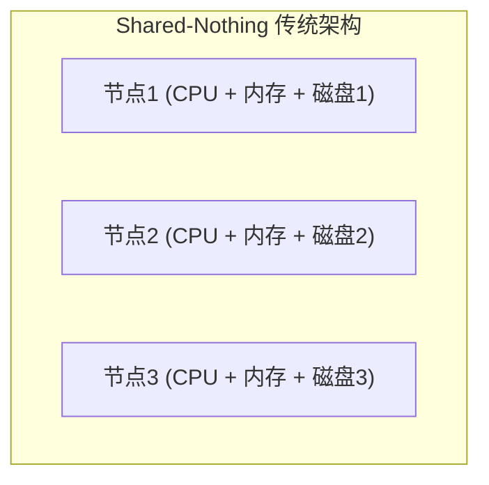
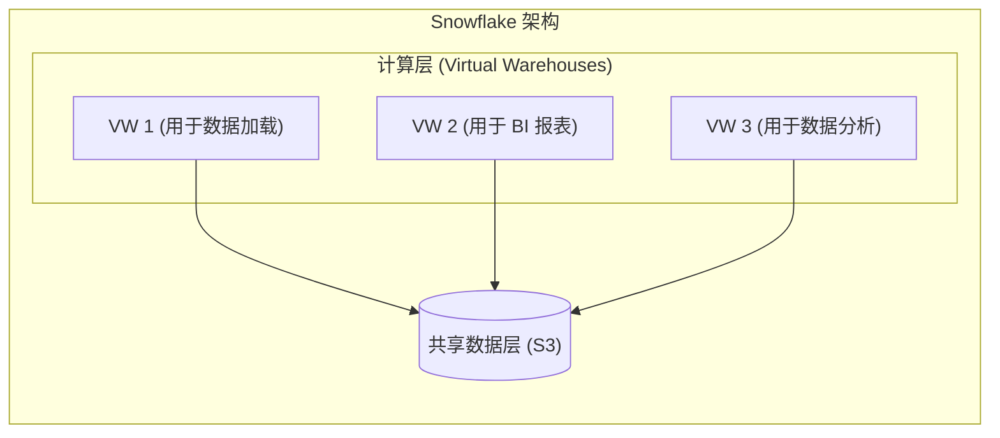
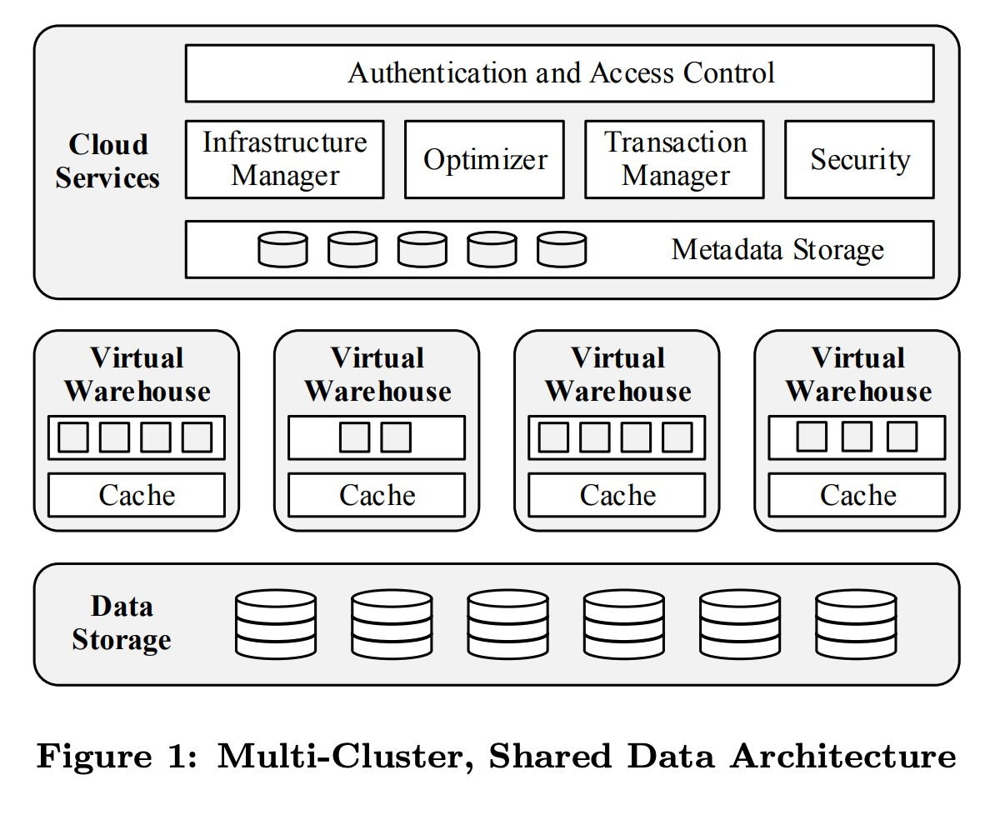
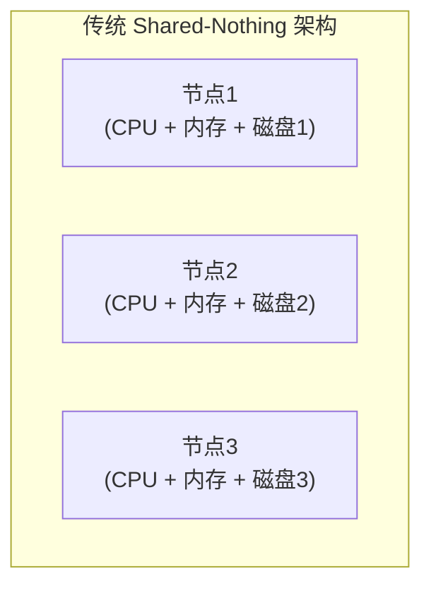
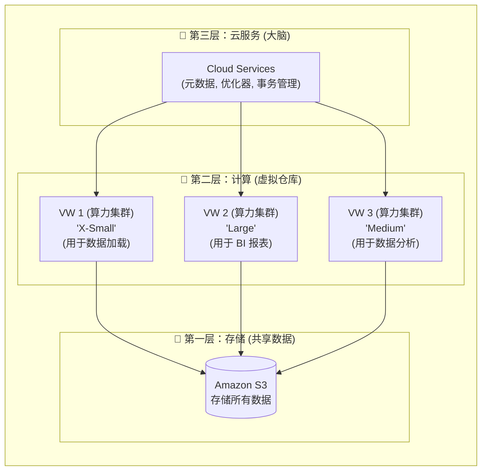
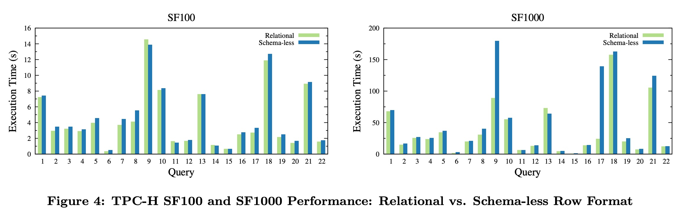
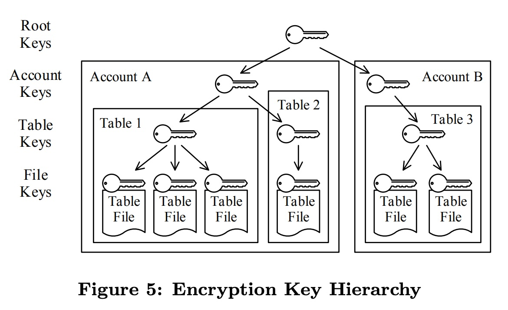
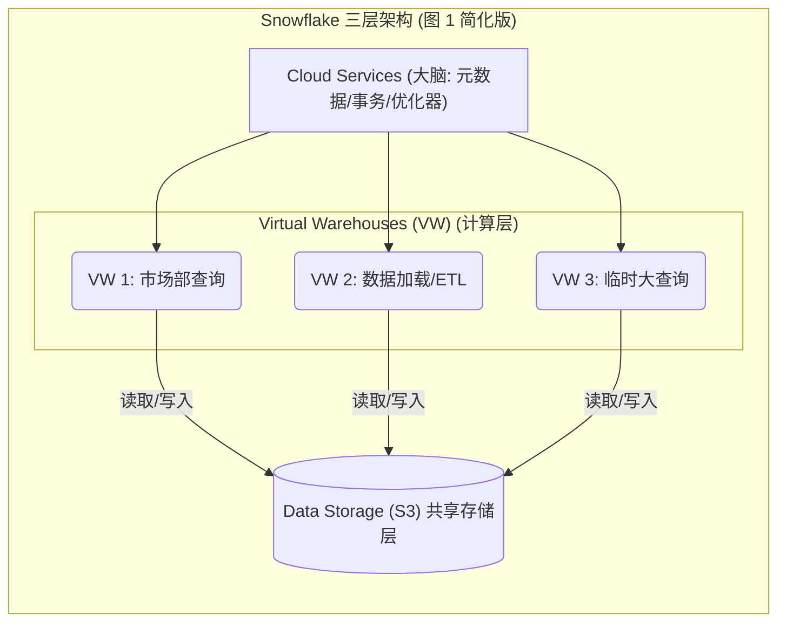

## AI论文解读 | The Snowflake Elastic Data Warehouse
        
### 作者        
digoal        
        
### 日期        
2025-11-10        
        
### 标签        
PostgreSQL , PolarDB , DuckDB , AI , 论文解读        
        
----        
        
## 背景  
      
https://dl.acm.org/doi/pdf/10.1145/2882903.2903741        
  
提示:          
```          
读懂《The Snowflake Elastic Data Warehouse》这篇论文需要提前掌握哪些基础知识, 请使用中文通熟易懂的讲解这些基础知识, 可以引用论文中的图、表或使用Markdown支持的图形(text,mermaid等)增加解释性. 
  
使用中文通熟易懂的解读《The Snowflake Elastic Data Warehouse》这篇论文, 其中的关键内容请着重讲解, 可以引用论文中的图、表或使用Markdown支持的图形(text,mermaid等)增加解释性. 
  
提取《The Snowflake Elastic Data Warehouse》这篇论文中的重要术语, 使用中文对这些术语进行通熟易懂的讲解, 可以引用论文中的图、表或使用Markdown支持的图形(text,mermaid等)增加解释性. 
```     
  
## 1 前置知识 
  
这是一篇数据库领域的经典论文 ，它奠定了现代云数据仓库的基础。要完全读懂它，你需要对传统数据库、分布式系统和云计算有一些基础了解。

简单来说，这篇论文的核心是**重新思考**如何在“云”这个新环境（而不是传统的数据中心）上构建一个数据仓库 。

以下是你需要提前掌握的基础知识，我会用通俗的语言为你讲解：

### 1\. 核心前提：数据库架构的演进

这是理解本篇论文**最重要**的知识点。你需要知道 Snowflake *之前* 的系统是什么样的，才能明白 Snowflake 的创新之处。

#### 传统架构：Shared-Nothing (SN，无共享)

在 Snowflake 之前，高性能数据仓库（如 Teradata, Greenplum, Redshift ）普遍采用 **Shared-Nothing (SN)** 架构 。

  * **它是什么？** 想象一个集群由多台服务器（节点）组成。在 SN 架构中，每个节点都有**自己专属**的 CPU、内存和**本地磁盘** 。
  * **数据如何存储？** 数据被水平切分（分区）后，分散存储在各个节点的本地磁盘上 。节点 A 只负责处理磁盘 A 上的数据，节点 B 只负责处理磁盘 B 上的数据。




#### SN 架构的“天花板”

这篇论文指出，SN 架构在云时代遇到了大问题，因为它 **“紧密耦合了计算资源和存储资源”** 。

  * **问题1：扩容极不“弹性”** 。

      * **场景：** 你的查询变慢了，想增加计算能力，于是你增加了一个新节点（节点4）。
      * **SN的麻烦：** 因为数据必须和计算节点绑定，你必须停下来，把节点1、2、3 上的数据拿出**一部分**，“重洗牌”(reshuffle)  并移动到节点4 的磁盘上。这个过程非常慢，且会严重影响正在运行的查询 。
      * **云的诉求：** 云计算的核心是“弹性” ，即我希望在1分钟内增加100台机器来运行一个复杂查询，1小时后查询结束，再把这100台机器还回去。SN 架构显然做不到。

  * **问题2：资源浪费** 。

      * **场景：** 你的工作负载通常有两种：
        1.  **加载数据 (Load)：** 主要消耗磁盘 I/O 和网络带宽 。
        2.  **复杂查询 (Query)：** 主要消耗 CPU 和内存 。
      * **SN的麻烦：** 你必须购买一台“均衡”的机器，它既有强大的 I/O *也* 有强大的 CPU。但当你加载数据时，CPU 在“摸鱼”；当你复杂查询时，磁盘 I/O 在“摸鱼”。你无法按需配置，导致“低平均利用率” 。

-----

#### Snowflake 的解决方案：多集群、共享数据 (Multi-cluster, Shared-data)

理解了 SN 的痛点，Snowflake 的设计就豁然开朗了。

  * **它做了什么？** 论文的核心创新就是 **“分离存储和计算”** 。
  * **如何实现？**
    1.  **共享数据 (Shared Data)：** 所有数据都存储在一个**统一的、共享**的地方（在论文中，是 Amazon S3 ）。
    2.  **多集群 (Multi-cluster)：** “计算”资源（论文中称为**虚拟仓库 Virtual Warehouse, VW** ）是**无状态** (stateless) 的。它们是纯粹的计算集群 。




  * **解决了什么问题？**
      * **弹性扩容：** 想加算力？**立即**启动一个全新的 VW 3 。它不需要“重洗牌”数据，因为数据本来就在 S3 中，所有 VW 都能访问 。
      * **资源隔离：** 数据加载 (VW 1) 和 BI 报表 (VW 2) 使用**不同**的计算集群 。它们读取相同的数据，但互不干扰。这在 SN 架构中是无法想象的。
      * **按需付费：** 没有查询时？你可以关闭**所有** VW (计算) ，只为廉价的 S3 存储付费。

  

> **提示：** 论文中的 **图 1**  直观地展示了这个三层架构：  
> * **Data Storage (S3)**   
> * **Virtual Warehouses (Compute)**   
> * **Cloud Services (Brain)**    

### 2\. 关键背景：云计算与 SaaS

  * **SaaS (软件即服务)** ：你不需要“安装”Snowflake。它是一个像 Gmail 一样的服务 。你只需要一个浏览器 ，注册账号，上传数据，就可以开始查询。论文强调，这种“纯 SaaS 体验”意味着系统没有复杂的“调优旋钮” 。
  * **云存储 (如 S3) 的特性**：S3  是一种**对象存储**，不是传统的文件系统。它有两个关键特性，深刻影响了 Snowflake 的设计：
    1.  **高延迟** ：访问 S3 比访问本地磁盘要慢得多。
    2.  **文件不可变 (Immutable)** ：你不能“修改” S3 上的一个文件。你只能删除旧文件，然后上传一个新文件 。

### 3\. 数据库内部原理

为了克服 S3 的高延迟并实现高性能，Snowflake 在其计算引擎（VW）中采用了一些先进的数据库技术。

  * **MVCC (多版本并发控制)** 

      * **背景：** 因为 S3 文件是不可变的 ，当你要 `UPDATE` 一条数据时，Snowflake 不能去修改旧文件。
      * **Snowflake的做法：** 它会将包含修改的**新数据写入一个新文件** 。元数据（在 Cloud Services 层 ）会记录下：版本1 = {文件A, 文件B}，版本2 = {文件A, 文件C} (文件C是修改后的版本)。
      * **带来的好处：** 这个机制天然地实现了 **“Time Travel” (时间旅行)** 。因为旧文件（文件B）还在 S3 上（保留一段时间 ），所以你可以查询“5分钟前”的数据 。

  * **列式存储 (Columnar Storage)** 

      * 数据仓库的查询通常只关心少数几列（例如 `SUM(销售额)`），而不是所有列。
      * Snowflake 将数据按**列**存储在一起 。这样，查询 `SUM(销售额)` 时，它只需要读取“销售额”这一列的数据，而不用读取“客户地址”、“备注”等无关列，极大提升了 I/O 效率。

  * **Pruning (数据剪枝)** 

      * **背景：** 传统的数据库使用**索引 (Index)** （ 如 $B^+$-tree ）来快速定位数据。但维护索引在云存储上代价很高 。
      * **Snowflake的做法：** Snowflake **不使用**传统索引 。它使用一种叫 **Pruning**  的技术。
      * **它是什么？** Snowflake 在存储数据文件时，会额外在元数据中记录每个文件的“摘要”信息，比如这个文件里“日期列”的**最小值和最大值**（例如 2024-01-01 到 2024-01-31） 。
      * **如何工作？** 当你查询 `WHERE 日期 = '2024-03-15'` 时，优化器查看元数据，发现这个文件里的日期最大才到 1 月 31 日，因此**跳过读取**整个文件 。

  * **ETL vs. ELT (数据处理流程)**

      * **传统 (ETL)：** Extract (提取) -\> **Transform (转换)** -\> Load (加载)。你必须在数据**加载前**就定义好所有的数据结构 (Schema)，这个过程非常僵化 。
      * **Snowflake (ELT)：** Extract (提取) -\> **Load (加载)** -\> **Transform (转换)** 。Snowflake 允许你先把“原始的”半结构化数据（如 JSON） **直接加载** 到一个叫 `VARIANT`  的“万能”列中 ，**之后**再用 SQL 慢慢地去解析和转换它 。这被称为 "Schema-later" (晚期模式) ，提供了极大的灵活性。

-----

### 总结

你需要的基础知识地图：

1.  **架构 (核心)：** 懂“Shared-Nothing” ，才能明白“Shared-Data”  的革命性。
2.  **云计算 (背景)：** 懂“SaaS” 、“弹性”  和“S3 的不可变性” ，才能理解 Snowflake 的设计取舍。
3.  **数据库 (内部)：** 懂“MVCC” 、“列式存储”  和“Pruning (剪枝)” ，才能明白它为什么快。
4.  **数据格式 (应用)：** 懂“JSON”  和“ETL vs. ELT” ，才能理解它的灵活性。

掌握了这些，你就能明白，Snowflake 并不是发明了所有技术，而是巧妙地将（云存储、MVCC、列式存储、SaaS）这些理念组合起来，专门为云环境“量身定做”了一个全新的数据仓库 。

希望这能帮助你开始阅读这篇论文！你需要我为你详细解释其中某一个概念吗（比如 MVCC 或 Pruning）？
  
## 2 解读论文 
  
这是一篇在数据库和云计算领域具有里程碑意义的论文 。它描述了 Snowflake，一个**完全为云而生**（而不是从传统软件修改而来）的企业级数据仓库 。

这篇论文的核心思想是：**传统的数据仓库架构在云时代已经过时 ，我们必须重新设计一个能充分利用云“弹性”的架构。**

以下是对这篇论文关键内容的通俗易懂的解读。

-----

### 1\. 问题的根源：传统架构的“天花板”

在 Snowflake 之前，主流的数据仓库（如 Teradata, Vertica, Redshift）大多采用 **"Shared-Nothing" (SN, 无共享) 架构** 。

  * **SN 架构是什么？** 想象一下，你有多台服务器，每台服务器都带着自己的 CPU、内存和**本地磁盘**。你把数据（比如一张大表）切成 10 份，每台服务器存一份，并只负责处理自己磁盘上的那份数据。




这种架构在“本地数据中心”时代很高效，但在“云”时代却遇到了两个致命问题 ：

1.  **计算和存储被“锁死”** ：SN 架构最大的问题是 **“计算资源和存储资源紧密耦合”** 。

      * **场景：** 你的数据仓库里有 100TB 数据，但现在是下班时间，没人查询。你**仍然**要为那 100TB 存储所绑定的所有服务器（CPU/内存）付费，无法“只关机、不删数据”。
      * **场景：** 你的数据量没变，但突然来了个复杂的报表查询，你需要 10 倍的算力。你**必须**增加新服务器，并且痛苦地执行“数据重分布” (reshuffle)，把原来服务器上的数据“挪”一部分到新服务器上。这个过程极慢且影响服务 。

2.  **资源利用率低**：不同的工作负载（Workload）需求不同。

      * **数据加载 (ETL)** 需要高 I/O 带宽 。
      * **复杂查询 (BI)** 需要高 CPU 和内存 。
      * 在 SN 架构下，你只能买一种“均衡”的机器，导致加载时 CPU 闲着，查询时 I/O 闲着，造成“低平均利用率” 。

-----

### 2\. Snowflake 的核心创新：多集群、共享数据

为了解决上述问题，Snowflake 提出了一个全新的架构：**"Multi-cluster, Shared-data" (多集群、共享数据)** 。

这个架构的核心是 **“彻底分离存储和计算”** 。

请看这篇论文的 **图 1**（我用 Mermaid 绘制一个简化版来帮助理解）：



这个架构分为三层，每一层都可以**独立扩展**：

#### 🥇 第一层：数据存储 (Data Storage)

  * 这是所有数据的唯一“家”。Snowflake 使用像 Amazon S3 这样的云“Blob 存储”来存放所有数据 。
  * 数据被压缩并以**列式 (Columnar)** 格式存储在不可变的文件中 。
  * **关键点：** 存储是共享的 。所有计算集群都能访问**同一份**数据。

#### 🥈 第二层：虚拟仓库 (Virtual Warehouses, VW)

  * 这是系统的“肌肉” (muscle)，是纯粹的**计算资源**（如 EC2 实例） 。
  * 用户可以创建**多个** VW，每个 VW 都是一个独立的计算集群 。
  * **这就是“弹性”的体现：**
      * **资源隔离：** 你可以创建一个 VW (VW 1) 专门用来加载数据，再创建一个 VW (VW 2) 专门给 BI 报表用。它们访问的是同一份 S3 上的数据，但**计算上互不干扰** 。
      * **按需伸缩：** VW 有“T恤尺码”（如 X-Small, Large） 。你可以在查询运行时，**瞬间**把 VW 从 X-Small 调到 X-Large 来提速。
      * **按需启停：** 当你下班时，你可以**关掉所有 VW** 。此时你不产生任何计算费用，但你的数据（在 S3 中）完好无损。

#### 🥉 第三层：云服务 (Cloud Services)

  * 这是系统的“大脑” (brain) 。它是一个多租户（multi-tenant）服务，负责协调一切 。
  * 它包含：查询优化器 、事务管理器 、元数据管理器（比如，表 `T` 由 S3 上的哪些文件组成）、安全和访问控制 。

**（重要）缓存如何工作？**
你可能会问：S3 访问很慢，怎么办？论文中提到，每个 VW 的计算节点都有**本地磁盘缓存** 。当 VW 1 第一次查询数据时，它会从 S3 下载文件并缓存在本地 SSD 上 。下次再查，就直接读缓存，速度非常快 。

-----

### 3\. 架构带来的“黑科技”特性

这种“存算分离”架构，让 Snowflake 得以实现几个在传统数据库上很难做到的“黑科技”：

#### 1\. 半结构化数据 (JSON) 的原生支持

  * **问题：** 传统 DW 只能处理结构化的表，而云应用产生了大量的 JSON 或 Avro 数据 。
  * **Snowflake 方案：** 提供了 `VARIANT` 数据类型 。
      * 你可以直接把一整个 JSON 文档加载到 `VARIANT` 列中 。这实现了 **ELT**（先加载 Load，后转换 Transform），而不是传统的 ETL（必须先转换）。
      * **性能如何？** 这不是简单的文本存储。Snowflake 会在后台自动分析 `VARIANT` 中的数据，**自动**将其中的“热”路径（比如 `doc:user.name`）提取出来，用和原生数据一样的**列式格式**存储 。
      * **结果 (图 4)：** 论文中的 **图 4** 显示，查询“无模式”(Schema-less) 的 JSON 数据，性能几乎与查询“关系型”数据**一样快** 。    

#### 2\. 时间旅行 (Time Travel) 和 零拷贝克隆 (Cloning)

这是“存算分离” + “不可变文件”带来的最大惊喜。

  * **原理：** 当你 `UPDATE` 一张表时，Snowflake 不会去“修改” S3 上的旧文件（因为 S3 文件是不可变的 ）。它会**写入新的文件**，然后“大脑”（元数据）会记下：

      * `Table_V1 = {File_A, File_B}`
      * `Table_V2 = {File_A, File_C}` (File\_C 是更新后的数据)

  * 旧的文件 (File\_B) 不会马上删除 。

  * **时间旅行 (Time Travel)：**

      * 因为旧文件还在，Snowflake 允许你查询“过去”的数据 。
      * 你可以用 SQL 直接写：`SELECT * FROM my_table AT (OFFSET => -60*5);` （查询 5 分钟前的数据）。
      * 你甚至可以 `UNDROP DATABASE` 来恢复一个被误删的数据库 。

  * **零拷贝克隆 (Zero-Copy Cloning)：**

      * 当你执行 `CREATE TABLE new_table CLONE old_table;` 时，Snowflake **不需要拷贝任何数据** 。
      * 它只做一件事：复制 `old_table` 的**元数据** 。
      * 瞬间，`new_table` 就创建好了。它和 `old_table` 共享 S3 上的所有数据文件 。只有当你修改 `new_table` 时，它才会开始写入属于自己的新文件。

#### 3\. 端到端的安全 (End-to-End Security)

  * Snowflake 被设计为多租户 SaaS，因此安全是重中之重。
  * 所有数据（无论在网络、本地缓存、还是S3） **始终是加密的** 。
  * 它使用一个**分层的密钥模型**（论文中的 **图 5** 展示了这一点 ）。密钥被自动轮换 ，根密钥存储在硬件安全模块 (HSM) 中 ，确保了极高的安全性。    

-----

### 总结：经验教训

论文最后总结了他们的经验教训：

1.  **“弹性”比“速度”更重要：** 用户发现，即使某个查询慢，他们也可以通过**临时调大 VW 规模**（比如从 S 调到 XL）来解决 。这种按需付费的“弹性”能力，比系统“单节点”的原始速度更受用户欢迎 。
2.  **SaaS 模式的胜利：** 纯 SaaS 模式 + 在线升级（论文 **图 3** 所述的无缝升级 ）使他们能够每周迭代和发布新功能 。    
3.  **JSON 需求远超预期：** 他们原以为 JSON 支持只是个“添头”，结果发现市场需求巨大 。Snowflake 甚至取代了很多公司专门用于“转换 JSON”的 Hadoop 集群 。

这篇论文定义了现代云数据仓库的蓝图：一个以服务为中心、存储计算分离、具备极致弹性和强大数据（包括半结构化）处理能力的系统。

这篇论文中还有很多细节，比如它的查询执行引擎、并发控制等。您想深入了解其中哪一个特定部分吗？
  
## 3 术语 
  
这篇《The Snowflake Elastic Data Warehouse》论文提出了一个为云计算环境重新设计的革命性数据仓库架构。要理解这篇论文，关键在于掌握它如何克服传统数据库的局限性，并充分利用云的特性。

以下是论文中最重要的核心术语及其通俗易懂的中文讲解，并引用了论文中的内容进行解释。

-----

### 一、 核心架构理念：存算分离的革命

#### 1\. Multi-cluster, Shared-data Architecture (多集群、共享数据架构)

  * **中文解释：** 这是 Snowflake 区别于传统数据仓库的**最核心设计** 。它彻底将数据存储和计算处理分离开来。

      * **Shared-data（共享数据/存储）：** 所有数据都存储在一个统一的、高可用、高耐久的云存储服务中（如 Amazon S3） 。
      * **Multi-cluster（多集群/计算）：** 查询计算是在多个独立、弹性的计算集群上完成的（即“虚拟仓库”） 。

  * **解决了什么问题（对比传统 Shared-Nothing）？**

      * 在传统的 **Shared-Nothing (SN, 无共享)** 架构中，计算和存储是紧密耦合的，扩容时需要重新移动数据 (reshuffle)，非常缓慢且影响性能 。
      * 在 Snowflake 中，计算集群（VW）和存储（S3）相互独立，可以**独立伸缩**，无需数据移动 。

  



#### 2\. Virtual Warehouse (VW, 虚拟仓库)

  * **中文解释：** 这是 Snowflake 中的**计算资源**抽象 。它们是临时的 EC2 虚拟机集群 。
  * **关键特性：**
      * **纯计算资源：** VW 是无状态的，它们只负责查询执行，不存储任何永久数据 。
      * **弹性伸缩：** VW 可以根据用户需求**随时创建、销毁或调整大小**（T恤尺码：X-Small 到 XX-Large） 。在没有查询时，VW 可以完全关闭，用户无需支付计算费用 。
      * **性能隔离 (Isolation)：** 不同的 VW 之间不共享计算节点 ，确保一个部门或一个任务的复杂查询不会影响到另一个部门或任务的性能 。

#### 3\. Cloud Services Layer (云服务层)

  * **中文解释：** 这是 Snowflake 系统的“大脑” 。它是一个多租户（Multi-tenant）服务，负责协调和管理整个系统 。
  * **主要职责：**
      * **元数据存储：** 记录哪些 S3 文件属于哪张表、数据统计信息等 。
      * **事务管理与并发控制：** 确保数据的 ACID 特性 。
      * **查询优化器：** 生成查询执行计划 。
      * **安全与认证：** 访问控制、加密密钥管理等 。

-----

### 二、 核心机制：高性能与数据管理

#### 4\. Immutable Files & MVCC (不可变文件与多版本并发控制)

  * **不可变文件 (Immutable Files)：** 由于底层云存储（如 S3）限制，文件只能完全覆盖，不能追加或修改 。因此，Snowflake 将表数据划分为大型的、**不可变**的文件块 。
  * **MVCC (Multi-Version Concurrency Control, 多版本并发控制)：** Snowflake 基于 MVCC 来实现 ACID 事务 。
      * **如何工作？** 当你修改（`UPDATE`, `DELETE`）数据时，系统不会修改旧文件，而是写入包含修改数据的**新文件** 。元数据层记录了哪个版本（Snapshot）的表由哪组文件组成 。
      * **益处：** 这种设计为 **Time Travel (时间旅行)** 和 **Cloning (克隆)** 功能提供了天然的基础 。

#### 5\. Time Travel and Cloning (时间旅行与克隆)

  * **Time Travel (时间旅行)：** 因为旧版本的文件会保留一段时间，用户可以查询数据库的**历史快照** 。例如，可以查询“5分钟前”的数据，甚至恢复一个被误删除的数据库 (`UNDROP DATABASE`) 。
  * **Cloning (克隆) / Zero-Copy Cloning (零拷贝克隆)：**
      * 这是一个高效创建表、模式或数据库副本的功能 。
      * **原理：** 当克隆一张表时，系统**不会复制任何物理数据文件** 。它只会在元数据中复制一份指针。
      * **益处：** 克隆操作是瞬间完成的 (zero-copy) 。新的表和旧的表共享数据文件，直到其中一个表被修改，才会开始写入新的文件 。

#### 6\. Pruning (剪枝)

  * **中文解释：** 一种替代传统 B-tree 索引的**查询优化技术** 。
  * **传统索引的局限性：** 传统索引依赖随机访问，这对于基于 S3 的压缩文件存储来说效率很低，且维护成本高、需要用户手动干预 。
  * **Pruning (剪枝) 原理：** Snowflake 会自动为每个数据文件块维护额外的元数据（如该文件内某一列的**最小值和最大值**） 。
  * **如何工作？** 当一个查询带有 `WHERE` 条件时（例如 `WHERE x >= 6`），查询优化器会查看元数据。如果一个文件记录的 $x$ 的最大值才到 5，那么整个文件都会被**跳过 (Pruned)**，无需下载和读取，从而大大减少了 I/O 。

#### 7\. Columnar Storage & Vectorized Execution (列式存储与向量化执行)

  * **Columnar Storage (列式存储)：**
      * 数据不是按行存储，而是按列存储 。
      * **益处：** 数据仓库查询通常只需要读取少数几列（如求和）。列式存储可以只读取需要的列，减少 I/O 。同时，相同列的数据类型一致，压缩效率更高 。
  * **Vectorized Execution (向量化执行)：**
      * 查询执行引擎以**列式批量**（批处理，通常几千行）的方式处理数据，而不是一次处理一行 。
      * **益处：** 这种流水线式的处理方式能更有效地利用 CPU 缓存和 SIMD 指令 ，大大提高处理效率 。

-----

### 三、 独特的云数据特性

#### 8\. Semi-Structured and Schema-less Data (半结构化与无模式数据)

  * **中文解释：** 指对 JSON 和 Avro 等格式的原生支持 。
  * **Snowflake 的创新：** 引入了 `VARIANT` 数据类型来存储完整的 JSON 文档 。
  * **性能保证：** 系统会自动分析 `VARIANT` 列中的数据路径，并将其转换为高效的**列式格式**进行存储和优化 。这使得查询半结构化数据的速度“几乎与查询普通关系型数据一样快” 。

#### 9\. ELT (Extract-Load-Transform)

  * **中文解释：** 一种数据集成流程，与传统的 ETL (Extract-Transform-Load) 相对。
      * **传统 ETL：** 必须先定义好严格的模式，**转换 (Transform)** 数据后才能加载 。
      * **Snowflake ELT：** 允许用户先将原始数据（即使是 JSON 这种**无模式**数据） **加载 (Load)** 到仓库中，**之后**再使用 SQL 进行转换和分析 。
      * **益处：** 提供了极大的灵活性，简化了数据管道，用户不再需要复杂的外部 ETL 工具来预处理数据 。
  
## 参考        
         
https://dl.acm.org/doi/pdf/10.1145/2882903.2903741    
        
<b> 以上内容基于DeepSeek、Qwen、Gemini及诸多AI生成, 轻微人工调整, 感谢杭州深度求索人工智能、阿里云、Google等公司. </b>        
        
<b> AI 生成的内容请自行辨别正确性, 当然也多了些许踩坑的乐趣, 毕竟冒险是每个男人的天性.  </b>        
    
#### [PolarDB 学习图谱](https://www.aliyun.com/database/openpolardb/activity "8642f60e04ed0c814bf9cb9677976bd4")
  
  
#### [PostgreSQL 解决方案集合](../201706/20170601_02.md "40cff096e9ed7122c512b35d8561d9c8")
  
  
#### [德哥 / digoal's Github - 公益是一辈子的事.](https://github.com/digoal/blog/blob/master/README.md "22709685feb7cab07d30f30387f0a9ae")
  
  
#### [About 德哥](https://github.com/digoal/blog/blob/master/me/readme.md "a37735981e7704886ffd590565582dd0")
  
  

  
