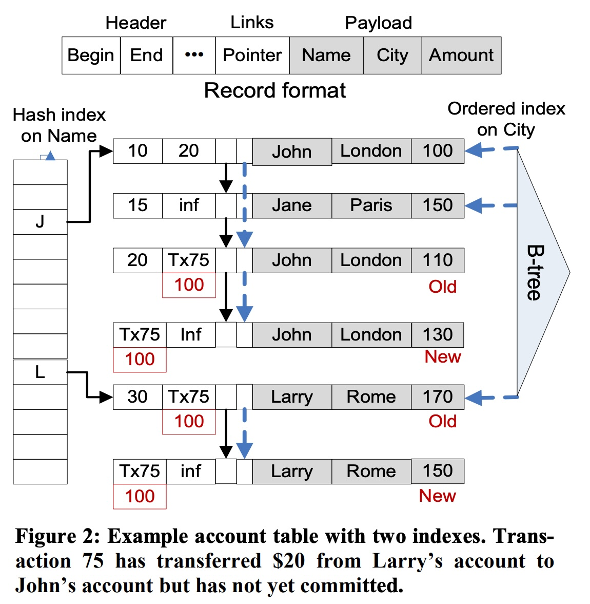
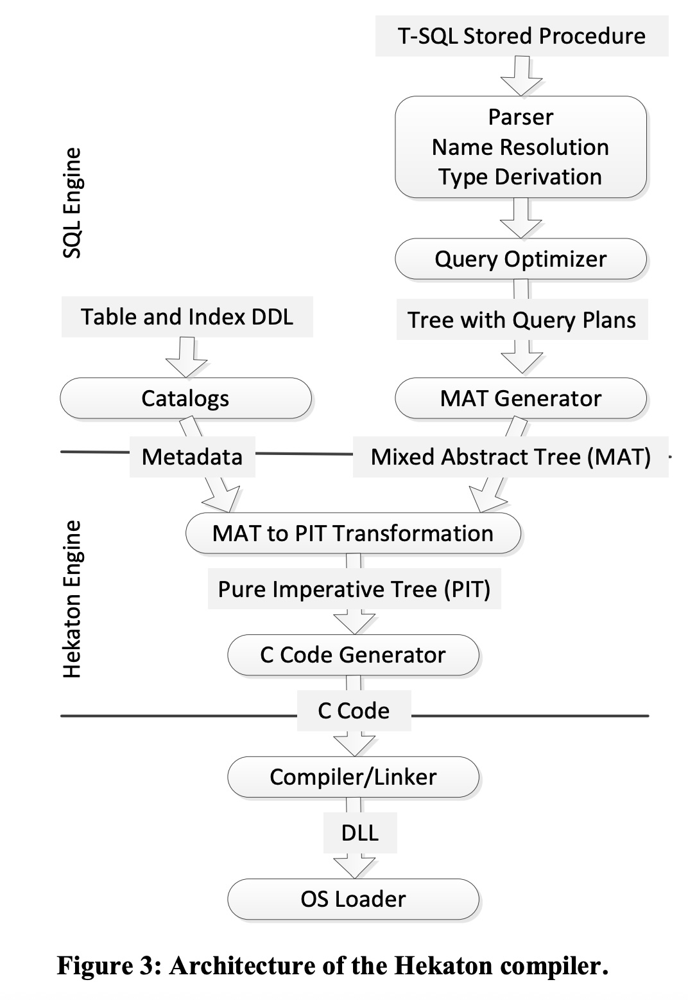
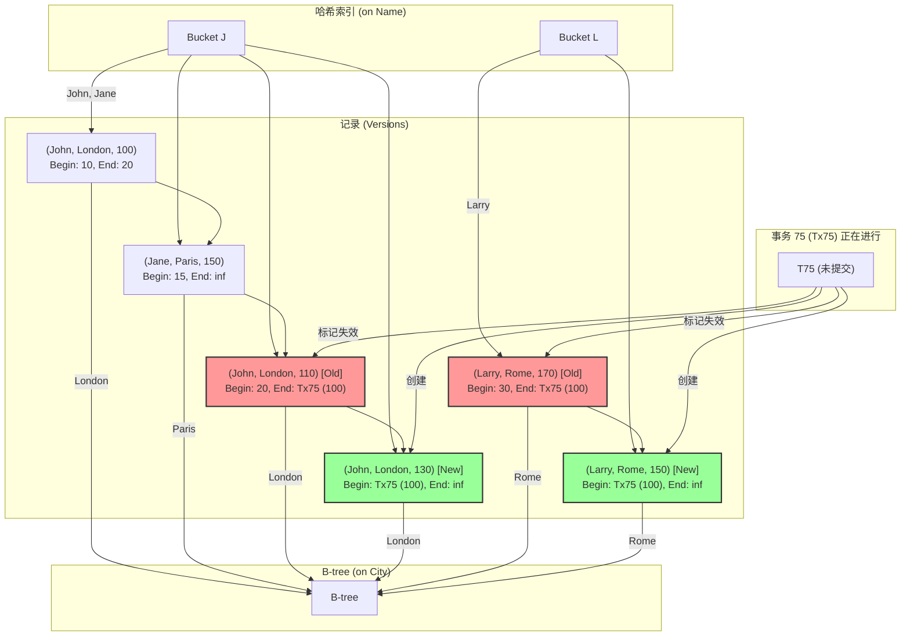
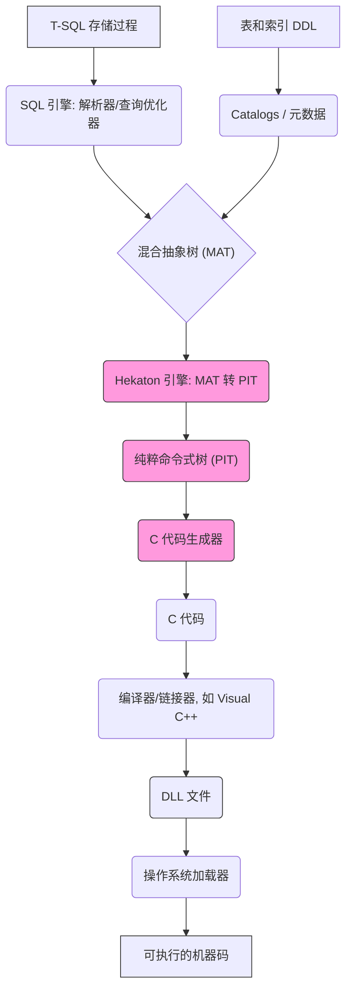
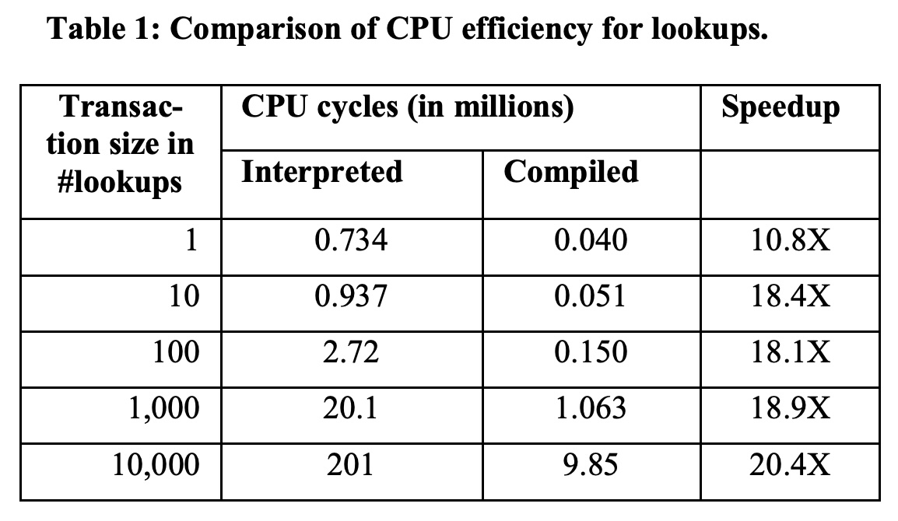
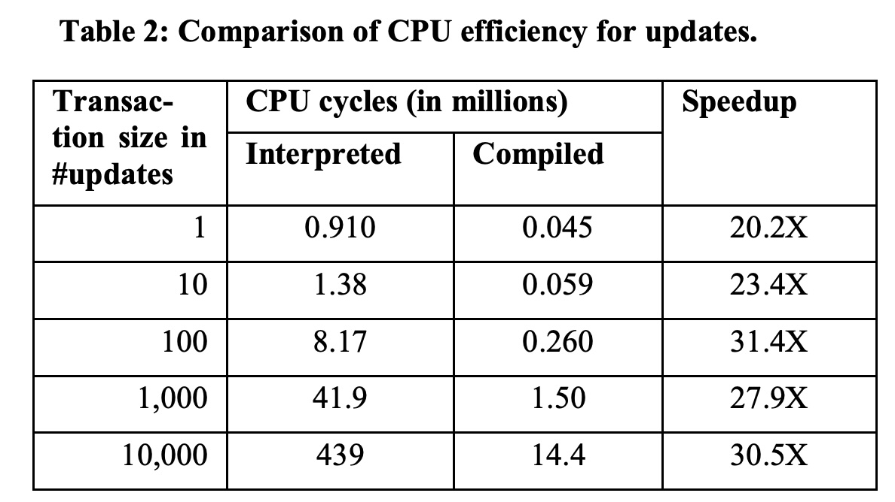
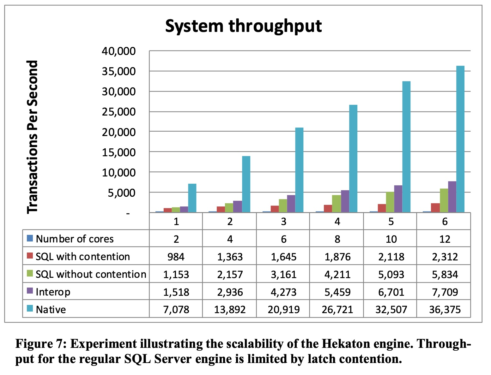

## AI论文解读 | Hekaton: SQL Server’s Memory-Optimized OLTP Engine
        
### 作者        
digoal        
        
### 日期        
2025-11-11        
        
### 标签        
PostgreSQL , PolarDB , DuckDB , AI , 论文解读        
        
----        
        
## 背景  
      
https://www.microsoft.com/en-us/research/wp-content/uploads/2013/06/Hekaton-Sigmod2013-final.pdf        
  
提示:          
```          
读懂《Hekaton: SQL Server’s Memory-Optimized OLTP Engine》这篇论文需要提前掌握哪些基础知识, 请使用中文通熟易懂的讲解这些基础知识, 可以引用论文中的图、表或使用Markdown支持的图形(text,mermaid等)增加解释性. 
  
使用中文通熟易懂的解读《Hekaton: SQL Server’s Memory-Optimized OLTP Engine》这篇论文, 其中的关键内容请着重讲解, 可以引用论文中的图、表或使用Markdown支持的图形(text,mermaid等)增加解释性. 
  
提取《Hekaton: SQL Server’s Memory-Optimized OLTP Engine》这篇论文中的重要术语, 使用中文对这些术语进行通熟易懂的讲解, 可以引用论文中的图、表或使用Markdown支持的图形(text,mermaid等)增加解释性. 
```     
  
## 1 前置知识 
  
很高兴能为您解读这篇经典的数据库论文。Hekaton (现在称为 SQL Server In-Memory OLTP) 是数据库领域的一个里程碑。要完全读懂它，您需要具备一些数据库、操作系统和编译原理的基础知识。

我将为您梳*理这些知识点，并尽量用通俗易懂的语言来解释：

### 1. 核心概念：什么是 "内存优化 OLTP"？

首先，我们来拆解论文的标题和摘要中出现的几个关键术语 。

* **OLTP (在线事务处理):**
    * **是什么？** 想象一下**电商网站的下单操作**、**银行转账**或**抢票系统**。这些场景的特点是：有大量用户同时在进行操作，但每次操作（称为“事务”）都很简单，比如插入一条订单、更新一下账户余额 。
    * **有什么挑战？** 挑战在于要**极快地**处理**海量并发**的请求。

* **"传统" 数据库 (基于磁盘):**
    * **是如何工作的？** 传统数据库（如论文中提到的老 SQL Server）假设数据主要存储在**慢速的硬盘 (Disk)** 上 。
    * **有什么问题？** 它们的核心设计是围绕着一个叫 **"缓冲池" (Buffer Pool)** 的组件。当需要数据时，必须先把数据从硬盘读取到内存的缓冲池中 。这个过程需要加锁（称为 "latch"）来管理，非常耗时，在CPU指令层面开销巨大 。

* **"Hekaton" 数据库 (内存优化):**
    * **是如何工作的？** Hekaton 抓住了一个时代趋势：**内存 (RAM) 已经变得非常便宜和巨大** 。
    * **有什么优势？** 它假设所有“热”数据都**常驻在内存中** 。因此，它**彻底抛弃了缓冲池**，以及随之而来的所有管理开销，从根本上改变了设计 。

> **您需要掌握的知识点：**
> * 了解 **OLTP (事务处理)** 和 OLAP (分析处理) 的区别。
> * 理解传统数据库**基于磁盘的设计**和**缓冲池 (Buffer Pool)** 的概念。

---

### 2. 关键技术一：无锁与多版本 (并发控制)

这是 Hekaton 实现高性能的**第一个核心秘密**。传统数据库在处理并发时，就像是在一个十字路口装满了红绿灯。

* **传统方式：悲观锁 (Pessimistic Locking)**
    * **是什么？** 当一个用户（事务 A）要修改某行数据时，会先“锁”住这行数据 。
    * **有什么问题？** 如果此时用户 B 也要修改或读取这行数据，就必须**排队等待**，直到 A 释放锁 。当并发量极高时，大家都在互相等待，系统就堵死了。这种锁在系统底层称为 **Latch (闩锁)**，是并发的头号杀手 。

* **Hekaton 方式：乐观锁 (Optimistic) + MVCC (多版本)**
    * **是什么？** Hekaton 的设计原则是“**不使用任何 Latch 和 Lock**” 。
    * **如何实现？** 它使用了一种叫做 **"多版本并发控制" (MVCC)** 的技术 。
    * **通俗解释 MVCC：**
        * 当修改数据时，Hekaton **不会在原地修改**，而是会**创建一个新版本**的数据 。
        * 每个数据版本都有 **“生效时间” (Begin)** 和 **“失效时间” (End)** 两个时间戳 。
        * **读取操作** (事务 A) 只会去读在它开始时刻“有效”的版本。
        * **写入操作** (事务 B) 会创建新版本，并把旧版本的“失效时间”标记为自己的提交时间。
        * **结果：** 读和写操作在操作不同版本的数据，**互不干扰，无需等待！** 。

* **看懂论文图 2 (Figure 2):**    
    * 这张图完美地展示了 MVCC 。
    * **John 的账户：** 最早有 100 元 (版本1: 有效时间 10-20) 。在 20 这个时间点，被更新为 110 元 (版本2: 有效时间 20-100) 。
    * **事务 75 (Tx75)：** 这是一个正在进行的事务，它想把 John 的 110 元改成 130 元 。它创建了 (John, 130) 这个**新版本 (New)**，并把 (John, 110) 标记为**旧版本 (Old)** 。
    * **并发：** 在 Tx75 **提交之前**，其他所有事务来读取 John 的数据，看到的**依然是 110 元**那个版本。这就是 Hekaton 实现高并发、不阻塞的原理。

> **您需要掌握的知识点：**
> * 理解**数据库事务 (Transaction)** 的基本概念 (ACID)。
> * 理解**并发控制 (Concurrency Control)** 的必要性。
> * 理解**悲观锁 (Pessimistic)** 和**乐观锁 (Optimistic)** 的核心思想。
> * 重点掌握 **MVCC (多版本并发控制)** 的工作原理（即通过版本链实现“读写不冲突”）。

---

### 3. 关键技术二：查询编译 (Query Processing)

这是 Hekaton 实现高性能的**第二个核心秘密**：消灭 CPU 指令开销。

* **传统方式：解释执行 (Interpretation)**
    * **是什么？** 传统数据库执行一条 T-SQL 语句时，就像一个“翻译官” (解释器) 。它会拿到一个“执行计划”(Query Plan)，然后一步一步地“解释”给 CPU 听。
    * **有什么问题？** 这个“翻译”过程本身非常耗时。论文指出，哪怕一个很简单的事务，也可能要执行**几十万条 CPU 指令** 。这在内存时代是完全无法接受的。

* **Hekaton 方式：编译成原生代码 (Native Compilation)**
    * **是什么？** Hekaton 采取了一种激进的策略：**把 T-SQL 存储过程直接编译成机器码 (Machine Code)** 。
    * **通俗解释：**
        1.  当您创建一个 Hekaton 的存储过程时...
        2.  Hekaton 会像 C++ 编译器一样，把您的 T-SQL 逻辑（包括查询计划） **转换成 C 代码** 。
        3.  然后调用 Visual C++ 编译器，把 C 代码编译成一个 **DLL (动态链接库)** 文件 。
    * **有什么优势？** 当您下次调用这个存储过程时，SQL Server 会**直接执行这段高效的机器码** 。它跳过了所有“解释”的开销，论文称这是“目前为止最快的数据访问方式” 。生成代码只包含“执行请求所必需的”指令，没有一点多余 。

* **看懂论文图 3 (Figure 3):**    
    * 这张图就是编译流程图 。
    * **上半部分 (SQL Engine):** 传统的 T-SQL 解析、优化器 (Query Optimizer) 。
    * **下半部分 (Hekaton Engine):** Hekaton 接管，通过 `MAT to PIT Transformation` 、`C Code Generator`  等步骤，最终生成 `C Code` ，再编译成 `DLL` 。

> **您需要掌握的知识点：**  
> * **编译原理基础：** 了解 "解释执行" (Interpretation) 和 "编译执行" (Compilation) 的根本区别。  
> * **数据库查询处理：** 知道什么是“查询计划” (Query Plan)。  

---

### 4. 辅助技术：数据结构与持久化

* **数据结构 (Data Structures):**
    * 既然不用 Latch，那么索引 (Index) 这种共享数据结构如何实现并发访问？
    * Hekaton 使用了**专为并发设计的无锁数据结构** 。
    * **哈希索引 (Hash Index):** 用于快速的“点查找”（例如：`WHERE ID = 5`） 。
    * **Bw-Tree:** 一种新型的、无锁的 B-Tree，用于“范围查找”（例如：`WHERE Age > 30`） 。

* **持久化 (Durability) 与 垃圾回收 (GC):**
    * **数据不丢吗？** Hekaton 毕竟是 "内存" 数据库，断电了怎么办？它依然通过**写日志 (Logging)** 和 **检查点 (Checkpointing)** 来保证数据的持久化 。
    * **垃圾回收 (GC):** MVCC 会产生大量“过期”的数据版本（比如图 2 中 John 的 100 元和 110 元版本，在 100 这个时间点之后就“失效”了）。GC 负责**清理这些不再被任何事务所需要的旧版本**，释放内存 。   

> **您需要掌握的知识点：**  
> * **数据结构：** 了解哈希表 (Hash Table) 和 B-Tree 的基本工作原理。  
> * **数据库恢复：** 知道什么是“事务日志” (Transaction Log) 和“检查点” (Checkpoint)。  
> * **内存管理：** 了解“垃圾回收” (Garbage Collection) 的基本概念。  

### 总结：您需要的基础知识清单

1.  **数据库原理 (最重要):**
    * OLTP vs. OLAP
    * 事务 (Transaction) 与 ACID
    * 并发控制 (Concurrency Control)
    * 锁 (Locking) vs. 多版本 (MVCC)
    * 索引 (Index)：B-Tree 和 Hash Table
    * 日志 (Logging) 与恢复 (Recovery)

2.  **操作系统与体系结构:**
    * 内存 (RAM) vs. 硬盘 (Disk) 的性能差异
    * CPU 缓存 (L1/L2 Cache)
    * 多核 CPU (Many-core) 的并发挑战
    * Latch (闩锁) / Spinlock (自旋锁) 的概念

3.  **编译原理 (有助理解):**
    * 解释器 (Interpreter) vs. 编译器 (Compiler)
    * 机器码 (Machine Code)

掌握了这些知识，您就能深刻理解 Hekaton 是如何通过**拥抱内存**、**抛弃锁**和**编译执行**这三大法宝，实现 10-100 倍性能飞跃的 。

希望这份导读对您有帮助！您想让我深入解释一下 MVCC (多版本并发控制) 还是原生代码编译 (Native Compilation) 的细节吗？
  
## 2 解读论文 
  
好的，很高兴为您解读这篇数据库领域的经典论文《Hekaton: SQL Server's Memory-Optimized OLTP Engine》。Hekaton (后来成为 SQL Server 的 In-Memory OLTP 功能) 是一个里程碑式的项目，它彻底重新思考了在“内存为王”的时代，数据库引擎应该如何设计。

我将为您梳理论文的核心思想和关键技术，并引用文中的图表来帮助理解。

### 1\. Hekaton 要解决的核心问题是什么？

  * **时代背景：** 传统的数据库（如老的 SQL Server）是为“数据在磁盘上，内存很宝贵”而设计的 。它们的核心是**缓冲池 (Buffer Pool)**，需要不断地把数据从慢速的磁盘读入内存，这个过程充满了复杂的管理和“锁” (Latches)。
  * **新的现实：** 现在内存变得非常便宜且容量巨大 (论文中提到 32 核、1TB 内存的服务器) 。绝大多数 OLTP (在线事务处理，如订单、支付) 数据库完全可以装进内存 。
  * **核心矛盾：** 继续使用为磁盘设计的“旧引擎”来处理内存中的数据，就像 **“开着法拉利在市区堵车”** 。性能瓶颈不再是磁盘 I/O，而是 CPU 执行了太多“多余”的指令 (比如管理缓冲池、等待锁) 。

**Hekaton 的目标：** 简单粗暴——实现 **10 到 100 倍**的性能提升 。论文分析后得出结论：唯一的办法是**彻底减少 CPU 执行的指令数量** 。

-----

### 2\. Hekaton 的三大革命性设计原则

为了实现这一目标，Hekaton 采用了三大架构原则：

#### 关键原则一：为内存优化索引 (抛弃缓冲池)

Hekaton 假设表数据**完全常驻内存** 。

  * **不再需要缓冲池：** 它彻底抛弃了传统数据库的“缓冲池” 。数据就明明白白地在内存中。
  * **无锁数据结构：** 访问数据不再需要经过缓冲池的“门锁” (latch)。Hekaton 使用了专为高并发设计的**无锁 (latch-free)** 数据结构，如哈希索引 (Hash Index) 和 Bw-Tree (一种无锁 B-Tree) 。
  * **持久化：** 数据虽然在内存，但 Hekaton 依然通过日志 (Logging) 和检查点 (Checkpointing) 来保证事务的持久化 (Durable)，确保断电不丢数据 。

#### 关键原则二：消除锁与闩锁 (革命性的并发控制)

这是 Hekaton 实现高并发的**第一个核心秘密**。传统数据库在并发时，就像一个繁忙的十字路口，到处都是红绿灯 (Locks 和 Latches)，大家都在互相等待 。

Hekaton 的方法是：**拆掉所有红绿灯，改成多层立交桥！** 

它使用的是 **"乐观的、多版本并发控制" (Optimistic, Multiversion Concurrency Control, 即 MVCC)** 。

**看懂图 2 (Figure 2)，就看懂了 Hekaton 的 MVCC：**    

这张图展示了一个账户表，有 "Name" (哈希索引) 和 "City" (有序索引) 两个索引。



  * **核心理念：** 更新数据不是“覆盖”旧数据，而是“创建”一个**新版本** 。
  * **时间戳：** 每条记录都有 `Begin` 和 `End` 两个时间戳，定义了它的“有效时间” 。
  * **事务 75 (Tx75) 示例：** 假设 Tx75 要把 Larry 的 170 元转 20 元给 John (John 原有 110 元)。
    1.  Tx75 **创建了两个新版本**：(John, 130) 和 (Larry, 150) 。
    2.  它把新版本的 `Begin` 设为自己的事务 ID (Tx75) 。
    3.  它把旧版本 (John, 110) 和 (Larry, 170) 的 `End` 也设为自己的事务 ID (Tx75) 。
  * **并发访问：**
      * **读操作：** 在 Tx75 **提交之前**，其他任何事务来读取，只会看到 `Begin` \< `当前时间` 且 `End` = `inf` (无穷大) 的版本，也就是 (John, 110) 和 (Larry, 170) 。
      * **写操作：** Tx75 在操作新版本。
      * **结果：** 读和写操作的是**不同版本**的数据，**互不干扰，无需等待！** 
  * **事务提交：** 当 Tx75 成功提交时（假设提交时间戳为 100），它会回来把新版本的 `Begin` 改为 100，把旧版本的 `End` 改为 100 。这时，(John, 130) 和 (Larry, 150) 才对后续事务“可见”。

#### 关键原则三：将请求编译为原生代码 (消灭解释器)

这是 Hekaton 实现高性能的**第二个核心秘密**。

  * **传统方式：** 传统数据库执行 T-SQL 是“解释执行” (Interpreter) 。就像一个翻译官，一边读 T-SQL 的“执行计划”，一边翻译成 CPU 指令，这个“翻译”过程本身就**浪费了海量的 CPU 周期** 。
  * **Hekaton 方式：** Hekaton 将**整个 T-SQL 存储过程**直接**编译成本地机器码 (Native Machine Code)** 。

**看懂图 3 (Figure 3)，就看懂了 Hekaton 的编译流程：**    

这张图展示了 T-SQL 存储过程如何变成一个 DLL (动态链接库) 文件。



  * **流程：** 用户的 T-SQL  经过 SQL Server 的标准优化器后 ，Hekaton 接管过来，将其转换为 C 代码 ，然后调用 Visual C/C++ 编译器生成一个 DLL 文件 。
  * **优势：** 当你调用这个存储过程时，SQL Server **直接执行这段高度优化的机器码** 。它消灭了所有“解释”开销，生成的代码只包含“执行请求所必需的”指令，没有一点多余 。
  * **有多彻底？** 甚至连表的定义 (Schema) 都会被编译 。例如，如何计算哈希值、如何比较两条记录，这些函数都会被编译成针对该表“定制”的机器码 。

-----

### 3\. 实验结果：Hekaton 真的快吗？

论文用实验数据证明了上述设计的威力。

#### 实验一：CPU 效率 (表 1 和 表 2)

这个实验在单核上比较 Hekaton (Compiled) 和传统引擎 (Interpreted) 执行相同操作所消耗的 CPU 周期。

  * **表 1 (查找)：** 对于 10000 次查找，传统引擎用了 201 亿个 CPU 周期，而 Hekaton 只用了 9.85 亿个 。**Hekaton 效率是传统引擎的 20.4 倍** 。    
  * **表 2 (更新)：** 对于 10000 次更新，传统引擎用了 439 亿个 CPU 周期，Hekaton 只用了 14.4 亿个 。**Hekaton 效率是传统引擎的 30.5 倍** 。    

**结论：** “编译为原生代码” (原则三) 和“无锁数据结构” (原则一) 极大地提升了 CPU 效率。

#### 实验二：高并发扩展性 (图 7)

这个实验模拟一个高并发的订单系统，不断增加 CPU 核心数，看系统的吞吐量如何变化。      

  * **传统 SQL Server (图中虚线)：** 吞吐量在 6 个核心后就上不去了 。这是因为 CPU 们都在忙着“抢锁” (Latch Contention)，而不是干活。
  * **Hekaton (图中实线)：** 吞吐量**几乎随核心数线性增长** 。从 2 核到 12 核，性能提升了 5.1 倍 。

**结论：** “消除锁与闩锁” (原则二) 完美地解决了并发瓶颈，让 Hekaton 能够充分利用多核 CPU。   

### 总结

Hekaton 是一篇开创性的论文，它证明了通过为“大内存、多核心”时代重新设计数据库引擎，可以获得数量级的性能提升。

它的成功秘诀可以总结为：

1.  **为内存而设计：** 抛弃缓冲池，使用无锁数据结构。
2.  **为并发而设计：** 采用 MVCC，彻底消除读写阻塞。
3.  **为性能而设计：** 将 T-SQL 编译为原生机器码，消灭 CPU 解释开销。

最重要的是，Hekaton 是**完全集成**在 SQL Server 中的 ，用户只需将“性能瓶颈表”声明为“内存优化” ，就能逐步享受这种性能飞跃，而无需迁移到一套全新的数据库系统。
  
## 3 术语 
  
好的，这篇论文介绍了 SQL Server 的 Hekaton 引擎，这是一项革命性的技术。以下是论文中几个最关键的术语及其通俗易懂的讲解：

### 1\. Hekaton (赫卡同)

  * **官方讲解：** Hekaton 是 SQL Server 中一个新型数据库引擎的代号 。它专门为两件事进行了极致优化：**内存驻留的数据**和 **OLTP 负载** 。
  * **通俗讲解：**
      * 想象一下，传统的数据库引擎是为“慢速硬盘”设计的，就像一辆需要不断停下来加油的卡车。
      * Hekaton 则是为“超快内存”设计的，它假设所有数据都在内存中 。它就像一辆 F1 赛车，抛弃了所有不必要的重量，只为追求速度。
  * **关键特性：** Hekaton 不是一个独立的产品，而是**完全集成**在 SQL Server 中的 。用户不需要购买新数据库，只需在创建表时加一个声明 (如 `memory optimized`)，就能使用 Hekaton 的强大功能 。

-----

### 2\. OLTP (在线事务处理)

  * **官方讲解：** OLTP (Online Transaction Processing) 是 Hekaton 引擎的目标工作负载 。
  * **通俗讲解：**
      * OLTP 指的是那些**高并发、短小精悍**的事务。
      * 最典型的例子就是：**电商抢购**、**银行转账**、**12306 订票**。
      * 这些场景的特点是：**同时**有成千上万的人在操作，但每个人的操作（如“下单”、“扣款”）都非常快。Hekaton 的设计目标就是让这类操作的吞吐量达到极致。

-----

### 3\. Latch-free (无闩锁)

  * **官方讲解：** Hekaton 的内部数据结构（如索引）是完全“无闩锁” (latch-free) 或“无锁” (lock-free) 的 。
  * **通俗讲解：**
      * **什么是 Latch (闩锁)？** 想象一个十字路口，传统数据库的多核 CPU 就像多条车道上的车，它们要访问同一块内存（十字路口）时，必须由一个“交通信号灯” (Latch) 来协调。一次只许一个线程通过，其他线程必须**排队等待** 。这在多核时代是巨大的性能瓶颈。
      * **Hekaton 做了什么？** Hekaton 拆掉了这个信号灯，把十字路口改造成了 **“多层立交桥”** 。
      * **结果：** 任何线程（车辆）都可以访问任何数据行（目的地），而**无需获取 Latch 或等待** 。这从根本上消除了 CPU 线程间的物理干扰 。

-----

### 4\. Optimistic, Multiversion Concurrency Control (乐观多版本并发控制, MVCC)

  * **官方讲解：** 这是 Hekaton 用于避免事务间逻辑干扰的新技术，它取代了传统的“锁” (Locks) 。

  * **通俗讲解：**

      * **传统方式 (悲观锁)：** 当你（事务 A）要修改一行数据（比如 John 的余额）时，会先把这行数据“锁”住。此时如果别人（事务 B）也想修改或读取这行数据，就必须**排队等待**你释放锁。
      * **Hekaton 方式 (乐观MVCC)：** Hekaton 非常“乐观”，它假设大家一般不会同时修改同一行数据。
          * 当你修改数据时，它**不会在原地修改**，而是会**创建一个“新版本”** 的数据 。
          * 旧版本的数据会保留一段时间，供其他正在读取的事务使用。

  * **看懂论文图 2 (Figure 2)：**    
    这张图完美展示了 MVCC。假设事务 75 (Tx75) 正在转账，要把 John 的 110 元改成 130 元 。

    ```text
    (旧) John, London, 110 [Old]  <-- Begin: 20, End: Tx75 (事务75正在改它)
         |
    (新) John, London, 130 [New]  <-- Begin: Tx75 (事务75创建了它)
    ```

      * **结果：** 在 Tx75 **提交之前**，所有其他事务来读取 John 的数据，看到的都是 110 元的那个**旧版本**。Tx75 自己则在 130 元的**新版本**上工作。
      * **读写互不阻塞：** 读操作和写操作访问的是不同版本的数据，因此它们**完全不需要等待对方**，并发性能极大提升 。

-----

### 5\. Compiled to machine code (编译到机器码) / Native Compilation (原生编译)

  * **官方讲解：** Hekaton 会将**只访问内存表的 T-SQL 存储过程**编译成高效的**原生机器码** (Native machine code) 。

  * **通俗讲解：**

      * **传统方式 (解释执行)：** 就像一个“同声传译”。数据库收到 T-SQL 语句后，查询处理器会像翻译官一样，“解释”一步，执行一步 。这个“翻译”过程本身就非常慢，一篇论文指出，一个简单的查询可能要消耗几十万条 CPU 指令 。
      * **Hekaton 方式 (编译执行)：** 就像一个“专业笔译”。Hekaton 拿到你的整个 T-SQL 存储过程后，会：
        1.  把它转换成 **C 代码** 。
        2.  调用 C++ 编译器，把它编译成一个 **DLL (动态链接库)** 文件，这就是**机器码** 。

    **论文图 3 (Figure 3) 的流程简化版：**    

    ```mermaid
    graph TD
        A[T-SQL 存储过程] --> B(SQL 引擎: 解析/优化)
        B --> C(Hekaton 引擎: C 代码生成器)
        C --> D(C 代码)
        D --> E(C++ 编译器)
        E --> F["DLL (原生机器码)"]
    ```

      * **结果：** 当你下次调用这个存储过程时，SQL Server 会**直接执行这段机器码**，跳过了所有“解释”的开销 。
      * **效果：** 论文中的**表 1 和表 2** 显示，编译执行的 CPU 效率比传统解释执行高出 **20 到 30 倍** 。      

-----

### 6\. Query Interop (查询互操作)

  * **官方讲解：** Hekaton 提供了一种机制，允许常规（解释型）的 SQL Server 查询计划访问 Hekaton 表中的数据 。
  * **通俗讲解：**
      * 上面说的“原生编译”虽然快，但它有个限制：该存储过程**只能**访问 Hekaton 表 。
      * 那如果我想写一个查询，既要查 Hekaton 内存表（比如“实时订单”），又要关联常规的磁盘表（比如“历史订单汇总”）怎么办？
      * **Query Interop** 就是答案。它充当了“常规引擎”和“Hekaton 引擎”之间的桥梁，允许一个查询**同时访问两种表** 。这极大地降低了应用的迁移难度 。

-----

### 7\. Garbage Collection (GC / 垃圾回收)

  * **官方讲解：** 由于 MVCC 会创建大量不再需要的旧版本，GC 负责清理这些过时的版本以释放内存 。
  * **通俗讲解：**
      * 在上面的 MVCC 例子中，当 Tx75 提交后，John 的 110 元那个**旧版本**就成了“垃圾”，因为它对所有新事务都不可见了 。
      * 如果不清理，内存很快就会被这些“垃圾”版本占满 。
      * Hekaton 的 GC 机制是 **“合作式”** 的 ：当一个工作线程在处理正常事务时，如果“顺便”在索引中遇到了一个垃圾版本，它就会 **主动将其清理掉** 。这确保了 GC 不会阻塞正常的事务处理 。
  
## 参考        
         
https://www.microsoft.com/en-us/research/wp-content/uploads/2013/06/Hekaton-Sigmod2013-final.pdf    
        
<b> 以上内容基于DeepSeek、Qwen、Gemini及诸多AI生成, 轻微人工调整, 感谢杭州深度求索人工智能、阿里云、Google等公司. </b>        
        
<b> AI 生成的内容请自行辨别正确性, 当然也多了些许踩坑的乐趣, 毕竟冒险是每个男人的天性.  </b>        
    
#### [PolarDB 学习图谱](https://www.aliyun.com/database/openpolardb/activity "8642f60e04ed0c814bf9cb9677976bd4")
  
  
#### [PostgreSQL 解决方案集合](../201706/20170601_02.md "40cff096e9ed7122c512b35d8561d9c8")
  
  
#### [德哥 / digoal's Github - 公益是一辈子的事.](https://github.com/digoal/blog/blob/master/README.md "22709685feb7cab07d30f30387f0a9ae")
  
  
#### [About 德哥](https://github.com/digoal/blog/blob/master/me/readme.md "a37735981e7704886ffd590565582dd0")
  
  

  
