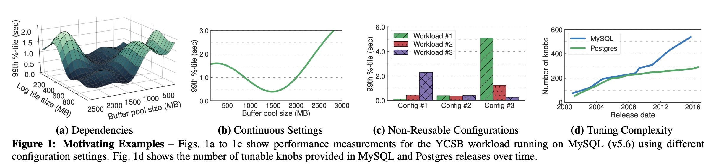
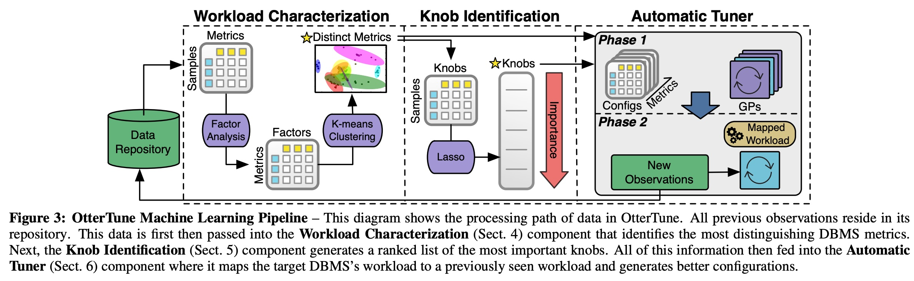
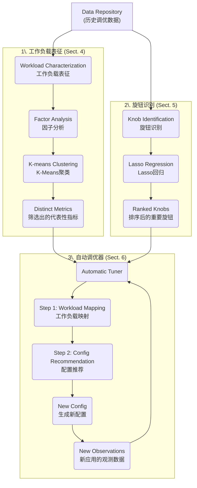
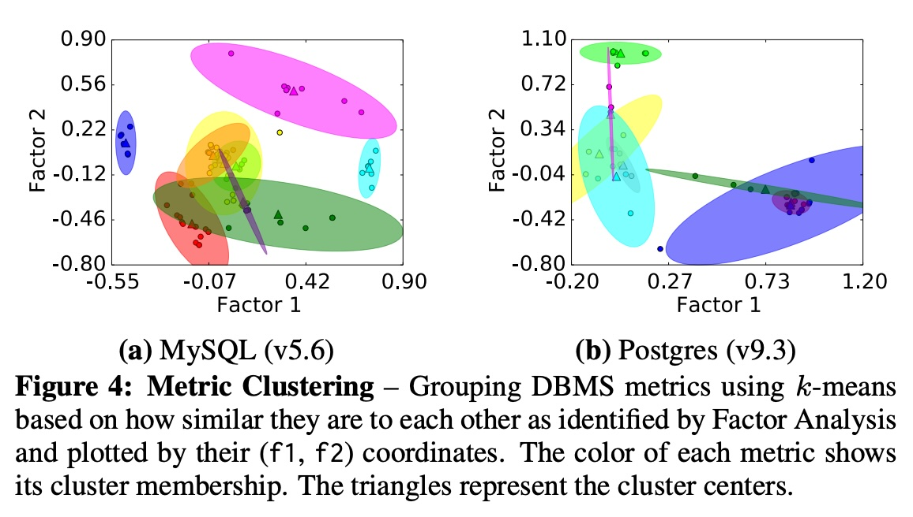
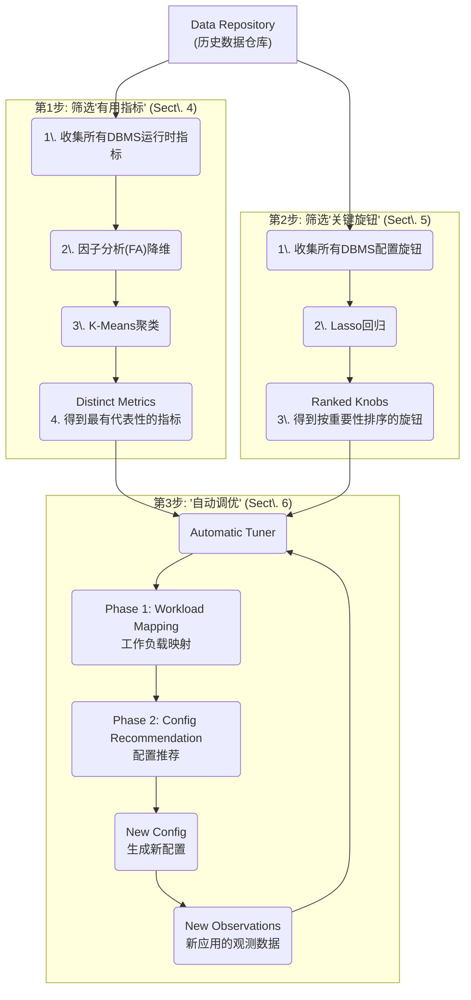
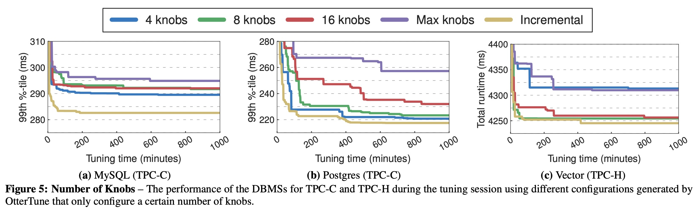
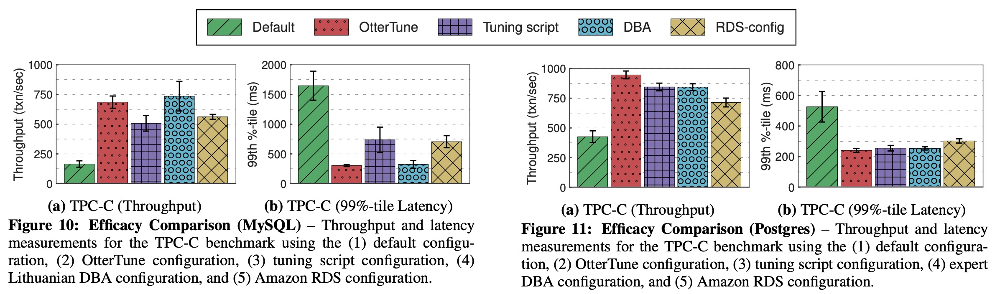
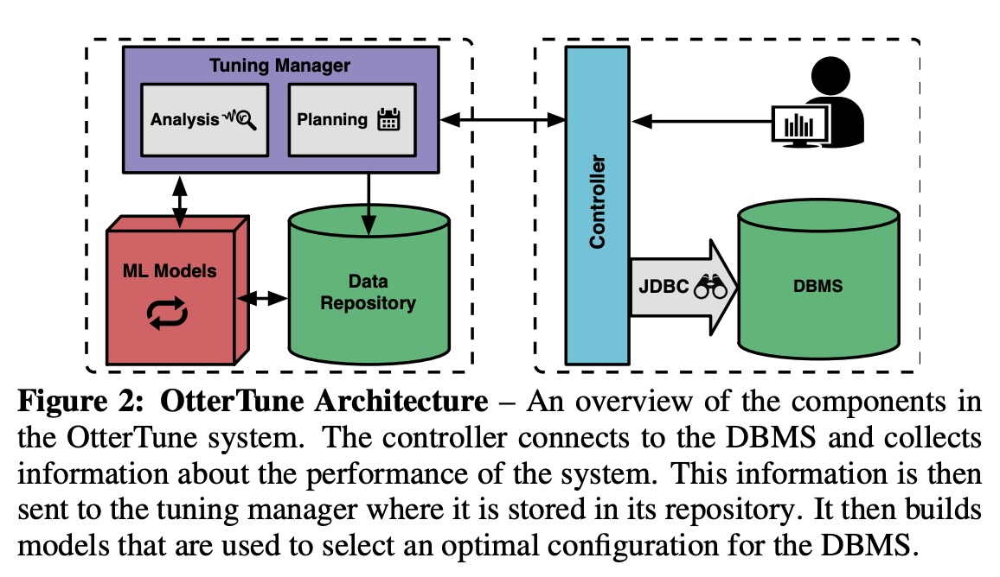
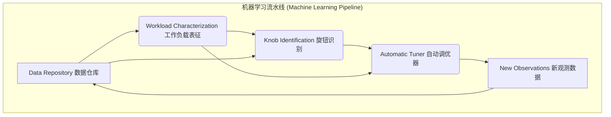

## AI论文解读 | Automatic Database Management System Tuning Through Large-scale Machine Learning
        
### 作者        
digoal        
        
### 日期        
2025-11-11        
        
### 标签        
PostgreSQL , PolarDB , DuckDB , AI , 论文解读        
        
----        
        
## 背景  
      
https://dl.acm.org/doi/pdf/10.1145/3035918.3064029        
  
提示:          
```          
读懂《Automatic Database Management System Tuning Through Large-scale Machine Learning》这篇论文需要提前掌握哪些基础知识, 请使用中文通熟易懂的讲解这些基础知识, 可以引用论文中的图、表或使用Markdown支持的图形(text,mermaid等)增加解释性. 
  
使用中文通熟易懂的解读《Automatic Database Management System Tuning Through Large-scale Machine Learning》这篇论文, 其中的关键内容请着重讲解, 可以引用论文中的图、表或使用Markdown支持的图形(text,mermaid等)增加解释性. 
  
提取《Automatic Database Management System Tuning Through Large-scale Machine Learning》这篇论文中的重要术语, 使用中文对这些术语进行通熟易懂的讲解, 可以引用论文中的图、表或使用Markdown支持的图形(text,mermaid等)增加解释性. 
```     
  
## 1 前置知识 
  
要读懂《Automatic Database Management System Tuning Through Large-scale Machine Learning》这篇论文（也就是OtterTune项目），你需要掌握两大块基础知识：**数据库管理系统（DBMS）** 和 **机器学习（ML）** 。

这篇论文的核心思想是：**用机器学习（ML）的“经验”来自动调整数据库（DBMS）的“旋钮”，让它跑得更快** 。

下面我将用通俗易懂的方式，结合论文中的图表，为你讲解你需要了解的基础知识。

-----

### 📚 知识一：数据库管理系统 (DBMS) 基础

这是你要解决的“问题领域”。你得先明白问题是什么，才能看懂解决方案。

#### 1\. 什么是 DBMS 和“旋钮” (Knobs)？

  * **DBMS (Database Management System):** 就是我们常说的数据库软件，比如论文中提到的 **MySQL** 和 **Postgres** 。它们是用来存储和管理数据的复杂系统。
  * **“旋钮” (Knobs):** 指的是数据库的**配置参数** 。你可以把 DBMS 想象成一台高性能赛车，而“旋钮”就是赛车引擎、悬挂、轮胎气压等各种可调节的部件。

例如，一个旋钮可能控制“系统分配多少内存给缓存” (如 `innodb_buffer_pool_size` )，另一个可能控制“数据多久写入一次硬盘” 。

#### 2\. 为什么调优 (Tuning) 这么难？

手动调优这些旋钮（配置）是数据库管理员 (DBA) 的一项重要工作，但极其困难 。论文在第2节（MOTIVATION）和图1中指出了几个核心痛点：    

  * **痛点1：旋钮间相互依赖 (Dependencies)**
    你调了一个旋钮，可能会影响另一个旋钮的效果 。它们不是各自独立的。
      * **[论文图示]** 论文中的 **图 1a**  就展示了这一点。它显示了“缓冲池大小 (Buffer pool size)”和“日志文件大小 (Log file size)”这两个旋钮如何共同影响性能（延迟）。你必须找到一个“平衡点”，而不是单独调一个到最大 。
  * **痛点2：配置无法重用 (Non-Reusable Configurations)**
    在一个应用上跑得很好的配置，换到另一个应用上可能效果很差 。
      * **[论文图示]** **图 1c**  清楚地显示：为“Workload \#1”优化的配置 (Config \#1)，在“Workload \#3”上表现极差（延迟暴增3500%） 。
  * **痛点3：旋钮数量庞大且不断增加 (Tuning Complexity)**
    现代数据库有数百个旋钮 ，而且新版本会带来更多旋钮。
      * **[论文图示]** **图 1d**  显示，从2001年到2016年，MySQL的旋钮数量增长了近6倍 。人类专家已经很难全部掌握 。

> **你需要理解的是：** 数据库调优是一个“牵一发而动全身”的复杂多维优化问题，传统的“试错法”和专家经验已经不够用了。

-----

### 🧠 知识二：机器学习 (ML) 核心技术

这是论文提出的“解决方案”。OtterTune 使用一个 ML 管道（Pipeline）来解决上述问题。理解这个管道（见论文图3）是理解整篇论文的关键。    

你可以使用下面的流程图来辅助理解论文 **图3 (Figure 3)**  中展示的 ML 管道：



下面我们来拆解这个管道中你需要懂的几个关键 ML 技术：

#### 1\. 降维与聚类 (用于“工作负载表征”)

  * **问题：** 数据库有海量的“运行时指标” (Metrics)，比如“读了多少页”、“写了多少页”等 。很多指标是相关的，甚至是多余的（比如“读取的字节数”和“读取的页数”）。
  * **你需要懂的ML技术：**
      * **因子分析 (Factor Analysis, FA):** 这是一种**降维 (Dimensionality Reduction)** 技术 。通俗地说，如果100个指标（原始变量）其实只反映了5个潜在的“核心特征”（比如“I/O压力”、“缓存命中率”等），FA 就能帮你找到这5个核心特征（因子）。
      * **K-Means 聚类 (K-Means Clustering):** 这是一种**无监督学习**算法。FA 帮你提炼出“核心特征”后，K-Means 负责把具有相似特征的指标“聚”成一堆 。
  * **在论文中的作用 (Sect. 4.2):**
    OtterTune 用 FA 和 K-Means 来处理上百个原始指标，把它们自动聚类。**图 4**  就展示了聚类的结果。然后，它从每个类别中选出一个“代表” 。这样，它就从海量指标中筛选出了一小撮最有代表性的“去冗余指标” (Distinct Metrics) ，极大简化了后续分析。    

#### 2\. 特征选择 (用于“旋钮识别”)

  * **问题：** 数据库有几百个旋钮，但真正对性能有重大影响的可能只有十几个 。我们怎么把这些“关键旋钮”找出来？
  * **你需要懂的ML技术：**
      * **Lasso 回归 (Lasso Regression):** 这是一种**监督学习**中的**回归 (Regression)** 技术，尤其擅长**特征选择 (Feature Selection)** 。
      * **通俗理解：** 你可以把 Lasso 想象成一个“极简主义”的建模师。在建立“旋钮”和“性能”之间的关系模型时，Lasso 会有一个“惩罚项” ：每使用一个旋钮（特征）都要付出“代价”。因此，Lasso 会自动把那些不重要的旋钮的“权重”压缩到零 ，只留下那些真正重要的旋钮。
  * **在论文中的作用 (Sect. 5):**
    OtterTune 使用 Lasso 来分析历史数据，自动找出对目标（如延迟）影响最大的旋钮，并按重要性给它们排序 。这样，调优器就可以集中精力优化这些“关键旋钮”，而不是在几百个旋钮中大海捞针 。

#### 3\. 贝叶斯优化 (用于“配置推荐”)

  * **问题：** 好了，我们有了“代表性指标”和“关键旋钮”。现在一个新应用来了，我们怎么高效地找到最佳的旋钮配置？（总不能一个一个试吧？）
  * **你需要懂的ML技术：**
      * **高斯过程 (Gaussian Process, GP) 回归:** 这是实现**贝叶斯优化 (Bayesian Optimization)** 的核心工具 。
      * **通俗理解：** 想象你在一个大雾弥漫的山区寻找最高峰（最佳配置）。
        1.  GP 会根据你已知的几个点（已经尝试过的配置），“猜测”整个山脉（配置空间）的地形图 。
        2.  这个“地图”不但告诉你每个地方的“预估高度”（预估性能），还会告诉你“不确定性”（雾有多浓）。
        3.  接下来，你该去哪？你有两个选择：
              * **利用 (Exploitation):** 去你“预估高度”最高的地方（比如你找到的一个小山包附近），看看能不能爬得更高 。
              * **探索 (Exploration):** 去你“不确定性”最高的地方（你完全没去过的、雾最浓的地方），因为那里可能藏着一个你没发现的、更高的主峰 。
  * **在论文中的作用 (Sect. 6.2):**
    OtterTune 正是使用 GP 来智能地平衡“利用”和“探索” 。它首先利用历史数据（Workload Mapping的结果）构建一个初始的“性能地图” ，然后通过不断尝试（探索/利用），快速迭代，用最少的次数找到那个“性能最高峰”。

-----

### 总结

要读懂这篇论文，你需要：

1.  **懂数据库 (DBMS)：** 明白“旋钮”调优为什么重要，以及为什么它在（如图1所示的）依赖性、不可重用性和高复杂性等方面充满挑战。   
2.  **懂机器学习 (ML)：** 核心是理解 OtterTune 的三步管道（如图3所示）：    
      * **第1步：筛选指标。** 用 **K-Means** 和 **因子分析** 从海量指标中找出最有代表性的。
      * **第2步：筛选旋钮。** 用 **Lasso** 从几百个旋钮中找出最关键的。
      * **第3步：智能搜索。** 用 **高斯过程 (GP)** 来平衡“探索”和“利用”，高效地为新应用找到最佳配置。

掌握了这些，你就能明白 OtterTune 是如何利用从大量历史数据中“学到”的经验，来自动化解决这个复杂的调优问题的。
  
## 2 解读论文 
  
这是一篇关于**数据库自动调优**的开创性论文。

### 一句话总结这篇论文（OtterTune）

这篇论文介绍了一个名为 **OtterTune** 的智能工具 。你可以把它想象成一个 **“AI 数据库管理员（DBA）”** 。

它的核心思想是：**利用大规模机器学习，自动学习“过去”所有数据库的调优经验，然后用这些经验，又快又好地为“现在”的新数据库应用推荐最佳配置** 。

-----

### 1\. 亟待解决的问题：为什么数据库调优这么难？

数据库管理系统（DBMS）是极其复杂的软件，它有**数百个配置“旋钮”（Knobs）** 。这些“旋钮”控制着从内存分配、缓存策略到数据刷盘方式等一切行为 。

传统上，调优这些“旋钮”是DBA（数据库管理员）的工作，但这非常困难，论文在 **图 1** 中总结了几个核心痛点：    

  * **痛点1：旋钮间相互依赖 (Dependencies)**
    “旋钮”不是独立的，调节一个会影响另一个 。

      * **[论文图示]** 如 **图 1a** 所示，`Buffer pool size`（缓冲池大小）和 `Log file size`（日志文件大小）共同决定了系统性能。你必须找到一个“平衡点”，而不是简单地把某个值调到最大 。

  * **痛点2：配置无法重用 (Non-Reusable)**
    一个应用（比如电商订单系统）的最佳配置，换到另一个应用（比如社交媒体信息流）上可能效果极差 。

      * **[论文图示]** **图 1c** 显示，为“Workload \#1”优化的配置（Config \#1），用在“Workload \#3”上时，延迟（性能）暴跌了3500% 。

  * **痛点3：数量庞大且不断增加 (Tuning Complexity)**

      * **[论文图示]** **图 1d** 显示，在15年间，MySQL的“旋钮”数量增长了近6倍，Postgres也增长了3倍 。人类专家已经难以全部掌握。

  * **痛点4：默认配置很差 (Bad Defaults)**
    论文提到，2016年MySQL的默认配置还假设机器只有160MB内存，这在现代服务器上显然是不合理的 。

> **结论：** 靠人（DBA）手动“试错”来调优，既昂贵、耗时，又很难找到最佳配置 。而现有的调优工具无法从过去的调优经验中学习 。

-----

### 2\. 关键内容：OtterTune 的“三步走”ML管道

OtterTune 的聪明之处在于它建立了一个 **机器学习管道（Pipeline）** ，把调优问题分解为三个步骤。论文中的 **图 3** 是整篇论文的核心架构图。    

我们可以用一个流程图来更清晰地展示这个管道：



下面我们来通俗地讲解这三个关键步骤：

#### 第1步：工作负载表征 (Workload Characterization)

  * **目标：** DBMS 运行时有海量的内部指标（Metrics），比如“读了多少页”、“缓存命中率”等等 。很多指标是冗余的（例如“读取的字节数”和“读取的页数”高度相关 ）。**此步骤的目标是：自动从几百个指标中，筛选出少数几个最能“代表”系统状态、最能“区分”不同工作负载的指标** 。
  * **方法：**
    1.  **因子分析 (Factor Analysis, FA)：** 这是一种降维技术 。它把上百个相互关联的指标，浓缩成几个少数的、互不相关的“核心因子”（比如“I/O因子”、“内存因子”） 。
    2.  **K-Means 聚类 (K-Means)：** 在“核心因子”构成的空间中，把指标进行聚类 。
  * **[论文图示]** **图 4** 展示了聚类结果。OtterTune 发现 MySQL 的131个指标可以被聚为9类 。    
  * **结果：** OtterTune 只需要从每个类别中选一个代表指标即可 。这就实现了“去冗余”，大大简化了后续分析。

#### 第2步：识别关键旋钮 (Identifying Important Knobs)

  * **目标：** DBMS 有几百个“旋钮”，但真正对性能有*重大*影响的可能只有十几个 。**此步骤的目标是：自动找出这些“关键旋钮”，并按重要性给它们排序** 。
  * **方法：** **Lasso 回归 (Lasso Regression)** 。
  * **通俗理解：** Lasso 是一种特殊的回归模型，它在训练时会有一个“惩罚项” 。这个惩罚项会迫使模型“抓大放小”——它会自动把那些对性能影响不大的“旋钮”的权重压缩到零 。
  * **结果：** 只有那些真正重要的“旋钮”会保留下来，OtterTune 由此得到了一个按重要性排序的“关键旋钮列表” 。

#### 第3步：自动调优器 (Automated Tuning)

这是 OtterTune 为新应用进行“在线调优”的核心。当一个新应用接入时，它分两阶段工作：

  * **阶段1：工作负载映射 (Workload Mapping)**

      * **目标：** OtterTune 需要知道：“这个新应用，最像我历史数据仓库里的哪个‘老应用’？” 。
      * **方法：** OtterTune 让新应用先跑一会儿，收集它在“代表性指标”（第1步的结果）上的表现。然后，它计算这个表现与数据仓库中所有“老应用”表现之间的“欧几里得距离” ，找到那个距离最近的（即最相似的） 。
      * **关键：** 找到了最像的“老应用”，OtterTune 就可以*复用*那个老应用的调优数据作为“先验知识”，而不是从零开始猜 。

  * **阶段2：配置推荐 (Configuration Recommendation)**

      * **目标：** 智能地推荐下一个要尝试的配置，希望能比当前最好的配置还要好 。
      * **方法：** **高斯过程回归 (Gaussian Process, GP)** 。
      * **通俗理解：** GP 是一种非常适合“在不确定的空间中找最优解”的模型。你可以把它想象成一个智能的“探路者”：
        1.  **预训练：** 它首先利用“阶段1”映射到的“老应用”数据，构建一个对“配置-性能”关系的初始“地图” 。
        2.  **平衡“探索”与“利用”：** 在推荐下一个配置时，GP 会平衡两个策略 ：
              * **利用 (Exploitation)：** 去它预测的“性能地图”上*最高*的点（即它认为最好的配置）附近试试 。
              * **探索 (Exploration)：** 去它“地图”上*最不确定*的点（即它完全没试过、不知道好坏的配置）试试 。
        3.  **迭代：** OtterTune 会推荐一个“预期改善最大” (Expected Improvement) 的配置 。新应用尝试该配置后，把结果反馈给 GP，GP 随之更新它的“性能地图” ，然后开始下一轮推荐。这个过程不断循环 。

-----

### 3\. 实验效果：OtterTune 真的有效吗？

论文通过一系列实验证明了 OtterTune 的强大效果：

#### 实验1：增量式旋钮选择（图 5）

OtterTune 发现，并不是一次性调的“旋钮”越多越好 。效果最好的是“增量式”（Incremental）策略：先调最重要的4个旋钮，稳定后再增加到6个、8个... 。如 **图 5a (MySQL)** 和 **图 5b (Postgres)** 所示， **“Incremental”** （黄线）策略总是能最快地找到最低的延迟（最好的性能） 。    

#### 实验2：对比其他调优工具（图 6, 7）

OtterTune（绿线）与另一个工具 iTuned（蓝线，它不会从历史数据中学习 ）进行了对比。

  * **[论文图示]** 无论是在 TPC-C (图 6) 还是 Wikipedia (图 7) 负载上，OtterTune 都能**更快**（在30-60分钟内）找到一个极好的配置，并且最终找到的配置**远好于** iTuned 。这证明了“从历史中学习”的巨大优势。    

#### 实验3：对比人类专家DBA（图 10, 11）

这是最惊艳的对比。OtterTune 与一位拥有15年经验的MySQL专家和一位经验丰富的Postgres DBA 进行了“人机大战” 。    

  * **[论文图示] MySQL (图 10):**

      * OtterTune（绿色）的性能（吞吐量和延迟） **几乎与顶级人类专家（DBA，紫色）持平** 。
      * 它们都远远优于“调优脚本”（Tuning script，红色）和亚马逊RDS的默认优化配置（Amazon RDS，蓝色） 。

  * **[论文图示] Postgres (图 11):**

      * 在吞吐量（Throughput）上，OtterTune（绿色）甚至**比人类专家（DBA，紫色）还要高出 12%** 。

> **最终结论：** 论文证明，OtterTune 可以在 **60分钟内** 自动生成的配置，其性能**媲美甚至超越**了经验丰富的人类专家 。它成功地将大规模机器学习应用于数据库调优，实现了自动化、高效率和可复用的知识。
  
## 3 术语 
  
好的，我从这篇名为《通过大规模机器学习实现自动数据库管理系统调优》的论文中提取了关键术语，并为您提供通俗易懂的中文讲解。

-----

### 核心概念：数据库调优的困境与对策

#### 1\. 数据库管理系统 (DBMS) 配置调优 (Configuration Tuning)

  * **讲解：** 数据库系统（如 MySQL, Postgres）有成百上千个配置选项，来控制其运行时行为 。
  * **通俗解释：** 这就像你汽车的发动机控制单元（ECU），里面有几百个参数（比如空燃比、点火时机）。"调优"就是调整这些参数，目的是让数据库跑得更快（即高**吞吐量** ）或响应更及时（即低**延迟** ）。
  * **为什么难？** 传统上这需要依赖昂贵的专家经验 ，而且这些参数（旋钮）之间会相互影响 ，复杂度已经超过了人类能处理的范围 。

#### 2\. 旋钮 (Knobs)

  * **讲解：** 这是论文中对 DBMS 配置参数的形象比喻 。
  * **论文中的挑战（见图1）：**    
      * **(a) 依赖性 (Dependencies):** 如图 1a 所示，两个旋钮（如缓冲池大小和日志文件大小）的设置需要“平衡”，才能达到最佳性能，只调一个可能没用 。
      * **(c) 不可重用性 (Non-Reusable):** 如图 1c 所示，为“工作负载 \#1” 优化的最佳配置（Config \#1），用在“工作负载 \#3” 上时表现可能非常糟糕 。
      * **(d) 复杂性 (Complexity):** 如图 1d 所示，随着数据库版本更新，旋钮的数量在持续增加（例如 MySQL 在15年里增加了近6倍），使得调优越来越难。

#### 3\. OLTP vs. OLAP (工作负载类型)

  * **讲解：** 这是两种主要的数据库工作负载类型，调优目标截然不同。
  * **OLTP (Online Transaction Processing, 在线事务处理):**
      * **特点：** 高频、短小、快速的读写操作。
      * **例子：** 银行转账、电商下订单、抢票。
      * **论文中的基准：** YCSB , TPC-C , Wikipedia 。
  * **OLAP (Online Analytical Processing, 在线分析处理):**
      * **特点：** 低频、但极其复杂、耗时长的查询操作，通常用于数据分析。
      * **例子：** 生成全公司上一季度的销售汇总报表。
      * **论文中的基准：** TPC-H 。

-----

### 解决方案：OtterTune (水獭调优)

#### 4\. OtterTune (论文提出的工具)

  * **讲解：** 论文实现的一个新型自动化调优工具 。
  * **核心思想：** OtterTune 的关键创新在于它能**重用**从过去调优任务中收集的数据和经验 。它维护一个“数据仓库”(Data Repository)，里面存储了大量“配置-指标-性能”的历史数据 ，并使用机器学习模型来分析这些数据 。
  * **架构 (见图2)：** 如图2所示 ，它主要包含两部分 ：    
    1.  **控制器 (Controller):** 部署在用户数据库旁边，负责收集运行时指标，并执行管理器发来的新配置 。
    2.  **调优管理器 (Tuning Manager):** 运行在云端，是决策中心。它负责存储数据、训练模型，并决定下一步要尝试的最佳配置 。

#### 5\. 机器学习流水线 (ML Pipeline)

  * **讲解：** 这是 OtterTune 自动调优的核心流程，如图3所示 。它展示了数据如何一步步被处理和利用。    

下面是论文图3的简化流程：



  * **流程解释：**
    1.  **数据仓库 (A):** 存储所有历史调优数据。
    2.  **工作负载表征 (B):** 分析指标，搞清楚当前数据库在忙什么 。
    3.  **旋钮识别 (C):** 利用历史数据，找出对性能影响最大的那些旋钮 。
    4.  **自动调优器 (D):** 结合(B)和(C)的信息，推荐一个新配置 。
    5.  **新观测数据 (E):** 新配置的运行结果被收集起来，再存入数据仓库 (A)，形成闭环，让模型越来越准 。

-----

### 核心技术：OtterTune 的机器学习算法

#### 6\. 工作负载表征 (Workload Characterization)

  * **目标：** 理解当前数据库的工作负载是什么类型（比如是读密集型？还是写密集型？），以便匹配历史经验 。
  * **方法：** 它不分析 SQL 查询语句，而是分析数据库**内部的运行时指标** (internal runtime metrics)  （例如，MySQL 的 `innodb_pages_read` 指标 ）。
  * **挑战：** 指标太多且冗余。例如，MySQL 报告“读取的字节数”和“读取的页数”其实是同一件事 。
  * **技术组合 (FA + k-means)：**
      * **因子分析 (Factor Analysis, FA):** 一种降维技术，用于识别高度相关的指标组 。
      * **k-means 聚类 (k-means Clustering):** 将指标聚类 。
  * **效果 (见图4)：** 如图4所示 ，OtterTune 自动将上百个指标聚类成几个不同的组（例如MySQL的131个指标被聚为9个集群 ）。它只需从每个集群中选一个代表性指标即可，大大简化了分析 。    

#### 7\. 旋钮识别 (Knob Identification) 与 Lasso

  * **目标：** 在几百个“旋钮”中，自动找出那些对性能**影响最大**的关键旋钮 。
  * **技术 (Lasso)：** 使用 **Lasso**（一种正则化线性回归技术）。
  * **通俗解释：** 你可以把 Lasso 想象成一个“自动特征过滤器”。在建立“旋钮设置”和“系统性能”的关系模型时，Lasso 会自动把那些“不重要”的旋钮的权重（影响力）压缩到零 ，只保留下那些真正对性能有显著影响的旋钮。

#### 8\. 工作负载映射 (Workload Mapping)

  * **目标：** 这是自动调优的第一步（Step \#1）。OtterTune 需要在它庞大的“数据仓库”中，找到一个 **过去见过的、且与当前这个新应用“行为最相似”** 的工作负载 。
  * **方法：** 通过比较它们（被筛选过的）内部运行时指标，计算相似度得分 。
  * **作用：** 一旦匹配成功，OtterTune 就可以“借鉴”调优那个历史负载的经验数据（尤其是已经训练好的模型），而不是从零开始冷启动 。

#### 9\. 配置推荐 (Configuration Recommendation) 与 高斯过程 (GP)

  * **目标：** 这是自动调优的第二步（Step \#2）。在“借鉴”了历史数据后，推荐一个能**最大化提升**性能的新配置 。
  * **技术 (Gaussian Process, GP, 高斯过程回归)：** 
  * **通俗解释：** GP 是一个非常强大的模型。当 OtterTune 考虑一个新配置时，GP 不仅能预测“这个配置大概能跑多少分”，还能给出这个预测的 **“置信区间”** （即它对这个预测有多大把握）。
  * **平衡“探索”与“利用” (Exploration vs. Exploitation)：** 
      * **利用 (Exploitation):** 在 GP 预测性能好、且“非常确定”的区域进行微调（例如，在已知的最佳配置附近再试试）。
      * **探索 (Exploration):** 敢于尝试那些 GP “不确定”的配置区域（即置信区间很宽）。虽然预测性能可能一般，但那里可能隐藏着未被发现的“宝藏”（更好的配置）。

OtterTune 会选择那个 **“预期改善” (Expected Improvement) 最大**  的配置进行下一步尝试，通过这种方式高效地找到最佳设置。
  
## 参考        
         
https://dl.acm.org/doi/pdf/10.1145/3035918.3064029    
        
<b> 以上内容基于DeepSeek、Qwen、Gemini及诸多AI生成, 轻微人工调整, 感谢杭州深度求索人工智能、阿里云、Google等公司. </b>        
        
<b> AI 生成的内容请自行辨别正确性, 当然也多了些许踩坑的乐趣, 毕竟冒险是每个男人的天性.  </b>        
    
#### [PolarDB 学习图谱](https://www.aliyun.com/database/openpolardb/activity "8642f60e04ed0c814bf9cb9677976bd4")
  
  
#### [PostgreSQL 解决方案集合](../201706/20170601_02.md "40cff096e9ed7122c512b35d8561d9c8")
  
  
#### [德哥 / digoal's Github - 公益是一辈子的事.](https://github.com/digoal/blog/blob/master/README.md "22709685feb7cab07d30f30387f0a9ae")
  
  
#### [About 德哥](https://github.com/digoal/blog/blob/master/me/readme.md "a37735981e7704886ffd590565582dd0")
  
  

  
