## AI论文解读 | An End-to-End Automatic Cloud Database Tuning System Using Deep Reinforcement Learning
        
### 作者        
digoal        
        
### 日期        
2025-11-11        
        
### 标签        
PostgreSQL , PolarDB , DuckDB , AI , 论文解读        
        
----        
        
## 背景  
      
https://dbgroup.cs.tsinghua.edu.cn/ligl/papers/sigmod19-cdbtune.pdf        
  
提示:          
```          
读懂《An End-to-End Automatic Cloud Database Tuning System Using Deep Reinforcement Learning》这篇论文需要提前掌握哪些基础知识, 请使用中文通熟易懂的讲解这些基础知识, 可以引用论文中的图、表或使用Markdown支持的图形(text,mermaid等)增加解释性. 
  
使用中文通熟易懂的解读《An End-to-End Automatic Cloud Database Tuning System Using Deep Reinforcement Learning》这篇论文, 其中的关键内容请着重讲解, 可以引用论文中的图、表或使用Markdown支持的图形(text,mermaid等)增加解释性. 
  
提取《An End-to-End Automatic Cloud Database Tuning System Using Deep Reinforcement Learning》这篇论文中的重要术语, 使用中文对这些术语进行通熟易懂的讲解, 可以引用论文中的图、表或使用Markdown支持的图形(text,mermaid等)增加解释性. 
```     
  
## 1 前置知识 
  
要透彻理解这篇论文，你需要掌握三大块的“拼图”：**数据库调优**、**机器学习基础**以及**深度强化学习 (DRL)**。

这篇论文的核心思想是：把调整数据库的“旋钮”（配置参数）这件事，当成一个智能体（Agent）在玩游戏。智能体的目标是拿高分，而“分数”就是数据库的性能（高吞吐量、低延迟）。

下面我们来通俗地讲解每一块知识。

### 🧩 拼图一：数据库 (DB) 基础知识 (要解决的问题)

你需要对数据库管理系统 (DBMS) 有一个基本概念，尤其是关于性能的部分。

  * **什么是 "Knobs" (旋钮)？** 
      * 你可以把数据库（比如 MySQL）想象成一台复杂的音响。它有几百个“旋钮”（Knobs），也就是**配置参数**（例如 `innodb_buffer_pool_size` 缓冲池大小，`innodb_log_file_size` 日志文件大小等）。
      * 单独调对一个旋钮很简单，但难点在于，这些旋钮**互相依赖、互相影响** 。你调高了 A，可能就要调低 B，否则性能可能更差。
  * **什么是 "Tuning" (调优)？** 
      * 调优就是去拧这些旋钮，找到一个最佳组合，让数据库跑得最快（**高吞吐量 Throughput**），响应最及时（**低延迟 Latency**）。
  * **什么是 "DBA" (数据库管理员)？** 
      * 传统上，调优是靠经验丰富的 DBA（数据库管理员）来“手动”完成的 。但 DBA 很贵，而且在有成千上万台数据库实例的“云环境” (CDB) 下，DBA 根本忙不过来 。
  * **什么是 "Workload" (工作负载)？**
      * 就是数据库正在处理的“活儿”。比如，是“只读” (RO) 还是“只写” (WO) ，或者是像 TPC-C、Sysbench 这样的标准测试 。不同的“活儿”需要不同的旋钮组合。

这篇论文要解决的核心问题就是：**在复杂的云环境下，如何自动、智能地调整这些旋钮，来替代昂贵且有限的 DBA** 。

-----

### 🧩 拼图二：机器学习 (ML) 基础 (为什么要用 RL)

你需要知道为什么传统的机器学习方法“不够用”，才能理解论文为什么选择强化学习 (RL)。

  * **传统 ML 方法的局限 (如 OtterTune)** 
    1.  **需要大量“好”样本** ：传统 ML（如监督学习）需要很多“专家数据”（比如 DBA 的调优记录）来训练 。但在云上收集这种高质量数据非常难 。
    2.  **“流水线” (Pipelined) 模式** ：它们把调优分成好几步（比如：1. 选重要旋钮, 2. 预测性能...）。上一步的错会累积到下一步，无法“端到端” (End-to-End) 地优化整体性能 。
    3.  **搞不定“高维连续空间”** ：这是个关键词。“高维”指旋钮非常多（几百个）；“连续”指旋钮的值不是 1、2、3，而是 1MB 到 1024MB 之间的任意值。传统回归模型（如高斯过程）在这种空间下很难找到最优解 。

**一句话总结：** 传统 ML 方法要么太依赖“标准答案”（高质量样本），要么在“旋钮太多、取值太灵活”的复杂现实面前算不出来。

-----

### 🧩 拼图三：强化学习 (RL) 核心概念 (怎么解决的)

这是理解本论文的**最核心知识**。强化学习 (RL) 不需要“标准答案”，它靠“试错” (Try-and-Error) 来学习 。

论文将数据库调优问题巧妙地映射到了 RL 的框架中（见论文图 3）。  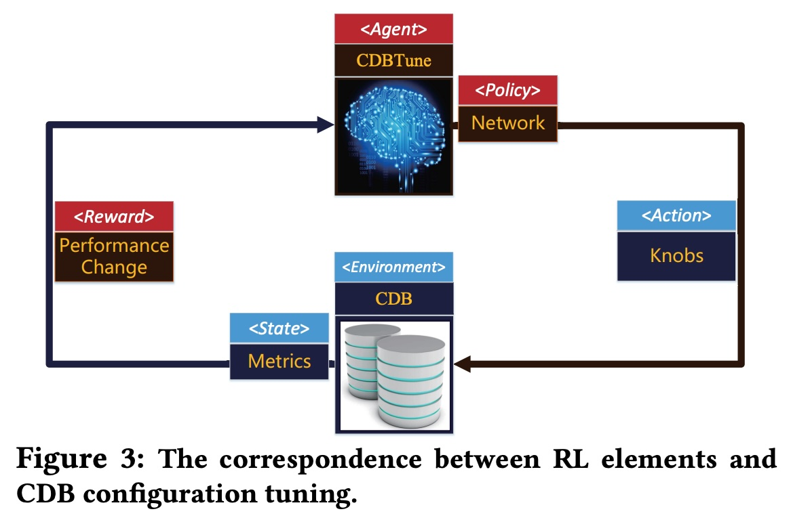  

你需要理解 RL 的几个基本元素：

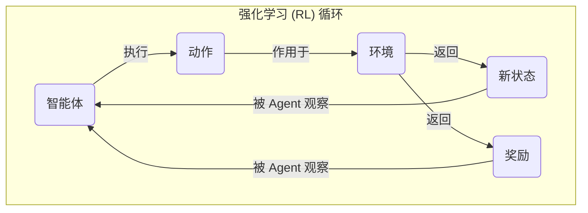

现在，我们把论文里的东西填进去：

  * **Agent (智能体):** 就是论文提出的 **CDBTune 系统** 。它是做决策的“大脑”。
  * **Environment (环境):** 就是那台**数据库 (CDB) 实例** 。
  * **State (状态):** 环境的快照。CDBTune 通过执行 "show status" 拿到的 **63 个内部指标**（如缓冲池命中率、读写页数等）。
  * **Action (动作):** Agent 要干的事。就是**推荐一组新的 "Knobs" 配置** 。
  * **Reward (奖励):** 评价这个 Action 好坏的信号。就是**性能的变化**（吞吐量涨了给正分，延迟高了给负分）。
  * **Policy (策略):** Agent 的核心，即一个“函数”或“网络”。它的功能是：**输入 State（当前数据库状态），输出 Action（下一步该调什么旋钮）** 。

**CDBTune 的工作流就是：**

1.  **看状态 (State)：** 观察数据库当前的 63 个指标。
2.  **做动作 (Action)：** 推荐一组新的旋钮配置。
3.  **看环境 (Environment)：** 数据库应用新配置并重启。
4.  **拿奖励 (Reward)：** 跑一下负载，看看性能（吞吐量/延迟）是变好了还是变差了，以此计算“奖励” 。
5.  **学策略 (Policy)：** 根据“奖励”的正负，微调自己的“策略网络”，争取下次拿到更高的奖励。

-----

### 🧩 终极拼图：DDPG (深度确定性策略梯度)

你可能还会问：RL 算法那么多，为什么偏偏是 DDPG？

  * **为什么不用 Q-Learning/DQN？**
      * Q-Learning/DQN（比如 AlphaGo 的早期版本）是处理**离散动作**（比如“上、下、左、右”或“围棋落子点”）的 。
      * 但数据库的旋钮是**连续的**（比如 128.5MB vs 128.6MB）。你总不能把所有可能的取值都试一遍（这个动作空间是无限大的）。
  * **DDPG = Actor-Critic + Deep Learning** 
      * DDPG 是一种**专门解决连续动作空间**的 DRL 算法 。
      * 它采用了 **Actor-Critic (演员-评论家)** 架构（见论文图 4）。  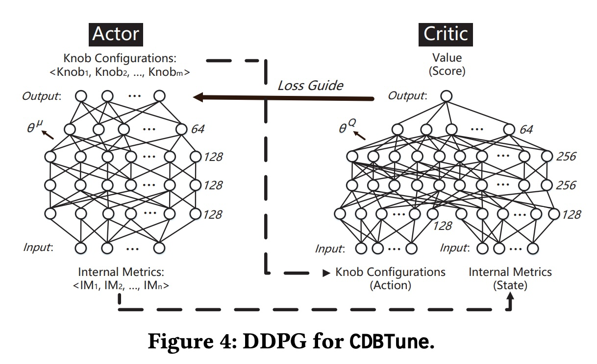  

你可以这样理解 Actor-Critic：

1.  **Actor (演员) (策略网络)** 

      * **职责：** 负责“表演”。
      * **输入：** State (数据库状态)。
      * **输出：** **一个具体的、连续的 Action** (一组旋钮值，比如 {buffer: 135.7MB, log: 50.2MB...}) 。

2.  **Critic (评论家) (价值网络)** 

      * **职责：** 负责“打分”。
      * **输入：** State (数据库状态) + Actor 表演的 Action (旋钮值)。
      * **输出：** 一个“Q 值” (分数)，**评价这个演员在当前状态下，做这个表演，有多好** 。

**学习过程 (图 4 的 Loss Guide )：**

  * Actor 负责“演”（输出 Action）。
  * Critic 负责“骂”（给 Action 打分）。
  * Actor 的目标是调整自己的“演技”（策略网络），让自己下次的表演能**让 Critic 打出更高的分** 。
  * Critic 的目标是“骂得更准”（价值网络），它通过 RL 的“奖励” (Reward) 来学习，让自己**对“好/坏动作”的判断越来越准** 。

### 总结

要读懂这篇论文，你不需要成为一个 DBA 专家，也不需要会推导 DDPG 的所有数学公式。你只需要掌握以下几个核心连接点：

1.  **问题：** 数据库旋钮（高维、连续、互相依赖）在云上（环境多变）很难调 。
2.  **旧方案的痛点：** 传统 ML 依赖高质量样本，且搞不定连续动作空间 。
3.  **新方案：** 用强化学习 (RL) 的“试错”机制  和“奖励” (Reward) 机制  来实现端到端学习。
4.  **核心工具：** 使用 DDPG 算法，因为它内部的 **Actor-Critic** 架构  就像一个“演员” (Actor) 直接输出连续的旋钮值 (Action)，一个“评论家” (Critic) 负责给它打分 ，完美契合了数据库调优的需求。

希望这个讲解对你有帮助！你希望我深入讲解 DDPG 中的 Actor-Critic 是如何具体更新参数的，还是想了解论文的实验是如何验证“自适应性” (Adaptability) 的？
  
## 2 解读论文 
  
这是一篇来自 SIGMOD 2019 的经典论文，它提出了一个名为 **CDBTune** 的系统 ，**首次使用深度强化学习 (DRL) 来实现一个端到端的自动云数据库调优系统** 。

用最通俗的话说，这篇论文的核心思想是：

> 把数据库调优这件事，从“背答案”变成了“学本事”。
>
> 传统的调优工具像一个“书呆子”，试图从大量“标准答案”（DBA 的调优记录）中找到规律。但一旦考试（数据库环境或负载）变了，它就不会了。
>
> 而 CDBTune 像一个“聪明的学徒”，它不依赖标准答案，而是通过“**试错**” (Try-and-Error)  和“**奖励反馈**” (Reward-Feedback)  来学习。它学会的是一套“调优的思路和策略”，所以无论环境怎么变，它都能很快适应并找到一个好配置。

接下来，我们将深入解读这篇论文的关键内容。

### 1\. 为什么需要 CDBTune？(要解决的问题)

数据库（如 MySQL）有**数百个配置参数**（论文中称之为 "Knobs"，即旋钮）。这些旋钮的组合方式会极大地影响数据库的性能（如吞吐量和延迟）。

在云计算 (CDB) 环境下，这个问题变得更复杂：

1.  **环境多样**：用户的硬件配置（内存、磁盘）五花八门，而且经常变化 。
2.  **负载多变**：用户的业务请求（读、写、混合）也各不相同 。
3.  **DBA 瓶颈**：依赖经验丰富的数据库管理员 (DBA) 手动调优，既昂贵又慢，根本无法应对云的规模 。

已有的自动调优工具（如 OtterTune）存在几个重大缺陷 ：

  * **依赖“大数据”** ：它们依赖大量高质量的、由 DBA 调优过的历史数据进行训练，这在云上很难获取 。
  * **非“端到端”** ：它们采用“流水线”模型（比如先选重要旋钮，再做回归预测），上一步的错误会累积到下一步，导致次优解 。
  * **搞不定“连续空间”** ：旋钮的值是连续的（比如 1MB 到 1024MB 之间的任意值），而旋钮又多（高维），传统方法很难在这种“高维连续空间”中找到最优解 。
  * **适应性差**：一旦硬件或负载变化，模型就得重新训练，适应性很差 。

论文中的 **图 1** 清楚地展示了这些痛点：  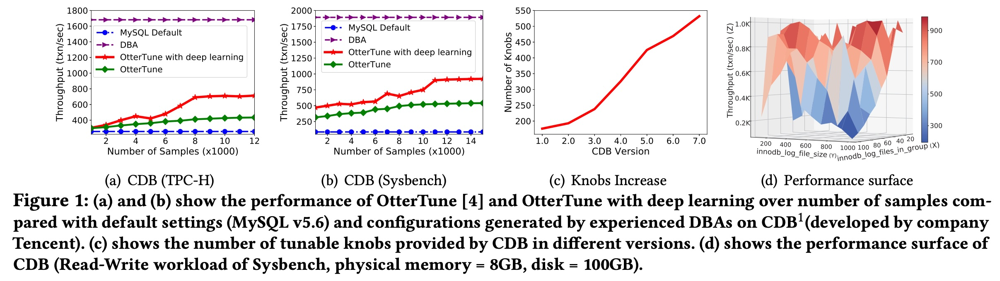  

  * **图 1(a) 和 (b)** 显示，OtterTune（一个著名的调优工具）在缺少高质量样本时，性能甚至还不如 DBA 专家，而且增加样本数量，性能提升也有限 。
  * **图 1(c)** 显示，数据库版本的升级，旋钮数量还在不断增加，问题越来越难 。
  * **图 1(d)** 显示，性能和旋钮之间的关系是复杂的、非线性的，不是简单地“调高就好” 。

### 2\. CDBTune 是如何工作的？(核心方法)

CDBTune 的高明之处在于它**把数据库调优问题 100% 映射到了强化学习 (RL) 的框架中**。

#### A. 整体架构 (图 2)

我们先看一下它的系统架构（见论文图 2）：  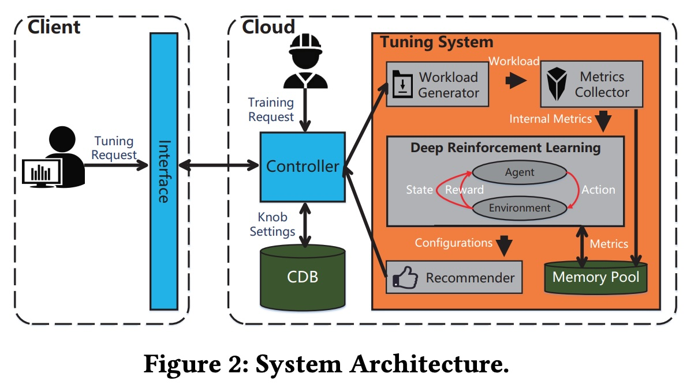  

  * **客户端 (Client)**：用户或 DBA 发起一个“调优请求” 。
  * **控制器 (Controller)**：云环境中的“总指挥”，负责协调客户端、数据库 (CDB) 和调优系统 。
  * **调优系统 (Tuning System)**：这是核心。
      * `Workload Generator` (负载生成器)：负责在数据库上“重放”用户的真实负载，以测试性能 。
      * `Metrics Collector` (指标收集器)：收集数据库的“内功”和“外功”数据 。
      * `Deep Reinforcement Learning` (深度强化学习模块)： **CDBTune 的“大脑”** ，负责根据指标，做出“调哪个旋钮”的决策 。
      * `Recommender` (推荐器)：执行 DRL 大脑的决定，把新的配置应用到数据库上 。

#### B. 核心：强化学习 (RL) 映射 (图 3)

这是理解本论文的**关键**。CDBTune 如何把调优变成一个“AI 打游戏”的过程？（见论文图 3）    

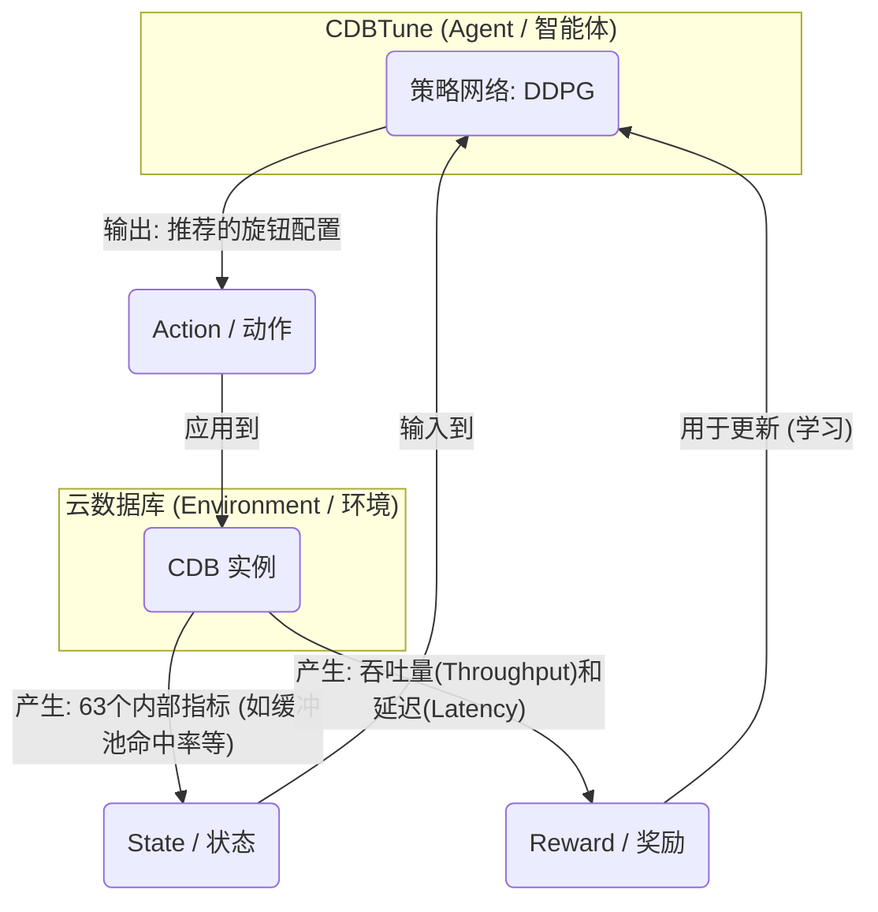

  * **Agent (智能体)**：就是 **CDBTune 系统** 。
  * **Environment (环境)**：就是那台**云数据库 (CDB)** 实例 。
  * **State (状态)**：Agent 的“输入”。CDBTune 通过执行 "show status" 之类的命令，收集了 **63 个数据库内部指标**（如页面读写次数、锁等待等）作为当前的状态向量 。
  * **Action (动作)**：Agent 的“输出”。就是 CDBTune **推荐的一整套旋钮配置**（比如，{buffer\_size: 1G, log\_size: 256M, ...}）。
  * **Reward (奖励)**：这是“灵魂”。Agent 做出一个 Action（推荐了新配置）后，系统会应用这个配置，跑一下负载，看看性能（吞吐量和延迟）是变好了还是变差了。**性能的变化量就是“奖励”** 。

#### C. 关键算法：DDPG (图 4)

有了 RL 框架，用什么具体算法呢？

  * **为什么不用 Q-Learning/DQN？** 因为这些算法只能处理“离散动作”（比如上、下、左、右）。而数据库旋钮的值是**连续的**（比如 1.1GB 还是 1.2GB），动作空间是无限大的 。
  * **为什么选择 DDPG？** DDPG（深度确定性策略梯度）是一种**专门解决高维、连续动作空间**的 DRL 算法 。

DDPG 使用了一个 **Actor-Critic (演员-评论家)** 架构（见论文图 4）：    

1.  **Actor (演员) 网络** 

      * **职责**：负责“表演” (做动作)。
      * **输入**：State (63个内部指标) 。
      * **输出**：**一个具体的 Action** (所有旋钮的具体值) 。
      * **目标**：它的目标是学会“演”得更好，即输出一个能获得最高“评价”的旋钮组合。

2.  **Critic (评论家) 网络** 

      * **职责**：负责“评价”演员的表演。
      * **输入**：State (内部指标) + Actor 表演的 Action (旋钮值) 。
      * **输出**：一个“Q值”（分数），预测这个 Action 在当前 State 下“有多好” 。
      * **目标**：它的目标是“评”得更准，它的评价标准来自真实的 **Reward (奖励)**。

**学习过程**：Actor 负责输出旋钮配置，Critic 负责给这个配置打分。Actor 会根据 Critic 的“指导”(Loss Guide)  来调整自己的策略，**尽量做出让 Critic 打高分的动作** 。而 Critic 则根据环境返回的真实“奖励” (Reward) 来调整自己的打分标准 。两者相互博弈，共同进步。

#### D. 灵魂：奖励函数 (Reward Function)

Agent 学得好不好，全看“奖励”设计得巧不巧 。

CDBTune 的奖励函数设计得非常巧妙。它不是简单地看“这次比上次好”，而是**同时比较“ 当前性能 $D_i$ ”和“ 初始性能 $D_0$ ”以及“ 上一步性能 $D_{i-1}$ ”** 。

  * **目标**：最终性能一定要比刚开始调优时 ( $D_0$ ) 好。
  * **过程**：在调优过程中 ( $D_i$ )，我们希望它比上一步 ( $D_{i-1}$ ) 好。
  * **设计**：论文中的公式 (6)  确保了：
      * 如果性能比 $D_0$ 和 $D_{i-1}$ 都好，获得大的正奖励。
      * 如果性能比 $D_0$ 好，但比 $D_{i-1}$ 差（比如调优过程中有抖动），CDBTune 会给一个 0 奖励 。这可以避免模型在局部最优解附近“瞎逛”，鼓励它朝“比初始值好”的大方向前进。

### 3\. 实验效果怎么样？(惊艳的结果)

CDBTune 的效果非常好，在“效率”、“效果”和“适应性”上实现了全面超越。

#### A. 效率 (比 DBA 快 20 倍)

如 **表 2** 所示，对于一个在线调优请求：  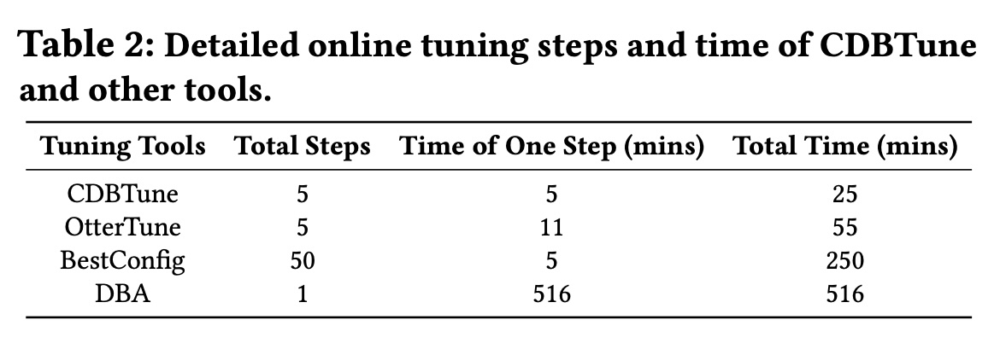  

  * **CDBTune**：**25 分钟** (5 步，每步 5 分钟) 。
  * **OtterTune**：55 分钟 。
  * **BestConfig** (搜索型)：250 分钟 。
  * **DBA 专家**：**516 分钟** (约 8.6 小时) 。

CDBTune 既快又好，调优效率吊打所有对手。

#### B. 效果 (比 DBA 专家更强)

如 **图 9** 和 **表 3** 所示 ：  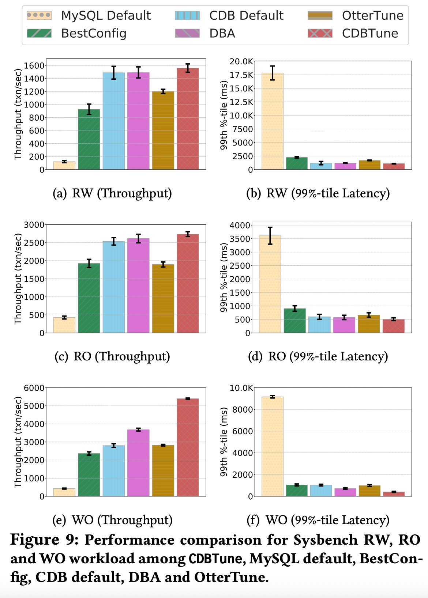  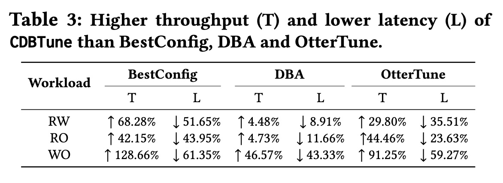  

  * 在所有 Sysbench 负载（读写、只读、只写）下，CDBTune 的性能（吞吐量更高、延迟更低）都**全面超过**了 MySQL 默认配置、BestConfig、OtterTune，甚至也**超过了拥有 12 年经验的 DBA 专家** 。
  * 特别是在“只写”(WO) 负载下，CDBTune 的吞吐量比 DBA 专家高出 **46.57%**，比 OtterTune 高出 **91.25%** 。这证明了 AI 找到了人类专家未曾发现的“更优配置组合”。

#### C. 杀手锏：强大的自适应性 (Adaptability)

这是 CDBTune 最亮眼的部分，完美解决了云环境的痛点。

  * **适应硬件变化 (图 10, 11)**  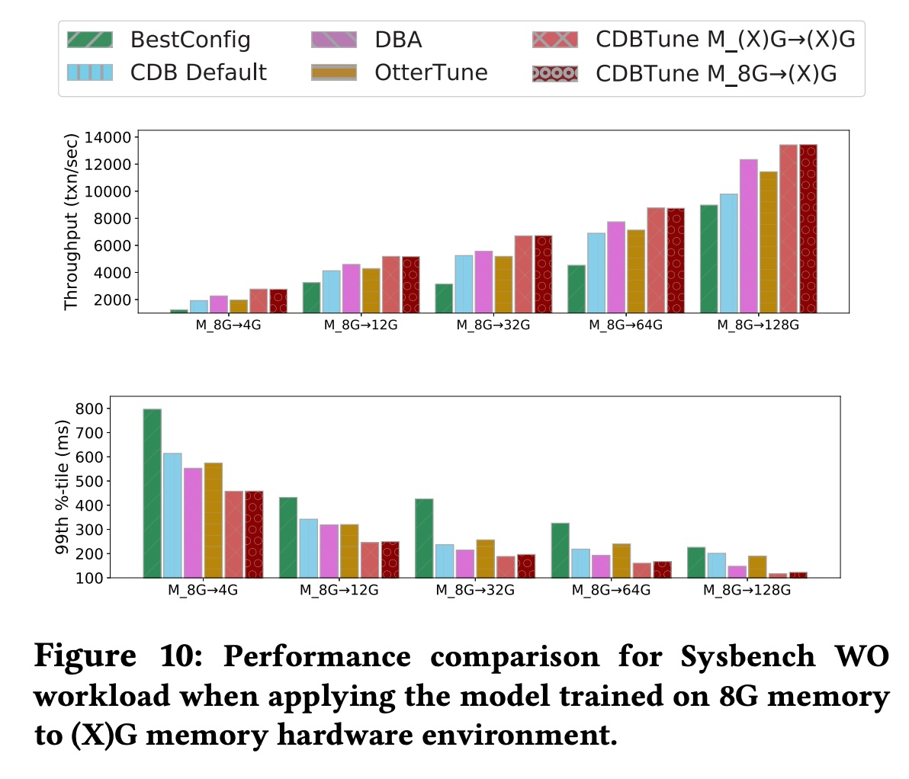  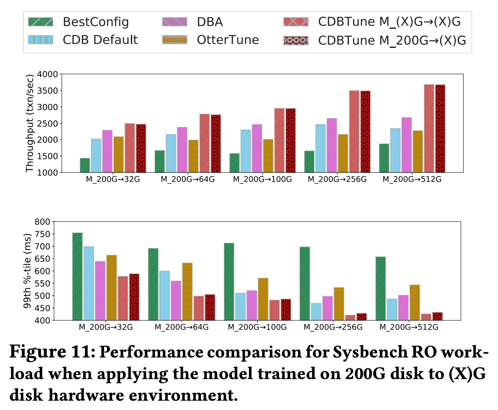  
      * **实验**：CDBTune **只在 8G 内存的机器上训练了一个模型** (M\_A) 。
      * **测试**：把这个模型**不经任何修改**，直接用到 4G, 12G, 32G, 64G, 128G 内存的机器上 (CDB-X1) 。
      * **结果**：如图 10 所示，“跨机型测试”(M\_A→X1) 的性能，和“在目标机型上专门训练” (M\_X1→X1) 的性能**几乎一样好** 。
  * **适应负载变化 (图 12)**  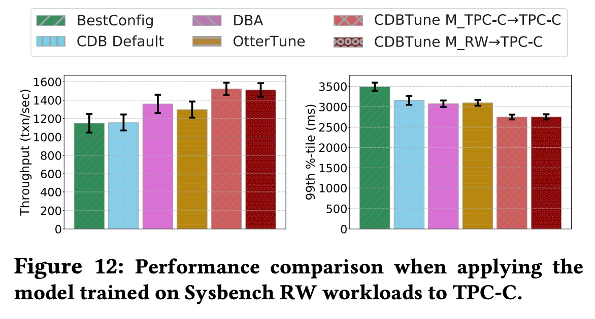  
      * **实验**：将在 Sysbench RW 负载上训练的模型 (M\_RW)，直接用到 TPC-C 这种完全不同的负载上 。
      * **结果**：性能 (M\_RW→TPC-C) 依然和专门为 TPC-C 训练的模型 (M\_TPC-C→TPC-C) **几乎一致** 。

**为什么适应性这么强？**
因为 CDBTune (RL Agent) 学到的不是“某个硬件/负载下的最优配置”（背答案），而是“**看到什么样的内部指标(State)，应该做出什么样的调整(Action)**”的**策略 (Policy)**（学本事）。只要数据库的内部指标能反映出环境和负载的变化，CDBTune 的策略就能自动适应。

### 总结

CDBTune 是数据库调优领域的一个里程碑。它通过以下贡献，真正意义上实现了智能、自动、高效的云数据库调优：

1.  **端到端**：提出了第一个基于 DRL 的端到端自动调优系统 。
2.  **解决连续空间**：使用 DDPG 的 Actor-Critic 架构，完美解决了高维连续旋钮空间的调优难题 。
3.  **不依赖大数据**：通过 RL 的“试错”机制，摆脱了对海量高质量 DBA 经验数据的依赖 。
4.  **适应性强**：模型具有极强的泛化能力，能自动适应硬件和负载的变化，是云环境的理想解决方案 。
  
## 3 术语 
  
好的，我从这篇论文中提取了最关键的术语，并为你提供通俗易懂的中文讲解。

### 论文核心术语讲解

这篇论文的核心是利用人工智能（AI）来自动调整云数据库的配置，使其达到最佳性能。

#### 1\. Knobs (旋钮)

  * **通俗讲解：**
    你可以把数据库想象成一台非常复杂的专业音响 。音响上有很多“旋钮”（Knobs），比如调音量、调高音、调低音的。
    数据库（如 MySQL）也有**几百个这样的“旋钮”** ，它们就是**配置参数**（例如 `innodb_buffer_pool_size` 缓冲池大小，`innodb_log_file_size` 日志文件大小）。
  * **为什么重要：**
    这些旋钮（参数）的组合方式直接决定了数据库的性能（跑得快不快）。但是旋钮太多，而且它们之间会相互影响（比如论文图 1(d) 所示，性能曲面非常复杂），所以手动调优非常困难 。   

#### 2\. End-to-End (端到端)

  * **通俗讲解：**
    意思是“一步到位”。以前的调优工具（如 OtterTune）是“流水线” (Pipelined) 模式 ，比如：

    1.  第一步：先猜哪些旋钮重要。
    2.  第二步：再用模型去预测性能。
        这种模式下，第一步的错误会传导到第二步，导致整体效果不好 。

    CDBTune 的“端到端”是指它**用一个单一的、统一的模型**，直接从原始输入（数据库状态）学习到最终输出（最佳旋钮配置）。

  * **为什么重要：**
    端到端避免了中间环节的误差累积，能更好地优化整体性能 。

#### 3\. Deep Reinforcement Learning (DRL / 深度强化学习)

  * **通俗讲解：**
    这是论文使用的核心 AI 技术 。我们可以把它拆开看：
      * **强化学习 (RL)：** 就像训练宠物。你让它（Agent）“试一下”（Try-and-error），如果它做对了（比如数据库性能变好了），你就给它“奖励”（Reward）；如果做错了（性能变差了），就给“惩罚”。通过不断试错，它就学会了如何拿到最多奖励。
      * **深度 (Deep)：** 指的是“深度神经网络”。因为数据库的状态和旋钮组合太复杂了，所以需要一个像“深度神经网络”这样强大的“大脑”来学习。
  * **为什么重要：**
    DRL 结合了深度学习的理解能力和强化学习的决策能力，非常适合解决这种复杂的调优问题。

#### 4\. RL 关键元素 (Agent, Environment, State, Action, Reward)

论文的 **图 3**  非常清晰地展示了 CDBTune 如何将调优问题映射为 RL 问题的：    

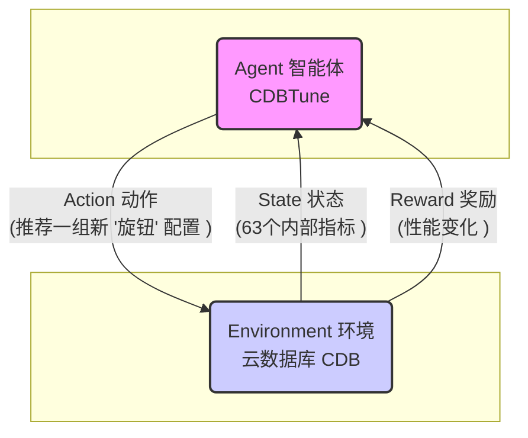

  * **Agent (智能体)：** 就是 **CDBTune 系统** 。
  * **Environment (环境)：** 就是那台**云数据库 (CDB) 实例** 。
  * **State (状态)：** Agent 的“眼睛”。它看到的是数据库的**内部指标**（论文中用了63个指标，如缓冲池命中率、读写页数等）。
  * **Action (动作)：** Agent 的“手”。它执行的动作就是**推荐一组新的旋钮配置** 。
  * **Reward (奖励)：** Agent 的“动力”。执行动作后，数据库性能（吞吐量和延迟）的变化 。性能变好，获得正奖励；性能变差，获得负奖励。

#### 5\. High-dimensional continuous space (高维连续空间)

  * **通俗讲解：**
    这是描述这个调优问题难度的“黑话”。
      * **高维 (High-dimensional)：** 指的是“旋钮”太多了，有几百个 。
      * **连续 (Continuous)：** 指的是旋钮的取值不是“A、B、C”三个选项，而是“从 1GB 到 10GB 之间的任意值”（比如 1.1G, 1.101G...）。
  * **为什么重要：**
    在这个“高维连续”的巨大空间里找一个最优组合，靠猜或遍历是绝对不可能的 。这也是为什么传统的 RL 算法（如 DQN）不行，因为它们只能处理“离散”动作（如“上、下、左、右”）。

#### 6\. DDPG (Deep Deterministic Policy Gradient)

  * **通俗讲解：**
    DDPG 是论文最终选用的 DRL 算法 。它是一种专门**为了解决“高维连续空间”问题而设计的算法** 。
  * **为什么重要：**
    DDPG 可以直接输出“连续”的动作（比如推荐 `buffer_pool_size` = 1.35GB），而不是在几个固定选项里选一个，这完美契合了数据库调优的需求 。

#### 7\. Actor-Critic (演员-评论家) 架构

  * **通俗讲解：**
    DDPG 算法的核心是它同时训练了两个神经网络，就像一个“剧组”（见论文 **图 4** ）：    

    ```mermaid
    graph TD;
        S(State 状态);
        
        subgraph "Actor (演员)"
            A_Net(Actor 网络<br>负责'表演')
        end

        subgraph "Critic (评论家)"
            C_Net(Critic 网络<br>负责'打分')
        end

        S --> A_Net;
        A_Net --"Action (旋钮配置)"--> C_Net;
        S --> C_Net;
        C_Net --"Value (分数)"--> Loss(Loss Guide 指导);
        Loss --"指导 Actor<br> '演得更好'"--> A_Net;
    ```

      * **Actor (演员) ：** 负责“表演”，也就是**直接输出动作 (Action)**。它看着当前的状态 (State)，然后决定“我应该推荐这组旋钮配置”。
      * **Critic (评论家) ：** 负责“打分”。它看着“状态”和“演员的表演（Action）”，然后 **评价这个动作“有多好”** （能得多少分）。

  * **为什么重要：**
    Actor 负责做决策，Critic 负责评估决策的好坏。两者互相配合：Actor 努力表演以取悦 Critic（获得高分），Critic 则根据真实的奖励 (Reward) 不断提升自己的“鉴赏水平”。

#### 8\. Adaptability (适应性)

  * **通俗讲解：**
    指的是“举一反三”的能力。
  * **为什么重要：**
    云环境最大的特点就是“多变”。用户的硬件（内存、磁盘） 和工作负载（业务类型） 都不一样。
    CDBTune 的一大优势是它学到的是“策略”（Policy），而不是“死记硬背”某个特定配置 。
    实验证明（例如 **图 10** 和 **图 12**），在 8G 内存上训练好的模型，**可以直接用在 32G 内存或完全不同的 TPC-C 负载上**，性能依然很好 。这种强大的适应性是传统工具（如 OtterTune）所不具备的 。      
  
## 参考        
         
https://dbgroup.cs.tsinghua.edu.cn/ligl/papers/sigmod19-cdbtune.pdf    
        
<b> 以上内容基于DeepSeek、Qwen、Gemini及诸多AI生成, 轻微人工调整, 感谢杭州深度求索人工智能、阿里云、Google等公司. </b>        
        
<b> AI 生成的内容请自行辨别正确性, 当然也多了些许踩坑的乐趣, 毕竟冒险是每个男人的天性.  </b>        
    
#### [PolarDB 学习图谱](https://www.aliyun.com/database/openpolardb/activity "8642f60e04ed0c814bf9cb9677976bd4")
  
  
#### [PostgreSQL 解决方案集合](../201706/20170601_02.md "40cff096e9ed7122c512b35d8561d9c8")
  
  
#### [德哥 / digoal's Github - 公益是一辈子的事.](https://github.com/digoal/blog/blob/master/README.md "22709685feb7cab07d30f30387f0a9ae")
  
  
#### [About 德哥](https://github.com/digoal/blog/blob/master/me/readme.md "a37735981e7704886ffd590565582dd0")
  
  

  
