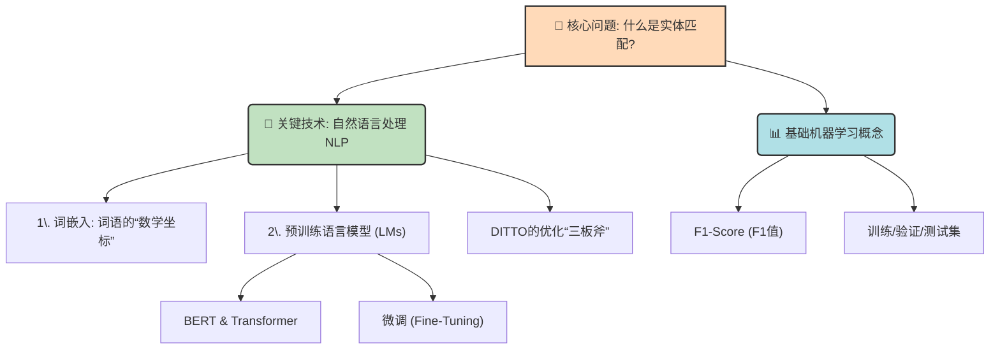
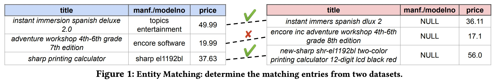
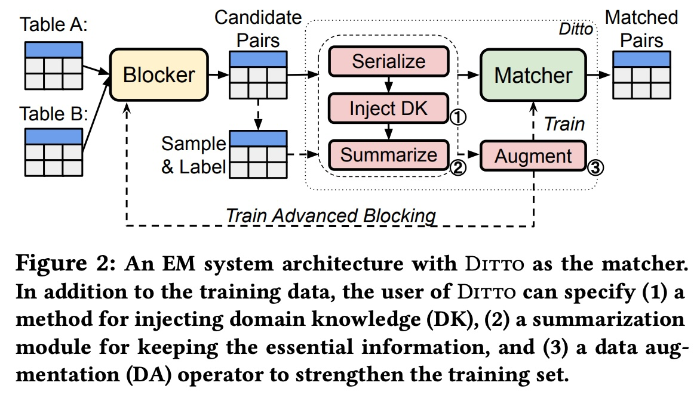
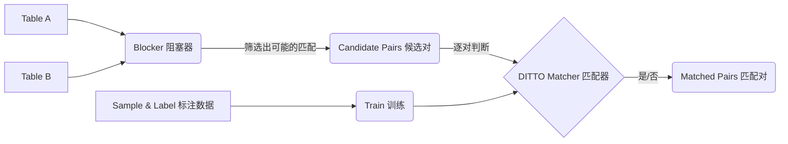
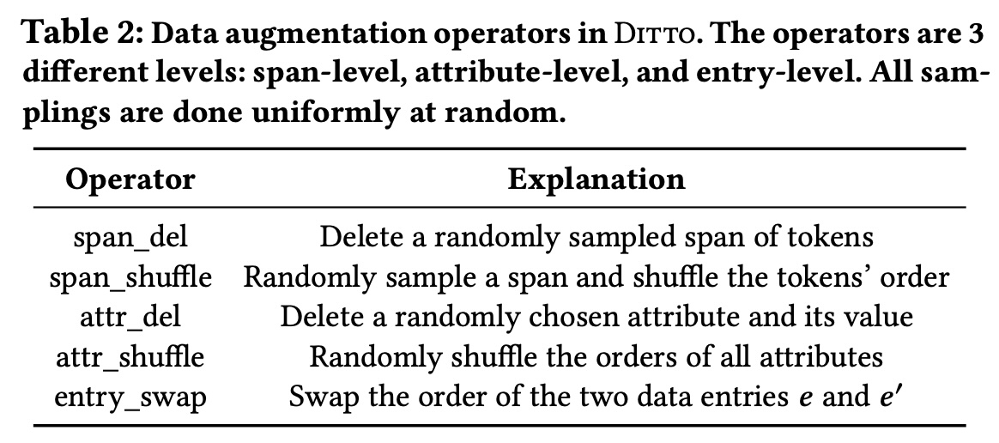
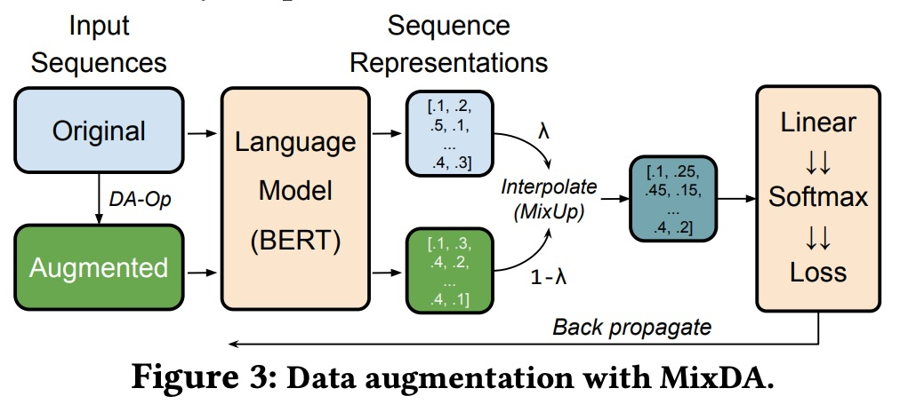
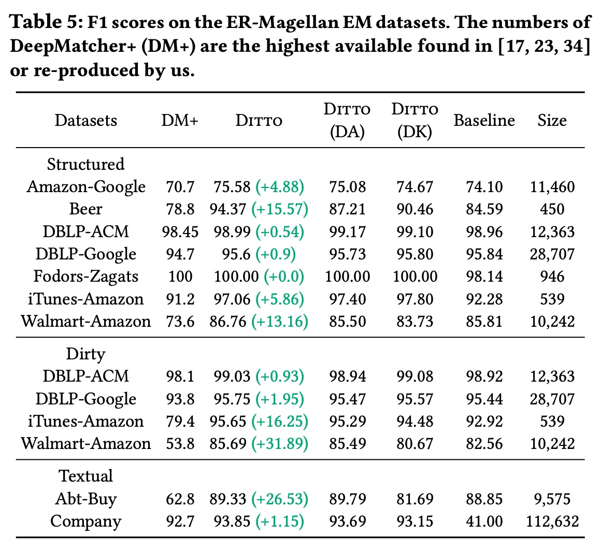
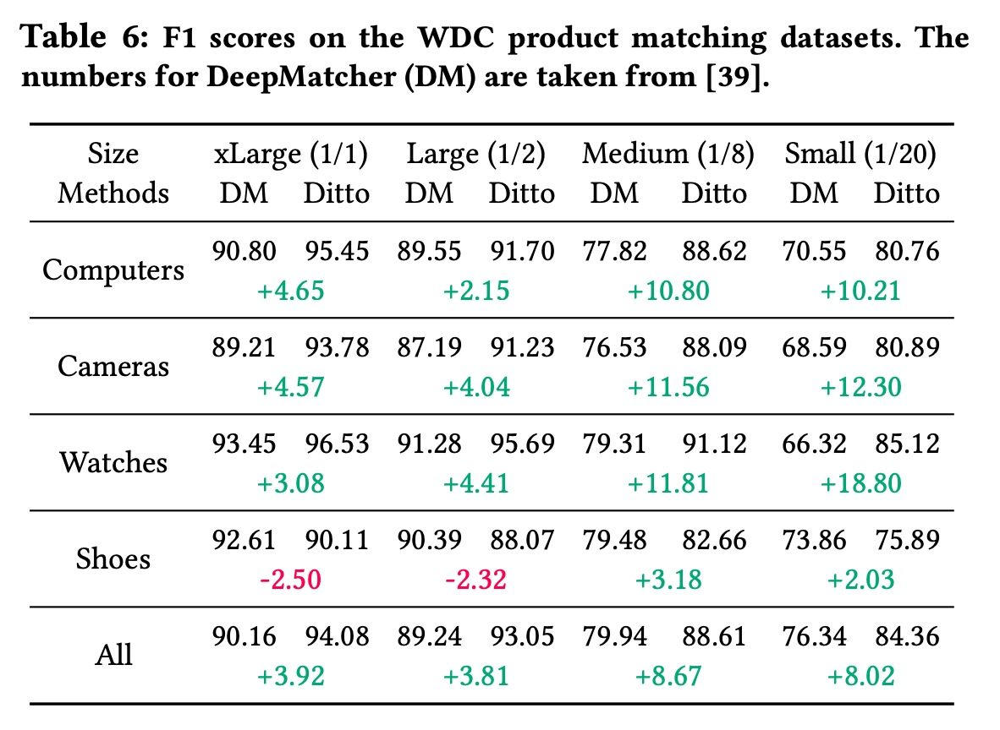
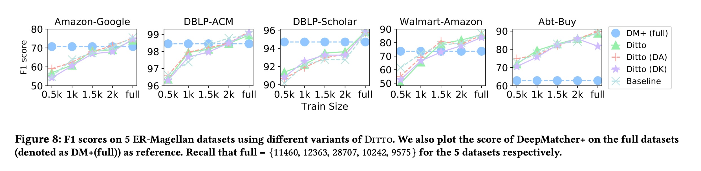
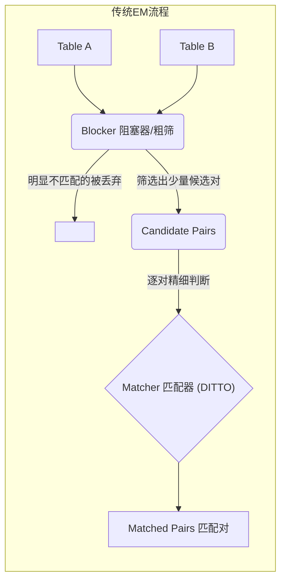

## AI论文解读 | Deep Entity Matching with Pre-Trained Language Models
        
### 作者        
digoal        
        
### 日期        
2025-11-11        
        
### 标签        
PostgreSQL , PolarDB , DuckDB , AI , 论文解读        
        
----        
        
## 背景  
      
https://arxiv.org/pdf/2004.00584        
  
提示:          
```          
读懂《Deep Entity Matching with Pre-Trained Language Models》这篇论文需要提前掌握哪些基础知识, 请使用中文通熟易懂的讲解这些基础知识, 可以引用论文中的图、表或使用Markdown支持的图形(text,mermaid等)增加解释性. 
  
使用中文通熟易懂的解读《Deep Entity Matching with Pre-Trained Language Models》这篇论文, 其中的关键内容请着重讲解, 可以引用论文中的图、表或使用Markdown支持的图形(text,mermaid等)增加解释性. 
  
提取《Deep Entity Matching with Pre-Trained Language Models》这篇论文中的重要术语, 使用中文对这些术语进行通熟易懂的讲解, 可以引用论文中的图、表或使用Markdown支持的图形(text,mermaid等)增加解释性. 
```     
  
## 1 前置知识 
  
要读懂这篇关于DITTO  的论文, 你需要一个“知识工具箱”, 里面装着从“什么是实体匹配”的基础概念, 到“BERT模型如何工作”的AI核心技术。

简单来说, 这篇论文介绍了一个名为DITTO的系统, 它非常擅长做“数据对对碰” (即**实体匹配**)。它的核心武器是当今强大的人工智能技术——**预训练语言模型** (比如BERT) 。

为了帮助你理解, 我把需要的基础知识拆分成了几个模块, 就像一个“技能树”：



-----

### 🎯 1. 核心问题: 什么是实体匹配 (EM)?

这是你首先要理解的, 也是论文要解决的问题。

  * **通俗解释:** 实体匹配 (Entity Matching, EM) 就是判断两条来自不同地方的数据, 是不是在描述**同一个现实世界的东西** 。
  * **论文中的例子 (Figure 1):** 想象你有两个表格, 都是卖产品的 (见下图) 。    
      * 表A的第1条: "instant immersion spanish deluxe 2.0"
      * 表B的第1条: "instant immers spanish dlux 2"
      * **EM的任务:** 判断这两条是不是指的同一个软件？(答案是：是 )。
      * **难点在哪?** 它们拼写不同 ("deluxe" vs "dlux", "immersion" vs "immers"), 但语义相同 。而有时, 两条数据长得很像, 比如第2条 "adventure workshop... 7th edition" vs "... 8th edition", 它们反而不是同一个东西 。

在处理大型数据集时, 你不可能比较所有可能的配对 (比如表A有1000条, 表B有1000条, 那就是100万对)。因此, 通常会有一个预处理步骤叫做 **"Blocking" (分块)**, 它会先把那些“明显不可能”匹配的对筛掉, 减少计算量 。

### 🤖 2. 关键技术: 自然语言处理 (NLP)

DITTO的核心是利用NLP技术来“读懂”数据。

#### A. 词嵌入 (Word Embeddings)

  * **概念:** 计算机不认识汉字或字母, 只认识数字。词嵌入就是把每个词或短语, 转换成一个多维的“数学坐标” (即一个向量)。
  * **传统 vs. DITTO (上下文):**
      * **传统 (如 FastText ):** 无论 "Sharp" 出现在 "Sharp TV" (夏普电视) 还是 "Sharp resolution" (清晰的分辨率) 中, 它的“坐标”都是一样的。
      * **DITTO (使用BERT):** 它能理解**上下文** 。它知道前一个 "Sharp" 是品牌, 后一个是形容词, 因此会给它们**不同**的“坐标” 。这就是DITTO效果好的关键原因之一。

#### B. 预训练语言模型 (Pre-trained LMs)

这是理解本论文**最核心**的知识点。

  * **1. 什么是 "预训练" (Pre-trained)?**
      * 想象一个学生 (语言模型), 在参加特定考试 (EM任务) 之前, 先阅读了互联网上几乎所有的书籍和文章 (如维基百科) 。
      * 通过这种海量阅读, 它学会了语法、常识、语义和上下文理解能力 。这个过程就是“预训练”。
  * **2. 什么是 BERT (和 Transformer)?**
      * **BERT** 是目前最著名的预训练语言模型之一 。
      * **Transformer** 是 BERT 的“大脑”架构, 它使用一种叫做“自注意力 (Self-Attention)”的机制, 能够在处理一个词时, 同时关注到句子中所有其他相关的词, 从而完美捕捉上下文。
  * **3. 什么是 "微调" (Fine-Tuning)?**
      * 你把那个“博览群书”的学生 (预训练好的BERT) 找来, 给他一本薄薄的、针对特定考试 (EM任务) 的习题集 (即标注好的训练数据) 。
      * 你让他做这些题, 并告诉他答案 (匹配/不匹配)。这个过程就是“微调” 。DITTO就是这样训练的。

#### C. DITTO 如何利用 "微调"

DITTO把“实体匹配”巧妙地伪装成了一个BERT天生就擅长的任务：**序列对分类 (Sequence-Pair Classification)** 。

  * **1. 序列化 (Serialize):**
      * DITTO首先把两条要比较的数据 (比如两个产品) 转换成一个**长字符串** 。
      * 它会用特殊的标签 (Token) 来保留数据的结构, 比如 `[COL]` 代表列名, `[VAL]` 代表值 。
      * **示例 (来自论文 ):**
        `[COL] title [VAL] instant immers spanish dlux 2 [COL] manf./modelno [VAL] NULL [COL] price [VAL] 36.11`
  * **2. 构成分类任务:**
      * 然后, DITTO把两条序列化的数据用一个 `[SEP]` (分隔符) 拼起来, 并在最前面放一个 `[CLS]` 标签 。
      * **最终输入BERT的格式:**
        `[CLS] 序列化后的数据A [SEP] 序列化后的数据B [SEP]`
  * **3. 得到答案:**
      * BERT会“阅读”这个长字符串, 并在 `[CLS]` 标签对应的位置输出一个最终的“总结”向量 。
      * DITTO在这个向量后面接一个简单的分类器, 告诉它只需要输出两个答案：“匹配”或“不匹配” 。

#### D. DITTO的"优化三板斧"

DITTO不只是用了BERT, 还加了三个优化, 你需要知道这些优化的基本思想：

1.  **注入领域知识 (Domain Knowledge, DK):**
      * **概念:** 有些信息比其他信息更重要。比如匹配地址时, "街道号" 很重要；匹配电话时, "后4位" 很重要 。
      * **DITTO的做法:** 通过给这些重要信息打上**特殊标签**来"提醒"模型 。
      * **示例:** 电话 `(866) 246-6453` 会被处理成 `(866) 246-[LAST] 6453 [/LAST]`。模型在微调时会学会`[LAST]`标签的重要性。
2.  **文本摘要 (Summarization):**
      * **原因:** BERT这类模型有输入长度限制 (比如512个词) 。如果产品描述特别长, 就会放不下。
      * **DITTO的做法:** 使用 **TF-IDF** (一种统计方法, 用来找出一个词在文章中的重要程度) 来筛选关键词, 扔掉不重要的词 (如 "的", "a" 等), 生成一个简短的摘要 。
3.  **数据增强 (Data Augmentation, DA):**
      * **概念:** 训练数据太少, 模型容易学“跑偏”。数据增强就是通过对现有数据做一些"小手术", 凭空造出更多、更难的训练数据 。
      * **DITTO的做法:**
          * **`attr_del` (删除属性) :** 随机删掉一条数据的某个属性 (比如"价格"), 然后告诉模型这俩还是匹配的。这能迫使模型学会依赖其他属性 (比如"标题") 来做判断 。
          * **`span_del` (删除词):** 随机删除几个词。

### 📊 3. 基础机器学习概念

这些是评估DITTO做得好不好的“尺子”。

  * **F1-Score (F1值):**
      * 这是评估EM任务最常用的指标 。
      * 你不用管复杂的公式, 只需要知道：F1值是 **准确率 (Precision)** 和 **召回率 (Recall)** 的平衡。
          * **高准确率:** DITTO说“匹配”的, 基本都是真的“匹配”。(查得准)
          * **高召回率:** 现实中所有“匹配”的, DITTO基本都找到了。(查得全)
      * F1值越高, 说明模型效果越好 。
  * **训练/验证/测试集 (Train/Validation/Test Sets):**
      * **训练集 (Train):** 用来“微调”模型的课本和习题 。
      * **验证集 (Validation):** 用来在训练过程中调整模型参数 (比如决定什么时候停止训练) 的模拟考试 。
      * **测试集 (Test):** 在模型训练完成后, 用来评估模型最终效果的“高考”。论文中表格里的F1值, 都是在测试集上得到的 。

掌握了这些知识点, 你就能看懂DITTO是如何利用预训练语言模型的上下文理解能力, 通过序列化、微调和一系列优化技巧, 高效且精准地解决了实体匹配这个难题。

-----

是否需要我为你详细解释一下DITTO的某一个优化技巧, 比如“数据增强”是如何具体操作的？
  
## 2 解读论文 
  
这是一篇来自 Megagon Labs 和威斯康星大学麦迪逊分校的研究者在 2020 年发表的论文 ，它介绍了一个名为 DITTO 的新型实体匹配（Entity Matching, EM）系统 。

DITTO 的核心思想是**利用预训练的 Transformer 语言模型（如 BERT）强大的语言理解能力，来解决实体匹配问题** 。它通过一种巧妙的“序列化”方法，将EM任务转化为了一个简单的序列对分类任务 ，并配合三项优化技术，在多个基准数据集上取得了远超当时最先进（SOTA）方法的效果，F1 分数最高提升了 29% 。

-----

### 1\. 什么是实体匹配 (EM)？

实体匹配（EM）的任务是判断两条来自不同数据源的记录是否指向现实世界中的同一个实体 。

例如，论文的**图1 (Figure 1)**  给出了一个直观的例子：    

  * **Table A** 中有一条记录：`"instant immersion spanish deluxe 2.0"` 
  * **Table B** 中有一条记录：`"instant immers spanish dlux 2"` 
    尽管这两条记录在拼写、缩写（deluxe vs dlux）和版本号（2.0 vs 2）上存在差异 ，但它们实际上指的是同一款软件产品。EM 的目标就是找出这种匹配关系 。以往的系统很难正确分辨这种细微差别，但 DITTO 能够凭借其强大的语言理解能力正确识别 。

### 2\. DITTO 是如何工作的？

DITTO 的工作流程可以分为两个核心部分：**整体架构**和**序列化方法**。

#### 核心架构

**图2 (Figure 2)**  展示了 DITTO 在一个完整EM系统中的位置。一个典型的EM流程如下：    



1.  **Blocker (阻塞器):** 由于比较所有可能的A-B对（即笛卡尔积）计算量太大，Blocker 会先进行一次粗筛，快速过滤掉那些明显不匹配的组合，只保留“候选对”（Candidate Pairs） 。
2.  **Matcher (匹配器):** DITTO 在这里充当核心的匹配器角色 。它接收 Blocker 筛选出的“候选对”，并精确判断每一对（e, e'）是“匹配”还是“不匹配” 。

#### 关键创新：序列对分类 (Sequence-Pair Classification)

这是 DITTO 最巧妙的设计。它没有使用复杂的定制神经网络 ，而是将EM问题**重新定义为一个序列对分类问题** 。

它通过“序列化”（Serialize）将两条要比较的记录（e 和 e'）转换成一个**单一的长字符串** ，然后喂给 BERT 进行分类。

**序列化规则如下：**

1.  **单条记录 (e) 的序列化：**
    将一条记录 `{(attr, val), ...}` 转换为 `[COL] attr1 [VAL] val1 [COL] attr2 [VAL] val2 ...` 的格式 。

      * *例如 (来自论文 )：*
        > `[COL] title [VAL] instant immers spanish dlux 2 [COL] manf./modelno [VAL] NULL [COL] price [VAL] 36.11`

2.  **两条记录 (e, e') 的序列化：**
    使用 `[SEP]` 特殊标记将两条序列化的记录拼接起来，并以 `[CLS]` 开头 。

      * *格式如下 ：*
        > `[CLS] serialize(e) [SEP] serialize(e') [SEP]`

这个最终的字符串被输入到 BERT 模型中 ，模型会输出一个“匹配”或“不匹配”的分类结果 。

**这种方法的巨大优势在于：**

  * **架构简单：** 无需像以前的SOTA（如DeepMatcher）那样设计复杂的属性聚合和对齐网络 。
  * **模式灵活：** 它不要求两个表具有相同的结构（Schema），也无需在匹配前手动对齐属性 ，极大简化了数据预处理。

-----

### 3\. DITTO 的三大优化“法宝”

为了让模型“学得更好”，DITTO 在基础架构之上开发了三种优化技术 。

#### 法宝一：融入领域知识 (Domain Knowledge, DK) 

**目标：** 帮助模型“抓住重点”，告诉它在比较时应该更关注哪些信息 。
**方法：** 通过在序列化时添加特殊的标签来实现 。

  * **跨度类型 (Span Typing):** 识别并标记出关键信息类型 。例如，将电话号码 `(866) 246-6453` 标记为 `(866) 246-[LAST] 6453 [/LAST]` 。这样，模型在比较两个序列时，就会更倾向于对齐两个都被 `[LAST]` 标记的跨度 。
  * **跨度归一化 (Span Normalization):** 将语法不同但含义相同的字符串统一格式 。例如，将 "VLDB journal" 和 "VLDBJ" 都统一为 "VLDBJ" ，或将 "5%" 和 "5.00%" 都统一为 "5.0%" 。

#### 法宝二：文本摘要 (Summarization, SU) 

**目标：** 解决输入过长的问题 。
**背景：** BERT 等模型有最大序列长度限制（如512个Token）。如果序列化后的字符串太长，必须进行处理 。
**方法：** DITTO 不使用简单的“截断” （因为重要信息可能在末尾 ），而是采用 **TF-IDF** 摘要技术 。它会保留那些 TF-IDF 分数高（即信息量大）的非停用词 Token 。
**效果：** 这个优化极其关键。在论文的实验中，对于一个文本很长的数据集 (Company)，**使用摘要将 F1 分数从 41% 暴涨到了 93% 以上** 。

#### 法宝三：数据增强 (Data Augmentation, DA) 

**目标：** 制造出更多、更“难”的训练样本 ，迫使模型学习如何处理“脏数据”（如缺失值、错位值等） ，提升模型的鲁棒性 。
**方法：**

1.  **DA 操作符 (Operators):** DITTO 设计了多种操作（见 **表2 (Table 2)** ），例如：     

      * `span_del`：随机删除一个小的文本跨度 。
      * `attr_del`：随机删除一整个属性（包括属性名和值） 。
      * `attr_shuffle`：随机打乱所有属性的顺序 。
      * `entry_swap`：随机交换两条记录 (e, e') 的输入顺序 。

2.  **MixDA (关键技术):**
    直接用上述操作增强数据，有时会“破坏”原始信息，导致标签都变错了 。
    因此，DITTO 采用了 **MixDA** 技术 （如 **图3 (Figure 3)** 所示 ）。它不是直接使用增强后的样本 (s\_aug) 训练，而是将**原始样本 (s\_orig) 和增强样本 (s\_aug) 在通过语言模型后的“表示向量”进行线性插值**（即混合） 。    

    `LM(s_new) = λ * LM(s_orig) + (1 - λ) * LM(s_aug)` 

    这样得到的“半增强”样本，既增加了难度，又保留了原始信息，效果更好 。

-----

### 4\. 实验效果：显著的性能提升

DITTO 的效果非常惊人，主要体现在两个方面：

**1. 性能远超 SOTA**

  * **表5 (Table 5)**  显示，在13个 ER-Magellan 数据集上，DITTO 全面超越了之前的 SOTA (DM+) 。    
  * **尤其在“脏数据”集上，提升巨大：**
      * `Dirty Walmart-Amazon`：DM+ 的 F1 仅为 53.8，DITTO 达到了 **85.69** (提升近 32%) 。
      * `Dirty iTunes-Amazon`：DM+ 为 79.4，DITTO 达到了 **95.65** (提升超 16%) 。
      * `Abt-Buy` (长文本)：DM+ 为 62.8，DITTO 达到了 **89.33** (提升超 26%) 。

**2. 标签效率极高 (Label Efficient)**

  * DITTO 不需要海量的标注数据 。
  * **表6 (Table 6)**  (WDC数据集) 显示，DITTO **仅使用 1/2 的训练数据 (Large)，其 F1 分数 (93.05) 就已经超过了 DeepMatcher 使用全部数据 (xLarge) 的分数 (90.16)** 。    
  * **图8 (Figure 8)**  (ER-Magellan) 进一步证明，在多个数据集上，DITTO 仅使用**不到 20% 的训练数据 (2000个样本)，就能达到或超过 DM+ 使用全部数据训练的性能** 。    

**真实世界案例 (Case Study):**
DITTO 还被应用于一个真实的大型雇主匹配任务（两个表分别有 789K 和 412K 条记录） 。在仅有少量标注数据的情况下，DITTO 依然取得了 **96.5% 的高 F1 分数** 。

### 总结

DITTO 通过一个简单而巧妙的**序列对分类架构** ，成功地将预训练语言模型（如BERT）的强大威力引入了实体匹配领域 。它所配套的**领域知识注入 (DK)**、**文本摘要 (SU)** 和**数据增强 (DA)** 三大优化技术 ，进一步提升了模型的准确性和鲁棒性 。DITTO 不仅在性能上大幅超越了以往的 SOTA，更重要的是，它极高的“标签效率”使其在现实世界的应用中具有巨大价值 。
  
## 3 术语 
  
好的，这篇论文《Deep Entity Matching with Pre-Trained Language Models》提出了一个名为 DITTO 的新系统，它在实体匹配（EM）领域取得了SOTA（当时最先进）的成果。

以下是对论文中关键术语的提取与通俗易懂的中文讲解：

-----

### 1\. 核心问题与方案

#### 🔹 Entity Matching (EM) 实体匹配

**通俗讲解：**
实体匹配（EM）就是要解决“**这两条数据说的是不是同一个东西？**”的问题 。
想象一下，你有两张表，一张来自京东（表A），一张来自淘宝（表B）。表A有一条“*苹果 iPhone 12 Pro Max 256G 海蓝色*”，表B有一条“*iPhone 12 Pro Max 256G Apple/苹果 蓝色*”。
EM的任务就是自动判断出这两条记录指向的是**同一个现实世界的实体**（即同一款手机）。

#### 🔹 DITTO

**通俗讲解：**
DITTO 是这篇论文提出的**新型实体匹配系统**的名称 。它的核心武器是使用了**预训练的 Transformer 语言模型**（比如 BERT）。DITTO 的目标是利用这些模型强大的语言理解能力，来更准确地完成实体匹配任务。

#### 🔹 Blocking (阻塞)

**通俗讲解：**
“阻塞”是实体匹配流程中的一个**预处理步骤** 。
如果表A有100万条数据，表B也有100万条，那么理论上你需要比较 100万 x 100万 = 1万亿次，这在计算上是不可行的。
Blocking 的作用就是进行一次“**粗筛**”，快速过滤掉那些“**明显不匹配**”的组合（比如“iPhone 12”和“华为Mate 40”），只保留一小部分“**可能匹配**”的候选对（Candidate Pairs）。DITTO 则负责在这些候选对中进行“精筛”。

**流程示意图：**



### 2\. DITTO 的核心技术

#### 🔹 Pre-trained Language Models (LMs) 预训练语言模型

**通俗讲解：**
这是 DITTO 使用的核心技术，特指基于 Transformer 的模型，如 **BERT**、**RoBERTa** 或 **DistilBERT** 。
这些模型在“预训练”阶段阅读了海量的文本（如维基百科），学会了丰富的语法和语义知识，即拥有了强大的“**语言理解能力**” 。
DITTO 利用这种能力，使其能够理解像 “deluxe” 和 “dlux”、“2.0” 和 “2” 在特定上下文中可能指的是同一事物，这是传统方法很难做到的 。

#### 🔹 Serialization (序列化)

**通俗讲解：**
这是 DITTO **最关键的创新**。
BERT 这类模型只能“吃”文本序列（一长串文字），但我们的数据是“结构化”的（即“属性-值”对，如 `title: 'iPhone 12'`）。
“序列化”就是指 DITTO **将两条要比较的结构化记录，转换成一个符合 BERT 输入格式的单一长字符串** 。

**转换规则 (如论文 2.3 节所述):**

1.  **单条记录 `e` 的序列化** `serialize(e)` ：

      * 格式：`[COL] 属性1 [VAL] 值1 [COL] 属性2 [VAL] 值2 ...`
      * *示例 (来自论文)*：`[COL] title [VAL] instant immers spanish dlux 2 [COL] manf./modelno [VAL] NULL [COL] price [VAL] 36.11` 

2.  **两条记录 `(e, e')` 的序列化** ：

      * 格式：`[CLS] serialize(e) [SEP] serialize(e') [SEP]` 
      * `[CLS]` 和 `[SEP]` 是 BERT 需要的特殊标记 。

#### 🔹 Sequence-pair classification (序列对分类)

**通俗讲解：**
通过“序列化”，DITTO 成功地将复杂的实体匹配问题，**转化（cast）成了一个简单的“序列对分类”任务** 。
模型（如BERT）要做的就是读取这个拼接好的长字符串，然后输出一个分类结果：“**匹配**”或“**不匹配**” 。

### 3\. DITTO 的三项优化技术

为了让模型“学得更好”，DITTO 还开发了三种优化技术 。

#### 🔹 1. Domain Knowledge (DK) 领域知识注入

**通俗讲解：**
允许人类专家告诉模型“**匹配时应该重点看哪里**” 。
例如，在比较书籍时，专家知道“版次”很重要；在比较公司时，电话的“后四位”可能比前几位更重要。DITTO 通过两种方式注入这种知识：

  * **Span Typing (跨度类型):**
    在序列化时，用特殊的标签把关键信息“圈”出来 。

      * *示例 (来自论文)*：电话号码 `(866) 246-6453` 可以被标记为 `(866) 246-[LAST] 6453 [/LAST]` 。这样模型就会特别关注 `[LAST]` 标签内的内容。

  * **Span Normalization (跨度归一化):**
    将不同写法但含义相同的词，在输入模型前就统一成标准格式 。

      * *示例 (来自论文)*：把 “5%” 和 “5.00%” 都归一化为 “5.0%” 。

#### 🔹 2. Summarization (SU) 摘要

**通俗讲解：**
BERT 这类模型有输入长度限制（比如 512 个字符）。如果两条记录的描述特别长（比如商品详情页），序列化后会“爆表”。
常规做法是“截断”，但这可能丢掉关键信息。DITTO 的“摘要”优化使用 **TF-IDF 算法**，**保留那些信息量最大（即最重要）的词语**，丢弃不重要的词（如停用词），生成一个“浓缩版”的序列 。

  * **效果**：这项优化在处理长文本时至关重要。论文实验显示，在一个长文本数据集 (Company) 上，使用摘要将 F1 分数从 41% 提升到了 93% 以上 。

#### 🔹 3. Data Augmentation (DA) 数据增强

**通俗讲解：**
数据增强的目的是“**凭空制造更多、更难的训练数据**”，强迫模型学习如何处理“脏数据”（如缺失值、拼写错误等），提升模型的鲁棒性 。
DITTO 设计了一系列针对 EM 任务的“捣乱”操作（见 **表2 (Table 2)** ）：     

  * `span_del`：随机删除一小段文字（模拟信息缺失）。
  * `attr_del`：随机删除一整个属性（模拟属性缺失）。
  * `attr_shuffle`：随机打乱属性的顺序（让模型明白顺序不重要）。
  * `entry_swap`：随机交换两条记录 `(e, e')` 的顺序 。

-----

### 4\. 关键技术与成果

#### 🔹 MixDA

**通俗讲解：**
这是 DITTO 在“数据增强”中使用的具体技术（见 **图3 (Figure 3)** ）。    
直接使用上面那些“捣乱”操作（DA）有时会把原始信息破坏得太严重。MixDA 的做法更温和：它不直接用“增强后”的样本去训练，而是把“**原始样本**”和“**增强样本**”在通过 BERT 模型后的**表示向量（Representations）进行线性插值（混合）** 。
这样得到的“半增强”样本，既增加了训练难度，又保留了原始信息，效果更好。

#### 🔹 Label Efficiency (标签效率)

**通俗讲解：**
这是 DITTO 取得的一个关键成果。它指的是 DITTO **不需要海量的标注数据就能达到很好的效果** 。
在机器学习中，获取大量高质量的“已标注”训练数据（即告诉模型“这对是匹配的”、“那对是不匹配的”）是非常昂贵的。
论文的实验证明（见 **表6** 和 **图8**），DITTO **仅使用不到一半（甚至 1/8）的训练数据，就能达到甚至超过** 以前 SOTA 方法（如 DeepMatcher）使用全部数据训练的效果 。这在现实应用中非常有价值。      
  
## 参考        
         
https://arxiv.org/pdf/2004.00584    
        
<b> 以上内容基于DeepSeek、Qwen、Gemini及诸多AI生成, 轻微人工调整, 感谢杭州深度求索人工智能、阿里云、Google等公司. </b>        
        
<b> AI 生成的内容请自行辨别正确性, 当然也多了些许踩坑的乐趣, 毕竟冒险是每个男人的天性.  </b>        
    
#### [PolarDB 学习图谱](https://www.aliyun.com/database/openpolardb/activity "8642f60e04ed0c814bf9cb9677976bd4")
  
  
#### [PostgreSQL 解决方案集合](../201706/20170601_02.md "40cff096e9ed7122c512b35d8561d9c8")
  
  
#### [德哥 / digoal's Github - 公益是一辈子的事.](https://github.com/digoal/blog/blob/master/README.md "22709685feb7cab07d30f30387f0a9ae")
  
  
#### [About 德哥](https://github.com/digoal/blog/blob/master/me/readme.md "a37735981e7704886ffd590565582dd0")
  
  

  
