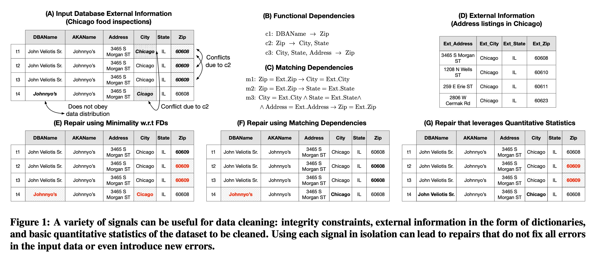
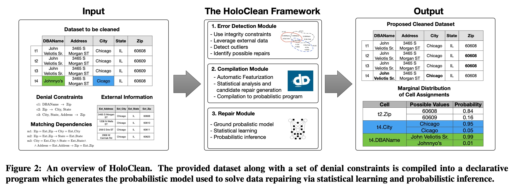
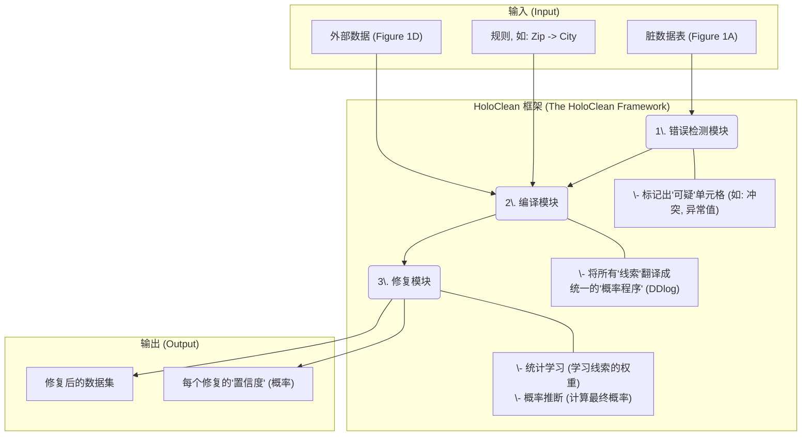
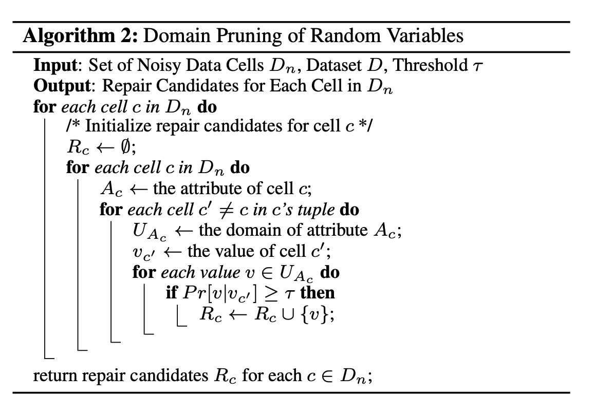
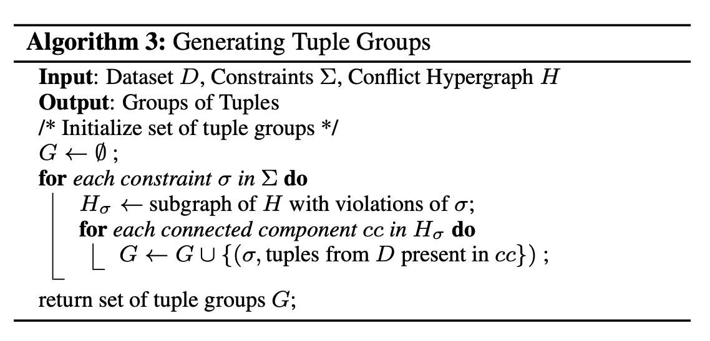
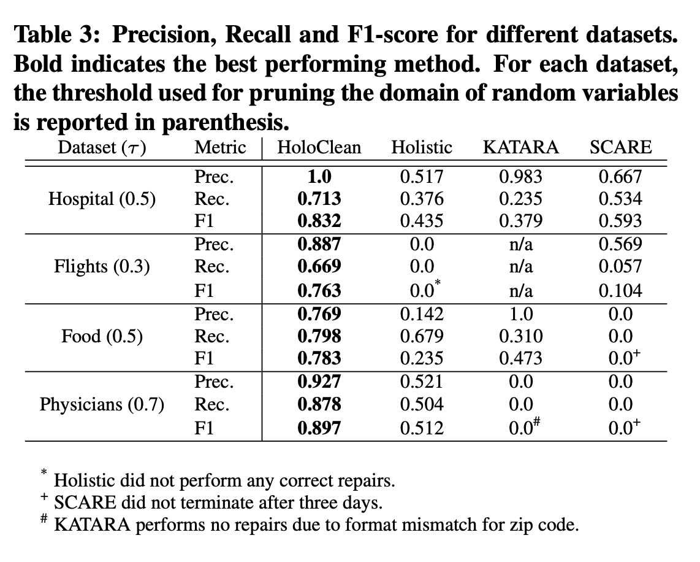

## AI论文解读 | HoloClean: Holistic Data Repairs with Probabilistic Inference
        
### 作者        
digoal        
        
### 日期        
2025-11-11        
        
### 标签        
PostgreSQL , PolarDB , DuckDB , AI , 论文解读        
        
----        
        
## 背景  
      
https://arxiv.org/pdf/1702.00820        
  
提示:          
```          
读懂《HoloClean: Holistic Data Repairs with Probabilistic Inference》这篇论文需要提前掌握哪些基础知识, 请使用中文通熟易懂的讲解这些基础知识, 可以引用论文中的图、表或使用Markdown支持的图形(text,mermaid等)增加解释性. 
  
使用中文通熟易懂的解读《HoloClean: Holistic Data Repairs with Probabilistic Inference》这篇论文, 其中的关键内容请着重讲解, 可以引用论文中的图、表或使用Markdown支持的图形(text,mermaid等)增加解释性. 
  
提取《HoloClean: Holistic Data Repairs with Probabilistic Inference》这篇论文中的重要术语, 使用中文对这些术语进行通熟易懂的讲解, 可以引用论文中的图、表或使用Markdown支持的图形(text,mermaid等)增加解释性. 
```     
  
## 1 前置知识 
  
你好！要透彻理解《HoloClean》这篇论文，你需要具备一些跨越“数据库”和“统计与机器学习”领域的基础知识。

这篇论文的核心思想是：**单独的数据修复“线索”都不完美，我们应该把所有线索（规则、外部知识、统计规律）融合到一个统一的概率模型中，让它们“投票”决定最可能的正确答案。** 

下面我将用通俗的语言，为你讲解理解这篇论文所需的4个核心基础知识。

### 1\. 基础知识一：数据清理 (Data Cleaning) 的目标与挑战

这是“为什么”需要 HoloClean 的背景知识。

  * **目标：** 我们的数据（比如数据库里的表）经常是“脏”的，充满了错误，如拼写错误、信息缺失、数据冲突等 。数据清理的目标就是自动地“检测”  和“修复”  这些错误。
  * **挑战：** 你怎么知道哪个值是“错”的，以及“正确”的值应该是什么？

论文的 **Figure 1** （见下图）完美地展示了这个问题。假设我们有(A)这张表，它里面就有好几个错误（用红色、黄色、蓝色高亮）。    

为了修复它，你手头有三种“线索”：

1.  **线索1：规则 (Integrity Constraints)**

      * 如图 (B) 所示，我们有一些规则，比如功能依赖 (FDs) 。例如 `c2: Zip -> City, State`  (意思是邮编决定了城市和州)。
      * **单独使用的问题：** 如图 (E) 所示，如果只按“少数服从多数”的规则修复，你可能会为了满足规则 `c2`，错误地把 `t1` 的邮编从 `60608` 改成 `60609`，这反而引入了新错误 。

2.  **线索2：外部知识 (External Data)**

      * 如图 (D) 所示，你有一份权威的“外部地址字典” 。
      * **单独使用的问题：** 如图 (F) 所示，它能帮你纠正邮编，但如果你的错误（比如 `t4` 的 `Johnnyo's` ）在字典里根本没提到，它就无能为力了 。

3.  **线索3：统计规律 (Quantitative Statistics)**

      * 通过分析数据 (A) 本身，你发现 `John Veliotis Sr.` 这个名字出现了很多次，而 `Johnnyo's` 只出现了一次。
      * **单独使用的问题：** 如图 (G) 所示，统计方法能帮你把 `Johnnyo's` 和 `Cicapo`  当作“异常值”纠正过来，但它没法修复 `t2` 和 `t3` 的邮编冲突 。

**你需要掌握的：** 理解“数据清理”就是修复脏数据，并且要认识到，依赖任何单一信号（规则、外部数据、统计）都可能失败 。HoloClean 的出发点就是要把所有这些信号统一起来 。

-----

### 2\. 基础知识二：数据库约束 (Database Constraints)

这是 HoloClean 使用的“规则”线索来源。你需要了解两种主要的约束：

  * **功能依赖 (Functional Dependencies, FDs):**

      * 这是数据库理论的基础。形式为 $A \rightarrow B$ ，意思是 "A 属性的值决定了 B 属性的值"。
      * **论文中的例子：** `Zip -> City, State` 。
      * **通俗理解：** 就像你的身份证号 $\rightarrow$ 你的姓名。如果数据库中出现两条记录，身份证号相同但姓名不同，那么至少有一条是错的。

  * **否认约束 (Denial Constraints, DCs):**

      * 这是 HoloClean 重点使用的约束 。FDs 是一种特殊的 DC。DC 是一种更通用的“规则”，它描述了“不应该”出现的数据组合。
      * **论文中的例子：** 论文中将 FD `Zip -> City, State` 转换为了两条 DC ：
        1.  `NOT(t1[Zip] = t2[Zip] AND t1[City] != t2[City])`
        2.  `NOT(t1[Zip] = t2[Zip] AND t1[State] != t2[State])`
      * **通俗理解：** 这条规则在“否认”一种情况。它说：“你（数据库）中不应该（NOT）同时存在两条记录，它们的Zip相同，但City却不同。” 。

**你需要掌握的：** 知道这些约束是用来定义“数据一致性”的规则。在 HoloClean 中，它们是判断数据是否出错的重要“线索”之一。

-----

### 3\. 基础知识三：概率图模型 (Probabilistic Graphical Models)

这是 HoloClean 的“核心引擎”，是它融合所有线索的数学工具。

  * **核心思想：** 当不同线索（规则、统计、外部数据）告诉你相互冲突的答案时，你该信谁？HoloClean 不会“非黑即白”地选择，而是为每个可能的修复选项计算一个“概率”。

  * **因子图 (Factor Graphs):** 论文明确提到 HoloClean 会编译生成一个概率图模型 ，并使用“因子图” (Factor Graph)  来表示。

      * **通俗理解：** 想象一个关系图。图中有两类节点：

        1.  **变量节点 (Variables)：** 代表你“不确定”的东西。比如 `t2.Zip` 单元格的真实值（是 60608 还是 60609？）。
        2.  **因子节点 (Factors)：** 代表你的“线索”或“证据”。每个因子连接一个或多个变量，并根据这些变量的取值给出一个“分数”（或称为权重），表示这个取值组合有多“好”（即多大概率是真的）。

      * **HoloClean 的做法：** 论文的 Figure 2  展示了这个流程。HoloClean 会把所有的线索都转换成“因子”：    

          * `Zip -> City` 规则是一个因子。
          * `t2.Zip` 在外部字典里匹配到 `60608` 是一个因子。
          * `t2.Zip` 的初始值是 `60609` 是一个因子（代表“尽量少修改”的原则）。

      * 你可以用下面的 (Mermaid) 流程图来想象这个模型：

        ```mermaid
        graph TD
            subgraph "HoloClean 的概率模型 (因子图)"
                direction LR
                V1(变量: t2.Zip)
                V2(变量: t2.City)
                
                F1(因子: 规则 Zip->City)
                F2(因子: 外部字典说 60608)
                F3(因子: 统计显示 60608 常见)
                F4(因子: 初始值是 60609)
                
                V1 -- "线索" --> F1
                V2 -- "线索" --> F1
                V1 -- "线索" --> F2
                V1 -- "线索" --> F3
                V1 -- "线索" --> F4
            end
        ```

  * **概率推断 (Probabilistic Inference):** 

      * **目标：** 有了这个布满“线索”的图，HoloClean 就要计算：在所有这些线索的“拉扯”下，`t2.Zip` 的值最终是 `60608` 的概率有多大？是 `60609` 的概率又有多大？
      * **论文中的例子：** 论文 **Figure 2** 的右下角  展示了推断结果：
          * `t2.Zip` 是 `60608` 的概率是 **0.84** 
          * `t2.Zip` 是 `60609` 的概率是 **0.16** 
      * HoloClean 会选择概率最高的 `60608` 作为最终修复结果。

**你需要掌握的：** 了解概率图模型（特别是因子图）是一种用图结构来表示变量间依赖关系和不确定性的数学框架。HoloClean 用它来“量化”和“融合”所有线索。

-----

### 4\. 基础知识四：统计学习 (Statistical Learning)

这是 HoloClean 的“调优”机制。

  * **核心问题：** 在上面的模型中，我们有很多因子（线索）。但**哪个线索更可信？**

      * 是“规则”更重要，还是“外部字典”更重要？
      * 如果我有好几个外部字典，哪个更权威？

  * **答案：** HoloClean 会自动“学习” (Learn) 这些权重！ 

  * **学习方法：**

    1.  **证据 (Evidence)：** HoloClean 会利用数据中那些“干净”的、我们确信是对的数据（比如没违反任何规则的数据）作为“训练样本” 。
    2.  **目标 (Learning)：** 它会调整每个因子（线索）的“权重”(weight) ，目标是让整个概率模型预测出的“训练样本”的概率尽可能高。
    3.  **通俗理解：** 就像调音。HoloClean 会在“干净数据”上反复试验，如果它发现“外部字典”这条线索总是能猜对答案，它就会给“外部字典”一个很高的权重（很强的发言权）。如果“统计规律”这条线索经常出错，它就给它一个低权重。

  * **推断算法 (Inference Algorithm)：**

      * 论文提到了 **Gibbs Sampling (吉布斯采样)** 。这是一种具体的“概率推断”算法，用于在复杂模型中高效地估算出（如上所述的）最终概率。你不必深入了解它的数学细节，只需知道它是一种用来求解概率模型的标准技术。

**你需要掌握的：** 知道 HoloClean 不是简单地把所有线索“平均”一下，而是通过“统计学习”来自动为每种线索（规则、字典、统计）分配一个“可信度权重”，从而实现更智能的融合。

### 总结

要读懂 HoloClean，你需要扮演两个角色：

1.  **数据库管理员：** 理解为什么数据会“脏”，以及什么是“规则”（如 FDs 和 DCs）。
2.  **数据科学家：** 理解如何用“概率”（概率图模型） 来处理“不确定性”，以及如何用“学习”（统计学习） 来自动平衡不同“证据”（线索）的权重。

HoloClean 的伟大之处在于它优雅地将这两个角色融合在了一个框架中。

-----

我为你总结了理解这篇论文所需的核心基础知识。你希望我进一步解释 HoloClean 框架的三个主要模块（错误检测、编译、修复）吗？（如 Figure 2 所示）    
  
## 2 解读论文 
  
这是一个非常棒的论文！《HoloClean》 是数据清理领域一篇里程碑式的工作。它解决了一个核心难题：**当你有多种“线索”来纠正一个错误，但这些线索又相互矛盾时，你该听谁的？**

HoloClean 的核心思想是 **“Holistic” (全盘的)**：它不依赖任何单一的“线索”，而是**将所有可用的信号（规则、外部数据、统计规律）统一到一个“概率推断”  的框架中**，让它们“集体投票”，找出最“可能”正确的修复方案。

下面，我将为你通俗易懂地解读这篇论文的关键内容。

-----

### 1\. 核心问题：为什么数据修复这么难？

想象一下，你拿到一张“脏”数据表（如下图 Figure 1(A)）。你一眼就看出了很多问题：    

  * `t2` 和 `t3` 的邮编 `60609` 与 `t1` 的 `60608` 冲突了。
  * `t4` 的 `DBAName` 叫 `Johnnyo's`，和其他的 `John Veliotis Sr` 不一样。
  * `t4` 的 `City` 是 `Cicapo`，明显是 `Chicago` 的拼写错误。

为了修复它，你手头有 **三种“线索”** ，但每种线索都有“盲点”：

#### 🔍 线索 1：内部规则 (Integrity Constraints)

  * **这是什么？** 比如数据库的功能依赖 (FD) `Zip -> City`（邮编决定城市）。
  * **修复尝试 (图 E)：** 系统为了满足 `Zip -> City`，可能会采用“少数服从多数”的原则，错误地把 `t1` 的 `60608` 改成 `60609` 。**这反而引入了新错误！**

#### 🔍 线索 2：外部数据 (External Data)

  * **这是什么？** 一份权威的外部“地址字典”（如图 D）。
  * **修复尝试 (图 F)：** 字典能帮你把 `60609` 纠正为 `60608`。但字典里没有 `t4` 的 `Johnnyo's` 的信息，**所以它对 `t4` 的错误无能为力** 。

#### 🔍 线索 3：统计规律 (Quantitative Statistics)

  * **这是什么？** 通过分析数据本身，发现 `John Veliotis Sr.` 出现了 3 次，而 `Johnnyo's` 只出现了 1 次。
  * **修复尝试 (图 G)：** 统计会把 `Johnnyo's` 和 `Cicapo` 当作“异常值”修复掉 。但它无法解决 `t2` 和 `t3` 的邮编冲突，因为 `60609` 出现了 2 次，也不算“异常” 。

**HoloClean 要解决的根本问题是**：
这三种线索**经常相互冲突** 。比如在 `t2` 的邮编上，规则和统计说 `60609` 对，外部字典说 `60608` 对。**你该信谁？**

-----

### 2\. HoloClean 的“全盘”解决方案

HoloClean 说： **“小孩子才做选择，我全都要！”**

它不“盲信”任何一个线索，而是把每个线索都当作一个“证据”，然后构建一个**概率模型**  来“权衡”所有证据，最终给出一个概率最高的答案。

我们可以用一个 **Mermaid 图** 来帮助理解它的工作流程（基于论文 Figure 2）：    



这个框架分三步走：

#### 第 1 步：错误检测 (Error Detection)

首先，HoloClean 会使用各种方法（如规则冲突、异常值检测）“标记”出所有“可能”有问题的单元格 。它会把剩下的数据当作“基本可信”的。

#### 第 2 步：编译 (Compilation) - 核心

这是 HoloClean 最“魔术”的一步。它会**自动生成一个概率程序** ，把所有不同类型的“线索”都翻译成统一的“投票规则”（在论文中称为“因子”，Factor）。

  * **线索 1 (规则)** -\> 变成一个“因子”：如果 `Zip` 相同但 `City` 不同，这个组合的“概率”就**很低** 。
  * **线索 2 (外部数据)** -\> 变成一个“因子”：如果某个值在“外部字典”里，它为“真”的“概率”就**很高** 。
  * **线索 3 (统计)** -\> 变成一个“因子”：如果某个值和同元组的其他值（如 'Chicago' 和 'IL'）经常“共现”，它为“真”的“概率”就**很高** 。
  * **额外线索 (最小修改)** -\> 变成一个“因子”：保持单元格的“初始值”不变，会获得一个“概率加成” 。

#### 第 3 步：修复 (Repair) - 运行和计票

编译完成后，HoloClean 开始“运行”这个概率程序：

1.  **统计学习：** HoloClean 会先在那些“基本可信”的数据上进行“学习” 。它会自动调整 **每条“线索”的“权重”** 。比如，如果它发现“外部字典”这条线索总是很准，它就会给这条线索一个很高的“权重”（发言权）。
2.  **概率推断：** 学习完成后，HoloClean 会对“可疑”单元格的每一个“候选修复值”（比如 `t2.Zip` 的候选值是 `60608` 和 `60609`）进行计算。它会综合所有“带权重”的线索进行“投票”，最后得出一个**概率分布** 。

**最终输出 (如 Figure 2 右下角所示)** ：
HoloClean 不会只给你一个“答案”，它会告诉你每个答案的“置信度”：

  * `t2.Zip` 是 `60608` 的概率为 **0.84** (84%) 
  * `t2.Zip` 是 `60609` 的概率为 **0.16** (16%) 

HoloClean 会选择概率最高的 `60608` 作为最终修复结果。

-----

### 3\. 关键技术：如何让“全盘”变得“可能”？

这个“全盘”的概率模型听起来很美好，但有一个致命问题：**它太慢了！**

想象一下，你要处理一个有“百万级元组” (millions of tuples)  的数据库。

1.  **组合爆炸**：一个单元格可能有 1000 个候选值，一条记录有 10 个单元格，组合起来就是天文数字 。
2.  **规则爆炸**：检查规则（如 `Zip -> City`）需要比较“每条记录”和“其他所有记录” ，这是 $O(N^2)$ 的复杂度，对于百万级数据是不可接受的。

HoloClean 提出了一系列**核心优化**  来解决这些“技术挑战”：

#### 优化 1：候选域剪枝 (Pruning the Domain) 

  * **问题：** 候选修复值太多。
  * **HoloClean 怎么做 (Algorithm 2)：** 它不考虑所有可能的值。它只考虑那些“有意义”的候选值。一个聪明的策略是：**只考虑那些“在数据中与其他属性共同出现过”的值** 。    
  * **例子：** 修复 `Cicapo` 时，只考虑那些与 `IL` 和 `60608` 一起出现过的 `City` 值，比如 `Chicago`。 

#### 优化 2：元组分区 (Tuple Partitioning) 

  * **问题：** $O(N^2)$ 的规则比较太慢。
  * **HoloClean 怎么做 (Algorithm 3)：** 它发现，你不需要比较“所有”元组对。你只需要比较那些“已经产生冲突”或“可能产生冲突”的小团体 。它会预先找到这些“冲突小团体”（连通分量），然后只在这些小团体内部进行规则检查。    

#### 优化 3：约束松弛 (Relaxing Constraints) 

  * **问题：** “硬约束”（必须 100% 满足的规则）会使概率模型的计算（推断）变得极其困难和缓慢 (NP-hard) 。
  * **HoloClean 怎么做：** 它将“硬约束”松弛为“软约束”（或者叫“特征”）。
  * **例子：**
      * **硬约束（慢）：** "Zip 必须决定 City！"
      * **软约束（快）：** "如果 Zip 相同但 City 不同，我就给这个组合一个‘差评’（负权重）" 。
  * 这种松弛使得所有变量（单元格）变得“近似独立”，极大加快了推断速度（从指数时间降到多项式时间）。

-----

### 4\. 实验结果：HoloClean 真的更好吗？

论文的实验（**Table 3**） 令人信服。它对比了当时最先进的、但只依赖“单一线索”的系统：    

  * **Holistic [12]:** 只用“规则”的系统 (对应 Figure 1(E))。    
  * **KATARA [13]:** 只用“外部数据”的系统 (对应 Figure 1(F))。
  * **SCARE [39]:** 只用“统计”的系统 (对应 Figure 1(G))。

**结果显示 (Table 3)：**   

  * 在所有数据集上，HoloClean 在 F1-score（综合了准确率和召回率的指标）上均**大幅胜出** 。
  * HoloClean 的平均 F1-score 提升了 **2 倍** 以上 。
  * 例如，在 Food 数据集上，HoloClean 的 F1 达到了 0.783，而其他方法最高只有 0.473（KATARA）。

这强力地证明了：**HoloClean 的“全盘”统一方法，确实比任何单一的方法都更准确、更鲁棒。**

### 总结

HoloClean 是一个**集大成**的数据修复框架。它最大的贡献是提供了一个**可扩展的、统一的概率框架**，将所有类型的数据清理信号（规则、外部知识、统计）融合在一起。它用“带权重的概率投票”取代了“非黑即白的规则判断”，从而能够智能地解决线索冲突，找到最可靠的数据修复方案。
  
## 3 术语 
  
好的，我从《HoloClean》这篇论文中为你提取了 12 个关键术语，并用通俗易懂的中文进行讲解。

-----

### 一、 核心概念：HoloClean 的哲学

这组术语解释了 HoloClean 的核心思想和目标。

#### 1\. HoloClean (HoloClean 系统)

  * **出处：** 
  * **通俗讲解：** 这是论文提出的数据修复框架的名称。“Holo”取自“Holistic”（整体的），“Clean”代表“清理”。它的核心目标是提供一个**全盘的、统一的**数据修复方案 。

#### 2\. Holistic Data Repairs (整体数据修复)

  * **出处：** 

  * **通俗讲解：** 这是 HoloClean 最核心的理念。传统的数据修复方法往往只依赖**单一**的“线索”，比如：

      * 方法A：只看“内部规则”（如邮编必须唯一）。
      * 方法B：只看“外部字典”。
      * 方法C：只看“统计规律”（如哪个值出现次数最多）。

  * 论文的 **Figure 1**  清楚地展示了这些“单一”方法的局限性。    

  * “Holistic”（整体）的意思是，HoloClean **将所有这些线索（内部规则、外部数据、统计规律）全部融合到一个统一的框架中** ，让它们“集体投票”，而不是“各自为政”。

    ```mermaid
    graph TD
        A["脏数据 (Figure 1A)"] --> B(HoloClean 修复)
        
        subgraph "所有线索 (Holistic)"
            C["1\. 完整性约束 (Figure 1B)"]
            D["2\. 外部数据 (Figure 1D)"]
            E["3\. 定量统计 (Figure 1G)"]
        end

        C --> B
        D --> B
        E --> B
        B --> F[修复后的干净数据]
    ```

#### 3\. Probabilistic Inference (概率推断)

  * **出处：** 
  * **通俗讲解：** 这是 HoloClean 用来“融合”所有线索的**数学工具**。
  * 当不同的线索相互矛盾时（比如，规则说A是对的，字典说B是对的），HoloClean 不会“武断”地选择。相反，它会为**每一个可能的修复选项计算一个“概率”** 。它会把所有线索都当作“证据”，然后推断出“在所有证据下，这个修复方案是正确的概率有多大？”。

-----

### 二、 修复“线索”：HoloClean 的三大输入

这组术语代表 HoloClean 用来修复数据的“证据”来源。

#### 4\. Integrity Constraints (ICs) (完整性约束)

  * **出处：** 
  * **通俗讲解：** 这是数据本身应该遵守的“规则”或“逻辑”。
  * **例子：** “一个人的身份证号必须是唯一的”、“`Zip`（邮编）决定了 `City`（城市）”、“订单日期不能晚于发货日期”。
  * HoloClean 使用这些约束来**检测**数据中不“合规”的地方。

#### 5\. Denial Constraints (DCs) (否认约束)

  * **出处：** 
  * **通俗讲解：** 这是 ICs 的一种非常强大且通用的表达方式。它描述了数据中 **“不应该”** 出现的情况（它“否认”了某种组合）。
  * **例子：** 论文中 ，`Zip -> City` 这个规则被转换成了一条否认约束，意思是：“我们**否认**（不允许）数据库中同时存在两条记录，它们的 `Zip` 相同，但 `City` 却不同”。

#### 6\. External Data (外部数据)

  * **出处：** 
  * **通俗讲解：** 指来自外部的、可信的“参考答案”或“字典” 。
  * **例子：** 如 **Figure 1(D)** 所示 ，HoloClean 可以导入一个权威的“芝加哥地址-邮编”列表，用它来纠正脏数据表中的邮编错误。HoloClean 通过**匹配依赖 (Matching Dependencies)**  将脏数据与这些外部数据关联起来。

#### 7\. Quantitative Statistics (定量统计)

  * **出处：** 
  * **通俗讲解：** 指从数据自身挖掘出的“统计规律”，不依赖任何外部知识 。
  * **例子：** 在 **Figure 1(A)** 中，`City` 列的 `Cicapo` 是个拼写错误。HoloClean 通过统计发现，`Cicapo` 这个值很少见，而且它总是和 `IL`、`60608` 等值一起出现，而 `Chicago` 也和这些值一起出现，并且 `Chicago` 出现的频率高得多。因此，统计规律“投票”认为 `Cicapo` 应该是 `Chicago` 。

-----

### 三、 核心引擎：HoloClean 的工作原理

这组术语解释了 HoloClean 内部是如何“计算”的。

#### 8\. Factor Graph (因子图)

  * **出处：** 

  * **通俗讲解：** 这是 HoloClean 用来表示“概率模型”的数据结构。你可以把它想象成一个“投票网络”。

  * 这个网络中有两类节点：

    1.  **变量节点：** 代表“不确定”的单元格（比如 `t2.Zip` 到底应该是 `60608` 还是 `60609`？）。
    2.  **因子节点：** 代表一个“线索”或“证据”（比如“`Zip->City` 规则”、“外部字典”、“统计规律”）。

  * 一个因子会连接到它所影响的变量上，为不同的取值“打分”。

    ```mermaid
    graph TD
        subgraph "因子图 (Factor Graph) 示意"
            direction LR
            V1(变量: t2.Zip)
            V2(变量: t2.City)
            
            F1(因子: 规则 Zip->City)
            F2(因子: 外部字典)
            F3(因子: 统计规律)
            
            V1 -- "线索" --> F1
            V2 -- "线索" --> F1
            V1 -- "线索" --> F2
            V1 -- "线索" --> F3
        end
    ```

#### 9\. Grounding (实例化)

  * **出处：** 
  * **通俗讲解：** 指的是“构建”因子图的实际过程。
  * **例子：** 你的“规则”（因子）是 `Zip -> City`。**Grounding** 的过程就是去遍历数据库中**所有**的元组对，找出那些 `Zip` 相同但 `City` 不同的具体实例（比如 `t1` 和 `t2`），然后在因子图中为它们建立连接。
  * 这是一个非常耗时的步骤，论文称其可能导致“组合爆炸” (combinatorial explosion) 。

#### 10\. Marginal Distribution (边缘分布)

  * **出处：** 
  * **通俗讲解：** 这就是 HoloClean 的**最终计算结果**。
  * 在“概率推断”完成后，HoloClean 会为每个“脏”单元格的每个“候选值”给出一个概率。这个概率列表就是“边缘分布”。
  * **例子：** 如 **Figure 2** 的“Output”部分所示 ，对于单元格 `t2.Zip`，HoloClean 计算出的边缘分布是：    
      * `60608` 的概率是 **0.84**
      * `60609` 的概率是 **0.16**
  * HoloClean 会选择概率最高的那个值（0.84 对应的 `60608`）作为最终的修复结果 。

-----

### 四、 性能优化：HoloClean 如何扩展？

这组术语解释了 HoloClean 如何解决“组合爆炸”和“Grounding”缓慢的问题，使其能处理百万级元组 。

#### 11\. Domain Pruning (域剪枝)

  * **出处：** 
  * **通俗讲解：** 这是 **Algorithm 2**  的核心。为了修复一个单元格（比如 `t4.City` 的 `Cicapo`），HoloClean 不会傻傻地尝试数据库里出现过的“所有”城市名。    
  * “剪枝”的意思是：它只考虑那些“靠谱”的候选值。**它只选择那些与该元组中其他“可信”值（如 `IL`、`6H`）共同出现概率高（ 超过阈值 $\tau$ ）的值** 。这就大大减少了计算量。

#### 12\. Tuple Partitioning (元组分区)

  * **出处：** 
  * **通俗讲解：** 这是 **Algorithm 3**  的核心。为了解决 Grounding 太慢的问题（比如检查 $N \times N$ 对元组），HoloClean 采用了“分区”策略。    
  * 它不会比较所有元组对，而是 **预先通过冲突检测，将数据分成若干个“冲突小团体”** （即图的连通分量）。
  * **例子：** 比如有 100 万条记录，只有 50 条记录的 `Zip` 存在冲突。HoloClean 会把这 50 条记录分到一个“区”，然后只在这个区内进行详细的 $50 \times 50$ 比较，而不是进行 $100 \text{万} \times 100 \text{万}$ 的比较，从而极大提升了效率 。
  
## 参考        
         
https://arxiv.org/pdf/1702.00820    
        
<b> 以上内容基于DeepSeek、Qwen、Gemini及诸多AI生成, 轻微人工调整, 感谢杭州深度求索人工智能、阿里云、Google等公司. </b>        
        
<b> AI 生成的内容请自行辨别正确性, 当然也多了些许踩坑的乐趣, 毕竟冒险是每个男人的天性.  </b>        
    
#### [PolarDB 学习图谱](https://www.aliyun.com/database/openpolardb/activity "8642f60e04ed0c814bf9cb9677976bd4")
  
  
#### [PostgreSQL 解决方案集合](../201706/20170601_02.md "40cff096e9ed7122c512b35d8561d9c8")
  
  
#### [德哥 / digoal's Github - 公益是一辈子的事.](https://github.com/digoal/blog/blob/master/README.md "22709685feb7cab07d30f30387f0a9ae")
  
  
#### [About 德哥](https://github.com/digoal/blog/blob/master/me/readme.md "a37735981e7704886ffd590565582dd0")
  
  

  
