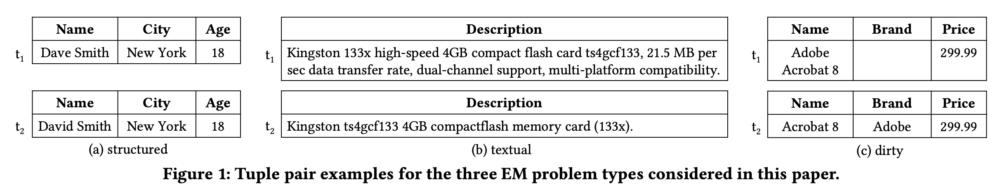
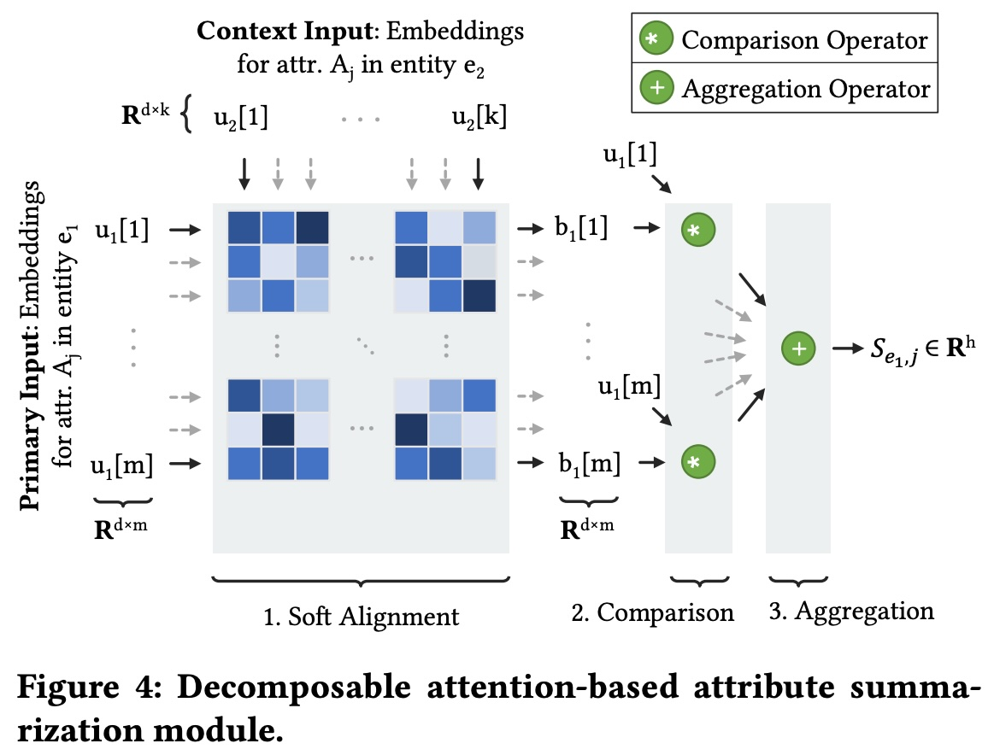
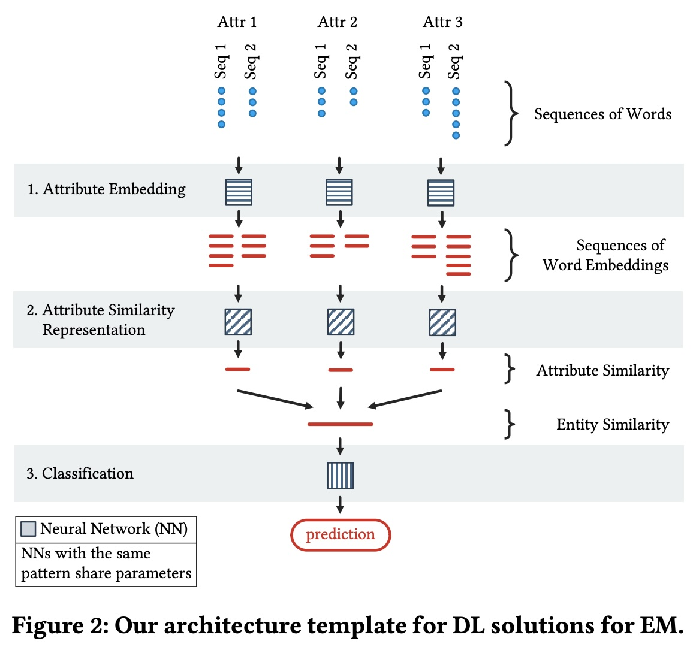
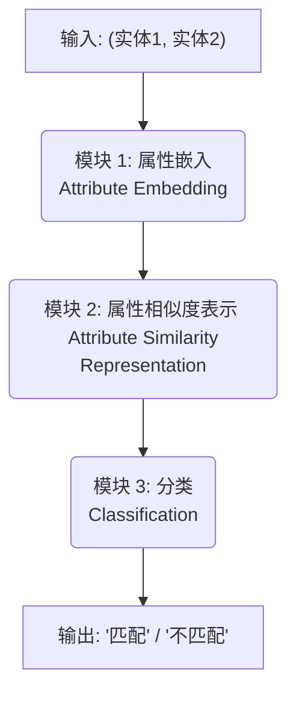
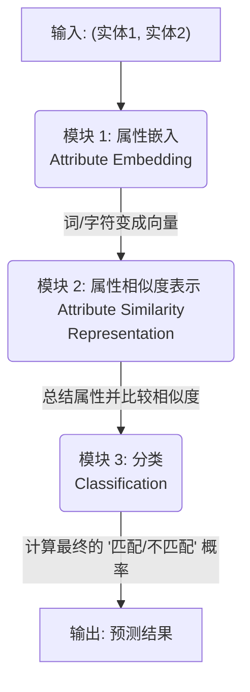
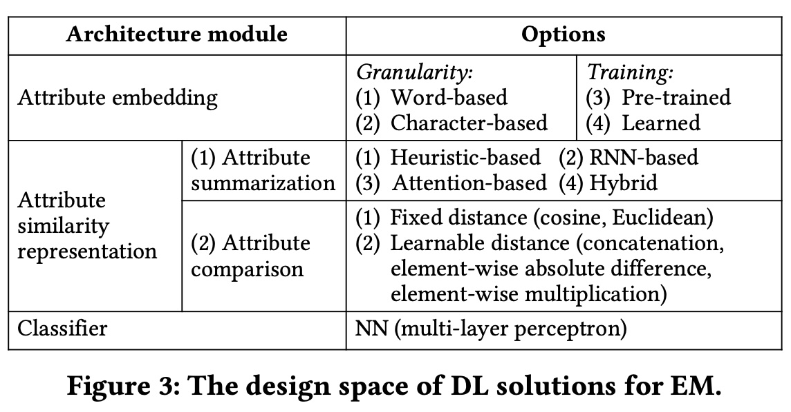
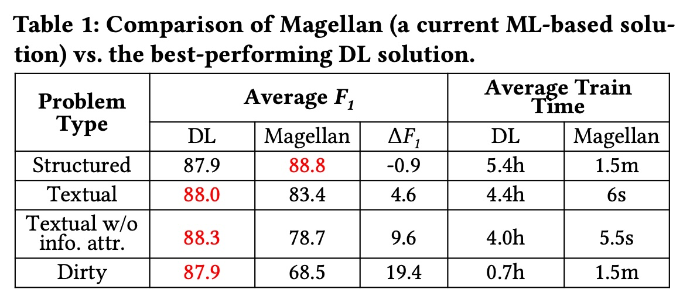
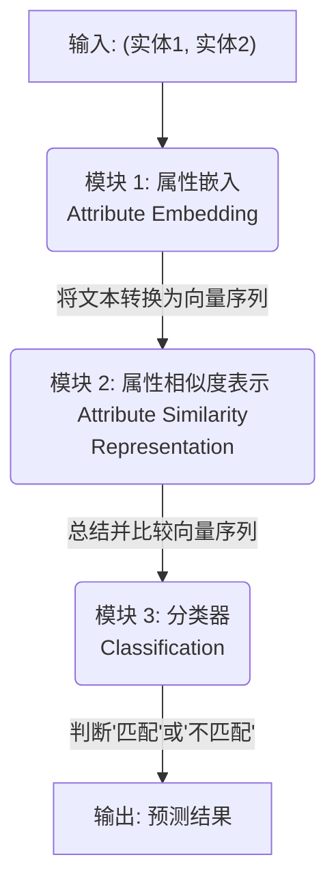
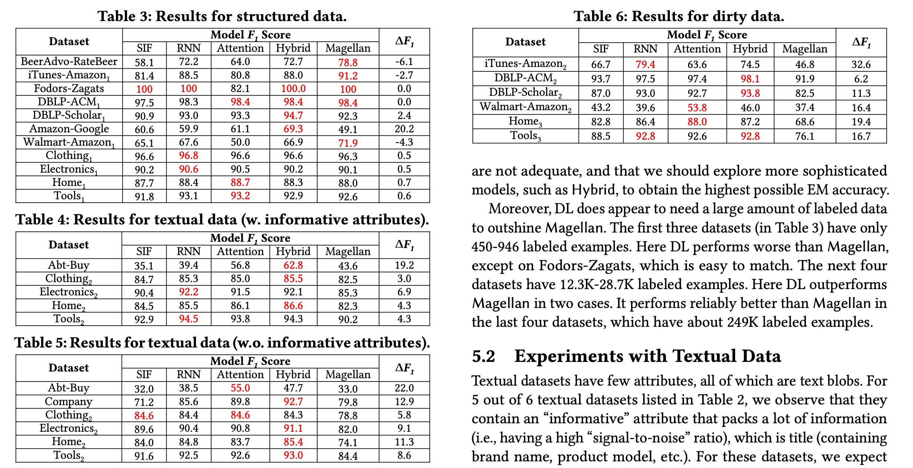

## AI论文解读 | Deep Learning for Entity Matching: A Design Space Exploration
        
### 作者        
digoal        
        
### 日期        
2025-11-11        
        
### 标签        
PostgreSQL , PolarDB , DuckDB , AI , 论文解读        
        
----        
        
## 背景  
      
https://pages.cs.wisc.edu/~anhai/papers1/deepmatcher-tr.pdf        
  
提示:          
```          
读懂《Deep Learning for Entity Matching: A Design Space Exploration》这篇论文需要提前掌握哪些基础知识, 请使用中文通熟易懂的讲解这些基础知识, 可以引用论文中的图、表或使用Markdown支持的图形(text,mermaid等)增加解释性. 
  
使用中文通熟易懂的解读《Deep Learning for Entity Matching: A Design Space Exploration》这篇论文, 其中的关键内容请着重讲解, 可以引用论文中的图、表或使用Markdown支持的图形(text,mermaid等)增加解释性. 
  
提取《Deep Learning for Entity Matching: A Design Space Exploration》这篇论文中的重要术语, 使用中文对这些术语进行通熟易懂的讲解, 可以引用论文中的图、表或使用Markdown支持的图形(text,mermaid等)增加解释性. 
```     
  
## 1 前置知识 
  
要完全读懂这篇《Deep Learning for Entity Matching: A Design Space Exploration》（《深度学习用于实体匹配：一个设计空间探索》），你需要提前掌握以下几个方面的基础知识。

这篇论文的核心是探讨如何将深度学习 (DL)  应用于实体匹配 (EM) ，并系统地分析了哪些DL模型适用于哪种EM问题 。

以下是你需要掌握的基础知识点，我会尽量用通俗的语言并结合论文中的图表来解释：

### 1\. 什么是实体匹配 (Entity Matching, EM)？

这是最核心的背景知识。

  * **概念：** 实体匹配 (EM) 指的是找出那些指向同一个现实世界“实体”的数据实例 。
  * **通俗解释：** 就像你要找出两份花名册里的同一个人。
  * **论文中的例子：** (Eric Smith, Johns Hopkins) 和 (E. Smith, JHU) 这两条记录，虽然长得不一样，但很可能指的是同一个人 。
  * **你需要理解的论文概念：** 论文将EM问题分成了三类 (参见论文图1) ：    
      * **(a) 结构化 (Structured) EM：** 数据非常规整，字段（如“姓名”、“城市”）都对齐得很好 。
      * **(b) 文本化 (Textual) EM：** 数据主要是大段的描述性文字，比如产品描述 。
      * **(c) 脏数据 (Dirty) EM：** 数据是结构化的，但信息“串行”了，比如“品牌”信息跑到了“名称”字段里 。

理解这三种分类至关重要，因为论文的**核心结论**是：DL在**文本化 (Textual)和脏数据 (Dirty) EM**上表现优异，但在**结构化 (Structured) EM**上并不总是比传统方法好 。

### 2\. 经典的机器学习 (ML) 基础

你需要知道在深度学习出现之前，大家是怎么做实体匹配的。

  * **概念：** 传统的EM解决方案（如论文中作为“SOTA”对比的 **Magellan** ）通常依赖“特征工程 (Feature Engineering)”。
  * **通俗解释：** 你需要手动告诉机器要比较什么。比如，你想比较两个产品名称，你可能会计算它们的：
      * **Jaccard 相似度**（看它们共同的词有多少）。
      * **TF-IDF 分数** 。
      * **编辑距离**（改动几个字母能让它们一样）。
  * **为什么重要：** 论文提到，DL的一大优势是 **“自动构建重要特征”** ，而不需要像Magellan那样进行“手动特征工程” 。你需要理解这两种范式的区别。

### 3\. 深度学习 (DL) 与 NLP 核心概念

这是本文的技术核心，论文的第2.2节  和第2.3节  专门回顾了这些知识。

#### a. 词嵌入 (Word Embeddings)

  * **概念：** 这是DL处理文本的基础。它把单词从文本转换成计算机能理解的**向量**（一串数字）。
  * **通俗解释：** 就像给每个词一个“坐标”。意思相近的词（比如“国王”和“女王”）在空间中的“坐标”也相近。
  * **你需要理解的论文概念：**
      * **词级别 (Word-based) vs. 字符级别 (Character-based)：** 论文对比了这两种嵌入方式 。字符级别（如 fastText ）的优势在于能处理拼写错误和“未登录词”(OOV) 。
      * **预训练 (Pre-trained) vs. 现学 (Learned)：** 是用在大规模语料（如维基百科）上已经训练好的嵌入 ，还是在自己的数据上从头开始学 。

#### b. 神经网络 (Neural Networks, NNs)

  * **概念：** 深度学习的基础模型，由很多“层”构成，通过非线性激活函数来拟合复杂的数据关系 。
  * **在文中的应用：** 论文架构中的最后一步“分类器模块” ，就是一个NN（多层感知机）。

#### c. 循环神经网络 (Recurrent Neural Networks, RNNs)

  * **概念：** 一种专门为**序列数据**（如文本 ）设计的神经网络。
  * **通俗解释：** 它有“记忆”。在读一个句子时，它会记住前面读过的词，并结合“记忆”来理解当前的词 。
  * **在文中的应用：** 论文提出的四个代表性模型之一就叫 **RNN** 。它被用作“序列感知”的 **属性总结 (Attribute Summarization)** 方法 。

#### d. 注意力机制 (Attention)

  * **概念：** 允许模型在处理一个长序列时，动态地“关注”输入中最重要的部分 。
  * **通俗解释：** 就像你做阅读理解时，会把注意力集中在问题的“关键词”上，而不是平均阅读每个词。
  * **在文中的应用：** 论文的四个模型之一叫 **Attention** 。它被用于“序列对齐 (Sequence Alignment)” ，即在比较两个序列时，找出它们之间哪些词是相互对应的（参见论文图4的“Soft Alignment” ）。    

### 4\. 论文的“设计空间”框架

最后，你需要理解论文的组织思路。论文的核心贡献是提出了一个“设计空间” ，即一个“组装”DL模型的框架。

如论文中的**图2 (Figure 2)**  所示，他们把EM的DL解决方案分成了三个标准模块：    



  * **模块1：属性嵌入** ：就是把词变成向量（用词嵌入技术）。
  * **模块2：属性相似度表示** ： **这是最关键的模块** , 它又分为两步：
    1.  **属性总结 (Summarization)** ：如何把一个属性（比如一长串产品描述）的词嵌入序列“总结”成一个单一的向量。
    2.  **属性比较 (Comparison)** ：如何比较两个“总结”后的向量。
  * **模块3：分类** ：用一个NN来决定最终是否匹配。

论文提出的四个模型 (SIF, RNN, Attention, Hybrid)  只是在**模块2的“总结” (Summarization)** 步骤中  采用了不同的策略（比如SIF用简单的加权平均 ，RNN用RNN网络 ）。

-----

### 总结

你需要的基础知识“全家桶”：

1.  **问题背景 (EM)：** 知道什么是实体匹配，以及为什么“脏数据”和“文本数据”的匹配很难。
2.  **经典方案 (ML)：** 了解基于“特征工程”的传统机器学习（如Magellan）是如何工作的。
3.  **核心技术 (DL & NLP)：** 必须扎实理解 **词嵌入**、**RNN** 和 **Attention** 这三大NLP领域的DL技术。

如果你掌握了这些，你就能轻松理解为什么论文的作者要构建这个“设计空间”，以及为什么他们会得出“DL在文本和脏数据EM上更优”的结论。

希望这个解释对你有帮助！你是否想让我详细解释一下论文中提到的四种DL模型（SIF, RNN, Attention, Hybrid）之间的具体区别？
  
## 2 解读论文 
  
这是一篇非常重要且高引用的论文，它系统地研究了“深度学习（DL）究竟在多大程度上、以及在哪些情况下，能帮助我们解决实体匹配（EM）问题” 。

这篇论文的核心贡献**不是**提出一个全新的、打败一切的DL模型，而是提供了一个“**设计空间**”（Design Space）和一份“**选型指南**”。它告诉我们：

1.  **EM问题可以分为哪几类？** 
2.  **DL模型可以拆解成哪些“积木”？** 
3.  **哪种“积木”组合（DL模型）在哪种EM问题上表现最好？** 

下面，我将为你通俗易懂地解读这篇论文的关键内容。

### 1\. 核心问题：实体匹配 (EM) 是什么？

实体匹配（EM）就是找出那些指向**同一个现实世界实体**的数据记录 。

  * **通俗例子：** 论文中提到，`(Eric Smith, Johns Hopkins)` 和 `(E. Smith, JHU)` 这两条记录，虽然写法不同，但很可能指的是同一个人 。EM的目标就是自动发现这种“匹配”。

### 2\. 关键洞察：并非所有EM问题都一样

论文的第一个关键贡献是**将EM问题分为三类** ，这一定义直接影响了最终的结论。这三类问题可以参考论文的 **图1 (Figure 1)** ：    

  * **(a) 结构化 (Structured) EM：**

      * **特点：** 数据非常规整，字段（如“姓名”、“城市”、“年龄”）都严格对齐，值也比较“干净”（如 "Dave Smith", "New York", 18） 。
      * **例子：** 两个客户数据库的记录匹配。

  * **(b) 文本化 (Textual) EM：**

      * **特点：** 数据主要是大段的描述性文本，几乎没有规整的字段 。
      * **例子：** 匹配两条产品描述（如 "Kingston 4GB high-speed card..." 和 "Kingston 4GB compactflash memory..."） 。

  * **(c) 脏数据 (Dirty) EM：**

      * **特点：** 表面看是结构化的（有 "Name", "Brand" 等字段），但数据是“脏”的，信息“串行”了 。
      * **例子：** "Brand" (品牌) 字段是空的，但品牌名（如 "Adobe"）却跑到了 "Name" (名称) 字段里（如 "Adobe Acrobat 8"） 。

### 3\. 关键框架：DL模型的“设计空间”（一个“Lego”积木盒）

论文的第二个关键贡献是提出了一个DL模型的“**架构模板**”（Architecture Template），如 **图2 (Figure 2)** 所示 。这个模板就像一个Lego积木盒，把DL模型分成了三个标准模块：    



  * **模块1：属性嵌入 (Attribute Embedding)**

      * **作用：** 把文本（单词或字符）转换成计算机能理解的向量（数字） 。
      * **选项 (图3)：** 可以用词级别 (Word-based) 或 字符级别 (Character-based)；可以用预训练 (Pre-trained) 或 现学 (Learned) 。    

  * **模块2：属性相似度表示 (Attribute Similarity Representation)**

      * **作用：** 这是**最核心**的模块。它负责“总结”每个属性的向量序列，并“比较”两个实体间的属性相似度 。
      * **选项 (图3)：** 论文在这里定义了不同的复杂度，包括：
        1.  **启发式 (Heuristic-based)：** 比如简单的加权平均（论文中的 **SIF** 模型） 。
        2.  **RNN-based：** 用RNN来理解序列顺序（论文中的 **RNN** 模型） 。
        3.  **Attention-based：** 用注意力机制来做“软对齐”，看两个序列中哪些词是相互对应的（论文中的 **Attention** 模型） 。
        4.  **Hybrid：** 混合RNN和Attention（论文中的 **Hybrid** 模型） 。

  * **模块3：分类 (Classification)**

      * **作用：** 把前面模块生成的“相似度向量”作为特征，输入一个神经网络（如多层感知机），最终输出一个“匹配”或“不匹配”的概率 。

### 4\. 关键实验：四种DL模型 vs 传统SOTA (Magellan)

论文从上述“Lego积木盒”中挑选了四种代表性模型（SIF, RNN, Attention, Hybrid），并将它们与一个**非DL**的、当时最先进（SOTA）的EM解决方案——**Magellan**——进行对比 。

Magellan代表的是传统的、基于“**特征工程**”的方法。你需要手动设计很多特征（比如Jaccard相似度、编辑距离等），然后喂给一个传统分类器（如随机森林）。

### 5\. 核心结论：DL虽好，但非“银弹”

实验结果（**见论文核心总结表 Table 1**）非常清晰，这也是这篇论文被广泛引用的原因：    

| 问题类型 (Problem Type) | DL (最佳F1) | Magellan (F1) | $\Delta F$ (DL-Magellan) | 平均训练时间 (DL) | 平均训练时间 (Magellan) |
| :--- | :---: | :---: | :---: | :---: | :---: |
| **结构化 (Structured)** | 87.9% | **88.8%** | -0.9% | 5.4 小时 | **1.5 分钟** |
| **文本化 (Textual)** | **88.0%** | 83.4% | +4.6% | 4.4 小时 | 6 秒 |
| **脏数据 (Dirty)** | **87.9%** | 68.5% | **+19.4%** | 0.7 小时 | 1.5 分钟 |

*（数据引用自论文 Table 1 ）*

#### 结论解读：

1.  **在“结构化”数据上，DL完败！**

      * 在干净、规整的数据上，DL模型的效果**还不如**Magellan 。
      * 更糟糕的是，DL的训练时间**长达5.4小时**，而Magellan**仅需1.5分钟** 。
      * **原因：** 传统方法的手动特征（如算字符串相似度）在这种简单场景下已经足够好，DL的复杂性反而可能导致过拟合，且成本极高 。

2.  **在“文本化”数据上，DL显著胜出！**

      * 当数据是大段文本时，DL的F1值比Magellan高了**4.6%** 。
      * **原因：** 传统特征（如Jaccard）很难捕捉长文本的“语义”。而DL（特别是Attention和Hybrid）能理解词序和语义，能识别出 "samsung 52' tv" 和 "52 inch television samsung" 是一个东西 。

3.  **在“脏数据”上，DL呈“碾压”态势！**

      * 当数据“串行”时，DL的效果比Magellan高出了**19.4%** 之多 。
      * **原因：** Magellan依赖“字段对齐”，当“品牌”跑到了“名称”字段，Magellan就“傻了”。而DL模型可以被训练成 **忽略“属性边界”** ，把整条记录当做一个长文本来处理，从而正确匹配 。

### 总结：给实践者的核心启示

这篇论文给所有数据工作者的启示是 ：

  * **不要迷信DL！** 如果你的数据是**干净、规整的结构化数据**，使用传统的EM方法（如Magellan）会更快、更准 。
  * **拥抱DL！** 如果你的数据是**大段的文本描述**，或者**字段混乱的脏数据**，那么深度学习（特别是Hybrid或Attention模型）将是你的首选，它能带来巨大的准确率提升 。
  
## 3 术语 
  
好的，我为你提取了这篇论文中的核心术语，并用通俗易懂的中文进行了解读。

### 1\. 核心问题与背景

#### Entity Matching (EM) / 实体匹配

  * **通俗讲解：** 这是整个论文要解决的核心问题。实体匹配（EM）就是找出那些指向同一个现实世界“实体”的数据实例 。
  * **论文中的例子：** 两条记录 `(Eric Smith, Johns Hopkins)` 和 `(E. Smith, JHU)`，虽然长得不一样，但很可能指的是同一个人 。EM的目标就是自动发现它们是“匹配”的。

#### Magellan / "麦哲伦"系统

  * **通俗讲解：** 这是论文中用来和深度学习（DL）模型进行对比的“标杆”或“基准” 。
  * **技术特点：** Magellan 是一个基于**传统机器学习**的SOTA（当时最先进）的EM解决方案 。它不依赖深度学习，而是严重依赖“特征工程” 。

#### Feature Engineering / 特征工程

  * **通俗讲解：** 这是传统机器学习（如Magellan）的必备步骤，也是深度学习（DL）试图自动化的步骤 。
  * **具体含义：** 指的是需要专家**手动**为机器设计“特征”（即判断依据）。例如，为了比较两个字符串，你可能需要手动告诉机器去计算它们的“Jaccard相似度”或“编辑距离”。DL的优势在于它能“自动构建重要特征”，而不需要人工干预 。

### 2\. EM问题的三种类型

论文的一个关键贡献是明确了EM问题有三种不同类型，DL在不同类型上的表现差异巨大 。

#### Structured EM / 结构化EM

  * **通俗讲解：** 指的是数据非常“干净”、规整的匹配任务 。
  * **特点：** 属性（字段）都严格对齐，比如“姓名”对“姓名”，“城市”对“城市”，且字段内的值是原子的、简短的 。
  * **结论：** 在这种任务上，DL**并不比**传统方法（Magellan）好，而且训练时间要长得多 。

#### Textual EM / 文本化EM

  * **通俗讲解：** 指的是匹配大段的、非结构化的文本 。
  * **特点：** 属性值是长篇的描述性文字，比如两条产品描述 。
  * **结论：** 在这种任务上，DL**显著优于**传统方法 。

#### Dirty EM / 脏数据EM

  * **通俗讲解：** 指的是那些本应是结构化，但数据“串行”或“错位”的匹配任务 。
  * **特点：** 字段边界模糊不清。比如“品牌”信息（如"Adobe"）没有在“品牌”字段里，而是跑到了“名称”字段里（如"Adobe Acrobat 8"） 。
  * **结论：** 在这种任务上，DL**碾压**传统方法，优势最明显 。

### 3\. DL设计的核心框架（“设计空间”）

论文的核心贡献是提出了一个DL解决方案的“架构模板”（Architecture Template），如下图（源自论文图2）所示，它定义了DL模型的“设计空间” 。    



#### Attribute Embedding / 属性嵌入

  * **通俗讲解：** 这是DL模板的第一步，负责把原始的文本数据“翻译”成机器能懂的数学语言——向量 。
  * **关键选项（见图3）：**    
      * **Word-based (词级别) vs. Character-based (字符级别):**  是把“单词”看作一个整体，还是深入到“字符”级别来理解词义？（字符级别对拼写错误更鲁棒 ）。
      * **Pre-trained (预训练) vs. Learned (现学):**  是使用别人在超大语料（如维基百科）上已经训练好的通用“词典”（如Word2Vec, fastText） ，还是在自己的数据集上从头学一个“专业词典”？

#### Attribute Similarity Representation / 属性相似度表示

  * **通俗讲解：** 这是模板的**核心** 。它负责“阅读”两个属性的向量序列，并给出一个关于它们有多相似的“表示”。
  * **它包含两个子步骤：**
    1.  **Attribute Summarization (属性总结):**  如何把一个长短不一的词向量序列（比如一个产品描述）“总结”或“浓缩”成一个固定长度的向量 。
    2.  **Attribute Comparison (属性比较):**  如何比较这两个“总结”后的向量。

### 4\. 四种代表性的DL模型

论文从“设计空间”中挑选了四种具有代表性的DL解决方案，它们的**主要区别在于“属性总结”这一步** 。

#### SIF

  * **通俗讲解：** 最简单的DL模型，它使用一种“聚合函数”（加权平均）来进行属性总结 。
  * **特点：** 它不考虑词的顺序，性能好坏基本全靠词嵌入（模块1）的质量 。它类似于DeepER中的一个模型 。

#### RNN (Recurrent Neural Network)

  * **通俗讲解：** 中等复杂度的模型，使用“循环神经网络”（RNN）来进行属性总结 。
  * **特点：** 它是一种“序列感知”模型，能够理解词语的**顺序** 。

#### Attention / 注意力模型

  * **通俗讲解：** 另一种中等复杂度的模型，使用“注意力机制”来进行属性总结 。
  * **特点：** 它是一种“序列对齐”模型，在总结之前，它会先比较两个序列，看看序列A中的哪个词与序列B中的哪个词**关系最密切**（即“软对齐”） 。

#### Hybrid / 混合模型

  * **通俗讲解：** 论文中**功能最强大、最复杂**的模型 。
  * **特点：** 它结合了RNN（序列感知）和Attention（序列对齐）的优点 。在实验中，Hybrid模型在大多数任务上取得了最高的F1分数（见表3、4、5、6） 。   
  
## 参考        
         
https://pages.cs.wisc.edu/~anhai/papers1/deepmatcher-tr.pdf    
        
<b> 以上内容基于DeepSeek、Qwen、Gemini及诸多AI生成, 轻微人工调整, 感谢杭州深度求索人工智能、阿里云、Google等公司. </b>        
        
<b> AI 生成的内容请自行辨别正确性, 当然也多了些许踩坑的乐趣, 毕竟冒险是每个男人的天性.  </b>        
    
#### [PolarDB 学习图谱](https://www.aliyun.com/database/openpolardb/activity "8642f60e04ed0c814bf9cb9677976bd4")
  
  
#### [PostgreSQL 解决方案集合](../201706/20170601_02.md "40cff096e9ed7122c512b35d8561d9c8")
  
  
#### [德哥 / digoal's Github - 公益是一辈子的事.](https://github.com/digoal/blog/blob/master/README.md "22709685feb7cab07d30f30387f0a9ae")
  
  
#### [About 德哥](https://github.com/digoal/blog/blob/master/me/readme.md "a37735981e7704886ffd590565582dd0")
  
  

  
