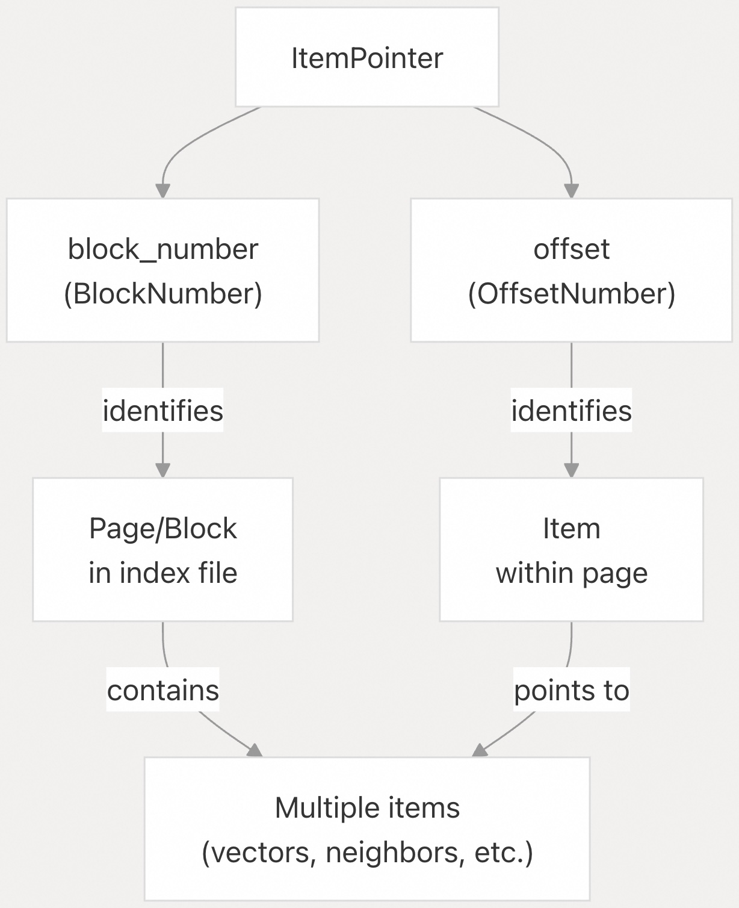
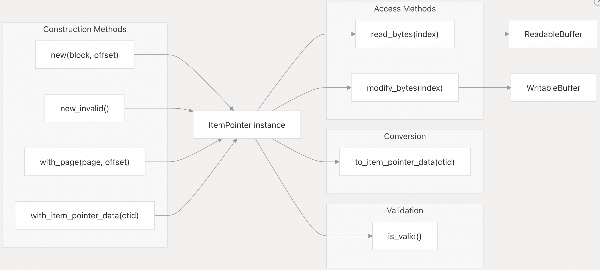
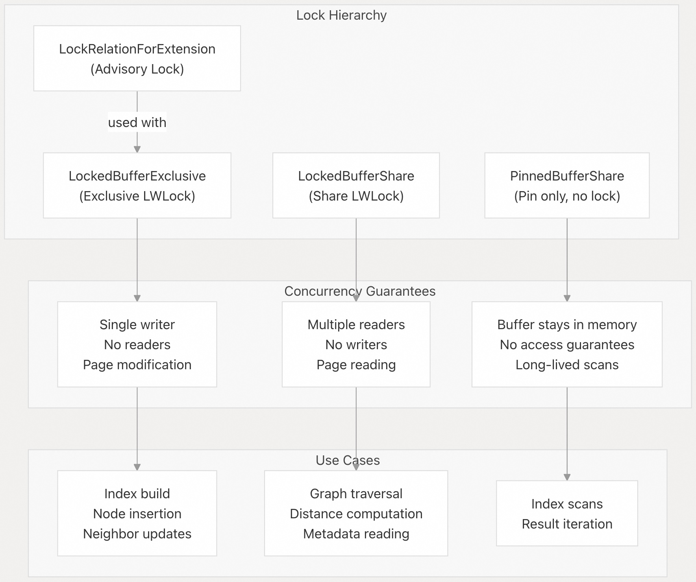
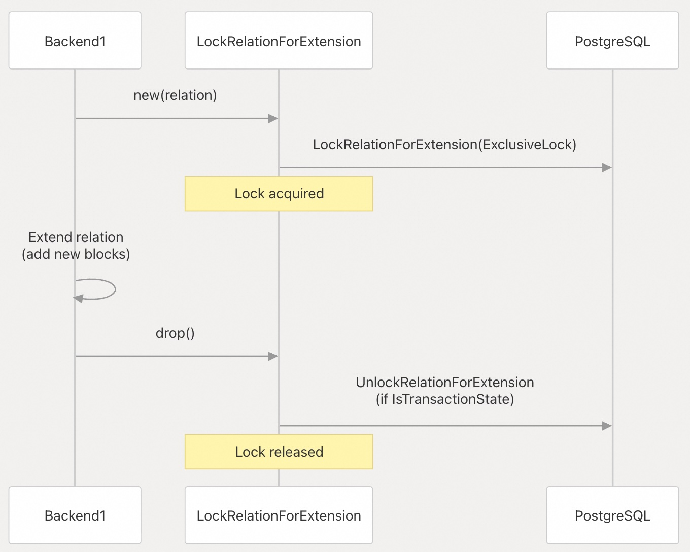
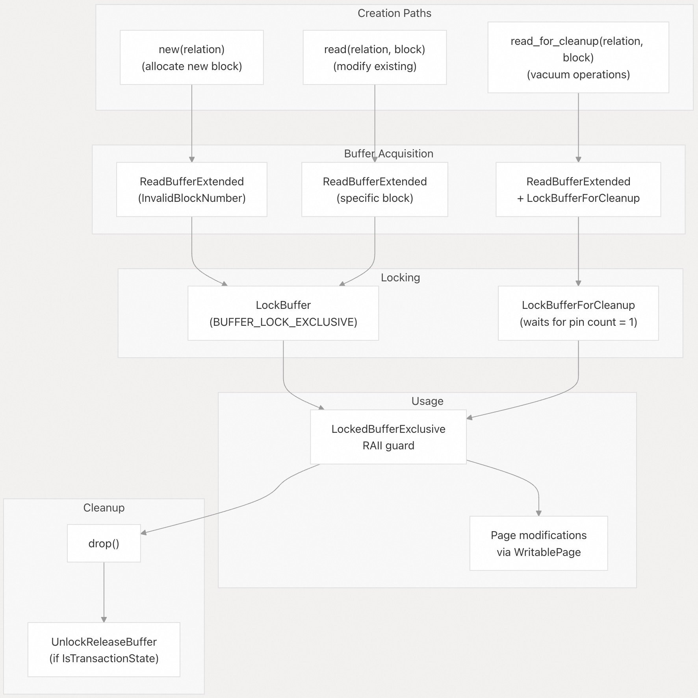
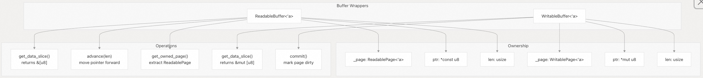
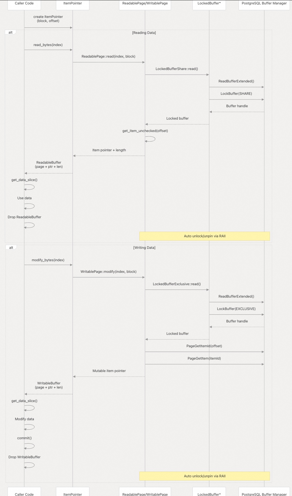
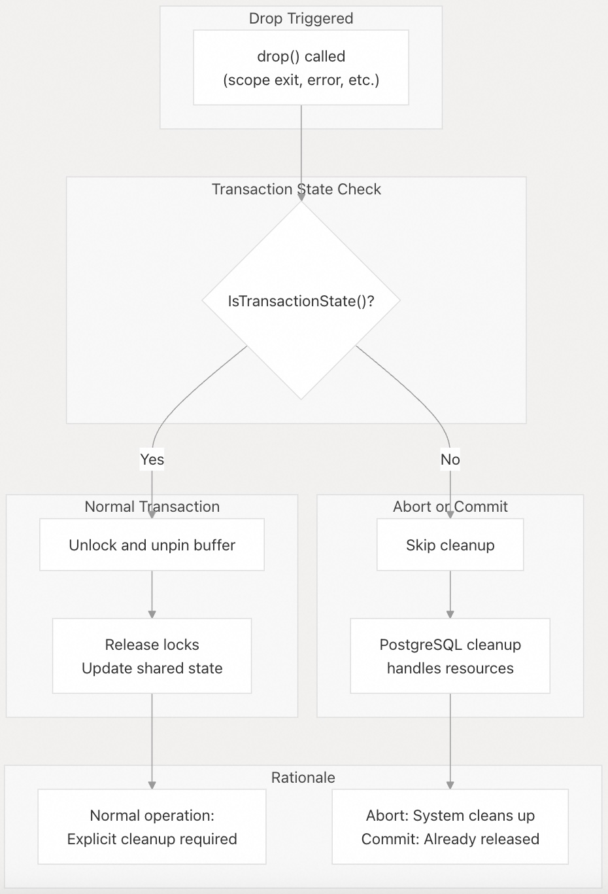

## pgvectorscale 源码学习: 4.5 缓冲区与指针管理 (Buffer and Pointer Management)  
              
### 作者              
digoal              
              
### 日期              
2025-11-11              
              
### 标签              
pgvectorscale , 向量数据库 , DiskANN , StreamingDiskANN , 源码学习              
              
----              
              
## 背景              
本文介绍 **pgvectorscale** 中的缓冲区与指针管理系统，该系统提供了在索引 (index) 内部寻址 (addressing) 和访问数据的底层机制 (low-level mechanisms)。该系统主要处理两个问题：  
  
1.  **项指针寻址 (ItemPointer Addressing)**：一种标准化的方式，用于使用块号 (block numbers) 和偏移量 (offsets) 来识别索引页面 (index pages) 内的位置。  
2.  **缓冲区管理 (Buffer Management)**：受 **RAII**（资源获取即初始化，Resource Acquisition Is Initialization）保护的抽象 (abstractions)，用于安全地获取 **PostgreSQL 共享内存缓冲区 (shared memory buffers)** 上的锁 (locks) 和固定 (pins)。  
  
该系统构成了存储层 (storage layer) 中所有数据访问的基础。  
  
-----  
  
## 项指针寻址系统 (ItemPointer Addressing System)  
  
`ItemPointer` 结构为在索引内定位数据提供了一个两级寻址方案 (two-level addressing scheme)，它由一个**块号 (block number)** 和该块内的一个**偏移量 (offset)** 组成。  
  
### ItemPointer 结构 (ItemPointer Structure)  
  
  
  
| 组成部分 (Component) | 类型 (Type) | 目的 (Purpose) | 特殊值 (Special Values) |  
| :--- | :--- | :--- | :--- |  
| `block_number` (块号) | `pg_sys::BlockNumber` | 标识关系 (relation) 中的哪个页面 (page) | `InvalidBlockNumber` (无效块号) 用于无效指针 (invalid pointers) |  
| `offset` (偏移量) | `pg_sys::OffsetNumber` | 标识页面内的项槽位 (item slot) | `InvalidOffsetNumber` (无效偏移量) 用于无效指针 |  
  
来源: [`pgvectorscale/src/util/mod.rs` 17-23](https://github.com/timescale/pgvectorscale/blob/36271fa5/pgvectorscale/src/util/mod.rs#L17-L23)  
  
### ItemPointer 操作 (ItemPointer Operations)  
  
`ItemPointer` 类型实现了几个用于构建和验证指针的关键操作 (operations)：  
  
  
  
**关键构建模式 (Key Construction Patterns)**：  
  
  * **标准构建 (Standard construction)**：`ItemPointer::new(block_number, offset)` 从明确的坐标创建指针 (pointer)  
  * **无效指针 (Invalid pointer)**：`ItemPointer::new_invalid()` 创建一个用于未初始化指针的哨兵值 (sentinel value)  
  * **来自可写页面 (From writable page)**：`ItemPointer::with_page(page, offset)` 从正在写入的页面构建，自动提取块号  
  * **来自 PostgreSQL 元组 (From PostgreSQL tuple)**：`ItemPointer::with_item_pointer_data(ctid)` 从 PostgreSQL 的原生 `ItemPointerData` 格式转换  
  
来源: [`pgvectorscale/src/util/mod.rs` 109-147](https://github.com/timescale/pgvectorscale/blob/36271fa5/pgvectorscale/src/util/mod.rs#L109-L147)  
  
更多可参考PG源码相关头文件, 了解 datafile layout, page layout, tuple layout.    
  
### 排序与距离计算 (Ordering and Distance Calculation)  
  
`ItemPointer` 实现了 **`Ord`** 特质 (trait)，以块号优先的排序方式 (block-first ordering) 实现排序 (sorting) 和比较 (comparison)：  
  
  
  
block-first ordering 可减少索引访问时的离散IO.    
  
**`ip_distance`** 方法计算两个指针之间的**线性化距离度量 (linearized distance metric)**，将索引视为一维空间：  
  
```  
distance = |block_diff * MaxOffsetNumber + offset_diff|  
```  
  
该度量对于**局部性感知算法 (locality-aware algorithms)** 非常有用，这些算法通过一起访问附近的项 (items) 而受益。  
  
来源: [`pgvectorscale/src/util/mod.rs` 25-37](https://github.com/timescale/pgvectorscale/blob/36271fa5/pgvectorscale/src/util/mod.rs#L25-L37) [`pgvectorscale/src/util/mod.rs` 59-65](https://github.com/timescale/pgvectorscale/blob/36271fa5/pgvectorscale/src/util/mod.rs#L59-L65) [`pgvectorscale/src/util/mod.rs` 166-172](https://github.com/timescale/pgvectorscale/blob/36271fa5/pgvectorscale/src/util/mod.rs#L166-L172)  
  
### 类型别名 (Type Aliases)  
  
代码库为 `ItemPointer` 的不同用途定义了语义化的**类型别名 (type aliases)**：  
  
  * **`IndexPointer`**：指向索引本身内部的项（例如，图邻居列表 `graph neighbor lists`）  
  * **`HeapPointer`**：指向**堆表 (heap table)** 中的**元组 (tuples)**（用于**重排序机制 (resort mechanism)**）  
  
这些别名通过在调用点 (call sites) 使意图 (intent) 清晰，提高了代码的可读性 (readability)。  
  
来源: [`pgvectorscale/src/util/mod.rs` 174-175](https://github.com/timescale/pgvectorscale/blob/36271fa5/pgvectorscale/src/util/mod.rs#L174-L175)  
  
-----  
  
## 缓冲区锁定机制 (Buffer Locking Mechanisms)  
  
**PostgreSQL 的缓冲区管理器 (buffer manager)** 提供了可以以不同模式锁定的**共享内存缓冲区 (shared memory buffers)**。缓冲区系统实现了三种锁定策略 (locking strategies)，每种策略都由一个受 **RAII** 保护的类型表示。  
  
### 缓冲区锁类型与保证 (Buffer Lock Types and Guarantees)  
  
  
  
| 锁类型 (Lock Type) | 并发性 (Concurrency) | 开销 (Overhead) | 最大持有持续时间 (Max Hold Duration) | 主要用途 (Primary Use) |  
| :--- | :--- | :--- | :--- | :--- |  
| `LockRelationForExtension` (关系扩展锁) | 扩展串行化 (Serializes extension) | 高 (High) | 非常短 (Very short) | 添加新的块 (blocks) |  
| `LockedBufferExclusive` (排他缓冲区锁) | 排他访问 (Exclusive access) | 中 (Medium) | 短 (Short) | 修改页面 (Modifying pages) |  
| `LockedBufferShare` (共享缓冲区锁) | 多个读取者 (Multiple readers) | 低 (Low) | 短 | 读取页面 (Reading pages) |  
| `PinnedBufferShare` (固定共享缓冲区) | 无阻塞 (No blocking) | 极小 (Minimal) | 长 (扫描生命周期 `scan lifetime`) | 扫描结果 (Scan results) |  
  
来源: [`pgvectorscale/src/util/buffer.rs` 1-5](https://github.com/timescale/pgvectorscale/blob/36271fa5/pgvectorscale/src/util/buffer.rs#L1-L5)  
  
### LockRelationForExtension (关系扩展锁)  
  
这个 **RAII 守卫 (guard)** 确保同一时间只有一个后端 (backend) 可以**扩展一个关系 (extend a relation)**。它在**分配新块 (allocating new blocks)** 时使用，以防止**竞争条件 (race conditions)**。  
  
  
  
**主要特性 (Key characteristics)**：  
  
  * 使用 PostgreSQL 的 **`ExclusiveLock`** (排他锁) 模式  
  * 在**丢弃 (drop)** 时自动释放（**RAII 模式**）  
  * 在**事务中止/提交 (transaction abort/commit)** 期间跳过解锁 (PostgreSQL 处理清理)  
  
来源: [`pgvectorscale/src/util/buffer.rs` 14-44](https://github.com/timescale/pgvectorscale/blob/36271fa5/pgvectorscale/src/util/buffer.rs#L14-L44)  
  
### LockedBufferExclusive (排他缓冲区锁)  
  
提供对缓冲区的**排他访问 (exclusive access)**，用于**修改页面内容 (modifying page contents)**。这是**写入操作 (write operations)** 的主要机制。  
  
  
  
**特殊情况 - read\_for\_cleanup**：`read_for_cleanup` 方法获取一个更严格的锁，用于**清理操作 (vacuum operations)**。它会等待直到**固定计数 (pin count)** 降至 1 后才获取锁，确保没有其他操作正在访问该缓冲区。  
  
来源: [`pgvectorscale/src/util/buffer.rs` 46-137](https://github.com/timescale/pgvectorscale/blob/36271fa5/pgvectorscale/src/util/buffer.rs#L46-L137)  
  
### LockedBufferShare (共享缓冲区锁)  
  
提供对缓冲区的**共享（只读）访问 (shared (read-only) access)**。多个后端可以同时持有共享锁，从而实现**并发读取 (concurrent reads)**。  
  
```rust  
// Typical read pattern (conceptual)  
let buffer = LockedBufferShare::read(index, block_number);  
// buffer is automatically pinned and locked in share mode  
// Read operations on the page...  
// Drop automatically unlocks and unpins  
```  
  
**特性 (Characteristics)**：  
  
  * 使用 **`BUFFER_LOCK_SHARE`** 模式  
  * 允许多个**并发读取者 (concurrent readers)**  
  * 阻塞**写入者（排他锁 `exclusive locks`）**  
  * 由于使用了 **LWLock**（轻量级锁），应短暂持有  
  
来源: [`pgvectorscale/src/util/buffer.rs` 139-193](https://github.com/timescale/pgvectorscale/blob/36271fa5/pgvectorscale/src/util/buffer.rs#L139-L193)  
  
### PinnedBufferShare (固定共享缓冲区)  
  
提供一个不带锁定的**固定缓冲区 (pinned buffer)**。这用于**索引扫描 (index scans)** 期间，此时缓冲区需要保留在内存中，但不需要持续的锁保护。  
  
**与锁定缓冲区的关键区别 (Key differences from locked buffers)**：  
  
  * **无 LWLock 开销 (overhead)**：适用于长生命周期的引用 (references)  
  * **缓冲区稳定性 (Buffer stability)**：确保页面不会从共享内存中被**驱逐 (evicted)**  
  * **无访问保护 (No access protection)**：其他后端仍然可以修改页面  
  * **关系独立性 (Relation independence)**：即使在关系关闭后也有效  
  
这对 **`amgettuple` 回调函数 (callback)** 尤其重要，该函数一次返回一个**元组 (tuple)**，并可能在扫描期间被重复调用。  
  
来源: [`pgvectorscale/src/util/buffer.rs` 195-239](https://github.com/timescale/pgvectorscale/blob/36271fa5/pgvectorscale/src/util/buffer.rs#L195-L239)  
  
-----  
  
## ReadableBuffer 与 WritableBuffer  
  
这些包装器 (wrapper) 类型将**缓冲区管理 (buffer management)** 与**项级访问 (item-level access)** 相结合，为读取和写入**可变长度数据项 (variable-length data items)** 提供了安全的接口。  
  
### 架构  
  
  
  
### ReadableBuffer (可读缓冲区)  
  
用一个指向页面内特定项数据的指针包装一个 **`ReadablePage` (可读页面)**。  
  
**关键方法 (Key methods)**：  
  
  * `get_data_slice()`：返回项数据的**不可变字节切片 (immutable byte slice)**  
  * `advance(len)`：将内部指针向前移动，对顺序读取 (sequential reading) 非常有用  
  * `get_owned_page()`：消耗 (Consumes) 缓冲区并返回底层的 `ReadablePage`  
  * `len()`：返回缓冲区中剩余的字节数  
  
**构建 (Construction)**：通过 `ItemPointer::read_bytes(index)` 创建，该过程：  
  
1.  读取包含该块的页面  
2.  定位到指定偏移量处的项  
3.  将项的数据包装在一个 `ReadableBuffer` 中  
  
来源: [`pgvectorscale/src/util/mod.rs` 67-91](https://github.com/timescale/pgvectorscale/blob/36271fa5/pgvectorscale/src/util/mod.rs#L67-L91) [`pgvectorscale/src/util/mod.rs` 149-152](https://github.com/timescale/pgvectorscale/blob/36271fa5/pgvectorscale/src/util/mod.rs#L149-L152)  
  
### WritableBuffer (可写缓冲区)  
  
用一个指向特定项数据的**可变指针 (mutable pointer)** 包装一个 **`WritablePage` (可写页面)**。  
  
**关键方法 (Key methods)**：  
  
  * `get_data_slice()`：返回一个用于写入的**可变字节切片 (mutable byte slice)**  
  * `commit()`：将页面标记为**脏 (dirty)**，确保**预写日志记录 (WAL logging)** 和最终的**持久化 (persistence)**  
  
**构建 (Construction)**：通过 `ItemPointer::modify_bytes(index)` 创建，该过程：  
  
1.  打开页面进行修改 (modification)  
2.  使用 `PageGetItemId` 和 `PageGetItem` 定位项  
3.  将项的数据包装在一个 `WritableBuffer` 中  
  
**重要提示 (Important)**：必须调用 `commit()` 方法以确保修改被持久化。这委托 (delegates) 给底层的 **`WritablePage::commit()`**。  
  
来源: [`pgvectorscale/src/util/mod.rs` 93-107](https://github.com/timescale/pgvectorscale/blob/36271fa5/pgvectorscale/src/util/mod.rs#L93-L107) [`pgvectorscale/src/util/mod.rs` 154-164](https://github.com/timescale/pgvectorscale/blob/36271fa5/pgvectorscale/src/util/mod.rs#L154-L164)  
  
-----  
  
## 与页面管理的集成 (Integration with Page Management)  
  
**缓冲区与指针管理系统 (buffer and pointer management system)** 与**页面管理层 (page management layer)** 紧密集成，以提供一个完整的**数据访问栈 (data access stack)**。  
  
### 数据访问流程 (Data Access Flow)  
  
  
  
**关键集成点 (Key integration points)**：  
  
1.  **ItemPointer → Page**：`ItemPointer` 方法创建 `ReadablePage` 或 `WritablePage` 实例 (instances)  
2.  **Page → Buffer**：页面类型获取适当的缓冲区锁  
3.  **Buffer → PostgreSQL**：锁委托给 PostgreSQL 的缓冲区管理器 (buffer manager)  
4.  **RAII 清理 (Cleanup)**：所有资源通过 Rust 的 **drop 语义 (drop semantics)** 自动释放  
  
这种分层设计确保了：  
  
  * **类型安全 (Type safety)**：不能使用共享锁获取可变访问 (mutable access)  
  * **自动清理 (Automatic cleanup)**：所有锁和固定在**作用域退出 (scope exit)** 时释放  
  * **错误安全 (Error safety)**：PostgreSQL 错误触发 Rust 的**展开 (unwinding)**，这会运行**析构函数 (destructors)**  
  * **事务感知 (Transaction awareness)**：当 PostgreSQL 处理时，在中止/提交期间跳过清理  
  
来源: [`pgvectorscale/src/util/mod.rs` 149-164](https://github.com/timescale/pgvectorscale/blob/36271fa5/pgvectorscale/src/util/mod.rs#L149-L164)  
  
-----  
  
## 事务安全与错误处理 (Transaction Safety and Error Handling)  
  
所有**缓冲区守卫类型 (buffer guard types)** 都实现了**事务感知清理 (transaction-aware cleanup)**，以正确处理 PostgreSQL 的事务状态 (transaction states)。  
  
### 清理状态机 (Cleanup State Machine)  
  
  
  
**事务状态 (Transaction states)**：  
  
  * **正常 (`IsTransactionState = true`)**：需要显式 (Explicit) 的解锁/取消固定 (unlock/unpin)  
  * **中止 (`IsTransactionState = false`)**：PostgreSQL 的中止处理器 (abort handler) 自动清理  
  * **提交 (`IsTransactionState = false`)**：资源应该已经释放  
  
这种模式出现在所有**缓冲区守卫的 drop 实现 (buffer guard drop implementations)** 中，以防止**二次释放错误 (double-free errors)** 并确保正确的资源管理。  
  
来源: [`pgvectorscale/src/util/buffer.rs` 30-43](https://github.com/timescale/pgvectorscale/blob/36271fa5/pgvectorscale/src/util/buffer.rs#L30-L43) [`pgvectorscale/src/util/buffer.rs` 119-129](https://github.com/timescale/pgvectorscale/blob/36271fa5/pgvectorscale/src/util/buffer.rs#L119-L129) [`pgvectorscale/src/util/buffer.rs` 175-185](https://github.com/timescale/pgvectorscale/blob/36271fa5/pgvectorscale/src/util/buffer.rs#L175-L185) [`pgvectorscale/src/util/buffer.rs` 227-237](https://github.com/timescale/pgvectorscale/blob/36271fa5/pgvectorscale/src/util/buffer.rs#L227-L237)  
  
-----  
  
## 总结 (Summary)  
  
| 组成部分 (Component) | 目的 (Purpose) | 关键类型 (Key Types) |  
| :--- | :--- | :--- |  
| **ItemPointer** (项指针) | 索引内项的两级寻址 (Two-level addressing) | `ItemPointer`, `IndexPointer`, `HeapPointer` |  
| **Buffer Guards** (缓冲区守卫) | 具有不同访问模式的 **RAII 安全缓冲区锁定 (RAII-safe buffer locking)** | `LockedBufferExclusive`, `LockedBufferShare`, `PinnedBufferShare`, `LockRelationForExtension` |  
| **Buffer Wrappers** (缓冲区包装器) | 项级访问 (Item-level access) 与页面所有权 (page ownership) 的结合 | `ReadableBuffer`, `WritableBuffer` |  
  
这些原语 (primitives) 使更高级别的存储抽象（参见 页面管理 (Page Management)）能够实现复杂的数据结构，同时保持 PostgreSQL 的**并发性 (concurrency)** 和**恢复保证 (recovery guarantees)**。  
    
#### [PolarDB 学习图谱](https://www.aliyun.com/database/openpolardb/activity "8642f60e04ed0c814bf9cb9677976bd4")
  
  
#### [PostgreSQL 解决方案集合](../201706/20170601_02.md "40cff096e9ed7122c512b35d8561d9c8")
  
  
#### [德哥 / digoal's Github - 公益是一辈子的事.](https://github.com/digoal/blog/blob/master/README.md "22709685feb7cab07d30f30387f0a9ae")
  
  
#### [About 德哥](https://github.com/digoal/blog/blob/master/me/readme.md "a37735981e7704886ffd590565582dd0")
  
  

  
