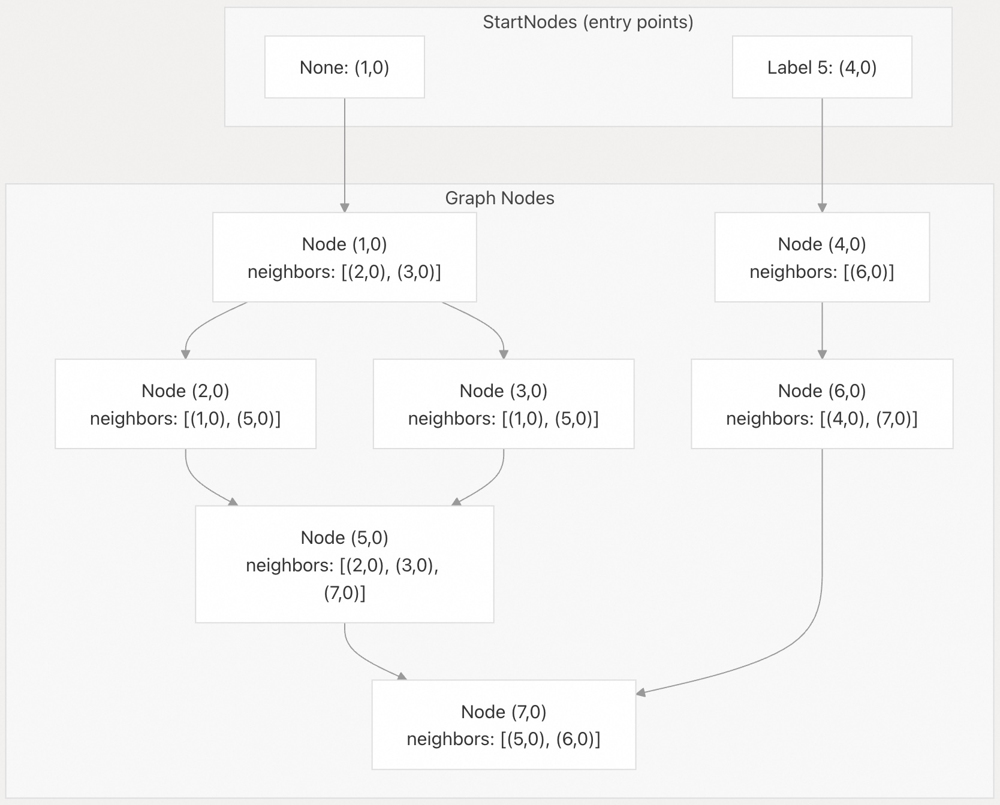
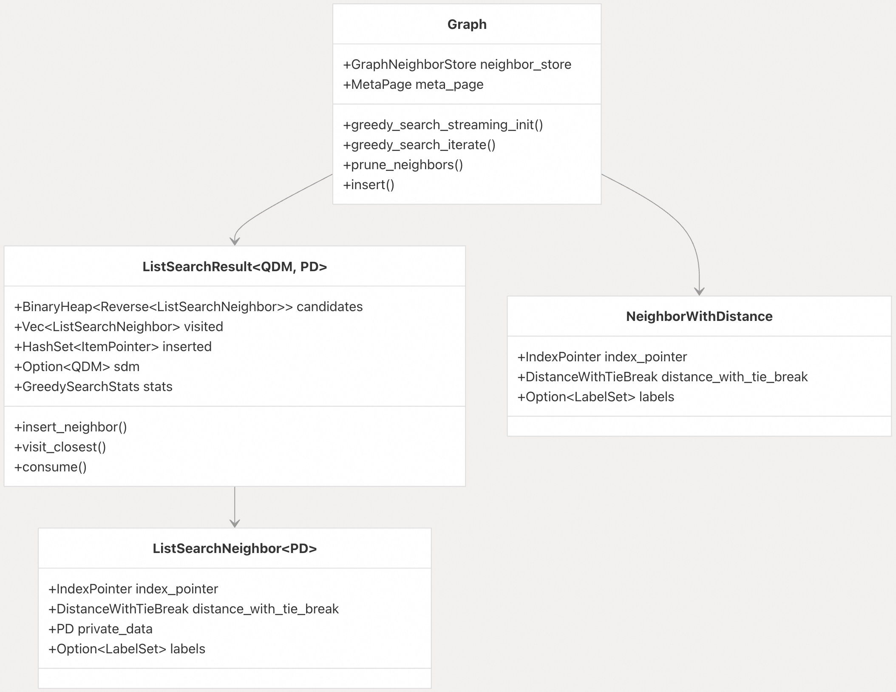
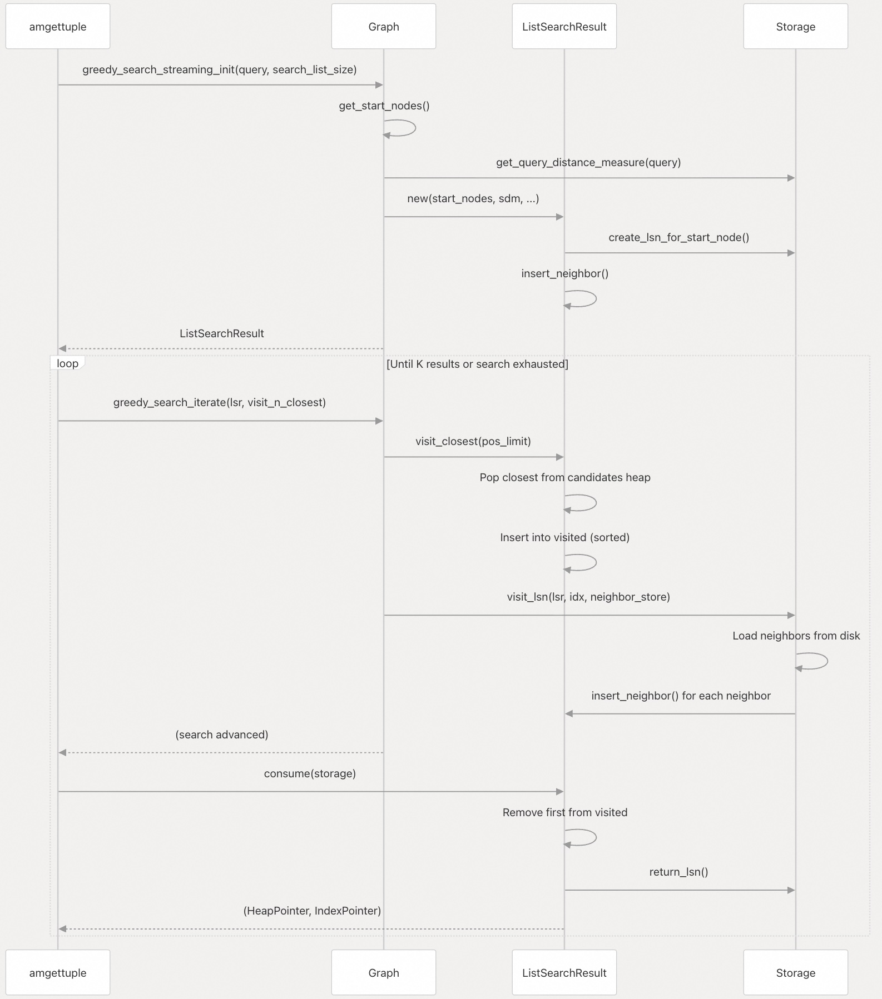
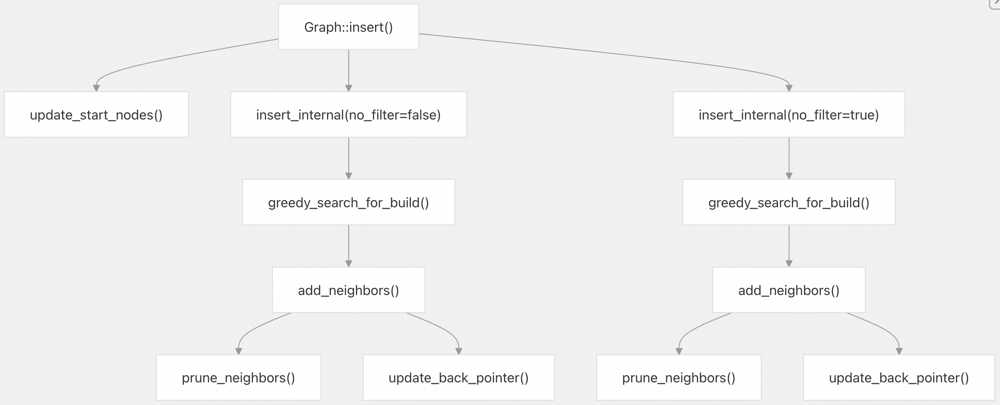
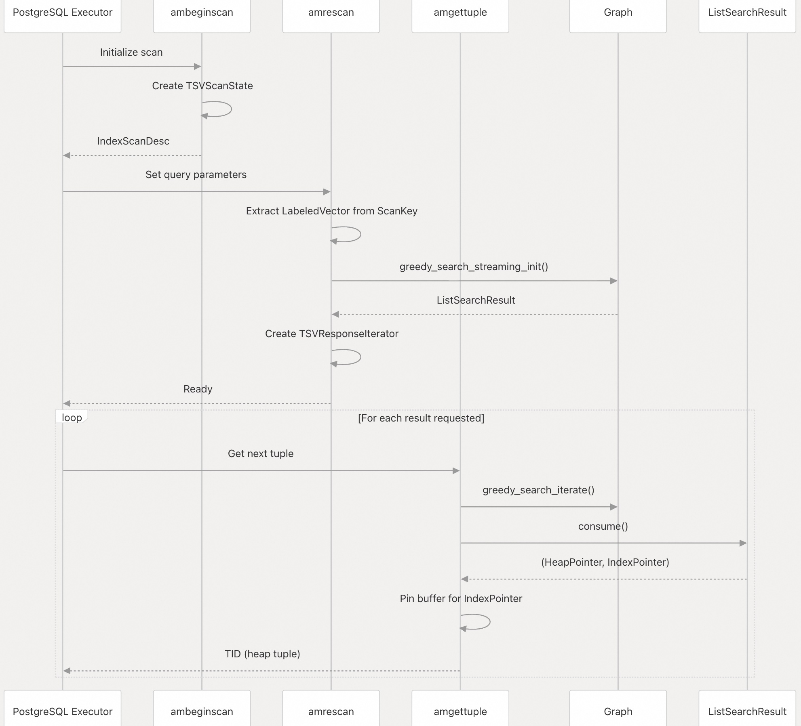
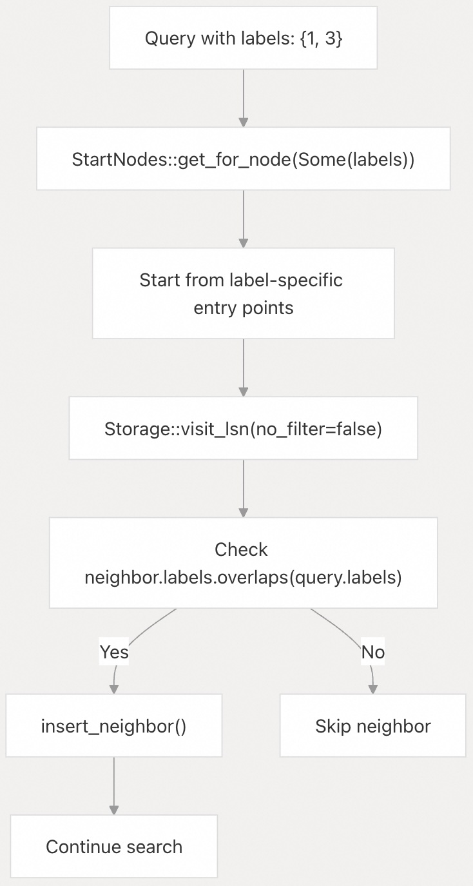

## pgvectorscale 源码学习: 5 基于图的搜索 (`Graph-Based Search`)  
                
### 作者                
digoal                
                
### 日期                
2025-11-11                
                
### 标签                
pgvectorscale , 向量数据库 , DiskANN , StreamingDiskANN , 源码学习                
                
----                
                
## 背景                
基于图的搜索系统实现了 **DiskANN** 近似最近邻 (`ANN`) 搜索算法。本文将介绍图结构 (`graph structure`)、贪婪搜索算法 (`greedy search algorithm`) 和邻居管理 (`neighbor management`)。  
  
## 图结构 (`Graph Structure`)  
  
DiskANN 图结构 (`Graph structure`) 包含：  
  
  * **节点 (`Nodes`)**：每个节点对应一个已索引的向量，由一个**索引指针** (`IndexPointer`) 标识。  
  * **边 (`Edges`)**：存储为邻居列表 (`neighbor lists`)，每个邻居由一个**带距离的邻居** (`NeighborWithDistance`) 表示。  
  * **入口点 (`Entry points`)**：保存在**起始节点** (`StartNodes`) 中，用于高效地初始化搜索。  
  
**图的结构概念 (`Graph Conceptual Structure`)**  
  
  
  
来源 (`Sources`): [`pgvectorscale/src/access_method/graph/mod.rs` 187-198](https://github.com/timescale/pgvectorscale/blob/36271fa5/pgvectorscale/src/access_method/graph/mod.rs#L187-L198) [`pgvectorscale/src/access_method/graph/start_nodes.rs`](https://github.com/timescale/pgvectorscale/blob/36271fa5/pgvectorscale/src/access_method/graph/start_nodes.rs)  
  
## 核心数据结构 (`Core Data Structures`)  
  
**图搜索中的关键组件 (`Key Components in Graph Search`)**  
  
  
  
### 图 (`Graph`)  
  
`Graph` 结构体 [`pgvectorscale/src/access_method/graph/mod.rs` 187-198](https://github.com/timescale/pgvectorscale/blob/36271fa5/pgvectorscale/src/access_method/graph/mod.rs#L187-L198) 管理图结构和操作。它包含：  
  
| 字段 (`Field`) | 类型 (`Type`) | 目的 (`Purpose`) |  
| :--- | :--- | :--- |  
| `neighbor_store` | `GraphNeighborStore` | 存储和检索邻居列表（详见第 5.1 章）|  
| `meta_page` | `&mut MetaPage` | 索引配置和起始节点（详见第 3.5 章）|  
  
来源 (`Sources`): [`pgvectorscale/src/access_method/graph/mod.rs` 187-198](https://github.com/timescale/pgvectorscale/blob/36271fa5/pgvectorscale/src/access_method/graph/mod.rs#L187-L198)  
  
### 列表搜索结果 (`ListSearchResult`)  
  
`ListSearchResult<QDM, PD>` 结构体 [`pgvectorscale/src/access_method/graph/mod.rs` 74-82](https://github.com/timescale/pgvectorscale/blob/36271fa5/pgvectorscale/src/access_method/graph/mod.rs#L74-L82) 维护搜索状态 (`search state`)：  
  
| 字段 (`Field`) | 类型 (`Type`) | 目的 (`Purpose`) |  
| :--- | :--- | :--- |  
| `candidates` | `BinaryHeap<Reverse<ListSearchNeighbor<PD>>>` | 待访问节点的**最小堆** (`Min-heap`)，按距离排序 |  
| `visited` | `Vec<ListSearchNeighbor<PD>>` | 按排序顺序排列的**已访问节点** (`visited nodes`) |  
| `inserted` | `HashSet<ItemPointer>` | 防止重复处理 |  
| `sdm` | `Option<QDM>` | 特定于存储的**距离度量** (`Storage-specific distance measure`) |  
| `stats` | `GreedySearchStats` | 性能统计信息 (`Performance statistics`) |  
  
泛型参数 (`generic parameters`) 如下：  
  
  * `QDM`：来自存储实现的**查询距离度量** (`QueryDistanceMeasure`) 类型。  
  * `PD`：用于存储特定节点元数据 (`metadata`) 的**列表搜索邻居私有数据** (`LSNPrivateData`) 类型。  
  
来源 (`Sources`): [`pgvectorscale/src/access_method/graph/mod.rs` 74-82](https://github.com/timescale/pgvectorscale/blob/36271fa5/pgvectorscale/src/access_method/graph/mod.rs#L74-L82)  
  
### 列表搜索邻居 (`ListSearchNeighbor`)  
  
`ListSearchNeighbor<PD>` 结构体 [`pgvectorscale/src/access_method/graph/mod.rs` 22-27](https://github.com/timescale/pgvectorscale/blob/36271fa5/pgvectorscale/src/access_method/graph/mod.rs#L22-L27) 表示搜索期间的候选节点 (`candidate node`)：  
  
| 字段 (`Field`) | 类型 (`Type`) | 目的 (`Purpose`) |  
| :--- | :--- | :--- |  
| `index_pointer` | `IndexPointer` | 节点在索引中的位置 |  
| `distance_with_tie_break` | `DistanceWithTieBreak` | 带有**确定性平局决胜** (`deterministic tie-breaking`) 的查询距离 |  
| `private_data` | `PD` | 特定于存储的缓存数据 (`cached data`) |  
| `labels` | `Option<LabelSet>` | 用于过滤的**节点标签** (`Node labels`) |  
  
来源 (`Sources`): [`pgvectorscale/src/access_method/graph/mod.rs` 22-27](https://github.com/timescale/pgvectorscale/blob/36271fa5/pgvectorscale/src/access_method/graph/mod.rs#L22-L27)  
  
### 带距离的邻居 (`NeighborWithDistance`)  
  
`NeighborWithDistance` 结构体 [`pgvectorscale/src/access_method/graph/neighbor_with_distance.rs`](https://github.com/timescale/pgvectorscale/blob/36271fa5/pgvectorscale/src/access_method/graph/neighbor_with_distance.rs) 表示存储的图边 (`stored graph edges`)：  
  
| 字段 (`Field`) | 类型 (`Type`) | 目的 (`Purpose`) |  
| :--- | :--- | :--- |  
| `index_pointer` | `IndexPointer` | 邻居节点位置 |  
| `distance_with_tie_break` | `DistanceWithTieBreak` | **预先计算的距离** (`Precomputed distance`) |  
| `labels` | `Option<LabelSet>` | 邻居标签 (`Neighbor labels`) |  
  
来源 (`Sources`): [`pgvectorscale/src/access_method/graph/neighbor_with_distance.rs`](https://github.com/timescale/pgvectorscale/blob/36271fa5/pgvectorscale/src/access_method/graph/neighbor_with_distance.rs)  
  
## 贪婪搜索算法 (`Greedy Search Algorithm`)  
  
贪婪搜索 (`greedy search`) 实现使用一种**流式方法** (`streaming approach`)，逐步探索图。  
  
**贪婪搜索执行流程 (`Greedy Search Execution Flow`)**  
  
  
  
### 搜索初始化 (`Search Initialization`)  
  
函数 (`Function`): `Graph::greedy_search_streaming_init<S: Storage>()` [`pgvectorscale/src/access_method/graph/mod.rs` 331-354](https://github.com/timescale/pgvectorscale/blob/36271fa5/pgvectorscale/src/access_method/graph/mod.rs#L331-L354)  
  
步骤 (`Steps`):  
  
1.  从元数据页 (`meta_page`) 中检索**起始节点** (`StartNodes`) [`pgvectorscale/src/access_method/graph/mod.rs` 337-341](https://github.com/timescale/pgvectorscale/blob/36271fa5/pgvectorscale/src/access_method/graph/mod.rs#L337-L341)  
2.  使用 `StartNodes::get_for_node()` [`pgvectorscale/src/access_method/graph/mod.rs` 342](https://github.com/timescale/pgvectorscale/blob/36271fa5/pgvectorscale/src/access_method/graph/mod.rs#L342-L342) 根据查询标签 (`query labels`) 选择**入口点** (`entry points`)。  
3.  通过 `Storage::get_query_distance_measure()` [`pgvectorscale/src/access_method/graph/mod.rs` 343](https://github.com/timescale/pgvectorscale/blob/36271fa5/pgvectorscale/src/access_method/graph/mod.rs#L343-L343) 创建特定于存储的**查询距离度量** (`QueryDistanceMeasure`)。  
4.  使用 `ListSearchResult::new()` [`pgvectorscale/src/access_method/graph/mod.rs` 345-353](https://github.com/timescale/pgvectorscale/blob/36271fa5/pgvectorscale/src/access_method/graph/mod.rs#L345-L353) 初始化**列表搜索结果** (`ListSearchResult`)。  
  
初始化将起始节点添加到搜索候选节点 (`search candidates`) 中 [`pgvectorscale/src/access_method/graph/mod.rs` 117-123](https://github.com/timescale/pgvectorscale/blob/36271fa5/pgvectorscale/src/access_method/graph/mod.rs#L117-L123)  
  
来源 (`Sources`): [`pgvectorscale/src/access_method/graph/mod.rs` 331-354](https://github.com/timescale/pgvectorscale/blob/36271fa5/pgvectorscale/src/access_method/graph/mod.rs#L331-L354) [`pgvectorscale/src/access_method/graph/mod.rs` 97-124](https://github.com/timescale/pgvectorscale/blob/36271fa5/pgvectorscale/src/access_method/graph/mod.rs#L97-L124)  
  
### 搜索迭代 (`Search Iteration`)  
  
函数 (`Function`): `Graph::greedy_search_iterate<S: Storage>()` [`pgvectorscale/src/access_method/graph/mod.rs` 357-385](https://github.com/timescale/pgvectorscale/blob/36271fa5/pgvectorscale/src/access_method/graph/mod.rs#L357-L385)  
  
迭代循环 (`The iteration loop`) [`pgvectorscale/src/access_method/graph/mod.rs` 365-384](https://github.com/timescale/pgvectorscale/blob/36271fa5/pgvectorscale/src/access_method/graph/mod.rs#L365-L384)：  
  
1.  `ListSearchResult::visit_closest(pos_limit)` [`pgvectorscale/src/access_method/graph/mod.rs` 153-170](https://github.com/timescale/pgvectorscale/blob/36271fa5/pgvectorscale/src/access_method/graph/mod.rs#L153-L170)：  
      * 从候选节点 (`candidates`) 堆中弹出距离最小的元素。  
      * 将其插入到**已访问节点** (`visited`) 向量中（保持排序顺序）。  
      * 返回在已访问节点 (`visited`) 中的索引。  
2.  `Storage::visit_lsn()` [在 `pgvectorscale/src/access_method/graph/mod.rs` 378-383](https://github.com/timescale/pgvectorscale/blob/36271fa5/called%20at%20pgvectorscale/src/access_method/graph/mod.rs#L378-L383) 中调用：  
      * 从存储中加载节点。  
      * 从**图邻居存储** (`GraphNeighborStore`) 中检索其邻居。  
      * 对于每个邻居，如果尚未访问，则调用 `ListSearchResult::insert_neighbor()`。  
  
当 `visit_n_closest` 个节点被访问时，搜索终止 [`pgvectorscale/src/access_method/graph/mod.rs` 365](https://github.com/timescale/pgvectorscale/blob/36271fa5/pgvectorscale/src/access_method/graph/mod.rs#L365-L365)  
  
来源 (`Sources`): [`pgvectorscale/src/access_method/graph/mod.rs` 357-385](https://github.com/timescale/pgvectorscale/blob/36271fa5/pgvectorscale/src/access_method/graph/mod.rs#L357-L385) [`pgvectorscale/src/access_method/graph/mod.rs` 153-170](https://github.com/timescale/pgvectorscale/blob/36271fa5/pgvectorscale/src/access_method/graph/mod.rs#L153-L170)  
  
### 结果消耗 (`Result Consumption`)  
  
函数 (`Function`): `ListSearchResult::consume<S: Storage>()` [`pgvectorscale/src/access_method/graph/mod.rs` 174-184](https://github.com/timescale/pgvectorscale/blob/36271fa5/pgvectorscale/src/access_method/graph/mod.rs#L174-L184)  
  
步骤 (`Steps`):  
  
1.  从**已访问节点** (`visited`) 中移除第一个元素 [`pgvectorscale/src/access_method/graph/mod.rs` 181](https://github.com/timescale/pgvectorscale/blob/36271fa5/pgvectorscale/src/access_method/graph/mod.rs#L181-L181)  
2.  调用 `Storage::return_lsn()` 将其转换为**堆指针** (`HeapPointer`) [`pgvectorscale/src/access_method/graph/mod.rs` 182](https://github.com/timescale/pgvectorscale/blob/36271fa5/pgvectorscale/src/access_method/graph/mod.rs#L182-L182)  
3.  返回 (`HeapPointer`, `IndexPointer`) **元组** (`tuple`) [`pgvectorscale/src/access_method/graph/mod.rs` 183](https://github.com/timescale/pgvectorscale/blob/36271fa5/pgvectorscale/src/access_method/graph/mod.rs#L183-L183)  
  
堆指针 (`HeapPointer`) 引用实际的表行，而索引指针 (`IndexPointer`) 引用索引条目。  
  
来源 (`Sources`): [`pgvectorscale/src/access_method/graph/mod.rs` 174-184](https://github.com/timescale/pgvectorscale/blob/36271fa5/pgvectorscale/src/access_method/graph/mod.rs#L174-L184)  
  
## 图构建 (`Graph Construction`)  
  
图在节点插入时逐步构建。  
  
**节点插入流程 (`Node Insertion Process`)**  
  
  
  
### 节点插入 (`Node Insertion`)  
  
函数 (`Function`): `Graph::insert<S: Storage>()` [`pgvectorscale/src/access_method/graph/mod.rs` 637-660](https://github.com/timescale/pgvectorscale/blob/36271fa5/pgvectorscale/src/access_method/graph/mod.rs#L637-L660)  
  
插入过程 (`The insertion process`)：  
  
1.  如有必要，更新**起始节点** (`StartNodes`) [`pgvectorscale/src/access_method/graph/mod.rs` 645-651](https://github.com/timescale/pgvectorscale/blob/36271fa5/pgvectorscale/src/access_method/graph/mod.rs#L645-L651)  
2.  使用标签过滤进行插入（如果节点有标签） [`pgvectorscale/src/access_method/graph/mod.rs` 653-656](https://github.com/timescale/pgvectorscale/blob/36271fa5/pgvectorscale/src/access_method/graph/mod.rs#L653-L656)  带标签的插入详见附录, 虽然只构建1张全图, 但是对于每个label都有相应的入口点, 同时使用label可实现快速剪枝条加快搜索. 确保了整体连通性, 带标签过滤的高效性.    
3.  插入邻居 [`pgvectorscale/src/access_method/graph/mod.rs` 521-526](https://github.com/timescale/pgvectorscale/blob/36271fa5/pgvectorscale/src/access_method/graph/mod.rs#L659-L659)  
4.  使用 `Graph::post_insert_check()` [`pgvectorscale/src/access_method/graph/mod.rs` 657](https://github.com/timescale/pgvectorscale/blob/36271fa5/pgvectorscale/src/access_method/graph/mod.rs#L657-L657) 更新**反向指针** (`back-pointers`)  
  
来源 (`Sources`): [`pgvectorscale/src/access_method/graph/mod.rs` 637-660](https://github.com/timescale/pgvectorscale/blob/36271fa5/pgvectorscale/src/access_method/graph/mod.rs#L637-L660)  
  
### 寻找邻居 (`Finding Neighbors`)  
  
函数 (`Function`): `Graph::greedy_search_for_build<S: Storage>()` [`pgvectorscale/src/access_method/graph/mod.rs` 285-327](https://github.com/timescale/pgvectorscale/blob/36271fa5/pgvectorscale/src/access_method/graph/mod.rs#L285-L327)  
  
**步骤 (`Steps`):**  
  
1.  **获取合适的起始节点 (`Get appropriate start nodes`)**  
    [`pgvectorscale/src/access_method/graph/mod.rs` 293-303](https://github.com/timescale/pgvectorscale/blob/36271fa5/pgvectorscale/src/access_method/graph/mod.rs#L293-L303)  
  
2.  **初始化列表搜索结果 (`Initialize ListSearchResult`)**  
    [`pgvectorscale/src/access_method/graph/mod.rs` 305-316](https://github.com/timescale/pgvectorscale/blob/36271fa5/pgvectorscale/src/access_method/graph/mod.rs#L305-L316)  
  
3.  **运行贪婪搜索迭代 (`Run greedy_search_iterate()`)，直到访问 `search_list_size` 个节点**  
    [`pgvectorscale/src/access_method/graph/mod.rs` 318-324](https://github.com/timescale/pgvectorscale/blob/36271fa5/pgvectorscale/src/access_method/graph/mod.rs#L318-L324)  
  
4.  **将已访问节点 (`visited nodes`) 作为带距离的邻居 (`HashSet<NeighborWithDistance>`) 集合返回**  
    [`pgvectorscale/src/access_method/graph/mod.rs` 326](https://github.com/timescale/pgvectorscale/blob/36271fa5/pgvectorscale/src/access_method/graph/mod.rs#L326-L326)  
  
来源 (`Sources`):  
[`pgvectorscale/src/access_method/graph/mod.rs` 285-327](https://github.com/timescale/pgvectorscale/blob/36271fa5/pgvectorscale/src/access_method/graph/mod.rs#L285-L327)  
  
### 邻居剪枝 (`Neighbor Pruning`)  
  
函数 (`Function`): `Graph::prune_neighbors<S: Storage>()` [`pgvectorscale/src/access_method/graph/mod.rs` 392-488](https://github.com/timescale/pgvectorscale/blob/36271fa5/pgvectorscale/src/access_method/graph/mod.rs#L392-L488)  
  
**稳健的剪枝算法 (`The robust pruning algorithm`):**  
  
1.  **按距离排序候选节点 (`Sort candidates by distance`)**  
    [`pgvectorscale/src/access_method/graph/mod.rs` 408](https://github.com/timescale/pgvectorscale/blob/36271fa5/pgvectorscale/src/access_method/graph/mod.rs#L408-L408)  
2.  **初始化 `max_factors` 数组 (`Initialize max_factors array`)**  
    [`pgvectorscale/src/access_method/graph/mod.rs` 411](https://github.com/timescale/pgvectorscale/blob/36271fa5/pgvectorscale/src/access_method/graph/mod.rs#L411-L411)  
3.  **以递增的 `alpha` 进行迭代**  
    [`pgvectorscale/src/access_method/graph/mod.rs` 416](https://github.com/timescale/pgvectorscale/blob/36271fa5/pgvectorscale/src/access_method/graph/mod.rs#L411-L411)：  
      * 对于每个候选节点，检查 `max_factors[i] <= alpha` 是否成立。  
      * 如果**接受** (`accepted`)，则添加到结果中，并更新剩余候选节点的**因子** (`factors`)。  
      * **因子计算 (`Factor calculation`)**: `distance(candidate, point) / distance(candidate, existing_neighbor)` 。  
4.  **返回剪枝后的列表（最多 `num_neighbors` 个元素）**  
  
`alpha` 参数从 1.0 开始，每次迭代乘以 1.2 [`pgvectorscale/src/access_method/graph/mod.rs` 484](https://github.com/timescale/pgvectorscale/blob/36271fa5/pgvectorscale/src/access_method/graph/mod.rs#L484-L484)，直到达到 `max_alpha` 为止。  
  
#### 剪枝逻辑 (`Pruning Logic`)  
  
| 变量 (`Variable`) | 类型 (`Type`) | 目的 (`Purpose`) |  
| :--- | :--- | :--- |  
| `alpha` | `f64` | 控制剪枝的**激进程度** (`aggressiveness`)（从 `1.0` 到 `max_alpha`）|  
| `max_factors[i]` | `f64` | 候选节点 i 的**最大遮挡因子** (`Maximum occlusion factor`)|  
| `factor` | `f64` | 比较距离的**比率** (`Ratio`)：值越高表示被遮挡 (`occluded`) |  
  
来源 (`Sources`):  
[`pgvectorscale/src/access_method/graph/mod.rs` 392-488](https://github.com/timescale/pgvectorscale/blob/36271fa5/pgvectorscale/src/access_method/graph/mod.rs#L392-L488)  
  
### 反向指针更新 (`Back-Pointer Updates`)  
  
类似双向链接.    
  
函数 (`Function`): `Graph::update_back_pointer<S: Storage>()` [`pgvectorscale/src/access_method/graph/mod.rs` 720-737](https://github.com/timescale/pgvectorscale/blob/36271fa5/pgvectorscale/src/access_method/graph/mod.rs#L720-L737)  
  
在从新节点向其邻居添加边之后，**反向指针** (`back-pointers`) 会被更新：  
  
1.  **为反向边 (`reverse edge`) 创建带距离的邻居 (`NeighborWithDistance`)**  
    [`pgvectorscale/src/access_method/graph/mod.rs` 730-734](https://github.com/timescale/pgvectorscale/blob/36271fa5/pgvectorscale/src/access_method/graph/mod.rs#L730-L734)  
2.  **对该邻居调用 `add_neighbors()`**  
    [`pgvectorscale/src/access_method/graph/mod.rs` 735](https://github.com/timescale/pgvectorscale/blob/36271fa5/pgvectorscale/src/access_method/graph/mod.rs#L735-L735)  
3.  **返回新节点是否被包含在剪枝后的邻居列表 (`pruned neighbor list`) 中**  
    [`pgvectorscale/src/access_method/graph/mod.rs` 736](https://github.com/timescale/pgvectorscale/blob/36271fa5/pgvectorscale/src/access_method/graph/mod.rs#L736-L736)  
  
这确保了图中的**双向连接性** (`bidirectional connectivity`)。  
  
来源 (`Sources`):  
[`pgvectorscale/src/access_method/graph/mod.rs` 720-737](https://github.com/timescale/pgvectorscale/blob/36271fa5/pgvectorscale/src/access_method/graph/mod.rs#L720-L737)  
  
## PostgreSQL 访问方法集成 (`PostgreSQL Access Method Integration`)  
  
图搜索通过 PostgreSQL 的**索引访问方法 API** (`Index Access Method API`) 进行暴露（详见第 2.2 章）。  
  
**查询执行流程 (`Query Execution Flow`)**  
  
  
  
### 扫描初始化 (`Scan Initialization`)  
  
函数 (`Function`): `ambeginscan()` [`pgvectorscale/src/access_method/scan.rs` 305-329](https://github.com/timescale/pgvectorscale/blob/36271fa5/pgvectorscale/src/access_method/scan.rs#L305-L329)  
  
它创建了 `TSVScanState` [`pgvectorscale/src/access_method/scan.rs` 34-49](https://github.com/timescale/pgvectorscale/blob/36271fa5/pgvectorscale/src/access_method/scan.rs#L34-L49)，该结构体包含：  
  
  * `storage`: **存储实现引用** (`Storage implementation reference`)  
  * `graph`: **图结构** (`Graph structure`)  
  * `response_iter`: **结果可选迭代器** (`Optional iterator over results`)  
  
来源 (`Sources`):  
[`pgvectorscale/src/access_method/scan.rs` 305-329](https://github.com/timescale/pgvectorscale/blob/36271fa5/pgvectorscale/src/access_method/scan.rs#L305-L329)  
[`pgvectorscale/src/access_method/scan.rs` 34-49](https://github.com/timescale/pgvectorscale/blob/36271fa5/pgvectorscale/src/access_method/scan.rs#L34-L49)  
  
### 查询设置 (`Query Setup`)  
  
函数 (`Function`): `amrescan()` [`pgvectorscale/src/access_method/scan.rs` 332-363](https://github.com/timescale/pgvectorscale/blob/36271fa5/pgvectorscale/src/access_method/scan.rs#L332-L363)  
  
**步骤 (`Steps`):**  
  
1.  从 `ScanKeyData` 中**提取查询向量和标签** (`Extract query vector and labels`)  
    [`pgvectorscale/src/access_method/scan.rs` 343-348](https://github.com/timescale/pgvectorscale/blob/36271fa5/pgvectorscale/src/access_method/scan.rs#L343-L348)  
2.  从 GUC 或索引选项中**获取 `search_list_size`**  
    [`pgvectorscale/src/access_method/scan.rs` 350-352](https://github.com/timescale/pgvectorscale/blob/36271fa5/pgvectorscale/src/access_method/scan.rs#L350-L352)  
3.  **调用 `Graph::greedy_search_streaming_init()`**  
    [`pgvectorscale/src/access_method/scan.rs` 353-357](https://github.com/timescale/pgvectorscale/blob/36271fa5/pgvectorscale/src/access_method/scan.rs#L353-L357)  
4.  **创建 `TSVResponseIterator`**  
    [`pgvectorscale/src/access_method/scan.rs` 358-361](https://github.com/timescale/pgvectorscale/blob/36271fa5/pgvectorscale/src/access_method/scan.rs#L358-L361)  
  
来源 (`Sources`):  
[`pgvectorscale/src/access_method/scan.rs` 332-363](https://github.com/timescale/pgvectorscale/blob/36271fa5/pgvectorscale/src/access_method/scan.rs#L332-L363)  
  
### 结果检索 (`Result Retrieval`)  
  
函数 (`Function`): `amgettuple()` [`pgvectorscale/src/access_method/scan.rs` 366-433](https://github.com/timescale/pgvectorscale/blob/36271fa5/pgvectorscale/src/access_method/scan.rs#L366-L433)  
  
**对于每次调用:**  
  
1.  **调用 `TSVResponseIterator::next()`** [`pgvectorscale/src/access_method/scan.rs` 204-237](https://github.com/timescale/pgvectorscale/blob/36271fa5/pgvectorscale/src/access_method/scan.rs#L204-L237)，该方法会：  
      * 运行 `greedy_search_iterate()`  
      * 调用 `ListSearchResult::consume()`  
      * 返回 `(HeapPointer, IndexPointer)` 元组  
2.  **锁定 (`Pin`) 包含该节点的索引缓冲区 (`index buffer`)**  
    [`pgvectorscale/src/access_method/scan.rs` 390-391](https://github.com/timescale/pgvectorscale/blob/36271fa5/pgvectorscale/src/access_method/scan.rs#L390-L391)  
3.  **将 `HeapPointer` 作为 TID (`Tuple Identifier`) 返回**  
    [`pgvectorscale/src/access_method/scan.rs` 395](https://github.com/timescale/pgvectorscale/blob/36271fa5/pgvectorscale/src/access_method/scan.rs#L395-L395)  
  
来源 (`Sources`):  
[`pgvectorscale/src/access_method/scan.rs` 366-433](https://github.com/timescale/pgvectorscale/blob/36271fa5/pgvectorscale/src/access_method/scan.rs#L366-L433)  
[`pgvectorscale/src/access_method/scan.rs` 204-237](https://github.com/timescale/pgvectorscale/blob/36271fa5/pgvectorscale/src/access_method/scan.rs#L204-L237)  
  
## 基于标签的过滤 (`Label-Based Filtering`)  
  
pgvectorscale 支持**基于标签** (`label-based`) 的搜索，允许用户仅搜索具有特定标签的向量。  
  
Label Filtering in Graph Search  
  
  
  
### 标签集成点 (`Label Integration Points`)  
  
**初始化 (`Initialization`):**  
  
  * `StartNodes::get_for_node(labels)` [`pgvectorscale/src/access_method/graph/start_nodes.rs`](https://github.com/timescale/pgvectorscale/blob/36271fa5/pgvectorscale/src/access_method/graph/start_nodes.rs) 选择与查询标签匹配的**入口点** (`entry points`)。  
  * 对于带有标签的查询，从特定于标签的节点开始搜索。  
  * 对于没有标签的查询，从默认（无）入口开始搜索。  
  
**搜索迭代期间 (`During Search Iteration`):**  
  
  * `Storage::visit_lsn()` 接收 `no_filter` 参数 [`pgvectorscale/src/access_method/graph/mod.rs` 378](https://github.com/timescale/pgvectorscale/blob/36271fa5/pgvectorscale/src/access_method/graph/mod.rs#L378-L378)  
  * 当 `no_filter == false` 时，邻居使用 `LabelSet::overlaps()` [`pgvectorscale/src/access_method/labels/mod.rs` 124-142](https://github.com/timescale/pgvectorscale/blob/36271fa5/pgvectorscale/src/access_method/labels/mod.rs#L124-L142) 进行过滤。  
  * 只有具有**重叠标签** (`overlapping labels`) 的邻居才会被添加到候选节点 (`candidates`) 中。  
  
**剪枝期间 (`During Pruning`):**  
  
  * `Graph::prune_neighbors()` 接收 `labels` 参数 [`pgvectorscale/src/access_method/graph/mod.rs` 392-488](https://github.com/timescale/pgvectorscale/blob/36271fa5/pgvectorscale/src/access_method/graph/mod.rs#L392-L488)  
  * `LabelSet::contains_intersection()` [`pgvectorscale/src/access_method/labels/mod.rs` 84-111](https://github.com/timescale/pgvectorscale/blob/36271fa5/pgvectorscale/src/access_method/labels/mod.rs#L84-L111) 确保**标签覆盖的多样性** (`diverse label coverage`)。  
  * 防止剪枝 (`pruning`) 对基于标签的查询至关重要的邻居。  
  
来源 (`Sources`): [`pgvectorscale/src/access_method/graph/mod.rs` 331-354](https://github.com/timescale/pgvectorscale/blob/36271fa5/pgvectorscale/src/access_method/graph/mod.rs#L331-L354) [`pgvectorscale/src/access_method/graph/mod.rs` 357-385](https://github.com/timescale/pgvectorscale/blob/36271fa5/pgvectorscale/src/access_method/graph/mod.rs#L357-L385) [`pgvectorscale/src/access_method/labels/mod.rs` 84-111](https://github.com/timescale/pgvectorscale/blob/36271fa5/pgvectorscale/src/access_method/labels/mod.rs#L84-L111)  
  
## 性能考量 (`Performance Considerations`)  
  
有几个因素会影响基于图的搜索的性能：  
  
| 参数 (`Parameter`) | 描述 (`Description`) | 影响 (`Effect`) |  
| :--- | :--- | :--- |  
| `search_list_size` | 搜索期间要访问的节点数量 | 值越大，准确性越高，但速度越慢 |  
| `num_neighbors` | 每个节点的邻居数量 | 邻居越多，连接性 (`connectivity`) 和准确性越高，但需要更多的存储空间 |  
| `max_alpha` | 最大剪枝系数 (`Maximum pruning factor`) | 值越高，剪枝越**激进** (`more aggressive pruning`) |  
| `resort_size` | **重排序缓冲区大小** (`Size of the resorting buffer`) | 影响结果排序质量 |  
  
来源 (`Sources`): [`pgvectorscale/src/access_method/graph.rs` 324-347](https://github.com/timescale/pgvectorscale/blob/36271fa5/pgvectorscale/src/access_method/graph.rs#L324-L347) [`pgvectorscale/src/access_method/graph.rs` 386-389](https://github.com/timescale/pgvectorscale/blob/36271fa5/pgvectorscale/src/access_method/graph.rs#L386-L389) [`pgvectorscale/src/access_method/scan.rs` 162-164](https://github.com/timescale/pgvectorscale/blob/36271fa5/pgvectorscale/src/access_method/scan.rs#L162-L164)  
  
### 结果重排序 (`Result Reordering`)  
  
为了提高结果质量，pgvectorscale 实现了一个**重排序机制** (`reordering mechanism`)，它会：  
  
1.  收集一个**候选结果缓冲区** (`buffer of candidate results`)。  
2.  计算这些候选者的**精确距离** (`exact distances`)。  
3.  以精确的距离顺序返回它们。  
  
这种方法平衡了近似搜索的速度和精确距离计算的准确性。  
  
来源 (`Sources`): [`pgvectorscale/src/access_method/scan.rs` 239-300](https://github.com/timescale/pgvectorscale/blob/36271fa5/pgvectorscale/src/access_method/scan.rs#L239-L300)  
  
## 总结 (`Summary`)  
  
pgvectorscale 中基于图的搜索实现为高维向量空间中的**近似最近邻** (`approximate nearest neighbor`) 搜索提供了一个高效的解决方案。通过构建和导航**精心剪枝** (`carefully pruned`) 的图结构，它在搜索速度和结果质量之间实现了良好的平衡。与 PostgreSQL **访问方法** (`access method`) 接口的集成允许在 SQL 查询中无缝使用，而基于标签过滤等功能增强了其在实际应用中的灵活性。  
  
# 附录1: 带label的索引结构是不是这样的: 先根据label的值分区, 然后在对应分区内基于对应的向量构造连接图?  
理解基本正确, 但实现细节更加复杂。下面用代码来解释pgvectorscale中带label的索引结构。   
  
## 索引结构概述  
  
带label的StreamingDiskANN索引**不是**简单地按label值分区, 而是采用了一个统一的图结构, 其中包含了label感知的搜索机制。   
  
## 核心设计  
  
### 1. 统一的图结构  
  
所有向量(无论label如何)都存储在同一个连接图中。每个节点存储向量和其关联的labels。   
  
### 2. Label感知的起始节点  
  
索引维护多个起始节点(start nodes), 每个label对应一个起始节点。 这些起始节点在插入时动态更新。   
  
### 3. 双路径插入策略  
  
当插入带label的向量时, 系统执行**两次**插入操作:    
  
- **第一次插入**:从label对应的起始节点开始,应用label过滤  
- **第二次插入**:从默认起始节点开始,不应用label过滤  
  
这确保了图的连通性, 同时优化了label过滤查询的性能。   
  
### 4. 搜索时的Label过滤  
  
在搜索过程中, label过滤在图遍历时动态应用。 系统会跳过与查询label不重叠的邻居节点。    
  
### 5. 邻居剪枝中的Label考虑  
  
在构建邻居连接时, 剪枝算法会考虑label信息, 确保保留包含必要label交集的邻居。    
  
## 与您理解的对比  
  
您提到的"先根据label值分区, 然后在对应分区内构造连接图"更接近于完全分离的分区索引。 但pgvectorscale的实现是:    
  
- ✅ **统一图结构**: 所有向量在同一个图中  
- ✅ **Label感知的搜索路径**: 通过label特定的起始节点和过滤优化搜索  
- ✅ **跨label连接**: 节点可以连接到不同label的节点, 保证图连通性  
  
这种设计基于Microsoft的Filtered DiskANN研究, 在保持高召回率的同时实现高效的label过滤。    
  
## Notes  
  
这种设计的优势在于: 它避免了完全分区可能导致的小分区性能问题, 同时通过label感知的起始节点和搜索过滤提供了接近分区的查询性能。 测试代码展示了这种方法在各种label过滤场景下的有效性。    
  
# 附录2: 对于带标签的向量索引, 一条向量插了两次? 存储了两次吗?  
关于带label的向量在插入时是否会被**物理存储两次**。    
  
## 答案  
  
**不是**。向量只被**物理存储一次**, 但在图构建过程中会执行**两次插入操作**来建立不同的邻居连接。    
  
## 详细说明  
  
### 1. 向量只存储一次  
  
在 `insert_storage` 函数中, 向量通过 `storage.create_node()` 只被写入磁盘**一次**:    
  
这个调用返回一个 `index_pointer`, 指向磁盘上该向量的唯一存储位置。   
  
### 2. 两次插入操作建立不同的邻居连接  
  
在 `Graph::insert` 方法中, 对于带label的向量, 会调用 `insert_internal` **两次**:    
  
这两次调用的区别在于:  
- **第一次** (`no_filter=false`): 从label特定的起始节点开始搜索, 应用label过滤, 建立与相同label节点的连接  
- **第二次** (`no_filter=true`): 从默认起始节点开始搜索, 不应用label过滤, 建立与所有节点的连接  
  
### 3. 每次插入操作做什么  
  
每次 `insert_internal` 调用都会:    
  
1. 执行贪婪搜索找到候选邻居  
2. 调用 `add_neighbors` 将这些邻居**添加到已存在的节点**中  
3. 更新反向指针, 让邻居也指向新节点  
  
关键是 `add_neighbors` 不会创建新节点, 而是**修改已存在节点的邻居列表**。   
  
### 4. 为什么需要两次插入  
  
这种双路径策略确保:    
- **图连通性**: 通过无过滤的插入, 保证所有节点都能相互到达  
- **查询性能**: 通过有过滤的插入, 优化带label查询的搜索路径  
  
## Notes  
  
这是一种空间换时间的策略: 虽然向量本身只存储一次, 但每个节点会维护更多的邻居连接(来自两次插入操作), 从而增加了邻居列表的存储开销。 这种设计基于Microsoft的Filtered DiskANN论文, 在保持图连通性的同时优化了label过滤查询的性能。   
       
#### [PolarDB 学习图谱](https://www.aliyun.com/database/openpolardb/activity "8642f60e04ed0c814bf9cb9677976bd4")
  
  
#### [PostgreSQL 解决方案集合](../201706/20170601_02.md "40cff096e9ed7122c512b35d8561d9c8")
  
  
#### [德哥 / digoal's Github - 公益是一辈子的事.](https://github.com/digoal/blog/blob/master/README.md "22709685feb7cab07d30f30387f0a9ae")
  
  
#### [About 德哥](https://github.com/digoal/blog/blob/master/me/readme.md "a37735981e7704886ffd590565582dd0")
  
  

  
