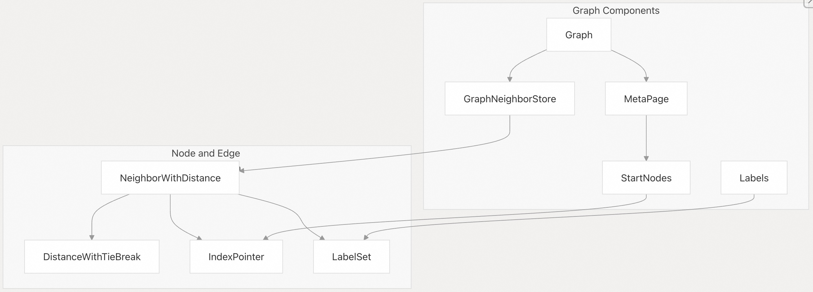
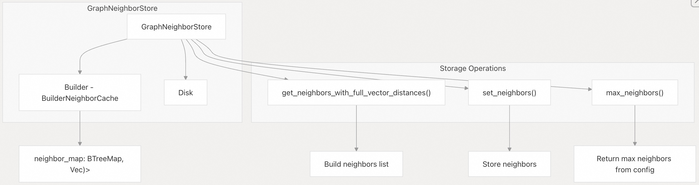
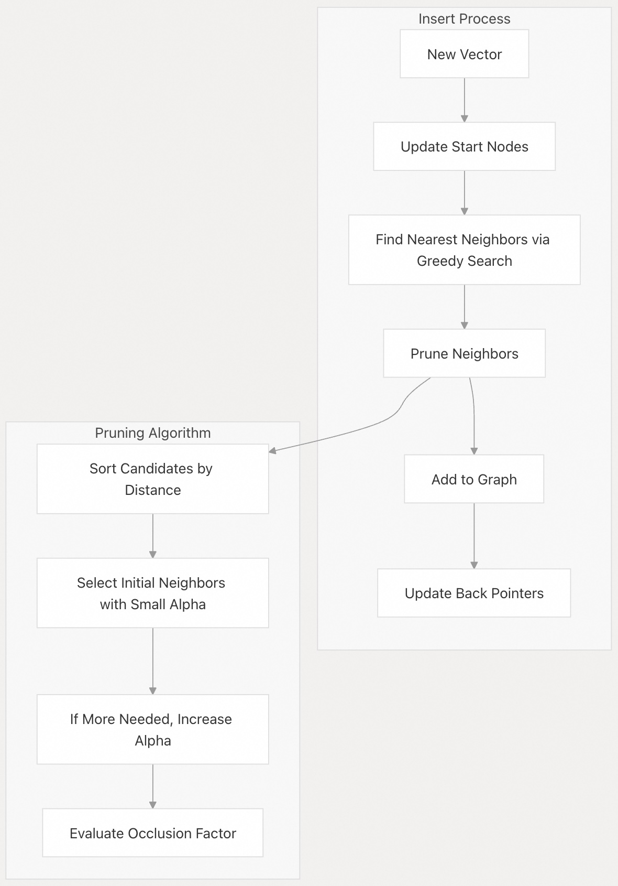
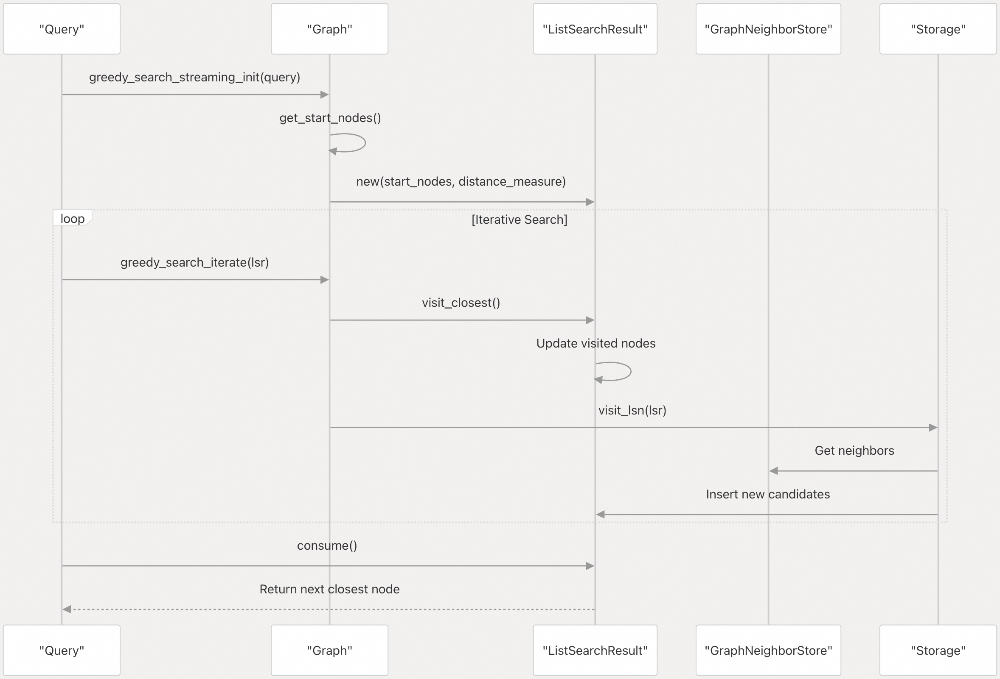
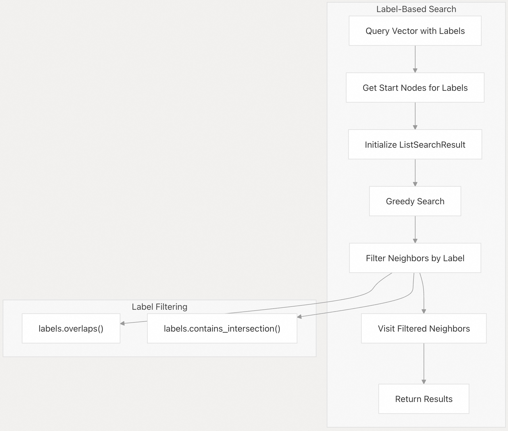

## pgvectorscale 源码学习: 5.1 图结构 (Graph Structure) 与 邻居管理 (Neighbor Management)  
                  
### 作者                  
digoal                  
                  
### 日期                  
2025-11-11                  
                  
### 标签                  
pgvectorscale , 向量数据库 , DiskANN , StreamingDiskANN , 源码学习                  
                  
----                  
                  
## 背景     
本文解释了 `pgvectorscale` 中用于在**近似最近邻** (ANN, Approximate Nearest Neighbor) 搜索期间导航向量空间的**图数据结构** (graph data structure)。图结构是决定系统搜索性能和准确性的**核心组件** (core component)。  
  
## 概述 (Overview)  
  
`pgvectorscale` 中的图结构受到微软 **DiskANN** 算法的启发，实现了一个**可导航小世界图** (navigable small-world graph)，其中每个向量都被表示为一个**节点** (node)，并连接到其**最近邻居** (nearest neighbors)。这种设计使得在**相似性搜索** (similarity searches) 期间能够高效地遍历向量空间。  
  
  
  
**来源 (Sources):**  
[`pgvectorscale/src/access_method/graph.rs` 180-193](https://github.com/timescale/pgvectorscale/blob/36271fa5/pgvectorscale/src/access_method/graph.rs#L180-L193)  
[`pgvectorscale/src/access_method/neighbor_with_distance.rs` 97-128](https://github.com/timescale/pgvectorscale/blob/36271fa5/pgvectorscale/src/access_method/neighbor_with_distance.rs#L97-L128)  
[`pgvectorscale/src/access_method/labels.rs` 15-17](https://github.com/timescale/pgvectorscale/blob/36271fa5/pgvectorscale/src/access_method/labels.rs#L15-L17)  
[`pgvectorscale/src/access_method/start_nodes.rs` 14-22](https://github.com/timescale/pgvectorscale/blob/36271fa5/pgvectorscale/src/access_method/start_nodes.rs#L14-L22)  
  
## 图组件 (Graph Components)  
  
该图由以下关键组件组成：  
  
1.  **节点 (Nodes)**：每个节点代表数据库中的一个向量，由一个 **`IndexPointer`** (索引指针) 标识。  
2.  **边 (Edges)**：节点之间的连接代表**相似性关系** (similarity relationships)，以**距离** (distance) 作为权重。  
3.  **起始节点 (Start Nodes)**：搜索期间图遍历的**入口点** (Entry points)。  
4.  **标签 (Labels)**：与节点关联的**可选元数据** (optional metadata)，用于搜索**过滤** (filtering)。  
  
### 图结构实现 (Graph Structure Implementation)  
  
图的核心是在 **`Graph`** **结构体** (struct) 中实现的，它维护着：  
  
  * 一个用于管理连接信息的 **`GraphNeighborStore`** (图邻居存储)。  
  * 对存储配置参数的 **`MetaPage`** (元数据页) 的引用。  
  
```  
struct Graph<'a> {  
    neighbor_store: GraphNeighborStore,  
    meta_page: &'a mut MetaPage,  
}  
```  
  
**来源 (Sources):**  
[`pgvectorscale/src/access_method/graph.rs` 180-183](https://github.com/timescale/pgvectorscale/blob/36271fa5/pgvectorscale/src/access_method/graph.rs#L180-L183)  
  
### 邻居表示 (Neighbor Representation)  
  
图中的邻居由 **`NeighborWithDistance`** (带距离的邻居) 结构体表示：  
  
```  
struct NeighborWithDistance {  
    index_pointer: IndexPointer,  
    distance: DistanceWithTieBreak,  
    labels: Option<LabelSet>,  
}  
```  
  
**`DistanceWithTieBreak`** (带平局打破的距离) 结构体确保在比较距离相同的向量时**排序一致** (consistent ordering)：  
  
```  
struct DistanceWithTieBreak {  
    distance: Distance,  
    from: IndexPointer,  
    to: IndexPointer,  
    distance_tie_break: OnceCell<usize>,  
}  
```  
  
**来源 (Sources):**  
[`pgvectorscale/src/access_method/neighbor_with_distance.rs` 97-102](https://github.com/timescale/pgvectorscale/blob/36271fa5/pgvectorscale/src/access_method/neighbor_with_distance.rs#L97-L102)  
[`pgvectorscale/src/access_method/neighbor_with_distance.rs` 11-17](https://github.com/timescale/pgvectorscale/blob/36271fa5/pgvectorscale/src/access_method/neighbor_with_distance.rs#L11-L17)  
  
### 节点存储机制 (Node Storage Mechanisms)  
  
**`GraphNeighborStore`** **枚举** (enum) 支持两种存储机制：  
  
1.  **`Builder` (构建器)**：在**索引构建** (index construction) 期间使用的**内存中** (in-memory) 表示。  
2.  **`Disk` (磁盘)**：在**查询执行** (query execution) 期间用于存储和检索节点的**持久化** (persistent) 表示。  
  
  
  
**来源 (Sources):**  
[`pgvectorscale/src/access_method/graph_neighbor_store.rs` 83-135](https://github.com/timescale/pgvectorscale/blob/36271fa5/pgvectorscale/src/access_method/graph_neighbor_store.rs#L83-L135)  
  
## 图构建 (Graph Construction)  
  
图结构在**索引创建** (index creation) 期间**增量构建** (built incrementally)，并随着向量的插入、更新或删除而修改。  
  
### 节点插入 (Node Insertion)  
  
当一个新向量被插入到图中时：  
  
1.  系统使用**贪婪搜索** (greedy search) 识别其**最近邻居** (nearest neighbors)。  
2.  **邻居被剪枝** (Neighbors are pruned) 以维持**平衡的图结构** (balanced graph structure)。  
3.  **反向指针** (Back pointers) 被更新以确保**双向连接** (bidirectional connectivity)。  
4.  如果向量带有**标签** (labels)，它可能会被添加到**特定标签的起始节点** (label-specific start nodes)。  
  
  
  
**来源 (Sources):**  
[`pgvectorscale/src/access_method/graph.rs` 641-738](https://github.com/timescale/pgvectorscale/blob/36271fa5/pgvectorscale/src/access_method/graph.rs#L641-L738)  
  
### 邻居剪枝 (Neighbor Pruning)  
  
构建高效图的关键方面是**邻居剪枝算法** (neighbor pruning algorithm)，它确保：  
  
1.  每个节点只有**有限数量的连接** (limited number of connections)（由 `num_neighbors` 参数控制）。  
2.  连接**倾向于** (favor) 那些尚未通过其他路径**良好连接** (well-connected) 的节点。  
3.  该图保持 **“小世界”特性**  (small-world properties)，从而实现高效导航。  
  
剪枝使用一种基于 **“遮蔽”**  (occlusion) 的技术——如果一个节点**更接近** (closer to) 一个**现有邻居** (existing neighbor) 而不是正在构建的节点，则该节点被“遮蔽”。  
  
```  
function prune_neighbors(candidates):  
    sort candidates by distance  
    results = []  
    max_factors = [0.0] * candidates.length  
      
    alpha = 1.0  
    while alpha <= max_alpha and results.length < num_neighbors:  
        for (i, neighbor) in candidates.enumerated():  
            if max_factors[i] > alpha:  
                continue  
                  
            max_factors[i] = MAX  
            results.add(neighbor)  
              
            for (j, candidate) in candidates.enumerated().skip(i+1):  
                if max_factors[j] > max_alpha:  
                    continue  
                      
                distance_i_j = distance between neighbor and candidate  
                distance_p_j = distance between point and candidate  
                  
                factor = distance_p_j / distance_i_j  
                max_factors[j] = max(max_factors[j], factor)  
              
        alpha *= 1.2  
          
    return results  
```  
  
**来源 (Sources):**  
[`pgvectorscale/src/access_method/graph.rs` 380-479](https://github.com/timescale/pgvectorscale/blob/36271fa5/pgvectorscale/src/access_method/graph.rs#L380-L479)  
  
## 图导航 (Graph Navigation)  
  
图通过**贪婪搜索算法** (greedy search algorithm) 进行导航，该算法从特定的**入口点** (entry points) 开始，并迭代地访问**最近的节点** (closest nodes)，直到达到**终止条件** (termination condition)。  
  
### 起始节点 (Start Nodes)  
  
**起始节点** (Start nodes) 为搜索操作提供了**图的入口点** (entry points into the graph)：  
  
  * 对于**无标签搜索** (unlabeled searches)，使用**默认起始节点** (default start node)。  
  * 对于**有标签搜索** (labeled searches)，使用**每个相关标签的特定起始节点** (specific start nodes for each relevant label)。  
  
```  
struct StartNodes {  
    default_node: ItemPointer,  
    labeled_nodes: BTreeMap<Label, ItemPointer>,  
}  
```  
  
这种结构能够通过从与**查询标签** (query labels) 相关的节点开始，在搜索期间实现**高效过滤** (efficient filtering)。  
  
**来源 (Sources):**  
[`pgvectorscale/src/access_method/start_nodes.rs` 14-22](https://github.com/timescale/pgvectorscale/blob/36271fa5/pgvectorscale/src/access_method/start_nodes.rs#L14-L22)  
  
### 搜索过程 (Search Process)  
  
搜索过程使用一种**流式方法** (streaming approach)，它：  
  
1.  使用**适当的起始节点** (appropriate start nodes) 进行**初始化** (initializes)。  
2.  维护一个按距离排序的**候选者优先级队列** (priority queue of candidates)。  
3.  迭代地访问**最近的未访问节点** (closest unvisited nodes)。  
4.  按与查询的**相似性顺序** (order of similarity) 返回结果。  
  
  
  
**来源 (Sources):**  
[`pgvectorscale/src/access_method/graph.rs` 324-373](https://github.com/timescale/pgvectorscale/blob/36271fa5/pgvectorscale/src/access_method/graph.rs#L324-L373)  
  
## 基于标签的过滤 (Label-Based Filtering)  
  
`pgvectorscale` 的关键特性之一是能够通过**标签** (labels) 将**向量相似性搜索** (vector similarity search) 与**元数据过滤** (metadata filtering) 结合起来。  
  
### 标签表示 (Label Representation)  
  
**标签** (Labels) 存储为一个**有序的 `i16` 值数组** (sorted array of `i16` values)：  
  
```  
struct LabelSet {  
    labels: Vec<Label>,  // where Label is i16  
}  
```  
  
**来源 (Sources):**  
[`pgvectorscale/src/access_method/labels.rs` 15-20](https://github.com/timescale/pgvectorscale/blob/36271fa5/pgvectorscale/src/access_method/labels.rs#L15-L20)  
  
### 标签过滤机制 (Label Filtering Mechanism)  
  
在带有**标签过滤器** (label filters) 的搜索期间：  
  
1.  系统选择与**查询标签** (query labels) 关联的**起始节点** (start nodes)。  
2.  **邻居** (Neighbors) **仅在**它们的标签与查询标签**重叠** (overlap) 时才被考虑。  
3.  **`contains_intersection` 方法** (method) 用于确定一个节点是否应包含在搜索中。  
  
  
  
标签过滤在**剪枝搜索空间** (pruning the search space) 方面起着关键作用，尤其是在使用 **SQL `&&` 运算符** (SQL `&&` operator) 按其关联标签过滤向量时。  
  
**来源 (Sources):**  
[`pgvectorscale/src/access_method/labels.rs` 81-109](https://github.com/timescale/pgvectorscale/blob/36271fa5/pgvectorscale/src/access_method/labels.rs#L81-L109)  
[`pgvectorscale/src/access_method/graph.rs` 324-347](https://github.com/timescale/pgvectorscale/blob/36271fa5/pgvectorscale/src/access_method/graph.rs#L324-L347)  
[`pgvectorscale/src/access_method/label_filtering_tests.rs` 112-169](https://github.com/timescale/pgvectorscale/blob/36271fa5/pgvectorscale/src/access_method/label_filtering_tests.rs#L112-L169)  
  
## 性能考量 (Performance Considerations)  
  
**图结构** (Graph structure) 影响着**搜索性能** (search performance) 和**召回率** (recall)：  
  
1.  **邻居数量 (Number of Neighbors)**：每个节点更多的连接**提高了召回率** (improves recall)，但**增加了内存使用** (increases memory usage) 并可能**减慢搜索速度** (slow down searches)。  
2.  **Alpha 参数 (Alpha Parameter)**：控制**图连接性** (graph connectivity) 和**搜索效率** (search efficiency) 之间的**权衡** (trade-off)。  
3.  **搜索列表大小 (Search List Size)**：决定在搜索期间**访问多少节点** (how many nodes are visited)，影响**召回率-速度的权衡** (recall-speed tradeoff)。  
4.  **标签索引 (Label Indexing)**：使用**带标签的起始节点** (labeled start nodes) 可以实现**高效过滤** (efficient filtering)，但**增加了图的复杂性** (adds complexity to the graph)。  
  
系统实施了**仔细的剪枝** (careful pruning) 和**邻居选择** (neighbor selection)，以维持这些因素之间的平衡。  
  
**来源 (Sources):**  
[`pgvectorscale/src/access_method/graph.rs` 380-479](https://github.com/timescale/pgvectorscale/blob/36271fa5/pgvectorscale/src/access_method/graph.rs#L380-L479)  
  
## 与 PostgreSQL 的集成 (Integration with PostgreSQL)  
  
**图结构** (Graph structure) 是 **PostgreSQL 访问方法** (PostgreSQL access method) 实现的一部分：  
  
1.  图存储在 **PostgreSQL 索引页** (PostgreSQL index pages) 内。  
2.  **`IndexPointer` 类型** (type) 映射到 **PostgreSQL 元组标识符** (PostgreSQL tuple identifiers)。  
3.  **`Graph` 类** (class) 提供了在**索引构建** (index building)、**扫描** (scanning)、**插入** (insertion) 和**清理** (vacuuming) 操作期间使用的方法。  
  
这种**紧密集成** (tight integration) 使得可以直接在 **PostgreSQL** 内部进行**高效的向量相似性搜索** (efficient vector similarity searches)，同时利用 **PostgreSQL 现有的存储和事务管理能力** (existing storage and transaction management capabilities)。  
  
**来源 (Sources):**  
[`pgvectorscale/src/access_method/graph.rs` 641-738](https://github.com/timescale/pgvectorscale/blob/36271fa5/pgvectorscale/src/access_method/graph.rs#L641-L738)  
  
# 附录1: 举例解释alpha在剪枝中的应用  
`alpha` 参数在剪枝算法中的应用。这个问题涉及 `pgvectorscale/src/access_method/graph/mod.rs` 中的 `prune_neighbors` 函数。   
  
## Alpha 参数的作用  
  
`alpha` 是 StreamingDiskANN 算法中的一个关键参数, 用于控制邻居剪枝的严格程度。它的默认值是 1.2, 可以通过 `max_alpha` 参数配置, 范围在 1.0 到 5.0 之间。   
  
## 剪枝算法的工作原理  
  
剪枝算法使用渐进式的 alpha 值来选择邻居:    
  
1. **初始阶段** (alpha = 1.0): 首先尝试用较小的 alpha 值添加邻居  
2. **渐进增加**: 如果还有空间, alpha 每次乘以 1.2 继续循环  
3. **终止条件**: 直到 alpha 超过 `max_alpha` 或达到所需的邻居数量   
  
## 具体例子  
  
假设我们要为一个节点选择最多 50 个邻居, 有 100 个候选节点:  
  
**第一轮 (alpha = 1.0)**:  
- 算法遍历已排序的候选列表    
- 对于每个候选节点, 计算它与已选邻居之间的 `factor` 值    
- 如果 `max_factors[i] <= 1.0`, 该候选被接受   
- 被接受的节点标记为 `max_factors[i] = f64::MAX` 防止重复考虑   
  
**第二轮 (alpha = 1.2)**:  
- 如果第一轮后还没有 50 个邻居,继续  
- 现在接受 `max_factors[i] <= 1.2` 的候选  
- 这些是与已选邻居距离稍远的节点  
  
**后续轮次**:  
- alpha 继续增长: 1.44, 1.728, ...  
- 每轮放宽标准, 接受更多候选  
  
## Factor 的含义  
  
`factor` 衡量候选节点是否更接近已选邻居而非目标点:    
  
- **factor < 1.0**: 候选节点更接近目标点(优先选择)  
- **factor > 1.0**: 候选节点更接近某个已选邻居(可能被排除)  
- **alpha 阈值**: 只有当 `factor <= alpha` 时才接受候选  
  
## 实际调用  
  
这个剪枝逻辑在两个地方被调用:  
  
1. **索引构建时**: 当节点邻居数超过限制时    
2. **索引完成时**: 最终清理所有节点的邻居列表    
  
## Notes  
  
更高的 `max_alpha` 值会产生更高质量的图结构, 但会增加索引构建时间。这是因为更高的 alpha 允许保留更多样化的邻居, 即使它们与已选邻居的距离较近, 从而提高图的连通性和搜索质量。   
  
# 附录2: factor计算来自节点和目标点的距离? alpha来自跳数或轮次?  
  
**部分正确**, 下面澄清这两个概念:   
  
### Factor 计算  
  
**正确**。Factor 确实来自节点间的距离计算, 具体公式为:   
  
```  
factor = 候选节点到目标点的距离 / 候选节点到已选邻居的距离  
```  
  
这涉及**三个实体**的距离关系:   
1. 候选节点到目标点(正在为其选择邻居的节点)的距离  
2. 候选节点到已选邻居的距离    
  
Factor 值的含义:   
- `factor < 1.0`: 候选节点更接近目标点 → 优质连接  
- `factor > 1.0`: 候选节点更接近已选邻居 → 可能冗余  
  
### Alpha 来源  
  
**不完全正确**。 Alpha **不是**来自跳数, 而是来自**剪枝算法的迭代轮次**。   
  
Alpha 的递增机制:    
1. **初始值**: `alpha = 1.0`(最严格标准)  
2. **循环条件**: `while alpha <= max_alpha && results.len() < num_neighbors`  
3. **每轮递增**: `alpha *= 1.2`    
  
这是一个**渐进式放宽标准**的过程:   
- 第1轮: alpha=1.0,只接受 factor≤1.0 的候选  
- 第2轮: alpha=1.2,接受 factor≤1.2 的候选    
- 第3轮: alpha=1.44,继续放宽...  
- 直到达到 `max_alpha`(默认1.2,可配置1.0-5.0)    
  
## Notes  
  
Alpha 与图遍历的"跳数"无关, 它纯粹是剪枝算法内部的迭代控制参数。 每轮迭代都会遍历所有候选节点, 通过逐步提高 alpha 阈值来决定是否接受更多邻居。 这种设计确保优先选择最优质的邻居, 然后根据需要逐步补充次优选择。   
       
# 附录3: 在**搜索时**`max_alpha`是否起作用? 以及起什么作用?   
  
**不,`max_alpha`在搜索时不起作用。**  它只在**索引构建时**使用。   
  
### `max_alpha`的作用  
  
`max_alpha`是邻居剪枝算法中的alpha参数。  它在索引构建期间用于控制图的质量: 更高的值会提高图质量, 但会使索引构建变慢。   
  
具体来说,`max_alpha`在`prune_neighbors`函数中使用, 该函数在构建图时修剪邻居列表。 剪枝算法从`alpha=1.0`开始, 逐步增加到`max_alpha`, 每次迭代时选择满足条件的候选邻居。    
  
### 构建时的使用  
  
在索引构建过程中, `max_alpha`通过以下路径使用:  
  
1. 从索引选项中读取(默认值为1.2)    
2. 存储在`MetaPage`中    
3. 在`add_neighbors`中调用`prune_neighbors`时传递    
4. 在`finalize_index_build`中最终剪枝时使用    
  
### 查询时参数  
  
查询时可以调整的参数是:  
- `diskann.query_search_list_size`: 图搜索期间考虑的额外候选数量    
- `diskann.query_rescore`: 重新评分的元素数量    
  
## Notes  
  
`max_alpha`是一个**构建时参数**, 在创建索引时设置并存储在元数据中。 搜索操作使用已构建的图结构, 不会重新应用剪枝逻辑, 因此`max_alpha`在查询时不起作用。   
  
    
#### [PolarDB 学习图谱](https://www.aliyun.com/database/openpolardb/activity "8642f60e04ed0c814bf9cb9677976bd4")
  
  
#### [PostgreSQL 解决方案集合](../201706/20170601_02.md "40cff096e9ed7122c512b35d8561d9c8")
  
  
#### [德哥 / digoal's Github - 公益是一辈子的事.](https://github.com/digoal/blog/blob/master/README.md "22709685feb7cab07d30f30387f0a9ae")
  
  
#### [About 德哥](https://github.com/digoal/blog/blob/master/me/readme.md "a37735981e7704886ffd590565582dd0")
  
  

  
