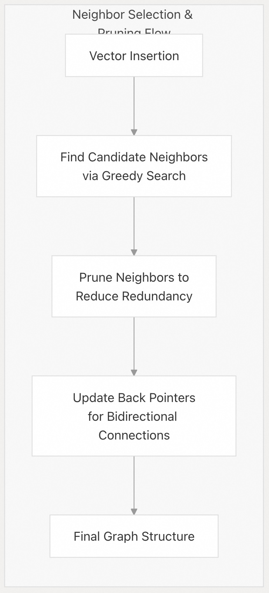
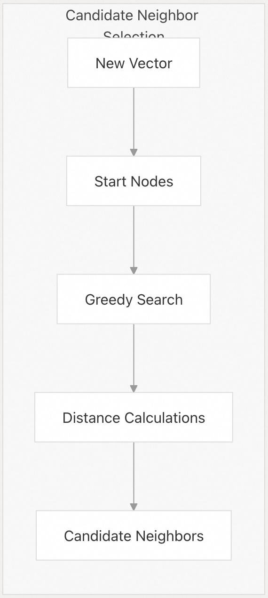
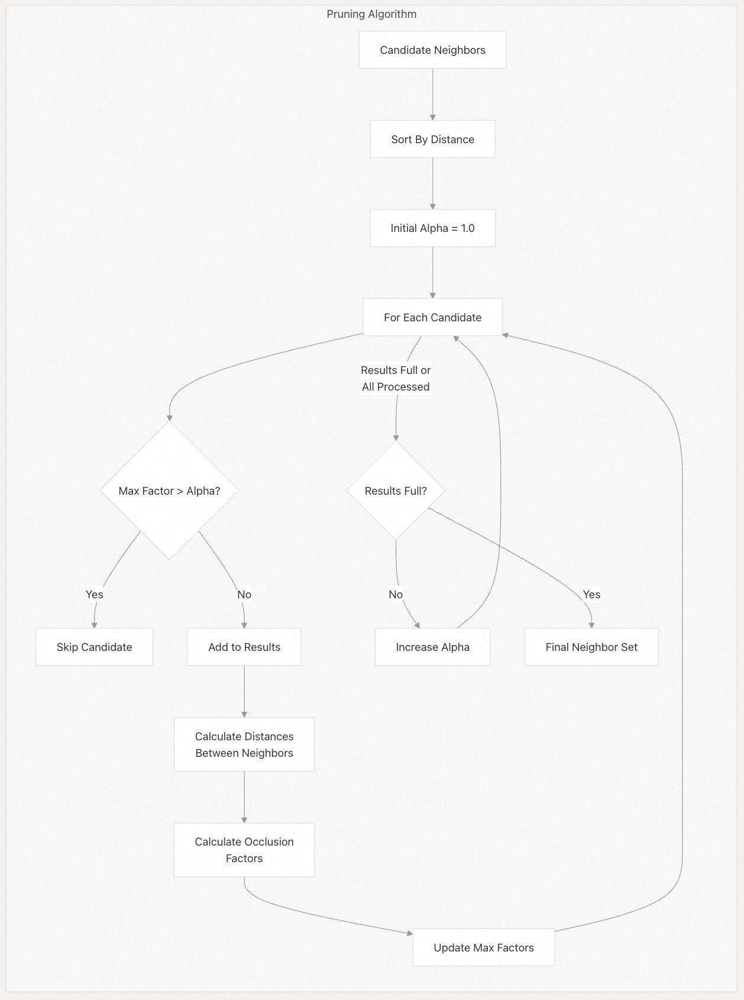
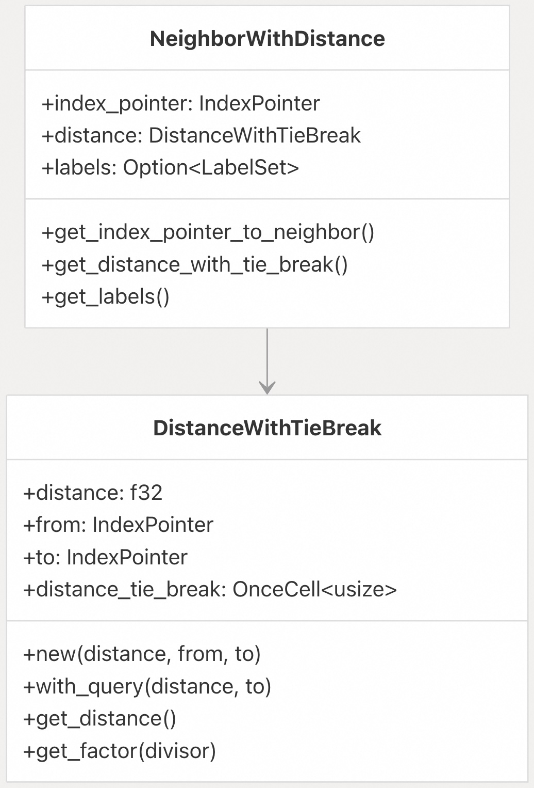
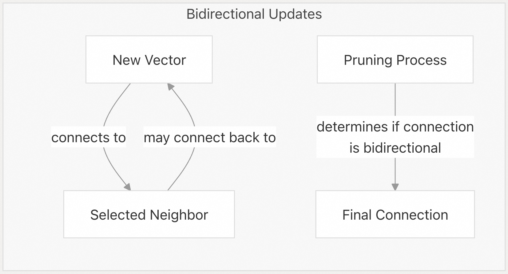
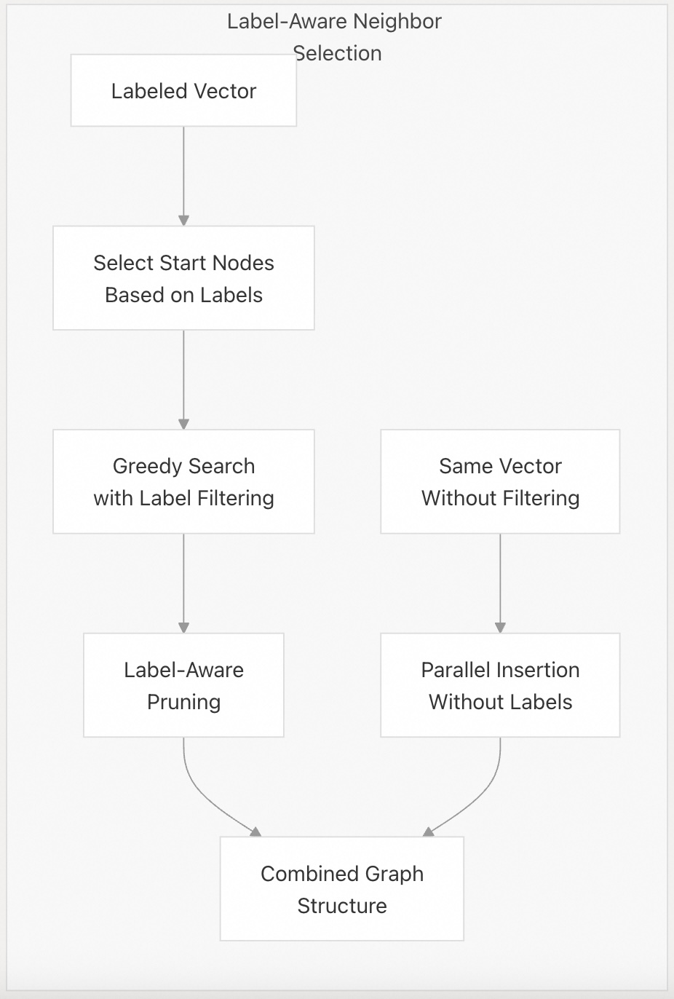
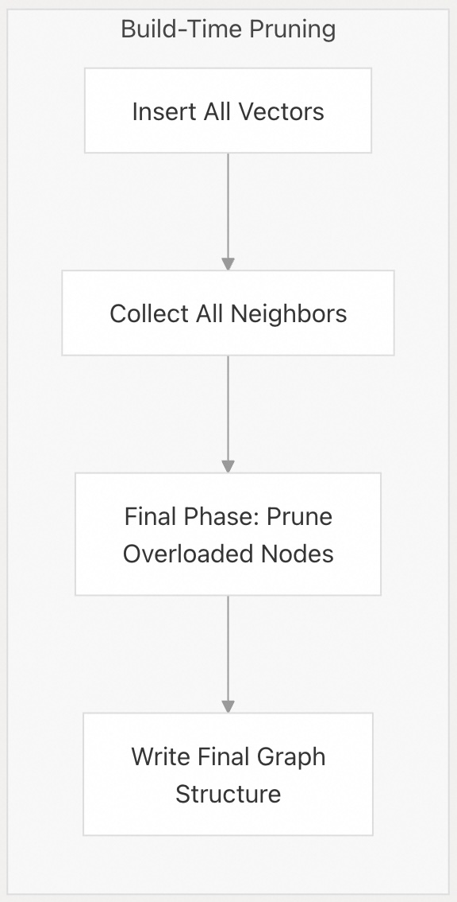

## pgvectorscale 源码学习: 5.2 邻居选择与剪枝 (Neighbor Selection and Pruning)  
                    
### 作者                    
digoal                    
                    
### 日期                    
2025-11-11                    
                    
### 标签                    
pgvectorscale , 向量数据库 , DiskANN , StreamingDiskANN , 源码学习                    
                    
----                    
                    
## 背景       
本文解释了 `pgvectorscale` 如何在其**基于图的向量索引** (`graph-based vector index`) 中选择和**剪枝** (`prunes`) **邻居** (`neighbors`)。高效的**邻居选择与剪枝** (`Neighbor Selection and Pruning`) 是直接影响**搜索准确性** (`search accuracy`) 和**性能** (`performance`) 的关键组成部分。此处描述的算法负责构建和维护高质量的**图结构** (`graph structure`)，从而实现快速的**近似最近邻搜索** (`approximate nearest neighbor search`)。  
  
## 概述 (Overview)  
  
`pgvectorscale` 中的**图结构** (`graph structure`) 将**向量** (`vectors`) 表示为**节点** (`nodes`)，将相似性关系表示为**边** (`edges`)。对于每个**节点** (`node`)，系统必须确定哪些其他**节点** (`nodes`) 应该成为它的**邻居** (`neighbors`)。这不是一个小问题 —— 选择过多的**邻居** (`neighbors`) 会减慢搜索速度，而选择过少则会降低**准确性** (`accuracy`)。此外，**邻居选择** (`neighbor selection`) 的质量直接影响搜索算法导航图的效率。  
  
  
  
来源:  
[`pgvectorscale/src/access_method/graph.rs` 641-738](https://github.com/timescale/pgvectorscale/blob/36271fa5/pgvectorscale/src/access_method/graph.rs#L641-L738)  
[`pgvectorscale/src/access_method/build.rs` 642-671](https://github.com/timescale/pgvectorscale/blob/36271fa5/pgvectorscale/src/access_method/build.rs#L642-L671)  
  
## 候选邻居选择 (Candidate Neighbor Selection)  
  
当一个新**向量** (`vector`) 插入到索引中时，`pgvectorscale` 首先通过执行**贪婪搜索** (`greedy search`) 来查找**候选邻居** (`candidate neighbors`)。此搜索从图中的**入口点** (`entry points`) 开始，并导航到与正在插入的**向量** (`vector`) 相似的**向量** (`vectors`)。  
  
  
  
来源:  
[`pgvectorscale/src/access_method/graph.rs` 279-320](https://github.com/timescale/pgvectorscale/blob/36271fa5/pgvectorscale/src/access_method/graph.rs#L279-L320)  
  
**候选选择** (`candidate selection`) 过程:  
  
1.  从图中指定的**入口点** (`entry points`) 开始  
2.  **贪婪地导航** (`Greedily navigates`) 到最接近查询**向量** (`vector`) 的**向量** (`vectors`)  
3.  收集一组与新**向量** (`vector`) 最相似的**候选邻居** (`candidate neighbors`)  
4.  如果**向量** (`vector`) 具有关联的**标签** (`labels`)，可能会应用**标签过滤** (`label filtering`)  
  
该实现可以在 `Graph` 结构的 `greedy_search_for_build` 方法中找到，该方法返回一组 `NeighborWithDistance` 对象。  
  
来源:  
[`pgvectorscale/src/access_method/graph.rs` 279-320](https://github.com/timescale/pgvectorscale/blob/36271fa5/pgvectorscale/src/access_method/graph.rs#L279-L320)  
  
## 邻居剪枝算法 (Neighbor Pruning Algorithm)  
  
在收集**候选邻居** (`candidate neighbors`) 后，`pgvectorscale` 会应用**剪枝算法** (`pruning algorithm`) 来选择最终的**邻居** (`neighbors`) 集合。这是决定**图结构** (`graph structure`) 质量的关键一步。  
  
  
  
来源:  
[`pgvectorscale/src/access_method/graph.rs` 380-479](https://github.com/timescale/pgvectorscale/blob/36271fa5/pgvectorscale/src/access_method/graph.rs#L380-L479)  
  
**剪枝算法** (`pruning algorithm`) 负责选择一个候选子集，以形成最佳**图结构** (`graph structure`)。它的工作原理如下:  
  
1.  **候选排序** (`Sort candidates`): **候选** (`Candidates`) 按到新**向量** (`vector`) 的**距离** (`distance`) 进行排序。  
2.  **迭代剪枝** (`Iterative pruning`): 从 `alpha = 1.0` 开始，并逐渐增加到 `max_alpha`。  
3.  **遮挡检测** (`Occlusion detection`): 对于每个**候选** (`candidate`)，计算它被已选择的**邻居** (`neighbors`) “**遮挡**” (`occluded`) 的程度。  
4.  **因子计算** (`Factor calculation`): 一个**因子** (`factor`) 表示一个**候选** (`candidate`) 距离一个现有**邻居** (`existing neighbor`) 比距离该点本身近多少。  
5.  **自适应选择** (`Adaptive selection`): 优先选择具有较低**因子** (`factors`) 的**节点** (`Nodes`)，并且 `alpha` 会逐渐增加，以便在需要时包含更多的**候选** (`candidates`)。  
  
该算法的关键在于它偏爱在**向量空间** (`vector space`) 中提供独特路径的**邻居** (`neighbors`)，从而减少**冗余连接** (`redundant connections`)。  
  
### 因子计算 (Factor Calculation)  
  
**因子计算** (`Factor calculation`) 是**剪枝算法** (`pruning algorithm`) 的一个重要组成部分:  
  
```  
factor = distance(candidate, point) / distance(candidate, existing_neighbor)  
```  
  
高**因子** (`factor`) 表明**候选** (`candidate`) 距离现有**邻居** (`existing neighbor`) 比距离该点本身近得多，因此作为直接**邻居** (`neighbor`) 是**冗余** (`redundant`) 的。  
  
**表格: 因子值 (Factor Values) 的解释**  
  
| 因子值 (`Factor Value`) | 解释 (`Interpretation`) | 决策 (`Decision`) |  
| :--- | :--- | :--- |  
| \< 1.0 | 候选者提供了一条独特路径 (`unique pathway`) | 保留 (第一轮) |  
| 1.0 到 `max_alpha` | 中度**遮挡** (`Moderate occlusion`) | 可能会保留 (后续轮次) |  
| \> `max_alpha` | 严重**遮挡** (`Severe occlusion`) | 丢弃 |  
  
`max_alpha` **参数** (`parameter`) 控制**剪枝** (`pruning`) 的**激进程度** (`aggressiveness`)。较高的值会保留更多的**连接** (`connections`)，但会增加**索引大小** (`index size`)。  
  
来源:  
[`pgvectorscale/src/access_method/graph.rs` 380-479](https://github.com/timescale/pgvectorscale/blob/36271fa5/pgvectorscale/src/access_method/graph.rs#L380-L479)  
[`pgvectorscale/src/access_method/neighbor_with_distance.rs` 55-65](https://github.com/timescale/pgvectorscale/blob/36271fa5/pgvectorscale/src/access_method/neighbor_with_distance.rs#L55-L65)  
  
## 带平局决胜的距离计算 (Distance Calculation with Tie Breaking)  
  
该系统使用一个专门的 `DistanceWithTieBreak` 结构来处理多个**向量** (`vectors`) 具有相同或非常相似的**距离** (`distances`) 的情况:  
  
  
  
来源:  
[`pgvectorscale/src/access_method/neighbor_with_distance.rs` 1-155](https://github.com/timescale/pgvectorscale/blob/36271fa5/pgvectorscale/src/access_method/neighbor_with_distance.rs#L1-L155)  
  
这种**平局决胜机制** (`tie-breaking mechanism`) 通过使用索引中的物理位置作为辅助排序标准，确保了当多个**向量** (`vectors`) 具有相同**距离** (`distance`) 时的**确定性行为** (`deterministic behavior`)。该实现包括:  
  
1.  **平局决胜值** (`tie-break values`) 的**惰性计算** (`Lazy calculation`) 以优化**性能** (`performance`)  
2.  对**零距离** (`zero distances`) 的特殊处理  
3.  用于**剪枝算法** (`pruning algorithm`) 的**因子计算** (`Factor calculation`) 逻辑  
  
来源:  
[`pgvectorscale/src/access_method/neighbor_with_distance.rs` 12-65](https://github.com/timescale/pgvectorscale/blob/36271fa5/pgvectorscale/src/access_method/neighbor_with_distance.rs#L12-L65)  
  
## 双向更新 (Bidirectional Updates)  
  
在为一个新**向量** (`vector`) 选择最终的**邻居** (`neighbors`) 集合后，`pgvectorscale` 会更新**反向指针** (`back pointers`) 以确保**双向连接** (`bidirectional connections`)。此步骤对于保持图的**可导航性** (`navigability`) 非常重要。  
  
  
  
来源:  
[`pgvectorscale/src/access_method/graph.rs` 688-717](https://github.com/timescale/pgvectorscale/blob/36271fa5/pgvectorscale/src/access_method/graph.rs#L688-L717)  
  
该过程包括:  
  
1.  对于新**向量** (`vector`) 的每个选定**邻居** (`neighbor`)，考虑将新**向量** (`vector`) 添加为一个**邻居** (`neighbor`)  
2.  应用相同的**剪枝** (`pruning`) 过程以确保高质量的**连接** (`connections`)  
3.  跟踪新**向量** (`vector`) 是否在至少一个情况下被接受为**邻居** (`neighbor`)  
4.  如果**向量** (`vector`) 成为一个 "**孤儿**" (`orphan`) (没有**双向连接** (`bidirectional connections`))，则发出警告  
  
此**双向更新** (`bidirectional update`) 过程在 `Graph` 结构的 `update_back_pointer` 方法中实现。  
  
来源:  
[`pgvectorscale/src/access_method/graph.rs` 720-737](https://github.com/timescale/pgvectorscale/blob/36271fa5/pgvectorscale/src/access_method/graph.rs#L720-L737)  
  
## 标签过滤优化 (Optimization with Label Filtering)  
  
当使用**带标签的向量** (`labeled vectors`) 时，**邻居选择** (`neighbor selection`) 和**剪枝** (`pruning`) 过程会结合**标签信息** (`label information`):  
  
  
  
来源:  
[`pgvectorscale/src/access_method/graph.rs` 642-659](https://github.com/timescale/pgvectorscale/blob/36271fa5/pgvectorscale/src/access_method/graph.rs#L642-L659)  
[`pgvectorscale/src/access_method/graph.rs` 434-451](https://github.com/timescale/pgvectorscale/blob/36271fa5/pgvectorscale/src/access_method/graph.rs#L434-L451)  
  
系统对**带标签的向量** (`labeled vectors`) 执行两次插入:  
  
1.  **带标签的插入** (`Labeled insertion`): 使用**标签信息** (`label information`) 来选择起始**节点** (`nodes`) 和过滤**候选** (`candidates`)  
2.  **非过滤插入** (`Non-filtered insertion`): 忽略**标签** (`labels`) 以维护跨**标签边界** (`label boundaries`) 的**连接** (`connectivity`)  
  
在**剪枝** (`pruning`) 期间，算法会在计算**遮挡因子** (`occlusion factors`) 之前检查**邻居** (`neighbors`) 是否共享重要**标签** (`labels`)。这确保了具有匹配**标签** (`labels`) 的**向量** (`vectors`) 即使在其他情况下会被**剪枝** (`pruned`)，也能保持**连接** (`connections`)。  
  
来源:  
[`pgvectorscale/src/access_method/graph.rs` 444-451](https://github.com/timescale/pgvectorscale/blob/36271fa5/pgvectorscale/src/access_method/graph.rs#L444-L451)  
  
## 配置参数 (Configuration Parameters)  
  
**邻居选择** (`neighbor selection`) 和**剪枝** (`pruning`) 行为可以通过几个**配置参数** (`configuration parameters`) 进行调整:  
  
**表格: 关键配置参数 (Key Configuration Parameters)**  
  
| 参数 (`Parameter`) | 描述 (`Description`) | 默认值 (`Default`) | 影响 (`Impact`) |  
| :--- | :--- | :--- | :--- |  
| `num_neighbors` (邻居数) | 每个**节点** (`node`) 的最大**邻居** (`neighbors`) 数量 | 16 | 值越高，**准确性** (`accuracy`) 越高，但搜索速度降低 |  
| `search_list_size` (搜索列表大小) | 搜索期间访问的**节点** (`nodes`) 数量 | 40 | 值越高，**准确性** (`accuracy`) 越高，但插入速度降低 |  
| `max_alpha` (最大 Alpha 值) | **剪枝** (`pruning`) 的最大**因子** (`factor`) | 1.2 | 值越高，创建的**图** (`graphs`) 越密集，**连接** (`connections`) 越多 |  
  
这些**参数** (`parameters`) 允许在以下方面取得平衡:  
  
  * **搜索速度** (`Search speed`) 与**准确性** (`accuracy`)  
  * **索引大小** (`Index size`) 与**搜索质量** (`search quality`)  
  * **构建时间** (`Build time`) 与**搜索性能** (`search performance`)  
  
来源:  
[`pgvectorscale/src/access_method/build.rs` 78-83](https://github.com/timescale/pgvectorscale/blob/36271fa5/pgvectorscale/src/access_method/build.rs#L78-L83)  
  
## 索引构建期间的剪枝 (Pruning During Index Build)  
  
在初始**索引构建** (`index building`) 期间，系统遵循一个略有不同的过程:  
  
1.  首先收集所有**节点** (`nodes`) 的所有**邻居** (`neighbors`)  
2.  在一个单独的阶段，对**邻居** (`neighbors`) 数量超过配置值的**节点** (`nodes`) 执行**剪枝** (`pruning`)  
3.  用其**剪枝** (`pruned`) 后的**邻居列表** (`neighbor lists`) 来确定最终的**节点** (`nodes`)  
  
这种方法优化了**索引构建** (`index building`) 过程，同时仍确保高质量的**连接** (`connections`)。  
  
  
  
来源:  
[`pgvectorscale/src/access_method/build.rs` 360-399](https://github.com/timescale/pgvectorscale/blob/36271fa5/pgvectorscale/src/access_method/build.rs#L360-L399)  
  
## 性能考虑 (Performance Considerations)  
  
**邻居选择** (`neighbor selection`) 和**剪枝算法** (`pruning algorithms`) 显著影响**构建** (`build`) 和**查询性能** (`query performance`):  
  
1.  **构建性能** (`Build performance`): 更激进的**剪枝** (`pruning`) (较低的 `max_alpha`) 减少了**索引构建** (`index building`) 期间的**距离计算** (`distance calculations`) 次数  
2.  **查询性能** (`Query performance`): 更高质量的**连接** (`connections`) (平衡**剪枝** (`pruning`)) 允许搜索算法以更少的**跳数** (`hops`) 找到更好的结果  
3.  **内存使用** (`Memory usage`): 每个**节点** (`node`) 拥有更多的**邻居** (`neighbors`) 会增加**图结构** (`graph structure`) 的大小  
  
在**索引构建** (`index building`) 期间收集的**统计数据** (`Statistics`) 提供了对**剪枝** (`pruning`) 有效性的见解:  
  
```  
When pruned for cleanup: avg neighbors before/after 25/16 of 1000 prunes  
```  
  
这个例子显示，**剪枝** (`pruning`) 将 1000 个**节点** (`nodes`) 的平均**邻居** (`neighbors`) 数量从 25 个减少到 16 个，证明了其在控制**图大小** (`graph size`) 方面的有效性。  
  
来源:  
[`pgvectorscale/src/access_method/build.rs` 416-423](https://github.com/timescale/pgvectorscale/blob/36271fa5/pgvectorscale/src/access_method/build.rs#L416-L423)  
    
# 附录: 关于插入新节点时, 受牵连的相邻节点的边维护问题  
当节点x插入后, 假设y成为了x的邻居节点, 那么原有节点y的连接需要重新维护吗?   
  
如果不重新维护, 随着不断有新节点插入, 节点之间的连接数是不是会越来越多, 甚至冗余?   
  
如果会重新维护y的连接关系, 插入新节点的性能是不是会很差?   
  
如果重新维护连接关系, 有没有可能存在一种情况, 断开与y节点连接的其他节点例如z时, z可能成为孤立节点吗, 当和z相连的节点都断开了时?   
  
还有最后一个问题, 维护连接关系是一级的还是多级的? 例如除了维护与插入连接直接连接的y节点, 会不会也要维护与y连接的z节点它的所有连接关系?  
  
您的问题是关于 pgvectorscale 中 StreamingDiskANN 索引的邻居维护机制。具体来说,当节点 x 插入后,如果 y 成为 x 的邻居,是否需要维护 y 的连接关系。  
  
## 回答  
  
### 1. 是否重新维护 y 的连接?  
  
**是的,会重新维护。**   
  
当节点 x 插入并选择 y 作为邻居后, 代码会通过 `update_back_pointer` 更新 y 的邻居列表, 将 x 添加到 y 的邻居中。   
  
### 2. 是否会导致连接数越来越多?  
  
**不会。** 系统通过剪枝(pruning)机制控制连接数。   
  
`add_neighbors` 方法会检查邻居数量是否超过 `num_neighbors` 限制。如果超过, 会调用 `prune_neighbors` 进行剪枝。   
  
剪枝算法使用 alpha 参数, 优先保留距离更近且不被其他邻居"遮挡"的节点, 确保每个节点的邻居数不超过配置的 `num_neighbors`(默认 50)。   
  
### 3. 插入性能是否会很差?  
  
**性能开销是可控的。**每次插入需要:    
- 执行贪婪搜索找到邻居  
- 更新反向指针(back pointers)  
- 可能触发剪枝操作    
  
代码每 1000 个元组记录一次统计信息, 显示系统会监控距离计算和剪枝的开销。   
  
### 4. 节点 z 是否可能成为孤立节点?  
  
**理论上可能, 但实现中有保护机制。**   
  
代码检查新插入的节点是否至少被一个邻居包含在其邻居列表中(`cnt_contains`)。 如果 `cnt_contains == 0`, 会触发警告, 表明节点可能成为孤儿节点。在测试环境中这会触发断言失败。   
  
这种情况虽然理论上可能发生, 但在实践中非常罕见, 因为剪枝算法会尽量保持图的连通性。   
  
### 5. 维护是一级还是多级的?  
  
**只维护一级连接。**    
  
当插入节点 x 时:  
1. x 选择邻居(包括 y)  
2. 对 x 的每个邻居(如 y), 更新该邻居的邻居列表以包含 x  
3. **不会** 递归更新 y 的邻居(如 z)的连接关系  
  
这是一个局部更新策略, 只影响直接相关的节点, 避免级联更新导致的性能问题。   
  
## Notes  
  
在索引构建的最后阶段, 系统会对所有缓存的邻居关系进行最终的剪枝处理。    
  
这确保了即使在构建过程中邻居数量可能暂时超过限制, 最终写入磁盘的图结构仍然满足 `num_neighbors` 约束。   
    
#### [PolarDB 学习图谱](https://www.aliyun.com/database/openpolardb/activity "8642f60e04ed0c814bf9cb9677976bd4")
  
  
#### [PostgreSQL 解决方案集合](../201706/20170601_02.md "40cff096e9ed7122c512b35d8561d9c8")
  
  
#### [德哥 / digoal's Github - 公益是一辈子的事.](https://github.com/digoal/blog/blob/master/README.md "22709685feb7cab07d30f30387f0a9ae")
  
  
#### [About 德哥](https://github.com/digoal/blog/blob/master/me/readme.md "a37735981e7704886ffd590565582dd0")
  
  

  
