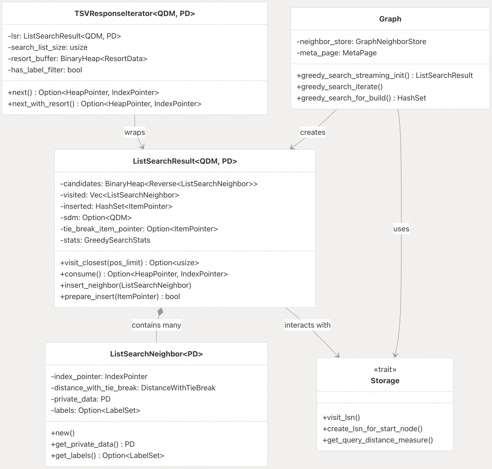
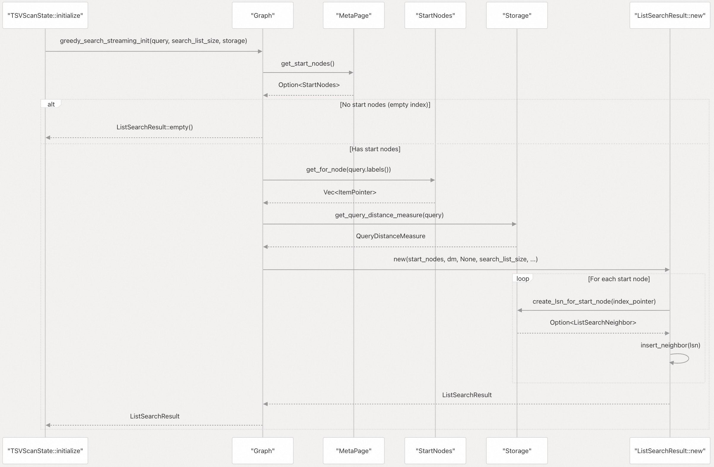
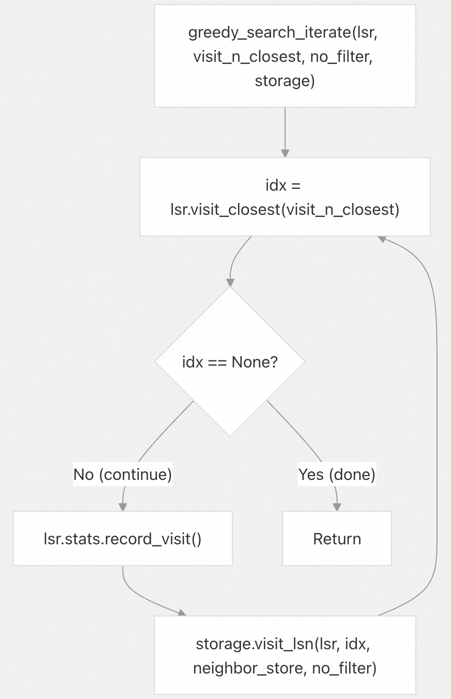
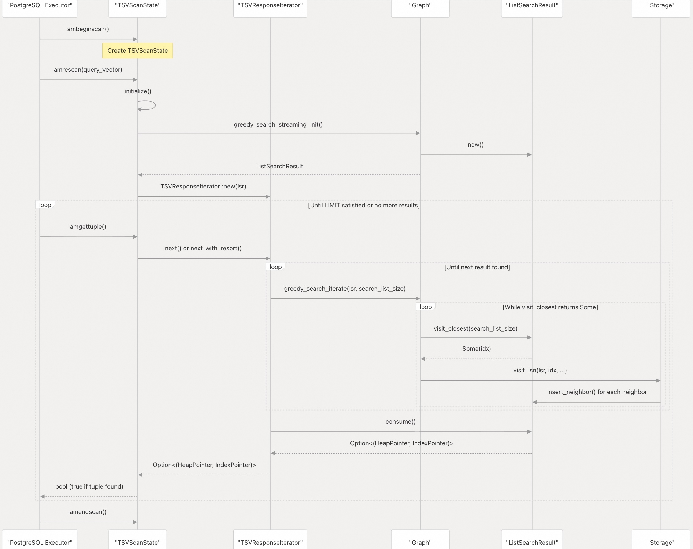

## pgvectorscale 源码学习: 5.3 贪婪搜索算法 (Greedy Search Algorithm)  
                      
### 作者                      
digoal                      
                      
### 日期                      
2025-11-11                      
                      
### 标签                      
pgvectorscale , 向量数据库 , DiskANN , StreamingDiskANN , 源码学习                      
                      
----                      
                      
## 背景         
本文档详细介绍了 `pgvectorscale` 中流式贪婪搜索算法 (`streaming greedy search algorithm`) 的实现，它是用于查找近似最近邻 (`approximate nearest neighbors`) 的核心搜索机制。该算法通过 `ListSearchResult` 结构及其相关方法实现，这些方法管理着一个候选者优先队列 (`priority queue`) 和一个已访问节点 (`visited nodes`) 的排序列表。关于此算法遍历的图结构，请参阅第 5.1 章。关于图构建期间的邻居选择和剪枝 (`neighbor selection and pruning`)，请参阅第 5.2 章。  
  
## 概述 (Overview)  
  
`pgvectorscale` 中的贪婪搜索算法 (`greedy search algorithm`) 实现了基于图的最近邻搜索 (`graph-based nearest neighbor search`) 的流式变体 (`streaming variant`)。与一次性返回所有 K 个结果的单次搜索 (`one-shot search`) 不同，流式实现 (`streaming implementation`) 允许 PostgreSQL 通过连续的 `amgettuple` 调用逐步检索结果。这种设计能够实现高效的 `LIMIT` 子句处理和早期查询终止 (`early query termination`)。  
  
该算法维护着两个主要数据结构：  
  
  * **candidates (候选者)**: 一个 `BinaryHeap<Reverse<ListSearchNeighbor<PD>>>`，存储按距离排序的未访问节点（最小堆，`min-heap`）。  
  * **visited (已访问)**: 一个 `Vec<ListSearchNeighbor<PD>>`，存储按距离排序的已访问节点（即结果）。  
  
**贪婪搜索过程流程 (Greedy Search Process Flow)**  
  
  
  
来源: [`pgvectorscale/src/access_method/graph/mod.rs` 74-185](https://github.com/timescale/pgvectorscale/blob/36271fa5/pgvectorscale/src/access_method/graph/mod.rs#L74-L185) [`pgvectorscale/src/access_method/graph/mod.rs` 331-354](https://github.com/timescale/pgvectorscale/blob/36271fa5/pgvectorscale/src/access_method/graph/mod.rs#L331-L354) [`pgvectorscale/src/access_method/graph/mod.rs` 356-385](https://github.com/timescale/pgvectorscale/blob/36271fa5/pgvectorscale/src/access_method/graph/mod.rs#L356-L385)  
  
## 核心数据结构 (Core Data Structures)  
  
**关键组件 (Key Components)**  
  
  
  
通用参数 `QDM` 和 `PD` 代表来自 `Storage` 特征 (`trait`) 的 `QueryDistanceMeasure` 和 `LSNPrivateData` 关联类型，允许不同的存储实现提供专门的距离计算和节点元数据 (`node metadata`)。  
  
来源: [`pgvectorscale/src/access_method/graph/mod.rs` 22-185](https://github.com/timescale/pgvectorscale/blob/36271fa5/pgvectorscale/src/access_method/graph/mod.rs#L22-L185) [`pgvectorscale/src/access_method/scan.rs` 162-306](https://github.com/timescale/pgvectorscale/blob/36271fa5/pgvectorscale/src/access_method/scan.rs#L162-L306)  
  
## ListSearchResult 结构 (ListSearchResult Structure)  
  
`ListSearchResult<QDM, PD>` 结构是贪婪搜索算法 (`greedy search algorithm`) 的核心状态容器 (`central state container`)。它管理着搜索前沿 (`search frontier`) 并跟踪已访问的节点。  
  
| 字段 (Field) | 类型 (Type) | 目的 (Purpose) |  
| :--- | :--- | :--- |  
| `candidates` | `BinaryHeap<Reverse<ListSearchNeighbor<PD>>>` | 按距离排序的未访问节点最小堆 (`Min-heap`) |  
| `visited` | `Vec<ListSearchNeighbor<PD>>` | 按距离排序的已访问节点（结果）向量 |  
| `inserted` | `HashSet<ItemPointer>` | 用于防止重复插入节点 (`Deduplication set`) |  
| `sdm` | `Option<QDM>` | 来自存储提供者的查询距离度量 (`Query distance measure`) |  
| `tie_break_item_pointer` | `Option<ItemPointer>` | 用于构建时的确定性破除平局 (`deterministic tie-breaking`) |  
| `stats` | `GreedySearchStats` | 已访问节点和距离计算的计数器 |  
  
在堆元素上使用 `Reverse` 包装器创建了一个最小堆（PostgreSQL 的最近邻是最小距离），同时保持了高效的 O(log n) 插入和 O(log n) 弹出操作。  
  
来源: [`pgvectorscale/src/access_method/graph/mod.rs` 74-95](https://github.com/timescale/pgvectorscale/blob/36271fa5/pgvectorscale/src/access_method/graph/mod.rs#L74-L95)  
  
## 搜索初始化 (Search Initialization)  
  
**通过 greedy\_search\_streaming\_init 进行初始化 (Initialization via greedy\_search\_streaming\_init)**  
  
  
  
初始化过程：  
  
1.  **起始节点选择 (Start Node Selection)**: 使用 `StartNodes::get_for_node()`，它根据标签过滤 (`label filtering`) 返回不同的起始节点 (`start nodes`) ( [`pgvectorscale/src/access_method/graph/mod.rs` 337-342](https://github.com/timescale/pgvectorscale/blob/36271fa5/pgvectorscale/src/access_method/graph/mod.rs#L337-L342) )。  
2.  **距离度量创建 (Distance Measure Creation)**: 存储提供者创建一个 `QueryDistanceMeasure`，封装查询向量和距离函数 ( [`pgvectorscale/src/access_method/graph/mod.rs` 343](https://github.com/timescale/pgvectorscale/blob/36271fa5/pgvectorscale/src/access_method/graph/mod.rs#L343-L343) )。  
3.  **初始候选者填充 (Initial Candidate Population)**: 每个起始节点被转换为一个 `ListSearchNeighbor` 并插入到候选者堆 (`candidates heap`) 中 ( [`pgvectorscale/src/access_method/graph/mod.rs` 97-124](https://github.com/timescale/pgvectorscale/blob/36271fa5/pgvectorscale/src/access_method/graph/mod.rs#L97-L124) )。  
  
来源: [`pgvectorscale/src/access_method/graph/mod.rs` 331-354](https://github.com/timescale/pgvectorscale/blob/36271fa5/pgvectorscale/src/access_method/graph/mod.rs#L331-L354) [`pgvectorscale/src/access_method/scan.rs` 177-206](https://github.com/timescale/pgvectorscale/blob/36271fa5/pgvectorscale/src/access_method/scan.rs#L177-L206)  
  
## 搜索迭代算法 (Search Iteration Algorithm)  
  
`greedy_search_iterate` 方法通过访问节点来推进搜索，直到访问了 `visit_n_closest` 个节点。该方法被重复调用以增量地产生结果。  
  
**迭代循环结构 (Iteration Loop Structure)**  
  
  
  
来源: [`pgvectorscale/src/access_method/graph/mod.rs` 356-385](https://github.com/timescale/pgvectorscale/blob/36271fa5/pgvectorscale/src/access_method/graph/mod.rs#L356-L385)  
  
### visit\_closest: 选择下一个节点 (Selecting the Next Node)  
  
`visit_closest(pos_limit: usize)` 方法实现了核心的贪婪选择逻辑 (`greedy selection logic`)：  
  
```rust  
// Simplified logic from graph/mod.rs:153-170  
fn visit_closest(&mut self, pos_limit: usize) -> Option<usize> {  
    // 1. Check if any candidates remain  
    if self.candidates.is_empty() {  
        return None;  
    }  
  
    // 2. Early termination: if we have enough visited nodes and the next  
    //    candidate is farther than the node at pos_limit, stop  
    if self.visited.len() > pos_limit {  
        let node_at_pos = &self.visited[pos_limit - 1];  
        let head = self.candidates.peek().unwrap();  
        if head.0 >= *node_at_pos {  
            return None;  
        }  
    }  
  
    // 3. Pop closest candidate  
    let head = self.candidates.pop().unwrap();  
      
    // 4. Insert into visited maintaining sorted order  
    let idx = self.visited.partition_point(|x| *x < head.0);  
    self.visited.insert(idx, head.0);  
      
    Some(idx)  
}  
```  
  
| 步骤 (Step) | 描述 (Description) |  
| :--- | :--- |  
| 1. | 循环直到候选者堆 (`candidates heap`) 为空。 |  
| 2. | **提前终止 (Early Termination)**: 如果已访问节点数 (`visited count`) 达到 `pos_limit`，并且下一个候选者的距离大于或等于第 `pos_limit - 1` 个已访问节点的距离，则停止。 |  
| 3. | 从候选者堆中弹出最近的节点 (`closest node`)。 |  
| 4. | 将该节点标记为已访问 (`visited`) 并将其插入到 `visited` 向量中。 |  
| 5. | 调用 `Storage::visit_lsn` 来探索其邻居 (`neighbors`)。 |  
  
提前终止条件（第 2 步）至关重要：一旦我们有了 `pos_limit` 个已访问节点，我们只有在下一个候选者比位置 `pos_limit - 1` 的节点更近时才继续。这确保了我们找到了 `pos_limit` 个最近的节点。  
  
来源: [`pgvectorscale/src/access_method/graph/mod.rs` 153-170](https://github.com/timescale/pgvectorscale/blob/36271fa5/pgvectorscale/src/access_method/graph/mod.rs#L153-L170)  
  
### Storage::visit\_lsn: 邻居探索 (Neighbor Exploration)  
  
在选择了要访问的节点后，会调用 `Storage::visit_lsn` 来探索其邻居。该方法对每种存储类型有不同的实现，但遵循相同的模式：  
  
1.  **加载邻居列表 (Load Neighbor List)**: 从节点数据中读取邻居的 `ItemPointer`。  
2.  **计算距离 (Compute Distances)**: 使用 `QueryDistanceMeasure` 计算查询向量到每个邻居的距离。  
3.  **检查插入 (Check Insertion)**: 使用 `lsr.prepare_insert(neighbor_ip)` 检查邻居是否已被访问。  
4.  **创建 LSN (Create LSN)**: 使用距离和元数据 (`metadata`) 构建一个 `ListSearchNeighbor`。  
5.  **插入候选者 (Insert Candidate)**: 调用 `lsr.insert_neighbor(lsn)` 将其添加到候选者堆 (`candidates heap`)。  
  
`no_filter` 参数控制是否应用标签过滤 (`label filtering`)。当为 `false` 时，只有标签与查询标签重叠的邻居才被添加为候选者。  
  
来源: [`pgvectorscale/src/access_method/plain/storage.rs` 138-188](https://github.com/timescale/pgvectorscale/blob/36271fa5/pgvectorscale/src/access_method/plain/storage.rs#L138-L188) [`pgvectorscale/src/access_method/sbq/storage.rs` 259-322](https://github.com/timescale/pgvectorscale/blob/36271fa5/pgvectorscale/src/access_method/sbq/storage.rs#L259-L322)  
  
### 候选者管理 (Candidate Management)  
  
`insert_neighbor` 方法管理候选者堆 (`candidates heap`)：  
  
```rust  
// From graph/mod.rs:143-147  
pub fn insert_neighbor(&mut self, n: ListSearchNeighbor<PD>) {  
    self.stats.record_candidate();  
    self.candidates.push(Reverse(n));  
}  
```  
  
| 步骤 (Step) | 描述 (Description) |  
| :--- | :--- |  
| 1. | 调用 `prepare_insert` 进行去重 (`deduplication`)。 |  
| 2. | 如果插入成功，将邻居添加到 `candidates` 堆中。 |  
  
`prepare_insert` 方法提供去重功能：  
  
```rust  
// From graph/mod.rs:126-128  
pub fn prepare_insert(&mut self, ip: ItemPointer) -> bool {  
    self.inserted.insert(ip)  // Returns false if already present  
}  
```  
  
| 步骤 (Step) | 描述 (Description) |  
| :--- | :--- |  
| 1. | 检查 `inserted` `HashSet` 中是否已存在该 `ItemPointer`。 |  
| 2. | 如果不存在，则插入并返回 `true`。 |  
  
这可以防止同一个节点被多次添加到候选者中，因为多个已访问节点可能共享共同的邻居。  
  
来源: [`pgvectorscale/src/access_method/graph/mod.rs` 126-147](https://github.com/timescale/pgvectorscale/blob/36271fa5/pgvectorscale/src/access_method/graph/mod.rs#L126-L147)  
  
## search\_list\_size 参数 (The search\_list\_size Parameter)  
  
`search_list_size` 参数是控制贪婪搜索算法 (`greedy search algorithm`) 准确性-速度权衡 (`accuracy-speed tradeoff`) 的主要旋钮 (`primary knob`)。它指定了在终止搜索之前要访问多少个节点。  
  
**跨上下文的参数使用 (Parameter Usage Across Contexts)**  
  
| 上下文 (Context) | 参数来源 (Parameter Source) | 用法 (Usage) |  
| :--- | :--- | :--- |  
| 索引构建 (Index Build) | `TSVIndexOptions::search_list_size` | 控制 `Graph::insert` 期间的贪婪搜索 |  
| 查询时 (Query Time) | `diskann.query_search_list_size` GUC | 控制 `amgettuple` 中的结果质量 |  
| 构建搜索 (Build Search) | `MetaPage::get_search_list_size_for_build()` | 如果未明确设置，则可能是 `2 * num_neighbors` |  
  
在索引构建期间，`greedy_search_for_build` 使用 `search_list_size` 作为 `visit_n_closest` 参数：  
  
```rust  
// From graph/mod.rs:306-326  
let search_list_size = self.meta_page.get_search_list_size_for_build() as usize;  
let mut l = ListSearchResult::new(  
    start_nodes,  
    dm,  
    Some(index_pointer),  
    search_list_size,  
    num_neighbors,  
    self.get_neighbor_store(),  
    storage,  
);  
let mut visited_nodes = HashSet::with_capacity(search_list_size);  
self.greedy_search_iterate(  
    &mut l,  
    search_list_size,  // <-- visit_n_closest  
    no_filter,  
    Some(&mut visited_nodes),  
    storage,  
);  
```  
  
在查询处理期间，来自 **GUC** (Generalized Utility Control) 的 `search_list_size` 决定了何时停止访问节点：  
  
```rust  
// From scan.rs:360  
let search_list_size = super::guc::TSV_QUERY_SEARCH_LIST_SIZE.get() as usize;  
```  
  
**对搜索质量的影响 (Effect on Search Quality)**  
  
更大的 `search_list_size` 值：  
  
  * ✓ 访问更多节点，探索更多的图  
  * ✓ 找到真实最近邻的可能性更高（更好的召回率，`better recall`）  
  * ✗ 更多的距离计算和节点读取  
  * ✗ 更慢的查询执行  
  
`visit_closest` 中的提前终止条件确保，一旦访问了 `search_list_size` 个节点，算法只有在存在比最远已访问节点更近的候选者时才会继续。这在探索和效率之间提供了平衡。  
  
来源: [`pgvectorscale/src/access_method/graph/mod.rs` 306-326](https://github.com/timescale/pgvectorscale/blob/36271fa5/pgvectorscale/src/access_method/graph/mod.rs#L306-L326) [`pgvectorscale/src/access_method/scan.rs` 360](https://github.com/timescale/pgvectorscale/blob/36271fa5/pgvectorscale/src/access_method/scan.rs#L360-L360)  
  
## 与扫描操作的集成 (Integration with Scan Operations)  
  
贪婪搜索算法 (`greedy search algorithm`) 通过 `TSVResponseIterator` 与 PostgreSQL 的索引扫描接口集成，该迭代器包装了 `ListSearchResult` 并提供结果流式传输 (`result streaming`)。  
  
**带有贪婪搜索的扫描生命周期 (Scan Lifecycle with Greedy Search)**  
  
  
  
1.  **`amrescan`**: 初始化或重置 `TSVResponseIterator`，调用 `greedy_search_streaming_init`。  
2.  **`amgettuple`**: 在内部调用 `TSVResponseIterator::next`。  
  
`TSVResponseIterator::next` 方法重复调用 `greedy_search_iterate`，直到找到一个非删除的元组 (`non-deleted tuple`) 或搜索耗尽：  
  
```rust  
// From scan.rs:210-242 (simplified)  
fn next<S: Storage>(&mut self, storage: &S) -> Option<(HeapPointer, IndexPointer)> {  
    self.next_calls += 1;  
    let mut graph = Graph::new(GraphNeighborStore::Disk, &mut self.meta_page);  
  
    loop {  
        // Advance search by visiting up to search_list_size nodes  
        graph.greedy_search_iterate(  
            &mut self.lsr,  
            self.search_list_size,  
            !self.has_label_filter,  
            None,  
            storage,  
        );  
  
        // Get next result from visited list  
        let item = self.lsr.consume(storage);  
  
        match item {  
            Some((heap_pointer, index_pointer)) => {  
                // Check if tuple was deleted (InvalidOffsetNumber)  
                if heap_pointer.offset == InvalidOffsetNumber {  
                    continue;  // Skip deleted, get next  
                }  
                return Some((heap_pointer, index_pointer));  
            }  
            None => return None,  // Search exhausted  
        }  
    }  
}  
```  
  
`consume` 方法从 `visited` 中移除并返回第一个元素，有效地一次流式传输一个结果：  
  
```rust  
// From graph/mod.rs:174-184  
pub fn consume<S: Storage>(&mut self, storage: &S) -> Option<(HeapPointer, IndexPointer)> {  
    if self.visited.is_empty() {  
        return None;  
    }  
    let lsn = self.visited.remove(0);  // Take first (closest) result  
    let heap_pointer = storage.return_lsn(&lsn, &mut self.stats);  
    Some((heap_pointer, lsn.index_pointer))  
}  
```  
  
来源: [`pgvectorscale/src/access_method/scan.rs` 210-242](https://github.com/timescale/pgvectorscale/blob/36271fa5/pgvectorscale/src/access_method/scan.rs#L210-L242) [`pgvectorscale/src/access_method/graph/mod.rs` 174-184](https://github.com/timescale/pgvectorscale/blob/36271fa5/pgvectorscale/src/access_method/graph/mod.rs#L174-L184) [`pgvectorscale/src/access_method/scan.rs` 309-405](https://github.com/timescale/pgvectorscale/blob/36271fa5/pgvectorscale/src/access_method/scan.rs#L309-L405)  
  
## 贪婪搜索中的标签过滤 (Label Filtering in Greedy Search)  
  
当查询包含标签过滤器 (`label filter`)（通过 `WHERE labels && ARRAY[...]`）时，贪婪搜索算法会以两种方式进行修改：  
  
1.  **过滤的起始节点 (Filtered Start Nodes)**: 使用来自 `StartNodes::get_for_node(Some(query_labels))` 的标签特定起始节点 (`label-specific start nodes`)。  
2.  **过滤的邻居探索 (Filtered Neighbor Exploration)**: 只有当邻居的标签与查询标签重叠时，才将其添加到候选者 (`candidates`) 中。  
  
**visit\_lsn 期间的标签过滤 (Label Filtering During visit\_lsn)**  
  
传递给 `greedy_search_iterate` 的 `no_filter` 参数控制是否应用过滤：  
  
```rust  
// From graph/mod.rs:377-383  
storage.visit_lsn(  
    lsr,  
    list_search_entry_idx,  
    &mut self.neighbor_store,  
    no_filter,  // true = no filtering, false = apply label filter  
);  
```  
  
在 `visit_lsn` 内部，对于 SBQ 存储：  
  
```rust  
// From sbq/storage.rs:304-314 (simplified)  
if !no_filter && labels.is_some() {  
    // Check if neighbor's labels overlap with query labels  
    if !labels.unwrap().overlaps(&lsn.get_labels().unwrap()) {  
        continue;  // Skip this neighbor  
    }  
}  
// Compute distance and insert neighbor  
let distance = self.calculate_distance(...);  
if lsr.prepare_insert(neighbor_ip) {  
    let lsn = ListSearchNeighbor::new(...);  
    lsr.insert_neighbor(lsn);  
}  
```  
  
`TSVResponseIterator` 中的 `has_label_filter` 标志决定了 `no_filter` 的值：  
  
```rust  
// From scan.rs:189, 222  
let has_label_filter = query.labels().is_some_and(|labels| !labels.is_empty());  
// ...  
!self.has_label_filter,  // Pass as no_filter  
```  
  
这意味着：  
  
  * 如果查询有标签 → `no_filter = false` → 启用过滤  
  * 如果查询没有标签 → `no_filter = true` → 考虑所有邻居  
  
来源: [`pgvectorscale/src/access_method/graph/mod.rs` 377-383](https://github.com/timescale/pgvectorscale/blob/36271fa5/pgvectorscale/src/access_method/graph/mod.rs#L377-L383) [`pgvectorscale/src/access_method/sbq/storage.rs` 304-314](https://github.com/timescale/pgvectorscale/blob/36271fa5/pgvectorscale/src/access_method/sbq/storage.rs#L304-L314) [`pgvectorscale/src/access_method/scan.rs` 189-222](https://github.com/timescale/pgvectorscale/blob/36271fa5/pgvectorscale/src/access_method/scan.rs#L189-L222)  
  
## 构建模式与查询搜索模式 (Build vs. Query Search Modes)  
  
贪婪搜索算法 (`greedy search algorithm`) 在两种具有不同要求的不同上下文中使用：  
  
**比较表 (Comparison Table)**  
  
| 方面 (Aspect) | 构建模式 (`greedy_search_for_build`) | 查询模式 (`greedy_search_streaming_init`) |  
| :--- | :--- | :--- |  
| **返回类型 (Return Type)** | `HashSet<NeighborWithDistance>` | `ListSearchResult` (流式，`streaming`) |  
| **破除平局 (Tie-breaking)** | 使用 `Some(index_pointer)` 实现确定性 (`determinism`) | 使用 `None` (依赖 `ItemPointer` 排序) |  
| **终止 (Termination)** | 一次性 (`One-shot`): 访问恰好 `search_list_size` 个节点 | 流式 (`Streaming`): 根据需要逐步访问节点 |  
| **结果收集 (Result Collection)** | 将所有访问的节点收集到 `visited_nodes` `HashSet` 中 | 结果通过 `consume()` 一个接一个地被消费 (`consumed`) |  
| **标签过滤 (Label Filtering)** | 可能运行两次：一次带过滤，一次不带 | 单次遍历，带有可选过滤 |  
| **目的 (Purpose)** | 为新插入的节点找到邻居 | 向用户返回 K 个最近邻 |  
  
**构建模式用法 (Build Mode Usage)**  
  
在索引构建期间，`greedy_search_for_build` 为新插入的节点查找邻居：  
  
```rust  
// From graph/mod.rs:285-327  
fn greedy_search_for_build<S: Storage>(  
    &mut self,  
    index_pointer: IndexPointer,  
    query: LabeledVector,  
    no_filter: bool,  
    storage: &S,  
    stats: &mut GreedySearchStats,  
) -> HashSet<NeighborWithDistance> {  
    // ... initialization ...  
    let mut l = ListSearchResult::new(  
        start_nodes,  
        dm,  
        Some(index_pointer),  // <-- Used for tie-breaking  
        search_list_size,  
        num_neighbors,  
        self.get_neighbor_store(),  
        storage,  
    );  
    let mut visited_nodes = HashSet::with_capacity(search_list_size);  
    self.greedy_search_iterate(  
        &mut l,  
        search_list_size,  
        no_filter,  
        Some(&mut visited_nodes),  // <-- Collect all visited  
        storage,  
    );  
    stats.combine(&l.stats);  
    visited_nodes  // Return all visited nodes  
}  
```  
  
当可选参数为 `Some(&mut visited_nodes)` 时，`greedy_search_iterate` 会填充 `visited_nodes` `HashSet`，将每个访问的节点转换为一个 `NeighborWithDistance`。  
  
来源: [`pgvectorscale/src/access_method/graph/mod.rs` 285-327](https://github.com/timescale/pgvectorscale/blob/36271fa5/pgvectorscale/src/access_method/graph/mod.rs#L285-L327) [`pgvectorscale/src/access_method/graph/mod.rs` 366-375](https://github.com/timescale/pgvectorscale/blob/36271fa5/pgvectorscale/src/access_method/graph/mod.rs#L366-L375)  
  
## 统计信息和性能监控 (Statistics and Performance Monitoring)  
  
贪婪搜索实现通过嵌入在 `ListSearchResult` 中的 `GreedySearchStats` 结构来跟踪详细的统计信息 (`statistics`)：  
  
**收集的统计信息 (Statistics Collected)**  
  
| 统计项 (Statistic) | 含义 (Meaning) | 访问方法 (Access Method) |  
| :--- | :--- | :--- |  
| `calls` | 搜索被启动的次数 | `stats.record_call()` |  
| `visited_nodes` | 搜索期间访问的总节点数 | `stats.record_visit()` |  
| `candidate_nodes` | 添加到堆中的总候选者数 | `stats.record_candidate()` |  
| `distance_comparisons` | 总距离计算次数 | 取决于存储类型 |  
| `node_reads` | 索引页读取次数 | `stats.node_reads` |  
| `node_heap_reads` | 堆页读取次数 (用于重新排序，`resort`) | `stats.node_heap_reads` |  
  
当调用 `amendscan` 时，这些统计信息会以 `DEBUG1` 级别记录：  
  
```rust  
// From scan.rs:461-472  
debug1!(  
    "Query stats - reads_index={} reads_heap={} d_total={} d_quantized={} d_full={} next={} resort={} visits={} candidate={}",  
    iter.lsr.stats.get_node_reads(),  
    iter.lsr.stats.get_node_heap_reads(),  
    iter.lsr.stats.get_total_distance_comparisons(),  
    iter.lsr.stats.get_quantized_distance_comparisons(),  
    iter.full_distance_comparisons,  
    iter.next_calls,  
    iter.next_calls_with_resort,  
    iter.lsr.stats.get_visited_nodes(),  
    iter.lsr.stats.get_candidate_nodes(),  
);  
```  
  
在索引构建期间，统计信息会每 1000 个元组定期记录：  
  
```rust  
// From build.rs:530-540  
if state.ntuples % 1000 == 0 {  
    debug1!(  
        "Processed {} tuples in {}s which is {}s/tuple. Dist/tuple: Prune: {} search: {}. Stats: {:?}",  
        state.ntuples,  
        // ... timing info ...  
        state.stats.prune_neighbor_stats.distance_comparisons / state.ntuples,  
        state.stats.greedy_search_stats.get_total_distance_comparisons() / state.ntuples,  
        state.stats,  
    );  
}  
```  
  
这些统计信息对于以下方面很有价值：  
  
  * 了解查询性能特征 (`query performance characteristics`)  
  * 调整 `search_list_size` 以实现最佳准确性/速度权衡  
  * 识别性能瓶颈 (例如，过多的节点读取)  
  * 比较不同的存储实现  
  
来源: [`pgvectorscale/src/access_method/scan.rs` 461-472](https://github.com/timescale/pgvectorscale/blob/36271fa5/pgvectorscale/src/access_method/scan.rs#L461-L472) [`pgvectorscale/src/access_method/build.rs` 530-540](https://github.com/timescale/pgvectorscale/blob/36271fa5/pgvectorscale/src/access_method/build.rs#L530-L540) [`pgvectorscale/src/access_method/stats.rs` 1-136](https://github.com/timescale/pgvectorscale/blob/36271fa5/pgvectorscale/src/access_method/stats.rs#L1-L136)  
  
## 与 PostgreSQL 的集成 (Integration with PostgreSQL)  
  
贪婪搜索算法通过索引访问方法 (`index access method`) 接口与 PostgreSQL 集成：  
  
1.  `ambeginscan`: 初始化扫描状态 (`scan state`)  
2.  `amrescan`: 为带有给定查询向量的新扫描做准备  
3.  `amgettuple`: 使用贪婪搜索找到下一个最近邻  
4.  `amendscan`: 清理扫描状态并记录统计信息  
  
这种集成允许 PostgreSQL 的标准查询规划器 (`query planner`) 和执行器 (`executor`) 使用该索引进行带有 `ORDER BY vector <=> '[...]'` 子句的向量相似性搜索 (`vector similarity searches`)。  
  
来源: [`pgvectorscale/src/access_method/scan.rs` 303-472](https://github.com/timescale/pgvectorscale/blob/36271fa5/pgvectorscale/src/access_method/scan.rs#L303-L472)  
  
## 统计和监控 (Statistics and Monitoring)  
  
贪婪搜索实现维护着关于其操作的详细统计信息，包括：  
  
  * 节点访问次数  
  * 距离计算次数  
  * 索引和堆读取次数  
  * 重新排序操作 (`Resorting operations`)  
  
这些统计信息对于监控和调整向量相似性搜索的性能非常有用。  
  
来源: [`pgvectorscale/src/access_method/scan.rs` 456-472](https://github.com/timescale/pgvectorscale/blob/36271fa5/pgvectorscale/src/access_method/scan.rs#L456-L472)  
  
# 附录1: 如果要实现100条结果的召回精度在85%以上, 根据统计信息, 如何调整构图参数和搜索参数?  
如何调整 pgvectorscale 的 StreamingDiskANN 索引参数, 以实现 100 条结果的召回精度(recall)达到 85% 以上。   
  
这涉及两类参数:  
1. **构图参数**(build-time parameters): 在 `CREATE INDEX` 时设置, 影响图的质量  
2. **搜索参数**(query-time parameters): 查询时动态调整, 控制精度与速度的权衡  
  
## 参数调整建议  
  
### 1. 查询时参数(优先调整)  
  
对于 100 条结果达到 85% 召回率,建议调整以下查询时参数:    
  
**`diskann.query_search_list_size`**:  
- 默认值: 100  
- 建议值: 150-200  
- 该参数控制图搜索时探索的候选数量,更高的值会提高召回率    
  
**`diskann.query_rescore`**:  
- 默认值: 50  
- 建议值: 100  
- 该参数控制用精确距离重新评分的结果数量,对于压缩索引(SBQ)能显著提高精度    
  
使用示例:  
```sql  
SET diskann.query_search_list_size = 200;  
SET diskann.query_rescore = 100;  
  
SELECT * FROM documents  
ORDER BY embedding <=> '[...]'  
LIMIT 100;  
```    
  
### 2. 构图参数(需要重建索引)  
  
如果查询时参数调整后仍未达到目标,可以考虑调整构图参数:    
  
**`num_neighbors`**:  
- 默认值: 50  
- 建议值: 75  
- 更高的值会创建更密集的图, 提高召回率但会增加索引大小和查询延迟    
  
**`search_list_size`**(构图时):  
- 默认值: 100  
- 建议值: 150  
- 该参数控制构图时的搜索列表大小,更高的值会产生更高质量的图    
  
**`max_alpha`**:  
- 默认值: 1.2  
- 建议值: 1.4  
- 更高的 alpha 值会在邻居选择时更积极地修剪,可能提高图质量    
  
使用示例:  
```sql  
CREATE INDEX document_embedding_idx ON document_embedding  
USING diskann (embedding vector_cosine_ops)  
WITH (  
    num_neighbors = 75,  
    search_list_size = 150,  
    max_alpha = 1.4  
);  
```    
  
### 3. 验证召回率  
  
测试代码显示,系统期望召回率达到 90% 以上:    
  
您可以通过对比索引结果和顺序扫描结果来测量召回率,确保达到 85% 的目标。   
  
## Notes  
  
- 优先调整查询时参数(`query_search_list_size` 和 `query_rescore`),因为它们不需要重建索引  
- 构图参数的调整需要重建索引,成本较高  
- 根据测试用例,系统在默认参数下通常能达到 90% 以上的召回率,如果您的召回率低于 85%,可能需要检查数据特征或索引配置  
- 参数调整会增加查询延迟,需要在精度和性能之间权衡  
  
# 附录2: 从性能角度解释统计信息  
pgvectorscale 中查询执行时收集的统计信息, 以及这些统计信息如何帮助理解和优化性能。   
  
## 统计信息概览  
  
在查询结束时,系统会输出详细的性能统计信息,这些信息记录在 `amendscan` 函数中:     
  
统计信息包括以下关键指标:  
  
### 1. I/O 相关统计  
  
**`reads_index`** (索引读取次数):  
- 从磁盘索引页读取节点的次数  
- 反映图遍历过程中访问了多少索引页  
- 较高的值表示需要遍历更多的图节点才能找到结果   
  
**`reads_heap`** (堆表读取次数):  
- 从堆表读取完整向量数据的次数  
- 主要在 rescore 阶段发生,用于获取精确距离  
- 该值受 `diskann.query_rescore` 参数直接影响    
  
### 2. 距离计算统计  
  
**`d_total`** (总距离计算次数):  
- 所有距离计算的总数, 包括量化和精确计算   
  
**`d_quantized`** (量化距离计算次数):  
- 使用 SBQ 压缩数据进行的近似距离计算  
- 这些计算速度快但精度较低   
  
**`d_full`** (完整距离计算次数):  
- 使用完整精度向量进行的精确距离计算  
- 对应 `full_distance_comparisons` 计数器  
- 主要在 rescore 阶段发生    
  
### 3. 搜索算法统计  
  
**`visits`** (访问节点数):  
- 贪心搜索算法实际访问的图节点数量  
- 反映搜索的深度和广度   
  
**`candidate`** (候选节点数):  
- 搜索过程中考虑的候选节点总数  
- 受 `diskann.query_search_list_size` 参数控制    
  
**`next`** 和 **`resort`** (迭代次数):  
- `next_calls`: 调用基础搜索迭代的次数  
- `next_calls_with_resort`: 调用带 rescore 的迭代次数  
- 反映查询执行的迭代模式    
  
## 性能优化指导  
  
### 高 `reads_heap` 值  
- **原因**: `diskann.query_rescore` 设置过高  
- **影响**: 增加 I/O 开销,但提高精度  
- **优化**: 如果召回率已满足需求,可以降低 rescore 值   
  
### 高 `visits` 和 `candidate` 值  
- **原因**: `diskann.query_search_list_size` 设置过高  
- **影响**: 更多的图遍历和距离计算  
- **优化**: 在满足召回率的前提下降低该参数   
  
### 高 `d_quantized` vs 低 `d_full` 比例  
- **说明**: 系统主要使用量化距离,这是正常且高效的  
- **SBQ 压缩的优势**: 快速的近似计算,然后通过 rescore 修正   
  
### 高 `reads_index` 值  
- **原因**: 图结构质量不佳或搜索参数设置不当  
- **优化**: 考虑调整构图参数 `num_neighbors` 或 `search_list_size` 来改善图质量     
  
## Notes  
  
- 这些统计信息仅在日志级别设置为 `DEBUG1` 或更低时才会输出    
- 统计信息帮助您理解查询的实际执行成本, 从而在召回率和性能之间找到最佳平衡点  
- 对于生产环境,建议监控这些指标的趋势, 而不是单次查询的绝对值  
- 结合 PostgreSQL 的 `EXPLAIN ANALYZE` 可以获得更全面的性能分析  
    
#### [PolarDB 学习图谱](https://www.aliyun.com/database/openpolardb/activity "8642f60e04ed0c814bf9cb9677976bd4")
  
  
#### [PostgreSQL 解决方案集合](../201706/20170601_02.md "40cff096e9ed7122c512b35d8561d9c8")
  
  
#### [德哥 / digoal's Github - 公益是一辈子的事.](https://github.com/digoal/blog/blob/master/README.md "22709685feb7cab07d30f30387f0a9ae")
  
  
#### [About 德哥](https://github.com/digoal/blog/blob/master/me/readme.md "a37735981e7704886ffd590565582dd0")
  
  

  
