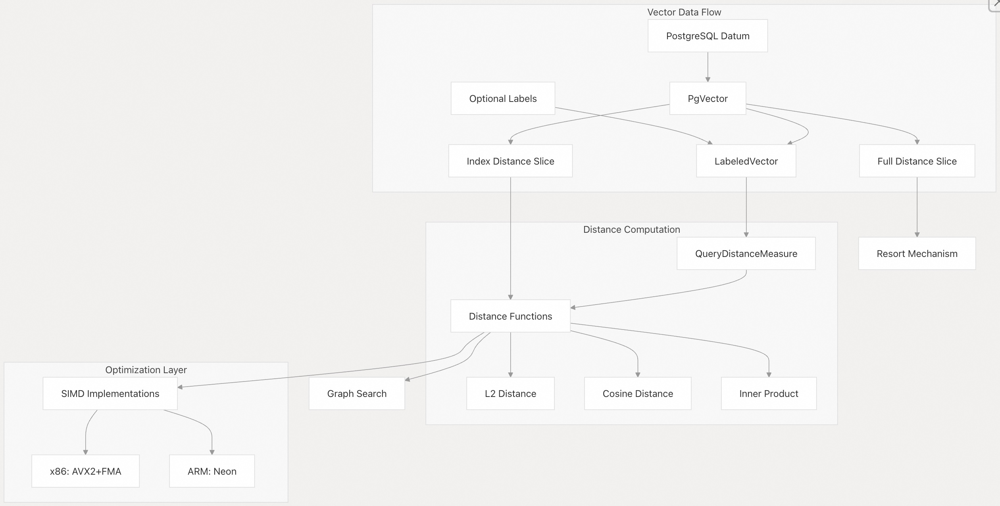
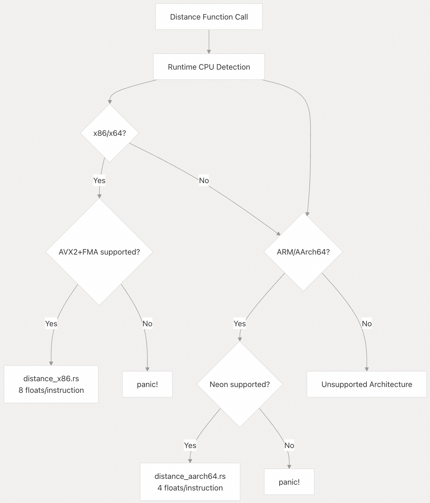

## pgvectorscale 源码学习: 6 距离函数与向量 (`Distance Functions and Vectors`)  
                        
### 作者                        
digoal                        
                        
### 日期                        
2025-11-11                        
                        
### 标签                        
pgvectorscale , 向量数据库 , DiskANN , StreamingDiskANN , 源码学习                        
                        
----                        
                        
## 背景           
本文概述了 pgvectorscale 中的**向量表示** (`vector representation`) 和**距离计算** (`distance computation`)。**距离函数** (`Distance Functions`) 决定了在索引搜索期间如何计算向量之间的相似度，而**向量结构** (`vector structures`) 则管理数据表示以及从 PostgreSQL 的转换。  
  
## 概述 (`Overview`)  
  
pgvectorscale 为**向量相似度搜索** (`vector similarity search`) 提供了两个核心组件：  
  
1.  **向量表示** (`Vector Representation`)：`PgVector` 和 `LabeledVector` 结构，它们封装了 PostgreSQL 向量数据，并管理转换、**预处理** (`preprocessing`) 和**内存管理** (`memory management`)。  
2.  **距离函数** (`Distance Functions`)：在支持的 **CPU 架构** (`CPU architectures`) 上使用 **SIMD** 指令对**余弦** (`cosine`)、**L2** 和**内积** (`inner product`) 距离指标进行优化的实现。  
  
这些组件协同工作，以在**图遍历** (`graph traversal`) 期间实现高效的向量相似度搜索。  
  
  
  
来源:  
  
  * [`pgvectorscale/src/access_method/pg_vector.rs` 1-271](https://github.com/timescale/pgvectorscale/blob/36271fa5/pgvectorscale/src/access_method/pg_vector.rs#L1-L271)  
  * [`pgvectorscale/src/access_method/labels/mod.rs` 169-247](https://github.com/timescale/pgvectorscale/blob/36271fa5/pgvectorscale/src/access_method/labels/mod.rs#L169-L247)  
  * [`pgvectorscale/src/access_method/distance.rs` 6-44](https://github.com/timescale/pgvectorscale/blob/36271fa5/pgvectorscale/src/access_method/distance.rs#L6-L44)  
  
## 向量数据表示 (`Vector Data Representation`)  
  
pgvectorscale 使用两种主要的结构来表示**向量** (`vectors`)：用于原始向量数据的 `PgVector` 结构和用于带有可选**过滤标签** (`filtering labels`) 的向量的 `LabeledVector` 结构。  
  
### PgVector 结构 (`PgVector Structure`)  
  
`PgVector` 结构封装了 PostgreSQL 的向量数据（来自 `pgvector` 扩展），并管理内存分配、**解除 Toasted 压缩** (`detoasting`) 和**预处理** (`preprocessing`)。它为**索引距离** (`index-distance`) 和**完整距离** (`full-distance`) 计算维护了独立的指针，以支持**俄罗斯套娃式嵌入** (`Matryoshka embeddings`)。  
  
  
  
`PgVector` 类型负责处理几个关键职责：  
  
  * **内存管理** (`Memory Management`)：使用 PostgreSQL 的 `palloc`/`pfree` 并实现了 `Drop` 以防止内存泄漏  
  * **解除 Toasted 压缩** (`Detoasting`)：将压缩的 PostgreSQL 数据转换为可访问的内存  
  * **预处理** (`Preprocessing`)：在需要时通过 `preprocess_cosine()` 应用**余弦归一化** (`cosine normalization`)  
  * **双重维度** (`Dual Dimensions`)：为**索引距离**和**完整距离**计算维护独立的指针，以支持**俄罗斯套娃式嵌入**  
  
来源:  
  
  * [`pgvectorscale/src/access_method/pg_vector.rs` 9-51](https://github.com/timescale/pgvectorscale/blob/36271fa5/pgvectorscale/src/access_method/pg_vector.rs#L9-L51)  
  * [`pgvectorscale/src/access_method/pg_vector.rs` 125-157](https://github.com/timescale/pgvectorscale/blob/36271fa5/pgvectorscale/src/access_method/pg_vector.rs#L125-L157)  
  * [`pgvectorscale/src/access_method/pg_vector.rs` 201-208](https://github.com/timescale/pgvectorscale/blob/36271fa5/pgvectorscale/src/access_method/pg_vector.rs#L201-L208)  
  
### LabeledVector 结构 (`LabeledVector Structure`)  
  
`LabeledVector` 结构结合了一个 `PgVector` 和一个可选的**标签集** (`LabelSet`)，用于在**图搜索** (`graph search`) 期间进行**基于标签的过滤** (`label-based filtering`)。  
  
| 组件 (`Component`) | 类型 (`Type`) | 用途 (`Purpose`) |  
| :--- | :--- | :--- |  
| `vec` | `PgVector` | 实际的向量数据 |  
| `labels` | `Option<LabelSet>` | 可选的过滤标签（排序后的 `i16` 数组） |  
  
创建方法:  
  
  * `from_datums()`：在**索引构建** (`index build`)/**插入** (`insert`) 期间从 PostgreSQL **堆元组** (`heap tuple`) 数据构造  
  * `from_scan_key_data()`：在搜索期间从**查询参数** (`query parameters`) 构造  
  
来源:  
  
  * [`pgvectorscale/src/access_method/labels/mod.rs` 169-247](https://github.com/timescale/pgvectorscale/blob/36271fa5/pgvectorscale/src/access_method/labels/mod.rs#L169-L247)  
  * [`pgvectorscale/src/access_method/labels/mod.rs` 13-167](https://github.com/timescale/pgvectorscale/blob/36271fa5/pgvectorscale/src/access_method/labels/mod.rs#L13-L167)  
  
### 俄罗斯套娃式嵌入支持 (`Matryoshka Embeddings Support`)  
  
pgvectorscale 通过允许**索引** (`indexing`) 和**完整距离计算** (`full distance computation`) 使用不同的维度来支持**俄罗斯套娃式嵌入** (`Matryoshka embeddings`)。当 `num_dimensions` \> `num_dimensions_to_index` 时，系统会：  
  
1.  仅使用前 `num_dimensions_to_index` 个维度进行**索引构建** (`index construction`) 和**近似搜索** (`approximate search`)  
2.  使用所有 `num_dimensions` 个维度进行**重新排序** (`resort`)（**精确距离细化** `exact distance refinement`）  
  
这种优化减少了内存使用并提高了搜索速度，同时通过**重新排序机制** (`resort mechanism`) 保持了准确性。  
  
  
  
来源:  
  
  * [`pgvectorscale/src/access_method/pg_vector.rs` 53-81](https://github.com/timescale/pgvectorscale/blob/36271fa5/pgvectorscale/src/access_method/pg_vector.rs#L53-L81)  
  * [`pgvectorscale/src/access_method/pg_vector.rs` 143-148](https://github.com/timescale/pgvectorscale/blob/36271fa5/pgvectorscale/src/access_method/pg_vector.rs#L143-L148)  
  * [`pgvectorscale/src/access_method/pg_vector.rs` 170-179](https://github.com/timescale/pgvectorscale/blob/36271fa5/pgvectorscale/src/access_method/pg_vector.rs#L170-L179)  
  
## 距离计算概述 (`Distance Computation Overview`)  
  
pgvectorscale 实现了由**距离类型枚举** (`DistanceType enum`) 指定的三种**距离指标** (`distance metrics`)。  
  
| 距离类型 (`Distance Type`) | 枚举值 (`Enum Value`) | SQL 运算符 (`SQL Operator`) | 数学定义 (`Mathematical Definition`) |  
| :--- | :--- | :--- | :--- |  
| **余弦** (`Cosine`) | 0 | `<=>` | $1 - (A·B)/(‖A‖·‖B‖)$ |  
| **L2 (欧几里得)** (`L2 - Euclidean`) | 1 | `<->` | $\sum(a_i - b_i)^2$ ( 不带 $\sqrt{}$ ) |  
| **内积** (`Inner Product`) | 2 | `<#>` | $-\sum(a_i \times b_i)$ |  
  
`DistanceType` 存储在**索引元数据** (`index metadata`) 中，并决定了该索引上所有操作使用的**距离函数** (`distance function`)。函数通过 `DistanceType::get_distance_function()` 检索，该方法返回一个优化的**函数指针** (`function pointer`)。  
  
来源:  
  
  * [`pgvectorscale/src/access_method/distance.rs` 6-44](https://github.com/timescale/pgvectorscale/blob/36271fa5/pgvectorscale/src/access_method/distance.rs#L6-L44)  
  * [`pgvectorscale/src/access_method/distance.rs` 22-36](https://github.com/timescale/pgvectorscale/blob/36271fa5/pgvectorscale/src/access_method/distance.rs#L22-L36)  
  
## 性能优化 (`Performance Optimizations`)  
  
pgvectorscale 采用 **SIMD** (**单指令多数据**，`Single Instruction, Multiple Data`) 指令来加速**距离计算** (`distance calculations`)。该实现会根据 **CPU 架构** (`CPU architecture`) 自动选择合适的 **SIMD 指令集** (`SIMD instruction set`)。有关详细的优化技术，请参阅 [SIMD 优化](/timescale/pgvectorscale/6.2-simd-optimizations)。  
  
### 架构特定的实现 (`Architecture-Specific Implementations`)  
  
  
  
**SIMD** 实现带来了显著的性能提升：  
  
  * x86/x64：使用 **AVX2** 和 **FMA** 指令，每次指令处理 8 个 `float32` 值  
  * ARM：使用 **Neon** 指令，每次指令处理 4 个 `float32` 值  
  
**CPU 要求** (`CPU Requirements`)：该扩展在 x86/x64 上需要 **AVX2+FMA** 支持，在 ARM 上需要 **Neon** 支持。系统会在初始化时检查这些功能，如果不可用，将触发 `panic`。  
  
来源:  
  
  * [`pgvectorscale/src/access_method/distance.rs` 62-80](https://github.com/timescale/pgvectorscale/blob/36271fa5/pgvectorscale/src/access_method/distance.rs#L62-L80)  
  * [`pgvectorscale/src/access_method/distance_x86.rs` 1-36](https://github.com/timescale/pgvectorscale/blob/36271fa5/pgvectorscale/src/access_method/distance_x86.rs#L1-L36)  
  * [`pgvectorscale/src/access_method/distance_aarch64.rs` 1-71](https://github.com/timescale/pgvectorscale/blob/36271fa5/pgvectorscale/src/access_method/distance_aarch64.rs#L1-L71)  
  * [`pgvectorscale/src/lib.rs` 10-14](https://github.com/timescale/pgvectorscale/blob/36271fa5/pgvectorscale/src/lib.rs#L10-L14)  
  
### 特殊优化 (`Special Optimizations`)  
  
1.  **少量维度** (`Few Dimensions`)：针对维度 $\le 8$ 的向量的专门实现，用于 **SBQ 量化** (`SBQ quantization`)  
2.  **二进制向量** (`Binary Vectors`)：针对**二进制嵌入** (`binary embeddings`) 的优化**基于 XOR 的汉明距离** (`XOR-based Hamming distance`)  
3.  **余弦预处理** (`Cosine Preprocessing`)：在使用**余弦距离** (`cosine distance`) 时，向量在插入期间进行归一化  
  
来源:  
  
  * [`pgvectorscale/src/access_method/distance.rs` 114-166](https://github.com/timescale/pgvectorscale/blob/36271fa5/pgvectorscale/src/access_method/distance.rs#L114-L166)  
  * [`pgvectorscale/src/access_method/distance.rs` 250-318](https://github.com/timescale/pgvectorscale/blob/36271fa5/pgvectorscale/src/access_method/distance.rs#L250-L318)  
  * [`pgvectorscale/src/access_method/distance.rs` 220-248](https://github.com/timescale/pgvectorscale/blob/36271fa5/pgvectorscale/src/access_method/distance.rs#L220-L248)  
  
## 与 PostgreSQL 的集成 (`Integration with PostgreSQL`)  
  
距离函数通过可在 SQL 查询中使用的运算符暴露给 PostgreSQL：  
  
```sql  
-- Example of a similarity search with L2 distance  
SELECT * FROM items ORDER BY embedding <-> '[1,2,3,4]' LIMIT 10;  
  
-- Example of a similarity search with cosine distance  
SELECT * FROM items ORDER BY embedding <=> '[1,2,3,4]' LIMIT 10;  
  
-- Example of a similarity search with inner product distance  
SELECT * FROM items ORDER BY embedding <#> '[1,2,3,4]' LIMIT 10;  
```  
  
| 距离类型 (`Distance Type`) | SQL 运算符 (`SQL Operator`) |  
| :--- | :--- |  
| **余弦** (`Cosine`) | `<=>` |  
| **L2 (欧几里得)** (`L2 - Euclidean`) | `<->` |  
| **内积** (`Inner Product`) | `<#>` |  
  
系统还提供了 SQL 函数来获取每种距离类型的数值：  
  
  * `distance_type_cosine()` 返回 0  
  * `distance_type_l2()` 返回 1  
  * `distance_type_inner_product()` 返回 2  
  
来源:  
  
  * [`pgvectorscale/src/access_method/distance.rs` 22-36](https://github.com/timescale/pgvectorscale/blob/36271fa5/pgvectorscale/src/access_method/distance.rs#L22-L36)  
  * [`pgvectorscale/src/access_method/distance.rs` 47-60](https://github.com/timescale/pgvectorscale/blob/36271fa5/pgvectorscale/src/access_method/distance.rs#L47-L60)  
  
## CPU 要求 (`CPU Requirements`)  
  
pgvectorscale 对 **SIMD 优化** (`SIMD optimizations`) 有特定的 **CPU 要求** (`CPU requirements`)：  
  
  * x86/x64 架构：**AVX2** 和 **FMA** 指令集  
  * ARM/AArch64 架构：**Neon** 指令集  
  
系统会在初始化时检查这些功能，如果不可用，将触发 `panic`。  
  
来源:  
  
  * [`pgvectorscale/src/access_method/distance.rs` 62-80](https://github.com/timescale/pgvectorscale/blob/36271fa5/pgvectorscale/src/access_method/distance.rs#L62-L80)  
  * [`pgvectorscale/src/lib.rs` 10-14](https://github.com/timescale/pgvectorscale/blob/36271fa5/pgvectorscale/src/lib.rs#L10-L14)  
    
# 附录: 为什么 pgvectorscale 不使用 512 位长度的指令集  
这涉及到 SIMD 优化实现的选择。   
  
## 当前使用的 SIMD 指令集  
  
pgvectorscale 目前使用以下 SIMD 指令集:   
  
- **x86/x64 架构**: AVX2 指令集,处理 256 位(8 个 float32 值)    
- **ARM/AArch64 架构**: Neon 指令集,处理 128 位(4 个 float32 值)    
  
## 为什么不使用 AVX-512  
  
虽然代码中没有明确说明原因, 但从实现可以看出几个关键因素:   
  
1. **CPU 兼容性要求**: 代码在初始化时会检查 CPU 是否支持所需的指令集, 如果不支持则会 panic 。AVX-512 的 CPU 覆盖率远低于 AVX2, 使用 AVX-512 会大幅限制可运行的硬件范围。   
  
2. **编译时特性检查**: 代码要求在编译时启用 AVX2 和 FMA 特性。这表明项目选择了更广泛兼容的指令集。   
  
3. **性能权衡**: 从基准测试代码可以看出,项目对比了多种实现方式(包括 Qdrant 和 DiskANN 的实现)  。AVX2 已经能提供显著的性能提升(每条指令处理 8 个浮点数), 而 AVX-512 虽然能处理 16 个浮点数, 但在某些 CPU 上可能导致降频, 实际收益可能不如预期。   
  
## Notes  
  
AVX-512 是 Intel 和 AMD 较新 CPU 才支持的指令集, 而 AVX2 自 2013 年起就被广泛支持。对于数据库扩展来说, 选择 AVX2 能确保在更多服务器环境中运行, 这是一个合理的工程权衡。 如果您需要 AVX-512 支持, 这需要修改 `distance_x86.rs` 中的实现并调整编译配置。   
    
#### [PolarDB 学习图谱](https://www.aliyun.com/database/openpolardb/activity "8642f60e04ed0c814bf9cb9677976bd4")
  
  
#### [PostgreSQL 解决方案集合](../201706/20170601_02.md "40cff096e9ed7122c512b35d8561d9c8")
  
  
#### [德哥 / digoal's Github - 公益是一辈子的事.](https://github.com/digoal/blog/blob/master/README.md "22709685feb7cab07d30f30387f0a9ae")
  
  
#### [About 德哥](https://github.com/digoal/blog/blob/master/me/readme.md "a37735981e7704886ffd590565582dd0")
  
  

  
