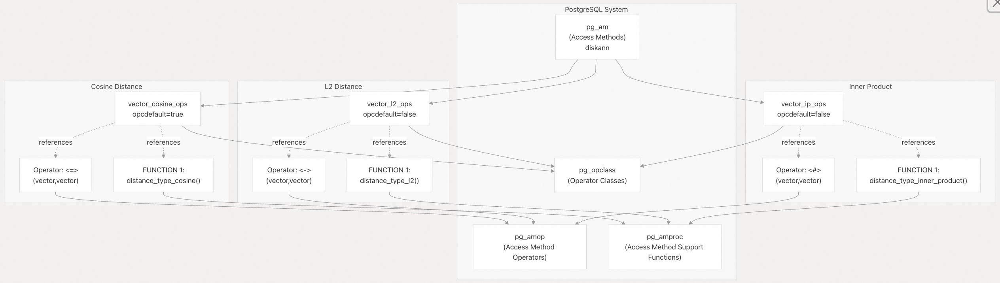
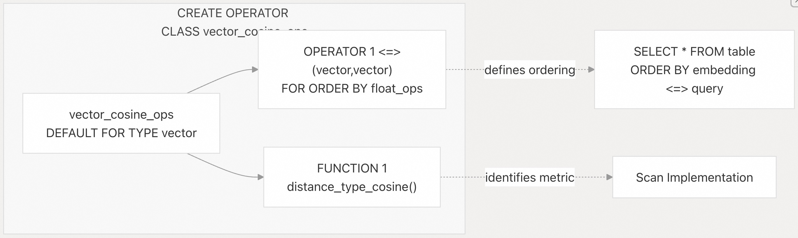
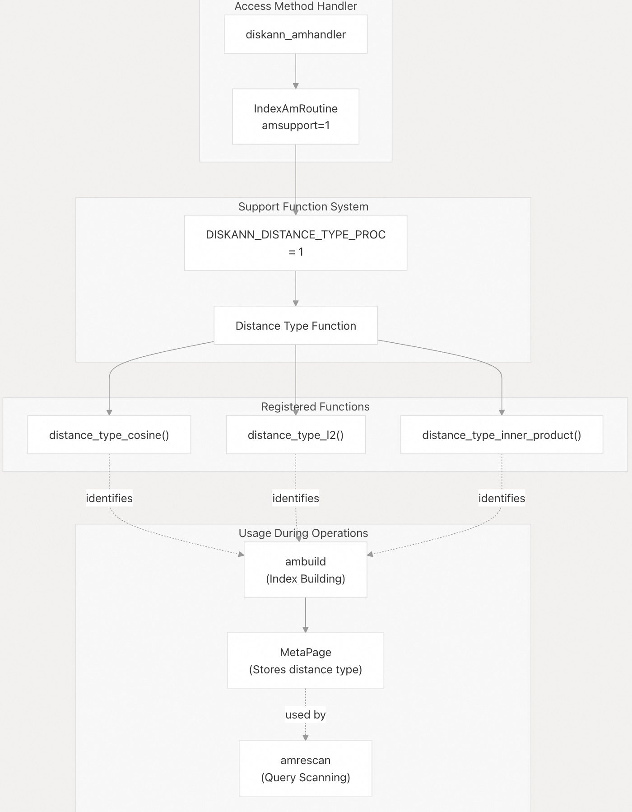
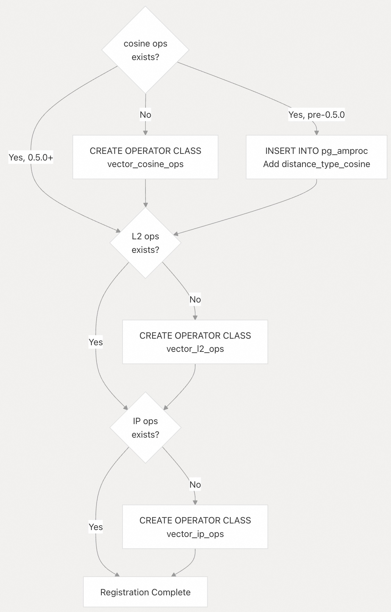

## pgvectorscale 源码学习: 6.1 支持的距离度量（Supported Distance Metrics）    
                            
### 作者                            
digoal                            
                            
### 日期                            
2025-11-11                            
                            
### 标签                            
pgvectorscale , 向量数据库 , DiskANN , StreamingDiskANN , 源码学习                            
                            
----                            
                            
## 背景               
本文档描述了 `pgvectorscale` 的 **StreamingDiskANN 索引**所支持的距离度量（distance metrics），包括它们的数学定义、`PostgreSQL` 运算符（operator）映射，以及在访问方法（access method）基础设施中的注册。    
    
## 概述（Overview）    
    
`pgvectorscale` 扩展支持三种主要的距离度量（distance metrics）用于向量相似性搜索（vector similarity search）：    
    
| 距离度量（Distance Metric） | PostgreSQL 运算符（Operator） | 运算符类（Operator Class） | 支持函数（Support Function） | 数学定义（Mathematical Definition） |    
| :--- | :--- | :--- | :--- | :--- |    
| **余弦距离**（Cosine Distance） | `<=>` | `vector_cosine_ops` | `distance_type_cosine()` | `1 - (a·b)/(‖a‖‖b‖)` |    
| **L2 (欧几里得) 距离**（L2 (Euclidean) Distance） | `<->` | `vector_l2_ops` | `distance_type_l2()` | `√(Σ(aᵢ-bᵢ)²)` |    
| **内积**（Inner Product） | `<#>` | `vector_ip_ops` | `distance_type_inner_product()` | `-a·b` |    
    
每个距离度量都被注册为 `diskann` **访问方法**的**运算符类**（operator class），这允许 `PostgreSQL` 的查询规划器（query planner）根据查询中使用的运算符来识别和使用适当的距离函数。    
    
**来源:**    
[`pgvectorscale/src/access_method/mod.rs` 89-270](https://github.com/timescale/pgvectorscale/blob/36271fa5/pgvectorscale/src/access_method/mod.rs#L89-L270)    
    
## 距离度量注册架构（Distance Metric Registration Architecture）    
    
    
    
### 运算符类注册过程（Operator Class Registration Process）    
    
运算符类是通过在扩展安装和升级期间执行的**幂等 SQL 代码**（idempotent SQL code）进行注册的。每个运算符类在三个 `PostgreSQL` 系统目录中创建条目：    
    
1.  **pg\_opclass**: 定义运算符类名称、关联的**访问方法**（access method）（`diskann`）和**输入类型**（input type）（`vector`）    
2.  **pg\_amop**: 将距离运算符（例如，`<=>`）链接到运算符类    
3.  **pg\_amproc**: 将**支持函数**（support function）（例如，`distance_type_cosine()`）注册为支持函数编号 1    
    
**来源:**    
[`pgvectorscale/src/access_method/mod.rs` 89-158](https://github.com/timescale/pgvectorscale/blob/36271fa5/pgvectorscale/src/access_method/mod.rs#L89-L158) [`pgvectorscale/src/access_method/mod.rs` 160-270](https://github.com/timescale/pgvectorscale/blob/36271fa5/pgvectorscale/src/access_method/mod.rs#L160-L270)    
    
## 运算符类定义（Operator Class Definitions）    
    
### 余弦距离（Cosine Distance）    
    
    
    
余弦距离运算符类被注册为 **DEFAULT**，这意味着当索引定义中没有指定明确的运算符类时，它将是默认选择。    
    
**SQL 注册:**    
    
```sql    
CREATE OPERATOR CLASS vector_cosine_ops DEFAULT    
FOR TYPE vector USING diskann AS    
    OPERATOR 1 <=> (vector, vector) FOR ORDER BY float_ops,    
    FUNCTION 1 distance_type_cosine();    
```    
    
**来源:**    
[`pgvectorscale/src/access_method/mod.rs` 202-206](https://github.com/timescale/pgvectorscale/blob/36271fa5/pgvectorscale/src/access_method/mod.rs#L202-L206)    
    
### L2 (欧几里得) 距离（L2 (Euclidean) Distance）    
    
L2 距离运算符类使用 `<->` 运算符，这与 `pgvector` 扩展建立的约定一致。    
    
**SQL 注册:**    
    
```sql    
CREATE OPERATOR CLASS vector_l2_ops    
FOR TYPE vector USING diskann AS    
    OPERATOR 1 <-> (vector, vector) FOR ORDER BY float_ops,    
    FUNCTION 1 distance_type_l2();    
```    
    
**来源:**    
[`pgvectorscale/src/access_method/mod.rs` 216-221](https://github.com/timescale/pgvectorscale/blob/36271fa5/pgvectorscale/src/access_method/mod.rs#L216-L221)    
    
### 内积距离（Inner Product Distance）    
    
内积运算符类使用 `<#>` 运算符。请注意，**内积被取了负值**（inner product is negated），以保持**距离越小代表向量越相似**（smaller distances represent more similar vectors）的约定。    
    
**SQL 注册:**    
    
```sql    
CREATE OPERATOR CLASS vector_ip_ops    
FOR TYPE vector USING diskann AS    
    OPERATOR 1 <#> (vector, vector) FOR ORDER BY float_ops,    
    FUNCTION 1 distance_type_inner_product();    
```    
    
**来源:**    
[`pgvectorscale/src/access_method/mod.rs` 223-228](https://github.com/timescale/pgvectorscale/blob/36271fa5/pgvectorscale/src/access_method/mod.rs#L223-L228)    
    
## 支持函数接口（Support Function Interface）    
  
    
    
**支持函数机制**（support function mechanism）允许 `PostgreSQL` 查询索引使用了哪种距离度量。常量 `DISKANN_DISTANCE_TYPE_PROC = 1` 定义了距离类型识别是支持函数编号 1。    
    
**来源:**    
[`pgvectorscale/src/access_method/mod.rs` 24-26](https://github.com/timescale/pgvectorscale/blob/36271fa5/pgvectorscale/src/access_method/mod.rs#L24-L26) [`pgvectorscale/src/access_method/mod.rs` 49-50](https://github.com/timescale/pgvectorscale/blob/36271fa5/pgvectorscale/src/access_method/mod.rs#L49-L50)    
    
## 距离函数实现（Distance Function Implementations）    
    
实际的距离计算函数在 `distance` 模块中实现，具有多个优化级别。基本的函数签名遵循此模式：    
    
```rust    
pub fn distance_l2(a: &[f32], b: &[f32]) -> f32    
pub fn distance_cosine(a: &[f32], b: &[f32]) -> f32    
pub fn distance_inner_product(a: &[f32], b: &[f32]) -> f32    
```    
    
每个距离函数都有多种实现：    
    
| 实现变体（Implementation Variant） | 目的（Purpose） | 示例函数（Example Function） |    
| :--- | :--- | :--- |    
| **优化版**（Optimized） | 默认的 **SIMD 优化**版本 | `distance_l2()` |    
| **未优化版**（Unoptimized） | 后备**标量**（scalar）实现 | `distance_l2_unoptimized()` |    
| **专用版**（Specialized） | 针对特定维度优化的版本 | `distance_l2_optimized_for_few_dimensions()` |    
    
**来源:**    
[`pgvectorscale/benches/distance.rs` 1-5](https://github.com/timescale/pgvectorscale/blob/36271fa5/pgvectorscale/benches/distance.rs#L1-L5) [`pgvectorscale/benches/distance.rs` 144-161](https://github.com/timescale/pgvectorscale/blob/36271fa5/pgvectorscale/benches/distance.rs#L144-L161)    
    
## 升级兼容性（Upgrade Compatibility）    
    
运算符类注册 SQL 被设计为**幂等**（idempotent），允许相同的代码处理初始安装和从先前版本的升级。升级逻辑包括：    
    
1.  **版本 0.4.0 → 0.5.0**: 通过插入到 `pg_amproc` 来为余弦运算符类添加 `FUNCTION 1` 子句    
2.  **版本 0.5.0+**: 如果 L2 和内积运算符类不存在，则创建它们    
3.  **当前版本**: 如果所有三个运算符类缺失，则全部创建    
    
    
    
这种**幂等设计**确保了多次运行扩展 SQL 是安全的，并且能够正确处理所有升级路径。    
    
**来源:**    
[`pgvectorscale/src/access_method/mod.rs` 161-270](https://github.com/timescale/pgvectorscale/blob/36271fa5/pgvectorscale/src/access_method/mod.rs#L161-L270)    
    
## 在索引创建中的使用（Usage in Index Creation）    
    
创建索引时，用户通过**运算符类**（operator class）指定所需的距离度量：    
    
```sql    
-- Default (cosine distance)    
CREATE INDEX ON embeddings USING diskann(vector);    
    
-- Explicit cosine distance    
CREATE INDEX ON embeddings USING diskann(vector vector_cosine_ops);    
    
-- L2 distance    
CREATE INDEX ON embeddings USING diskann(vector vector_l2_ops);    
    
-- Inner product distance    
CREATE INDEX ON embeddings USING diskann(vector vector_ip_ops);    
```    
    
所选的运算符类决定了：    
    
1.  哪个运算符触发索引使用（`<=>`、`<->` 或 `<#>`）    
2.  在**图结构构建**（graph construction）期间使用哪个距离函数    
3.  在**查询扫描**（query scanning）期间使用哪个距离函数    
    
**来源:**    
[`pgvectorscale/src/access_method/upgrade_test.rs` 244-259](https://github.com/timescale/pgvectorscale/blob/36271fa5/pgvectorscale/src/access_method/upgrade_test.rs#L244-L259)    
    
## 基准测试基础设施（Benchmark Infrastructure）    
    
该扩展使用 **Criterion 框架**包含了全面的距离函数性能**基准测试**（benchmarks）。这些基准测试比较了：    
    
  * **SIMD 优化**与**未优化**的实现    
  * 不同的向量维度（**量化向量**（quantized vectors）为 6 维，完整向量为 1536+ 维）    
  * 内存对齐对性能的影响    
  * 与其他**向量数据库**（vector databases）参考实现的比较    
    
**来源:**    
[`pgvectorscale/benches/distance.rs` 144-196](https://github.com/timescale/pgvectorscale/blob/36271fa5/pgvectorscale/benches/distance.rs#L144-L196) [`pgvectorscale/benches/distance.rs` 299-338](https://github.com/timescale/pgvectorscale/blob/36271fa5/pgvectorscale/benches/distance.rs#L299-L338)    
        
#### [PolarDB 学习图谱](https://www.aliyun.com/database/openpolardb/activity "8642f60e04ed0c814bf9cb9677976bd4")
  
  
#### [PostgreSQL 解决方案集合](../201706/20170601_02.md "40cff096e9ed7122c512b35d8561d9c8")
  
  
#### [德哥 / digoal's Github - 公益是一辈子的事.](https://github.com/digoal/blog/blob/master/README.md "22709685feb7cab07d30f30387f0a9ae")
  
  
#### [About 德哥](https://github.com/digoal/blog/blob/master/me/readme.md "a37735981e7704886ffd590565582dd0")
  
  

  
