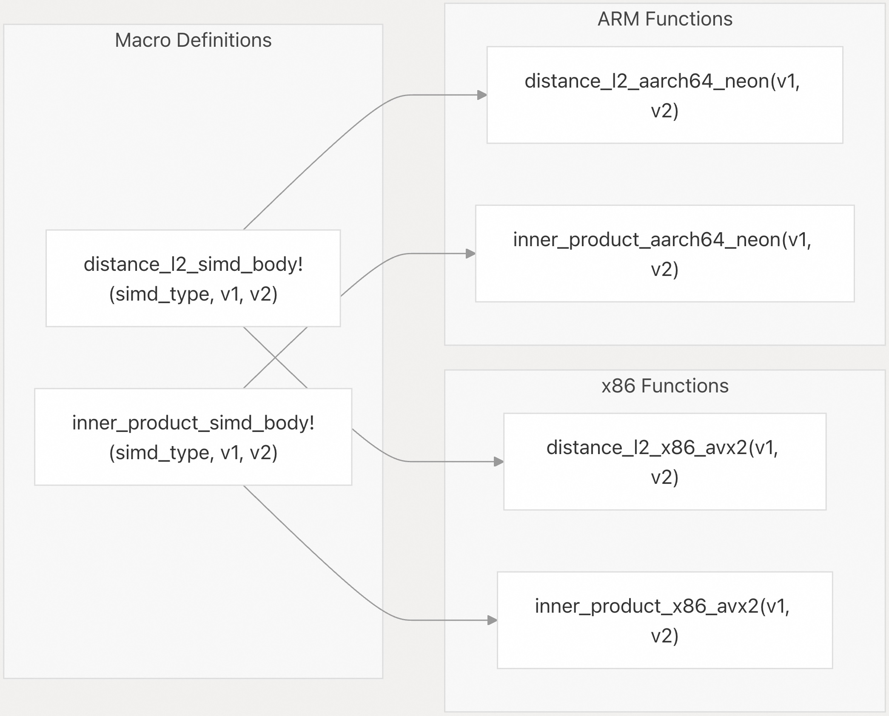

## pgvectorscale 源码学习: 6.2 SIMD 优化（SIMD Optimizations）  
                              
### 作者                              
digoal                              
                              
### 日期                              
2025-11-11                              
                              
### 标签                              
pgvectorscale , 向量数据库 , DiskANN , StreamingDiskANN , 源码学习                              
                              
----                              
                              
## 背景                 
`pgvectorscale` 中实现了 **SIMD（Single Instruction, Multiple Data，单指令多数据）** 优化，以加速向量距离计算（vector distance calculations）。在向量相似性搜索（vector similarity search）工作负载中，距离计算占据了大部分 **CPU** 时间。有关距离指标（distance metrics）本身的信息，请参阅[支持的距离指标](/timescale/pgvectorscale/6.1-supported-distance-metrics)。  
  
`pgvectorscale` 实现了所有距离函数（**L2**、余弦距离 **cosine distance** 和内积 **inner product**）的 **SIMD** 加速版本。该实现使用条件编译（conditional compilation）在编译时选择针对特定架构的 **SIMD** 指令，并使用运行时特征检测（runtime feature detection）来验证 **CPU** 支持。  
  
**距离函数调用路径（Distance Function Call Path）**  
  
  
  
来源:  
[`pgvectorscale/src/access_method/distance.rs` 37-44](https://github.com/timescale/pgvectorscale/blob/36271fa5/pgvectorscale/src/access_method/distance.rs#L37-L44)  
[`pgvectorscale/src/access_method/distance.rs` 82-98](https://github.com/timescale/pgvectorscale/blob/36271fa5/pgvectorscale/src/access_method/distance.rs#L82-L98)  
[`pgvectorscale/src/access_method/distance.rs` 168-185](https://github.com/timescale/pgvectorscale/blob/36271fa5/pgvectorscale/src/access_method/distance.rs#L168-L185)  
[`pgvectorscale/src/access_method/distance.rs` 187-204](https://github.com/timescale/pgvectorscale/blob/36271fa5/pgvectorscale/src/access_method/distance.rs#L187-L204)  
  
## **支持的 CPU 架构（Supported CPU Architectures）**  
  
`pgvectorscale` 为两种 **CPU** 架构实现了 **SIMD** 优化：  
  
| 架构（Architecture） | SIMD 技术（SIMD Technology） | 寄存器宽度（Register Width） | 每个寄存器的浮点数（Floats per Register） | 所需特征（Required Features） |  
| :--- | :--- | :--- | :--- | :--- |  
| **x86/x86\_64** | **AVX2 + FMA** | 256 位（bits） | 8 | `avx2`, `fma` |  
| **ARM/AArch64** | **Neon** | 128 位（bits） | 4 | `neon` |  
| **其他（Other）** | 标量回退（Scalar fallback） | N/A | 1 | **None** |  
  
**运行时 CPU 特征检测（CPU Feature Detection at Runtime）**  
  
  
  
在扩展初始化（extension initialization）期间，会调用 `check_required_features()` 函数。在 **x86/x86\_64** 上，**AVX2** 和 **FMA** 必须同时存在。在 **ARM/AArch64** 上，**Neon** 必须存在。如果缺少所需特征，扩展将无法加载。  
  
来源:  
[`pgvectorscale/src/access_method/distance.rs` 62-79](https://github.com/timescale/pgvectorscale/blob/36271fa5/pgvectorscale/src/access_method/distance.rs#L62-L79)  
[`pgvectorscale/src/lib.rs` 10-14](https://github.com/timescale/pgvectorscale/blob/36271fa5/pgvectorscale/src/lib.rs#L10-L14)  
  
## **实现策略（Implementation Strategy）**  
  
### **抽象层（Abstraction Layer）**  
  
`pgvectorscale` 对 **x86** 和 **ARM** 的 **SIMD** 实现采用了不同的方法：  
  
**x86/x86\_64**：使用 `simdeez` **crate**，它提供了通用的 **SIMD** 抽象。来自 `simdeez` 的 `Avx2` 结构体实现了 `mul_ps()`、`add_ps()` 和 `fmadd_ps()` 等操作，抽象了 **AVX2** 内在函数（intrinsics）。  
  
**ARM/AArch64**：实现了一个自定义的 **SIMD** 封装结构体 `S`，它提供了与 `simdeez` 相同的接口，但直接使用 `core::arch::aarch64` 内在函数来进行 **Neon** 操作。之所以需要这个自定义封装，是因为 `simdeez` 不支持 **ARM** 架构。  
  
来源:  
[`pgvectorscale/src/access_method/distance_x86.rs` 1-37](https://github.com/timescale/pgvectorscale/blob/36271fa5/pgvectorscale/src/access_method/distance_x86.rs#L1-L37)  
[`pgvectorscale/src/access_method/distance_aarch64.rs` 1-71](https://github.com/timescale/pgvectorscale/blob/36271fa5/pgvectorscale/src/access_method/distance_aarch64.rs#L1-L71)  
  
### **通过宏实现代码复用（Code Reuse via Macros）**  
  
为了避免在不同架构之间重复 **SIMD** 逻辑，共享的计算模式被定义为宏（macros）。特定于架构的实现会使用适当的 **SIMD** 类型调用这些宏。  
  
**基于宏的代码组织（Macro-Based Code Organization）**  
  
  
  
这些宏封装了核心的 **SIMD** 计算逻辑，而特定于架构的函数则提供了 **SIMD** 类型并处理任何特定于平台的设置。  
  
来源:  
[`pgvectorscale/src/access_method/distance.rs` 320-370](https://github.com/timescale/pgvectorscale/blob/36271fa5/pgvectorscale/src/access_method/distance.rs#L320-L370)  
[`pgvectorscale/src/access_method/distance.rs` 374-429](https://github.com/timescale/pgvectorscale/blob/36271fa5/pgvectorscale/src/access_method/distance.rs#L374-L429)  
  
## **SIMD 优化技术（SIMD Optimization Techniques）**  
  
### **多累加器模式（Multiple Accumulator Pattern）**  
  
为了最大限度地提高**指令级并行性（instruction-level parallelism）**，**SIMD** 实现了在主处理循环中使用了四个独立的累加器（accumulators）。这减少了迭代之间的数据依赖性（data dependencies），允许 **CPU** 并行执行多个 **SIMD** 操作。  
  
**处理模式（Processing Pattern）**：  
  
1.  循环每迭代处理 `4 * SIMD_width` 个元素。  
2.  四个累加器寄存器（`sum1`、`sum2`、`sum3`、`sum4`）独立地累加结果。  
3.  循环完成后，累加器被归约（reduced）为一个单一值。  
4.  剩余元素（如果向量长度不是 `4 * SIMD_width` 的倍数）通过标量代码（scalar code）处理。  
  
以 **x86 AVX2** 上的 **L2** 距离为例（每个寄存器 8 个浮点数，每迭代 32 个浮点数）：  
  
```  
for i in (0..n).step_by(32) {  
    // 从每个向量加载 4 个 SIMD 寄存器  
    // 计算差异并累加平方差异  
    sum1 += (v1[i..i+8] - v2[i..i+8])²  
    sum2 += (v1[i+8..i+16] - v2[i+8..i+16])²  
    sum3 += (v1[i+16..i+24] - v2[i+16..i+24])²  
    sum4 += (v1[i+24..i+32] - v2[i+24..i+32])²  
}  
```  
  
来源:  
[`pgvectorscale/src/access_method/distance.rs` 326-365](https://github.com/timescale/pgvectorscale/blob/36271fa5/pgvectorscale/src/access_method/distance.rs#L326-L365)  
  
### **水平归约（Horizontal Reduction）**  
  
并行处理之后，必须对 **SIMD** 寄存器通道（lanes）求和以生成标量结果。`horizontal_add_ps()` 方法将 **SIMD** 寄存器内的所有元素相加。  
  
对于四累加器模式，归约过程为：  
  
```  
result = horizontal_add_ps(sum1) + horizontal_add_ps(sum2) +   
         horizontal_add_ps(sum3) + horizontal_add_ps(sum4)  
```  
  
来源:  
[`pgvectorscale/src/access_method/distance.rs` 356-359](https://github.com/timescale/pgvectorscale/blob/36271fa5/pgvectorscale/src/access_method/distance.rs#L356-L359)  
[`pgvectorscale/src/access_method/distance.rs` 416-419](https://github.com/timescale/pgvectorscale/blob/36271fa5/pgvectorscale/src/access_method/distance.rs#L416-L419)  
  
## **SIMD 距离函数实现（SIMD Distance Function Implementations）**  
  
### **`distance_l2()`**  
  
`distance_l2()` 函数计算**平方欧几里得距离（squared Euclidean distance）**。不计算平方根，因为对于相似性搜索（similarity search）而言，只有相对排序（relative ordering）是重要的。  
  
**算法（Algorithm）**：  
  
1.  计算差异：`diff = v1[i] - v2[i]`  
2.  平方差异：`squared_diff = diff * diff`（在可用时使用 **SIMD FMA**）  
3.  累加：`sum += squared_diff`  
4.  返回：`sum`（而非 `sqrt(sum)`）  
  
该函数根据目标架构，调度到 `distance_l2_x86_avx2()` 或 `distance_l2_aarch64_neon()`，或者回退到 `distance_l2_unoptimized()`。  
  
来源:  
[`pgvectorscale/src/access_method/distance.rs` 82-98](https://github.com/timescale/pgvectorscale/blob/36271fa5/pgvectorscale/src/access_method/distance.rs#L82-L98)  
[`pgvectorscale/src/access_method/distance.rs` 320-370](https://github.com/timescale/pgvectorscale/blob/36271fa5/pgvectorscale/src/access_method/distance.rs#L320-L370)  
  
### **`distance_cosine()`**  
  
`distance_cosine()` 函数假设输入向量已预先归一化（pre-normalized）。它计算余弦距离（**cosine distance**）为 `1 - inner_product`，并钳制（clamped）到 `[0, 2]` 范围。  
  
**算法（Algorithm）**：  
  
1.  使用 **SIMD** 计算内积（与 `inner_product_x86_avx2()` 或 `inner_product_aarch64_neon()` 相同）  
2.  返回：`max(1.0 - inner_product, 0.0)`  
  
钳制操作处理了浮点精度（floating-point precision）问题，这些问题可能产生小的负值。  
  
来源:  
[`pgvectorscale/src/access_method/distance.rs` 187-204](https://github.com/timescale/pgvectorscale/blob/36271fa5/pgvectorscale/src/access_method/distance.rs#L187-L204)  
[`pgvectorscale/src/access_method/distance_x86.rs` 33-36](https://github.com/timescale/pgvectorscale/blob/36271fa5/pgvectorscale/src/access_method/distance_x86.rs#L33-L36)  
[`pgvectorscale/src/access_method/distance_aarch64.rs` 65-67](https://github.com/timescale/pgvectorscale/blob/36271fa5/pgvectorscale/src/access_method/distance_aarch64.rs#L65-L67)  
  
### **`distance_inner_product()`**  
  
`distance_inner_product()` 函数计算**负内积（negative inner product）**，以将相似性（similarity）转换为距离（distance）（值越低越好）。  
  
**算法（Algorithm）**：  
  
1.  计算元素级乘积：`product = v1[i] * v2[i]`  
2.  累加：`sum += product`  
3.  返回：`-sum`  
  
取反操作将相似性指标（值越高越相似）转换为距离指标（值越低越相似）。  
  
来源:  
[`pgvectorscale/src/access_method/distance.rs` 168-185](https://github.com/timescale/pgvectorscale/blob/36271fa5/pgvectorscale/src/access_method/distance.rs#L168-L185)  
[`pgvectorscale/src/access_method/distance.rs` 374-429](https://github.com/timescale/pgvectorscale/blob/36271fa5/pgvectorscale/src/access_method/distance.rs#L374-L429)  
  
## **专业距离函数（Specialized Distance Functions）**  
  
### **`distance_l2_optimized_for_few_dimensions()`**  
  
**乘积量化（Product Quantization, PQ）** 码通常只有 6-12 个维度。对于这些小向量，标准的 **SIMD** 实现会因循环设置和累加器归约而产生开销。`distance_l2_optimized_for_few_dimensions()` 函数提供了针对小向量优化的替代实现。  
  
该函数基于向量长度进行编译时调度（compile-time dispatch），选择以下之一：  
  
  * 针对较大向量的 **SIMD** 实现。  
  * 针对小向量的**自动向量化标量代码（Auto-vectorized scalar code）**（编译器可以更有效地优化）。  
  
来源:  
[`pgvectorscale/src/access_method/distance.rs` 114-166](https://github.com/timescale/pgvectorscale/blob/36271fa5/pgvectorscale/src/access_method/distance.rs#L114-L166)  
  
### **`distance_xor_optimized()`**  
  
对于二值向量表示（binary vector representations）（用于某些量化方案），**XOR** 距离计算不同位的数量。`distance_xor_optimized()` 函数对表示打包二值向量（packed binary vectors）的 `u64` 数组进行操作。  
  
**算法（Algorithm）**：  
  
1.  **XOR** 相应的 `u64` 元素：`xor = v1[i] ^ v2[i]`  
2.  计数置位（set bits）：`count += xor.count_ones()`  
3.  返回总计数  
  
`count_ones()` 方法在现代 **CPU** 上会编译成高效的 **POPCNT** 指令。  
  
来源:  
[`pgvectorscale/src/access_method/distance.rs` 250-318](https://github.com/timescale/pgvectorscale/blob/36271fa5/pgvectorscale/src/access_method/distance.rs#L250-L318)  
  
## **基准测试基础设施（Benchmarking Infrastructure）**  
  
代码库中包含一个使用 `criterion` 框架的全面基准测试套件，位于 `pgvectorscale/benches/distance.rs`。基准测试比较了 **SIMD** 实现与未优化的标量实现和第三方 **SIMD** 代码的性能。  
  
### **基准测试类别（Benchmark Categories）**  
  
| 基准测试组（Benchmark Group） | 目的（Purpose） | 向量大小（Vector Size） |  
| :--- | :--- | :--- |  
| `Distance` | 比较标准向量的 **SIMD** 与标量性能 | 2000 维度（dimensions） |  
| `Distance` (few dimensions) | 比较 **PQ** 码的优化性能 | 6 维度（dimensions） |  
| `Distance xor` | 比较 **XOR** 距离的变体 | 1536 位（bits）（192 字节） |  
  
### **参考实现（Reference Implementations）**  
  
基准测试套件包含来自其他项目的 **SIMD** 参考实现以进行比较：  
  
**Qdrant AVX2 点积（Qdrant AVX2 Dot Product）**（`dot_similarity_avx_qdrant`）：使用 **FMA** 指令，采用四累加器模式，每迭代处理 32 个浮点数。  
来源: [`pgvectorscale/benches/distance.rs` 25-67](https://github.com/timescale/pgvectorscale/blob/36271fa5/pgvectorscale/benches/distance.rs#L25-L67)  
  
**DiskANN L2 距离（DiskANN L2 Distance）**（`distance_l2_vector_f32`）：需要 32 字节对齐的向量，使用带有 **FMA** 的 **AVX2** 来计算平方差。  
来源: [`pgvectorscale/benches/distance.rs` 73-99](https://github.com/timescale/pgvectorscale/blob/36271fa5/pgvectorscale/benches/distance.rs#L73-L99)  
  
### **基准测试函数（Benchmark Functions）**  
  
关键基准测试函数包括：  
  
  * `benchmark_distance()`：比较所有距离类型的优化版本与未优化版本的性能。  
  * `benchmark_distance_few_dimensions()`：测试 **PQ** 码距离性能。  
  * `benchmark_distance_xor()`：测试带有不同打包策略（`u8`、`u64`、`u128`）的二值向量距离。  
  * `benchmark_distance_x86_aligned_vectors()` 和 `benchmark_distance_x86_unaligned_vectors()`：比较内存对齐（memory alignment）对性能的影响。  
  
来源:  
[`pgvectorscale/benches/distance.rs` 144-161](https://github.com/timescale/pgvectorscale/blob/36271fa5/pgvectorscale/benches/distance.rs#L144-L161)  
[`pgvectorscale/benches/distance.rs` 177-196](https://github.com/timescale/pgvectorscale/blob/36271fa5/pgvectorscale/benches/distance.rs#L177-L196)  
[`pgvectorscale/benches/distance.rs` 299-338](https://github.com/timescale/pgvectorscale/blob/36271fa5/pgvectorscale/benches/distance.rs#L299-L338)  
  
### **运行基准测试（Running Benchmarks）**  
```bash  
cargo bench --bench distance  
```  
  
基准测试结果显示，对于典型向量大小，**SIMD** 实现比标量实现实现了 **5-15** 倍的加速，具体性能取决于向量维度、**CPU** 架构和内存访问模式。  
  
## **编译和运行时要求（Compilation and Runtime Requirements）**  
  
### **编译要求（Compilation Requirements）**  
  
对于 **x86/x86\_64**：  
  
  * 编译期间必须启用 **AVX2** 和 **FMA** 指令集支持。  
  * **Rust** 标志必须包含 `-C target-feature=+avx2,+fma`。  
  
对于 **ARM/AArch64**：  
  
  * 必须启用 **Neon** 指令集支持。  
  * **Rust** 标志必须包含 `-C target-feature=+neon`。  
  
来源:  
[`pgvectorscale/src/access_method/distance.rs` 62-68](https://github.com/timescale/pgvectorscale/blob/36271fa5/pgvectorscale/src/access_method/distance.rs#L62-L68)  
[`pgvectorscale/src/access_method/distance_x86.rs` 8-19](https://github.com/timescale/pgvectorscale/blob/36271fa5/pgvectorscale/src/access_method/distance_x86.rs#L8-L19)  
[`pgvectorscale/src/access_method/distance_aarch64.rs` 6-10](https://github.com/timescale/pgvectorscale/blob/36271fa5/pgvectorscale/src/access_method/distance_aarch64.rs#L6-L10)  
  
### **运行时要求（Runtime Requirements）**  
  
在初始化期间，`pgvectorscale` 会检查所需的 **CPU** 特征：  
  
  * 在 **x86/x86\_64** 上，**AVX2** 和 **FMA** 必须可用。  
  * 在 **ARM/AArch64** 上，**Neon** 必须可用。  
  
如果这些特征不可用，扩展将拒绝加载并显示适当的错误消息。  
  
来源:  
[`pgvectorscale/src/access_method/distance.rs` 70-79](https://github.com/timescale/pgvectorscale/blob/36271fa5/pgvectorscale/src/access_method/distance.rs#L70-L79)  
[`pgvectorscale/src/lib.rs` 10-14](https://github.com/timescale/pgvectorscale/blob/36271fa5/pgvectorscale/src/lib.rs#L10-L14)  
  
## **总结（Conclusion）**  
  
`pgvectorscale` 中的 **SIMD** 优化为向量距离计算提供了关键的性能改进，而向量距离计算是向量相似性搜索的核心操作。通过利用特定于架构的 **SIMD** 指令和精心设计的优化技术，`pgvectorscale` 在不同的 **CPU** 架构上实现了高性能。  
  
# 附录: 为什么CPU SIMD指令集对向量距离计算的性能提升明显?   
结合向量距离计算算法、CPU SIMD和非SIMD指令的区别进行解释.    
  
为什么CPU SIMD指令集对向量距离计算的性能提升明显。 从代码库来看, 这个问题涉及 `pgvectorscale/benches/distance.rs` 中的距离计算实现, 特别是优化版本和非优化版本的对比。   
  
## SIMD vs 非SIMD的核心区别  
  
### 1. **并行处理能力**  
  
SIMD(Single Instruction Multiple Data)指令可以在一条指令中同时处理多个数据元素。 在向量距离计算中, 这意味着可以同时计算多个维度的差值或乘积。   
  
代码中的AVX实现展示了这一点:  这里使用 `__m256` 类型一次处理8个浮点数, 而非SIMD版本需要逐个元素处理。   
  
### 2. **向量距离计算算法的特点**  
  
向量距离计算(如L2距离和余弦距离)本质上是大量重复的算术运算:   
  
**L2距离**: 对每个维度计算 `(a[i] - b[i])²` 然后求和    
  
**点积/余弦相似度**: 对每个维度计算 `a[i] * b[i]` 然后求和    
  
这些操作在每个维度上都是独立的,非常适合并行化。   
  
### 3. **性能提升的具体体现**  
  
代码中的AVX优化版本展示了关键优化技术:   
  
- **循环展开**: 一次处理32个元素(4个 `__m256` 寄存器)    
- **FMA指令**: 使用 `_mm256_fmadd_ps` 在一条指令中完成乘法和加法    
- **减少内存访问**: 通过寄存器累加减少内存往返   
  
### 4. **实际应用中的性能对比**  
  
代码库中提供了基准测试来对比优化和非优化版本:    
  
对于二进制量化向量的XOR距离计算, 也展示了类似的优化: 使用 `u64` 类型可以一次处理64位,而非逐位处理。    
  
### 5. **在存储系统中的应用**  
  
在实际的向量搜索中, 这些优化的距离函数被频繁调用:   
  
- PlainStorage 使用优化的距离函数进行全精度计算    
- SBQ存储使用优化的XOR距离计算量化向量    
  
## Notes  
  
SIMD指令集对向量距离计算性能提升明显的根本原因是: **向量距离计算本质上是对大量独立数据元素执行相同的算术运算, 这与SIMD"单指令多数据"的特性完美匹配**。 通过一次处理多个元素(AVX可处理8个float32), 可以将计算吞吐量提升数倍, 同时减少循环开销和指令数量。 对于高维向量(如1536维), 这种优化的累积效果非常显著。   
  
    
#### [PolarDB 学习图谱](https://www.aliyun.com/database/openpolardb/activity "8642f60e04ed0c814bf9cb9677976bd4")
  
  
#### [PostgreSQL 解决方案集合](../201706/20170601_02.md "40cff096e9ed7122c512b35d8561d9c8")
  
  
#### [德哥 / digoal's Github - 公益是一辈子的事.](https://github.com/digoal/blog/blob/master/README.md "22709685feb7cab07d30f30387f0a9ae")
  
  
#### [About 德哥](https://github.com/digoal/blog/blob/master/me/readme.md "a37735981e7704886ffd590565582dd0")
  
  

  
