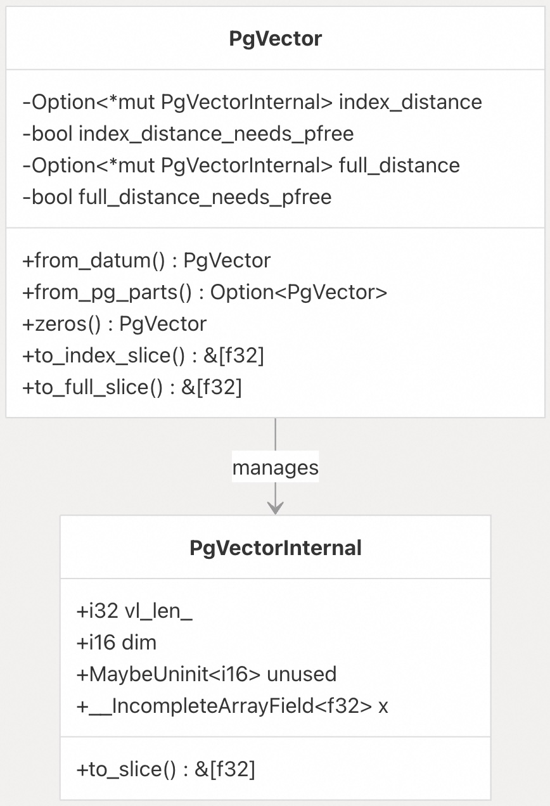
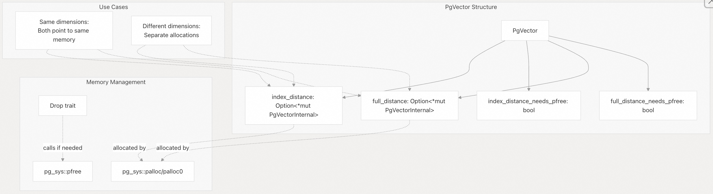
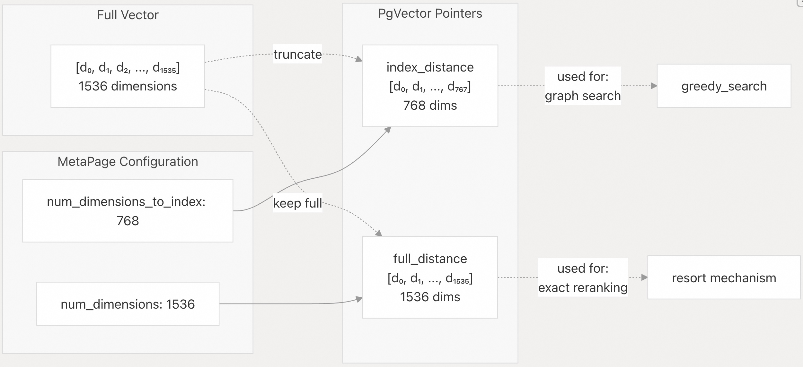
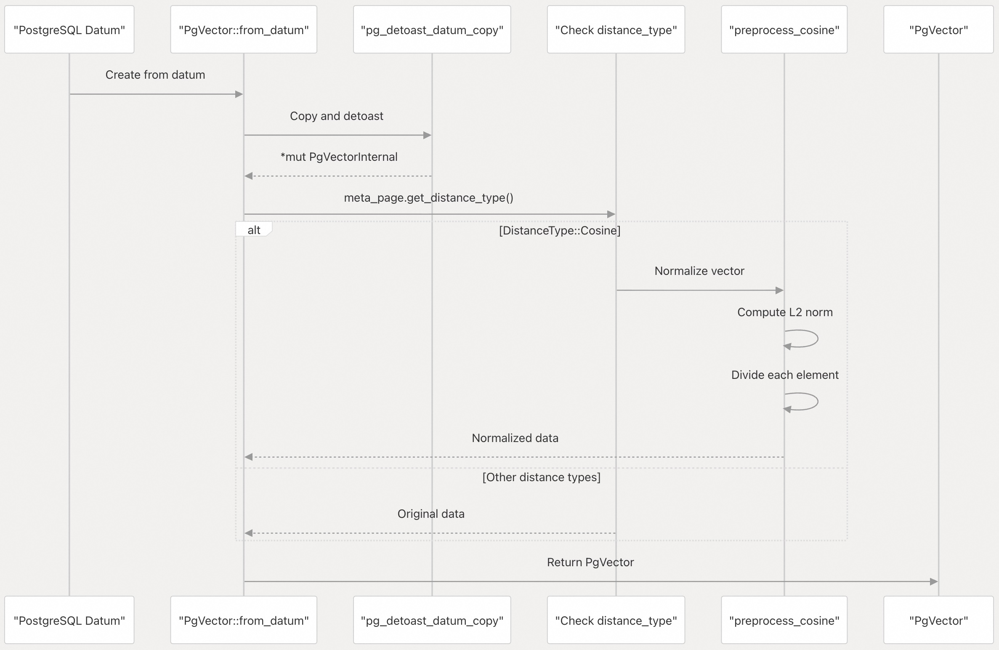
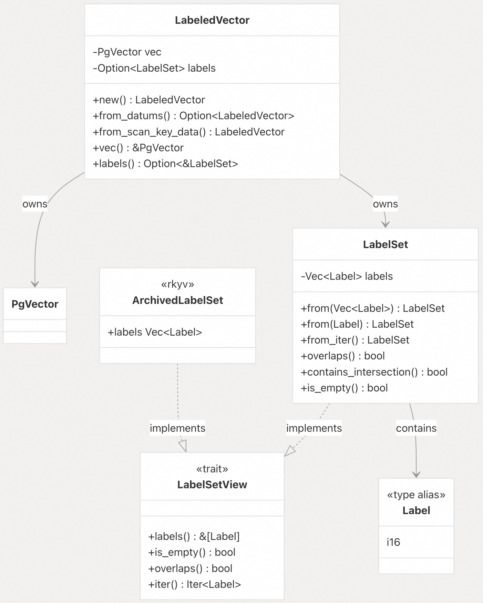
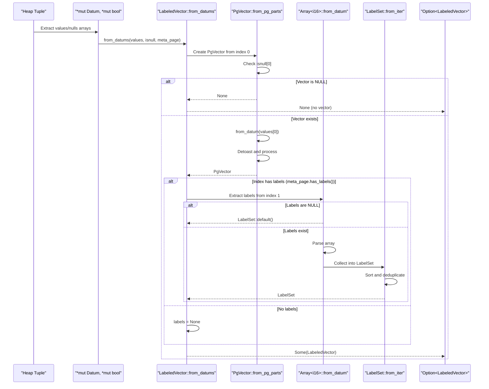
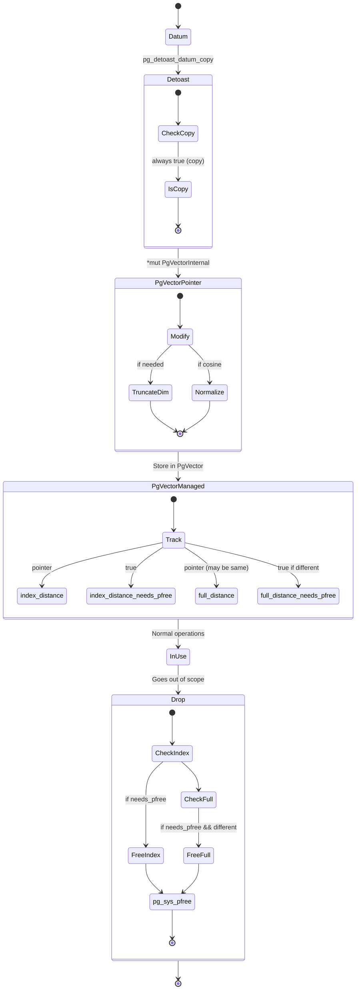
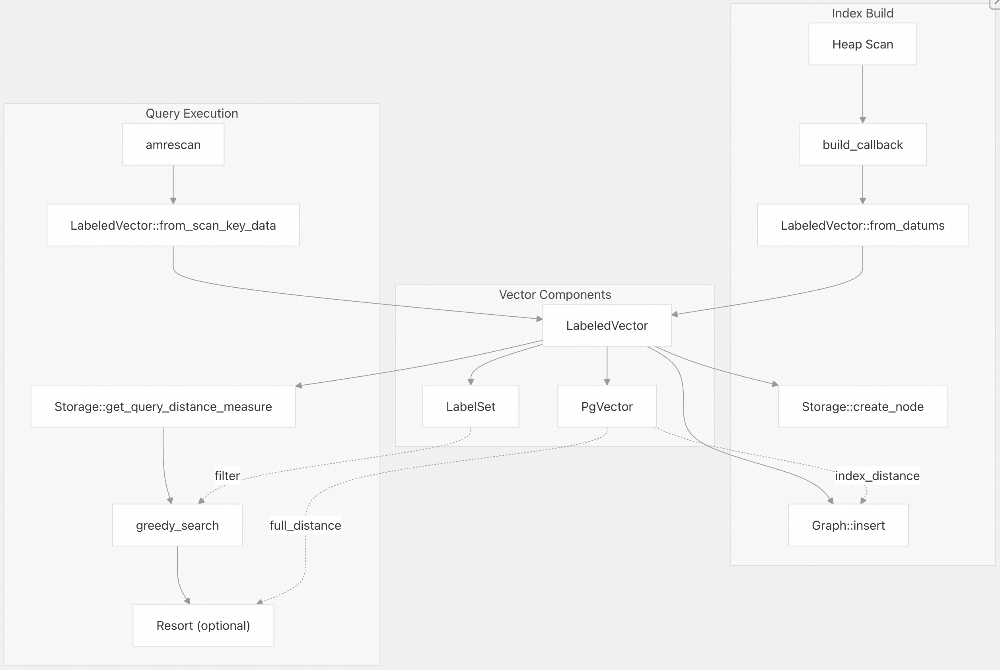

## pgvectorscale 源码学习: 6.3 向量数据管理 (Vector Data Management)  
                                
### 作者                                
digoal                                
                                
### 日期                                
2025-11-11                                
                                
### 标签                                
pgvectorscale , 向量数据库 , DiskANN , StreamingDiskANN , 源码学习                                
                                
----                                
                                
## 背景                   
本文介绍了 `pgvectorscale` 中用于表示**向量 (vectors)** 及其相关**元数据 (metadata)** 的核心**数据结构 (data structures)**。涵盖 `PgVector` 和 `LabeledVector` 结构、从 PostgreSQL `Datum` 类型进行**转换 (conversion)**、**内存管理 (memory management)** 以及**维度处理 (dimension handling)**（包括对**俄罗斯套娃嵌入 (Matryoshka embeddings)** 的支持）。  
  
## 向量表示 (Vector Representation)  
  
`pgvectorscale` 使用两个主要结构来表示**向量数据 (vector data)**：`PgVectorInternal` 用于与 `pgvector` 的**二进制格式 (binary format)** 兼容，而 `PgVector` 作为**受管理 (managed)** 的**封装器 (wrapper)**。  
  
### PgVectorInternal 结构 (Structure)  
  
`PgVectorInternal` 是一个与 `pgvector` **内部格式 (internal format)** 匹配的 **C 兼容表示 (C-compatible representation)**：  
  
  
  
**PgVectorInternal 关键属性 (Key Properties)**  
  
| 字段 (Field) | 类型 (Type) | 描述 (Description) |  
| :--- | :--- | :--- |  
| `vl_len_` | `i32` | PostgreSQL **变长头 (varlena header)** (总大小) |  
| `dim` | `i16` | 向量的**维度 (dimensions)** 数量 |  
| `x` | `__IncompleteArrayField<f32>` | **可变长度 (Variable-length)** 的 `float32` 值数组 |  
  
该结构使用 `#[repr(C)]` 来确保与 `pgvector` 的 **C 实现 (C implementation)** 在**内存布局 (memory layout)** 上兼容。`to_slice()` 方法提供了对向量数据作为 Rust **切片 (slice)** 的安全访问。  
  
来源: [`pgvectorscale/src/access_method/pg_vector.rs` 9-24](https://github.com/timescale/pgvectorscale/blob/36271fa5/pgvectorscale/src/access_method/pg_vector.rs#L9-L24)  
  
### PgVector 封装器 (Wrapper)  
  
`PgVector` **封装 (wraps)** 了一个或两个 `PgVectorInternal` **指针 (pointers)** 并管理它们的**生命周期 (lifecycle)**：  
  
  
  
**双指针设计 (Dual Pointer Design)**  
  
`PgVector` 维护着两个可能不同的指针：  
  
  * `index_distance`：用于**索引操作 (index operations)** 和**近似搜索 (approximate search)**（可能被**截断 (truncated)**）  
  * `full_distance`：用于在**重新排序 (resort)** 期间进行**精确距离计算 (exact distance computation)**（**完整维度 (full dimensions)**）  
  
当 `num_dimensions == num_dimensions_to_index` 时，两个指针引用相同的**内存 (memory)** 以避免**重复 (duplication)**。否则，会维护单独的**分配 (allocations)**。  
  
**内存管理 (Memory Management)**  
  
布尔**标志 (flags)** `index_distance_needs_pfree` 和 `full_distance_needs_pfree` 用于跟踪哪些指针**拥有 (own)** 它们的内存。`Drop` **实现 (implementation)** 会对拥有的指针自动调用 `pfree`。这种 **RAII（资源获取即初始化）模式 (Resource Acquisition Is Initialization pattern)** 确保即使发生**错误 (errors)**，内存也能正确释放。  
  
来源: [`pgvectorscale/src/access_method/pg_vector.rs` 26-51](https://github.com/timescale/pgvectorscale/blob/36271fa5/pgvectorscale/src/access_method/pg_vector.rs#L26-L51) [`pgvectorscale/src/access_method/pg_vector.rs` 210-244](https://github.com/timescale/pgvectorscale/blob/36271fa5/pgvectorscale/src/access_method/pg_vector.rs#L210-L244)  
  
## 维度处理 (Dimension Handling)  
  
`pgvectorscale` 支持**索引 (indexing)** 少于完整**向量大小 (vector size)** 的维度，从而能够高效利用**俄罗斯套娃嵌入 (Matryoshka embeddings)**。  
  
### 俄罗斯套娃嵌入支持 (Matryoshka Embeddings Support)  
  
  
  
**配置参数 (Configuration Parameters)**  
  
`MetaPage` 中的 `num_dimensions` **参数 (parameter)** 指定了**向量总维度 (total vector dimensions)**，而 `num_dimensions_to_index`（默认值：0 = 所有维度）允许索引更少的维度。摘自 `README`：  
  
> `num_dimensions` | 要**索引 (index)** 的维度数量。默认情况下，所有维度都会被索引。但您也可以索引更少的维度以利用[俄罗斯套娃嵌入 (Matryoshka embeddings)](https://huggingface.co/blog/matryoshka)。  
  
**实现 (Implementation)**  
  
**维度截断 (dimension truncation)** 发生在从 `Datum` 创建 `PgVector` 期间：  
  
```  
if is_index_distance &&   
   meta_page.get_num_dimensions() != meta_page.get_num_dimensions_to_index() {  
    (*casted).dim = meta_page.get_num_dimensions_to_index() as _;  
}  
```  
  
这会修改**解封装后的副本 (detoasted copy)** 的 `dim` 字段，从而在不**重新分配 (reallocating)** 的情况下有效地**截断 (truncating)** 向量。  
  
来源: [`README.md` 331](https://github.com/timescale/pgvectorscale/blob/36271fa5/README.md#L331-L331) [`pgvectorscale/src/access_method/pg_vector.rs` 143-148](https://github.com/timescale/pgvectorscale/blob/36271fa5/pgvectorscale/src/access_method/pg_vector.rs#L143-L148) [`pgvectorscale/src/access_method/pg_vector.rs` 55-81](https://github.com/timescale/pgvectorscale/blob/36271fa5/pgvectorscale/src/access_method/pg_vector.rs#L55-L81)  
  
### 距离预处理 (Distance Preprocessing)  
  
对于**余弦距离 (cosine distance)**，向量在转换期间会被**归一化 (normalized)**：  
  
  
  
`preprocess_cosine` 函数将向量**归一化 (normalizes)** 为**单位长度 (unit length)**，将**余弦相似度 (cosine similarity)** 转换为**欧几里得距离 (Euclidean distance)** 以实现高效计算。这种**预处理 (preprocessing)** 在向量创建期间发生一次，而不是在每次距离计算时都发生。  
  
来源: [`pgvectorscale/src/access_method/pg_vector.rs` 153-156](https://github.com/timescale/pgvectorscale/blob/36271fa5/pgvectorscale/src/access_method/pg_vector.rs#L153-L156) [`pgvectorscale/src/access_method/distance.rs`](https://github.com/timescale/pgvectorscale/blob/36271fa5/pgvectorscale/src/access_method/distance.rs)  
  
## 标签和带标签的向量 (Labels and Labeled Vectors)  
  
**标签 (Labels)** 通过将**整数标识符 (integer identifiers)** 与向量关联起来，实现**过滤向量搜索 (filtered vector search)**。  
  
### 标签类型系统 (Label Type System)  
  
  
  
**标签表示 (Label Representation)**  
  
| 类型 (Type) | 描述 (Description) | 范围 (Range) |  
| :--- | :--- | :--- |  
| `Label` | `i16` 的**类型别名 (Type alias)** | -32768 到 32767 |  
| `LabelSet` | **已排序 (Sorted)**、**去重 (deduplicated)** 的标签向量 | 任意长度 |  
  
`i16` 类型（PostgreSQL `SMALLINT`）确保标签能高效地放入**索引 (indexes)** 中，同时为大多数**用例 (use cases)** 提供足够的范围。该**约束 (constraint)** 由 PostgreSQL 的**类型系统 (type system)** 在**插入 (insertion)** 期间强制执行。  
  
**LabelSet 属性 (Properties)**  
  
`LabelSet` 维护着已**排序 (sorted order)** 且已去除重复项的标签。这个**不变量 (invariant)** 实现了高效的**集合操作 (set operations)**：  
  
  * `overlaps()`: O(n+m) **合并式迭代 (merge-style iteration)**  
  * `contains_intersection()`: O(n+m+k) **三路交集检查 (three-way intersection check)**  
  
来源: [`pgvectorscale/src/access_method/labels/mod.rs` 11-22](https://github.com/timescale/pgvectorscale/blob/36271fa5/pgvectorscale/src/access_method/labels/mod.rs#L11-L22) [`pgvectorscale/src/access_method/labels/mod.rs` 30-81](https://github.com/timescale/pgvectorscale/blob/36271fa5/pgvectorscale/src/access_method/labels/mod.rs#L30-L81) [`pgvectorscale/src/access_method/labels/mod.rs` 114-159](https://github.com/timescale/pgvectorscale/blob/36271fa5/pgvectorscale/src/access_method/labels/mod.rs#L114-L159)  
  
### LabeledVector 结构 (Structure)  
  
`LabeledVector` 将一个向量与**可选标签 (optional labels)** 结合起来：  
  
**结构 (Structure)**  
  
| 字段 (Field) | 类型 (Type) | 描述 (Description) |  
| :--- | :--- | :--- |  
| `vec` | `PgVector` | **嵌入向量 (embedding vector)** |  
| `labels` | `Option<LabelSet>` | 可选的标签集合 |  
  
不带**标签过滤 (label filtering)** 的索引使用 `labels = None`。带标签的索引存储 `Some(LabelSet)`，其中 `NULL` 标签列表示为 `Some(LabelSet::default())`（**空集 (empty set)**）。  
  
来源: [`pgvectorscale/src/access_method/labels/mod.rs` 169-179](https://github.com/timescale/pgvectorscale/blob/36271fa5/pgvectorscale/src/access_method/labels/mod.rs#L169-L179)  
  
## Datum 转换 (Conversion)  
  
`pgvectorscale` 通过两条主要**路径 (paths)** 将 PostgreSQL `Datum` 值转换为**受管理 (managed)** 的 Rust 结构。  
  
### 从堆元组转换 (From Heap Tuples)  
  

  
**实现细节 (Implementation Details)**  
  
该**转换 (conversion)** 处理了几个**边缘情况 (edge cases)**：  
  
1.  **空向量 (Null Vectors)**：如果**向量列 (vector column)** 为 `NULL`，则返回 `None`  
2.  **空标签 (Null Labels)**：转换为**空 `LabelSet`**（而不是 `None`）  
3.  **空标签数组 (Empty Label Arrays)**：也转换为**空 `LabelSet`**  
4.  **带有 NULL 元素的数组 (Arrays with NULL elements)**：`NULL` 元素通过 `flatten()` 被**过滤掉 (filtered out)**  
  
**特殊情况处理 (Special Case Handling)**  
  
代码包含了一个针对 `pgrx` **错误 (bug)** 的**变通方法 (workaround)**，其中空数组或包含所有 `NULL` 值的数组需要**特殊处理 (special handling)**：  
  
```  
if arr.is_empty() || arr.iter().all(|x| x.is_none()) {  
    return LabelSet::default();  
}  
```  
  
来源: [`pgvectorscale/src/access_method/labels/mod.rs` 181-207](https://github.com/timescale/pgvectorscale/blob/36271fa5/pgvectorscale/src/access_method/labels/mod.rs#L181-L207) [`pgvectorscale/src/access_method/pg_vector.rs` 104-123](https://github.com/timescale/pgvectorscale/blob/36271fa5/pgvectorscale/src/access_method/pg_vector.rs#L104-L123)  
  
### 从扫描键转换 (From Scan Keys)  
  
在**查询执行 (query execution)** 期间，向量和标签是从 `ScanKeyData` 中提取的：  
  
  
  
**键提取逻辑 (Key Extraction Logic)**  
  
该函数预期：  
  
  * `orderbys[0]`：包含用于**距离计算 (distance computation)** 的**查询向量 (query vector)**  
  * `keys[0]`（如果存在）：包含用于**过滤 (filtering)** 的**标签数组 (label array)**  
  
如果查询向量为 `NULL`，则会创建一个**零向量 (zero vector)**。这可能发生在**索引构建场景 (index build scenarios)** 或**验证操作 (validation operations)** 中，此时没有特定的查询正在执行。  
  
来源: [`pgvectorscale/src/access_method/labels/mod.rs` 209-238](https://github.com/timescale/pgvectorscale/blob/36271fa5/pgvectorscale/src/access_method/labels/mod.rs#L209-L238)  
  
## 内存生命周期 (Memory Lifecycle)  
  
**内存管理策略 (memory management strategy)** 确保向量被正确地**分配 (allocated)** 和**释放 (freed)**：  
  

  
**分配策略 (Allocation Strategy)**  
  
1.  **解封装 (Detoasting)**：`pg_detoast_datum_copy` 总是创建一个**副本 (copy)**（即使未被**压缩 (compressed)**）  
2.  **断言 (Assertion)**：代码**断言 (asserts)** `is_copy == true` 以记录此**假设 (assumption)**  
3.  **修改 (Modification)**：可以安全地**修改 (modified)** 该副本（**维度截断 (dimension truncation)**、**归一化 (normalization)**）  
4.  **所有权 (Ownership)**：`needs_pfree` **标志 (flags)** 跟踪哪些指针拥有它们的内存  
  
**Drop 实现 (Implementation)**  
  
`Drop` **特性 (trait)** 确保**清理 (cleanup)**：  
  
  * 检查每个 `needs_pfree` 标志  
  * 仅对拥有的指针调用 `pfree`  
  * 处理两个指针引用相同内存的情况  
  
来源: [`pgvectorscale/src/access_method/pg_vector.rs` 34-51](https://github.com/timescale/pgvectorscale/blob/36271fa5/pgvectorscale/src/access_method/pg_vector.rs#L34-L51) [`pgvectorscale/src/access_method/pg_vector.rs` 129-157](https://github.com/timescale/pgvectorscale/blob/36271fa5/pgvectorscale/src/access_method/pg_vector.rs#L129-L157)  
  
## 在索引操作中的使用 (Usage in Index Operations)  
  
**向量数据结构 (Vector data structures)** 被用于整个**索引 (indexing)** 和**搜索流程 (search pipeline)**：  
  
  
  
**构建时使用 (Build-Time Usage)**  
  
在**索引构建 (index building)** 期间，来自**堆 (heap)** 的向量被转换为 `LabeledVector` 并存储在**图 (graph)** 中。`index_distance` 部分用于**邻居计算 (neighbor calculations)**。  
  
**查询时使用 (Query-Time Usage)**  
  
在**查询 (queries)** 期间，**查询向量 (query vector)** 从 `ScanKeyData` 中提取，并用于创建**距离度量 (distance measures)**。如果启用**重新排序 (resort)**，则 `full_distance` 用于**精确重新排名 (exact reranking)**。  
  
来源: [`pgvectorscale/src/access_method/graph/mod.rs` 637-717](https://github.com/timescale/pgvectorscale/blob/36271fa5/pgvectorscale/src/access_method/graph/mod.rs#L637-L717) [`pgvectorscale/src/access_method/scan.rs`](https://github.com/timescale/pgvectorscale/blob/36271fa5/pgvectorscale/src/access_method/scan.rs)  
  
## 空值处理 (Null Value Handling)  
  
该系统在不同级别处理 `NULL` **空值 (Null Value)**：  
  
| 上下文 (Context) | 空值类型 (Null Type) | 处理方式 (Handling) |  
| :--- | :--- | :--- |  
| 向量列 (Vector column) | `NULL` 向量 | 从 `from_datums()` 返回 `None`，向量不被**索引 (indexed)** |  
| 标签列 (Label column) | `NULL` 数组 | 被视为**空 `LabelSet`** |  
| 标签数组元素 (Label array element) | 数组内的 `NULL` | 通过 `flatten()` 被**过滤掉 (Filtered out)** |  
| 查询向量 (Query vector) | `ScanKeyData` 中的 `NULL` | 通过 `PgVector::zeros()` 创建**零向量 (zero vector)** |  
  
这种设计确保了：  
  
  * `NULL` 向量被悄悄地排除在**索引 (index)** 之外（**标准 PostgreSQL 行为 (standard PostgreSQL behavior)**）  
  * `NULL` 标签不会阻止索引（**被视为没有标签 (treated as no labels)**）  
  * 标签数组内的 `NULL` 被忽略（**部分数据仍然可用 (partial data still usable)**）  
  
来源: [`pgvectorscale/src/access_method/labels/mod.rs` 188-204](https://github.com/timescale/pgvectorscale/blob/36271fa5/pgvectorscale/src/access_method/labels/mod.rs#L188-L204) [`pgvectorscale/src/access_method/labels/mod.rs` 213-216](https://github.com/timescale/pgvectorscale/blob/36271fa5/pgvectorscale/src/access_method/labels/mod.rs#L213-L216) [`README.md` 374-378](https://github.com/timescale/pgvectorscale/blob/36271fa5/README.md#L374-L378)  
  
    
#### [PolarDB 学习图谱](https://www.aliyun.com/database/openpolardb/activity "8642f60e04ed0c814bf9cb9677976bd4")
  
  
#### [PostgreSQL 解决方案集合](../201706/20170601_02.md "40cff096e9ed7122c512b35d8561d9c8")
  
  
#### [德哥 / digoal's Github - 公益是一辈子的事.](https://github.com/digoal/blog/blob/master/README.md "22709685feb7cab07d30f30387f0a9ae")
  
  
#### [About 德哥](https://github.com/digoal/blog/blob/master/me/readme.md "a37735981e7704886ffd590565582dd0")
  
  

  
