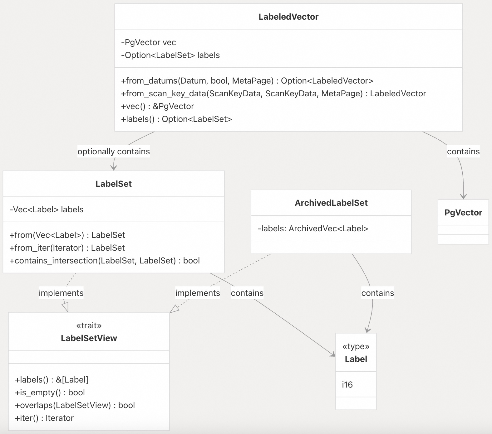
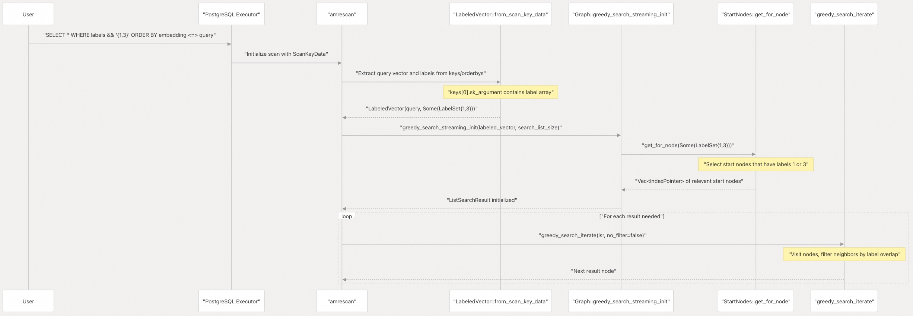
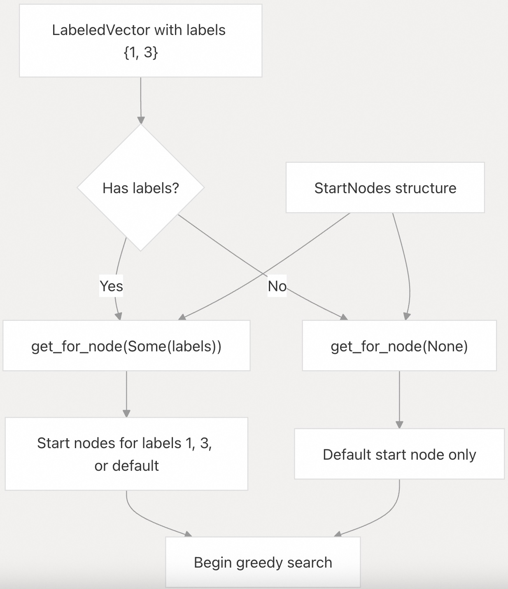
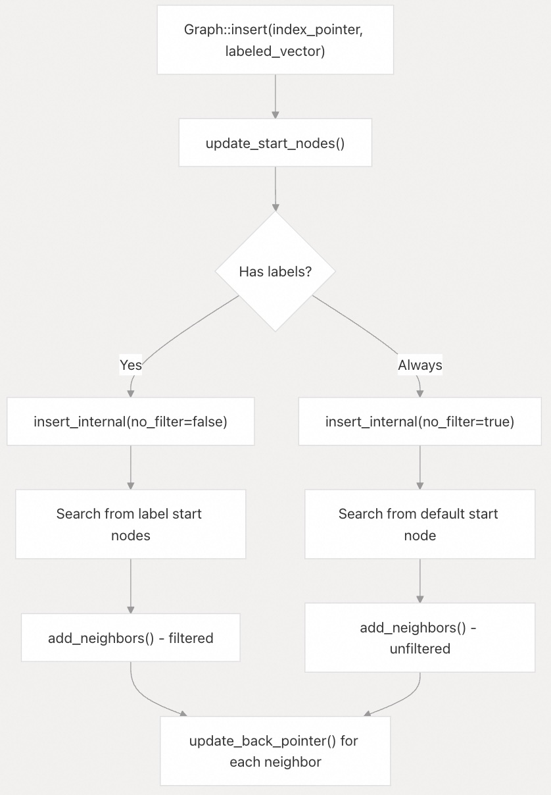
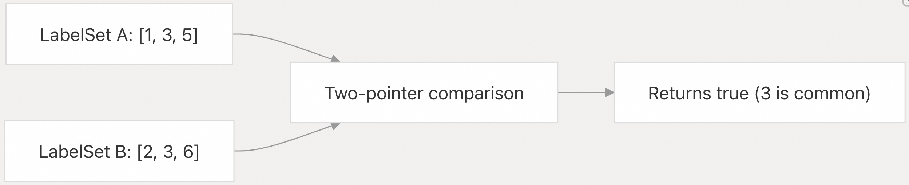
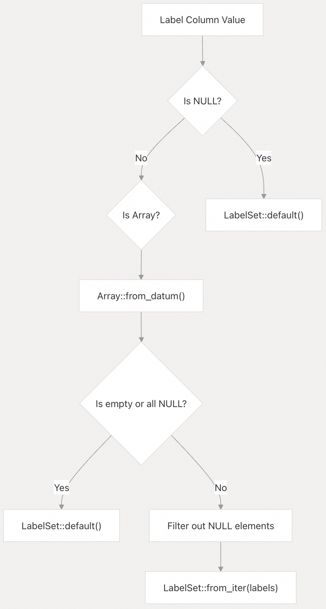

## pgvectorscale 源码学习: 7 Label-Based Filtering (基于标签的过滤)  
                                  
### 作者                                  
digoal                                  
                                  
### 日期                                  
2025-11-11                                  
                                  
### 标签                                  
pgvectorscale , 向量数据库 , DiskANN , StreamingDiskANN , 源码学习                                  
                                  
----                                  
                                  
## 背景                     
**基于标签的过滤** (**Label-based filtering**) 通过将向量与存储为整数数组的**分类标签** (**categorical labels**) 相关联，实现高效的**带过滤条件的向量相似性搜索** (**filtered vector similarity search**)。此功能实现了微软研究院的 **Filtered DiskANN** 算法，允许查询通过**标签成员资格** (**label membership**) 过滤结果，同时保持高**召回率** (**recall**) 和低**延迟** (**latency**)。与在向量搜索后应用的任意 `WHERE` 子句过滤 (**post-filtering**) 不同，基于标签的过滤直接集成到**图遍历算法** (**graph traversal algorithm**) 中。  
  
## Label Data Representation (标签数据表示)  
  
### Label Type and LabelSet Structure (标签类型与 LabelSet 结构)  
  
标签在内部表示为 **16 位有符号整数** (`i16`)，以与 PostgreSQL 的 `SMALLINT` 类型对齐，支持从 -32768 到 32767 的值。  
  
    
  
**LabelSet** 将标签存储为**已排序、去重**的向量。这种表示方式可以使用**二分查找算法** (**binary search algorithms**) 实现高效的**重叠检查** (**overlap checking**) 和**交集操作** (**intersection operations**)。`LabelSetView` **特征** (**trait**) 为拥有的 (`LabelSet`) 和已归档的 (`ArchivedLabelSet`) 表示提供了一个通用接口。  
  
来源:  
[`pgvectorscale/src/access_method/labels/mod.rs` 11-159](https://github.com/timescale/pgvectorscale/blob/36271fa5/pgvectorscale/src/access_method/labels/mod.rs#L11-L159)  
  
### Label Construction and Normalization (标签构建与标准化)  
  
从向量或迭代器构建 `LabelSet` 时，标签会自动**排序**和**去重** (**deduplicated**):  
  
```rust  
impl From<Vec<Label>> for LabelSet {  
    fn from(mut labels: Vec<Label>) -> Self {  
        labels.sort_unstable();  
        labels.dedup();  
        Self { labels }  
    }  
}  
```  
  
这种**标准化** (**normalization**) 确保了表示一致性，并实现了高效的集合操作。  
  
来源:  
[`pgvectorscale/src/access_method/labels/mod.rs` 30-47](https://github.com/timescale/pgvectorscale/blob/36271fa5/pgvectorscale/src/access_method/labels/mod.rs#L30-L47)  
  
## Index Creation with Labels (使用标签创建索引)  
  
要启用基于标签的过滤，请在创建 DiskANN 索引时，将**标签列** (**labels column**) 指定为第二个**索引属性** (**indexed attribute**):  
  
```sql  
CREATE INDEX ON documents   
USING diskann (embedding vector_cosine_ops, labels);  
```  
  
标签列必须是 `SMALLINT[]` 类型。索引创建过程与**无标签索引** (**unlabeled indexes**) 有所不同：  
  
1.  在**索引构建** (**index build**) 期间，带有标签的向量会被插入到**特定标签的子图** (**label-specific subgraphs**) 中。  
2.  为每个唯一的标签单独维护**起始节点** (**Start nodes**)。  
3.  **MetaPage** 通过 `has_labels()` 记录索引是否包含标签。  
  
来源:  
[`README.md` 210-218](https://github.com/timescale/pgvectorscale/blob/36271fa5/README.md#L210-L218)  
[`pgvectorscale/src/access_method/labels/mod.rs` 182-207](https://github.com/timescale/pgvectorscale/blob/36271fa5/pgvectorscale/src/access_method/labels/mod.rs#L182-L207)  
  
## Query-Time Filtering with the && Operator (使用 && 运算符进行查询时过滤)  
  
查询使用**数组重叠运算符** (`&&`) 进行标签过滤，该运算符检查**查询数组**中的任何标签是否与**文档**中的任何标签匹配:  
  
```sql  
SELECT * FROM documents  
WHERE labels && ARRAY[1, 3]  -- Documents with label 1 OR 3  
ORDER BY embedding <=> '[...]'  
LIMIT 10;  
```  
  
### Query Processing Flow (查询处理流程)  
  
    
  
**扫描键** (**scan key**) 数据结构包含：  
  
  * `keys[0].sk_argument`: 来自 `WHERE` 子句的标签数组  
  * `orderbys[0].sk_argument`: 来自 `ORDER BY` 的查询向量  
  
来源:  
[`pgvectorscale/src/access_method/labels/mod.rs` 209-238](https://github.com/timescale/pgvectorscale/blob/36271fa5/pgvectorscale/src/access_method/labels/mod.rs#L209-L238)  
[`pgvectorscale/src/access_method/graph/mod.rs` 331-354](https://github.com/timescale/pgvectorscale/blob/36271fa5/pgvectorscale/src/access_method/graph/mod.rs#L331-L354)  
  
## Integration with DiskANN Graph Search (与 DiskANN 图搜索的集成)  
  
### Start Node Selection (起始节点选择)  
  
标签过滤始于图搜索**初始化** (**initialization**) 阶段，通过选择适当的**起始节点** (**start nodes**):  
  
    
  
`StartNodes` 结构维护了从标签到图**入口点** (**entry points**) 的映射。当查询带有标签时，搜索将从拥有这些标签中的任何一个的节点开始，确保搜索探索图中的相关区域。  
  
来源:  
[`pgvectorscale/src/access_method/graph/mod.rs` 294-303](https://github.com/timescale/pgvectorscale/blob/36271fa5/pgvectorscale/src/access_method/graph/mod.rs#L294-L303)  
[`pgvectorscale/src/access_method/graph/start_nodes.rs`](https://github.com/timescale/pgvectorscale/blob/36271fa5/pgvectorscale/src/access_method/graph/start_nodes.rs)  
  
### Filtering During Graph Traversal (图遍历期间的过滤)  
  
`greedy_search_iterate` 方法接受一个 `no_filter` 参数，该参数控制是否应用标签过滤：  
  
| 参数 | 行为 | 用例 |  
| :--- | :--- | :--- |  
| `no_filter = true` | 在遍历期间**跳过标签检查** (**Skip label checking**) | 无标签查询或构建连接性 (**connectivity**) |  
| `no_filter = false` | 在每个节点处应用**标签重叠检查** (**label overlap check**) | 需要过滤的带标签查询 |  
  
启用过滤时，每个**候选邻居** (**candidate neighbor**) 都使用 `overlaps()` 方法进行检查：  
  
```rust  
pub fn overlaps<T: LabelSetView>(&self, other: &T) -> bool {  
    let a = self.labels();  
    let b = other.labels();  
      
    let mut i = 0;  
    let mut j = 0;  
      
    while i < a.len() && j < b.len() {  
        match a[i].cmp(&b[j]) {  
            std::cmp::Ordering::Equal => return true,  
            std::cmp::Ordering::Less => i += 1,  
            std::cmp::Ordering::Greater => j += 1,  
        }  
    }  
    false  
}  
```  
  
该算法运行时间为 **O(n + m)**，其中 *n* 和 *m* 是标签集的大小，利用了排序数组的优势。  
  
来源:  
[`pgvectorscale/src/access_method/labels/mod.rs` 123-142](https://github.com/timescale/pgvectorscale/blob/36271fa5/pgvectorscale/src/access_method/labels/mod.rs#L123-L142)  
[`pgvectorscale/src/access_method/graph/mod.rs` 357-385](https://github.com/timescale/pgvectorscale/blob/36271fa5/pgvectorscale/src/access_method/graph/mod.rs#L357-L385)  
  
### Dual-Path Insertion Strategy (双路径插入策略)  
  
当将一个带标签的向量插入到索引中时，系统使用**双路径策略** (**dual-path strategy**) 来维护**过滤和未过滤的连接性** (**filtered and unfiltered connectivity**):  
  
    
  
这确保了：  
  
1.  带标签的查询可以通过**标签过滤路径**找到该向量。  
2.  无标签的查询仍然可以通过**默认图** (**default graph**) 访问到该向量。  
  
来源:  
[`pgvectorscale/src/access_method/graph/mod.rs` 637-660](https://github.com/timescale/pgvectorscale/blob/36271fa5/pgvectorscale/src/access_method/graph/mod.rs#L637-L660)  
[`pgvectorscale/src/access_method/graph/mod.rs` 662-717](https://github.com/timescale/pgvectorscale/blob/36271fa5/pgvectorscale/src/access_method/graph/mod.rs#L662-L717)  
  
## Label Operations (标签操作)  
  
### Overlap Checking (重叠检查)  
  
`overlaps()` 方法通过利用**排序数组表示** (**sorted array representation**)，高效地确定两个标签集是否共享任何标签：  
  
    
  
该算法维护两个指针，分别在两个数组中，推进值较小的指针，直到找到匹配项或数组耗尽。  
  
来源:  
[`pgvectorscale/src/access_method/labels/mod.rs` 123-142](https://github.com/timescale/pgvectorscale/blob/36271fa5/pgvectorscale/src/access_method/labels/mod.rs#L123-L142)  
  
### Intersection Containment (交集包含)  
  
`contains_intersection()` 方法检查两个标签集的**交集** (**intersection**) 是否完全包含在第三个集合中。这用于**邻居剪枝** (**neighbor pruning**) 期间，以确保保留**基本标签** (**essential labels**):  
  
```rust  
pub fn contains_intersection(&self, a: &LabelSet, b: &LabelSet) -> bool {  
    let a = a.labels();  
    let b = b.labels();  
    let c = self.labels();  
      
    let mut i = 0;  
    let mut j = 0;  
    let mut k = 0;  
      
    while i < a.len() && j < b.len() {  
        match a[i].cmp(&b[j]) {  
            std::cmp::Ordering::Equal => {  
                // Found an intersection element, check if it's in self  
                while k < c.len() && c[k] < a[i] {  
                    k += 1;  
                }  
                if k == c.len() || c[k] > a[i] {  
                    return false;  
                }  
                i += 1;  
                j += 1;  
            }  
            std::cmp::Ordering::Less => i += 1,  
            std::cmp::Ordering::Greater => j += 1,  
        }  
    }  
    true  
}  
```  
  
来源:  
[`pgvectorscale/src/access_method/labels/mod.rs` 84-112](https://github.com/timescale/pgvectorscale/blob/36271fa5/pgvectorscale/src/access_method/labels/mod.rs#L84-L112)  
  
### Application in Neighbor Pruning (在邻居剪枝中的应用)  
  
在**鲁棒剪枝算法** (**robust prune algorithm**) 期间，标签**交集包含**确保被剪枝的邻居保持与带有**基本标签** (**critical labels**) 的节点的连接：  
  
```rust  
// In prune_neighbors, when considering whether to exclude a candidate  
if let Some(labels) = labels {  
    if !existing_neighbor  
        .get_labels()  
        .unwrap()  
        .contains_intersection(candidate_neighbor.get_labels().unwrap(), labels)  
    {  
        continue;  // Skip this candidate in pruning  
    }  
}  
```  
  
这防止了剪枝算法切断通往共享关键标签的节点的路径。  
  
来源:  
[`pgvectorscale/src/access_method/graph/mod.rs` 451-460](https://github.com/timescale/pgvectorscale/blob/36271fa5/pgvectorscale/src/access_method/graph/mod.rs#L451-L460)  
  
## NULL and Empty Label Handling (NULL 和空标签处理)  
  
系统处理三种不同的标签场景：  
  
| 场景 | 存储表示 | 行为 |  
| :--- | :--- | :--- |  
| `NULL` 标签数组 | `LabelSet::default()` (空) | 被视为没有标签 |  
| 空数组 `{}` | `LabelSet::default()` (空) | 被视为没有标签 |  
| 带有 `NULL` 元素的数组 `{1, NULL, 3}` | `LabelSet{1, 3}` | 忽略 `NULL` 元素 |  
  
    
  
这种处理是在 `LabeledVector::from_datums()` 中实现的：  
  
```rust  
let labels: Option<LabelSet> = if meta_page.has_labels() {  
    if *isnull.add(1) {  
        Some(LabelSet::default())  
    } else {  
        let arr = Array::<i16>::from_datum(*values.add(1), false);  
        Some(arr.map_or_else(LabelSet::default, |arr| {  
            // Special case for empty or all-NULL arrays  
            if arr.is_empty() || arr.iter().all(|x| x.is_none()) {  
                return LabelSet::default();  
            }  
            let labels_iter = arr.into_iter().flatten();  // Filters out NULLs  
            labels_iter.collect()  
        }))  
    }  
} else {  
    None  
};  
```  
  
来源:  
[`pgvectorscale/src/access_method/labels/mod.rs` 186-205](https://github.com/timescale/pgvectorscale/blob/36271fa5/pgvectorscale/src/access_method/labels/mod.rs#L186-L205)  
[`README.md` 374-378](https://github.com/timescale/pgvectorscale/blob/36271fa5/README.md#L374-L378)  
  
## Implementation Architecture (实现架构)  
  
### Core Data Structures and Their Relationships (核心数据结构及其关系)  
  
    
  
来源:  
[`pgvectorscale/src/access_method/graph/mod.rs` 22-72](https://github.com/timescale/pgvectorscale/blob/36271fa5/pgvectorscale/src/access_method/graph/mod.rs#L22-L72)  
[`pgvectorscale/src/access_method/graph/neighbor_with_distance.rs`](https://github.com/timescale/pgvectorscale/blob/36271fa5/pgvectorscale/src/access_method/graph/neighbor_with_distance.rs)  
[`pgvectorscale/src/access_method/graph/start_nodes.rs`](https://github.com/timescale/pgvectorscale/blob/36271fa5/pgvectorscale/src/access_method/graph/start_nodes.rs)  
  
### Label Storage in Nodes (节点中的标签存储)  
  
标签与向量一起存储在**归档节点结构** (**archived node structures**) 中。`PlainStorage` 和 `SbqSpeedupStorage` 实现都维护标签：  
  
```rust  
// In archived node structures  
pub struct ArchivedPlainNode {  
    pub heap_pointer: HeapPointer,  
    pub labels: Option<ArchivedLabelSet>,  
    pub full_vector: ArchivedVec<f32>,  
    pub neighbor_count: u16,  
}  
  
pub struct ArchivedSbqNode {  
    pub heap_pointer: HeapPointer,  
    pub labels: Option<ArchivedLabelSet>,  
    pub quantized_vector: ArchivedSbqVector,  
    pub neighbor_count: u16,  
}  
```  
  
存储实现提供了在图操作期间需要时检索标签的方法。  
  
来源:  
[`pgvectorscale/src/access_method/storage/plain_storage.rs`](https://github.com/timescale/pgvectorscale/blob/36271fa5/pgvectorscale/src/access_method/storage/plain_storage.rs)  
[`pgvectorscale/src/access_method/storage/sbq_storage.rs`](https://github.com/timescale/pgvectorscale/blob/36271fa5/pgvectorscale/src/access_method/storage/sbq_storage.rs)  
  
### Neighbor List Management with Labels (邻居列表的标签管理)  
  
`GraphNeighborStore` 维护邻居关系及其标签。设置邻居时，会存储标签以供后续检索：  
  
```rust  
pub fn set_neighbors<S: Storage>(  
    &mut self,  
    storage: &S,  
    neighbors_of: IndexPointer,  
    labels: Option<LabelSet>,  
    neighbors: Vec<NeighborWithDistance>,  
    stats: &mut PruneNeighborStats,  
)  
```  
  
在图遍历期间，`get_neighbors_with_full_vector_distances()` 检索**邻居指针** (**neighbor pointers**) 及其标签，从而在搜索期间启用基于标签的过滤。  
  
来源:  
[`pgvectorscale/src/access_method/graph/neighbor_store.rs`](https://github.com/timescale/pgvectorscale/blob/36271fa5/pgvectorscale/src/access_method/graph/neighbor_store.rs)  
  
## Performance Considerations (性能考量)  
  
基于标签的过滤与 **DiskANN** 相比**后置过滤** (**post-filtering**) 提供了显著更好的性能，原因如下：  
  
1.  **Early Pruning (早期剪枝)**: 在图遍历期间就过滤了**候选者** (**Candidates**)，减少了**距离计算** (**distance computations**) 的次数。  
2.  **Optimized Graph Structure (优化的图结构)**: 特定标签的**起始节点**和**连接性**确保了通往相关结果的高效路径。  
3.  **Streaming Results (流式结果)**: 结果是**增量返回** (**incrementally returned**) 的，无需将整个**候选集** (**candidate set**) 加载到内存中。  
  
标签检查的**开销** (**overhead**) 极小，原因在于：  
  
  * **排序数组表示**使得**重叠检查**为 O(n + m) 时间复杂度。  
  * 标签与**节点数据** (**node data**) **内联存储** (**stored in-line**)，避免了额外的 I/O。  
  * 使用**双指针算法** (**two-pointer algorithms**) 进行高效的标签操作。  
  
来源:  
[`README.md` 183-192](https://github.com/timescale/pgvectorscale/blob/36271fa5/README.md#L183-L192)  
[`pgvectorscale/src/access_method/labels/mod.rs` 123-142](https://github.com/timescale/pgvectorscale/blob/36271fa5/pgvectorscale/src/access_method/labels/mod.rs#L123-L142)  
  
## Operator Implementation (运算符实现)  
  
`SMALLINT[]` 数组的 `&&` 运算符通过 `smallint_array_overlap` 函数由**扩展** (**extension**) 实现：  
  
```rust  
-- Registered as operator && for smallint[]  
CREATE OPERATOR && (  
    LEFTARG = smallint[],  
    RIGHTARG = smallint[],  
    FUNCTION = smallint_array_overlap  
);  
```  
  
在**查询规划** (**query planning**) 期间，**DiskANN 访问方法** (**access method**) 识别此运算符。当**规划器** (**planner**) 在 `WHERE` 子句中看到 `labels && ARRAY[...]` 时，它会将其作为**扫描键数据** (**scan key data**) 传递给索引。  
  
来源:  
[`README.md` 218-219](https://github.com/timescale/pgvectorscale/blob/36271fa5/README.md#L218-L219)  
[`pgvectorscale/src/access_method/labels/filtering_tests.rs` 796-876](https://github.com/timescale/pgvectorscale/blob/36271fa5/pgvectorscale/src/access_method/labels/filtering_tests.rs#L796-L876)  
  
      
#### [PolarDB 学习图谱](https://www.aliyun.com/database/openpolardb/activity "8642f60e04ed0c814bf9cb9677976bd4")
  
  
#### [PostgreSQL 解决方案集合](../201706/20170601_02.md "40cff096e9ed7122c512b35d8561d9c8")
  
  
#### [德哥 / digoal's Github - 公益是一辈子的事.](https://github.com/digoal/blog/blob/master/README.md "22709685feb7cab07d30f30387f0a9ae")
  
  
#### [About 德哥](https://github.com/digoal/blog/blob/master/me/readme.md "a37735981e7704886ffd590565582dd0")
  
  

  
