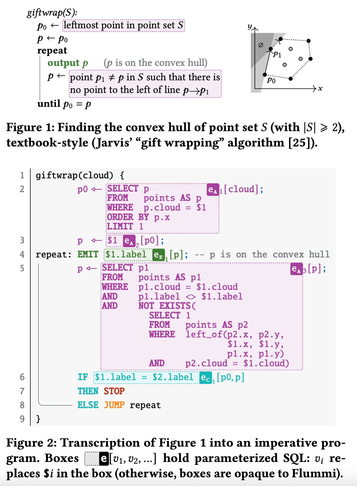
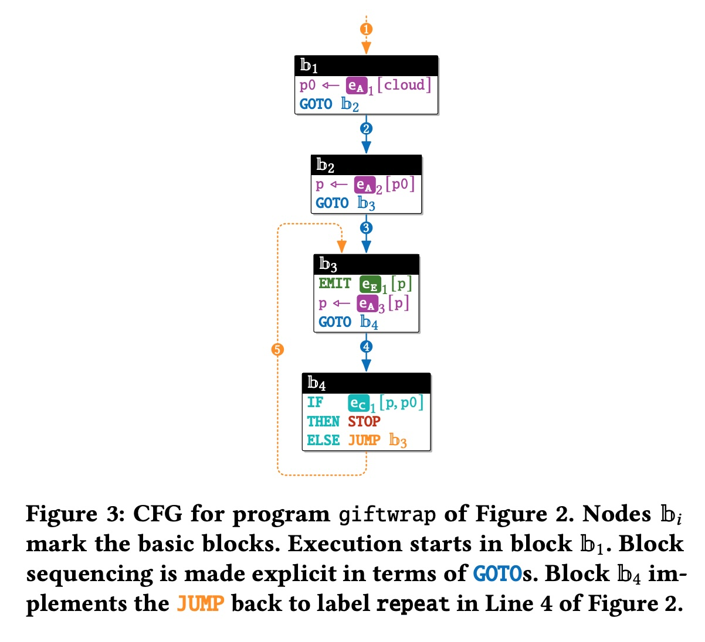
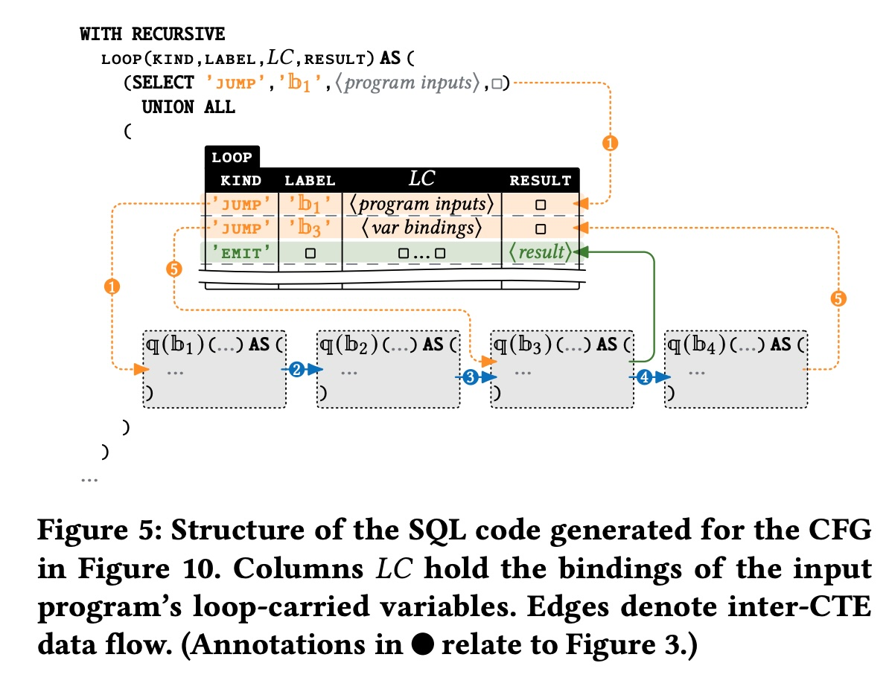
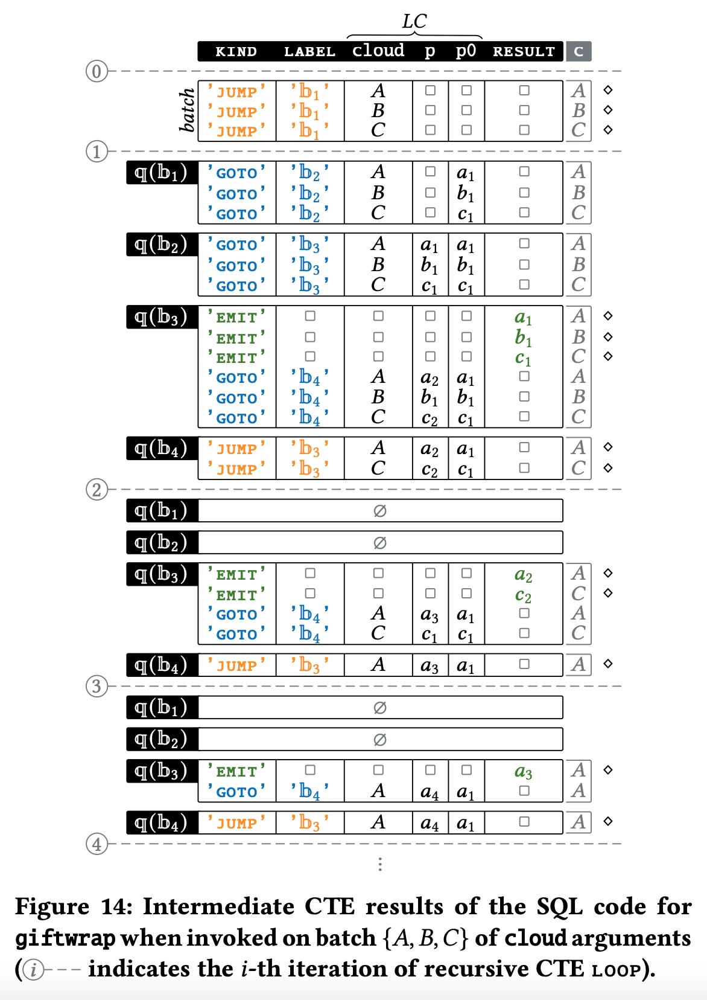
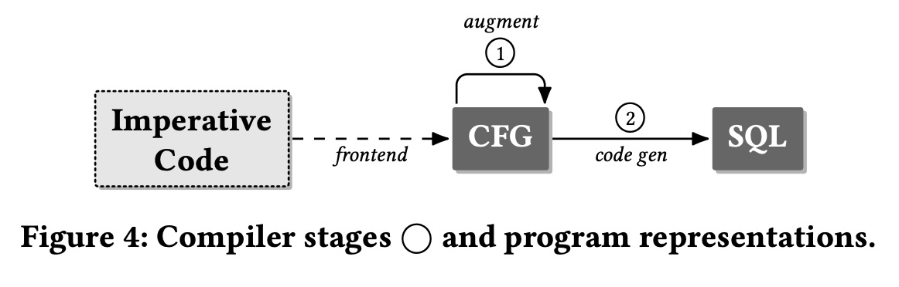
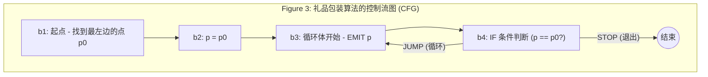
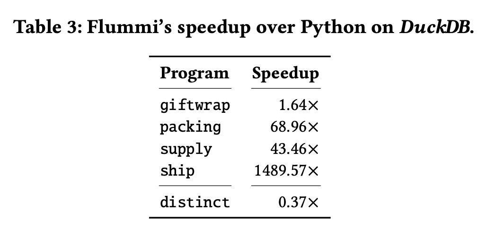
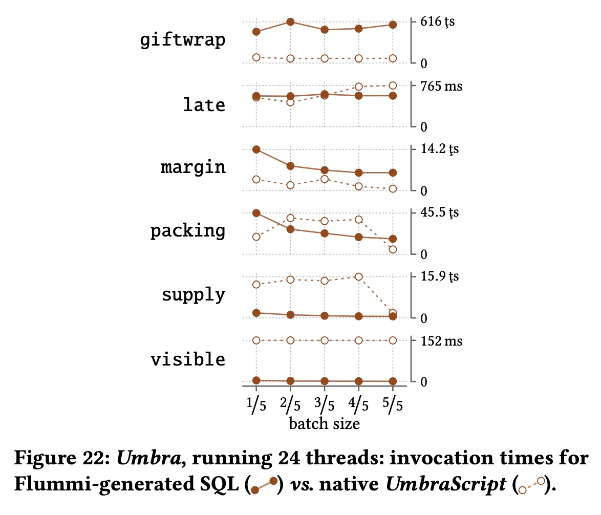
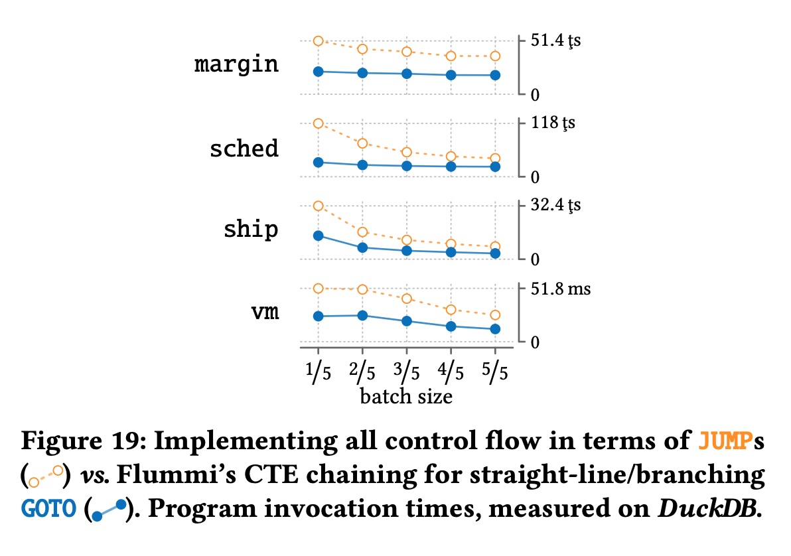

## AI论文解读 | SQL Engines Excel at the Execution of Imperative Programs
        
### 作者        
digoal        
        
### 日期        
2025-11-12        
        
### 标签        
PostgreSQL , PolarDB , DuckDB , AI , 论文解读        
        
----        
        
## 背景  
      
https://www.vldb.org/pvldb/vol17/p4696-fischer.pdf        
  
提示:          
```          
读懂《SQL Engines Excel at the Execution of Imperative Programs》这篇论文需要提前掌握哪些基础知识, 请使用中文通熟易懂的讲解这些基础知识, 可以引用论文中的图、表或使用Markdown支持的图形(text,mermaid等)增加解释性. 
  
使用中文通熟易懂的解读《SQL Engines Excel at the Execution of Imperative Programs》这篇论文, 其中的关键内容请着重讲解, 可以引用论文中的图、表或使用Markdown支持的图形(text,mermaid等)增加解释性. 
  
提取《SQL Engines Excel at the Execution of Imperative Programs》这篇论文中的重要术语, 使用中文对这些术语进行通熟易懂的讲解, 可以引用论文中的图、表或使用Markdown支持的图形(text,mermaid等)增加解释性. 
```     
  
## 1 前置知识 
  
要读懂这篇论文（《SQL 引擎擅长执行命令式程序》），你需要对**计算机科学**、**数据库**和**编译原理**这三个领域的基础知识有一些了解。

这篇论文的核心思想是：**找到一种方法，将我们平时编写的“普通”程序（如 C、Python 或伪代码）自动“翻译”成纯粹的 SQL 查询语句** 。

这样做的目的是，让强大的数据库引擎（比如 DuckDB 或 Umbra）直接运行这些程序 ，从而利用数据库在处理数据和并行计算方面的优势 。

以下是你需要掌握的核心基础知识，我会用通俗的语言来解释：

### 1. 编程语言和编译原理

这是理解“如何翻译程序”的基础。

#### 🧠 知识点一：什么是“命令式”编程？

* **通俗解释：** 这就是我们最熟悉的编程方式。你通过一系列“命令”来告诉计算机“如何一步一步做” 。
* **例子：** “**第 1 步**：设置一个变量 `i = 0`；**第 2 步**：开始一个**循环**；**第 3 步**：如果 `i < 10`，就执行某个操作；**第 4 步**：`i` 增加 1；**第 5 步**：**跳回**第 2 步...”
* **论文中的体现：** 论文中的 **Figure 1** 和 **Figure 2**  展示的 `giftwrap` 算法就是命令式的，它有变量（`p0`, `p`）、有循环（`repeat`）、有条件（`IF`）和跳转（`JUMP`） 。    

#### 🧠 知识点二：什么是“控制流图”（Control Flow Graph - CFG）？

* **通俗解释：** 这是程序执行逻辑的“地图” 。它展示了程序所有可能的执行路径。
* **构成：**
    * **节点（基本块）：** 代表一段“一条路走到底”的连续代码 。
    * **边（箭头）：** 代表执行流动的方向，比如一个 `IF` 语句会产生两个箭头（True 和 False），一个循环会产生一个指回起点的箭头 。
* **论文中的体现：** **Figure 3**  就是 `giftwrap` 程序的“地图”。论文的编译器（名叫 Flummi ）的第一步就是把程序转换成这样的图 。    

    * `b1`、`b2`、`b3`、`b4` 就是四个“基本块”（代码段） 。
    * 从 `b4` JUMP 回 `b3` 的箭头（在图中是 `b4` -> `b3` 的回边）就代表了 `repeat` 循环 。

### 2. 数据库和 SQL 知识

这是理解“翻译成什么”的基础。

#### 🧠 知识点三：什么是“声明式” vs “命令式”？

* **通俗解释：**
    * **命令式（程序）：** 告诉计算机“如何做”（*How*）。
    * **声明式（SQL）：** 告诉数据库“你想要什么”（*What*），数据库引擎自己会决定“如何做”是最高效的。
* **例子：** 你想找“所有 30 岁以上的员工”。
    * **命令式：** “遍历员工表，检查第一个员工，如果年龄 > 30，放入结果。再检查第二个...”
    * **声明式（SQL）：** `SELECT * FROM employees WHERE age > 30;`
* **论文中的体现：** 论文的挑战在于，如何用“声明式”的 SQL 来模拟“命令式”的程序控制流（如循环和跳转）。

#### 🧠 知识点四：什么是“公用表表达式”（Common Table Expression - CTE）？

* **通俗解释：** 你可以把 CTE 理解为 SQL 查询中的“临时变量”（但它存储的是一个表的结果）。它使用 `WITH ... AS (...)` 语法。
* **好处：** 它可以让复杂的查询变得更清晰，把一个大查询拆分成好几个逻辑步骤。
* **论文中的体现：** 论文的“翻译”策略就是把 CFG 中的**每一个“基本块”（如 `b1`, `b2`）都翻译成一个对应的 CTE** 。如 **Figure 5**  所示，`q(b1)`, `q(b2)` 等等都是 CTE。    

#### 🧠 知识点五：【核心】什么是“递归 CTE”？

* **通俗解释：** 这是一种特殊的 CTE，它可以“自己调用自己”，这是在 SQL 中实现**循环**的标准方法 。
* **构成：** 它必须包含两部分：
    1.  **“锚点”成员（Anchor）：** 循环的“起始点”或“初始值”。
    2.  **“递归”成员（Recursive）：** 循环的“下一步”，它会引用 CTE 自己的名字。
* **论文中的体现：** 这是论文实现“循环”和“JUMP”的关键。
    * 如 **Figure 5**  所示，整个查询被一个 `WITH RECURSIVE LOOP (...) AS (...)` 包裹起来。
    * 这个 `LOOP` 表就是所有循环状态的“中转站” 。
    * 当 `b4` 想要 `JUMP` 回 `b3` 时，它并不直接调用 `q(b3)`，而是向 `LOOP` 表中插入一行数据，标记“下一步请从 `b3` 开始” 。
    * 在下一次“递归”迭代中，`q(b3)` 会从 `LOOP` 表中读到这个标记，然后开始执行 。

### 3. 数据库引擎内部机制

这是理解“为什么这样做很快”的基础。

#### 🧠 知识点六：什么是“批处理”（Batching）？

* **通俗解释：** 假设你要执行 1000 次程序（比如为 1000 个不同的点云计算凸包）。
    * **常规做法：** 执行程序 1000 次。
    * **批处理：** 把这 1000 个输入“打包”，**只执行一次“加强版”的程序**，这个程序在内部同时处理这 1000 个输入 。
* **论文中的体现：** **Figure 14**  展示了这一点。输入是 `{A, B, C}` 三个点云 。在整个执行跟踪（Trace）中，你可以看到 `A`, `B`, `C` 的状态是**同时在所有 CTE 中流动**的 。比如在迭代 `(1)` 中，`q(b3)` 同时为 A、B、C 输出了结果（`EMIT`） 。    

#### 🧠 知识点七：什么是“查询去相关”（Query Decorrelation）？

* **通俗解释：** 这是一个数据库的“黑科技”优化。
* **背景：** 有一种查询叫“相关子查询”，它*看起来*必须对外部的“每一行”都单独执行一次子查询（很慢）。
* **去相关：** 现代数据库引擎（如 DuckDB）非常聪明，它能自动把这种“逐行”执行的查询，改写成一个高效的“批处理”查询（比如用 Join） 。
* **论文中的体现：** 论文作者巧妙地利用了这一点。他们生成的 SQL（如 `LATERAL giftwrap(c)` ）*看起来*像是要对每一朵云 `c` 都执行一次 。但支持“去相关”的引擎会自动将其转换成**批处理**模式 ，这正是论文能获得高性能的关键原因。

### 总结

你需要带上这些知识去阅读：

1.  **编程基础：** 知道程序是如何用**控制流图（CFG）** 来表示的。
2.  **SQL 进阶：** 必须理解 **CTE**（`WITH` 语句）和**递归 CTE**（`WITH RECURSIVE`）是如何工作的，因为这是实现循环的唯一工具。
3.  **引擎知识：** 明白**批处理**和**查询去相关**的概念，这能帮你理解为什么论文的方法（把程序翻译成一个大 SQL）会比“循环调用 SQL”快得多。

希望这个解释对你有帮助！你希望我详细解释以上任何一个知识点吗？比如“递归 CTE 是如何工作的”？
  
## 2 解读论文 
  
好的，这是一篇非常“硬核”且有意思的数据库顶会论文。我来为你做一个通俗易懂的解读。

### 一句话总结这篇论文

这篇论文的核心思想是：**我们完全可以将“普通”的程序（例如用 Python 或伪代码写的、包含循环和分支的程序）“翻译”成一个单一、复杂的 SQL 查询语句。**

这么做的好处是，我们可以让强大的现代数据库引擎（如 DuckDB、Umbra）直接运行我们的程序逻辑，从而获得比传统方式（如用 Python 调数据库）快几百倍甚至上千倍的惊人性能 。

-----

### 1\. 论文要解决的“痛点”是什么？

想象一下你是一个厨师（程序），你的食材（数据）都存放在一个大冰箱（数据库）里。

  * **传统做法：** 你（程序）在厨房（应用层）里。你需要一个西红柿，于是你跑向冰箱（数据库），发一个“请求”（`SELECT`），拿一个西红柿，跑回厨房。接着你发现还需要一个鸡蛋，你又跑过去，拿一个鸡蛋... 。这个过程充满了“来回跑”的开销。
  * **论文的思路：** 为什么不把你的**整套菜谱**（也就是你的程序逻辑）直接发给冰箱的管理员（数据库引擎）？他就在冰箱里，拿到菜谱后，他可以非常高效地一次性取完所有食材，用冰箱自带的（多核并行）工具光速把菜做好（执行程序），然后直接给你最终的成品（结果）。

这个“来回跑”的痛点在技术上被称为“阻抗失配”（Impedance Mismatch），而论文的方案就是“**将计算移动到数据**” 。

### 2\. 核心解决方案：Flummi 编译器

为了实现这个目标，作者开发了一个名为 **Flummi** 的编译器 。Flummi 的工作就是把“命令式程序”（我们平时写的带 `if-else`、`while/repeat` 循环的代码）翻译成纯粹的 SQL 查询。

这个翻译过程分两步（如 **Figure 4** 所示）：    

1.  **前端 (Frontend):** 把输入的程序代码（如 Figure 2 的伪代码）转换成一种通用的“程序执行地图”，也就是 **控制流图（Control Flow Graph - CFG）** 。    
2.  **后端 (Code Gen):** 把这个“地图”翻译成 SQL 代码。

-----

### 3\. 【最关键的重点】Flummi 是如何翻译“程序”的？

这是论文最精华的部分。程序有两大核心： **变量（状态）和控制流（分支/循环）** 。SQL 天生擅长处理“状态”（表里的数据就是状态），但它如何处理“控制流”呢？

#### 第一步：万物皆“图” (CFG)

Flummi 首先把程序逻辑变成一张“地图”（CFG）。地图上有：

  * **节点 (Node):** 代表一个“基本块”（Basic Block），即一段“一条路走到黑”的连续代码。
  * **边 (Edge):** 代表“跳转”，即程序的执行方向。

我们以论文中的核心例子 `giftwrap` 算法（一个计算几何“凸包”的算法）为例，它的“地图”如 **Figure 3** 所示 ：  



  * `b1`、`b2`、`b3`、`b4` 就是四个基本块。
  * `b4` 到 `b3` 的箭头就是 `repeat-until` 循环。

#### 第二步：翻译“地图” (SQL Code Gen)

Flummi 如何用 SQL 来“执行”这张地图呢？

**1. 如何翻译“直线”和“分支”（GOTO）？**
这很简单。Flummi 把 **每一个基本块（如 `b1`）都翻译成一个“公用表表达式”（Common Table Expression - CTE）** ，也就是 `WITH` 语句 。

  * `q(b2)`（`b2` 块的 SQL）就从 `q(b1)`（`b1` 块的 SQL）`SELECT` 数据。
  * `q(b3)` 就从 `q(b2)` `SELECT` 数据。
  * 这就像一个流水线，数据（也就是程序的变量）从一个 CTE 流向下一个 CTE。

**2. 【核心魔法】如何翻译“循环”（JUMP）？**
麻烦来了。`b4` 要跳回 `b3`。如果 `q(b3) ... FROM q(b4)` 并且 `q(b4) ... FROM q(b3)`，SQL 就会报错（循环引用）。

**Flummi 的妙招是：使用 `WITH RECURSIVE` （递归 CTE）** 。

它创建了一个名为 `LOOP` 的巨大递归 CTE，这个 `LOOP` 表就像一个 **“中央调度中心”** 。表中的每一行都代表了程序在某一时刻的**完整状态**：

| `KIND` | `LABEL` | `p` (变量) | `p0` (变量) | `RESULT` (输出) |
| :--- | :--- | :--- | :--- | :--- |
| 'JUMP' | 'b1' | NULL | NULL | NULL |
| ... | ... | ... | ... | ... |

**执行过程如下 (见 Figure 5)：**      

1.  **启动 (Anchor):** 递归的“锚点”是往 `LOOP` 表里插入程序的“启动指令”，例如：`('JUMP', 'b1', ...初始输入...)` 。
2.  **递归 (Recursive Step):**
      * 所有基本块的 CTE（`q(b1)`, `q(b2)`...）都从 `LOOP` 表里读取“指令”。
      * `q(b1)` 看到 `('JUMP', 'b1')` 这行，它知道轮到自己执行了。它执行完自己的代码（找到最左边的点），然后*输出*一个“下一步指令”：`('GOTO', 'b2', ...更新后的变量...)`。
      * `q(b2)` 看到 `('GOTO', 'b2')`，执行并输出 `('GOTO', 'b3', ...)`。
      * `q(b3)` 看到 `('GOTO', 'b3')`，执行并输出结果（`EMIT`），然后输出 `('GOTO', 'b4', ...)`。
      * `q(b4)`（IF 语句）看到 `('GOTO', 'b4')`，进行判断：
          * **如果 STOP：** 它就什么也不输出。递归的这一分支结束 。
          * **如果 JUMP：** 它就输出一个 `('JUMP', 'b3', ...)` 指令 。
3.  **循环实现：** 这个 `('JUMP', 'b3', ...)` 指令被 `UNION ALL` 放回了 `LOOP` 表，在**下一次递归迭代**中，`q(b3)` 就会再次看到这个指令，于是又执行了一次 `b3` 块。**循环就这样实现了！**

> **一句话总结这个魔法：Flummi 巧妙地将“程序的控制流”（JUMP）转换为了“SQL 的数据流”（在递归表中插入一行新数据）。**

-----

### 4\. 为什么这种方法快得惊人？

你可能会想，这么复杂的 SQL 语句，能快吗？答案是：**快到离谱**。原因在于现代 SQL 引擎的两个“超能力”：

#### 超能力一：自动“批处理” (Batching)

如果你要为 1000 朵不同的点云（Cloud A, B, C...）运行 `giftwrap` 算法：

  * **传统方式：** 运行 1000 次程序。
  * **Flummi 方式：** Flummi 启动时，直接往 `LOOP` 表的“锚点”里插入 **1000 行**初始指令（`'JUMP', 'b1', CloudA`, `'JUMP', 'b1', CloudB`...）。

接下来的事情就神奇了：**整个 SQL 查询只执行一次**，数据库引擎会*同时*（并行地）处理这 1000 个实例。**Figure 14** 完美展示了这一点：    

在 **Figure 14** 的执行跟踪中，你可以看到 `cloud` 列包含了 `{A, B, C}` 三个批处理的输入。在迭代 `(1)` 中，`q(b3)` 同时为 A、B、C 输出了结果（`EMIT`）。在迭代 `(2)` 中，实例 `B` 运行结束（它的 `IF` 条件为 STOP），但 `A` 和 `C` 的计算仍在继续 。数据库引擎自动处理了这一切！

#### 超能力二：查询去相关 (Query Decorrelation)

“批处理”之所以能自动发生，是因为 Flummi 生成的 SQL 语句（如 `... LATERAL giftwrap(c)`） 恰好能触发数据库的“查询去相关”优化器 。

这个优化器（如 DuckDB 或 Umbra 中所实现的）看到这种“看似要逐行执行”的查询，会自动将其改写为高效的、一次性处理所有数据的“批处理”模式（论文中称为 DEDUP-EVAL-DUP 策略）。

### 5\. 性能对比（“疗效如何”）

Flummi 的方法几乎“吊打”了传统方法：

1.  **vs. Python (见 Table 3 )**     

      * 对于 `giftwrap` 算法，Flummi-SQL 比 Python+DuckDB 快 **1.64** 倍。
      * 对于 `ship` 程序，快了 **1489** 倍！
      * 原因是 Flummi 避免了 Python 解释器和数据库之间数万次的“来回跑” 。

2.  **vs. 数据库原生脚本 (见 Figure 22 )**    

      * Umbra 数据库有自己的原生脚本语言 (UmbraScript)。
      * 但 Flummi-SQL 的性能依然*碾压*了它。
      * 原因是：UmbraScript 是**单线程**执行的 ，而 Flummi 生成的 SQL 查询可以被数据库引擎**全自动地并行**到所有 CPU 核心上执行 。

### 总结

这篇论文的贡献是颠覆性的：

1.  它提供了一套完整的编译策略 (Flummi)，能将**任意复杂的命令式程序**（含循环、分支）翻译成**单一的、纯粹的 SQL 查询** 。
2.  它证明了**SQL 引擎本身就是一个极其高效的“程序运行时” (Runtime Environment)** ，其批处理和并行能力远超我们的想象。
3.  它为“计算-存储一体化”提供了强大的新思路，让我们不必再纠结于是“把数据拿出来算”还是“把程序放进去算”——**程序就是 SQL**。
  
## 3 术语 
  
好的，这篇论文技术性很强，我来为你提取并通俗地讲解其中的关键术语。

这篇论文的核心是将“一步一步”执行的**命令式程序**（如 `for` 循环、`if` 判断）“翻译”成数据库擅长的**声明式 SQL 查询** 。

以下是理解这篇论文需要掌握的重要术语：

### 1\. 核心概念

#### 🧠 命令式程序 (Imperative Programs)

  * **通俗讲解：** 这就是我们最熟悉的编程方式，好比一份详细的“菜谱”，告诉计算机“第一步做什么、第二步做什么” 。它依赖变量、循环和分支（if-else）来控制执行流程 。
  * **论文中的例子：** **Figure 1** 和 **Figure 2**  展示的 `giftwrap`（礼品包装）算法就是一个命令式程序，它有 `repeat` 循环、有变量 `p` 和 `p0`、有 `IF` 判断。       

#### 🧠 Flummi (Flummi 编译器)

  * **通俗讲解：** 这是作者开发的“翻译器”的名字 。它的工作就是读取命令式程序，并把它“翻译”成纯粹的 SQL 查询代码 。
  * **论文中的体现：** **Figure 4**  展示了 Flummi 的工作流程：    
    ```text
    [命令式代码] -> [前端] -> [CFG] -> [代码生成] -> [SQL]
    ```

### 2\. 编译过程的关键术语

#### 🧠 控制流图 (Control Flow Graph - CFG)

  * **通俗讲解：** 这是程序的“执行地图”。Flummi 在翻译之前，会先把程序代码转换成一张图，这张图显示了所有可能的执行路径 。
  * **论文中的体现：** **Figure 3**  就是 `giftwrap` 程序的“地图”。    
      * `b1`, `b2`, `b3`, `b4` 是“基本块”（见下一条）。
      * 箭头代表执行方向，比如 `b3 -> b4`。
      * 从 `b4` JUMP 回 `b3` 的箭头就代表了 `repeat` 循环。

#### 🧠 基本块 (Basic Blocks)

  * **通俗讲解：** 这是 CFG“地图”上的“节点”或“站点” 。一个基本块是一段“一条路走到底”的连续代码，中间没有任何分支或跳转 。
  * **论文中的体现：** 在 **Figure 3** 中，`b1`（找到最左边的点）是一个基本块，`b3`（EMIT p 并找下一个点）也是一个基本块 。

#### 🧠 控制流转数据流 (Control Flow to Data Flow)

  * **通俗讲解：** 这是论文**最核心的魔法**。SQL 中没有“跳回第 3 行”这种指令，那怎么实现循环呢？
      * Flummi 把“执行一个 JUMP 跳转”这个 **动作（控制流）** ，转换成了“往一个表里插入一行数据”这个**数据（数据流）** 。
      * 比如，当 `b4` 块决定要 JUMP 回 `b3` 时，它会向一个叫 `LOOP` 的表中插入一行记录，内容是 `('JUMP', 'b3', ...当前所有变量的值...)` 。
      * `b3` 块的任务就是不停地检查 `LOOP` 表，一旦发现有给自己的 `JUMP` 记录，就拿来执行 。

### 3\. SQL 中的关键术语

#### 🧠 公用表表达式 (Common Table Expressions - CTE)

  * **通俗讲解：** 就是 SQL 中的 `WITH ... AS (...)` 语句。你可以把它理解为定义一个“临时的表变量”，让复杂的查询更清晰 。
  * **论文中的体现：** Flummi 将**每一个“基本块”`b_i` 都翻译成一个 CTE `q(b_i)`** 。如 **Figure 5**  所示，`q(b1)`, `q(b2)` 等等都是 CTE。    

#### 🧠 递归 CTE (Recursive CTE) / `LOOP` 工作台

  * **通俗讲解：** 这是 SQL 中实现循环的“标准武器” (`WITH RECURSIVE ...`) 。
  * **论文中的体现：** **Figure 5**  展示了 Flummi 生成的 SQL 最终结构。它用一个巨大的 `WITH RECURSIVE LOOP (...) AS (...)` 把所有基本块的 CTE 都包了起来。
      * 这个 `LOOP` 表就是那个“中央调度中心” 。
      * 程序的“循环”就是通过 `LOOP` 表的递归（一次又一次地把 `JUMP` 指令喂给基本块）来实现的。

#### 🧠 `GOTO` vs. `JUMP`

  * **通俗讲解：** Flummi 聪明地把“跳转”分成了两种：
      * **`GOTO` (直线/分支)：** 代表“非循环”的跳转 。比如 `b1` 到 `b2`。它被翻译成 CTE 之间的简单引用（`q(b2)` `FROM` `q(b1)`），非常快 。
      * **`JUMP` (循环)：** 代表“循环”跳转 。比如 `b4` 回到 `b3`。它必须通过昂贵的递归 `LOOP` 表来转发 。
  * **论文中的体现：** 区分这两者是性能优化的关键。如果所有跳转都用 `JUMP`（即都走递归），性能会差很多  (如 Figure 19 所示)。    

#### 🧠 `EMIT` (输出语句)

  * **通俗讲解：** 这是命令式程序“输出结果”的方式 。在 `giftwrap` 算法中，每找到一个凸包上的点，它就 `EMIT p`（输出 p）。
  * **论文中的体现：** 在 SQL 中，`EMIT` 被翻译成向 `LOOP` 递归表中插入一行 `KIND = 'EMIT'` 的数据 。最终，查询结果就是从 `LOOP` 表中 `SELECT` 所有 `KIND = 'EMIT'` 的行 。这允许程序“流式”地产生结果，而不是等程序全部跑完才返回一个大数组。

### 4\. 性能加速的关键术语

#### 🧠 批处理 (Batching)

  * **通俗讲解：** 假设你要为 1000 个不同的点云（输入）运行 `giftwrap` 算法。
      * **常规做法：** 运行 1000 次程序。
      * **批处理：** Flummi 生成的 SQL 查询**只执行一次**，但它同时处理这 1000 个输入 。
  * **论文中的体现：** **Figure 14**  完美地展示了这一点。    
      * 在“启动” `(0)` 时，`LOOP` 表有 3 行，代表 `{A, B, C}` 三个不同的输入被“批量”启动了。
      * 在迭代 `(2)` 中，输入 `B` 停止了，但 `A` 和 `C` 还在继续计算 。
      * 数据库引擎自动完成了这种“多实例、不同进度”的并行管理。

#### 🧠 查询去相关 (Query Decorrelation)

  * **通俗讲解：** 这是现代数据库引擎的一个“黑科技”优化 。
  * **论文中的体现：** Flummi 生成的 SQL（如 `... LATERAL giftwrap(c)`） 看似是“对每一行 `c` 都调用一次 `giftwrap`”，这很慢。但支持“去相关”的引擎（如 DuckDB、Umbra）会自动把它优化成我们上面说的“批处理”模式 ，这就是性能的来源。论文中把它总结为 **DEDUP-EVAL-DUP**（去重-求值-复制）三部曲 。
  
## 参考        
         
https://www.vldb.org/pvldb/vol17/p4696-fischer.pdf    
        
<b> 以上内容基于DeepSeek、Qwen、Gemini及诸多AI生成, 轻微人工调整, 感谢杭州深度求索人工智能、阿里云、Google等公司. </b>        
        
<b> AI 生成的内容请自行辨别正确性, 当然也多了些许踩坑的乐趣, 毕竟冒险是每个男人的天性.  </b>        
  
    
#### [PolarDB 学习图谱](https://www.aliyun.com/database/openpolardb/activity "8642f60e04ed0c814bf9cb9677976bd4")
  
  
#### [PostgreSQL 解决方案集合](../201706/20170601_02.md "40cff096e9ed7122c512b35d8561d9c8")
  
  
#### [德哥 / digoal's Github - 公益是一辈子的事.](https://github.com/digoal/blog/blob/master/README.md "22709685feb7cab07d30f30387f0a9ae")
  
  
#### [About 德哥](https://github.com/digoal/blog/blob/master/me/readme.md "a37735981e7704886ffd590565582dd0")
  
  

  
