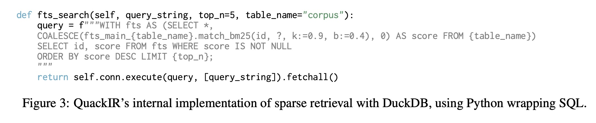
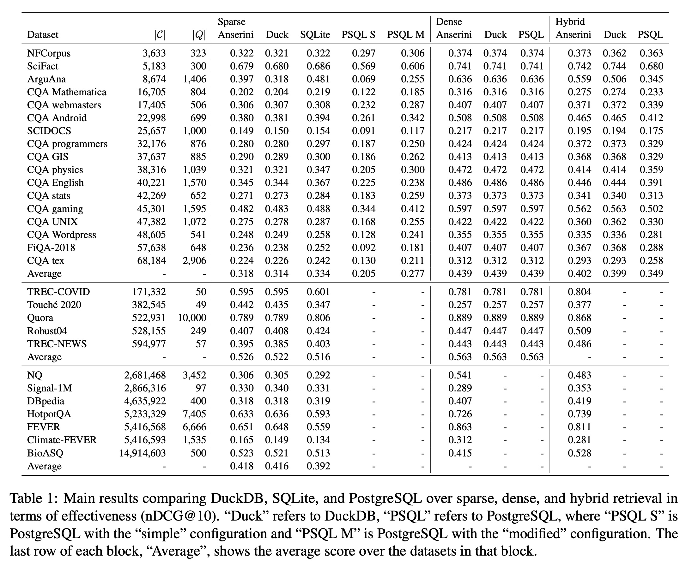
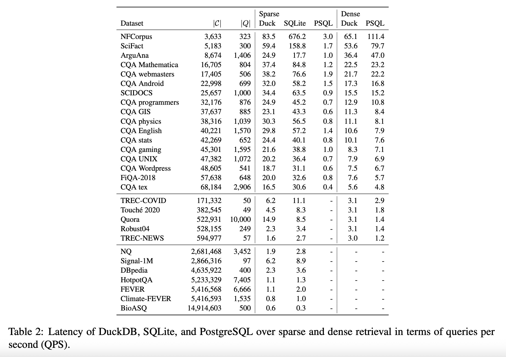
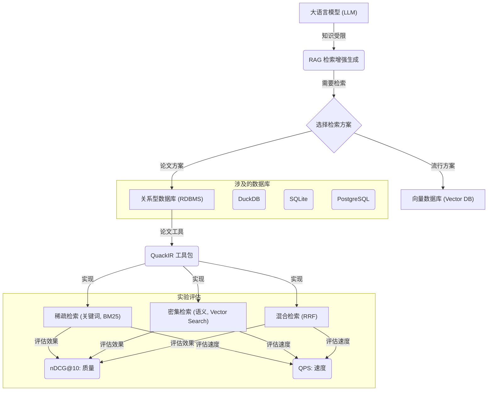
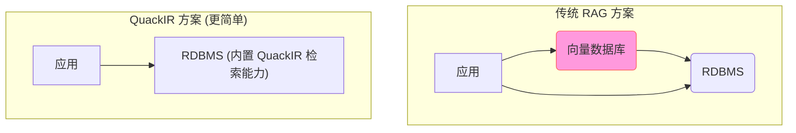
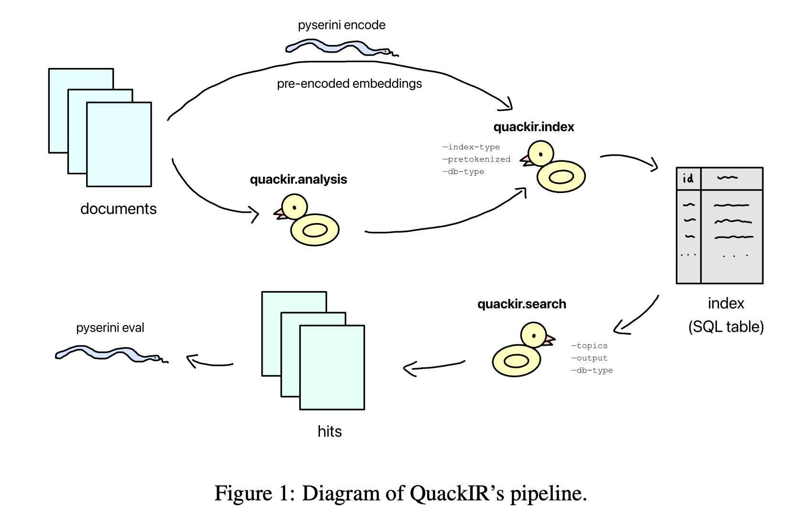

## AI论文解读 | QuackIR: Retrieval in DuckDB and Other Relational Database Management Systems
        
### 作者        
digoal        
        
### 日期        
2025-11-12        
        
### 标签        
PostgreSQL , PolarDB , DuckDB , AI , 论文解读        
        
----        
        
## 背景  
      
https://cs.uwaterloo.ca/~jimmylin/publications/ge-etal-2025-quackir.pdf        
  
提示:          
```          
读懂《QuackIR: Retrieval in DuckDB and Other Relational Database Management Systems》这篇论文需要提前掌握哪些基础知识, 请使用中文通熟易懂的讲解这些基础知识, 可以引用论文中的图、表或使用Markdown支持的图形(text,mermaid等)增加解释性. 
  
使用中文通熟易懂的解读《QuackIR: Retrieval in DuckDB and Other Relational Database Management Systems》这篇论文, 其中的关键内容请着重讲解, 可以引用论文中的图、表或使用Markdown支持的图形(text,mermaid等)增加解释性. 
  
提取《QuackIR: Retrieval in DuckDB and Other Relational Database Management Systems》这篇论文中的重要术语, 使用中文对这些术语进行通熟易懂的讲解, 可以引用论文中的图、表或使用Markdown支持的图形(text,mermaid等)增加解释性. 
```     
  
## 1 前置知识 
  
理解这篇名为《QuackIR: DuckDB 与其他关系型数据库管理系统中的检索》 的论文，您需要具备一些关于 **人工智能（AI）** 、 **信息检索（IR）和数据库** 的基础知识。

这篇论文的核心思想是：当大家都在用专门的“向量数据库”来支持大语言模型（LLM）的检索功能时，我们为什么不直接使用企业中已经广泛部署的“关系型数据库”（如 DuckDB, PostgreSQL）来做同样的事情呢？

下面我将用通俗的语言，为你讲解阅读这篇论文所需的关键基础知识。

### 1\. 🤖 AI 背景：为什么需要“检索”？

#### 1.1 大语言模型 (LLMs)

你可能已经很熟悉像 GPT 或文心一言这样的大语言模型（LLMs）。它们很会聊天和写作，但有一个问题：它们的知识是“冻结”的，只知道训练时的数据，无法获取实时信息，也可能“一本正经地胡说八道”。

#### 1.2 RAG (检索增强生成)

为了解决这个问题，**RAG** (Retrieval-Augmented Generation)  技术诞生了。

  * **RAG 的工作原理：** 当你向 LLM 提问时，系统**首先**去一个知识库（比如公司的内部文档）中“搜索”相关的资料，然后把这些搜到的资料和你的问题**一起**交给 LLM，让它“参考”这些资料来回答你。
  * **论文的动机：** 这种“搜索”步骤，就是“检索”(Retrieval)。RAG 应用的兴起，使得“如何高效地检索”变得至关重要 。

#### 1.3 向量数据库 (Vector Databases)

目前，实现 RAG 最流行的方式是使用“向量数据库”。

  * 它会把所有的文档资料都转换成一串串的数字，称为“向量”（Embeddings）。
  * 当用户提问时，问题也会被转换成一个“向量”。
  * “检索”就变成了“数学题”：在数据库中找到与问题向量“距离”最近的文档向量。
  * 这篇论文提出的 **QuackIR**  就是要挑战这种“必须使用专业向量数据库”的现状 。

-----

### 2\. 🔍 核心技术：信息检索 (IR)

信息检索 (IR) 就是“搜索”的学术名称。这篇论文评估了数据库在这方面的能力，主要涉及以下三种检索方式 ：

#### 2.1 稀疏检索 (Sparse Retrieval)

  * **这是什么？** 这就是传统的“**关键词搜索**”，也叫“全文搜索”。
  * **如何工作？** 它关心你搜索的词（Keyword）是否在文档中**出现**，以及**出现了多少次**。
  * **核心算法 (BM25)：** 论文中频繁提到的 **BM25**  是一种经典的稀疏检索算法。它会根据词频（TF）和逆文档频率（IDF）等因素来计算一个“相关性分数”，分数越高，排名越靠前。

#### 2.2 密集检索 (Dense Retrieval)

  * **这是什么？** 这就是上面提到的“**向量搜索**”(Vector Search) ，它搜索的是“**语义**”而不是字面上的词。
  * **如何工作？** 无论你用什么词，它都能找到意思相近的文档。
      * 例如，你搜索“苹果手机”，它也能找到包含“iPhone 15”的文档，即使“苹果手机”这几个字没有出现。
      * 它通过计算向量之间的“**余弦距离**”(cosine distance)  来判断语义有多接近。
  * **论文中的实现：** 论文中提到了使用“flat indexes”（平面索引），这是一种“暴力”但精确的搜索方式，即把问题向量和数据库中**所有**的文档向量都比较一遍。

#### 2.3 混合检索 (Hybrid Retrieval)

  * **这是什么？** 简单粗暴，就是把“稀疏检索”（关键词）和“密集检索”（语义）的结果**结合起来** 。
  * **为什么需要？** 稀疏检索很精确（搜“BM25”就只给“BM25”），密集检索很智能（搜“苹果手机”能给“iPhone”）。两者结合，效果通常最好。
  * **核心算法 (RRF)：** 论文中使用了 **RRF** (Reciprocal Rank Fusion)  方法来合并两份搜索结果，它根据文档在不同搜索结果中的“排名”来重新打分。

-----

### 3\. 🗃️ 数据库基础 (Databases)

这篇论文的创新点在于，它把上述的“检索”功能，放到了大家用了几十年的“关系型数据库”中去实现 。

#### 3.1 RDBMS (关系型数据库)

你可以把它理解为“超级加强版的 Excel”。数据被组织在结构化的**表 (Table)** 中，有行 (Row) 和列 (Column) 。**SQL** (结构化查询语言) 则是用来操作这些数据库的通用语言。

论文重点测试了三种 RDBMS ：

  * **DuckDB:** 一种新兴的、快速的分析型数据库 。
  * **SQLite:** 一种轻量级的、嵌入式的数据库（你的手机里就有）。
  * **PostgreSQL:** 一种功能强大、非常流行的开源数据库 。

#### 3.2 论文的实现方式

QuackIR 并不是从零造轮子，它是一个“工具包”(toolkit) ，它把复杂的检索逻辑**封装**了起来，转换成底层的 SQL 查询。

例如，论文的 **图 3**  就展示了 QuackIR 内部是如何在 DuckDB 中执行一个稀疏检索（BM25 搜索）的，它本质上是利用了 DuckDB 的 `fts` (全文搜索) 扩展，并调用了 `match_bm25` 函数 。   

> **图 3 节选 (示意)**  
>  
> ```sql
> WITH fts AS (SELECT *,  
> 	COALESCE (fts_main_corpus.match_bm25(id, ?), 0) AS score  
> 	FROM corpus)  
> ```  
>   
> 这段代码的意思就是：在 `corpus` 表中，使用 `match_bm25` 函数计算每个文档 `id` 对于给定查询 `?` 的相关性 `score`。   

-----

### 4\. 📊 如何看懂实验结果？

论文通过 **图 1**  展示了 QuackIR 的工作流程，这个流程的最终目的是得到检索结果 (hits) ，并进行评估 (eval) 。

      

要看懂实验结果 (如 **表 1**  和 **表 2** )，你需要知道两个关键指标：

#### 4.1 nDCG@10 (评估“效果”)

  * **全称：** 10 位归一化贴现累计收益 (Normalized Discounted Cumulative Gain at 10)。
  * **通俗解释：** 这个指标用来衡量搜索结果的 **“质量”** 或 **“相关性”** ，专门看搜索结果的 **前 10 名** 。
  * **如何看：** 分数在 0 到 1 之间，**越高越好**。它不仅要求搜到相关的，还要求最相关的排在最前面。
  * **在论文中：** 表 1  就用 nDCG@10 来比较 DuckDB、SQLite 等在稀疏、密集、混合检索上的效果，并与基准 (Anserini)  对比。

#### 4.2 QPS (评估“速度”)

  * **全称：** 每秒查询次数 (Queries Per Second) 。
  * **通俗解释：** 衡量搜索 **“有多快”** ，即一秒钟能处理多少个搜索请求 。
  * **如何看：** **越高越好**。
  * **在论文中：** 表 2  就用 QPS 来比较不同数据库的检索延迟。

### 总结：你需要掌握的知识点

为了帮你更好地串联，我用 Mermaid 图表总结了这些概念之间的关系：



简单来说，如果你理解了**RAG**（为什么搜）、**稀疏/密集检索**（搜什么）以及**RDBMS**（在哪里搜），你就能抓住这篇论文的核心论点和贡献了。

希望这份讲解对你有帮助！你可以先尝试阅读论文的摘要 (Abstract)  和引言 (Introduction)  部分，看看是否能对应上这些概念。
  
## 2 解读论文 
  
这是一篇非常有价值的论文，它探讨了一个在 AI 时代非常实际的工程问题：**为了使用大语言模型（LLM）的 RAG 功能，我们是否真的需要一个专门的“向量数据库”？**

这篇论文的**核心论点**是：**不需要！**  对于许多企业来说，使用你现有的 **关系型数据库（RDBMS）** ，比如 DuckDB 或 PostgreSQL，就足够了 。

为了证明这一点，作者们开发了一个名为 **QuackIR** 的工具包 ，并进行了一系列实验。

下面，我将为你详细解读这篇论文的关键内容。

### 1\. 核心问题：RAG 带来的“技术栈”膨胀

在解读之前，我们先要明白一个背景：

  * **LLM 的局限：** 大语言模型（如 GPT）只知道它训练时的数据 。
  * **RAG 的出现：** 为了让 LLM 能回答最新问题或基于私有知识（如公司内部文档）回答，诞生了 **RAG (检索增强生成)** 。
  * **RAG 的原理：**
    1.  当用户提问时，系统先去一个知识库中“搜索”（即“检索”）相关信息 。
    2.  把搜索到的信息和用户的问题一起打包，发给 LLM，让它“参考”着回答 。
  * **“新麻烦”：** 这个“搜索”步骤目前最流行的是“向量搜索”。因此，企业被迫在现有的技术栈中，额外增加一个专门的**向量数据库**（Vector Database）来存储和搜索向量 。

这篇论文认为，这种做法**增加了软件栈的复杂性** 。

### 2\. QuackIR 的解决方案：用“旧瓶”装“新酒”

论文提出的方案非常务实：**为什么不直接用企业已经广泛部署的关系型数据库（RDBMS）来做检索呢？** 

作者们开发了 **QuackIR** ，这是一个信息检索（IR）工具包，它允许你在 RDBMS 中直接进行高效检索 。

你可以通过这个图来理解 QuackIR 的定位：



  * **传统方案：** 你的应用既要和 RDBMS（存业务数据）打交道，又要和新的向量数据库（存向量）打交道。
  * **QuackIR 方案：** 你的应用只需要和 RDBMS 打交道，QuackIR 负责让 RDBMS 具备检索能力 。

QuackIR 目前支持三种主流的 RDBMS ：

  * **DuckDB:** 一种快速的、用于分析的数据库 。
  * **SQLite:** 一种轻量级的、嵌入式的数据库 。
  * **PostgreSQL:** 一种功能强大、广泛用于生产的数据库 。

### 3\. QuackIR 支持哪些检索方式？

QuackIR 的强大之处在于它完整地支持了现代检索的三种主流方式 ：

1.  **稀疏检索 (Sparse Retrieval):**

      * **通俗理解：** 就是传统的“**关键词搜索**” 。
      * **核心算法：** **BM25** 。它根据关键词在文档中的出现频率等因素来打分 。

2.  **密集检索 (Dense Retrieval):**

      * **通俗理解：** 就是“**语义搜索**”或“向量搜索” 。
      * **核心算法：** 它把文档和查询都转换成“向量”（即一串数字），然后计算向量之间的“**余弦距离**”来判断语义有多接近 。

3.  **混合检索 (Hybrid Retrieval):**

      * **通俗理解：** “关键词搜索”和“语义搜索” **强强联合** 。
      * **核心算法：** **RRF (倒数排序融合)** 。它把两种搜索的结果按排名进行合并，通常效果最好 。

论文中的 **图 1**（如下所示）清晰地展示了 QuackIR 的工作流，它与 Pyserini 等主流 IR 工具包的流程（分析、索引、搜索、评估）保持一致，易于上手 。    


### 4\. 实验结果：RDBMS 真的够用吗？

这是论文的**核心部分**。作者们在 BEIR 这个标准数据集上 ，对比了 QuackIR (使用 DuckDB, SQLite, PostgreSQL) 和传统 IR 工具包 (Anserini) 的表现。

他们主要看两个指标：

1.  **nDCG@10 (效果)：** 搜索结果前 10 名的**质量**。分数越高，代表搜得越准、越好 。
2.  **QPS (速度)：** **每秒查询次数**。数字越高，代表搜得越快 。

#### 关键结论 (解读 表 1 和 表 2)：  
  

  


**1. 稀疏检索 (关键词搜索)**

  * **效果 (表 1)：**
      * **DuckDB** 和 **SQLite** 的效果与基准 (Anserini) **几乎一样好** 。DuckDB 的结果非常稳定，差距极小 。
      * PostgreSQL 因为没用 BM25 算法，效果较差 。
  * **速度 (表 2)：**
      * **SQLite** 在小数据集上最快 。
      * 随着数据集增大，**DuckDB** 的速度变得非常有竞争力 。
      * PostgreSQL 速度很慢 。

**2. 密集检索 (向量搜索)**

  * **效果 (表 1)：**
      * **DuckDB** 和 **PostgreSQL** 的效果与基准**完全一致** 。这说明 RDBMS 执行“向量搜索”的准确性没问题。
      * (注：SQLite 因缺乏成熟的向量扩展，未进行此项测试) 。
  * **速度 (表 2)：**
      * 在小数据集上 PostgreSQL 稍快，但很快 **DuckDB** 就反超了，在多数情况下**速度更优** 。
      * 不过，两者在大型数据集上的“暴力”搜索（flat indexes）速度都不理想 。

**3. 混合检索 (Hybrid)**

  * **效果 (表 1)：**
      * **DuckDB** 结合了出色的稀疏和密集检索能力，其混合结果也**非常接近基准** 。
      * PostgreSQL 因为稀疏检索拖后腿，混合效果不佳 。

### 5\. 核心结论：DuckDB 是最大赢家

论文的最终结论是 ：

1.  **RDBMS 绝对可行：** 实验证明，关系型数据库完全有能力在 RAG 场景中承担检索任务 。
2.  **DuckDB 特别值得关注：**  论文特别强调 DuckDB 是一个极有潜力的候选者 。
      * 在**稀疏检索**上，它效果稳定（接近基准），速度快且可扩展性好 。
      * 在**密集检索**上，它效果完美（与基准一致），速度优于 PostgreSQL 。
      * 它还具有最灵活的配置 。

### 总结

《QuackIR》这篇论文为企业提供了一个极具吸引力的“平替”方案。它通过 QuackIR 工具包和坚实的实验数据证明：在投入资源购买和维护专门的向量数据库之前，不妨先看看你现有的 RDBMS（尤其是 **DuckDB**）。它们很可能已经足够强大，可以满足你的 RAG 需求，同时让你的系统架构保持简洁 。
  
## 3 术语 
  
嗨，我从这篇《QuackIR: Retrieval in DuckDB and Other Relational Database Management Systems》论文  中提取了几个核心术语，并用通俗易懂的中文为您讲解：

### 1\. RAG (Retrieval-Augmented Generation - 检索增强生成)

**通俗讲解：**
这是目前大型语言模型（LLM，如 ChatGPT）应用中的一种关键技术 。

想象一下，你让 LLM 回答一个专业或时效性很强的问题（比如“昨天的股价”）。如果只靠 LLM“背过”的知识，它可能不知道答案，或者答案已经过时了。

RAG 的流程就是：

1.  **检索 (Retrieval):** 不直接让 LLM 回答，而是先用你的问题去一个外部的知识库（比如公司的内部文档、网页或数据库）里“搜索”相关资料 。
2.  **增强 (Augmented):** 把搜索到的这些资料（作为“上下文”）和你的原始问题**一起**打包发给 LLM 。
3.  **生成 (Generation):** LLM 参考这些“新鲜出炉”的资料来组织答案，从而能给出更准确、更具体、知识更实时的回答 。

**论文中的关联：**
企业为了实现 RAG，通常被告知需要部署专门的“向量数据库” 。而这篇论文提出的 **QuackIR**  想证明：**不需要那么麻烦**，直接用企业现有的**关系数据库**（RDBMS）也能实现 RAG 检索 。

-----

### 2\. RDBMS (Relational Database Management Systems - 关系数据库管理系统)

**通俗讲解：**
这就是我们常说的“传统数据库”，它们以**表格**（由行和列组成）的形式来存储和管理数据 。最著名的例子包括 PostgreSQL、MySQL、SQLite 等 。

**论文中的关联：**
论文认为，几乎所有企业的数据栈（Data Stacks）中都已经有了 RDBMS 。如果能直接利用它们进行 RAG 检索，就可以省去部署和维护一套新的“向量数据库”所带来的额外复杂性 。

QuackIR 工具包  重点在以下三种 RDBMS 上进行了实验：

  * **DuckDB:** 以其强大的分析能力而闻名 。
  * **SQLite:** 是“首选”的嵌入式数据库 。
  * **PostgreSQL:** 在生产环境中部署广泛 。

-----

### 3\. 稀疏检索 vs 密集检索 vs 混合检索 (Sparse vs. Dense vs. Hybrid Retrieval)

这是信息检索（IR）的三种核心技术。论文对它们都进行了测试 。

| 检索类型 | 中文名称 | 工作原理 | 论文中的别名/算法 |
| :--- | :--- | :--- | :--- |
| **Sparse Retrieval** | **稀疏检索** | 基于**关键词匹配** 。它主要关心“词语”本身，比如某个词在文档中出现了多少次 。 | **Full-text Search (全文搜索)** 。<br>主要使用 **BM25** 算法 。 |
| **Dense Retrieval** | **密集检索** | 基于**语义理解** 。它使用深度学习模型将文本（查询和文档）转换成“向量”（即一长串数字） 。 | **Vector Search (向量搜索)** 。<br>通过计算向量间的**余弦距离**来判断相关性 。 |
| **Hybrid Retrieval** | **混合检索** | **融合**上述两种检索的结果 。它试图结合稀疏检索的“精确匹配”和密集检索的“语义理解”优点，以达到更好的效果 。 | 使用 **RRF** (Reciprocal Rank Fusion，倒数排名融合) 算法 。 |

**论文发现：**

  * 在稀疏检索上，DuckDB 的效果（nDCG@10）与基准（Anserini）非常接近  (见下文表1)。
  * 在密集检索上，DuckDB 和 PostgreSQL 的效果都能**精确匹配**基准  (见下文表1)。

**表1：检索效果 (nDCG@10) 对比 (分数越高越好)**

*(摘录自论文表1的平均值部分)*

| 数据集 (平均) | Sparse (Anserini) | Sparse (Duck) | Sparse (SQLite) | Dense (Anserini) | Dense (Duck) |
| :--- | :--- | :--- | :--- | :--- | :--- |
| **Small (Average)** | 0.318 | 0.314 | 0.334 | 0.439 | 0.439 |
| **Medium (Average)** | 0.526 | 0.522 | 0.516 | 0.563 | 0.563 |
| **Large (Average)** | 0.418 | 0.416 | 0.392 | - | - |

-----

### 4\. QuackIR 架构管线 (Pipeline)

**通俗讲解：**
QuackIR 的工作流程模仿了 Anserini 和 Pyserini 这两个知名的 IR 工具包 。我们可以通过论文的图 1 来理解它 ：    

**流程拆解 ：**

1.  **documents (文档):** 准备好你的原始数据 。
2.  **quackir.analysis / pyserini encode:** 对文档进行预处理。
      * **稀疏 (Sparse):** `quackir.analysis`  会进行分词、词干提取等 。
      * **密集 (Dense):** `pyserini encode`  会用模型把文档转成“向量” (embeddings) 。
3.  **quackir.index (索引):** `quackir.index`  把处理好的数据（关键词或向量）加载到数据库中，建成一个 **SQL 表 (table)** 。
4.  **quackir.search (检索):** `quackir.search`  接收用户查询，并将其转换成 SQL 查询语句，在数据库的索引表  中执行搜索。
5.  **hits (结果):** 返回检索到的文档列表 。
6.  **(评估):** 可以使用 `pyserini eval`  等工具来评估检索结果的好坏 。

-----

### 5\. 评估指标：nDCG@10 与 QPS

论文从“效果”和“效率”两个维度来衡量 RDBMS 的检索能力。

  * **nDCG@10 (效果指标):**

      * **@10** 表示只看搜索结果的前 10 项 。
      * **nDCG** (Normalized Discounted Cumulative Gain) 是一个综合评分 。它不仅看你返回的 10 个结果中有多少是“对的”（相关的），**更关心“对的”结果排得有多靠前** 。
      * **分数越高，说明检索效果越好** 。

  * **QPS (Queries Per Second - 效率指标):**

      * 意思是“每秒钟可以处理多少次查询” 。
      * **数字越高，说明数据库处理检索的速度越快，延迟越低** 。
      * **论文发现 (见表2 )：** 在稀疏检索上，SQLite 最快，DuckDB 其次 ；PostgreSQL 则慢到在较大数据集上无法评估 。在密集检索上，DuckDB 的速度优于 PostgreSQL 。

-----

### 总结：论文的核心观点

论文通过 QuackIR 工具包的实验证明 ，RDBMS（特别是 **DuckDB**）完全有潜力作为 RAG 场景中专用向量数据库的“简单替代方案” 。

  * DuckDB 在**稀疏检索**上的效果与基线非常接近 ，在**密集检索**上则完全一致 。
  * 在**速度**上，DuckDB 在扩展时也具有竞争力 。

因此，作者推荐 **DuckDB** 是关系数据库检索领域一个尤其值得关注的选项 。

希望这份解析对您有帮助！如果您想了解某个特定术语（比如 BM25  或 RRF ）的更多细节，请告诉我。
  
## 参考        
         
https://cs.uwaterloo.ca/~jimmylin/publications/ge-etal-2025-quackir.pdf    
        
<b> 以上内容基于DeepSeek、Qwen、Gemini及诸多AI生成, 轻微人工调整, 感谢杭州深度求索人工智能、阿里云、Google等公司. </b>        
        
<b> AI 生成的内容请自行辨别正确性, 当然也多了些许踩坑的乐趣, 毕竟冒险是每个男人的天性.  </b>        
  
    
#### [PolarDB 学习图谱](https://www.aliyun.com/database/openpolardb/activity "8642f60e04ed0c814bf9cb9677976bd4")
  
  
#### [PostgreSQL 解决方案集合](../201706/20170601_02.md "40cff096e9ed7122c512b35d8561d9c8")
  
  
#### [德哥 / digoal's Github - 公益是一辈子的事.](https://github.com/digoal/blog/blob/master/README.md "22709685feb7cab07d30f30387f0a9ae")
  
  
#### [About 德哥](https://github.com/digoal/blog/blob/master/me/readme.md "a37735981e7704886ffd590565582dd0")
  
  

  
