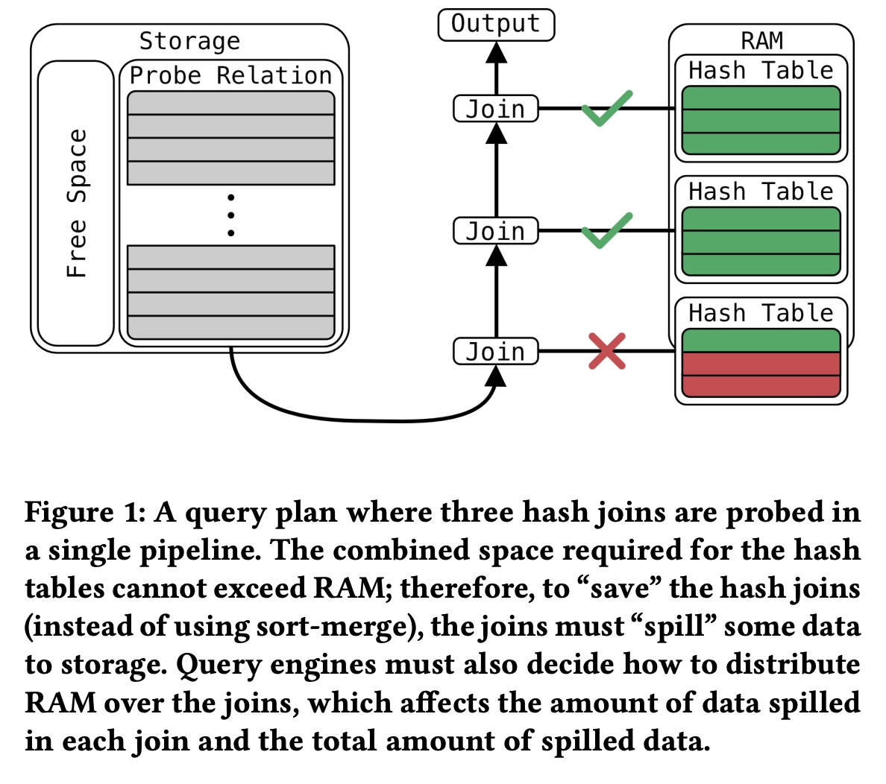
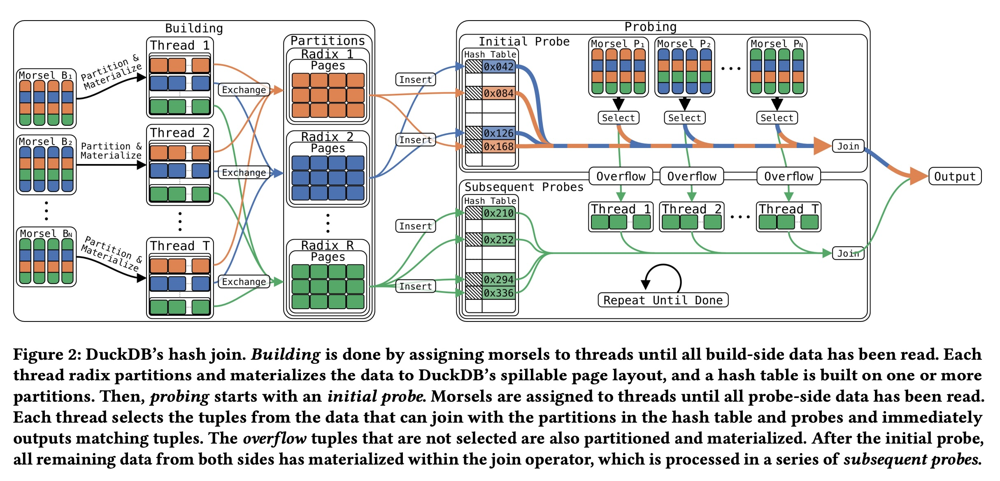
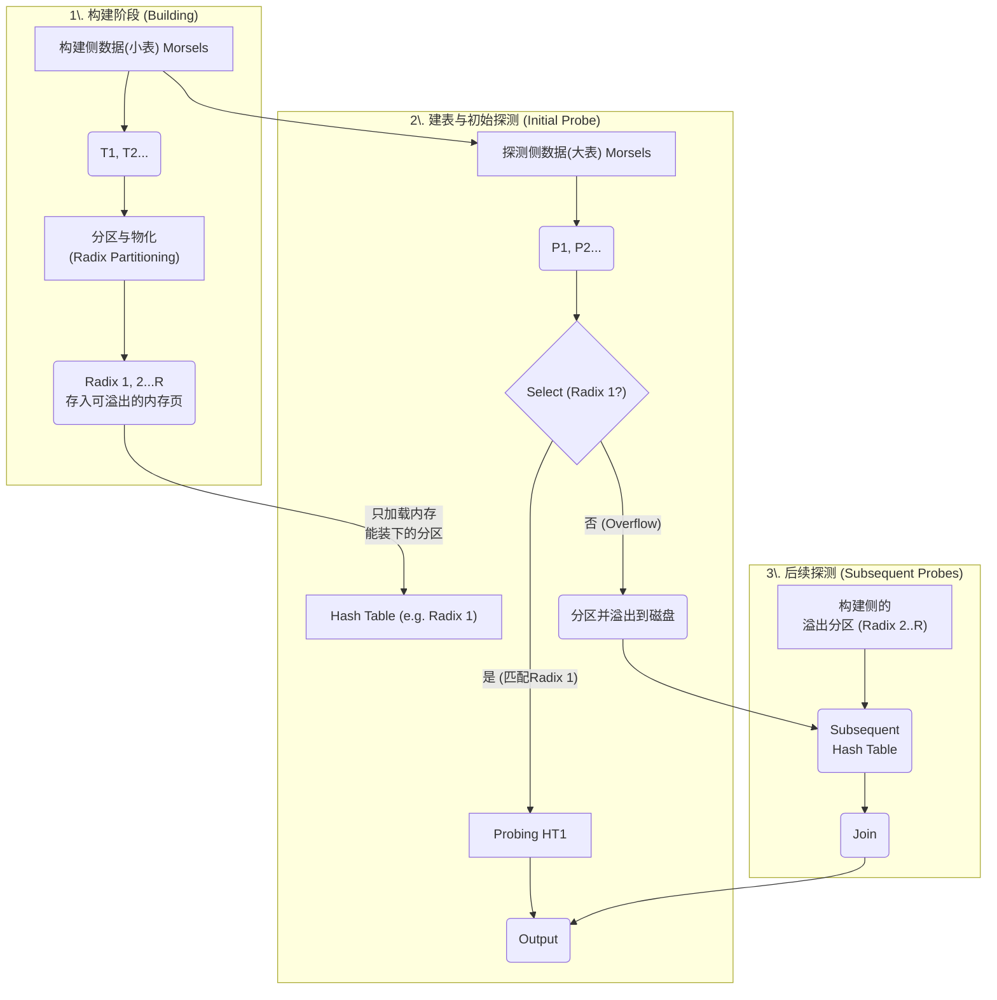
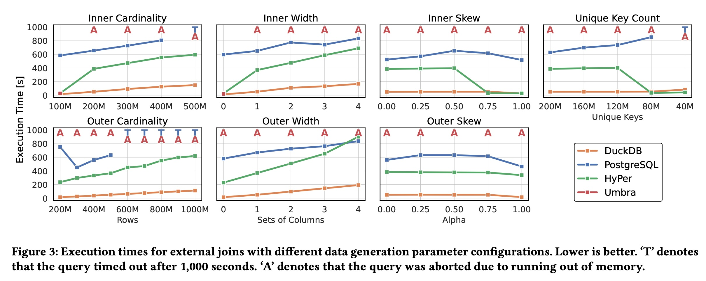
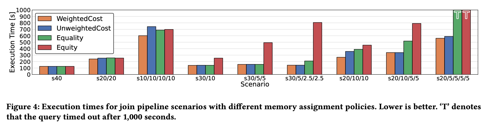
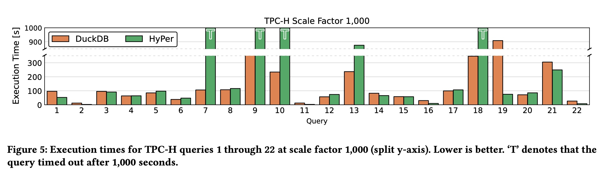
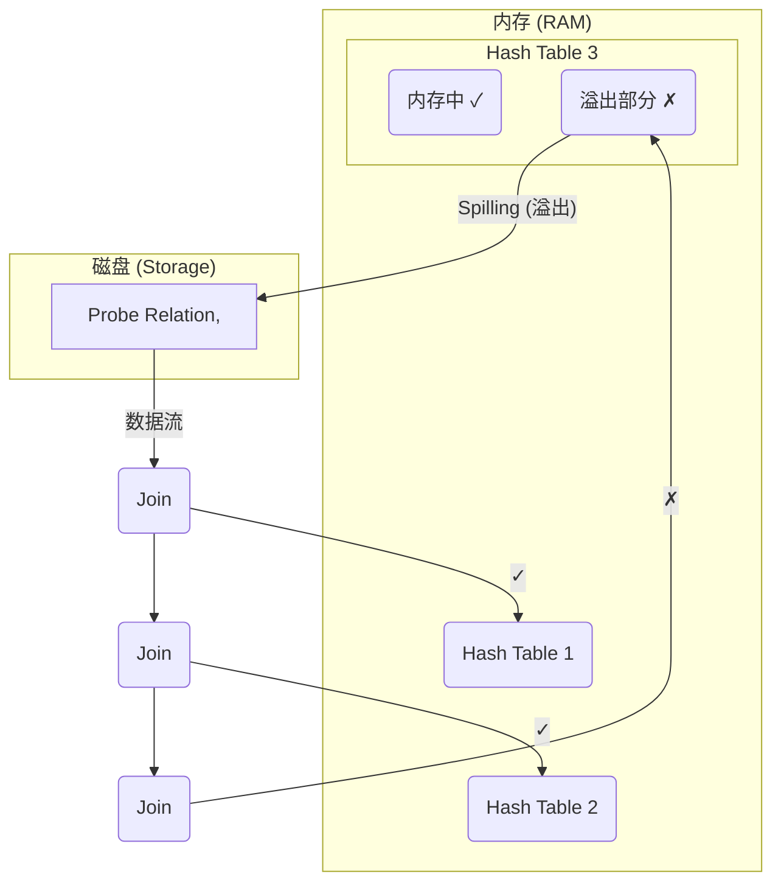

## AI论文解读 | Saving Private Hash Join
        
### 作者        
digoal        
        
### 日期        
2025-11-12        
        
### 标签        
PostgreSQL , PolarDB , DuckDB , AI , 论文解读        
        
----        
        
## 背景  
      
https://www.vldb.org/pvldb/vol18/p2748-kuiper.pdf        
  
提示:          
```          
读懂《Saving Private Hash Join》这篇论文需要提前掌握哪些基础知识, 请使用中文通熟易懂的讲解这些基础知识, 可以引用论文中的图、表或使用Markdown支持的图形(text,mermaid等)增加解释性. 
  
使用中文通熟易懂的解读《Saving Private Hash Join》这篇论文, 其中的关键内容请着重讲解, 可以引用论文中的图、表或使用Markdown支持的图形(text,mermaid等)增加解释性. 
  
提取《Saving Private Hash Join》这篇论文中的重要术语, 使用中文对这些术语进行通熟易懂的讲解, 可以引用论文中的图、表或使用Markdown支持的图形(text,mermaid等)增加解释性. 
```     
  
## 1 前置知识 
  
要读懂《Saving Private Hash Join》这篇论文，你需要对现代数据库系统（特别是分析型数据库）的内部工作原理有一些基础了解。这篇论文的重点是解决一个非常具体但又至关重要的问题：**当数据（特别是哈希连接操作）大到无法装入内存 (RAM) 时，如何避免性能的急剧下降**。

以下是你需要提前掌握的核心基础知识，我会用通俗易懂的方式为你讲解：

---

### 1. 核心知识：什么是哈希连接 (Hash Join)？

这是理解整篇论文的**最基本**要求。

* **什么是“连接” (Join)？**
    想象你有两张表：`订单表` 和 `客户表`。你希望查询“所有订单及其对应的客户信息”。“连接”操作就是通过一个共同的键（比如 `客户ID`），将这两张表合并成一张大表的过程。

* **什么是“哈希连接” (Hash Join)？**
    这是一种实现“连接”操作的**超快算法**，在现代内存数据库中是绝对的主力 。它分为两个阶段 ：

    1.  **构建阶段 (Build Phase):**
        * 数据库会选择两张表中**较小**的那张（称为“构建侧”，Build Side ）。
        * 它会在内存 (RAM) 中创建一个“哈希表” (Hash Table) 。
        * *通俗比喻：* 就像你为了快速查找，提前把这张小表做成了一个“**电话簿**”（哈希表），`客户ID` 是“姓名”，数据行的位置是“电话号码”。

    2.  **探测阶段 (Probe Phase):**
        * 然后，数据库开始读取**较大**的那张表（称为“探测侧”，Probe Relation ）。
        * 每读取一行（比如一个订单），它就拿着这行的 `客户ID` 去查刚刚建好的“电话簿”（哈希表）。
        * 如果“电话簿”里**查到了**，说明找到了匹配的客户，就把两行数据合并后输出 。
        * 如果**查不到**，就跳过。

* **为什么用它？**
    因为在“电话簿”里查一个名字（哈希查找）非常快。只要“电话簿”（哈希表）能**完全放进内存**，哈希连接就是最快的连接算法之一 。

---

### 2. 关键问题：“性能悬崖” (Performance Cliff)

这篇论文要解决的核心问题。

* **理想 vs 现实:**
    理想情况是，你的“构建侧”（那张小表）足够小，内存（RAM）足够大，哈希表能完美地放进内存 。

* **“大于内存” (Larger-than-Memory):**
    现实是，数据量越来越大。如果那张“小表”本身就比你的内存还大，会发生什么？

* **“性能悬崖” (Performance Cliff):**
    传统数据库此时会“崩溃”。它会发现哈希连接玩不转了，被迫切换到一种古老且缓慢的“外部连接算法” (External Join)，比如“排序合并” (Sort-Merge) 。
    * “排序合并”需要先把两张**巨大**的表在磁盘上各自排序，然后再像拉拉链一样把它们合并。这个过程涉及大量的磁盘读写（I/O），速度**慢得令人发指**（可能是内存操作的几百上千倍）。
    * 这种性能从“极快”（内存）到“极慢”（磁盘）的**急剧下降**，就被称为“性能悬崖” 。

* **本文的目标：**
    本文不希望掉下悬崖，而是想找到一个“**斜坡**”。即，当内存不够时，性能会下降，但应该是**平稳地（gracefully）下降** ，而不是暴跌。

---

### 3. 重要概念：流水线 (Pipelining) 与多操作符内存控制

这是论文中问题变得更复杂的场景，也是 Figure 1 所展示的。    

* **什么是“查询执行流水线”？**
    现代数据库执行查询时，就像一条**工厂流水线** 。数据（一行行的元组）从一个工序（操作符，如“扫描”）流向下一个工序（如“连接”），再流向下一个工序（如“聚合”）。这被称为“流式查询执行” (Streaming Query Execution) 。

* **哈希连接是“阻塞点”：**
    在流水线中，哈希连接的“构建阶段”（建电话簿）是一个“**流水线中断点**” (Pipeline Breaker) 。你必须等“电话簿” **完全建好** ，“探测”的数据才能开始流动。

* **Figure 1 的复杂情况：**
    这篇论文的 Figure 1 展示了一个更头疼的场景：**一条流水线上有多个哈希连接** 。

    > **图 1 解释 (Figure 1):**  
    > * 左侧的“Probe Relation”（探测表） 是流水线的输入，它非常大。  
    > * 它需要**连续**和**三个**不同的“构建侧”表（即三个“电话簿”）进行连接 。  
    > * 这意味着，在 RAM（内存）中 ，你必须**同时**放下 **三个哈希表** (Hash Table) 。  
    > * **问题来了：** RAM 的总空间是固定的。这三个哈希表必须**共享**这点可怜的内存 。  

* **“多操作符内存控制” (Multi-operator Memory Control)：**
    这就是论文要解决的第二个大问题：数据库系统必须决定如何给这三个哈希表**分配内存** 。
    * 如果把所有内存都给第一个 Join（如图中上面两个打勾✓的），那第三个 Join（打叉✗的）就没内存了，它就必须把自己的数据（红**色**部分）写到磁盘 (Storage) 上，这叫 **“溢出”(Spilling)** 。
    * 本文提出了一种**动态策略** ，在查询运行时智能地“排兵布阵”，决定给谁多点内存、给谁少点内存，从而让**总体的溢出量（写磁盘的量）降到最低**。

---

### 4. 关键技术：溢出 (Spilling) 与缓冲区 (Buffer Pool)

这是实现“平稳下降”的具体手段。

* **“溢出” (Spilling):**
    这是论文的核心技术之一。当内存不够时，**不要**切换到“排序合并”算法。
    * 而是继续使用哈希连接，但只在内存中保留哈希表的一部分。
    * 把“电话簿”的一部分（比如，L-Z 开头的部分）先 **“溢出”（Spill）** ，即**临时写入磁盘 (Storage)** 。
    * 先把 A-K 的部分处理完，然后再把 L-Z 的部分从磁盘读回内存，继续处理。
    * 这虽然也慢，但只溢出了**部分**数据，且算法结构没变，比“排序合并”整个重来要快得多。

* **“缓冲区” (Buffer Pool) / “统一内存管理” (Unified Memory Management):**
    数据库如何管理内存？它会开辟一块叫“缓冲池” (Buffer Pool) 的大内存区域 。
    * 无论是从磁盘读上来的永久数据，还是哈希连接这种临时数据，都放在这里。
    * 本文利用了 DuckDB 的“统一内存管理” ：即临时数据（哈希表）和永久数据（表数据） **共享** 同一个内存池 。
    * **好处是：** 如果一个哈希连接需要大量内存，它可以“**踢出**” (Evict) 那些不常用的永久数据页 ，腾出空间给自己用。这种灵活性对处理大型连接至关重要。

### 总结：你需要了解什么？

要读懂这篇论文，请确保你脑中有这几个概念：

1.  **哈希连接 (Hash Join)**：它是如何工作的（构建 Build + 探测 Probe）。
2.  **内存 vs 磁盘**：为什么内存操作快，磁盘操作慢。
3.  **性能悬崖 (Performance Cliff)**：当哈希表放不进内存时，传统数据库会从“飞快”变成“巨慢” 。
4.  **溢出 (Spilling)**：本文的解决方案——“打不过，但只跑一半”，即把**部分**数据临时写到磁盘，以换取算法的延续 。
5.  **流水线 (Pipelining)**：多个操作（如多个 Join）如何共享内存，以及为什么需要“**动态内存管理**” 。

带着这些基础知识，你就能理解这篇论文的三大贡献（自适应外部哈希连接 、压缩 、动态内存管理 ）分别是为了解决上述的哪个痛点了。
  
## 2 解读论文 
  
这是一篇关于现代分析型数据库（OLAP）如何处理 **“大于内存”** （Larger-than-Memory）连接操作的论文。

简单来说，它的核心是解决一个问题：当你要处理的数据（特别是哈希连接操作）大到内存 (RAM) 装不下时，如何避免数据库性能“**雪崩式**”下降 。

-----

### 🎯 核心问题：什么是“性能悬崖” (Performance Cliff)？

要理解这篇论文，你首先要知道什么是**哈希连接 (Hash Join)**。

1.  **哈希连接 (Hash Join)**：这是现代数据库最快的连接算法 。
      * **第 1 步：构建 (Build)**。选择两张表中的**小表**（构建侧），在内存 (RAM) 中为它建立一个“**快速查找电话簿**”（即哈希表） 。
      * **第 2 步：探测 (Probe)**。读取**大表**（探测侧），拿大表的每一行数据，去“电话簿”里快速查找匹配项 。

这个算法快的前提是： **“电话簿”（哈希表）必须能完全放进内存** 。

**“性能悬崖”** 就发生在这里：
如果那张“小表”本身就比你的内存还大，“电话簿”就装不下了。这时，传统数据库会“放弃治疗”，被迫切换到一种古老且极慢的算法，比如“**排序合并连接**” (Sort-Merge) 。

这个切换（从 100% 内存操作 $\rightarrow$ 100% 磁盘操作）会导致性能**急剧下降**（慢上百倍甚至上千倍），这就是“性能悬崖” 。

#### 🚀 问题的升级：流水线中的多重连接 (Figure 1)

这篇论文还指出了一个更复杂的情况：**在流式查询 (Streaming Query) 中，多个哈希连接可能在一条“流水线”上同时激活** 。

请看论文的 **Figure 1** ：

> **图 1 场景解释 (Figure 1):**   
>   
>   * 一个“探测侧”数据流（来自左侧 Storage）需要**连续**与 **3 个**不同的哈希表（RAM 中的绿色部分）进行连接。  
>   * 这意味着，你有限的 RAM 必须**同时**容纳 **3 个** “电话簿”。  
>     * **问题来了：** 内存（RAM）总量是固定的。你必须决定如何在这 3 个连接之间分配内存 。  
>     * 如图所示，如果内存只够装下前两个（打勾✓），第三个（打叉✗）就必须把它的数据（红色部分） **“溢出”(Spill)** 到磁盘 (Storage) 上，导致性能急剧下降 。  

**本文的目标：** 不要做“悬崖”，要做“**斜坡**”。即当内存不够时，性能应该**平稳地（gracefully）下降** ，而不是暴跌。

-----

### 💡 论文的三大核心技术

为了实现“平稳降级”，这篇论文（及其在 DuckDB 中的实现）提出了三大技术 ：

#### 1\. 关键技术一：自适应外部哈希连接 (Figure 2 详解)

这是最核心的创新。它重新设计了哈希连接算法，使其能够“**部分在内存，部分在磁盘**”。

核心思想：**内存能装多少，就先处理多少。**

让我们用 **Figure 2**  的流程来解释：     



  * **阶段 1: 构建 (Building)**

      * 当“小表”（构建侧）的数据进来时，系统**不会**立即尝试把它全部塞进一个哈希表。
      * 相反，它会使用“Radix 分区”（一种哈希分区方法）将这些数据**切片**，分成 R 个小块（例如：Radix 1, Radix 2 ... Radix R） 。
      * 这些“切片”被写入一种 **“可溢出”的页面** 。这意味着如果内存管理器（Buffer Manager）发现内存紧张，它可以随时把这些页面踢到磁盘上 。

  * **阶段 2: 初始探测 (Initial Probe)**

      * 系统会查看内存，说：“我大概能装下 k 个分区”。于是它**只**把前 k 个分区（例如 Radix 1）加载到内存中，建成一个**小**哈希表 。
      * 然后，“大表”（探测侧）开始流入 。
      * **进行分流：**
          * 如果大表的数据属于 Radix 1 分区 $\rightarrow$ **快速通道**，立即探测这个小哈希表并输出结果 。
          * 如果数据属于 Radix 2..R (溢出部分) $\rightarrow$ **慢速通道**，将这部分数据也分区并 **溢出（Spill）** 到磁盘 。

  * **阶段 3: 后续探测 (Subsequent Probes)**

      * 处理完 Radix 1 后，系统清空哈希表，然后加载 Radix 2 分区，再从磁盘读取刚溢出的“探测侧 Radix 2”数据进行处理。以此类推，直到所有 R 个分区都处理完毕 。

**效果：**
如果内存很大（能装下 R 个分区），这个算法就退化成 100% 的内存哈希连接 。
如果内存很小（只能装 10%），它也能工作，只是 90% 的数据需要走“慢速通道”。性能下降是**平滑的**，与内存大小成正比，从而避免了“悬崖” 。

#### 2\. 关键技术二：压缩物化 (Compressed Materialization)

这个技术非常直观：**既然溢出到磁盘的数据大小是瓶颈，那我们就压缩它！** 

论文提出了一种“**操作符无关**”（operator-agnostic）的压缩优化器 。

  * **整数压缩 (Integer Compression)**：

      * 如果一个 64 位整数列（占 8 字节）的统计信息（min/max）显示，它的值范围很小（例如都在 1,000,000 和 1,000,100 之间）。
      * 系统会自动将其转换为：`值 - 1,000,000`，然后用一个 8 位整数（占 1 字节）来存储。
      * **效果：空间占用减少 87.5%**。

  * **字符串压缩 (String Compression)**：

      * 在 DuckDB 中，一个（任意长度）字符串 `VARCHAR` 占用 16 字节（包含指针）。
      * 如果统计发现，字符串最大长度就是 3 字节（例如 "USA"）。
      * 系统会把它塞进一个 32 位整数（占 4 字节）里存储 。
      * **效果：空间占用减少 75%**，而且整数比较比字符串比较快得多 。

**效果：**
通过压缩，哈希表和溢出文件都变小了 。这意味着 RAM 能装下更多数据，需要溢出到磁盘的数据也更少。

#### 3\. 关键技术三：动态多操作符内存控制

这解决了 **Figure 1** 中的“**分地盘**”问题。当多个连接（或聚合）操作同时运行时，如何智能地分配内存？    

**错误的策略：**

  * **平均分配 (Equality)**：每个操作符分 1/N 的内存 。这很蠢，因为有些操作符（小表）可能只需要 10MB，而你给了它 1GB，导致浪费。
  * **按需分配 (Equity)**：按操作符（估计）的大小比例分配 。这在估算不准时很危险，而且可能“饿死”小操作符。

**本文的策略：基于成本模型 (Cost Model) 的动态分配。** 

论文提出了一个成本模型 $C(S, A) = M(S, A) \cdot (1 - T(S, A))$ ，它同时优化两个目标：

1.  **$M(S, A)$ ：最小化总物化（溢出）成本** 。 (谁溢出，谁的成本就高)
2.  **$T(S, A)$ ：最大化流水线吞吐率** 。 (如果任何一个操作符被“饿死”（内存为0），吞吐率 $T$ 就会变成 0，导致总成本 $C$ 剧增) 。

**最聪明的地方 (Dynamic)：**
系统如何知道 $S$ （即每个连接的真实大小）？靠“估计”吗？
**不。** 

系统利用了技术一（外部哈希连接）的特性：

1.  **延迟建表**：系统会**延迟**（Delay）真正构建哈希表（最耗内存的步骤）。
2.  **先物化**：它会先执行所有连接的“构建阶段”，把数据都写入“可溢出”的页面（这步不怎么耗内存）。
3.  **获取真相**：当所有物化都完成后，系统就知道了**每一个**连接的**真实、准确**的大小 $S_i$ 。
4.  **动态求解**：此时，它才运行成本模型，通过梯度下降法  求解出最佳的内存分配方案 $A_i$ 。

**效果：**
这种方法**不再依赖（容易出错的）基数估计** ，而是根据运行时观察到的**真实数据大小**来动态、公平地分配内存。

-----

### 📊 实验结果 (一图胜千言)

#### 实验 1：外部连接 (Figure 3) 

对比 DuckDB (本文)、PostgreSQL、HyPer 和 Umbra。    

  * **结果：** DuckDB 是一条平滑的、缓慢增长的直线，性能“平稳降级”。
  * 其他系统则遭遇了“性能悬崖”：
      * Umbra 和 HyPer 在数据刚超过内存时，就直接**崩溃 (A)** 或**超时 (T)** 。
      * HyPer 在某些情况下（如 Inner Skew）会切换到慢速的排序算法，耗时从 30 秒暴涨到 400 秒 。

#### 实验 2：流水线连接 (Figure 4) 

对比本文的 `WeightedCost` 模型和“平均主义”(Equality)、“按需分配”(Equity) 等策略。    

  * **结果：** 在各种复杂的连接组合下（ 例如 $s_{30/10}$ , $s_{20/10/5/5}$ ），本文的成本模型（WeightedCost）都显著优于其他 naive 策略 。`Equity`（按比例分配）表现最差，因为它会“饿死”小连接 。

#### 实验 3：TPC-H (Figure 5) 

在 1000GB 的 TPC-H 基准测试中，这是对系统综合能力的考验。    

  * **结果：** DuckDB 轻松完成了所有 22 个查询 。
  * HyPer（一个顶尖的内存数据库）在 5 个内存密集型查询（如 Q7, 9, 10, 18）上**超时 (T)** 。
  * 这证明了 DuckDB 的外部处理能力（不仅是外部 Join，还包括外部聚合 ）让它能够处理远超内存限制的复杂分析，而 HyPer 被迫切换到极慢的磁盘算法或直接失败 。

### 总结

《Saving Private Hash Join》这篇论文通过三种技术的结合：

1.  **自适应外部哈希连接**（化整为零，分批处理）
2.  **压缩物化**（减少数据量）
3.  **动态内存控制**（基于真实情况，智能分配）

成功地“拯救”了哈希连接，解决了数据库的“性能悬崖”问题。这使得像 DuckDB 这样的现代数据库，能够在（如笔记本电脑）这样内存有限的“经济型硬件”上，处理远超其内存大小的数据集 。
  
## 3 术语 
  
以下是《Saving Private Hash Join》这篇论文中几个最关键的术语，以及它们的通俗讲解。

-----

### 1\. 性能悬崖 (Performance Cliff)

  * **讲解：** 这是一个比喻，指数据库性能“**雪崩式**”下降的现象 。
  * **具体场景：** 现代数据库非常依赖内存 (RAM) 来实现高性能（例如执行“内存哈希连接”）。但如果数据量太大，内存“**装不下**”了 ，系统就不得不切换到一种古老的、基于磁盘的算法（如“排序合并”）。这个切换**不是**性能“下降 10%”，而是**急剧**下降（可能慢几百倍），就像汽车从高速公路突然掉下了悬崖 。
  * **本文目标：** 避免“悬崖”，转而实现“**性能平稳下降**” (Graceful Degradation) ，即内存不够时，性能下降应该像走下一个“斜坡”，而不是掉下“悬崖”。

### 2\. 溢出 (Spilling)

  * **讲解：** 这是应对“内存装不下”问题的一种核心技术，字面意思是“**把东西洒出来**”。
  * **具体场景：** 当一个操作（比如哈希连接）发现内存不够用时，它不会立即“崩溃”或“放弃”，而是把**一部分**临时数据 **“溢出”** （即写入）到磁盘 (Storage) 上，以此“**拯救**” (save) 这个操作，让它能继续运行 。
  * **图 1 (Figure 1) 解释：** 论文的开篇图就展示了这个概念。     
    > * 右侧的 RAM (内存) 中有三个哈希表（Hash Table）。  
    > * 最下面那个哈希表有一半是**红色**的 ，这部分代表它**装不进内存**了。  
    > * 因此，系统必须将这部分红色数据“溢出”到左侧的 Storage (磁盘) 中（如图中弯曲的箭头所示），这导致了该连接失败（红色的 ✗）。  




### 3\. 流式查询执行 (Streaming Query Execution) / 流水线 (Pipeline)

  * **讲解：** 这是一种现代数据库的执行方式，数据像“**流水**”一样在操作符之间传递，而不是等上一步全部执行完。
  * **具体场景：** 在这种模式下，数据（元组）会连续流过一个操作符（如 Join A），然后**立即**流向下游的另一个操作符（如 Join B）。
  * **带来的问题：** 如 **Figure 1** 所示，这会导致**多个**内存密集型操作（比如三个哈希连接）在**同一时间**被激活并**争抢**内存 。如果系统不能很好地管理这种争抢，就会导致严重的性能问题。

### 4\. 多操作符内存控制 (Multi-operator Memory Control)

  * **讲解：** 这正是为了解决上述“流水线”问题而提出的技术。
  * **具体场景：** 当多个操作符（Operators）在流水线上**并发** (Concurrent) 运行时，系统必须有一个策略来**动态地**为它们分配内存 。
  * **核心权衡：** 比如 Figure 1 中有三个 Join，总内存只有 10GB。系统应该给它们“平分”吗？还是应该“优先”满足第一个？这个决策会极大地影响性能 。本文提出的技术就是一种智能的分配策略 。

### 5\. 自适应外部哈希连接 (Adaptive, External Hash Join)

  * **讲解：** 这是本文提出的**核心算法**，是一种更智能的哈希连接。
  * **“External” (外部) 的含义：** 指它有能力处理“大于内存”的数据，即它知道如何“溢出” (Spill) 到**外部**存储（磁盘）。
  * **“Adaptive” (自适应) 的含义：** 它**不需要**在查询执行前就“猜”数据大小。而是在**执行过程中**动态适应 。如果发现内存够，它就表现得像一个纯内存算法；如果发现内存不够，它就**自动**、**平滑**地开始“溢出”部分数据，实现“性能平稳下降”。
  * **图 2 (Figure 2) 解释：** 这个算法（如图 2 所示）会先把“构建侧”数据（小表）分成很多个“Radix 分区” (Radix Pages) 。    
    1.  **初始探测 (Initial Probe)：** 它只把**内存能装下的**分区（比如 Radix 1）建成哈希表 。
    2.  “探测侧”（大表）数据流过时，如果数据属于 Radix 1，就立即连接 ；如果属于其他分区 (Overflow)，就先**溢出**到磁盘 。
    3.  **后续探测 (Subsequent Probes)：** 处理完 Radix 1 后，再加载 Radix 2，重复此过程，直到所有分区处理完毕 。

### 6\. 压缩物化 (Compressed Materialization)

  * **讲解：** 这是本文的另一个核心贡献。“物化”（Materialization）指的就是把临时数据（如哈希表或溢出数据）实际写入内存或磁盘 。
  * **具体场景：** 既然“溢出”数据到磁盘是不可避免的，那我们能不能让“溢出”的**数据量变得更小**？
  * **解决方法：** 在“物化”这些临时数据之前，**自动地对列进行压缩** 。比如，如果一列整数（占 8 字节）的值都在 0-100 之间，系统就自动把它压缩成 1 字节整数 。这样，哈希表占用的内存更少了，需要溢出到磁盘的数据也更少了 。

### 7\. Morsel 驱动的并行 (Morsel-driven Parallelism)

  * **讲解：** “Morsel”意为“一小口”或“一小块”。这是一种实现“并行”查询的方式。
  * **具体场景：** 传统并行（如 Plan-driven）是“**分而治之**”，每个线程（CPU 核心）拿到自己的一份操作符副本 。
  * **Morsel 驱动：** 相反，它是“**协同工作**”。所有线程**共享一个**操作符（例如一个共享的哈希表）。系统把数据切成很多“小块”(Morsels)，然后线程们像“抢任务”一样去处理这些小块 。
  * **好处：** 这种模型更容易实现负载均衡 ，并且因为它只有一个共享的操作符，所以做“多操作符内存控制”时，系统能更简单、更准确地知道这个操作符总共占了多少内存 。
  
## 参考        
         
https://www.vldb.org/pvldb/vol18/p2748-kuiper.pdf    
        
<b> 以上内容基于DeepSeek、Qwen、Gemini及诸多AI生成, 轻微人工调整, 感谢杭州深度求索人工智能、阿里云、Google等公司. </b>        
        
<b> AI 生成的内容请自行辨别正确性, 当然也多了些许踩坑的乐趣, 毕竟冒险是每个男人的天性.  </b>        
  
    
#### [PolarDB 学习图谱](https://www.aliyun.com/database/openpolardb/activity "8642f60e04ed0c814bf9cb9677976bd4")
  
  
#### [PostgreSQL 解决方案集合](../201706/20170601_02.md "40cff096e9ed7122c512b35d8561d9c8")
  
  
#### [德哥 / digoal's Github - 公益是一辈子的事.](https://github.com/digoal/blog/blob/master/README.md "22709685feb7cab07d30f30387f0a9ae")
  
  
#### [About 德哥](https://github.com/digoal/blog/blob/master/me/readme.md "a37735981e7704886ffd590565582dd0")
  
  

  
