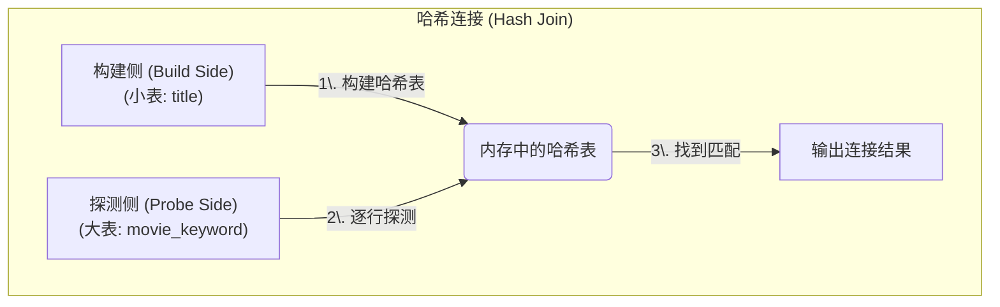
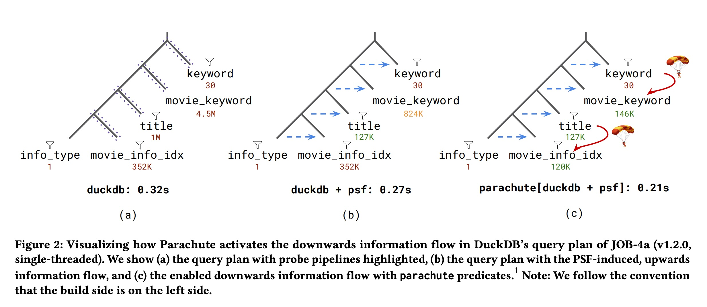
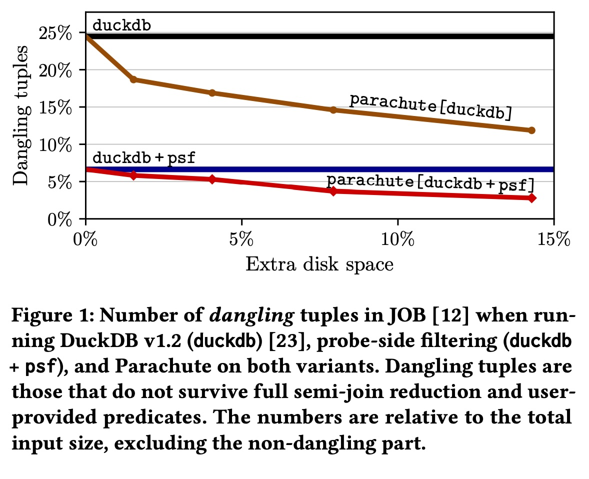
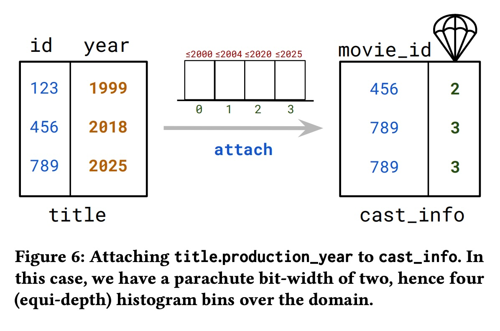
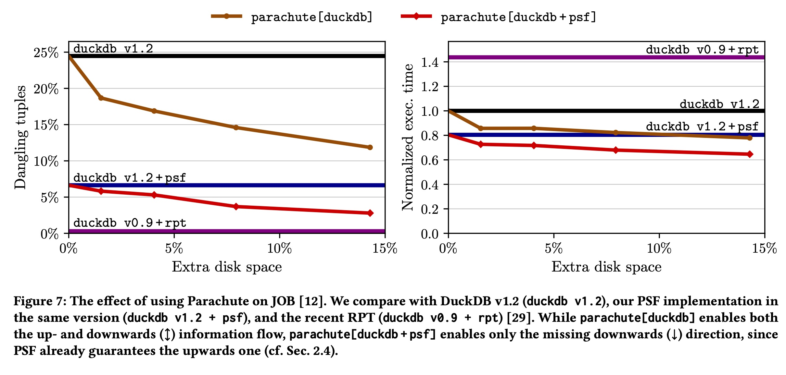

## AI论文解读 | Parachute: Single-Pass Bi-Directional Information Passing
        
### 作者        
digoal        
        
### 日期        
2025-11-12        
        
### 标签        
PostgreSQL , PolarDB , DuckDB , AI , 论文解读        
        
----        
        
## 背景  
      
https://www.vldb.org/pvldb/vol18/p3299-stoian.pdf        
  
提示:          
```          
读懂《Parachute: Single-Pass Bi-Directional Information Passing》这篇论文需要提前掌握哪些基础知识, 请使用中文通熟易懂的讲解这些基础知识, 可以引用论文中的图、表或使用Markdown支持的图形(text,mermaid等)增加解释性. 
  
使用中文通熟易懂的解读《Parachute: Single-Pass Bi-Directional Information Passing》这篇论文, 其中的关键内容请着重讲解, 可以引用论文中的图、表或使用Markdown支持的图形(text,mermaid等)增加解释性. 
  
提取《Parachute: Single-Pass Bi-Directional Information Passing》这篇论文中的重要术语, 使用中文对这些术语进行通熟易懂的讲解, 可以引用论文中的图、表或使用Markdown支持的图形(text,mermaid等)增加解释性. 
```     
  
## 1 前置知识 
  
要透彻理解《Parachute: Single-Pass Bi-Directional Information Passing》这篇论文 ，你需要先掌握一些数据库系统（特别是查询处理）的核心基础知识。

这篇论文探讨的是一个非常具体且前沿的数据库查询优化技术。如果把数据库比作一个庞大的数据仓库，那么“查询”就是你（用户）派发给仓库管理员（数据库系统）的一张“寻货单”。“查询优化”就是管理员寻找最高效的“拣货路径”，而这篇论文提出的 "Parachute" 就是一种新型的、更智能的路径规划方法。

以下是理解这篇论文所需的核心基础知识，我会用通俗的语言和论文中的图示来辅助解释：

### 1\. 基础知识一：数据库查询计划 (Query Plan) 与连接 (Join)

当你要求数据库“查找所有在1980年后上映的、包含‘家庭’(Family)关键词的电影”时 ，数据库不会立即开始蛮力搜索。它会首先制定一个“作战计划”，这个计划就是**查询计划 (Query Plan)**。

这个计划通常是一棵树，叶子节点是原始表（如 `title` 表、`keyword` 表），中间节点是操作（如“连接”、“过滤”）。

  * **连接 (Join)**：这是核心中的核心。它负责将多个表（比如 `title` 和 `movie_keyword`）按照特定条件（如 `t.id = mk.movie_id` ）合并在一起。
  * **哈希连接 (Hash Join)**：这是当今最高效的连接算法之一，也是论文明确提到的实现方式 。理解它至关重要：
      * **构建侧 (Build Side)**：系统选择较小的表（例如 `title` 表），在内存中为它创建一个“哈希表”（可以理解为一个查询极快的字典） 。
      * **探测侧 (Probe Side)**：系统逐行读取那个更大的表（例如 `movie_keyword` 表），拿着每一行的数据去“探测”刚才建好的哈希表，看是否能找到匹配项 。




**你需要理解：** “构建”和“探测”是两个不同的阶段，这个概念是后续所有知识点的前提。

-----

### 2\. 基础知识二：“流水线执行” (Pipelined Execution)

现代数据库并不会等一个操作（比如一个完整的连接）全部完成后才开始下一个操作。它们使用**流水线 (Pipeline)** 的方式 。

  * 一个查询计划会被切分成多个“流水线” 。
  * **关键点：** “构建侧”本身会形成一个流水线，它必须**先执行完毕**，将其结果物化（Materialize）成哈希表 。然后，“探测侧”的流水线才能开始执行 。

在论文的图 2(a) 中，作者用虚线标出了4个不同的流水线 。你看，`info_type` 和 `movie_info_idx` 在一个流水线里，它们必须先执行完，生成一个哈希表；然后 `title` 所在的流水线才能开始“探测”这个表。

  

> **图 2(a)** 展示了查询计划被虚线分成了多个流水线 。执行是有先后顺序的，下面的流水线（构建侧）必须先于上面的流水线（探测侧）执行。

-----

### 3\. 基础知识三：问题的核心：“悬空元组” (Dangling Tuples)

这是论文要解决的**核心痛点**。

  * **什么是“悬空元组”？** 它指的是那些“本不该被处理”的数据行 。
  * **为什么会产生？** 在一个复杂的查询中，一个表（比如 `movie_keyword`）的某一行数据，可能在和 `title` 表连接时是匹配的，但在**后续**和 `keyword` 表连接时，又被 `keyword` 表的过滤条件（如 `k.keyword like 'Family%'`）给筛掉了。
  * **有什么问题？** 这意味着数据库**白白浪费了**大量的计算资源：它从磁盘读取了这行数据，在流水线中处理了它，在哈希连接中探测了它……最后却发现它根本不属于最终结果 。

**你需要理解：** “悬空元组”就是无效的中间数据，是性能的“杀手”。

论文的 **图 1** 非常清晰地展示了这个问题：
在标准的 DuckDB (黑色直线) 中，有高达 **25%** 的元组是“悬空”的 ！这意味着1/4的工作都是无用功。

  

> **图 1** 显示，基准 DuckDB (duckdb) 有约 25% 的悬空元组 。`duckdb+psf`（蓝色直线）减少了一部分，而 `parachute`（红色曲线）则大幅减少了悬空元组 。

-----

### 4\. 基础知识四：现有的解决方案：“横向信息传递” (SIP) 和 “探测侧过滤” (PSF)

为了解决“悬空元组”问题，人们发明了**横向信息传递 (Sideways Information Passing, SIP)** 。

  * **核心思想：** 不要等到连接时才发现数据无效。在执行“构建侧”时，顺便生成一个“过滤器”（比如**布隆过滤器 (Bloom Filter)** ），然后把这个过滤器“横向传递”给“探测侧”。
  * **探测侧过滤 (Probe-Side Filtering, PSF)**：这是 SIP 最常见的实现 。
  * **工作流程（见图 2(b)）** ：
    1.  `info_type`（构建侧）执行时，生成一个过滤器。
    2.  这个过滤器被传递给 `movie_info_idx`（探测侧）。
    3.  `movie_info_idx` 在**读取数据时**就用这个过滤器把无效数据（悬空元组）扔掉 。
    4.  这个过程在流水线中不断“向上”传递（如图中蓝色虚线箭头所示） 。

  

> **图 2(b) ** 展示了 PSF 带来的**向上信息流**（蓝色虚线箭头） 。信息从下方的“构建侧”流向“探测侧”。

**你需要理解：** PSF 是一种优化，它通过在“构建侧”创建过滤器并将其传递给“探测侧”来提前过滤数据。

-----

### 5\. 基础知识五：现有方案的局限：“单向”信息流

这是引出本论文（Parachute）的关键。

PSF 非常好，但它是**单向的 (uni-directional)** 。信息只能从“构建侧”流向“探测侧”（从下往上）。

  * **缺失了什么？** 缺失了**从上到下的信息流**。
  * **看个例子（图 2(b)）** ：
      * `keyword` 表（在最顶端）有一个过滤条件 `k.keyword like 'Family%'` 。
      * 这个过滤条件**其实可以**用来极大地减少它下面 `movie_keyword` 表需要处理的数据量。
      * **但问题是：** `keyword` 是“探测侧”，它要**等到** `movie_keyword`（构建侧） **执行完毕** 后才能开始。当它开始时，`movie_keyword` 已经把所有数据（包括大量悬空元组）都处理完并塞进哈希表了。信息无法“向下”传递 。

### 总结：你需要掌握的知识点

要读懂这篇论文，你需要先明白：

1.  **哈希连接 (Hash Join)**：区分“构建侧”（先执行，建哈希表）和“探测侧”（后执行，查哈希表）。
2.  **流水线执行 (Pipelined Execution)**：理解查询计划中操作的执行顺序和依赖关系。
3.  **悬空元组 (Dangling Tuples)**：理解这是性能浪费的根源，是我们要消除的目标。
4.  **探测侧过滤 (PSF)**：理解这是一种“单向”的优化，信息只能从“构建侧”向上流动到“探测侧”。

当你理解了以上四点，你就能瞬间明白这篇论文的**核心贡献**：

**Parachute**  是一种新技术，它通过**预计算“指纹列” (fingerprint columns)** （可以想象成给表提前贴好的“标签”），**在不破坏“单遍” (single-pass) 执行的前提下** ，**首次实现了“双向” (bi-directional) 信息传递** 。

它补全了 PSF 缺失的“**向下信息流**”（见图 2(c) 中的红色降落伞箭头 ），使得 `keyword` 表的过滤信息可以“穿越”流水线，提前“空降” (Parachute) 到 `movie_keyword` 表上，从而在查询开始的最初阶段就消除海量的“悬空元组” 。
  
## 2 解读论文 
  
这是一篇关于数据库查询优化的重要论文。简单来说，**这篇论文提出了一种名为 "Parachute" (降落伞) 的新技术，它能在不增加额外查询时间（即“单遍”处理）的情况下，实现更智能的数据过滤，从而大幅提升数据库查询速度。**

它解决的核心问题是：数据库在执行JOIN（连接）操作时，常常会读取并处理大量最终会被丢弃的“无用数据”。Parachute技术通过预先计算并存储一些“指纹”（fingerprints），在查询时“空投”(drop) 过滤条件 ，从两个方向上（双向）提前剔除这些无用数据，因此效率远超传统方法。

下面，我将为您详细解读这篇论文的关键内容。

-----

### 🚀 核心思想：从“单行道”到“双向高速”

理解Parachute，我们首先要明白数据库查询中的“信息传递”（Information Passing）是什么。

  * **问题：** 在多表JOIN查询中，最大的开销之一是处理那些“无效元组”（Dangling tuples）——这些数据行在JOIN的中间步骤被读取，但因为无法在最终与其他表匹配上，所以对结果毫无贡献。
  * **传统方案 (PSF - 探针侧过滤):** 目前业界采用一种叫“横向信息传递”（SIP）或“探针侧过滤”（PSF）的技术 。它就像一个**单行道**：在执行JOIN时，系统会为“构建侧”（Build side，通常是较小的表）创建一个过滤器（比如布隆过滤器），然后把这个过滤器传递给“探针侧”（Probe side，通常是较大的表）。这样，探针侧可以提前过滤掉那些“注定”连接不上的数据 。
  * **局限性：** 这种方法**只是单向的**（uni-directional）。如下图 (b) 所示，信息只能从左（构建侧）向右（探针侧）“向上”传递。如果过滤器在探针侧（右侧）呢？比如 `title` 表上有个过滤条件，它没办法“向下”传递给 `movie_info_idx` 表 。

**Parachute 的目标：** 论文的作者们想知道：我们能否在保持PSF这种“单遍”执行（single-pass）优势的同时，实现“双向”（bi-directional）的信息传递？

这就是Parachute的用武之地。它保留了PSF的“上行”过滤，并创新地**通过预计算列（Parachute Columns）来实现“下行”过滤** 。

**图解：信息流的演进**

我们可以用论文中的图2来直观理解这个过程：


* **(a) 原始查询：** 在没有优化的粗略估计中，`movie_keyword` 表需要处理 4.5M（450万）行数据 。
* **(b) PSF（单向）：** 启用了PSF后，信息“向上”流动（蓝色虚线箭头）。`title` 表的元组数从 1M 减少到 127K，`movie_keyword` 减少到 824K 。但注意，`movie_info_idx` 还是 352K 。
* **(c) Parachute（双向）：** Parachute 登场！它开启了缺失的“向下”信息流（红色弯箭头）。`title` 上的过滤器被“空投”到 `movie_info_idx`，使其元组数从 352K 锐减到 128K 。`keyword` 上的过滤器也“空投”到 `movie_keyword`，使其从 824K 进一步锐减到 146K 。


-----

### 🔑 关键技术：什么是“降落伞列” (Parachute Column)？

Parachute 的魔法在于它 **预先计算并物化（存储）** 的“降落伞列”。

这个概念有点像索引，但更轻量和灵活。它是一种存储在**外键（FK）表**上的“指纹”，这个指纹**浓缩了它所连接的主键（PK）表**的相关列信息。

我们用论文中的图6（一个极佳的例子）来解释：    

> **图解：Parachute 列如何“附加”**  
>
> > 
>  
> * **场景：** 我们有两张表，`title`（电影信息，主键表）和 `cast_info`（演职员信息，外键表）。`cast_info.movie_id` 是 `title.id` 的外键。  
> * **目标：** 我们想把 `title` 表的 `year`（年份）列信息，“附加”到 `cast_info` 表上 。
>  
>   * **步骤：**  
>     1.  **分析 `title.year`：** Parachute 首先为 `title.year` 列创建一个“直方图”（histogram），将其值域分成几个桶（bins）。图中，`pbw=2`（2比特）意味着有 $2^2=4$ 个桶 。例如，`...-2000` 是桶0，`2000-2004` 是桶1，`2004-2020` 是桶2，`2020-...` 是桶3 。  
>     2.  **创建降落伞列：** 在 `cast_info` 表上创建一个新的“降落伞列”（图中最右侧带降落伞图标的列）。  
>     3.  **附加数据：** 当 `cast_info` 表的一行（如 `movie_id=456`）被插入时，系统会查找它对应的 `title` 行（`id=456`）。  
>     4.  这行 `title` 的 `year` 是 2018 。  
>     5.  2018 落入直方图的**桶 2** 。  
>     6.  因此，`cast_info` 表中这一行的“降落伞列”就被记为 `2` 。  

**查询时如何工作？**

假设用户发起一个查询，包含条件 `WHERE title.year < 2004`。

  * **没有 Parachute (只有 PSF)：** 数据库必须先扫描 `cast_info`，然后和 `title` 表做JOIN，*最后*才能用 `title.year < 2004` 这个条件去过滤。
  * **有了 Parachute：**
    1.  Parachute 的静态分析器发现这个查询 。
    2.  它将 `title.year < 2004` 这个谓词 **“翻译”** 成对降落伞列的过滤 。根据上面的直方图，`year < 2004` 意味着数据在桶0或桶1。
    3.  所以，查询被改写为在 `cast_info` 表上直接执行 `WHERE parachute_column <= 1`  (桶0或桶1)。
    4.  这个过滤**在JOIN发生前**就完成了，直接在 `cast_info` 表上剔除了大量无效数据，这就是“向下”的信息传递 。

该技术同样支持字符串（通过更复杂的字节指纹） 和数值类型 ，使其非常通用。

-----

### 📊 核心成果：更少的无效数据，更快的查询

论文的评估结果非常有力地证明了 Parachute 的有效性。

#### 1\. 大幅减少“无效元组”（Dangling Tuples）

图1（也是图7左侧）是论文的核心结果展示。它显示了在JOB基准测试中，不同方案剩下多少无效数据：       

> **图1/图7：无效元组百分比 vs. 额外磁盘空间**   
>  
> * **`duckdb` (黑线):** 基准的 DuckDB，有约 25% 的无效元组 。  
> * **`duckdb + psf` (蓝线):** 加上了PSF（单向过滤）后，效果显著，无效元组降至约 6.6% 。  
> * **`parachute[duckdb]` (棕线):** 只用 Parachute (无PSF)，效果不如 `psf`，但随着空间增加（即指纹更精确），无效元组持续下降 。  
> * **`parachute[duckdb+psf]` (红线):** **王牌组合！** 同时使用 PSF（负责上行）和 Parachute（负责下行），实现了双向过滤。在占用约 15% 额外空间时，无效元组被压缩到仅 **2.8%** 。  

这证明了 Parachute 补齐了 PSF 缺失的“下行”过滤能力，两者结合（红线）达到了最佳效果。

#### 2\. 显著的端到端查询加速

减少了无效数据，查询速度自然就快了。在 JOB 基准测试中 ：

  * `parachute[duckdb+psf]` 比原始 DuckDB v1.2 **快 1.54 倍** 。
  * `parachute[duckdb+psf]` 比优化过的 `duckdb+psf` 版本 **快 1.24 倍** 。

#### 3\. 权衡：空间与加载时间

Parachute 并非没有代价。它的主要成本是：

1.  **磁盘空间：** 它需要额外的空间来存储“降落伞列”。如图7所示，1.24倍的加速是在使用 14.35% (约 15%) 额外空间时达成的 。作者认为，在当今存储廉价的OLAP（在线分析处理）系统中，这是完全可以接受的 。
2.  **加载时间：** 预计算需要时间。在数据插入（INSERT）或更新（UPDATE）时，需要额外开销来计算和附加这些指纹 。

-----

### 📜 总结：论文的主要贡献

总而言之，《Parachute》这篇论文的贡献是：

1.  **形式化了信息流：** 首次清晰地形式化定义了数据库查询中的“上行”和“下行”信息流，并证明了现有的PSF技术只是“上行”的单向流 。
2.  **提出了 Parachute：** 设计了一种新颖的“降落伞列”（预计算指纹），存储于FK表上，以低成本实现了缺失的“下行”信息流 。
3.  **实现了单遍双向传递：** 结合PSF（上行）和Parachute（下行），首次实现了 **“单遍执行的
    双向信息传递”**  ，兼顾了传统多遍算法（如Yannakakis）的过滤效果和现代单遍执行引擎的效率。
4.  **验证了卓越性能：** 在标准基准测试上，证明了该技术能带来显著的性能提升（在JOB上最高1.54倍），而空间开销可控 。

Parachute 为数据库系统提供了一种在空间和速度之间进行优雅权衡的新思路，是查询优化领域一个非常实用的进展。

您是否想了解更多关于 Parachute 如何处理特定数据类型（如字符串指纹） 或其对数据更新（Updates） 的影响的细节？
  
## 3 术语 
  
好的，这篇论文中包含了一些数据库查询优化领域的关键术语。以下是这些核心术语的通俗化中文讲解，并结合了论文中的图示进行说明。

-----

### 1\. 无效元组 (Dangling tuples)

  * **通俗讲解：**
    想象一下你在准备一个大型宴会（执行一个查询），需要多道菜（多个表）一起上。你提前准备了很多食材（数据行/元组），但在配菜（JOIN）时，发现有大量食材（比如80%的土豆）根本用不上，因为没有对应的肉（匹配不上），最后只能扔掉。

    这些“最终被扔掉但一开始却被处理了”的食材，就是**无效元组** 。数据库系统在它们身上浪费了大量的IO和计算资源。

  * **论文定义：**
    那些在经过所有JOIN和过滤条件后无法“存活”下来的元组 。

  * **图示（见论文图1/图7）：**
    论文图1（即图7左图）展示了不同方案下“无效元组”的比例。在原始的`duckdb`（黑线）中，有高达25%的元组是无效的 。而`duckdb+psf`（蓝线）降到了约6.6% 。Parachute的目标就是把这个比例降得更低（红线，最低降至约2.8%）。

### 2\. 横向信息传递 (Sideways Information Passing - SIP)

  * **通俗讲解：**
    这是一种查询优化的“战术”。在一个复杂的JOIN流程中，不是傻傻地把两个大表整个JOIN完再过滤，而是在JOIN的过程中，把一个表（比如A表）的过滤信息（比如“我只要ID=1, 2, 3的数据”）“横向”传递给B表，让B表也提前把ID非1, 2, 3的数据扔掉 。这样，参与JOIN的数据量就都变小了。

### 3\. 探针侧过滤 (Probe-Side Filtering - PSF)

  * **通俗讲解：**
    这是**SIP**战术的一种具体实现方式，也是目前业界的主流做法 。
      * 在哈希连接（Hash Join）中，有两个角色：**构建侧**（Build Side，通常是小表，用来建一个“花名册”）和**探针侧**（Probe Side，通常是大表，拿着自己的名字去“花名册”里查询）。
      * PSF的做法是，在“构建侧”建立“花名册”（哈希表）的同时，额外生成一个更简洁的“摘要”或“过滤器”（比如布隆过滤器）。
      * 然后，把这个“摘要”发给“探针侧”，让探针侧在扫描自己海量数据时，先用这个“摘要”过滤一遍，凡是不在“摘要”里的人（数据），就没必要去查“花名册”了，直接淘汰 。

### 4\. 单向/上行信息流 (Uni-directional / Upwards Information Flow)

  * **通俗讲解：**
    这是PSF的**最大局限性**。PSF就像一条**单行道** 。
    信息只能从“构建侧”（小表）流向“探针侧”（大表）。但如果“探针侧”（大表）自己也有很强的过滤条件（比如 `WHERE title.year > 2020`），这个信息是**无法反向传递**给“构建侧”的。

  * **图示（基于论文图2(b)）：**    
    下图(b)中的蓝色箭头就代表PSF的“上行”信息流。信息从 `movie_info_idx` 流向 `title`，再从 `title` 流向 `movie_keyword`。但反向（从 `title` 到 `movie_info_idx`）的路径是堵死的。

    ```mermaid
    graph TD
        subgraph "图 2(b): PSF (单向/上行)"
            direction TB
            mk[movie_keyword 824K] --> k[keyword 38]
            t[title 127K] -- "PSF (上行)" --> mk
            mi[movie_info_idx 352K] -- "PSF (上行)" --> t
            it[info_type 1] --> mi
        end
    ```

### 5\. Parachute (降落伞)

  * **通俗讲解：**
    这就是论文提出的新技术名称 。它像一个“空投”装备，专门用来解决PSF无法实现的“反向”信息传递。

    它通过预先计算并存储一些额外的数据（称为“降落伞列”），当查询发生时，它能把“探针侧”的过滤条件，像“降落伞”一样“空投”到“构建侧”，实现提前过滤。

### 6\. 双向信息传递 (Bi-directional Information Passing)

  * **通俗讲解：**
    PSF（上行） + Parachute（下行） = **双向信息传递** 。
    PSF是“上行”的单行道，Parachute补齐了“下行”的另一条单行道，两者结合，就构成了一个**双向高速公路**，让信息可以在JOIN的两侧自由流动，最大程度地剔除“无效元组”。

  * **图示（基于论文图2(c)）：**
    下图(c)中，蓝色箭头是PSF（上行），而红色的“降落伞”箭头就是Parachute带来的“下行”信息流 。`title` 的信息“空投”给了 `movie_info_idx`，`keyword` 的信息“空投”给了 `movie_keyword`。

    ```mermaid
    graph TD
        subgraph "图 2(c): Parachute (双向)"
            direction TB
            mk[movie_keyword 146K] --> k[keyword 38]
            t[title 127K] -- "PSF (上行)" --> mk
            mi[movie_info_idx 128K] -- "PSF (上行)" --> t
            it[info_type 1] --> mi
            
            t -- "Parachute (下行)" --> mi
            k -- "Parachute (下行)" --> mk
        end
    ```

### 7\. 降落伞列 (Parachute Column)

  * **通俗讲解：**
    这是Parachute技术的核心数据结构。它是一种**预先计算好的“指纹”或“摘要”列** 。
    它通常存储在**外键（FK）表**上 。这一列的值，浓缩了它所连接的**主键（PK）表**中某个列的信息。

  * **图示（基于论文图6）：**
    论文的图6完美解释了这个概念：     

    1.  **目标：** 我们想把 `title` 表（主键表）的 `year` 列信息，附加到 `cast_info` 表（外键表）上 。
    2.  **方法：**
          * 系统首先为 `title.year` 列建立一个“直方图”（图中央），比如把所有年份分成4个“桶”（Bin 0, 1, 2, 3）。
          * 在 `cast_info` 表上创建一个新的“降落伞列”（图右侧带降落伞图标的列）。
          * 当插入 `cast_info` 的一行（如 `movie_id=456`）时，系统查找 `title` 表中 `id=456` 的行，发现其 `year` 是 `2018` 。
          * `2018` 年落在了直方图的 **“桶 2”** 中 。
          * 因此，`cast_info` 表这一行的“降落伞列”的值就被记为 `2` 。

### 8\. 谓词翻译 (Predicate Translation)

  * **通俗讲解：**
    有了“降落伞列”后，当用户查询 `WHERE title.year <= 2000` 时，Parachute的“大脑”（静态分析器）会自动把这个条件“翻译”成：`WHERE parachute_column_for_year <= 0`（假设2000年及以前都落在“桶 0”）。

    这个“翻译”后的条件，可以直接在 `cast_info` 表上执行，在JOIN发生前就过滤掉大量数据，这就是“下行”信息流的实现方式。

### 9\. 降落伞列位宽 (pbw - Parachute Bit-Width)

  * **通俗讲解：**
    指的是用来存储“降落伞列”的比特数（bits）。

      * `pbw` 越小（比如2比特），“桶”越少（只有4个桶），“指纹”就越粗糙，占空间也越小。
      * `pbw` 越大（比如16比特），“桶”就越多（有65536个桶），“指纹”越精确，过滤越准，但占用的额外空间也越多 。

    这提供了一个在**空间和过滤精度（即性能）之间的权衡** 。
  
## 参考        
         
https://www.vldb.org/pvldb/vol18/p3299-stoian.pdf    
        
<b> 以上内容基于DeepSeek、Qwen、Gemini及诸多AI生成, 轻微人工调整, 感谢杭州深度求索人工智能、阿里云、Google等公司. </b>        
        
<b> AI 生成的内容请自行辨别正确性, 当然也多了些许踩坑的乐趣, 毕竟冒险是每个男人的天性.  </b>        
  
    
#### [PolarDB 学习图谱](https://www.aliyun.com/database/openpolardb/activity "8642f60e04ed0c814bf9cb9677976bd4")
  
  
#### [PostgreSQL 解决方案集合](../201706/20170601_02.md "40cff096e9ed7122c512b35d8561d9c8")
  
  
#### [德哥 / digoal's Github - 公益是一辈子的事.](https://github.com/digoal/blog/blob/master/README.md "22709685feb7cab07d30f30387f0a9ae")
  
  
#### [About 德哥](https://github.com/digoal/blog/blob/master/me/readme.md "a37735981e7704886ffd590565582dd0")
  
  

  
