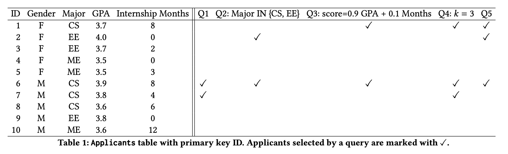
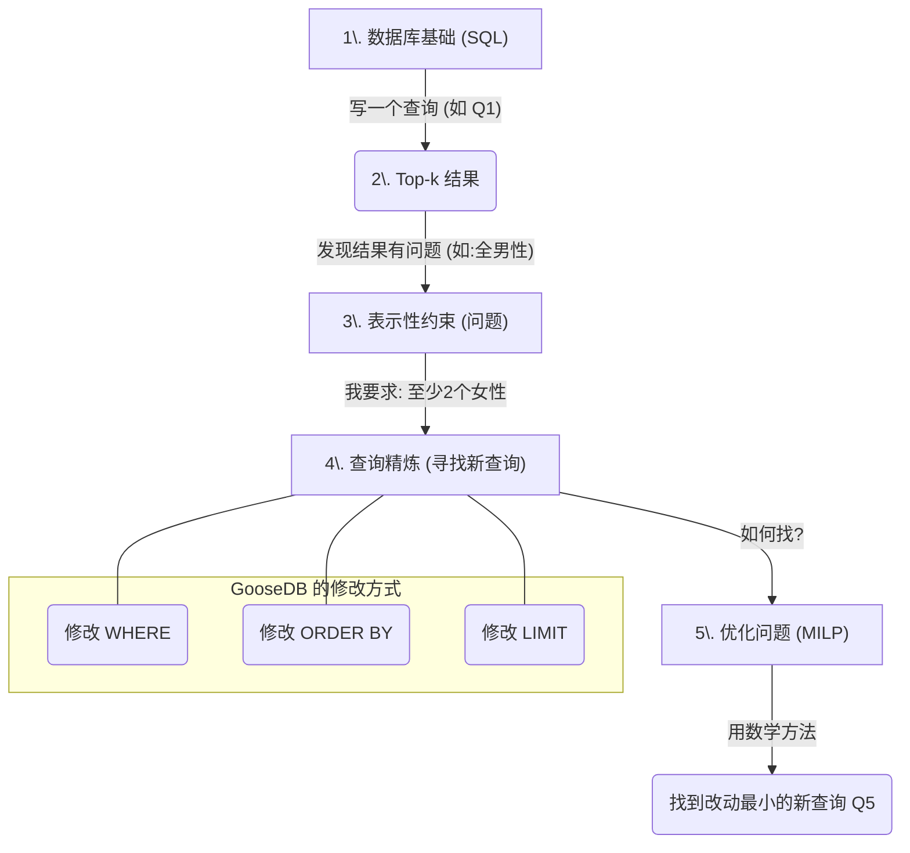
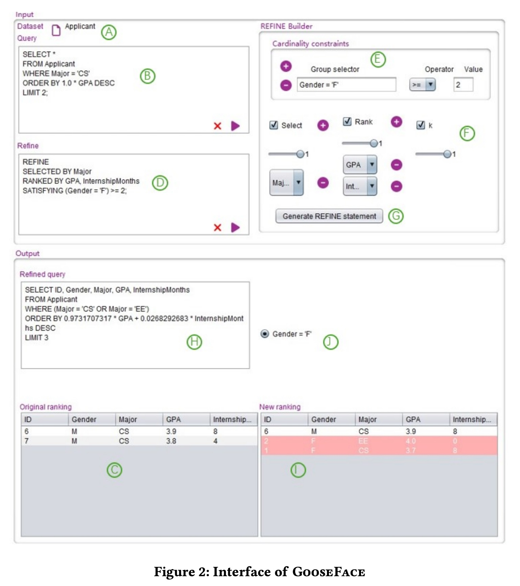
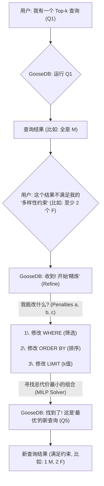
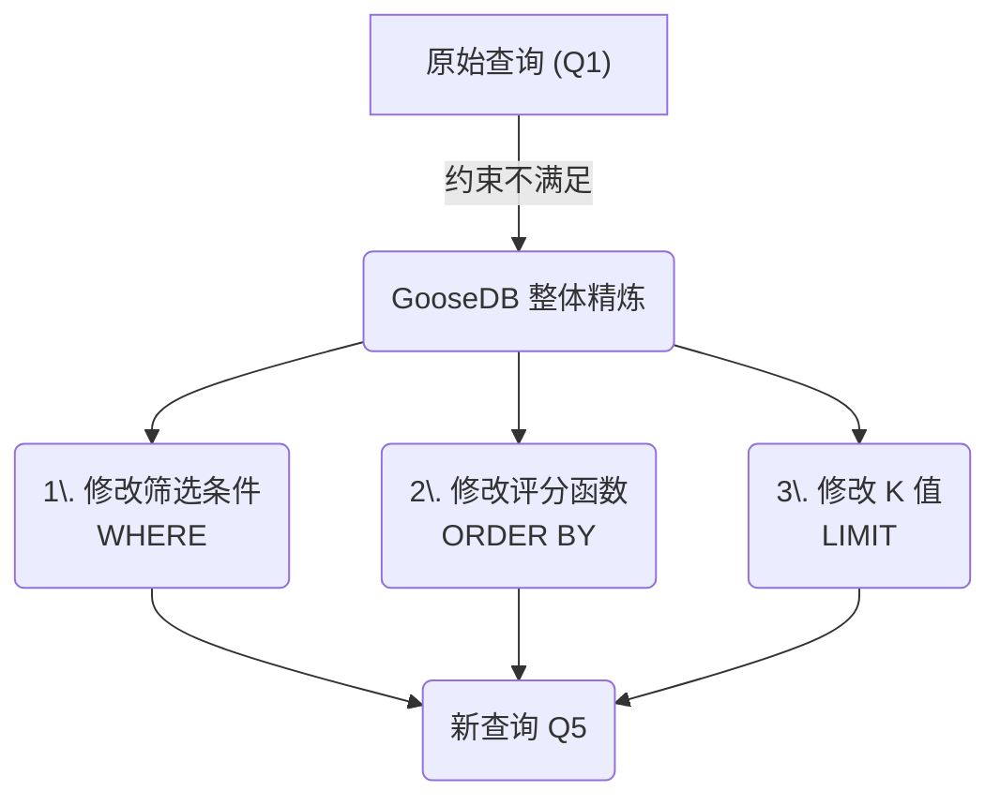
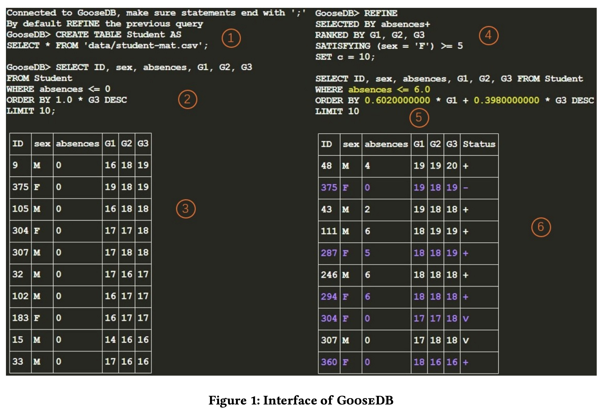

## AI论文解读 | GooseDB: A Database Engine that Optimally Refines Top-𝑘 Queries to Satisfy Representation Constraints
        
### 作者        
digoal        
        
### 日期        
2025-11-12        
        
### 标签        
PostgreSQL , PolarDB , DuckDB , AI , 论文解读        
        
----        
        
## 背景  
      
https://www.vldb.org/pvldb/vol18/p5351-chen.pdf        
  
提示:          
```          
读懂《GooseDB: A Database Engine that Optimally Refines Top-𝑘 Queries to Satisfy Representation Constraints》这篇论文需要提前掌握哪些基础知识, 请使用中文通熟易懂的讲解这些基础知识, 可以引用论文中的图、表或使用Markdown支持的图形(text,mermaid等)增加解释性. 
  
使用中文通熟易懂的解读《GooseDB: A Database Engine that Optimally Refines Top-𝑘 Queries to Satisfy Representation Constraints》这篇论文, 其中的关键内容请着重讲解, 可以引用论文中的图、表或使用Markdown支持的图形(text,mermaid等)增加解释性. 
  
提取《GooseDB: A Database Engine that Optimally Refines Top-𝑘 Queries to Satisfy Representation Constraints》这篇论文中的重要术语, 使用中文对这些术语进行通熟易懂的讲解, 可以引用论文中的图、表或使用Markdown支持的图形(text,mermaid等)增加解释性. 
```     
  
## 1 前置知识 
  
要完全理解这篇关于 GooseDB 的论文 , 你需要对几个核心概念有一些基础了解。GooseDB 的目标是, 当你的一次数据库查询（比如“给我最好的5个候选人”）结果不满足某些“多样性”要求时（比如“选出的5个人里一个女性都没有”）, 它能自动帮你“微调”你的查询, 找到一个改动最小的新查询, 使得结果既好,又能满足你的多样性要求 。

下面我用通俗的方式, 结合论文中的图表, 讲解你需要掌握的基础知识：

### 1\. 基础知识一：数据库和 SQL 查询（特别是 Top-k）

这是最最基础的知识。你需要知道数据是如何被存放在“表” (Table) 里的, 以及我们如何使用 SQL 语言来获取数据。

  * **数据库表 (Table):** 就像一个 Excel 表格。论文中的 **表1 (Table 1)**  就是一个绝佳的例子。    

      * 它有一个表名叫 `APPLICANT` (申请人) 。
      * 有很多“列” (Attributes), 比如 `ID`, `Gender` (性别), `Major` (专业), `GPA` 等 。
      * 有很多“行” (Tuples), 每一行代表一个具体的人, 比如 ID=1 的是 F (女性), CS (计算机) 专业, GPA 3.7 。

  * **SQL 查询 (Query):** 就是你用来从表中“提数据”的指令。论文中的 **Q1**  就是一个典型的“Top-k”查询：

    ```sql
    Q1: SELECT ID FROM APPLICANT
        WHERE Major = 'CS'
        ORDER BY GPA DESC
        LIMIT 2
    ```

      * `SELECT ID FROM APPLICANT`: 告诉我你要从 `APPLICANT` 表  中拿 `ID` 列。
      * `WHERE Major = 'CS'`: 但我只关心那些 `Major` (专业) 是 'CS' (计算机) 的人 。
      * `ORDER BY GPA DESC`: 把筛选出来的人, 按照 `GPA` 从高 (`DESC`) 到低排序 。
      * `LIMIT 2`: 我**只看**排在最前面的 **2** 个人 。

    这里的 `LIMIT 2` 就是 "Top-k" 中的 "k"。所以 "Top-k 查询" 指的就是“获取排名最靠前的k个结果” 。

### 2\. 基础知识二：“表示性约束” (Representation Constraints)

这是 GooseDB 要解决的核心**问题**。

当你执行完 Q1, 你得到了结果：ID 6 和 7 。你一看表1, 这两个人 (ID 6, 7) 的 `Gender` (性别) 都是 'M' (男性) 。

这时, 你（或者你的公司）可能会觉得这个结果“不好”, 比如：

> “我们明明有一半的申请人是女性 (F) , 但这个查询结果里一个女性都没有！这不公平, 或者说没有充分代表所有群体 。”

这个“结果里必须有至少1个女性”的想法, 就是一个 **“表示性约束”** 。论文中的例子更进一步, 比如要求“至少 2 名女性候选人” 。

### 3\. 基础知识三：“查询精炼” (Query Refinement)

这是 GooseDB 提供的**解决方案**。

既然 Q1 的结果不满足约束, 我们就必须修改 (Refine) Q1 。问题是怎么改呢？论文中提到了几种方法 , GooseDB 的厉害之处在于它可以**同时考虑**所有这些方法 ：

1.  **修改筛选条件 (WHERE):** 我们可以放宽条件, 比如“不只看 CS 专业, EE (电子工程) 的也看看？” 。

      * *对应 Q2: `WHERE Major IN ('CS', 'EE')`*

2.  **修改排序标准 (ORDER BY):** 我们可以调整打分标准, 比如“GPA 占 90%, 实习 (Internship) 经验也占 10%” 。

      * *对应 Q3: `ORDER BY 0.9*GPA + 0.1*Months`*

3.  **修改 K 的大小 (LIMIT):** 我们可以多看几个人, 比如“不只看 2 个, 我们看看前 3 个？” 。

      * *对应 Q4: `LIMIT 3`*

GooseDB 会**自动**帮你探索这些可能的修改（或者修改的组合, 比如 Q5）, 找到一个**改动最小**  且能满足你“至少 X 个女性”约束的新查询。

### 4\. 基础知识四：数学优化 (MILP)

这是 GooseDB 用来寻找“最佳”修改方案的**技术手段**。

当你有这么多可能的修改方式（改 WHERE、改 ORDER BY、改 LIMIT）, 你怎么知道哪个是“改动最小”的呢？

GooseDB 的做法是把这个问题变成一个数学问题。它会给每一种修改分配一个“代价”或“惩罚” (penalty) 。比如：

  * 改 `LIMIT` (从 2 改成 3), 惩罚 +1
  * 改 `WHERE` (增加一个 'EE' 专业), 惩罚 +5
  * 改 `ORDER BY` (调整 GPA 的权重), 惩罚 +10

然后 GooseDB 会使用一种叫做 **MILP (Mixed-Integer Linear Program, 混合整数线性规划)** 的强大数学工具, 去求解这个复杂的数学题：

> **目标：** 找到一组修改（`WHERE`, `ORDER BY`, `LIMIT`的组合）, 使得总“惩罚”值**最小** 。
> **前提：** 修改后的新查询, 必须满足你设定的“表示性约束”（比如, 至少 2 个女性）。

你不需要成为 MILP 专家, 你只需要知道 MILP 是一种能从海量选项中帮你找到“最优解”的数学求解器 (solver) 。

-----

### 总结

你需要提前掌握的知识点, 可以用下面这张图来概括：



简而言之, 如果你懂 **SQL 查询 (Top-k)**, 并且理解为什么会需要 **“多样性” (约束)**, 那么你就能理解这篇论文要解决的**问题**。如果你还知道 **“优化”** (即寻找最佳方案) 的概念, 那么你就能理解 GooseDB 是如何用 **MILP** 这个工具来**解决**这个问题的。

希望这个解释对你有帮助！你希望我详细解释以上任何一个知识点吗？
  
## 2 解读论文 
  
这是一篇关于一种新型数据库引擎 **GooseDB** 的论文。

简单来说, GooseDB 解决的是一个在日常生活中非常常见的问题：**当你进行一次数据库查询（比如“给我最好的5个候选人”）时, 结果可能不满足某些“公平性”或“多样性”的要求（比如“选出的5个人里一个女性都没有”）。GooseDB 能自动帮你“微调”你的查询语句, 找到一个改动最小的新查询, 使得结果既优秀,又能满足你的多样性要求** 。

下面, 我们将用通俗易懂的方式, 结合论文中的图表, 来重点解读它的关键内容。

-----

### 🔑 关键内容一：GooseDB 到底解决了什么问题？

想象一下, 你是一个科技公司的主管, 你想从 **表1 (Table 1)** 所示的10个申请人中选2个人面试 。    

**表1: 申请人数据** 

| ID | Gender | Major | GPA | Internship Months |
| :--- | :--- | :--- | :--- | :--- |
| 1 | F | CS | 3.7 | 8 |
| 2 | F | EE | 4.0 | 0 |
| ... | ... | ... | ... | ... |
| 6 | M | CS | 3.9 | 8 |
| 7 | M | CS | 3.8 | 4 |
| ... | ... | ... | ... | ... |

你写了一个很“合理”的 SQL 查询 **Q1**：

> "筛选出 `Major` (专业) 是 'CS' 的人, 然后按 `GPA` 从高到低排序, 选前面 **2** 个人。" 

```sql
Q1: SELECT ID FROM APPLICANT
    WHERE Major = 'CS'
    ORDER BY GPA DESC LIMIT 2
```

**问题来了**：
这个查询 (Q1) 会选出 ID 为 6 和 7 的申请人 。你一看**表1**, 这两位都是男性 (M) 。

这时你可能会想： **“我的申请人里明明一半是女性 (F), 但这个结果里一个女性都没有。这不太好, 缺乏代表性。”** 

你希望你的结果能满足一个 **“表示性约束” (Representation Constraint)** , 比如：

> **约束：** “选出的人里, `Gender` (性别) 是 'F' (女性) 的必须 **大于等于 1 个**。” (甚至更严格, 比如至少2个 )

**GooseDB 的核心任务就是：** 自动帮你把 Q1 "精炼" (Refine) 成一个新的查询 (比如 Q2, Q3, Q4 或 Q5), 让新查询的结果**既满足你的约束, 又和你的原始意图 (Q1) 尽可能接近**。

-----

### 🔑 关键内容二：GooseDB 的“精炼”到底有多强？(Holistic Refinement)

要满足“至少1个女性”的约束, 你可以怎么修改 Q1 呢？

1.  **方法1 (Q2): 放宽筛选条件 (WHERE)**

      * "只看 CS 专业太严了, 把 EE (电子工程) 专业也加进来吧。" 
      * 结果：选出了 2 (F) 和 6 (M), 满足了约束。

2.  **方法2 (Q3): 改变排序标准 (ORDER BY)**

      * "只看 GPA 不够, 实习经历 (Internship) 也很重要。我们按 0.9*GPA + 0.1*Internship 来打分。" 
      * 结果：选出了 1 (F) 和 6 (M), 满足了约束。

3.  **方法3 (Q4): 增加 K 值 (LIMIT)**

      * "只选2个太少, 我们多看一个, 选 3 个吧。" 
      * 结果：选出了 6 (M), 7 (M) 和 1 (F), 满足了约束。

**GooseDB 的“杀手锏”** ：
以前的工作都只能单独做上面的一种修改 (比如只改 WHERE 或只改 ORDER BY) 。而 **GooseDB 是第一个能“通盘考虑” (Holistically Optimize) 所有这三种修改方式的系统** 。

如果你的约束更严格, 比如“至少 2 个女性”, 可能单一的修改都不管用。GooseDB 可以自动帮你组合这些修改, 找到像 **Q5** 这样的复杂查询：

```sql
Q5: SELECT ID FROM APPLICANT
    WHERE Major = 'CS' OR Major = 'EE'  -- (改了 WHERE)
    ORDER BY 0.97*GPA + 0.03*Internship_months DESC  -- (改了 ORDER BY)
    LIMIT 3  -- (改了 LIMIT)
```


GooseDB 能同时探索这三个维度的所有可能性 。

-----

### 🔑 关键内容三：如何找到“改动最小”的最优解？(Optimization)

GooseDB 不只是随便找到一个解, 而是要找到 **“最优” (Optimally)**  或 **“改动最小” (Minimally Modified)**  的那个解。

它是怎么定义“改动最小”的呢？答案是 **“代价” (Penalty)** 。

GooseDB 允许用户为每种修改设置“代价权重” (a, b, c) 。

**总修改代价 = a \* (WHERE 条件的改动量) + b \* (ORDER BY 权重的改动量) + c \* (LIMIT K值的改动量)** 

  * 如果你**非常不想**改排序标准 (ORDER BY), 你可以把权重 `b` 设得非常高 。GooseDB 就会尽量只通过修改 WHERE 和 LIMIT 来满足你的约束。
  * 如果你不指定, 它会默认这些修改的代价差不多 。

GooseDB 的核心技术, 就是把这个“寻找最低总代价”的问题, 转换成一个 **“混合整数线性规划” (MILP)** 问题 。你不需要懂 MILP 是什么, 只需要知道它是一种非常强大的数学工具, 能从海量的可能性中, 帮你计算出那个“总代价最小”的完美方案 。

-----

### 🔑 关键内容四：GooseDB 怎么用？(看图)

GooseDB 提供了两种界面, 我们以更直观的 **图2 (GOOSEFACE)** 为例 ：    

这张图完美展示了 GooseDB 的工作流程：

1.  **输入 (Input):**

      * **B 框：** 你输入你的**原始查询** (Q1, 选 Top 2 CS 学生) 。
      * **C 框：** 你看到 Q1 的结果 (ID 6, 7), 都是 M 。

2.  **设置约束 (REFINE Builder):**

      * **E 框：** 你设置你的**约束**：“我要求 `Gender = F` 的数量 `> 2`” 。
      * **F 框：** 你设置不同修改的 **“代价” (权重)** 。比如你是否介意修改 `Major` (Select), 是否介意修改 `GPA` 的权重 (Rank), 是否介意修改 `k` (Limit)。

3.  **输出 (Output):**

      * **H 框：** GooseDB (通过 MILP 求解) 自动为你生成了 **“最优”的新查询** (即 Q5) 。
      * **L 框：** 你看到了新查询的结果, 选出了 ID 6, 2, 1, 其中 2 和 1 都是 F, 满足了你的约束 。

-----

### 总结

我们可以用一张图来总结 GooseDB 的工作流程：



GooseDB 就像一个智能的 SQL 助手 , 它在你的数据库 (DuckDB) 和一个强大的数学求解器 (MILP Solver) 之间搭建了一座桥梁, 确保你在获取“最好”数据的同时, 也能满足“公平”和“多样性”的复杂要求。

希望这个解读对你有帮助！你是否想了解更多关于它如何处理“代价” (Penalty) 计算的细节？
  
## 3 术语 
  
好的, 这篇论文的核心是介绍一个名为 **GooseDB** 的智能数据库引擎 。为了帮你彻底理解它, 我提取了其中最关键的术语, 并用通俗易懂的中文进行讲解。

-----

### 1\. Top-k Queries (Top-k 查询)

  * **通俗讲解：**
    "Top-k" 就是“排名前 k 个”。Top-k 查询是数据库中最常见的一种操作, 意思就是“给我按某个标准排序后, 最好的 k 个结果” 。

  * **论文中的例子 (Q1)：**
    论文开篇就给出了一个例子 **Q1** (Query 1) ：

    ```sql
    SELECT ID FROM APPLICANT
    WHERE Major = 'CS'
    ORDER BY GPA DESC
    LIMIT 2  <-- 这里 k=2
    ```

    这个查询的意思是：在 `APPLICANT` (申请人) 表中, 找到专业 (`Major`) 是 'CS' 的人, 按照 `GPA` 从高到低 (`DESC`) 排序, 然后只返回排在最前面的 **2** 个人。

### 2\. Representation Constraints (表示性约束)

  * **通俗讲解：**
    这是 GooseDB 要解决的核心**问题**。它指的是你对 Top-k 结果的“多样性”或“代表性”要求 。

    当你运行 Q1 (选最好的 2 个 CS 学生), 结果发现选出的 2 个人 (ID 6 和 7) 都是男性 (M)。你可能会觉得这个结果“缺乏代表性”, 因为申请人里明明有很多女性 (F)。

    于是你提出的 **“结果里至少要有 1 个女性”** 或 **“女性比例必须达到 30%”** 这样的要求, 就是“表示性约束” 。

  * **论文中的术语：**
    论文中也称其为 **“Group cardinality constraint” (群体基数约束)** , 比如在图2中, 用户设置的约束就是 `(Gender = 'F') >= 2` (女性数量必须大于等于2) 。  

### 3\. Query Refinement (查询精炼)

  * **通俗讲解：**
    “精炼” (Refinement) 在这里就是“修改”或“微调”的意思。当你的原始查询 (Q1) 无法满足你设置的“表示性约束” (比如女性太少) 时, GooseDB 就会自动帮你**修改**这个查询, 直到它能满足约束 。

  * **论文中的例子 (Q2, Q3, Q4)：**
    为了让“至少 1 个女性”入选, GooseDB 可以帮你“精炼” Q1：

      * **Q2:** 放宽筛选条件 (也看 'EE' 专业的) 。
      * **Q3:** 改变排序标准 (不只看 GPA, 也看实习) 。
      * **Q4:** 增加名额 (k=3, 多选 1 个) 。

### 4\. Holistic Optimization (整体/通盘优化)

  * **通俗讲解：**
    这是 GooseDB 最核心的亮点。以前的工具在“精炼”查询时, 要么只能帮你改筛选 (WHERE), 要么只能帮你改排序 (ORDER BY) 。

    而 GooseDB 是“通盘考虑” (Holistic) 的, 它可以**同时**探索和优化 SQL 查询中所有可能影响结果的三个关键部分, 如下面这个流程图所示：




  * **论文中的例子 (Q5)：**
    论文中的 **Q5**  就是一个“整体精炼”的完美例子, 它**同时**修改了 WHERE, ORDER BY 和 LIMIT, 这是以前的工作做不到的 。

### 5\. Minimally Modified (最小修改)

  * **通俗讲解：**
    满足约束的“新查询”可能有很多个, 但 GooseDB 会帮你找到那个 **“改动最小”** 的方案 。

    比如, 你原始的查询 (Q1) 是“最看重 GPA”。GooseDB 不会随便给你一个“最看重实习”的新查询 (Q3), 除非这是**万不得已**的最小改动。

  * **如何实现：**
    GooseDB 通过一个“优化目标” (Optimization objective) 来实现 。你可以为不同类型的修改设置“代价” (penalty) 。例如：

      * 你设置“改 LIMIT (k值)”的代价很低 (a=1)。
      * 你设置“改 ORDER BY (排序)”的代价很高 (b=10)。
        GooseDB 就会优先尝试只改 k 值 (比如 Q4), 而尽量不去碰你的排序标准 。

### 6\. MILP (Mixed-Integer Linear Program)

  * **通俗讲解：**
    中文叫 **“混合整数线性规划”** 。这是 GooseDB 用来寻找“最小修改”方案的 **数学引擎** 。

    你不需要懂 MILP 的复杂数学。你只需要知道：

    1.  GooseDB 把“寻找改动最小的新查询”这个复杂的 SQL 问题...
    2.  ...转换 (Transform) 成一个数学上的 MILP 问题 。
    3.  然后它把这个数学问题“扔”给一个专业的 MILP 求解器 (比如 Gurobi )。
    4.  求解器会计算出一个“最优数学解”。
    5.  GooseDB 再把这个“数学解”翻译回“最优的 SQL 查询” (比如 Q5) 并返回给你。

### 7\. REFINE Statement (REFINE 语句)

  * **通俗讲解：**
    这是 GooseDB 提供给用户的新命令 。你不需要自己去想 Q5 怎么写, 你只需要使用 `REFINE` 语句告诉 GooseDB 你的**意图**。

  * **论文中的例子 (图1)：**
    在图1中, 用户在原始查询 (2) 之后, 紧接着就写了一个 `REFINE` 语句 (4) ：    

    ```sql
    -- 4: 这是一个 REFINE 语句
    REFINE
      SELECTED BY absences+      -- 告诉 GooseDB: 你可以修改 'absences' 这个筛选条件
      RANKED BY G1, G2, G3       -- 告诉 GooseDB: 你可以修改 G1, G2, G3 的排序权重
      SATISFYING (sex = 'F') >= 5  -- 告诉 GooseDB: 我的约束是必须满足 F >= 5
    ```

    

    GooseDB 收到这个命令后, 就会自动运行 MILP, 找到“改动最小”的新查询 (5) 并返回结果 (6) 。
  
## 参考        
         
https://www.vldb.org/pvldb/vol18/p5351-chen.pdf    
        
<b> 以上内容基于DeepSeek、Qwen、Gemini及诸多AI生成, 轻微人工调整, 感谢杭州深度求索人工智能、阿里云、Google等公司. </b>        
        
<b> AI 生成的内容请自行辨别正确性, 当然也多了些许踩坑的乐趣, 毕竟冒险是每个男人的天性.  </b>        
  
    
#### [PolarDB 学习图谱](https://www.aliyun.com/database/openpolardb/activity "8642f60e04ed0c814bf9cb9677976bd4")
  
  
#### [PostgreSQL 解决方案集合](../201706/20170601_02.md "40cff096e9ed7122c512b35d8561d9c8")
  
  
#### [德哥 / digoal's Github - 公益是一辈子的事.](https://github.com/digoal/blog/blob/master/README.md "22709685feb7cab07d30f30387f0a9ae")
  
  
#### [About 德哥](https://github.com/digoal/blog/blob/master/me/readme.md "a37735981e7704886ffd590565582dd0")
  
  

  
