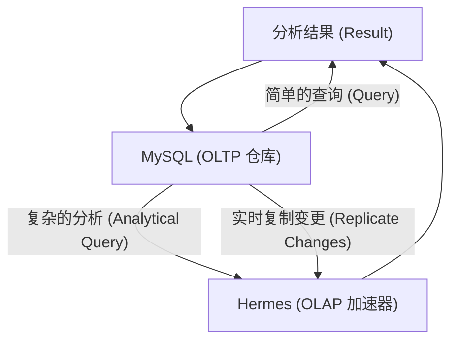
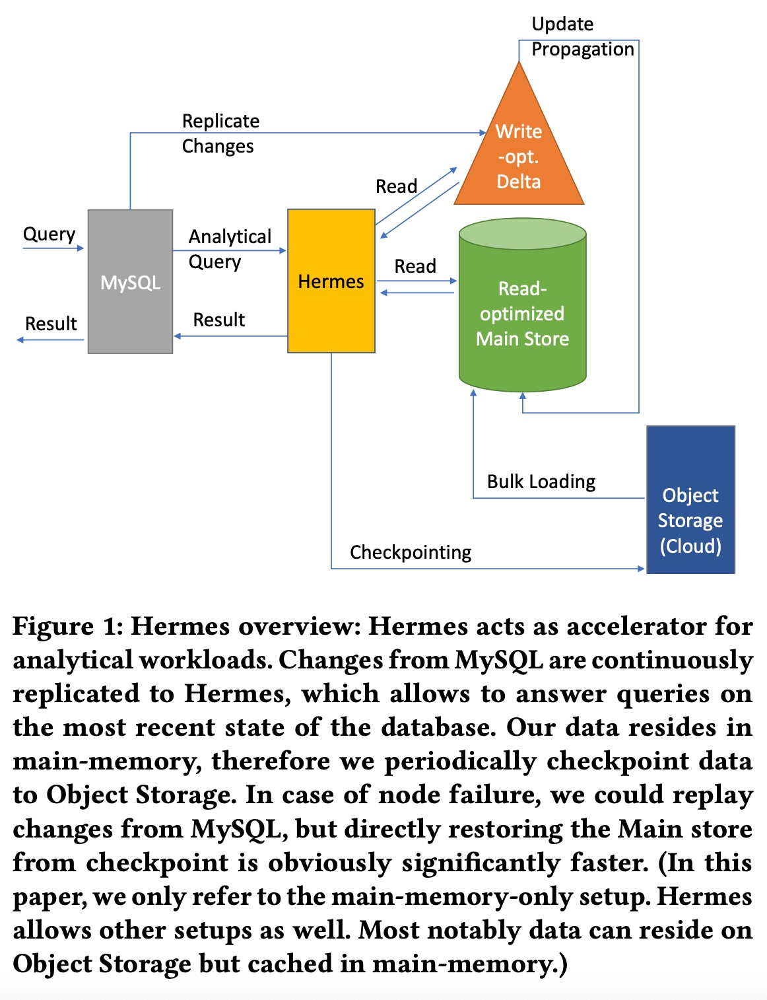
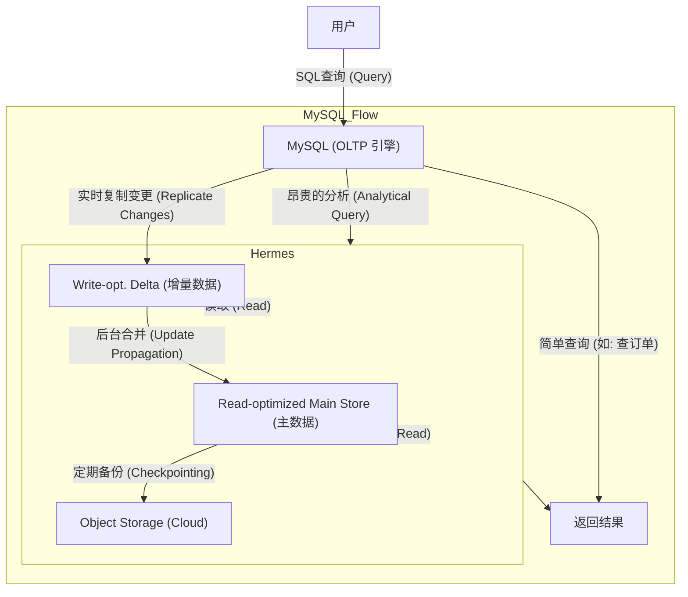
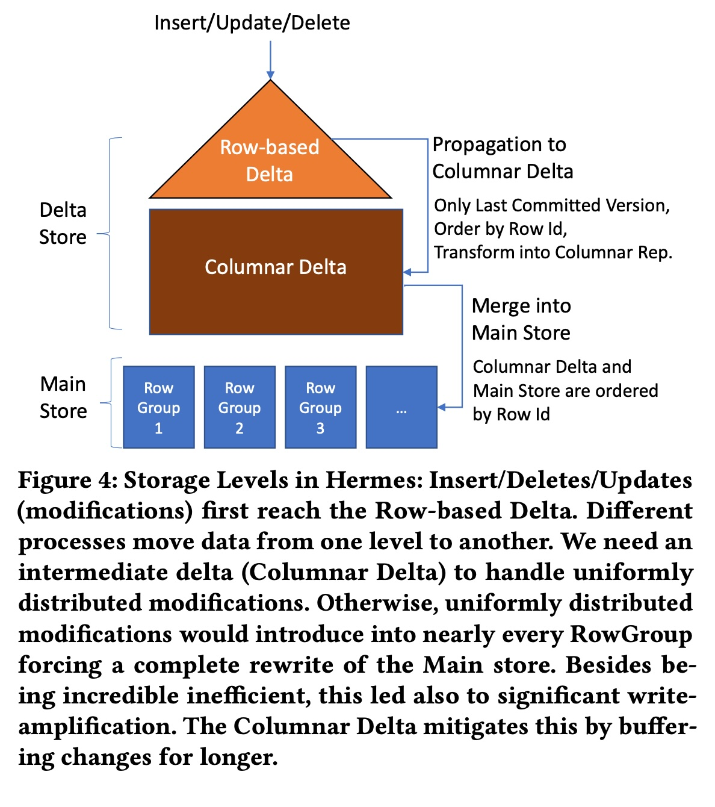
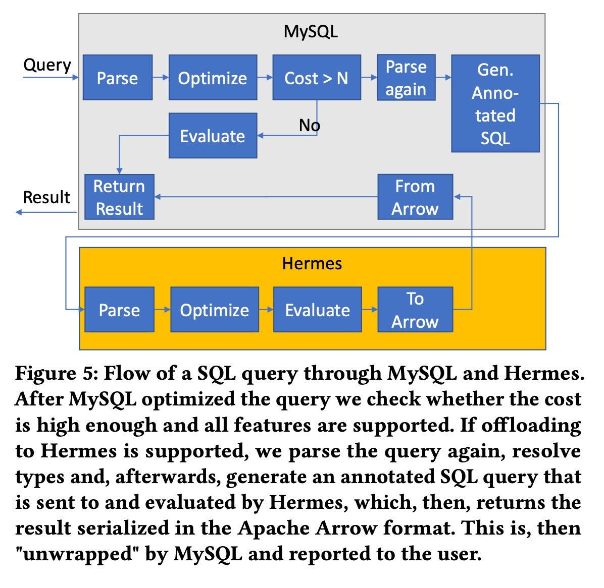
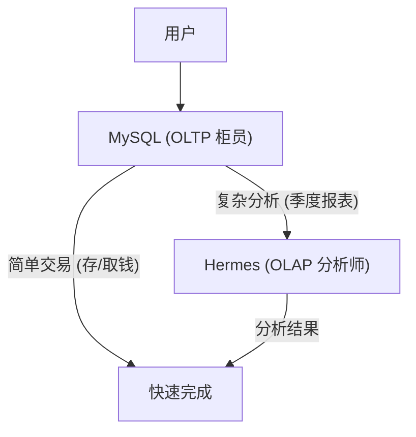
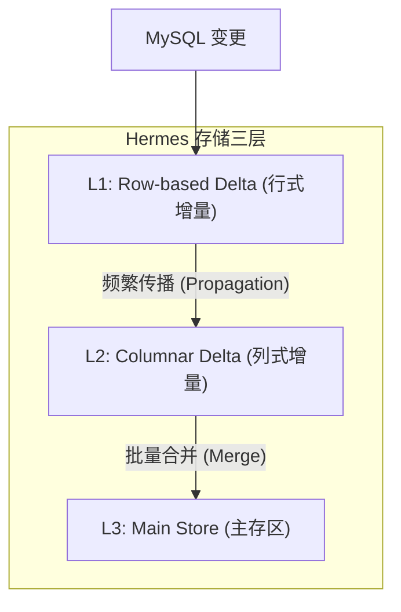

## AI论文解读 | Freely Moving Between the OLTP and OLAP Worlds: Hermes – an High-Performance OLAP Accelerator for MySQL
        
### 作者        
digoal        
        
### 日期        
2025-11-12        
        
### 标签        
PostgreSQL , PolarDB , DuckDB , AI , 论文解读        
        
----        
        
## 背景  
      
https://www.vldb.org/pvldb/vol18/p5113-gubner.pdf        
  
提示:          
```          
读懂《Freely Moving Between the OLTP and OLAP Worlds: Hermes – an High-Performance OLAP Accelerator for MySQL》这篇论文需要提前掌握哪些基础知识, 请使用中文通熟易懂的讲解这些基础知识, 可以引用论文中的图、表或使用Markdown支持的图形(text,mermaid等)增加解释性. 
  
使用中文通熟易懂的解读《Freely Moving Between the OLTP and OLAP Worlds: Hermes – an High-Performance OLAP Accelerator for MySQL》这篇论文, 其中的关键内容请着重讲解, 可以引用论文中的图、表或使用Markdown支持的图形(text,mermaid等)增加解释性. 
  
提取《Freely Moving Between the OLTP and OLAP Worlds: Hermes – an High-Performance OLAP Accelerator for MySQL》这篇论文中的重要术语, 使用中文对这些术语进行通熟易懂的讲解, 可以引用论文中的图、表或使用Markdown支持的图形(text,mermaid等)增加解释性. 
```     
  
## 1 前置知识 
  
很高兴能帮您“预习”这篇论文。这是一篇关于高性能数据库系统 Hermes 的论文 。Hermes 扮演一个“加速器”的角色，专门帮助 MySQL 数据库更快地处理“分析”类工作 。

要透彻理解这篇论文，您需要对现代数据库系统的一些核心概念有所了解。以下我将用最通俗易懂的方式，为您讲解这些必备的基础知识。

-----

### 1\. 核心矛盾：OLTP 与 OLAP (数据库的“两种人格”)

想象一下，数据库系统就像一个大型仓库。这个仓库有两种主要工作：

  * **OLTP (Online Transaction Processing, 联机事务处理):**

      * **工作内容：** 负责“进货”和“出货”。比如，您在网上下单，系统需要**快速写入**一条新订单，**更新**一下库存。
      * **特点：** 涉及的操作很小、很快，但频率非常高（增、删、改）。它关心的是“**别出错、快点办**”。
      * **典型系统：** MySQL, 银行交易系统, 电商订单系统。

  * **OLAP (Online Analytical Processing, 联机分析处理):**

      * **工作内容：** 负责“盘点”和“分析”。比如，老板想知道“上个季度哪个商品卖得最好？”
      * **特点：** 这需要扫描**海量**的历史数据并进行复杂计算（查）。它关心的是“**算得快、吞吐高**”。
      * **典型系统：** 数据仓库 (Data Warehouse)。

**核心问题：** OLTP 系统（如 MySQL）通常不擅长处理 OLAP 查询 。如果您让负责“进出货”的 MySQL 去做“季度大盘点”，它会变得非常慢，甚至可能影响到正常的“进出货”工作。

### 2\. 解决方案：HTAP (让“两种人格”协同工作)

过去，大家会用一种叫 **ETL** (抽取、转换、加载) 的流程，每天晚上把 OLTP 仓库（MySQL）的数据，复制到 OLAP 仓库（数据仓库）中去做分析 。但这很麻烦，而且数据会延迟一天 。

**HTAP (Hybrid Transactional/Analytical Processing, 混合事务/分析处理)** 就像是“在同一个地方，同时搞定进出货和大盘点”。

这篇论文中的 **Hermes**  就是一种 HTAP 解决方案。它不是要取代 MySQL，而是像一个 **“外挂”的分析加速器** 。

您可以这样理解它们的关系：



*这个图展示了 Hermes  如何作为 MySQL  的加速器工作。*

-----

### 3\. 核心架构：Hermes 为什么这么快？

为了同时处理“快速写入”和“快速分析”，Hermes 内部采用了“**读写分离**”的存储设计，这在 **Figure 1**  中有清晰的体现。     

#### 3.1 Main Store (主存储) vs. Delta Store (增量存储)

  * **Read-optimized Main Store (读优化的主存储):**

      * **作用：** 存放绝大多数的“冷”数据（不常变动）。
      * **技术：** 它使用**列式存储 (Columnar Storage)** 。
      * **通俗理解：** 传统 OLTP 数据库是“按行”存（一行存一个订单的所有信息）。列存是“按列”存（把所有订单的“商品ID”存一起，所有“金额”存一起）。当您要计算“总销售额”时，列存只需要读取“金额”这一列，速度极快。
      * **特点：** 数据是**压缩**的 ，非常适合 OLAP 的海量扫描 。

  * **Write-opt. Delta (写优化的增量存储):**

      * **作用：** 像一个“缓冲区”，存放所有新来的“热”数据（增、删、改）。
      * **技术：** 它更可能是**行式存储 (Row-oriented)** ，便于快速写入和修改。
      * **特点：** 写入速度快。

#### 3.2 数据的“一生”

1.  **写入：** 用户在 MySQL 上提交了一个新订单。
2.  **复制：** MySQL 把这个“变更”实时复制给 Hermes 。
3.  **存入 Delta：** Hermes 立即把这个新订单写入 **Delta Store** 。
4.  **查询：** 这时老板来查报表，Hermes 会同时读取 **Main Store** 和 **Delta Store** 的数据，然后合并起来给老板 。
5.  **传播 (Update Propagation) :** 等 Delta Store 里的数据“凉了”（累积到一定程度），Hermes 会在后台把它们合并 (Merge) 到 Main Store 中 。

这个“三层存储”的设计（论文中提到了 Row-based Delta, Columnar Delta, 和 Main Store ）是 Hermes 能够兼顾读写性能的核心。

-----

### 4\. 数据同步：Hermes 如何“偷”数据？

Hermes 必须保证自己的数据和 MySQL 是同步的，并且是最新的 。

  * **Binary Log (Binlog, 二进制日志):**

      * 这是 MySQL 自带的“账本”，它会记下所有对数据库的修改操作 。
      * Hermes 通过订阅 MySQL 的 **Binlog**  实现了“**实时复制**” 。
      * **好处：** 这保证了极高的**数据新鲜度 (Data Freshness)** 。论文提到，如果数据还没复制过来，Hermes 会“等一下”，但等待时间通常可以忽略不计 (毫秒级) 。

  * **MVCC (多版本并发控制):**

      * 这是一个高级概念，但很重要。为了保证数据一致性（比如您在分析时，别人正在修改数据），Hermes 内部也需要一套机制来管理“版本”。
      * 论文提到，Hermes 通过维护 **GTID (全局事务标识符)**  和 HTID (Hermes 事务标识符)  之间的映射，来确保它能读取到和 MySQL 一致的“数据快照” 。

### 5\. 查询加速：为什么计算也这么快？

光是存储快还不够，计算也要快。

  * **Vectorized Execution (向量化执行):**

      * 这是现代 OLAP 引擎的标配 。
      * **通俗理解：** 传统的“一次处理一行” (row-at-a-time) 就像是您用手一个一个地数豆子。而“向量化执行”  就像是您拿一个大勺子 (CPU的SIMD指令) ，一次舀一勺（比如 1000 个）豆子来处理 。CPU 效率大大提高。

  * **Morsel-driven Parallelism (小块驱动的并行):**

      * 如何让多个 CPU 核心一起干活？
      * Hermes 使用了“Morsel-driven”并行模型 。
      * **通俗理解：** 它把一大桌“菜”（数据）切成很多“小份”(Morsels) 。哪个 CPU 核心“饿了”（空闲了），就自己去动态地领一份“菜”来“吃”（处理），直到所有菜都被吃完 。这比“固定分工”更有效率，尤其是在数据处理不均匀时。

-----

### 6\. 性能评估：如何证明 Hermes 强？

  * **TPC-H (行业基准测试):**

      * 这是 OLAP 领域最著名的“高考” 。它包含 22 条复杂的分析查询（Q1, Q2...）。
      * 论文中的 **Table 1**  和 **Table 2**  展示了 Hermes 在 TPC-H 上的“高考成绩”。    

  * **关键结论：**

      * **碾压 MySQL：** Hermes 比 MySQL 快 **2-3 个数量级** (即 100 到 1000 倍) 。
      * **超越对手：** Hermes（单节点） 甚至比其他多节点的分布式系统 (如 PolarDB-IMCI) 还要快 。
      * **单节点 (Single-Node) 的优势：** 论文强调，很多客户的数据量并不需要昂贵的多节点集群 。单节点设计  避免了复杂的网络开销 ，因此性能更高、成本更低 。

### 总结

要读懂这篇论文，您需要带着以下几个关键知识点：

1.  **OLTP vs. OLAP：** 为什么需要 Hermes？(解决分析查询慢的问题) 
2.  **HTAP / 加速器：** Hermes 的定位是什么？(MySQL 的分析助手) 
3.  **Delta + Main Store：** Hermes 如何兼顾读写？(缓冲区 + 列存主存储) 
4.  **Binlog 复制：** Hermes 如何同步数据？(订阅 MySQL 的“账本”) 
5.  **向量化执行：** Hermes 如何加速计算？(一次处理“一批”数据) 
6.  **TPC-H：** 如何证明 Hermes 很快？(行业“高考”成绩) 

希望这个“预习”对您有帮助！

您希望我针对以上哪一个知识点（比如“列式存储”或“向量化执行”）再做更深入的讲解吗？
  
## 2 解读论文 
  
这是一篇关于高性能数据库系统 **Hermes** 的论文，它被设计为 MySQL 的一个“分析加速器” 。

简单来说，这篇论文的核心是解决一个常见痛点：我们平时用的 MySQL 数据库（称为 OLTP 系统）擅长处理高频的“增、删、改”操作（比如下订单、改库存），但你让它跑一个复杂的“季度报表分析”（称为 OLAP 查询），它就会变得非常慢，甚至卡死 。

Hermes 就是来解决这个问题的。它像一个外挂的“分析引擎”，让 MySQL 既能快速处理日常交易，也能闪电般地完成复杂分析 。

下面，我们来通俗地解读一下这篇论文的关键内容。

-----

### 1\. 核心哲学：为什么“单节点”反而更强？

在当今这个“大数据”和“分布式”的时代，我们总觉得系统节点越多越厉害。但这篇论文提出了一个反直觉的观点：

  * **并非所有人都需要“超超超大规模”：** 很多客户的数据量并没有大到需要昂贵的“多节点集群” 。
  * **多节点的代价：** 分布式系统（多节点）为了协调数据，会引入大量的“网络传输” 。在很多情况下，这种网络开销反而会拖慢性能，尤其是在数据量还不足以撑爆单个节点时 。
  * **Hermes 的选择：** 因此，Hermes 被设计为一个 **“单节点”** 的加速器 。它的目标是在单台机器上把性能压榨到极致，从而避免多节点带来的复杂性和网络开销 。

**结果呢？** 论文的实验数据（我们稍后会看）表明，Hermes 这个“单节点”系统，在分析性能上甚至击败了著名的“多节点”分布式系统 。

-----

### 2\. 整体架构 (Figure 1)：Hermes 如何与 MySQL 协同作战？

下图是 Hermes 的整体架构图 。    

我们可以把它简化成一个清晰的工作流：



这个流程的关键点是：

1.  **查询分流：** 用户的 SQL 查询首先发给 MySQL 。MySQL 的优化器会做个判断：如果这是一个简单的“事务性”查询，MySQL 自己就处理了 ；如果这是一个“昂贵”的分析查询（比如 `Cost > N`），MySQL 就会把它“甩锅”给 Hermes 。
2.  **数据复制：** MySQL 里发生的**所有数据变更**（增、删、改），都会通过“**Replicate Changes**”（基于 MySQL 的 binlog ）实时地复制到 Hermes 。
3.  **读写分离的存储：** Hermes 内部把数据存储分成两块 ：
      * **Write-opt. Delta (写优化增量区)：** 像一个“缓冲区”，所有从 MySQL 实时复制过来的新数据都先放在这里 。
      * **Read-optimized Main Store (读优化主存区)：** 绝大多数的“冷”数据（已稳定的历史数据）存放在这里 。它使用**列式存储**和**压缩** ，对分析查询极其友好。
4.  **数据合并：** 当用户查询时，Hermes 会同时读取 Main Store 和 Delta 区的数据，然后把它们合并起来，返回最终结果 。同时，后台会有一个“**Update Propagation**”进程，定期把 Delta 区的“热”数据刷入 Main Store 。
5.  **高数据新鲜度：** 因为数据是实时复制的，Hermes 保证了极高的数据新鲜度 。如果用户查询的数据“刚刚”在 MySQL 中被修改，但 Hermes 还没收到，它会“**等待**”几毫秒，直到数据同步过来为止 。这个等待时间相比查询本身（通常是几百毫秒甚至几秒）是微乎其微的 。

-----

### 3\. (重点) 核心设计：为什么需要“三层存储” (Figure 4)？

上一节提到 Hermes 有“主存区”和“增量区”，这是两层结构。但论文的**核心创新**其实是“**三层存储**”。

**为什么两层不够？**
论文作者遇到了一个“最坏情况” (Worst-case)：**均匀随机更新** (uniformly random updates) 。

想象一下，你的 Main Store 里有 1000 个数据块 (RowGroup)。现在你收到了 1000 个更新操作，但这 1000 个更新“均匀”地分布在每一个数据块上，每个数据块只更新了 1 行 。

如果是两层结构（Delta 直接合并到 Main Store），为了这 1000 行更新，你将不得不**重写所有 1000 个数据块**！。这会导致巨大的“**写放大**” (write amplification) ，后台合并的压力会彻底压垮系统。

**解决方案：三层存储 (Figure 4)**    

为了解决这个问题，Hermes 在“行式增量区”和“列式主存区”之间，增加了一个“**中间缓冲层**”——**Columnar Delta (列式增量区)** 。

数据的流动变成了这样：

1.  **Level 1: Row-based Delta (行式增量区)** 

      * **作用：** “接客”。这是第一站，专门为“写入”优化。它使用**行式存储** ，接收来自 MySQL 的所有实时变更 (Inserts/Updates/Deletes) 。

2.  **Level 2: Columnar Delta (列式增量区)** 

      * **作用：** “缓冲”。后台进程会**频繁地** (frequently) 将 Row-based Delta 的数据“传播”(Propagation) 到这里 。
      * **特点：** 它已经把数据转换成了**列式存储** (Columnar Rep.)，并按 Row ID 排好序 。
      * **好处：** 它起到了“**缓冲**”作用，把来自 Row-based Delta 的零散更新收集起来 。

3.  **Level 3: Main Store (主存区)** 

      * **作用：** “归档”。只有当 Columnar Delta 累积到**足够大**（超过某个阈值）时，系统才会启动“**Merge (合并)**”操作，将 Columnar Delta 的数据批量并入 Main Store 。

> **总结一下：** 这个三层结构通过增加一个“列式缓冲层”，巧妙地解决了“均匀随机更新”带来的“写放大”问题 。它确保了写入性能和后台合并效率。

-----

### 4\. 智能集成 (Figure 5)：Hermes 如何“骗过” MySQL？

用户不需要学习新的 SQL 语言，他们只需要像往常一样向 MySQL 发送查询。Hermes 的集成是**透明的** 。

这个“透明”的查询流程 (Figure 5) 非常巧妙：    

1.  **MySQL 首次优化：** 用户查询  -\> MySQL 解析和优化 。
2.  **成本判断：** MySQL 优化器估算成本 。
      * 如果 `Cost <= N` (简单查询)，MySQL 自己执行 (Evaluate) 。
      * 如果 `Cost > N` (复杂分析) ，MySQL 决定“**转包**”给 Hermes。
3.  **生成“带注释的SQL”：** 这是最关键的一步。为了保证分析结果和 MySQL 完全一致（比如处理 `select 3+'abc'` 这种奇怪的查询 ），MySQL 会**再次解析**查询 ，并生成一个“**带注释的 SQL**” (Gen. Annotated SQL) 。这个 SQL 包含了所有 MySQL 特有的类型转换规则（比如隐式地把 'abc' 转成 0） 。
4.  **Hermes 执行：** Hermes 接收到这个“带注释的 SQL” ，然后用它自己的高性能引擎（如向量化执行 ）来解析、优化和执行 。
5.  **返回结果：** Hermes 把结果（使用 Apache Arrow 格式）返回给 MySQL ，MySQL 再把结果返回给用户 。

-----

### 5\. 惊艳的性能 (Table 1 & 2)：Hermes 到底有多快？

**测试标准：** TPC-H 是一个行业公认的分析性能“跑分”基准。

#### 实验一：中等规模 (SF100，约 100GB 数据) 
    

**对比 MySQL 8.0 ：**

  * **结论：** Hermes 提供了 **2-3 个数量级**（即 100 到 1000 倍）的加速 。
  * **看表 (Table 1)：**
      * 查询 Q1：MySQL 跑了 964 秒，Hermes 仅需 **0.81 秒** 。
      * 查询 Q7：MySQL 跑了 831 秒，Hermes 仅需 **0.55 秒** 。

**对比 PolarDB-IMCI (一个著名的多节点 HTAP 系统) ：**

  * **结论：** **单节点**的 Hermes 竟然比**多节点**（4个节点）的 PolarDB-IMCI 还要快！
  * **看表 (Table 1)：**
      * 总时间：Hermes 跑完所有查询总共 **15.6 秒**，而 PolarDB-IMCI 需要 **29.81 秒** 。
      * 在 22 个查询中，Hermes 赢了 19 个 。

#### 实验二：大规模 (SF1000，约 1TB 数据) 

在 10 倍大的数据集上，Hermes 依然表现出色。

  * **看表 (Table 2)：**
      * **单节点** Hermes 跑完总共 **208.4 秒** 。
      * **多节点** PolarDB-IMCI 跑完总共 **405.0 秒** 。
      * **Hermes 依然快了近 2 倍** 。

### 总结

Hermes 论文证明了，通过精巧的“单节点”架构设计，完全可以实现世界级的分析性能。

它的核心贡献在于：

1.  **哲学上：** 挑战了“多节点一定更强”的观念，证明了“单节点”在避免网络开销后，对大多数用户而言是更高性价比、更高性能的选择 。
2.  **架构上：** 提出了一种创新的“**三层存储**”（行式增量 -\> 列式增量 -\> 列式主存），巧妙地解决了 HTAP 系统中“随机更新”带来的“写放大”难题 。
3.  **工程上：** 它与 MySQL 实现了“透明”且功能一致的集成，让用户无需修改代码即可享受 1000 倍的分析加速 。

您希望我再深入讲解一下 Hermes 的“向量化执行引擎”或“数据复制与一致性”的细节吗？
  
## 3 术语 
  
好的，我从这篇论文中提取了最重要的术语，并为您提供通俗易懂的中文讲解。

-----

### 1\. 基础概念：OLTP、OLAP 与 HTAP

这三个术语是理解本论文的基石，它们描述了数据库的不同工作负载。

  * **OLTP (Online Transaction Processing, 联机事务处理)**

      * **讲解：** 这类系统主要负责处理日常的、高频的、“小”型数据操作，比如增、删、改 。
      * **通俗比喻：** 想象一个银行柜员，他需要快速处理成百上千个用户的“存钱”、“取钱”、“转账”请求。他关心的是 **“快点办、别出错”** 。论文中的 MySQL  就是一个典型的 OLTP 数据库。
      * **论文中的问题：** OLTP 数据库用来跑复杂的分析查询会非常慢 。

  * **OLAP (Online Analytical Processing, 联机分析处理)**

      * **讲解：** 这类系统专门处理复杂的、“大”型数据查询，目的是进行分析和洞察 。
      * **通俗比喻：** 想象一个银行行长，他想知道“上个季度所有分行的总业绩对比”或“哪个理财产品最受欢迎”。他关心的是 **“算得准、看得全”** 。
      * **论文中的目标：** Hermes 就是一个 OLAP 加速器 ，它专门设计来快速完成这类分析任务。

  * **HTAP (Hybrid Transaction/Analytical Processing, 混合事务/分析处理)**

      * **讲解：** 这是一种试图将 OLTP（事务）和 OLAP（分析）能力结合在同一个系统中的解决方案 。
      * **论文中的实现：** MySQL（OLTP）和 Hermes（OLAP 加速器） 结合起来，就构成了一个 HTAP 系统。

您可以这样理解它们的关系：



-----

### 2\. Hermes 核心架构术语

  * **Accelerator (加速器)**

      * **讲解：** Hermes 的定位不是要取代 MySQL，而是一个“外挂”的加速器 。它专门“接管” MySQL 不擅长的 OLAP 分析查询任务 ，并把结果返回给 MySQL 。

  * **Single-Node (单节点)**

      * **讲解：** 这是 Hermes 的核心设计哲学。与当今流行的“分布式集群”（Multi-Node） 不同，Hermes 被设计为在**一台**非常强大的服务器上运行 。
      * **为什么这么做？** 论文认为，很多客户的数据量并没有大到需要昂贵的集群 ，而且多节点系统会引入大量的“网络传输”开销 。单节点设计可以避免这些开销，在许多场景下反而更“快” 。

  * **Data Freshness (数据新鲜度)**

      * **讲解：** 指分析系统中的数据与源头（MySQL）的数据有多“新”。Hermes 提供“最高程度的数据新鲜度” 。
      * **实现方式：** 如果一个查询请求的数据“刚刚”在 MySQL 上被修改，但还没同步到 Hermes，Hermes 会“**等待**” 。不过，论文强调这个等待时间通常是毫秒级的，与动辄几百毫秒或几秒的分析查询相比，几乎可以忽略不计 。

  * **Replication (复制) / Binlog (二进制日志)**

      * **讲解：** 这是 Hermes 实现数据同步的机制。MySQL 会把所有的数据变更（增、删、改）记录在一个叫“二进制日志”(Binlog) 的“账本”里 。Hermes 通过“订阅”这个账本，实时地把变更“复制”到自己这边 。

-----

### 3\. Hermes 存储设计术语 (重点)

这部分是 Hermes 性能的精髓，它采用了“读写分离”的多层存储设计。

  * **Main Store (主存储) vs. Delta Store (增量存储)**

      * **讲解：** 这是 Hermes 内部存储的两个核心部分，在**论文图 1 (Figure 1)** 中有清晰体现。    
      * **Read-optimized Main Store (读优化主存储区)：** 存放绝大多数的“冷”数据（即不常变化的旧数据）。它采用**列式存储**和**压缩** ，专门为 OLAP 的海量扫描进行优化。
      * **Write-opt. Delta (写优化增量区)：** 像一个“缓冲区”，专门接收从 MySQL 实时复制过来的“热”数据（最新的增、删、改）。
      * **工作流程：** 新数据先进入 Delta 。查询时，Hermes 会同时读取 Main Store 和 Delta 的数据，然后合并 。

  * **Columnar Storage (列式存储)**

      * **讲解：** 这是 Main Store 使用的核心技术 。传统数据库是“按行”存数据，而列式存储是“按列”存。
      * **通俗比喻：**
        | 存储方式 | 传统**行存** (适合 OLTP) | **列存** (适合 OLAP) |
        | :--- | :--- | :--- |
        | **数据表** | `ID=1, Product='A', Price=100` <br> `ID=2, Product='B', Price=200` | `ID: [1, 2]` <br> `Product: ['A', 'B']` <br> `Price: [100, 200]` |
        | **分析任务** | `计算总价 (SUM(Price))` | `计算总价 (SUM(Price))` |
        | **读取过程** | 必须读取**整行**数据，即使不需要 ID 和 Product。 | 只需要读取 **Price 这一列**，极其高效。|

  * **Update Propagation (更新传播)**

      * **讲解：** 指后台的一个进程，它会定期地把 Delta（增量区）的数据“传播”或“合并”到 Main Store（主存储区）。这就像是把缓冲区的零钱整理好，存入金库。

  * **(核心创新) Columnar Delta (列式增量)**

      * **讲解：** 论文发现，如果只有 Main Store 和 Delta（两层）还不够。在某些情况下（如大量随机更新） ，会导致频繁重写 Main Store 的数据块 (RowGroups)，造成“**写放大**” (write amplification) 。
      * **解决方案 (三层存储, 见 Figure 4)：** Hermes 在中间增加了一个 **“列式增量”**  (Columnar Delta) 作为缓冲层 。    
      * **数据流动路径 (见 Figure 4)：**
        1.  **Row-based Delta (行式增量区):** 接收来自 MySQL 的实时写入 。
        2.  **Columnar Delta (列式增量区):** 数据被*频繁*“传播”到这里，并转换成列式 。它像一个“整理区”。
        3.  **Main Store (主存区):** 只有当 Columnar Delta 累积到足够大时，数据才会被*批量*“合并”到主存区 。




> 这个“三层”设计是 Hermes 能够同时处理高写入和高分析性能的关键创新。

-----

### 4\. Hermes 查询执行术语

  * **Vectorized Execution (向量化执行)**

      * **讲解：** 这是现代 OLAP 引擎的标准配置 。传统引擎是“一次处理一行”数据 (row-at-a-time)。
      * **通俗比喻：** 向量化执行是“**一次处理一批**”（一个数据块，或叫 vector）。这就像你用一个大勺子（CPU SIMD 指令 ）代替筷子去盛豆子，效率天差地别。

  * **Morsel-driven Parallelism (小块驱动并行)**

      * **讲解：** 这是一种多核 CPU 的并行处理模型 。
      * **通俗比喻：** 系统把要处理的数据切成很多“小份”(Morsels) 。CPU 的所有核心（线程）都像“工人”，谁干完了手里的活，就主动去任务池里领一份新的“小份”数据来处理 。这种方式能动态地平衡负载 ，确保所有 CPU 核心都“有活干”。

-----

### 5\. 评测基准

  * **TPC-H**
      * **讲解：** 这是一个业界公认的、用于评测 OLAP 系统性能的“标准考卷” 。它包含了一系列复杂的分析查询。
      * **论文中的表现：** Hermes 在 TPC-H 测试上取得了优异成绩。例如，在 SF100 (100GB) 数据集上，Hermes 比 MySQL 快了 **2-3 个数量级**（即 100 到 1000 倍），并且在总用时上比多节点的 PolarDB-IMCI 快了近 2 倍 。
  
## 参考        
         
https://www.vldb.org/pvldb/vol18/p5113-gubner.pdf    
        
<b> 以上内容基于DeepSeek、Qwen、Gemini及诸多AI生成, 轻微人工调整, 感谢杭州深度求索人工智能、阿里云、Google等公司. </b>        
        
<b> AI 生成的内容请自行辨别正确性, 当然也多了些许踩坑的乐趣, 毕竟冒险是每个男人的天性.  </b>        
  
    
#### [PolarDB 学习图谱](https://www.aliyun.com/database/openpolardb/activity "8642f60e04ed0c814bf9cb9677976bd4")
  
  
#### [PostgreSQL 解决方案集合](../201706/20170601_02.md "40cff096e9ed7122c512b35d8561d9c8")
  
  
#### [德哥 / digoal's Github - 公益是一辈子的事.](https://github.com/digoal/blog/blob/master/README.md "22709685feb7cab07d30f30387f0a9ae")
  
  
#### [About 德哥](https://github.com/digoal/blog/blob/master/me/readme.md "a37735981e7704886ffd590565582dd0")
  
  

  
