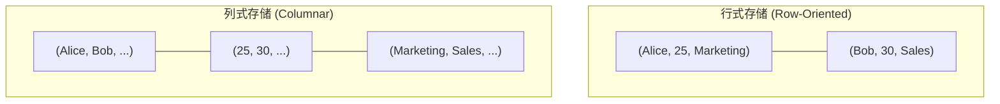
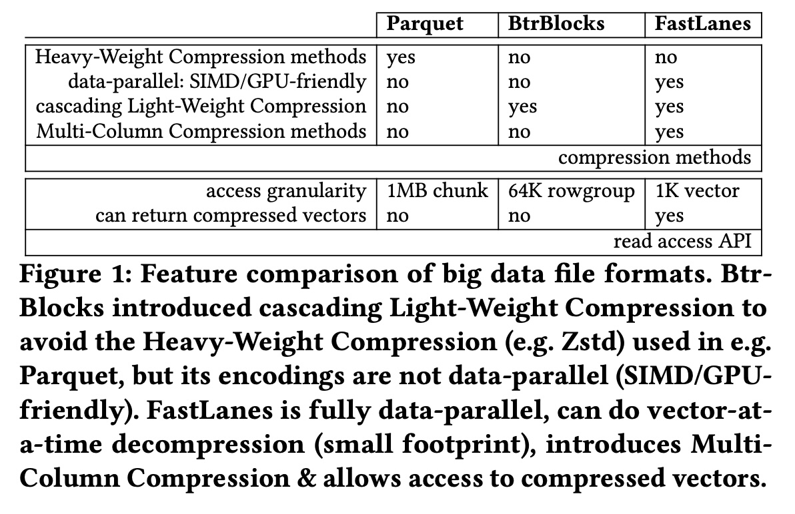
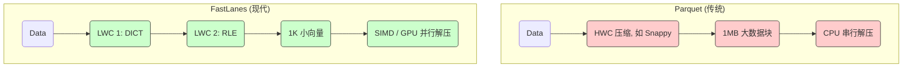
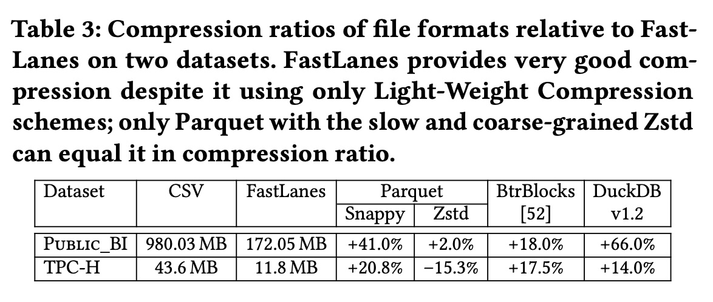
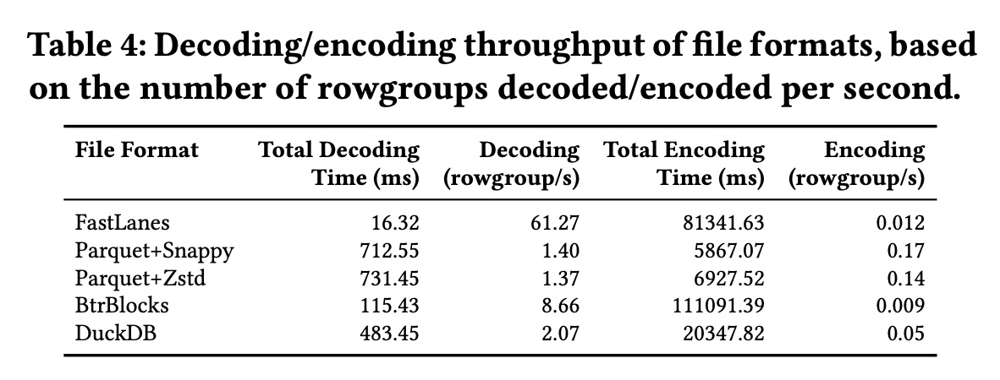
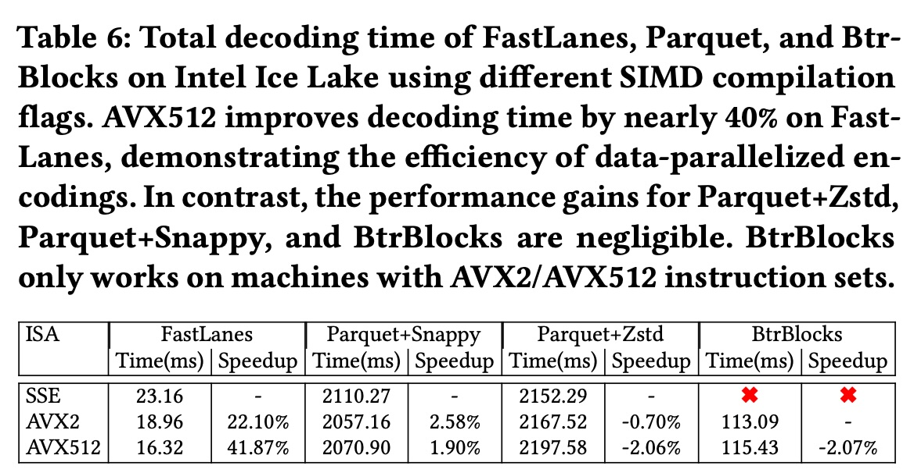
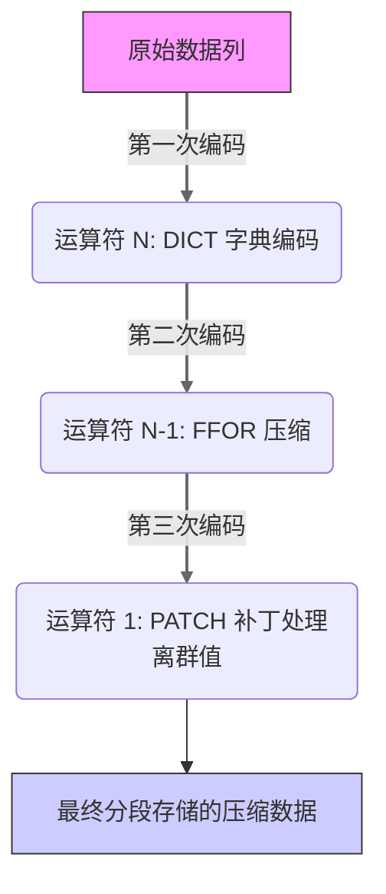

## AI论文解读 | The FastLanes File Format
        
### 作者        
digoal        
        
### 日期        
2025-11-12        
        
### 标签        
PostgreSQL , PolarDB , DuckDB , AI , 论文解读        
        
----        
        
## 背景  
      
https://www.vldb.org/pvldb/vol18/p4629-afroozeh.pdf        
  
提示:          
```          
读懂《The FastLanes File Format》这篇论文需要提前掌握哪些基础知识, 请使用中文通熟易懂的讲解这些基础知识, 可以引用论文中的图、表或使用Markdown支持的图形(text,mermaid等)增加解释性. 
  
使用中文通熟易懂的解读《The FastLanes File Format》这篇论文, 其中的关键内容请着重讲解, 可以引用论文中的图、表或使用Markdown支持的图形(text,mermaid等)增加解释性. 
  
提取《The FastLanes File Format》这篇论文中的重要术语, 使用中文对这些术语进行通熟易懂的讲解, 可以引用论文中的图、表或使用Markdown支持的图形(text,mermaid等)增加解释性. 
```     
  
## 1 前置知识 
  
要深入理解《The FastLanes File Format》这篇论文，你需要具备一些关于数据库存储、数据压缩和现代计算机体系结构的基础知识。这篇论文介绍了一种新的文件格式 ，旨在超越 Parquet  等现有格式，尤其是在现代硬件（如 SIMD 和 GPU）上 。

这里有一份为你准备的“知识导航”，帮助你通俗易懂地掌握阅读这篇论文所需的核心概念：

-----

### 📚 知识点一：数据库是“横着存”还是“竖着存”？（行存 vs. 列存）

这是理解大数据文件格式的**最基本前提**。

  * **行式存储 (Row-Oriented):** 就像我们常用的 Excel 表格，数据一行一行地存。

      * `[Alice, 25, Marketing]`, `[Bob, 30, Sales]`
      * **优点:** 适合“增删改查”整个记录，比如“更新 Alice 的所有信息”。
      * **缺点:** 当你只想分析“所有人的平均年龄”时，系统必须读入整张表（包括你不需要的姓名和部门），非常浪费。

  * **列式存储 (Column-Oriented):** 把同一列的数据存在一起。

      * `[Alice, Bob, ...]`, `[25, 30, ...]`, `[Marketing, Sales, ...]`
      * **优点:** 分析查询（OLAP）的福音！当你计算“平均年龄”时，系统**只需要读取“年龄”那一列**。
      * **额外好处:** 同一列的数据类型相同，分布相似（例如，"年龄"列都是数字），这使得它们**极其容易被压缩** 。

**这对论文意味着什么?**
FastLanes 和 Parquet 都是**列式存储**格式 。这篇论文的所有讨论都建立在“列式存储”的优势之上。



-----

### 📦 知识点二：数据压缩的“重量级”与“轻量级”

为了省空间和I/O，数据总要被压缩。但这篇论文的核心论点是：**压缩方法比压缩率更重要**。

  * **重量级压缩 (Heavy-Weight Compression, HWC):**

      * **是什么?** 通用压缩算法，如 `Snappy` , `Zstd`, 或者你熟悉的 `ZIP`。它们不关心数据是什么，只是寻找字节模式。
      * **缺点:** 压缩和解压通常**很慢**（CPU密集型） ，并且很难在现代硬件上（SIMD/GPU）并行处理 。Parquet 默认使用这类压缩 。

  * **轻量级压缩 (Light-Weight Compression, LWC):**

      * **是什么?** 针对特定数据类型设计的、非常简单且快速的编码（Encoding）方法 。
      * **举例:**
          * **Run-Length Encoding (RLE):** `[A, A, A, A, B, B]` 变成 `[A, 4, B, 2]`。
          * **Dictionary Encoding (DICT):** `['北京', '上海', '北京', '广州']` 变成 `[0, 1, 0, 2]` 和一个字典 `{0:'北京', 1:'上海', 2:'广州'}`。
          * **Delta Encoding (DELTA):** `[100, 102, 103, 105]` 变成 `[100, 2, 1, 2]` (存储第一个值和后续的差值)。
      * **优点:** **解压速度极快** ，并且算法结构简单，非常适合**数据并行**处理 。

> **这对论文意味着什么?**
> FastLanes 的**核心设计**就是**避免使用HWC**，转而全面拥抱 LWC 。

-----

### 🚀 知识点三：现代CPU的“超能力”—— SIMD

这是理解“为什么需要新格式”的**硬件动机**。

  * **SIMD 是什么?**

      * 全称是 **S**ingle **I**nstruction, **M**ultiple **D**ata（单指令多数据流）。
      * **通俗解释:** 传统CPU（SISD）执行 `a+b`，一次只能算一个加法。而拥有SIMD能力的CPU可以一次性执行 `[a1+b1, a2+b2, a3+b3, a4+b4]` 这样的**批量**操作。
      * GPU 则是 SIMD 的终极形态，可以同时处理成千上万的数据。

  * **数据并行 (Data-Parallel):**

      * 要发挥SIMD的能力，你的算法必须是“数据并行”的 。这意味着处理第 `i` 个数据的计算**不依赖**于第 `i-1` 个数据的计算结果。
      * **HWC (如Snappy) 不是数据并行的** ：解压后面的数据通常需要先解压前面的数据。
      * **LWC (如RLE/DICT) 是数据并行的** ：解压字典编码的 `[0, 1, 0, 2]` 时，四个位置可以完全独立地并行查找字典。

> **这对论文意味着什么?**
> FastLanes 被设计为“data-parallel: SIMD/GPU-friendly” ，而 Parquet 和 BtrBlocks 在这方面存在“no”的缺陷（见论文图1）。FastLanes 使用的 LWC 编码可以被编译器**自动向量化**（auto-vectorizing），充分利用SIMD指令集 。  

  

-----

### 🧩 知识点四：LWC 的“组合拳”与“升级版”

光用 LWC 还不够，因为 HWC 的压缩率确实很高 。FastLanes 如何在只用 LWC 的前提下追上 HWC 的压缩率？答案是“组合”与“扩展”。

1.  **级联压缩 (Cascading LWC):**

      * **是什么?** 把多种 LWC **叠加**使用 。
      * **论文中的例子** :
          * 原始数据: `['Cascading', 'Cascading', ... (6次), 'Compression', 'Compression']`
          * **步骤 1 (DICT):** 变成字典 `{'Cascading', 'Compression'}` 和编码 `(0,0,0,0,0,0,1,1)` 。
          * **步骤 2 (RLE):** 对编码 `(0,0,0,0,0,0,1,1)` 再压缩，变成 `({0,6}, {1,2})` 。
      * FastLanes 和 BtrBlocks 都支持这种技术 。

2.  **多列压缩 (Multi-Column Compression, MCC):**

      * **是什么?** 传统列存只压缩单列，但如果两列（或多列）之间有**关联**，就可以利用这种关联来压缩 。
      * **例子**: 如果 `Column_A` 和 `Column_B` 完全相同，那么 `Column_B` 根本不需要存储，只需要一个指针指向A。
      * 这是 FastLanes 的一大亮点，Parquet 和 BtrBlocks 都不支持 。

3.  **表达式编码 (Expression Encoding):**

      * **是什么?** 这是 FastLanes 的**核心贡献** 。它是一个统一的框架，用来灵活地表示和执行上述的“级联压缩”和“多列压缩” 。你可以把它想象成一种“压缩公式”。

-----

### 📊 知识点五：理解“战况”：读懂对比图 (Figure 1)

这篇论文的 Figure 1  是精髓，它直接摆出了 FastLanes (FL) 与 Parquet (P) 和 BtrBlocks (B) 的对比：

| 特性 | Parquet (P) | BtrBlocks (B) | FastLanes (FL) |
| :--- | :---: | :---: | :---: |
| 重量级压缩 (HWC)  | **yes** | no | no |
| 数据并行 (SIMD/GPU友好)  | no | no | **yes** |
| 级联轻量级压缩  | no | **yes** | **yes** |
| 多列压缩 (MCC)  | no | no | **yes** |
| **访问粒度 (Access Granularity)**  | 1MB chunk | 64K rowgroup | **1K vector** |
| **API: 可返回压缩向量**  | no | no | **yes** |

**你需要特别关注最后两行：**

  * **访问粒度 (Access Granularity):**

      * Parquet 读数据，最小单位是 1MB 的大块 。
      * FastLanes 的最小单位是 1K (1024个值) 的小向量 。
      * **为什么这很重要?** 1K的向量小到足以放入CPU的L1缓存或GPU的缓存 。这使得 FastLanes 的**内存足迹非常小** ，而 BtrBlocks 则有“大内存足迹” 。

  * **返回压缩向量 (Compressed Vectors):**

      * **是什么?** 现代查询引擎（如 DuckDB）具备“压缩执行”能力 ：即**直接在压缩数据上执行计算**。
      * **例子**: 如果一个向量被 RLE 压缩为“常量 (Constant)”，比如 1024 个 `5`。查询引擎不需要解压出 1024 个 `5`，而是直接拿 `5` 这个值去做计算，极大提速。
      * FastLanes 的 API 支持这种操作 ，而其他格式不行 。

-----

### 总结

在你开始阅读论文之前，请确保你对以下概念有了清晰的认识：

1.  **列式存储**: 为什么它是分析型查询的基石。
2.  **HWC vs. LWC**: 为什么 FastLanes 厌恶 HWC (慢，非并行) 而拥抱 LWC (快，可并行)。
3.  **SIMD**: 现代硬件的并行能力，这是驱动 FastLanes 设计的核心动机。
4.  **级联与MCC**: FastLanes 用来弥补 LWC 压缩率的“组合拳”。
5.  **访问粒度与压缩执行**: FastLanes 如何通过 1K 向量和新 API 与现代查询引擎深度配合。

掌握了这些，你就能轻松理解论文作者为什么说 FastLanes 是一个“win-win” (双赢)  的设计了。

是否需要我为你详细解释一下论文中提到的“Expression Encoding (表达式编码)”是如何具体实现“级联压缩”和“多列压缩”的？
  
## 2 解读论文 
  
好的，这是一篇信息量非常大且技术性很强的论文。我来为你提炼精髓，用通俗易懂的方式解读 FastLanes 到底做了什么。

-----

### 🚀 论文一句话总结

这篇论文介绍了 **FastLanes** ，一种全新的开源大数据文件格式。它**抛弃了** Parquet 等老格式所依赖的“重量级”压缩（如 Snappy/Zstd），转而使用一系列“轻量级”编码。

通过一个名为 **“表达式编码” (Expression Encoding)** 的核心创新，它不仅在压缩率上媲美甚至超越了 Parquet，同时在**解压速度上实现了40倍以上的碾压** ，并且是为现代 CPU (SIMD) 和 GPU 而生的。

-----

### 1\. 为什么世界需要 FastLanes？（Parquet 的“中年危机”）

要理解 FastLanes，你必须先知道它要解决的“敌人”是谁。

  * **老牌霸主 Parquet (2013年) ：** 这是当今数据湖的王者。它采用列式存储，并默认使用**重量级压缩 (HWC)**，比如 Google 的 **Snappy** 或 Facebook 的 **Zstd** 。
  * **HWC 的问题：** 它们是通用压缩算法，很慢。更致命的是，它们的算法**天生就是串行的**，充满了数据和控制依赖 。
  * **新时代的挑战：**
    1.  **硬件变了：** 现代 CPU 不再只靠提核频，而是靠 **SIMD**（单指令多数据流，比如 AVX512）。GPU 和 TPU 更是AI管道的核心 。这些硬件都极度依赖**数据并行**。
    2.  **Parquet 的尴尬：** Snappy/Zstd 这类 HWC 算法，是**数据并行的“天敌”** 。你没法让 SIMD 或 GPU 高效地去解压它们。

FastLanes 的核心动机就是：**创造一种100%“数据并行友好” (SIMD/GPU-friendly) 的文件格式** 。

### 2\. FastLanes 的三大“黑科技”

FastLanes 如何做到既要高压缩率，又要超快并行解压的？

#### 关键内容 1: 核心创新 “表达式编码” (Expression Encoding)

这是整篇论文的**灵魂**。

Parquet 使用的是“重量级压缩”(HWC)，而 FastLanes 只使用 **“轻量级压缩” (LWC)** ，也叫编码 (Encodings)。LWC 本身很简单，比如：

  * **RLE (Run-Length Encoding):** `[A, A, A, A]` 存成 `(A, 4)`。
  * **DICT (Dictionary):** `[北京, 上海, 北京]` 存成 `[0, 1, 0]` + 字典 `(0:北京, 1:上海)`。
  * **DELTA:** `[100, 102, 103]` 存成 `[100, 2, 1]`。

这些 LWC 单个使用时压缩率有限，但 FastLanes 的天才之处在于把它们“组合”和“扩展”了：

1.  **级联压缩 (Cascading LWC)**

      * **概念：** 将 LWC 像乐高一样叠加。
      * **论文中的例子 ：**
          * 数据：`['Cascading', 'Cascading', ... (6次), 'Compression', 'Compression']`
          * 第一层 (DICT)：编码为 `(0,0,0,0,0,0,1,1)` 和一个字典。
          * 第二层 (RLE)：再对 `(0,0,0,0,0,0,1,1)` 进行 RLE 压缩，得到 `({0,6}, {1,2})`。
      * 效果：压缩率大大提升。

2.  **多列压缩 (Multi-Column Compression, MCC)**

      * **概念：** 传统列存只看单列，但如果两列有关联呢？
      * **例子：** `Column A` 和 `Column B` 的值**完全一样** 。Parquet 还是会傻傻地存两遍。
      * **FastLanes：** 只存 `Column A`，`Column B` 只存一个“EQUALITY (相等)”标记 ，几乎不占空间。

**“表达式编码” (Expression Encoding)** 就是一个统一的框架，用来灵活地、系统地描述和执行这些任意复杂的“级联”和“多列”压缩组合。它就像一个压缩“公式”，非常灵活。

#### 关键内容 2: 专为现代硬件设计的“数据布局”

FastLanes 不仅算法是并行的，它的文件布局也是为了并行而设计的。




1.  **细粒度访问 (1K Vector)**

      * Parquet 通常按 **1MB** 的大块 (Chunk) 访问数据 。
      * FastLanes 按 **1K** (1024个值) 的小向量 (Vector) 访问 。
      * **为什么 1K 很关键？** 因为 1K 大小的数据刚好可以**塞进 CPU 的 L1 缓存**或 **GPU 的缓存** 。这意味着解压时数据不得到处搬运，速度极快。

2.  **分段页面布局 (Segmented Page Layout)**

      * 这是一个配套的文件布局。它把“表达式编码”产生的所有“同类”数据（比如所有字典、所有RLE编码）存在一起 。这使得并行访问和数据读取最高效。

#### 关键内容 3: 支持“压缩执行”的新 API

这是 FastLanes 另一个超越时代的特性。

  * **传统方式：** `从磁盘读 -> 解压 -> 执行查询`
  * **压缩执行 (Compressed Execution)：** `从磁盘读 -> 直接在压缩数据上执行查询` 
  * **例子：**
      * 一个列被压缩为“常量” (Constant)，比如1024个值都是 `5` 。
      * 查询：`SELECT COUNT(*) WHERE col = 5`
      * **Parquet：** 必须先解压出 1024 个 `5`，然后再一个个比较。
      * **FastLanes：** 它的 API 可以告诉查询引擎：“嘿，这是个常量 `5`” 。引擎（如DuckDB）就能跳过解压，直接知道结果是 1024，速度快几个数量级。

-----

### 3\. “战况”如何？(FastLanes vs. Parquet)

论文用详尽的实验证明了 FastLanes 是“双赢”(win-win) 。我们来看最核心的对比 (基于论文 Table 1, 3, 4, 6)。

**功能对比 (Figure 1 摘要)**     

| 特性 | Parquet | BtrBlocks | **FastLanes** |
| :--- | :---: | :---: | :---: |
| 重量级压缩 (HWC) | **yes** | no | no |
| **数据并行 (SIMD/GPU友好)** | no | no | **yes** |
| 级联轻量级压缩 (LWC) | no | **yes** | **yes** |
| 多列压缩 (MCC) | no | no | **yes** |
| 访问粒度 (越小越好) | 1MB chunk | 64K rowgroup | **1K vector** |
| **可返回压缩向量** | no | no | **yes** |

**性能对比 (Table 3 & 4 摘要)**  

  * **压缩率 (Table 3)**     

      * **FastLanes vs. Parquet+Snappy (常用):** FastLanes 压缩率**高 41%**。
      * **FastLanes vs. Parquet+Zstd (最强):** FastLanes 压缩率**高 2%**。
      * **结论：** FastLanes 仅用 LWC 就实现了比 HWC 更高的压缩率。

  * **解压速度 (Table 4)**     

      * **FastLanes: 61.27** (rowgroup/s)
      * BtrBlocks: 8.66 (rowgroup/s)
      * Parquet+Snappy: 1.40 (rowgroup/s)
      * Parquet+Zstd: 1.37 (rowgroup/s)
      * **结论：** FastLanes 解压**比 Parquet 快 40 多倍**，比 BtrBlocks 快 7 倍。

  * **SIMD 效果 (Table 6)**     

      * 编译 FastLanes 时开启 AVX512 (一种 SIMD 指令集)，其**解码速度提升了近 40%**。
      * 而 Parquet 和 BtrBlocks 在开启 AVX512 后，性能**几乎没有提升**（甚至负优化）。
      * **结论：** 这铁证如山地表明，FastLanes 是**真正的数据并行友好**格式，而其他格式不是。

-----

### 总结与启示

FastLanes 的设计理念是革命性的。它抓住了一个核心痛点：**文件格式的设计必须与现代硬件（SIMD/GPU）的并行特性相匹配。**

它通过“表达式编码”这一核心抽象，在只使用轻量级、并行友好的 LWC 的前提下，通过“级联”和“多列压缩”实现了比 HWC 更高的压缩率；同时，通过“1K向量”的细粒度布局，完美契合了 CPU/GPU 缓存，最终实现了**比 Parquet 快 40 多倍**的恐怖解压速度。

这篇论文预示了下一代数据格式的未来：**放弃通用但缓慢的 HWC，全面拥抱为并行硬件定制的 LWC 组合**。

您是否想了解更多关于“多列压缩”(MCC) 具体是如何在 FastLanes 中工作的？
  
## 3 术语 
  
好的，以下是根据论文《The FastLanes File Format》提取的重要术语及其通俗易懂的中文讲解，并引用了论文中的概念来增加解释性。

-----

## 《The FastLanes File Format》重要术语解释

FastLanes 是一种新的开源大数据文件格式 ，旨在取代或改进 Parquet 等现有格式，尤其针对现代数据并行执行（SIMD 或 GPU）进行了优化 。

### 1\. 表达式编码 (Expression Encoding)

| 术语 | Expression Encoding |
| :--- | :--- |
| **通俗讲解** | 表达式编码是 FastLanes 的核心创新 。你可以将其理解为一个 **灵活的“压缩食谱”** ，它不是只用一种压缩方法，而是将多个简单、高效的压缩/编码方法（称为**运算符 Operator**）串联起来，形成一个**编码链**（或表达式）。这个机制统一了级联编码、多列压缩和向量化解码等功能 。 |
| **技术特点** | 表达式本身使用类似**逆波兰表示法 (RPN)** 的修改形式存储在文件元数据中，将操作符和操作数存储为整数 ID，从而最大限度地减少运行时解释的开销 。|

**表达式编码（Expression Encoding）示例：运算符链**
表达式编码将数据通过一系列运算符进行处理，从而实现高度灵活和高效的压缩。



### 2\. 级联编码 (Cascaded Encoding)

| 术语 | Cascaded Encoding / Recursive Compression |
| :--- | :--- |
| **通俗讲解** | 级联编码是指将多个**轻量级压缩 (LWC)** 方案组合在一起 。目的是在保持 LWC 极快解压速度的同时，实现与**重量级压缩 (HWC)**（如 Snappy）相当的压缩率 。它通过捕获更广泛的数据模式来提高压缩率 。|

**级联编码工作流示例（RLE + DICT）：**

1.  **原始数据：** `{'Cascading', 'Cascading', 'Cascading', 'Cascading', 'Cascading', 'Cascading', 'Compression', 'Compression'}` 
2.  **应用 DICT (字典编码)：**
      * 将重复的字符串值转换为较短的代码（Codes）。
      * 结果：`代码 (0,0,0,0,0,0,1,1)`，`字典 {'Cascading', 'Compression'}` 
3.  **对代码应用 RLE (行程长度编码)：**
      * 将重复的代码序列压缩。
      * 结果：`{{0, 重复 6 次}, {1, 重复 2 次}}` 
      * 通过两次压缩，实现了比只用其中一种方法更好的压缩比。

### 3\. 多列压缩 (Multi-Column Compression, MCC)

| 术语 | Multi-Column Compression (MCC) |
| :--- | :--- |
| **通俗讲解** | 传统列式存储格式（如 Parquet）独立存储和压缩每一列，从而错失了利用列与列之间相关性的机会 。MCC 利用列之间的相关性来提高压缩率 。|
| **应用场景** | \* **列完全相同：** 如果 A 列和 B 列完全相同，只需存储其中一列的数据和另一列的引用。  \* **列可拆分：** 将一个列（如混合字符串“Compression101”）拆分成多个子列（字符串和整数），然后分别进行高效编码 。|

FastLanes 中的 **EXTERNAL-DICT** 运算符就支持 MCC，它允许一列使用另一列的代码（codes）但采用不同的字典，以支持具有一对一映射关系的列相关性 。

### 4\. 向量化解码与细粒度访问 (Vectorized Decoding & Fine-Grained Access)

| 术语 | Vectorized Decoding / Fine-Grained Access |
| :--- | :--- |
| **通俗讲解** | **向量化解码**是指将压缩数据解码成较小的**向量**（例如 1024 个值的数组）。这种**细粒度访问**（以小批量 Vector 而非 Rowgroup 为单位）的目的是：<br>1. **减少内存占用：** 确保解压缩后的数据能够放入 CPU 的 L1 缓存或 GPU 缓存 。<br>2. **即时处理：** 解码后的向量立即由查询管线处理，避免将数据溢出到主内存（RAM）。<br>3. **快速存取：** 这种模式能充分利用高速缓存和 SIMD 指令，使读取和解压缩 FastLanes 数据比读取未压缩数据更快 。|

### 5\. 轻量级压缩运算符（LWC Operators）

FastLanes 的表达式编码由一系列**运算符**（Operators）构成，这些运算符是可重用且高效的数据结构 ，它们通常是传统 LWC 方案的组成部分：

  * **FFOR (Fused Frame Of Reference) ：** 一种针对整数的编码，将数据存储为一个**基值 (Base)** 和一个**位封装 (bit-packed) 数据**的向量。它与位封装操作融合，消除了 SIMD 的存储和加载指令，提高了性能 。
  * **PATCH (补丁运算符) ：** 用于处理数据中的**离群值 (outliers)**。它将离群值单独存储，并在完全解压时重新集成 。FastLanes 采用 **Selection Vector patching** 补丁机制，因为它可以在 GPU 上进行数据并行化 。
  * **DICT (字典编码) ：** 将重复值替换为代码（codes）。FastLanes 支持**压缩字典**（使用 Cast 和 FSST 等编码压缩字典）和 **Shuffle Dictionary**（将最重复的少数值加载到 SIMD 寄存器中解码）。
  * **FSST / FSST12 (轻量级字符串压缩) ：** 用于 STRING 数据的轻量级压缩。它使用静态符号表，允许对单个压缩字符串进行**随机访问**，从而可以直接在压缩数据上进行查询处理 。FSST12 使用 12 位代码，适用于 JSON 和 XML 等具有更高熵的分布 。
  * **Cast (类型转换) ：** 允许将列的值保留为不同于模式中指定的类型，以简化编码和查询执行（例如：将 64 位整数转换为 8 位整数）。它是实现**压缩执行**的有用终点 。

### 6\. 压缩执行 (Compressed Execution)

| 术语 | Compressed Execution |
| :--- | :--- |
| **通俗讲解** | 现代查询引擎（如 DuckDB、Velox）支持的一种能力 。查询引擎无需将数据完全解压缩回其原始 SQL 类型，而是直接在**压缩向量**（Compressed Vectors）上执行查询 。<br>例如，如果一个浮点数被压缩为 8 位整数（通过 **Cast** 运算符），查询引擎可以直接在 8 位整数上执行比较和算术操作 。这能利用更窄的 SIMD 通道加速解码，并减少内存压力 。|
| **FastLanes 支持** | FastLanes 的 API 支持**部分解压缩**，可以直接将压缩向量交付给能够处理它们的查询引擎 。同时，编码中捕获的模式（如常量编码）可以用于优化查询执行（例如，对常量列的操作只需执行一次）。|
  
## 参考        
         
https://www.vldb.org/pvldb/vol18/p4629-afroozeh.pdf    
        
<b> 以上内容基于DeepSeek、Qwen、Gemini及诸多AI生成, 轻微人工调整, 感谢杭州深度求索人工智能、阿里云、Google等公司. </b>        
        
<b> AI 生成的内容请自行辨别正确性, 当然也多了些许踩坑的乐趣, 毕竟冒险是每个男人的天性.  </b>        
  
    
#### [PolarDB 学习图谱](https://www.aliyun.com/database/openpolardb/activity "8642f60e04ed0c814bf9cb9677976bd4")
  
  
#### [PostgreSQL 解决方案集合](../201706/20170601_02.md "40cff096e9ed7122c512b35d8561d9c8")
  
  
#### [德哥 / digoal's Github - 公益是一辈子的事.](https://github.com/digoal/blog/blob/master/README.md "22709685feb7cab07d30f30387f0a9ae")
  
  
#### [About 德哥](https://github.com/digoal/blog/blob/master/me/readme.md "a37735981e7704886ffd590565582dd0")
  
  

  
