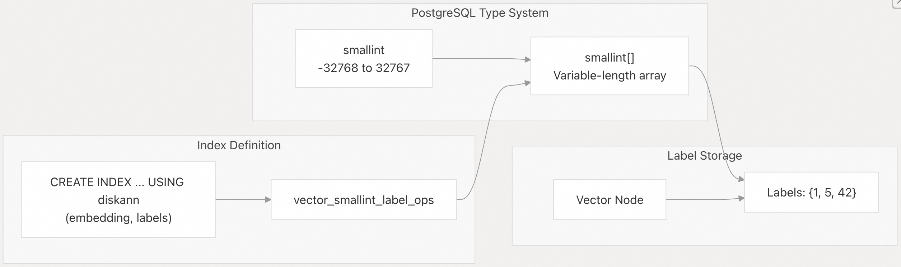
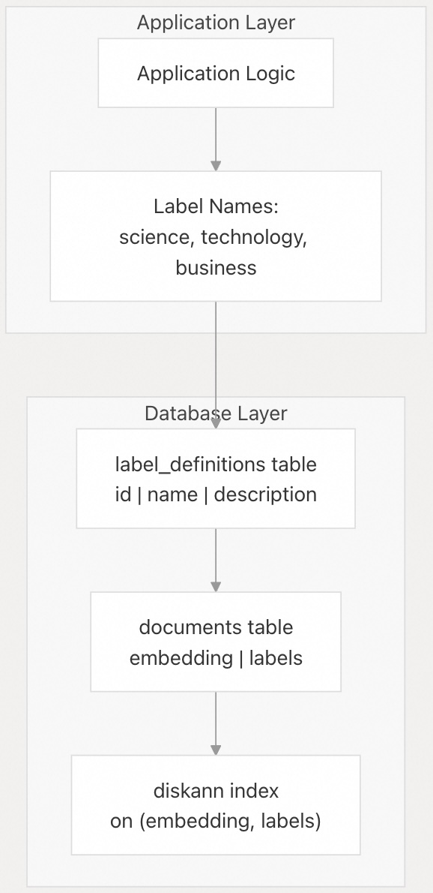
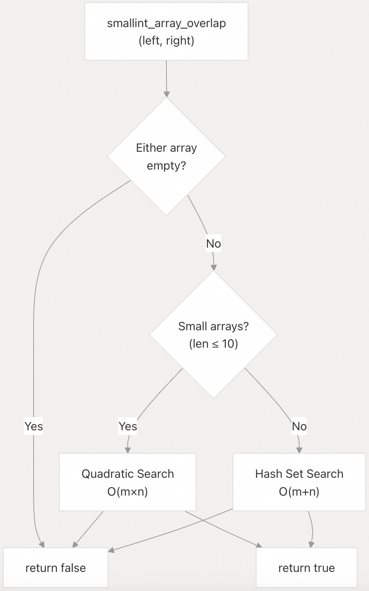
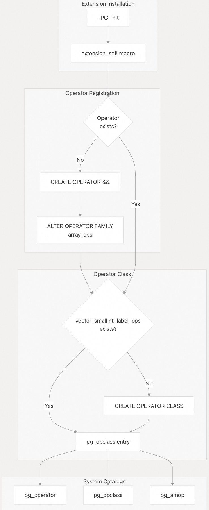
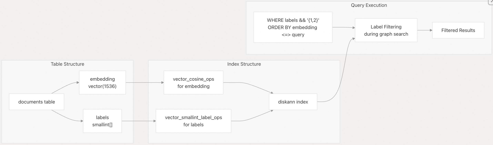
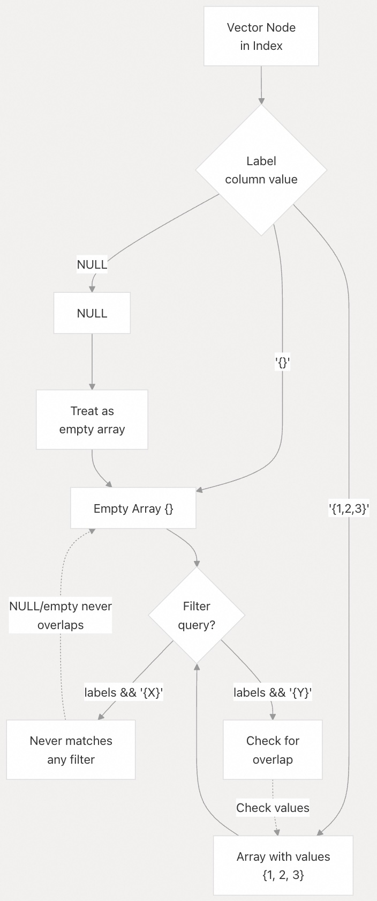

## pgvectorscale 源码学习: 7.1 标签实现 (Label Implementation)  
                                    
### 作者                                    
digoal                                    
                                    
### 日期                                    
2025-11-12                                   
                                    
### 标签                                    
pgvectorscale , 向量数据库 , DiskANN , StreamingDiskANN , 源码学习                                    
                                    
----                                    
                                    
## 背景                       
本文详细介绍了 **pgvectorscale** 中基于标签（**label-based**）的过滤技术的实现细节，包括标签的内部表示（**internal representation**）、重叠运算符（**overlap operator**）的实现，以及 **PostgreSQL** 目录集成（**catalog integration**）。  
  
## 目的和范围 (Purpose and Scope)  
  
**pgvectorscale** 中的标签（**Labels**）能够基于元数据类别（**metadata categories**）高效地过滤向量搜索结果。涵盖以下内容：  
  
  * 标签的 `smallint[]` 数组表示。  
  * 通过 `smallint_array_overlap` 实现 `&&` 重叠运算符（**overlap operator**）。  
  * 在 **PostgreSQL** 中注册运算符类（**Operator class**）。  
  * 对 **NULL** 和空标签的处理语义。  
  
标签实现基于 [Filtered DiskANN](https://dl.acm.org/doi/10.1145/3543507.3583552) 方法，该方法能够实现高效的过滤向量搜索（**filtered vector search**），同时保持高召回率（**high recall**）。  
  
## 标签数据类型和表示 (Label Data Type and Representation)  
  
### Smallint 数组存储 (Smallint Array Storage)  
  
标签存储为 **PostgreSQL** 的 `smallint[]` 数组，其中每个标签是一个 16 位有符号整数（**16-bit signed integer**），范围在 -32768 到 32767 之间。此选择提供了以下几项优势：  
  
| 方面 (Aspect) | 理由 (Rationale) |  
| :--- | :--- |  
| **类型安全 (Type Safety)** | **PostgreSQL** 的类型系统自动强制执行边界检查（**bounds checking**） |  
| **紧凑存储 (Compact Storage)** | 每个标签 2 字节，而标准整型为 4 字节 |  
| **整数语义 (Integer Semantics)** | 高效的比较和哈希（**hashing**）操作 |  
| **范围 (Range)** | 65,536 个不同的标签值足以满足大多数用例 |  
  
  
  
Diagram: Label Type System Integration  
  
`smallint[]` 类型在插入时强制执行边界检查（**enforces bounds**），防止无效的标签值进入索引：  
  
```sql  
-- Valid: within smallint range  
INSERT INTO documents (embedding, labels) VALUES ('[1,2,3]', '{1, 100, 32767}');  
  
-- Invalid: 32768 exceeds smallint maximum  
INSERT INTO documents (embedding, labels) VALUES ('[1,2,3]', '{32768}');  
-- ERROR: smallint out of range  
```  
  
来源:  
[`README.md` 216-218](https://github.com/timescale/pgvectorscale/blob/36271fa5/README.md#L216-L218)  
[`pgvectorscale/src/access_method/labels/filtering_tests.rs` 718-793](https://github.com/timescale/pgvectorscale/blob/36271fa5/pgvectorscale/src/access_method/labels/filtering_tests.rs#L718-L793)  
  
### 语义标签映射 (Semantic Label Mapping)  
  
虽然标签出于性能考虑存储为整数（**integers**），但应用程序通常通过一个单独的查找表（**lookup table**）将它们映射到语义含义（**semantic meanings**）：  
  
  
  
Diagram: Semantic Label Architecture  
  
例子  
```sql  
CREATE TABLE label_definitions (  
    id INTEGER PRIMARY KEY,  
    name TEXT,  
    description TEXT  
);  
  
INSERT INTO label_definitions VALUES  
    (1, 'science', 'Scientific content'),  
    (2, 'technology', 'Technology-related content'),  
    (3, 'business', 'Business and finance content');  
```  
  
来源:  
[`README.md` 233-289](https://github.com/timescale/pgvectorscale/blob/36271fa5/README.md#L233-L289)  
[`pgvectorscale/src/access_method/labels/filtering_tests.rs` 513-589](https://github.com/timescale/pgvectorscale/blob/36271fa5/pgvectorscale/src/access_method/labels/filtering_tests.rs#L513-L589)  
  
## `&&` 重叠运算符实现 (The && Overlap Operator Implementation)  
  
### 函数签名和算法 (Function Signature and Algorithm)  
  
`smallint_array_overlap` 函数为 `smallint[]` 数组实现了 `&&` 运算符。它检查两个数组是否至少有一个共同的元素。  
  
  
  
Diagram: Overlap Operator Decision Tree  
  
该实现基于数组大小使用两种策略：  
  
| 数组大小 (Array Size) | 算法 (Algorithm) | 复杂度 (Complexity) | 数据结构 (Data Structure) |  
| :--- | :--- | :--- | :--- |  
| **每个 ≤ 10 个元素** | 嵌套循环 (**Nested loop**) | O(m×n) | 无 (None) |  
| **\> 10 个元素** | 哈希集 (**Hash set**) | O(m+n) | `HashSet<i16>` |  
  
### 实现细节 (Implementation Details)  
  
**小数组 (≤10 个元素):** [`pgvectorscale/src/access_method/mod.rs` 286-294](https://github.com/timescale/pgvectorscale/blob/36271fa5/pgvectorscale/src/access_method/mod.rs#L286-L294)  
  
```rust  
// Simple quadratic search for small arrays  
if left.len() <= 10 && right.len() <= 10 {  
    for a in left.iter() {  
        for b in right.iter() {  
            if a.is_some() && b.is_some() && a.unwrap() == b.unwrap() {  
                return true;  
            }  
        }  
    }  
}  
```  
  
**大数组 (\>10 个元素):** [`pgvectorscale/src/access_method/mod.rs` 295-309](https://github.com/timescale/pgvectorscale/blob/36271fa5/pgvectorscale/src/access_method/mod.rs#L295-L309)  
  
```rust  
// Use hash set for larger arrays  
let mut left_set = HashSet::new();  
for a in left.into_iter().flatten() {  
    if !left_set.contains(&a) {  
        left_set.insert(a);  
    }  
}  
  
for b in right.into_iter().flatten() {  
    if left_set.contains(&b) {  
        return true;  
    }  
}  
```  
  
10 个元素的截止值（**cutoff**）平衡了以下几点：  
  
  * **小数组**: 避免哈希集（**hash set**）分配开销（**allocation overhead**）。  
  * **大数组**: 减少二次方复杂度（**quadratic complexity**）。  
  
来源:  
[`pgvectorscale/src/access_method/mod.rs` 278-312](https://github.com/timescale/pgvectorscale/blob/36271fa5/pgvectorscale/src/access_method/mod.rs#L278-L312)  
  
### NULL 值处理 (NULL Value Handling)  
  
该函数通过跳过数组中的 **NULL** 值来显式处理它们：  
  
| 情景 (Scenario) | 行为 (Behavior) | 示例 (Example) |  
| :--- | :--- | :--- |  
| **左数组中存在 NULL** | 被忽略 (**Ignored**) | `{1, NULL, 3} && {3}` → `true` (因为匹配 3) |  
| **右数组中存在 NULL** | 被忽略 (**Ignored**) | `{1, 2} && {NULL, 2}` → `true` (因为匹配 2) |  
| **两个数组都有 NULL** | 被忽略 (**Ignored**) | `{1, NULL} && {NULL, 2}` → `false` |  
| **空数组 (Empty array)** | 无重叠 (**No overlap**) | `{} && {1, 2}` → `false` |  
  
这是通过迭代器方法 `flatten()` 实现的，该方法会过滤掉 `None` 值：  
  
```rust  
for a in left.into_iter().flatten() { ... }  
```  
  
来源:  
[`pgvectorscale/src/access_method/mod.rs` 288-309](https://github.com/timescale/pgvectorscale/blob/36271fa5/pgvectorscale/src/access_method/mod.rs#L288-L309)  
[`README.md` 374-378](https://github.com/timescale/pgvectorscale/blob/36271fa5/README.md#L374-L378)  
  
## 运算符类注册 (Operator Class Registration)  
  
### SQL 生成和幂等安装 (SQL Generation and Idempotent Installation)  
  
标签的运算符类（**operator class**）在扩展安装期间使用 `extension_sql!` 宏（**macro**）进行注册。该 **SQL** 被设计为幂等（**idempotent**），允许从旧版本安全升级。  
  
  
  
Diagram: Operator Class Registration Flow  
  
### 运算符定义 (Operator Definition)  
  
如果 `&&` 运算符尚不存在，则创建它：[`pgvectorscale/src/access_method/mod.rs` 230-252](https://github.com/timescale/pgvectorscale/blob/36271fa5/pgvectorscale/src/access_method/mod.rs#L230-L252)  
  
```sql  
IF NOT EXISTS (  
    SELECT 1 FROM pg_operator   
    WHERE oprname = '&&'   
    AND oprleft = 'smallint[]'::regtype   
    AND oprright = 'smallint[]'::regtype  
) THEN  
    CREATE OPERATOR && (  
        LEFTARG = smallint[],  
        RIGHTARG = smallint[],  
        PROCEDURE = smallint_array_overlap,  
        COMMUTATOR = &&,  
        RESTRICT = contsel,  
        JOIN = contjoinsel  
    );  
END IF;  
```  
  
关键属性：  
  
  * **PROCEDURE**: 链接到 `smallint_array_overlap` 函数。  
  * **COMMUTATOR**: 左右两个算子可自交换性（**Self-commutative**），即 `a && b ≡ b && a`。  
  * **RESTRICT/JOIN**: 用于查询规划（**query planning**）的 **PostgreSQL** 选择性估计函数（**selectivity estimation functions**）。  
  
来源:  
[`pgvectorscale/src/access_method/mod.rs` 230-252](https://github.com/timescale/pgvectorscale/blob/36271fa5/pgvectorscale/src/access_method/mod.rs#L230-L252)  
  
### 运算符类创建 (Operator Class Creation)  
  
运算符类将 `&&` 运算符与 **diskann** 访问方法（**access method**）关联起来：[`pgvectorscale/src/access_method/mod.rs` 254-258](https://github.com/timescale/pgvectorscale/blob/36271fa5/pgvectorscale/src/access_method/mod.rs#L254-L258)  
  
```sql  
CREATE OPERATOR CLASS vector_smallint_label_ops  
DEFAULT FOR TYPE smallint[] USING diskann AS  
    OPERATOR 1 &&;  
```  
  
这将创建以下目录条目：  
  
| 目录 (Catalog) | 关键字段 (Key Fields) | 目的 (Purpose) |  
| :--- | :--- | :--- |  
| `pg_opclass` | `opcname = 'vector_smallint_label_ops'` `opcmethod = diskann OID` | 为标签列定义运算符类 |  
| `pg_amop` | `amopopr = && operator OID` `amopmethod = diskann OID` | 将 `&&` 与 **diskann** 方法关联 |  
  
`DEFAULT` 关键字使得当在 **diskann** 索引中指定 `smallint[]` 列时，它成为默认的运算符类（**default operator class**）。  
  
来源:  
[`pgvectorscale/src/access_method/mod.rs` 254-258](https://github.com/timescale/pgvectorscale/blob/36271fa5/pgvectorscale/src/access_method/mod.rs#L254-L258)  
[`pgvectorscale/src/access_method/mod.rs` 161-270](https://github.com/timescale/pgvectorscale/blob/36271fa5/pgvectorscale/src/access_method/mod.rs#L161-L270)  
  
## 使用标签创建索引 (Index Creation with Labels)  
  
### 多列索引语法 (Multi-Column Index Syntax)  
  
标签在索引定义中被指定为第二列：  
  
```sql  
CREATE INDEX idx_name ON table_name   
USING diskann (embedding_column distance_ops, label_column);  
```  
  
示例：  
  
```sql  
CREATE TABLE documents (  
    id SERIAL PRIMARY KEY,  
    embedding VECTOR(1536),  
    labels SMALLINT[]  
);  
  
-- Create index with label support  
CREATE INDEX idx_documents ON documents   
USING diskann (embedding vector_cosine_ops, labels);  
```  
  
  
  
Diagram: Multi-Column Index Structure  
  
列的顺序很重要：  
  
1.  **第一列 (embedding)**: 带有距离运算符类（**distance operator class**，例如 `vector_cosine_ops`）的向量列。  
2.  **第二列 (labels)**: 标签数组列（运算符类自动选择）。  
  
来源:  
[`README.md` 194-230](https://github.com/timescale/pgvectorscale/blob/36271fa5/README.md#L194-L230)  
[`pgvectorscale/src/access_method/labels/filtering_tests.rs` 27-44](https://github.com/timescale/pgvectorscale/blob/36271fa5/pgvectorscale/src/access_method/labels/filtering_tests.rs#L27-L44)  
  
### 运算符类选择 (Operator Class Selection)  
  
创建索引时，**PostgreSQL** 如下选择运算符类：  
  
| 列 (Column) | 运算符类 (Operator Class) | 选择方法 (Selection Method) |  
| :--- | :--- | :--- |  
| `embedding` | 显式指定 (例如 `vector_cosine_ops`) | 用户在 `CREATE INDEX` 中提供 |  
| `labels` | `vector_smallint_label_ops` (自动选择) | `smallint[]` 类型的 `DEFAULT` |  
  
系统会自动推断（**infers**）标签运算符类，因为在 **diskann** 访问方法中，`vector_smallint_label_ops` 被标记为 `smallint[]` 类型的 `DEFAULT`。  
  
来源:  
[`pgvectorscale/src/access_method/mod.rs` 254-258](https://github.com/timescale/pgvectorscale/blob/36271fa5/pgvectorscale/src/access_method/mod.rs#L254-L258)  
  
## NULL 和空标签语义 (NULL and Empty Label Semantics)  
  
### 顶层 NULL 处理 (Top-Level NULL Handling)  
  
当标签列包含顶层 **NULL** 值（而不是带有 **NULL** 元素的数组）时，出于过滤目的，它被视为一个空数组（**empty array**）。  
  
  
  
行为矩阵：  
  
| 节点标签 (Node Labels) | 查询过滤器 (Query Filter) | 匹配? (Matches?) | 原因 (Reason) |  
| :--- | :--- | :--- | :--- |  
| `NULL` | `labels && '{1}'` | 否 (No) | NULL 被视为 `{}` |  
| `{}` | `labels && '{1}'` | 否 (No) | 空数组无重叠 |  
| `{1, 2}` | `labels && '{1}'` | 是 (Yes) | `1` 同时出现 |  
| `{NULL, 1, 2}` | `labels && '{1}'` | 是 (Yes) | NULL 元素被忽略 |  
| `{NULL}` | `labels && '{1}'` | 否 (No) | 过滤 NULL 后，实际为空 |  
  
来源:  
[`README.md` 374-378](https://github.com/timescale/pgvectorscale/blob/36271fa5/README.md#L374-L378)  
[`pgvectorscale/src/access_method/labels/filtering_tests.rs` 22-109](https://github.com/timescale/pgvectorscale/blob/36271fa5/pgvectorscale/src/access_method/labels/filtering_tests.rs#L22-L109)  
  
### 数组内的 NULL 元素 (NULL Elements Within Arrays)  
  
出现在标签数组元素中的 **NULL** 值，在重叠检查期间会被静默地忽略：  
  
**示例 1:** [`pgvectorscale/src/access_method/labels/filtering_tests.rs` 42](https://github.com/timescale/pgvectorscale/blob/36271fa5/pgvectorscale/src/access_method/labels/filtering_tests.rs#L42-L42)  
  
```sql  
-- Insert array with NULL element  
INSERT INTO test (embedding, labels) VALUES   
    ('[10,11,12]', '{1, NULL, 3}');  
  
-- Query for label 3  
SELECT * FROM test   
WHERE labels && '{3}'  -- Matches! NULL is ignored, 3 matches  
ORDER BY embedding <=> '[0,0,0]';  
```  
  
**示例 2:** 仅含 NULL 的数组  
  
```sql  
-- Effectively becomes empty after NULL filtering  
INSERT INTO test (embedding, labels) VALUES   
    ('[7,8,9]', '{NULL}');  
  
-- No match because array is empty after removing NULLs  
SELECT * FROM test   
WHERE labels && '{1}'  -- Does not match  
ORDER BY embedding <=> '[0,0,0]';  
```  
  
这种行为与 **PostgreSQL** 对数组中 **NULL** 值的一般处理一致，也与实现中使用 `.flatten()` 跳过 **NULL** 元素的做法一致。  
  
来源:  
[`pgvectorscale/src/access_method/mod.rs` 288-309](https://github.com/timescale/pgvectorscale/blob/36271fa5/pgvectorscale/src/access_method/mod.rs#L288-L309)  
[`pgvectorscale/src/access_method/labels/filtering_tests.rs` 22-109](https://github.com/timescale/pgvectorscale/blob/36271fa5/pgvectorscale/src/access_method/labels/filtering_tests.rs#L22-L109)  
  
## 性能特征 (Performance Characteristics)  
  
### 重叠操作复杂度 (Overlap Operation Complexity)  
  
`smallint_array_overlap` 函数具有以下复杂度特征：  
  
| 情景 (Scenario) | 时间复杂度 (Time Complexity) | 空间复杂度 (Space Complexity) | 注释 (Notes) |  
| :--- | :--- | :--- | :--- |  
| **两个数组均 ≤10 个元素** | O(m×n) | O(1) | 简单的嵌套循环 |  
| **任一数组 \>10 个元素** | O(m+n) | O(m) | 为左数组使用哈希集 |  
| **空数组** | O(1) | O(1) | 提前返回 |  
  
对于典型的标签基数（**label cardinalities**，每个文档 2-20 个标签），二次算法（**quadratic algorithm**）通常是最快的，原因如下：  
  
  * 没有堆分配（**heap allocation**）开销。  
  * 更好的缓存局部性（**cache locality**）。  
  * 更少的分支预测错误（**branch mispredictions**）。  
  
### 与其他数组类型的比较 (Comparison with Other Array Types)  
  
| 类型 (Type) | 每个标签大小 (Size per Label) | 范围 (Range) | 重叠实现 (Overlap Implementation) |  
| :--- | :--- | :--- | :--- |  
| `smallint[]` | 2 字节 | -32,768 到 32,767 | 定制优化函数 |  
| `integer[]` | 4 字节 | ±20 亿 | 需要单独的运算符 |  
| `bigint[]` | 8 字节 | ±9 百亿亿 | 需要单独的运算符 |  
  
`smallint[]` 的选择为大多数标签过滤用例提供了范围（**range**）和存储效率（**storage efficiency**）的最佳平衡。  
  
来源:  
[`pgvectorscale/src/access_method/mod.rs` 278-312](https://github.com/timescale/pgvectorscale/blob/36271fa5/pgvectorscale/src/access_method/mod.rs#L278-L312)  
  
## 测试和验证 (Testing and Validation)  
  
标签实现包括涵盖以下内容的全面测试：  
  
| 测试类别 (Test Category) | 覆盖范围 (Coverage) | 来源 (Source) |  
| :--- | :--- | :--- |  
| **NULL 处理** | NULL 数组、NULL 元素、混合情景 | [`filtering_tests.rs` 22-109](https://github.com/timescale/pgvectorscale/blob/36271fa5/filtering_tests.rs#L22-L109) |  
| **空数组** | 空查询过滤器、空存储标签 | [`filtering_tests.rs` 59-74](https://github.com/timescale/pgvectorscale/blob/36271fa5/filtering_tests.rs#L59-L74) |  
| **边界检查** | **smallint** 最小值/最大值、溢出检测 | [`filtering_tests.rs` 718-793](https://github.com/timescale/pgvectorscale/blob/36271fa5/filtering_tests.rs#L718-L793) |  
| **重叠运算符** | 小/大数组、未排序数组 | [`filtering_tests.rs` 796-876](https://github.com/timescale/pgvectorscale/blob/36271fa5/filtering_tests.rs#L796-L876) |  
| **索引操作** | 使用标签进行构建、插入、更新 | [`filtering_tests.rs` 112-288](https://github.com/timescale/pgvectorscale/blob/36271fa5/filtering_tests.rs#L112-L288) |  
| **召回准确性** | 1K 向量与标签过滤 | [`filtering_tests.rs` 882-1025](https://github.com/timescale/pgvectorscale/blob/36271fa5/filtering_tests.rs#L882-L1025) |  
  
召回测试（**recall test**）表明，在一个包含 1,000 个 128 维向量（**128 dimensions**）和 32 个可能标签的数据集上，标签过滤查询的召回率（**recall**）超过 90%。  
  
来源:  
[`pgvectorscale/src/access_method/labels/filtering_tests.rs` 1-1027](https://github.com/timescale/pgvectorscale/blob/36271fa5/pgvectorscale/src/access_method/labels/filtering_tests.rs#L1-L1027)  
  
# 附录: 为什么在创建带有 label 的 diskann 索引时, 列的顺序很重要, 必须把 label 放在第二位, 如果放在第一位会怎么样。  
  
在 pgvectorscale 的 diskann 索引中,**列的顺序是硬编码的**:向量列必须在第一位,label 列必须在第二位。 这是因为代码在多个地方使用固定的索引位置来访问这些列。   
  
### 为什么必须把 label 放第二位  
  
在 `LabeledVector::from_datums()` 函数中, 代码明确使用索引 0 获取向量, 索引 1 获取 label:    
  
```rust  
let vec = PgVector::from_pg_parts(values, isnull, 0, meta_page, true, false)?;  
```  
  
然后在第 188-201 行, 如果索引有 label, 代码会从索引位置 1 读取 label 数组.  
  
这个固定的列顺序约定在索引插入操作中也被使用。   
  
### 如果把 label 放第一位会怎么样  
  
如果您尝试创建 `CREATE INDEX ON table USING diskann (labels, embedding)`, 会发生以下情况:  
  
1. **索引创建可能会失败**, 因为代码期望第一列是 vector 类型, 但收到的是 smallint[] 类型  
2. **即使创建成功**, 在插入和查询时也会出错, 因为代码会尝试将 label 数组当作向量处理, 将向量当作 label 处理  
  
### 如何检测列顺序  
  
代码通过 `get_num_index_attributes()` 检查索引是否有 label(返回 2 表示有 label).  
  
但代码**没有验证列的实际类型或顺序**, 它只是假设如果有两列, 第一列是向量, 第二列是 label。   
  
### 测试验证  
  
测试代码 `test_unusual_column_order` 验证了即使表中列的定义顺序不同(label 在 embedding 之前), 只要在 `CREATE INDEX` 语句中按正确顺序指定(embedding 在前,labels 在后), 索引就能正常工作.  
  
## Notes  
  
这个设计是一个硬编码的约定, 而不是通过 PostgreSQL 的类型系统动态检测的。 正确的语法始终是 `CREATE INDEX ON table USING diskann (embedding vector_ops, labels)`, 其中向量列在前, label 列在后。   
  
    
#### [PolarDB 学习图谱](https://www.aliyun.com/database/openpolardb/activity "8642f60e04ed0c814bf9cb9677976bd4")
  
  
#### [PostgreSQL 解决方案集合](../201706/20170601_02.md "40cff096e9ed7122c512b35d8561d9c8")
  
  
#### [德哥 / digoal's Github - 公益是一辈子的事.](https://github.com/digoal/blog/blob/master/README.md "22709685feb7cab07d30f30387f0a9ae")
  
  
#### [About 德哥](https://github.com/digoal/blog/blob/master/me/readme.md "a37735981e7704886ffd590565582dd0")
  
  

  
