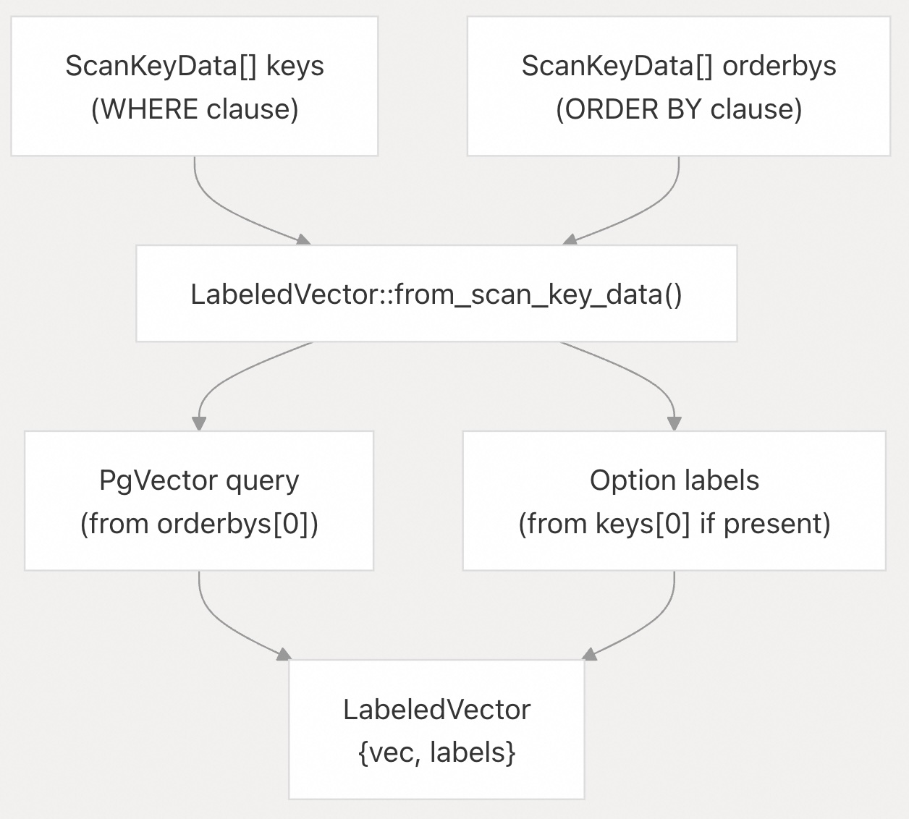
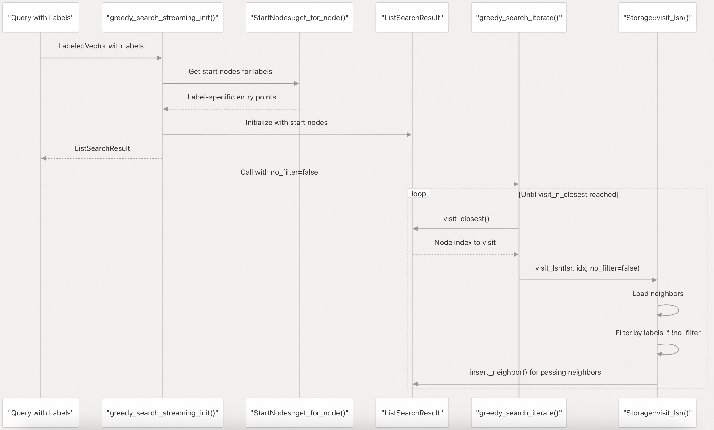
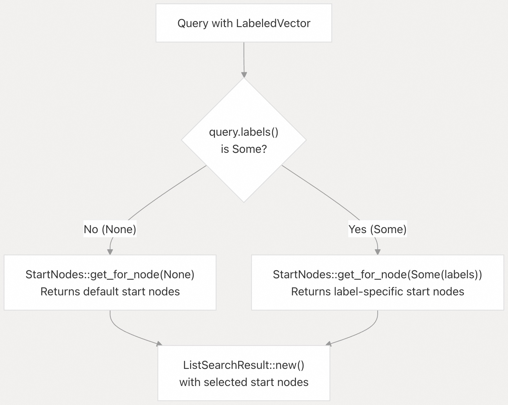
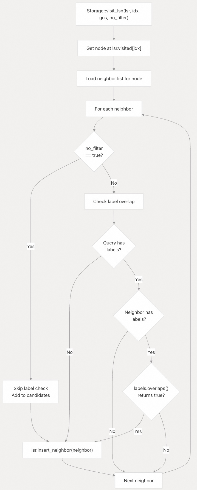
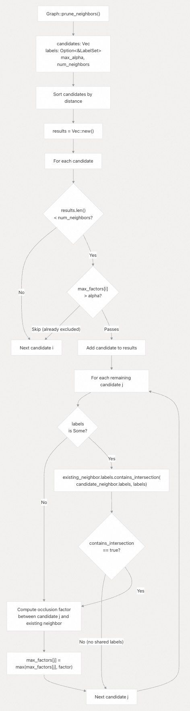
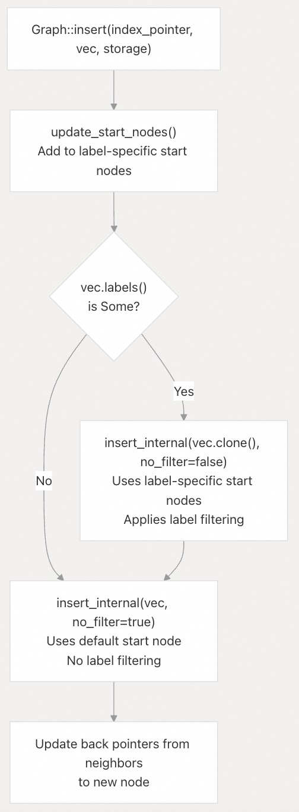

## pgvectorscale 源码学习: 7.2 过滤机制 (`Filtering Mechanism`)  
                                      
### 作者                                      
digoal                                      
                                      
### 日期                                      
2025-11-12                                     
                                      
### 标签                                      
pgvectorscale , 向量数据库 , DiskANN , StreamingDiskANN , 源码学习                                      
                                      
----                                      
                                      
## 背景                         
本文详细介绍 `pgvectorscale` 的 **StreamingDiskANN 索引** (`StreamingDiskANN index`) 中，**基于标签的过滤** (`label-based filtering`) 机制是如何在 **图遍历** (`graph traversal`) 过程中实现的。它涵盖了标签检查 (`label checks`) 与**贪婪搜索算法** (`greedy search algorithm`) 的集成、基于标签的**起始节点** (`start node`) 选择以及对 `NULL` 值的处理。  
  
## Filtered DiskANN (过滤式 DiskANN) 概述  
  
该过滤机制基于微软的 [Filtered DiskANN](https://dl.acm.org/doi/10.1145/3543507.3583552) (过滤式 DiskANN) 研究，该研究实现了高效的**过滤式向量搜索** (`filtered vector search`)，同时保持了**高召回率** (`high recall`)。该实现是在图遍历过程中过滤候选节点，而不是在搜索后进行**后置过滤** (`post-filtering`)，这显著提高了带有**标签约束** (`label constraints`) 的查询性能。  
  
过滤机制在三个关键点上运行：  
  
1.  **起始节点选择** (`Start node selection`)：基于查询标签 (`query labels`) 选择合适的入口点 (`entry points`)。  
2.  **邻居访问过滤** (`Neighbor visit filtering`)：在图遍历过程中检查标签。  
3.  **标签感知剪枝** (`Label-aware pruning`)：在剪枝邻居 (`pruning neighbors`) 时考虑标签兼容性 (`label compatibility`)。  
  
**来源**: [`README.md` 190](https://github.com/timescale/pgvectorscale/blob/36271fa5/README.md#L190-L190) [`pgvectorscale/src/access_method/graph/mod.rs` 1-739](https://github.com/timescale/pgvectorscale/blob/36271fa5/pgvectorscale/src/access_method/graph/mod.rs#L1-L739)  
  
## 图搜索 (`Graph Search`) 期间的标签过滤  
  
### 带有标签的查询初始化 (`Query Initialization with Labels`)  
  
当扫描开始时，查询向量 (`query vector`) 和可选的标签过滤器 (`label filter`) 会一起提取到一个 **LabeledVector** (带标签向量) 结构体中：  
  
  
  
**来源**: [`pgvectorscale/src/access_method/labels/mod.rs` 209-238](https://github.com/timescale/pgvectorscale/blob/36271fa5/pgvectorscale/src/access_method/labels/mod.rs#L209-L238)  
  
### `no_filter` (无过滤) 标志  
  
系统使用一个**布尔** (`boolean`) 标志 `no_filter` 来控制在图遍历 (`graph traversal`) 期间是否应用标签过滤。此标志启用了两种不同的搜索行为：  
  
| `no_filter` 值 | 行为 (`Behavior`) | 用例 (`Use Case`) |  
| :--- | :--- | :--- |  
| `true` | 在遍历期间禁用标签过滤 | 不带标签约束的查询，或插入 (`insertion`) 时的**未过滤通道** (`unfiltered pass`) |  
| `false` | 在遍历期间启用标签过滤 | 带有标签约束的查询，或插入时的**过滤通道** (`filtered pass`) |  
  
**Filtered DiskANN (过滤式 DiskANN) 搜索流程**：  
  
  
  
**来源**: [`pgvectorscale/src/access_method/graph/mod.rs` 331-354](https://github.com/timescale/pgvectorscale/blob/36271fa5/pgvectorscale/src/access_method/graph/mod.rs#L331-L354) [`pgvectorscale/src/access_method/graph/mod.rs` 357-385](https://github.com/timescale/pgvectorscale/blob/36271fa5/pgvectorscale/src/access_method/graph/mod.rs#L357-L385)  
  
## 基于标签的起始节点 (`Start Node`) 选择  
  
**StartNodes** (起始节点) 结构体维护了图的多个入口点 (`entry points`)，包括**特定于标签** (`label-specific`) 的起始节点。当查询具有标签约束时，搜索将从具有兼容标签 (`compatible labels`) 的起始节点开始，从而提高搜索效率 (`search efficiency`)。  
  
**起始节点选择逻辑** (`Start Node Selection Logic`)：  
  
  
  
实际的实现在 `greedy_search_for_build` 中：  
  
[`pgvectorscale/src/access_method/graph/mod.rs` 293-316](https://github.com/timescale/pgvectorscale/blob/36271fa5/pgvectorscale/src/access_method/graph/mod.rs#L293-L316)  
  
该方法检查是否使用**过滤后的起始节点** (`filtered start nodes`)：  
  
  * 如果 `no_filter` 为 `true`，则始终使用默认起始节点 (`get_for_node(None)`)。  
  * 如果 `no_filter` 为 `false`，则使用特定于标签的起始节点 (`get_for_node(query.labels())`)。  
  
**来源**: [`pgvectorscale/src/access_method/graph/mod.rs` 293-327](https://github.com/timescale/pgvectorscale/blob/36271fa5/pgvectorscale/src/access_method/graph/mod.rs#L293-L327) [`pgvectorscale/src/access_method/graph/start_nodes.rs`](https://github.com/timescale/pgvectorscale/blob/36271fa5/pgvectorscale/src/access_method/graph/start_nodes.rs)  
  
## 邻居访问过滤 (`Neighbor Visit Filtering`)  
  
### 存储 (`Storage`) 中的过滤实现  
  
图遍历期间的实际标签过滤是通过 `visit_lsn` 方法委托给 **Storage** (存储) 实现的。每个**存储后端** (`storage backend`)，例如 `PlainStorage` (纯存储) 和 `SbqSpeedupStorage` (Sbq 加速存储)，都实现了过滤逻辑，用于检查邻居 (`neighbors`) 是否应被添加到**候选集** (`candidate set`)。  
  
**`Storage::visit_lsn` 签名** (`Signature`)：  
  
方法签名显示了控制过滤行为的 `no_filter` 参数：  
  
```rust  
fn visit_lsn(  
    &self,  
    lsr: &mut ListSearchResult<Self::QueryDistanceMeasure, Self::LSNPrivateData>,  
    list_search_entry_idx: usize,  
    gns: &mut GraphNeighborStore,  
    no_filter: bool,  // Controls whether label filtering is applied  
);  
```  
  
**过滤检查流程** (`Filtering Check Flow`)：  
  
  
  
过滤逻辑使用 `LabelSetView::overlaps()` 方法来检查查询标签 (`query labels`) 和邻居标签 (`neighbor labels`) 是否共享任何共同元素。此方法在已排序的标签数组 (`sorted label arrays`) 上执行高效的**合并连接** (`merge-join style`) 式比较。  
  
**来源**: [`pgvectorscale/src/access_method/storage/plain_storage.rs`](https://github.com/timescale/pgvectorscale/blob/36271fa5/pgvectorscale/src/access_method/storage/plain_storage.rs) [`pgvectorscale/src/access_method/labels/mod.rs` 123-142](https://github.com/timescale/pgvectorscale/blob/36271fa5/pgvectorscale/src/access_method/labels/mod.rs#L123-L142)  
  
## 标签感知邻居剪枝 (`Label-Aware Neighbor Pruning`)  
  
在**邻居剪枝** (`neighbor pruning`)（即**鲁棒剪枝算法** `robust prune algorithm`）期间，系统必须为过滤后的查询 (`filtered queries`) 保持**图连通性** (`graph connectivity`)。`contains_intersection` 检查确保如果两个节点共享与查询相关的标签，它们之间的路径就会被保留。  
  
**标签感知的剪枝** (`Pruning with Label Awareness`)：  
  
  
  
`contains_intersection` 方法检查：假设正在被剪枝的节点具有 `labels`，并且我们有一个带有标签 `a` 的现有邻居，以及一个带有标签 `b` 的候选邻居，那么现有邻居是否包含 `a ∩ b ∩ labels` 中的所有标签？这确保了对于任何应该存在的**标签路径** (`label path`)，剪枝算法 (`pruning algorithm`) 不会将其消除。  
  
**来源**: [`pgvectorscale/src/access_method/graph/mod.rs` 392-488](https://github.com/timescale/pgvectorscale/blob/36271fa5/pgvectorscale/src/access_method/graph/mod.rs#L392-L488) [`pgvectorscale/src/access_method/labels/mod.rs` 84-112](https://github.com/timescale/pgvectorscale/blob/36271fa5/pgvectorscale/src/access_method/labels/mod.rs#L84-L112)  
  
## 双模式插入 (`Dual-Mode Insertion`)  
  
当向索引中插入带有标签的新向量 (`vector with labels`) 时，系统会执行**两次独立的插入通道** (`insertion passes`)，以维护过滤 (`filtered`) 和未过滤 (`unfiltered`) 的图连通性：  
  
**插入策略** (`Insertion Strategy`)：  
  
  
  
**为何需要两次通道？** (`Why Two Passes?`)  
  
1.  **过滤通道** (`Filtered Pass`)（如果存在标签）：确保节点连接到**标签过滤后的子图** (`label-filtered subgraph`)，从而实现高效的过滤查询 (`filtered queries`)。  
2.  **未过滤通道** (`Unfiltered Pass`)（始终执行）：确保节点连接到**完整的图** (`complete graph`)，从而使未过滤的查询也能找到它。  
  
这种**双模式** (`dual-mode`) 方法保持了以下特性：  
  
  * 过滤查询可以高效地找到具有匹配标签的节点。  
  * 未过滤查询(where 条件中不含标签过滤的query请求)仍然可以找到所有节点，无论其标签如何。  
  * 图保持**强连通** (`strongly connected`)。  
  
**来源**: [`pgvectorscale/src/access_method/graph/mod.rs` 637-717](https://github.com/timescale/pgvectorscale/blob/36271fa5/pgvectorscale/src/access_method/graph/mod.rs#L637-L717)  
  
## NULL 值处理 (`NULL Value Handling`)  
  
### NULL 向量处理 (`NULL Vector Handling`)  
  
带有 `NULL` 值的向量 (`Vectors with NULL values`) 根本不会被索引 (`indexed`)。在**索引构建** (`index build`) 和**插入** (`insert`) 操作期间，带有 `NULL` 向量的**元组** (`tuples`) 会被跳过：  
  
**构建回调** (`Build Callback`)：[`pgvectorscale/src/access_method/build.rs`](https://github.com/timescale/pgvectorscale/blob/36271fa5/pgvectorscale/src/access_method/build.rs) - `build_callback` 函数提取 **LabeledVector** (带标签向量)，如果它为 `None` 则提前返回。  
**插入** (`Insert`)：[`pgvectorscale/src/access_method/insert.rs`](https://github.com/timescale/pgvectorscale/blob/36271fa5/pgvectorscale/src/access_method/insert.rs) - `diskann_insert` 函数也类似地跳过 `NULL` 向量。  
  
### NULL 标签数组处理 (`NULL Label Array Handling`)  
  
`NULL` **标签数组** (`label arrays`) 和空标签数组被同等对待——两者都表示“无标签 (`no labels`)”：  
  
**`LabeledVector` 中的标签提取** (`Label Extraction`)：  
  
[`pgvectorscale/src/access_method/labels/mod.rs` 186-204](https://github.com/timescale/pgvectorscale/blob/36271fa5/pgvectorscale/src/access_method/labels/mod.rs#L186-L204)  
  
提取逻辑 (`extraction logic`)：  
  
  * 如果 `meta_page.has_labels()` 为 `false`：`labels = None`  
  * 如果**标签数据项** (`label datum`) 为 `NULL`：`labels = Some(LabelSet::default())` (**空标签集** `empty labelset`)  
  * 如果标签数组为空或仅包含 `NULL`：`labels = Some(LabelSet::default())`  
  * 否则：将非 `NULL` 元素提取到 **LabelSet** 中。  
  
**数组中的 NULL 元素** (`NULL Elements Within Arrays`)：  
  
```rust  
let labels_iter = arr.into_iter().flatten();  // flatten() filters out None values  
labels_iter.collect()  
```  
  
### NULL 查询标签 (`NULL Query Labels`)  
  
当查询没有**标签过滤器**（即没有 `WHERE labels && ...` 子句）时，**LabeledVector** 中的 `labels` 字段为 `None`，这表明不应应用任何标签过滤。  
  
**过滤行为总结** (`Filtering Behavior Summary`)：  
  
| 场景 (`Scenario`) | 存储的标签 (`Stored Labels`) | 查询标签 (`Query Labels`) | 过滤行为 (`Filtering Behavior`) |  
| :--- | :--- | :--- | :--- |  
| 一般情况 (`Normal case`) | `Some(LabelSet{1,2})` | `Some(LabelSet{2,3})` | 应用过滤，检查**重叠** (`overlap`) |  
| `NULL` 存储标签 | `None` 或 `Some(LabelSet{})` | `Some(LabelSet{2,3})` | 节点被排除（空集不重叠） |  
| `NULL` 查询标签 | `Some(LabelSet{1,2})` | `None` | 不应用过滤 |  
| 两者均为 `NULL` | `None` | `None` | 不应用过滤 |  
| 数组中带有 `NULL` | `{1, NULL, 3}` → `Some(LabelSet{1,3})` | `Some(LabelSet{3})` | `NULL` 被过滤掉，检查重叠 |  
  
**来源**: [`pgvectorscale/src/access_method/labels/mod.rs` 176-207](https://github.com/timescale/pgvectorscale/blob/36271fa5/pgvectorscale/src/access_method/labels/mod.rs#L176-L207) [`README.md` 374-378](https://github.com/timescale/pgvectorscale/blob/36271fa5/README.md#L374-L378)  
  
## 过滤性能考量 (`Filtering Performance Considerations`)  
  
### 搜索列表大小 (`Search List Size`) 的影响  
  
`search_list_size` (搜索列表大小) 参数会影响过滤性能。启用标签过滤后：  
  
  * 较大的搜索列表大小会增加考虑的**候选节点** (`candidates`) 数量。  
  * 更多的候选节点意味着需要进行更多的**标签重叠** (`label overlap`) 检查。  
  * 然而，它也提高了过滤查询的**召回率** (`recall`)。  
  
默认的 `search_list_size` 在构建和查询时均为 `100`。  
  
### 特定标签的起始节点 (`Label-Specific Start Nodes`)  
  
使用特定标签的起始节点可以缩小过滤查询的**初始搜索半径** (`initial search radius`)：  
  
  * 如果没有标签起始节点：搜索可能会从远离标签过滤结果的区域开始。  
  * 如果有标签起始节点：搜索会在具有相关标签的区域开始。  
  * 这显著减少了搜索过程中访问的节点数量。  
  
### 标签存储开销 (`Label Storage Overhead`)  
  
每个节点存储一个可选的 **LabelSet** (标签集)：  
  
  * 标签在 **ArchivedLabelSet** (归档标签集) 中以排序的 `Vec<i16>` (16位整数向量) 形式存储。  
  * **存储开销** (`Storage overhead`) 与每个节点的标签数量成正比。  
  * **空标签集** (`Empty labelsets`) 的开销最小。  
  * **排序的表示形式** (`sorted representation`) 实现了高效的重叠检查 (`overlap checks`)。  
  
**来源**: [`pgvectorscale/src/access_method/graph/mod.rs` 331-354](https://github.com/timescale/pgvectorscale/blob/36271fa5/pgvectorscale/src/access_method/graph/mod.rs#L331-L354) [`pgvectorscale/src/access_method/labels/mod.rs` 17-22](https://github.com/timescale/pgvectorscale/blob/36271fa5/pgvectorscale/src/access_method/labels/mod.rs#L17-L22)  
      
#### [PolarDB 学习图谱](https://www.aliyun.com/database/openpolardb/activity "8642f60e04ed0c814bf9cb9677976bd4")
  
  
#### [PostgreSQL 解决方案集合](../201706/20170601_02.md "40cff096e9ed7122c512b35d8561d9c8")
  
  
#### [德哥 / digoal's Github - 公益是一辈子的事.](https://github.com/digoal/blog/blob/master/README.md "22709685feb7cab07d30f30387f0a9ae")
  
  
#### [About 德哥](https://github.com/digoal/blog/blob/master/me/readme.md "a37735981e7704886ffd590565582dd0")
  
  

  
