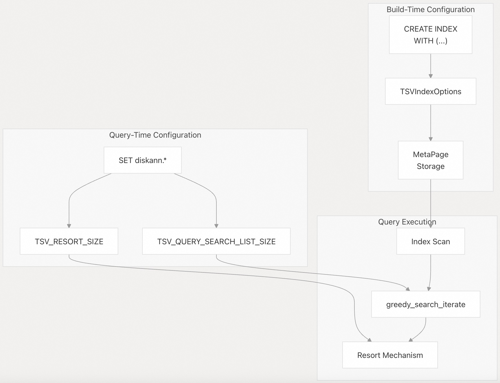
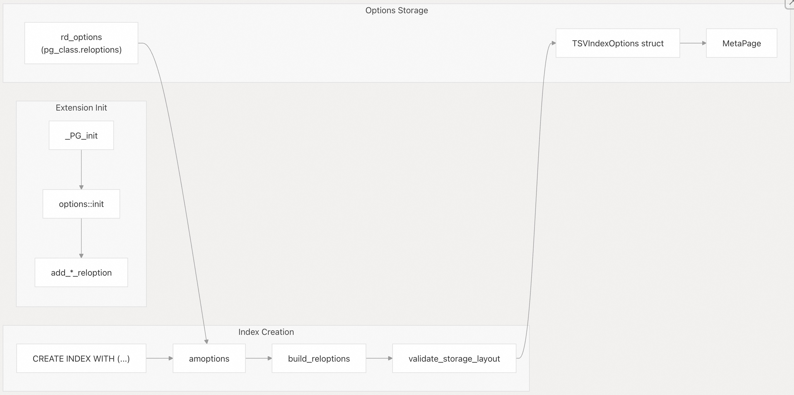
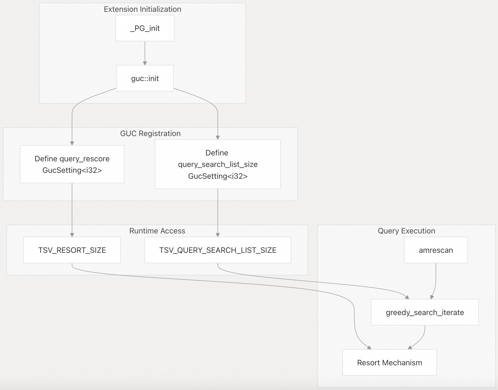
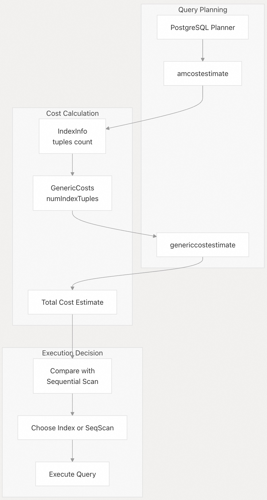

## pgvectorscale 源码学习: 8 性能调优 (Performance Tuning)  
                                        
### 作者                                        
digoal                                        
                                        
### 日期                                        
2025-11-12                                       
                                        
### 标签                                        
pgvectorscale , 向量数据库 , DiskANN , StreamingDiskANN , 源码学习                                        
                                        
----                                        
                                        
## 背景                           
本文介绍了如何通过配置参数 (configuration parameters)、理解**准确性-速度权衡 (accuracy-speed tradeoffs)** 以及衡量性能来优化 `pgvectorscale` 的 **StreamingDiskANN 索引 (StreamingDiskANN index)** 性能。它涵盖了控制向量相似性搜索行为的**构建时索引参数 (build-time index parameters)** 和**查询时运行时参数 (query-time runtime parameters)**。  
  
## 概述 (Overview)  
  
`pgvectorscale` 提供了两类可调参数 (tunable parameters)：  
  
1.  **索引构建时参数 (Index Build-Time Parameters)**：在 `CREATE INDEX` 期间设置并存储在索引元数据 (index metadata) 中。它们控制图结构质量、存储布局和量化设置。  
2.  **查询时参数 (Query-Time Parameters)**：PostgreSQL **GUC (Grand Unified Configuration)** 设置，可以在每个会话 (per-session) 或每个查询 (per-query) 中调整，以在运行时 (runtime) 调优准确性与速度之间的权衡。  
  
系统设计了智能默认值 (smart defaults)，适用于大多数用例。大多数用户只需要调整查询时参数，而构建时参数则适用于高级调优场景。  
  
  
  
**参数在系统中的流程**  
  
来源:  
[`pgvectorscale/src/access_method/options.rs`](https://github.com/timescale/pgvectorscale/blob/36271fa5/pgvectorscale/src/access_method/options.rs)  
[`pgvectorscale/src/access_method/guc.rs`](https://github.com/timescale/pgvectorscale/blob/36271fa5/pgvectorscale/src/access_method/guc.rs)  
[`README.md` 305-372](https://github.com/timescale/pgvectorscale/blob/36271fa5/README.md#L305-L372)  
  
## 索引配置选项 (Index Configuration Options)  
  
构建时参数 (Build-time parameters) 是在使用 `WITH` 子句创建索引时指定的。这些参数会影响索引结构，并且在索引创建后无法更改，除非重建索引。  
  
### 参数注册与存储 (Parameter Registration and Storage)  
  
该扩展在初始化期间通过 PostgreSQL 的 **reloption 系统**注册索引选项。`amoptions` 函数从 `pg_class.reloptions` 解析这些选项，并填充 `TSVIndexOptions` 结构体。  
  
  
  
**索引选项注册和验证流程**  
  
来源:  
[`pgvectorscale/src/lib.rs` 10-15](https://github.com/timescale/pgvectorscale/blob/36271fa5/pgvectorscale/src/lib.rs#L10-L15)  
[`pgvectorscale/src/access_method/options.rs` 201-262](https://github.com/timescale/pgvectorscale/blob/36271fa5/pgvectorscale/src/access_method/options.rs#L201-L262)  
[`pgvectorscale/src/access_method/options.rs` 102-165](https://github.com/timescale/pgvectorscale/blob/36271fa5/pgvectorscale/src/access_method/options.rs#L102-L165)  
  
### 可用的构建时参数 (Available Build-Time Parameters)  
  
`TSVIndexOptions` 结构体定义了所有可用的构建时参数：  
  
| 参数 (Parameter) | 类型 (Type) | 默认值 (Default) | 范围 (Range) | 描述 (Description) |  
| :--- | :--- | :--- | :--- | :--- |  
| `storage_layout` | string | `"memory_optimized"` | `"plain"` 或 `"memory_optimized"` | 控制是否使用 **SBQ 压缩 (SBQ compression)** |  
| `num_neighbors` | integer | -1 (自动) | 10-1000 | 每个图节点的最大邻居数 |  
| `search_list_size` | integer | 100 | 10-1000 | 索引构建期间的搜索列表大小 |  
| `max_alpha` | float | 1.2 | 1.0-5.0 | 邻居修剪算法 (neighbor pruning algorithm) 的 Alpha 参数 |  
| `num_dimensions` | integer | 0 (所有) | 0-5000 | 要索引的维度数量 (支持 **Matryoshka 嵌入 (Matryoshka embeddings)**) |  
| `num_bits_per_dimension` | integer | 0 (自动) | 0-32 | 用于 SBQ 量化的每维度位数 |  
  
来源:  
[`pgvectorscale/src/access_method/options.rs` 10-21](https://github.com/timescale/pgvectorscale/blob/36271fa5/pgvectorscale/src/access_method/options.rs#L10-L21)  
[`README.md` 325-333](https://github.com/timescale/pgvectorscale/blob/36271fa5/README.md#L325-L333)  
  
### 参数详情与权衡 (Parameter Details and Tradeoffs)  
  
#### storage\_layout (存储布局)  
  
确定用于向量的存储实现：  
  
  * **`memory_optimized` (内存优化)**：使用 **统计二值量化 (Statistical Binary Quantization)** 的 `SbqSpeedupStorage` 来压缩向量。建议用于高维向量（例如 768+ 维度），内存效率至关重要。对于小于 900 维的向量，自动选择每维度 2 位；否则选择 1 位。  
  * **`plain` (纯净/未压缩)**：使用 `PlainStorage` 存储全精度 (full-precision) 向量。建议用于低维向量或需要最大准确性时。  
  
该选择在索引创建时通过 `get_storage_type` 方法确定，并存储在 `MetaPage` 中。  
  
来源:  
[`pgvectorscale/src/access_method/options.rs` 68-74](https://github.com/timescale/pgvectorscale/blob/36271fa5/pgvectorscale/src/access_method/options.rs#L68-L74)  
[`README.md` 327](https://github.com/timescale/pgvectorscale/blob/36271fa5/README.md#L327-L327)  
  
#### num\_neighbors (邻居数量)  
  
控制 **DiskANN 图 (DiskANN graph)** 中每个节点的最大边数 (maximum number of edges)。值越高会创建越密集的图：  
  
  * **值越高**：增加**召回率 (recall)**（准确性），但代价是索引扫描速度变慢和索引大小增大。  
  * **值越低**：索引扫描速度更快、索引大小更小，但可能会降低召回率。  
  * **默认值 (-1)**：系统根据向量维度自动选择合适的值。  
  
`NUM_NEIGHBORS_DEFAULT_SENTINEL` 常量 (-1) 表示自动选择。如果手动指定，值必须至少为 10。  
  
来源:  
[`pgvectorscale/src/access_method/options.rs` 55-66](https://github.com/timescale/pgvectorscale/blob/36271fa5/pgvectorscale/src/access_method/options.rs#L55-L66)  
[`pgvectorscale/src/access_method/options.rs` 23](https://github.com/timescale/pgvectorscale/blob/36271fa5/pgvectorscale/src/access_method/options.rs#L23-L23)  
[`README.md` 328](https://github.com/timescale/pgvectorscale/blob/36271fa5/README.md#L328-L328)  
  
#### search\_list\_size (搜索列表大小)  
  
这是 DiskANN 构建算法中的 **S 参数**。在索引构建期间，它控制搜索邻居时探索的候选者数量：  
  
  * **值越高**：生成更高质量的图，具有更好的召回率，但索引构建速度较慢。  
  * **值越低**：索引构建速度更快，但代价是图质量较低。  
  * **默认值**：100。  
  
此参数仅影响索引构建，不影响查询执行。对于查询时的搜索列表控制，请参阅 `diskann.query_search_list_size`。  
  
来源:  
[`README.md` 329](https://github.com/timescale/pgvectorscale/blob/36271fa5/README.md#L329-L329)  
[`pgvectorscale/src/access_method/options.rs` 17](https://github.com/timescale/pgvectorscale/blob/36271fa5/pgvectorscale/src/access_method/options.rs#L17-L17)  
  
#### max\_alpha (最大 Alpha)  
  
用于邻居选择的**鲁棒修剪算法 (robust prune algorithm)** 中的 alpha 参数：  
  
  * **值越高**：更激进的修剪 (aggressive pruning)，倾向于选择多样化的邻居，可能提高图质量。  
  * **值越低**：较不激进的修剪，保留更多相似的邻居。  
  * **默认值**：1.2  
  * **范围**：1.0-5.0  
  
此参数直接影响图构建期间使用的 `prune_neighbors` 算法。  
  
来源:  
[`pgvectorscale/src/access_method/options.rs` 19](https://github.com/timescale/pgvectorscale/blob/36271fa5/pgvectorscale/src/access_method/options.rs#L19-L19)  
[`pgvectorscale/src/access_method/options.rs` 26](https://github.com/timescale/pgvectorscale/blob/36271fa5/pgvectorscale/src/access_method/options.rs#L26-L26)  
[`README.md` 330](https://github.com/timescale/pgvectorscale/blob/36271fa5/README.md#L330-L330)  
  
#### num\_dimensions (维度数量)  
  
启用对 **Matryoshka 嵌入模型 (Matryoshka embedding models)** 的部分维度索引：  
  
  * **0 (默认)**：索引向量中的所有维度。  
  * **\> 0**：仅索引前 N 个维度。  
  
这对于 Matryoshka 嵌入模型很有用，因为其早期维度包含大部分语义信息。  
  
来源:  
[`pgvectorscale/src/access_method/options.rs` 18](https://github.com/timescale/pgvectorscale/blob/36271fa5/pgvectorscale/src/access_method/options.rs#L18-L18)  
[`README.md` 331](https://github.com/timescale/pgvectorscale/blob/36271fa5/README.md#L331-L331)  
  
#### num\_bits\_per\_dimension (每维度位数)  
  
控制 SBQ 压缩的**量化精度 (quantization precision)**（仅在 `storage_layout = "memory_optimized"` 时适用）：  
  
  * **0 (默认)**：自动选择：小于 900 维度为 2 位，否则为 1 位。  
  * **1-32**：手动指定每维度的位数。  
  
值越高，准确性越高，但压缩率越低。`SBQ_NUM_BITS_PER_DIMENSION_DEFAULT_SENTINEL` 常量 (0) 会触发自动选择。  
  
来源:  
[`pgvectorscale/src/access_method/options.rs` 20](https://github.com/timescale/pgvectorscale/blob/36271fa5/pgvectorscale/src/access_method/options.rs#L20-L20)  
[`pgvectorscale/src/access_method/options.rs` 25](https://github.com/timescale/pgvectorscale/blob/36271fa5/pgvectorscale/src/access_method/options.rs#L25-L25)  
[`README.md` 332](https://github.com/timescale/pgvectorscale/blob/36271fa5/README.md#L332-L332)  
  
### 使用示例 (Usage Examples)  
  
```sql  
-- Default settings (memory_optimized storage, auto neighbors)  
CREATE INDEX document_embedding_idx ON document_embedding  
USING diskann (embedding vector_cosine_ops);  
  
-- Custom settings for high accuracy  
CREATE INDEX document_embedding_idx ON document_embedding  
USING diskann (embedding vector_cosine_ops)  
WITH (  
    num_neighbors = 75,  
    search_list_size = 150,  
    max_alpha = 1.4  
);  
  
-- Plain storage with Matryoshka embeddings  
CREATE INDEX document_embedding_idx ON document_embedding  
USING diskann (embedding vector_l2_ops)  
WITH (  
    storage_layout = 'plain',  
    num_dimensions = 512  
);  
  
-- Label filtering index  
CREATE INDEX document_embedding_idx ON document_embedding  
USING diskann (embedding vector_cosine_ops, labels);  
```  
  
来源:  
[`README.md` 334-346](https://github.com/timescale/pgvectorscale/blob/36271fa5/README.md#L334-L346)  
  
### 内存注意事项 (Memory Considerations)  
  
索引构建可能会占用大量内存，特别是对于大型数据集。PostgreSQL 的 `maintenance_work_mem` 控制了可用于索引创建的内存：  
  
```sql  
-- Increase memory for large index builds  
SET maintenance_work_mem = '2GB';  
  
CREATE INDEX document_embedding_idx ON document_embedding  
USING diskann (embedding vector_cosine_ops);  
```  
  
对于在大型表上构建 StreamingDiskANN 索引而言，默认的 `maintenance_work_mem`（通常为 64MB）通常不足。  
  
来源:  
[`README.md` 316-321](https://github.com/timescale/pgvectorscale/blob/36271fa5/README.md#L316-L321)  
  
## 查询时参数 (Query-Time Parameters)  
  
查询时参数 (Query-time parameters) 是 PostgreSQL **GUC (Grand Unified Configuration)** 设置，可以动态调整以调优单个查询或会话的**准确性-速度权衡 (accuracy-speed tradeoff)**。与构建时参数不同，它们无需重建索引即可更改。  
  
### 可用的查询时参数 (Available Query-Time Parameters)  
  
有两个 GUC 参数控制查询执行行为：  
  
| 参数 (Parameter) | 默认值 (Default) | 范围 (Range) | 描述 (Description) |  
| :--- | :--- | :--- | :--- |  
| `diskann.query_search_list_size` | 100 | 1-10000 | 图搜索期间探索的候选者数量 |  
| `diskann.query_rescore` | 50 | 0-1000 | 用精确距离重新评分近似结果的数量 (0 禁用) |  
  
来源:  
[`pgvectorscale/src/access_method/guc.rs` 3-4](https://github.com/timescale/pgvectorscale/blob/36271fa5/pgvectorscale/src/access_method/guc.rs#L3-L4)  
[`README.md` 352-355](https://github.com/timescale/pgvectorscale/blob/36271fa5/README.md#L352-L355)  
  
### 参数注册 (Parameter Registration)  
  
GUC 参数通过 `GucRegistry::define_int_guc` 在扩展初始化期间注册：  
  
  
  
**GUC 参数注册和使用流程**  
  
来源:  
[`pgvectorscale/src/lib.rs` 10-15](https://github.com/timescale/pgvectorscale/blob/36271fa5/pgvectorscale/src/lib.rs#L10-L15)  
[`pgvectorscale/src/access_method/guc.rs` 6-40](https://github.com/timescale/pgvectorscale/blob/36271fa5/pgvectorscale/src/access_method/guc.rs#L6-L40)  
  
### diskann.query\_search\_list\_size (查询搜索列表大小)  
  
控制 `greedy_search_iterate` 中**贪婪搜索算法 (greedy search algorithm)** 期间的候选列表大小。该算法维护一个要探索的候选者和已访问节点的列表：  
  
  * **值越高**：探索图的范围更大，提高**召回率 (recall)**（准确性），但代价是查询延迟 (query latency) 增加。  
  * **值越低**：查询速度更快，但召回率可能降低。  
  * **默认值**：100。  
  
此参数直接影响图遍历期间的 `ListSearchResult` 候选者管理。  
  
来源:  
[`pgvectorscale/src/access_method/guc.rs` 7-22](https://github.com/timescale/pgvectorscale/blob/36271fa5/pgvectorscale/src/access_method/guc.rs#L7-L22)  
[`README.md` 354](https://github.com/timescale/pgvectorscale/blob/36271fa5/README.md#L354-L354)  
  
### diskann.query\_rescore (查询重新评分)  
  
控制**重新排序机制 (resort mechanism)**，通过重新计算顶部近似结果的精确距离来提高准确性：  
  
  * **\> 0**：用堆表 (heap table) 中的精确距离对这么多结果进行重新评分 (rescore)。  
  * **0**：禁用重新评分（仅使用 SBQ 的近似距离）。  
  * **默认值**：50。  
  
启用后，系统将指定数量的近似结果缓冲在 `BinaryHeap` 中，通过 `get_full_distance_for_resort` 从堆表中读取全精度向量，并按精确距离重新排名。  
  
重新评分可显著提高压缩索引（SBQ 存储）的准确性，而对性能影响极小。它对纯净存储索引没有影响，因为它们已经存储了精确距离。  
  
来源:  
[`pgvectorscale/src/access_method/guc.rs` 24-39](https://github.com/timescale/pgvectorscale/blob/36271fa5/pgvectorscale/src/access_method/guc.rs#L24-L39)  
[`README.md` 355](https://github.com/timescale/pgvectorscale/blob/36271fa5/README.md#L355-L355)  
  
### 设置参数 (Setting Parameters)  
  
参数可以在不同范围 (scopes) 进行设置：  
  
#### 会话范围 (Session-Wide)  
  
```sql  
-- Apply to all queries in this database connection  
SET diskann.query_search_list_size = 150;  
SET diskann.query_rescore = 100;  
  
-- Run query with these settings  
SELECT * FROM documents  
ORDER BY embedding <=> '[...]'  
LIMIT 10;  
```  
  
#### 事务局部 (Transaction-Local)  
  
```sql  
-- Apply only within this transaction  
BEGIN;  
SET LOCAL diskann.query_search_list_size = 200;  
SET LOCAL diskann.query_rescore = 0;  -- Disable rescoring  
  
SELECT * FROM documents  
ORDER BY embedding <=> '[...]'  
LIMIT 10;  
  
COMMIT;  -- Settings reset after commit  
```  
  
#### 单个查询 (Per-Query)  
  
```sql  
-- One-time setting for a single query  
BEGIN;  
SET LOCAL diskann.query_rescore = 400;  
SELECT * FROM documents  
ORDER BY embedding <=> '[...]'  
LIMIT 10;  
END;  
  
-- 和上面事务级一样  
```  
  
来源:  
[`README.md` 358-372](https://github.com/timescale/pgvectorscale/blob/36271fa5/README.md#L358-L372)  
  
### 性能与准确性权衡 (Performance vs. Accuracy Tradeoffs)  
  
查询时参数提供了一系列性能特征：  
  
| 配置 (Configuration) | 速度 (Speed) | 准确性 (Accuracy) | 用例 (Use Case) |  
| :--- | :--- | :--- | :--- |  
| `search_list_size=50`, `rescore=0` | 最快 | 较低 | 对延迟敏感的应用程序 |  
| `search_list_size=100`, `rescore=50` | 快 | 良好 | 通用目的 (默认) |  
| `search_list_size=200`, `rescore=100` | 适中 | 高 | 对准确性敏感的应用程序 |  
| `search_list_size=500`, `rescore=400` | 较慢 | 最高 | 最大召回率要求 |  
  
最佳设置取决于您的应用程序要求和数据特征。建议使用您的特定工作负载进行**基准测试 (Benchmarking)**。  
  
## 基准测试 (Benchmarking)  
  
要有效地调优性能，您需要衡量参数更改对您的特定工作负载和数据集的影响。  
  
### 成本估算 (Cost Estimation)  
  
PostgreSQL 的**查询规划器 (query planner)** 使用 `amcostestimate` 回调来决定是否使用 diskann 索引。该实现根据将要检查的元组数量来估算索引扫描成本：  
  
  
  
**查询规划和成本估算流程**  
  
当前实现估算检查大约 1% 的总索引元组 (`total_index_tuples / 100`)。这是一个粗略的**启发式 (heuristic)** 方法，可能需要改进以实现准确的成本建模。  
  
来源:  
[`pgvectorscale/src/access_method/cost_estimate.rs` 6-50](https://github.com/timescale/pgvectorscale/blob/36271fa5/pgvectorscale/src/access_method/cost_estimate.rs#L6-L50)  
  
### 衡量查询性能 (Measuring Query Performance)  
  
使用 `EXPLAIN ANALYZE` 来衡量实际查询性能：  
  
```sql  
-- Measure query with default settings  
EXPLAIN (ANALYZE, BUFFERS)   
SELECT * FROM documents  
ORDER BY embedding <=> '[...]'  
LIMIT 10;  
  
-- Compare with different search_list_size  
SET diskann.query_search_list_size = 200;  
EXPLAIN (ANALYZE, BUFFERS)  
SELECT * FROM documents  
ORDER BY embedding <=> '[...]'  
LIMIT 10;  
```  
  
需要观察的关键指标：  
  
  * **执行时间 (Execution Time)**：总查询延迟 (Total query latency)  
  * **共享缓冲区命中 (Shared Buffers Hit)**：从缓存读取的数据量与从磁盘读取的数据量  
  * **索引扫描 (Index Scan)**：验证是否使用了 diskann 索引  
  
### 衡量召回率 (Measuring Recall)  
  
要衡量召回率（准确性），请将索引结果与**顺序扫描 (sequential scan)** 进行比较：  
  
```sql  
-- Ground truth (exact results)  
CREATE TEMP TABLE ground_truth AS  
SELECT id, embedding <=> '[...]' AS distance  
FROM documents  
ORDER BY distance  
LIMIT 100;  
  
-- Index results  
SET enable_seqscan = 0;  -- Force index usage  
CREATE TEMP TABLE index_results AS  
SELECT id, embedding <=> '[...]' AS distance  
FROM documents  
ORDER BY distance  
LIMIT 100;  
  
-- Compute recall@100  
SELECT   
    (SELECT COUNT(*) FROM index_results   
     WHERE id IN (SELECT id FROM ground_truth)) * 100.0 / 100.0 AS recall_pct;  
```  
  
对于大多数应用程序而言，k=100 时的召回率达到 95%+ 通常被认为是良好的。  
  
来源:  
[`pgvectorscale/src/access_method/labels/filtering_tests.rs` 880-1026](https://github.com/timescale/pgvectorscale/blob/36271fa5/pgvectorscale/src/access_method/labels/filtering_tests.rs#L880-L1026)  
  
### 基准测试数据集 (Benchmark Datasets)  
  
使用与您的生产工作负载在以下方面匹配的代表性数据集进行测试：  
  
  * 向量维度 (Vector dimensionality)  
  * 数据集大小 (向量数量)  
  * 查询模式 (Query patterns)  
  * 标签过滤要求 (Label filtering requirements)（如果适用）  
  
该扩展包括全面的测试套件，用于对各种场景进行基准测试：  
  
  * **Vacuum 操作 (Vacuum operations)**：测试索引维护的影响。  
  * **标签过滤召回率 (Label filtering recall)**：衡量过滤搜索的准确性。  
  * **并发操作 (Concurrent operations)**：测试多用户场景。  
  
来源:  
[`pgvectorscale/src/access_method/vacuum.rs` 159-465](https://github.com/timescale/pgvectorscale/blob/36271fa5/pgvectorscale/src/access_method/vacuum.rs#L159-L465)  
[`pgvectorscale/src/access_method/labels/filtering_tests.rs` 880-1026](https://github.com/timescale/pgvectorscale/blob/36271fa5/pgvectorscale/src/access_method/labels/filtering_tests.rs#L880-L1026)  
  
### 生产基准测试 (Production Benchmarking)  
  
根据针对 5000 万个 Cohere 嵌入（768 维度）的基准测试，采用默认设置的 `pgvectorscale` 实现了：  
  
  * 与 Pinecone 的内存优化索引相比，**p95 延迟 (p95 latency) 降低了 28 倍**  
  * 在 99% 召回率下，**查询吞吐量 (query throughput) 提高了 16 倍**  
  * 在 AWS EC2 上自托管时，**成本降低了 75%**  
  
这些结果证明了默认配置对于大规模生产工作负载的有效性。  
  
来源:  
[`README.md` 17-29](https://github.com/timescale/pgvectorscale/blob/36271fa5/README.md#L17-L29)  
  
### 持续监控 (Continuous Monitoring)  
  
在生产环境中，请监控：  
  
1.  查询延迟（p50、p95、p99）  
2.  索引扫描与顺序扫描的使用情况  
3.  缓冲区缓存命中率 (Buffer cache hit rate)  
4.  索引大小增长  
5.  Vacuum 对性能的影响  
  
根据观察到的模式和不断变化的需求调整参数。  
  
# 附录: `max_alpha` 参数对 StreamingDiskANN 索引召回率、查询速度的影响  
  
`max_alpha` **不直接影响邻居个数**, 但会影响**邻居选择的质量**。   
  
越大, 构建图的时间越长, (也就是影响写入速度和build index速度), 但是图的质量越高(邻居里含有更多更远的节点, 查询时可减少遍历的节点数. 特别是在图层的高层进行查询时, 可更快速的从入口点到达离目标点更近点节点. 减少遍历点数.), 提升了召回率和查询速度.    
  
越小, 图的质量越差(都是最近的节点), 在搜索时可能需要遍历更多的节点才能到达离目标点更近的节点.   
  
打个比方, 从杭州到北京, 可绕路经过很多小站, 经过很多节点才到, 也可以通过虫洞, 瞬移到北京. `max_alpha` 越大, 越有可能建立到很远节点的虫洞.   
  
### max_alpha 的作用机制  
  
`max_alpha` 在 `prune_neighbors` 函数中控制邻居修剪算法的严格程度:    
  
1. **邻居数量上限**: 实际邻居数量由 `num_neighbors` 参数决定(默认50), 不受 `max_alpha` 影响    
  
2. **邻居选择策略**: 算法从 `alpha=1.0` 开始, 逐步增加到 `max_alpha`, 每轮选择满足条件的候选邻居    
  
3. **质量控制**: 更高的 `max_alpha` 允许选择距离稍远但能提供更好图连通性的邻居, 通过 `factor` 值判断候选节点是否更接近现有邻居而非目标点    
  
### 对查询性能的影响  
  
**查询效率**:  
- 更高的 `max_alpha` (如 1.4) → 构建时间更长, 但图质量更好 → 查询时可能需要访问更少的节点   
- 默认值 1.2 在大多数情况下提供良好平衡    
  
**查询召回率**:  
- 更高的 `max_alpha` → 图的连通性更好 → 召回率提高   
- 这是因为修剪算法会保留更多能改善图结构的邻居,减少"死胡同"   
  
### 使用建议  
  
该参数在索引构建时设置,范围为 1.0-5.0:    
  
```sql  
CREATE INDEX idx ON table USING diskann(embedding)   
WITH (max_alpha=1.4);  
```  
  
在索引构建和最终化阶段都会使用此参数:   
  
## Notes  
  
- `max_alpha` 是构建时参数,无法在查询时调整   
- 如需调整查询时的准确性/速度权衡,应使用 `diskann.query_search_list_size` 和 `diskann.query_rescore` 参数    
- 该参数主要影响索引构建质量,间接影响查询性能,而非直接控制邻居数量    
  
    
#### [PolarDB 学习图谱](https://www.aliyun.com/database/openpolardb/activity "8642f60e04ed0c814bf9cb9677976bd4")
  
  
#### [PostgreSQL 解决方案集合](../201706/20170601_02.md "40cff096e9ed7122c512b35d8561d9c8")
  
  
#### [德哥 / digoal's Github - 公益是一辈子的事.](https://github.com/digoal/blog/blob/master/README.md "22709685feb7cab07d30f30387f0a9ae")
  
  
#### [About 德哥](https://github.com/digoal/blog/blob/master/me/readme.md "a37735981e7704886ffd590565582dd0")
  
  

  
