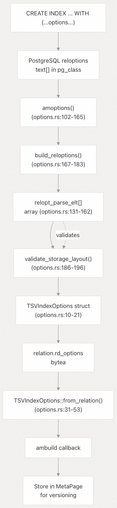
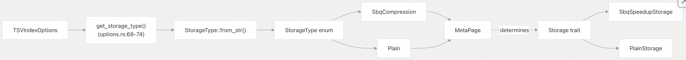
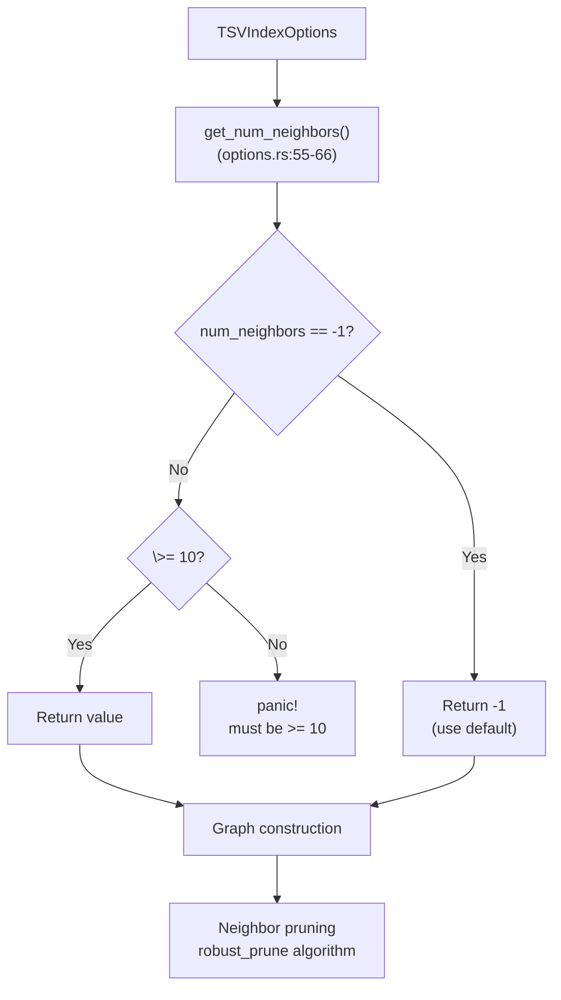
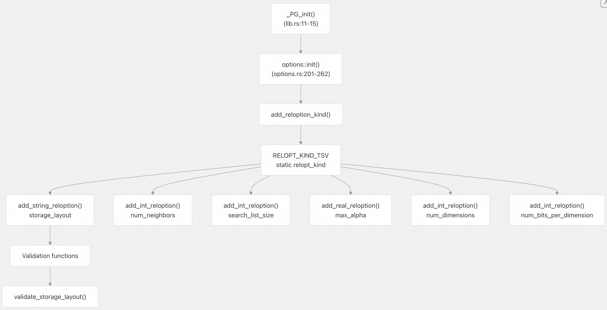

## pgvectorscale 源码学习: 8.1 索引配置选项 (Index Configuration Options)  
                                          
### 作者                                          
digoal                                          
                                          
### 日期                                          
2025-11-12                                         
                                          
### 标签                                          
pgvectorscale , 向量数据库 , DiskANN , StreamingDiskANN , 源码学习                                          
                                          
----                                          
                                          
## 背景                             
本文介绍 **StreamingDiskANN 索引**的构建时配置参数 (**build-time configuration parameters**)。这些参数在使用 `WITH` 子句创建索引时指定，并控制索引结构 (**index structure**) 和存储 (**storage**) 的基本方面。索引创建后，无法更改这些参数，除非重建索引。  
  
## 概览 (Overview)  
  
**StreamingDiskANN 索引**支持六个构建时配置参数，这些参数控制索引构建 (**index construction**)、图结构 (**graph structure**) 和存储布局 (**storage layout**)。这些参数决定了索引的**内存-准确性-性能**之间的权衡 (**tradeoffs**)。  
  
| Parameter (参数) | Type (类型) | Default (默认值) | Range (范围) | Purpose (用途) |  
| :--- | :--- | :--- | :--- | :--- |  
| `storage_layout` | string (字符串) | `"memory_optimized"` | `"plain"`, `"memory_optimized"` | Vector storage and compression strategy (向量存储和压缩策略) |  
| `num_neighbors` | integer (整数) | -1 (auto) (自动) | 10-1000 or -1 (或 -1) | Maximum neighbors per graph node (每个图节点的最大邻居数) |  
| `search_list_size` | integer (整数) | 100 | 10-1000 | Candidate list size during index build (索引构建期间的候选列表大小) |  
| `max_alpha` | float (浮点数) | 1.2 | 1.0-5.0 | Pruning aggressiveness parameter (剪枝激进性参数) |  
| `num_dimensions` | integer (整数) | 0 (all) (全部) | 0-5000 | Number of dimensions to index (要索引的维度数) |  
| `num_bits_per_dimension` | integer (整数) | 0 (auto) (自动) | 0-32 | Bits per dimension for SBQ compression (用于 SBQ 压缩的每维度位数) |  
  
**来源:**  
[`README.md` 313-339](https://github.com/timescale/pgvectorscale/blob/36271fa5/README.md#L313-L339)  
[`pgvectorscale/src/access_method/options.rs` 1-262](https://github.com/timescale/pgvectorscale/blob/36271fa5/pgvectorscale/src/access_method/options.rs#L1-L262)  
  
## 选项处理流程 (Options Processing Flow)  
  
  
  
此图表显示了索引选项 (**index options**) 如何从 SQL 经由 PostgreSQL 的 `reloptions` 系统流向扩展 (**extension**)。`amoptions` 回调函数 (**callback**) 将文本数组解析为一个结构化的 `TSVIndexOptions` 字节数组 (`bytea`)，该数组存储在 `relation.rd_options` 中。在索引构建期间，`TSVIndexOptions::from_relation()` 会检索这些选项，它们最终会持久化 (**persisted**) 到 **MetaPage** 中以实现版本兼容性 (**version compatibility**)。  
  
**来源:**  
[`pgvectorscale/src/access_method/options.rs` 102-183](https://github.com/timescale/pgvectorscale/blob/36271fa5/pgvectorscale/src/access_method/options.rs#L102-L183)  
  
## 配置参数详情 (Configuration Parameter Details)  
  
### storage\_layout  
  
控制用于向量数据 (**vector data**) 的存储实现 (**storage implementation**)，并确定压缩策略 (**compression strategy**)。  
  
**Type (类型):** String (字符串)  
**Default (默认值):** `"memory_optimized"`  
**Valid values (有效值):** `"plain"`, `"memory_optimized"`  
  
#### Values (值)  
  
  * **`memory_optimized` (内存优化)**: 使用**统计二值量化** (**Statistical Binary Quantization**, SBQ) 来压缩向量。存储**量化** (**quantized**) 表示，它们需要更少的内存，但在搜索期间提供**近似距离** (**approximate distances**)。详见 [SBQ 压缩](/timescale/pgvectorscale/4.2-sbq-compression)。  
  * **`plain` (普通/未压缩)**: 存储**全精度** (**full-precision**) 的 `float32` 向量，不进行压缩。需要更多内存，但在搜索期间提供**精确距离** (**exact distances**)。  
  
#### Implementation (实现)  
  
  
  
`storage_layout` 选项被转换为 `StorageType` **枚举变体** (**enum variant**)，并存储在 **MetaPage** 中。在操作期间，它决定了哪个 `Storage` **特性实现** (**trait implementation**) 被**实例化** (**instantiated**)。  
  
**来源:**  
[`pgvectorscale/src/access_method/options.rs` 68-87](https://github.com/timescale/pgvectorscale/blob/36271fa5/pgvectorscale/src/access_method/options.rs#L68-L87)  
[`pgvectorscale/src/access_method/storage.rs`](https://github.com/timescale/pgvectorscale/blob/36271fa5/pgvectorscale/src/access_method/storage.rs)  
  
#### Example (示例)  
  
```sql  
-- Use memory-optimized storage (default)  
CREATE INDEX embedding_idx ON documents   
USING diskann (embedding vector_cosine_ops)  
WITH (storage_layout = 'memory_optimized');  
  
-- Use plain storage for exact distances  
CREATE INDEX embedding_idx ON documents   
USING diskann (embedding vector_cosine_ops)  
WITH (storage_layout = 'plain');  
```  
  
**来源:**  
[`README.md` 327-339](https://github.com/timescale/pgvectorscale/blob/36271fa5/README.md#L327-L339)  
[`pgvectorscale/src/access_method/options.rs` 204-211](https://github.com/timescale/pgvectorscale/blob/36271fa5/pgvectorscale/src/access_method/options.rs#L204-L211)  
  
### num\_neighbors  
  
控制 **DiskANN 图**中每个节点可以维护的最大邻居数 (**neighbors**) 或边 (**edges**)。这直接影响索引质量 (**index quality**)、搜索性能 (**search performance**) 和存储大小 (**storage size**)。  
  
**Type (类型):** Integer (整数)  
**Default (默认值):** -1 (automatically determined based on dimensionality) (根据维度自动确定)  
**Valid range (有效范围):** 10-1000, or -1 for automatic selection (或 -1 自动选择)  
**Constraint (约束):** Must be ≥10 when explicitly set (显式设置时必须 ≥10)  
  
#### Behavior (行为)  
  
`num_neighbors` 参数控制图结构的**度** (**degree**):  
  
  * **Higher values (更高的值)**: 增加图连接性 (**graph connectivity**)，提高**召回率** (**recall**) 和准确性，但需要更多存储空间和更慢的图遍历 (**graph traversal**)。  
  * **Lower values (更低的值)**: 减少存储开销 (**storage overhead**) 并提高搜索速度，但可能会降低召回率。  
  * **Default (-1) (默认值)**: 系统根据向量维度 (**dimensionality**) 和存储类型自动选择合适的值。  
  
#### Implementation (实现)  
  

  
`get_num_neighbors()` 方法执行**验证** (**validation**): 值必须是 -1（默认值的**哨兵值** (**sentinel**)）或 ≥10。在图构建期间，此值限制了**剪枝算法** (**pruning algorithm**) 为每个节点保留的边数。  
  
**来源:**  
[`pgvectorscale/src/access_method/options.rs` 55-66](https://github.com/timescale/pgvectorscale/blob/36271fa5/pgvectorscale/src/access_method/options.rs#L55-L66)  
[`pgvectorscale/src/access_method/options.rs` 217-221](https://github.com/timescale/pgvectorscale/blob/36271fa5/pgvectorscale/src/access_method/options.rs#L217-L221)  
  
#### Example (示例)  
  
```sql  
-- Use automatic default  
CREATE INDEX embedding_idx ON documents   
USING diskann (embedding vector_cosine_ops);  
  
-- Explicitly set to 30 neighbors  
CREATE INDEX embedding_idx ON documents   
USING diskann (embedding vector_cosine_ops)  
WITH (num_neighbors = 30);  
  
-- Higher connectivity for better recall  
CREATE INDEX embedding_idx ON documents   
USING diskann (embedding vector_cosine_ops)  
WITH (num_neighbors = 75);  
```  
  
**来源:**  
[`README.md` 334-339](https://github.com/timescale/pgvectorscale/blob/36271fa5/README.md#L334-L339)  
[`pgvectorscale/src/access_method/options.rs` 276-296](https://github.com/timescale/pgvectorscale/blob/36271fa5/pgvectorscale/src/access_method/options.rs#L276-L296)  
  
### search\_list\_size  
  
控制索引构建期间使用的候选列表 (**candidate list**) 的大小（即 L 参数）。这影响所构建图结构 (**graph structure**) 的质量。  
  
**Type (类型):** Integer (整数)  
**Default (默认值):** 100  
**Valid range (有效范围):** 10-1000  
  
#### Behavior (行为)  
  
在索引构建期间，**贪婪搜索算法** (**greedy search algorithm**) 在插入每个向量时会维护一个包含 `search_list_size` 个**候选节点** (**candidate nodes**) 的列表。更大的搜索列表：  
  
  * **Improves graph quality (提高图质量)**: 更彻底的探索能找到更好的邻居连接。  
  * **Increases build time (增加构建时间)**: 更多的候选者需要更多的距离计算。  
  * **Has diminishing returns (回报递减)**: 随着列表的增长，质量改进会趋于平稳。  
  
此参数仅影响索引构建时间 (**index build time**)，不影响查询时间 (**query time**)。  
  
#### Implementation (实现)  
  
`search_list_size` 值直接存储在 `TSVIndexOptions` **结构体** (**struct**) 中，并在索引构建期间读取。它被传递给构建阶段使用的贪婪搜索算法。  
  
**来源:**  
[`pgvectorscale/src/access_method/options.rs` 17](https://github.com/timescale/pgvectorscale/blob/36271fa5/pgvectorscale/src/access_method/options.rs#L17-L17)  
[`pgvectorscale/src/access_method/options.rs` 223-231](https://github.com/timescale/pgvectorscale/blob/36271fa5/pgvectorscale/src/access_method/options.rs#L223-L231)  
  
#### Example (示例)  
  
```sql  
-- Use default build-time search list  
CREATE INDEX embedding_idx ON documents   
USING diskann (embedding vector_cosine_ops);  
  
-- Faster build with potentially lower quality  
CREATE INDEX embedding_idx ON documents   
USING diskann (embedding vector_cosine_ops)  
WITH (search_list_size = 50);  
  
-- Higher quality build (slower)  
CREATE INDEX embedding_idx ON documents   
USING diskann (embedding vector_cosine_ops)  
WITH (search_list_size = 200);  
```  
  
**来源:**  
[`README.md` 329](https://github.com/timescale/pgvectorscale/blob/36271fa5/README.md#L329-L329)  
[`pgvectorscale/src/access_method/options.rs` 39](https://github.com/timescale/pgvectorscale/blob/36271fa5/pgvectorscale/src/access_method/options.rs#L39-L39)  
  
### max\_alpha  
  
控制邻居选择期间使用的**鲁棒剪枝算法** (**robust prune algorithm**) 中的 **alpha** 参数。Alpha 影响算法根据**角度距离** (**angular distance**) 剪枝边的激进程度。  
  
**Type (类型):** Float (浮点数)  
**Default (默认值):** 1.2  
**Valid range (有效范围):** 1.0-5.0  
  
#### Behavior (行为)  
  
Alpha 参数平衡了图质量 (**graph quality**) 和连接性 (**connectivity**):  
  
  * **Lower values (closer to 1.0) (更低的值，接近 1.0)**: 更激进的剪枝，更稀疏的图 (**sparser graph**)，更快的查询，但召回率可能更低。  
  * **Higher values (更高的值)**: 更保守的剪枝，更密集的图 (**denser graph**)，更慢的查询，但召回率更高。  
  * **Value of 1.0 (值为 1.0)**: 没有角度过滤 (**angular filtering**)（仅通过距离排名剪枝）。  
  
鲁棒剪枝算法使用 Alpha 来确定是否应该根据候选邻居之间的**角度关系** (**angular relationship**) 保留某条边。这可以防止图对附近邻居有**冗余的边** (**redundant edges**)，同时确保**远距离连接性** (**long-range connectivity**)。  
  
**来源:**  
[`pgvectorscale/src/access_method/options.rs` 19](https://github.com/timescale/pgvectorscale/blob/36271fa5/pgvectorscale/src/access_method/options.rs#L19-L19)  
[`pgvectorscale/src/access_method/options.rs` 233-241](https://github.com/timescale/pgvectorscale/blob/36271fa5/pgvectorscale/src/access_method/options.rs#L233-L241)  
  
#### Example (示例)  
  
```sql  
-- Use default alpha  
CREATE INDEX embedding_idx ON documents   
USING diskann (embedding vector_cosine_ops);  
  
-- More aggressive pruning  
CREATE INDEX embedding_idx ON documents   
USING diskann (embedding vector_cosine_ops)  
WITH (max_alpha = 1.0);  
  
-- More conservative pruning for better quality  
CREATE INDEX embedding_idx ON documents   
USING diskann (embedding vector_cosine_ops)  
WITH (max_alpha = 1.5);  
```  
  
**来源:**  
[`README.md` 330](https://github.com/timescale/pgvectorscale/blob/36271fa5/README.md#L330-L330)  
[`pgvectorscale/src/access_method/options.rs` 26](https://github.com/timescale/pgvectorscale/blob/36271fa5/pgvectorscale/src/access_method/options.rs#L26-L26)  
[`pgvectorscale/src/access_method/options.rs` 346-367](https://github.com/timescale/pgvectorscale/blob/36271fa5/pgvectorscale/src/access_method/options.rs#L346-L367)  
  
### num\_dimensions  
  
指定要索引的向量维度数 (**vector dimensions**)。这启用了对**套娃式嵌入** (**Matryoshka embeddings**) 的支持，其中仅使用完整嵌入 (**full embedding**) 的**前缀** (**prefix**)。  
  
**Type (类型):** Integer (整数)  
**Default (默认值):** 0 (index all dimensions) (索引所有维度)  
**Valid range (有效范围):** 0-5000  
  
#### Behavior (行为)  
  
当 `num_dimensions` 为：  
  
  * **0 (default) (默认值)**: 输入向量的所有维度都被索引。  
  * **\> 0**: 仅每个向量的前 `num_dimensions` 个维度用于索引和搜索。  
  
此功能适用于：  
  
  * **Matryoshka embeddings (套娃式嵌入)**: 模型经过训练，可在多个维度前缀处具有有意义的表示。  
  * **Memory reduction (内存减少)**: 索引更少的维度可减少存储需求。  
  * **Speed improvements (速度提升)**: 更少的维度意味着更快的距离计算。  
  
**Important (重要):** 完整的向量仍然存储在**堆表** (**heap table**) 中。只有索引使用**截断表示** (**truncated representation**)。  
  
**来源:**  
[`pgvectorscale/src/access_method/options.rs` 18](https://github.com/timescale/pgvectorscale/blob/36271fa5/pgvectorscale/src/access_method/options.rs#L18-L18)  
[`pgvectorscale/src/access_method/options.rs` 243-251](https://github.com/timescale/pgvectorscale/blob/36271fa5/pgvectorscale/src/access_method/options.rs#L243-L251)  
  
#### Example (示例)  
  
```sql  
-- Index all dimensions (default)  
CREATE INDEX embedding_idx ON documents   
USING diskann (embedding vector_cosine_ops);  
  
-- Index only first 128 dimensions for Matryoshka embeddings  
CREATE INDEX embedding_idx ON documents   
USING diskann (embedding vector_cosine_ops)  
WITH (num_dimensions = 128);  
  
-- Combine with other options  
CREATE INDEX embedding_idx ON documents   
USING diskann (embedding vector_cosine_ops)  
WITH (num_dimensions = 256, num_neighbors = 40);  
```  
  
**来源:**  
[`README.md` 331](https://github.com/timescale/pgvectorscale/blob/36271fa5/README.md#L331-L331)  
[`pgvectorscale/src/access_method/options.rs` 291](https://github.com/timescale/pgvectorscale/blob/36271fa5/pgvectorscale/src/access_method/options.rs#L291-L291)  
[`pgvectorscale/src/access_method/options.rs` 361](https://github.com/timescale/pgvectorscale/blob/36271fa5/pgvectorscale/src/access_method/options.rs#L361-L361)  
  
### num\_bits\_per\_dimension  
  
控制使用 **SBQ 压缩**时用于**量化** (**quantize**) 每个维度的位数。此参数仅在 `storage_layout = 'memory_optimized'` 时适用。  
  
**Type (类型):** Integer (整数)  
**Default (默认值):** 0 (automatically select: 2 bits for \<900 dimensions, 1 bit otherwise) (自动选择：\<900 维度时为 2 位，否则为 1 位)  
**Valid range (有效范围):** 0-32  
  
#### Behavior (行为)  
  
**SBQ (Statistical Binary Quantization)**（统计二值量化）通过将每个维度量化为少量位数来压缩向量：  
  
  * **More bits per dimension (每维度更多位数)**: 更高的准确性，更多的内存使用。  
  * **Fewer bits per dimension (每维度更少位数)**: 更少的内存使用，更低的准确性。  
  * **Default (0) (默认值)**: 对于维度小于 900 的向量使用 2 位，否则使用 1 位。  
  
自动选择基于维度在内存效率和搜索质量之间取得平衡。由于**维数灾难** (**curse of dimensionality**)，高维向量从激进压缩中受益更多。  
  
**Note (注意):** 当 `storage_layout = 'plain'` 时，此参数被忽略。  
  
**来源:**  
[`pgvectorscale/src/access_method/options.rs` 20](https://github.com/timescale/pgvectorscale/blob/36271fa5/pgvectorscale/src/access_method/options.rs#L20-L20)  
[`pgvectorscale/src/access_method/options.rs` 253-261](https://github.com/timescale/pgvectorscale/blob/36271fa5/pgvectorscale/src/access_method/options.rs#L253-L261)  
  
#### Example (示例)  
  
```sql  
-- Use automatic bit selection (default)  
CREATE INDEX embedding_idx ON documents   
USING diskann (embedding vector_cosine_ops);  
  
-- Explicitly set to 1 bit per dimension for maximum compression  
CREATE INDEX embedding_idx ON documents   
USING diskann (embedding vector_cosine_ops)  
WITH (storage_layout = 'memory_optimized', num_bits_per_dimension = 1);  
  
-- Use 4 bits per dimension for higher accuracy  
CREATE INDEX embedding_idx ON documents   
USING diskann (embedding vector_cosine_ops)  
WITH (storage_layout = 'memory_optimized', num_bits_per_dimension = 4);  
  
-- This parameter has no effect with plain storage  
CREATE INDEX embedding_idx ON documents   
USING diskann (embedding vector_cosine_ops)  
WITH (storage_layout = 'plain', num_bits_per_dimension = 2);  -- Ignored  
```  
  
**来源:**  
[`README.md` 332](https://github.com/timescale/pgvectorscale/blob/36271fa5/README.md#L332-L332)  
[`pgvectorscale/src/access_method/options.rs` 42](https://github.com/timescale/pgvectorscale/blob/36271fa5/pgvectorscale/src/access_method/options.rs#L42-L42)  
[`pgvectorscale/src/access_method/options.rs` 369-388](https://github.com/timescale/pgvectorscale/blob/36271fa5/pgvectorscale/src/access_method/options.rs#L369-L388)  
  
## 选项初始化和默认值 (Option Initialization and Defaults)  
  
  
  
在扩展初始化 (**extension initialization**) 期间，`options::init()` 函数会向 PostgreSQL 的 `reloptions` 系统注册所有配置参数。每个参数都用其类型、默认值、有效范围和可选的**验证函数** (**validation function**) 进行注册。  
  
**来源:**  
[`pgvectorscale/src/lib.rs` 11-15](https://github.com/timescale/pgvectorscale/blob/36271fa5/pgvectorscale/src/lib.rs#L11-L15)  
[`pgvectorscale/src/access_method/options.rs` 201-262](https://github.com/timescale/pgvectorscale/blob/36271fa5/pgvectorscale/src/access_method/options.rs#L201-L262)  
  
## 常量和哨兵值 (Constants and Sentinels)  
  
选项系统使用特殊的**哨兵值** (**sentinel values**) 来区分“使用默认值”和**显式设置值** (**explicitly-set values**):  
  
| Constant (常量) | Value (值) | Purpose (用途) |  
| :--- | :--- | :--- |  
| `NUM_NEIGHBORS_DEFAULT_SENTINEL` | -1 | Indicates automatic neighbor count selection (指示自动邻居数选择) |  
| `NUM_DIMENSIONS_DEFAULT_SENTINEL` | 0 | Indicates all dimensions should be indexed (指示应索引所有维度) |  
| `SBQ_NUM_BITS_PER_DIMENSION_DEFAULT_SENTINEL` | 0 | Indicates automatic bit count selection (指示自动位数选择) |  
| `DEFAULT_MAX_ALPHA` | 1.2 | Default alpha value for pruning (剪枝的默认 alpha 值) |  
  
这些哨兵值允许系统**推迟** (**defer**) 对特定值的决策，直到索引构建时，届时可获得更多上下文（例如实际维度或存储类型）。  
  
**来源:**  
[`pgvectorscale/src/access_method/options.rs` 23-26](https://github.com/timescale/pgvectorscale/blob/36271fa5/pgvectorscale/src/access_method/options.rs#L23-L26)  
[`pgvectorscale/src/access_method/options.rs` 217-221](https://github.com/timescale/pgvectorscale/blob/36271fa5/pgvectorscale/src/access_method/options.rs#L217-L221)  
  
## 完整的配置示例 (Complete Configuration Example)  
  
```sql  
-- Example 1: All defaults (recommended for most use cases)  
CREATE INDEX embedding_idx ON documents   
USING diskann (embedding vector_cosine_ops);  
  
-- Example 2: Memory-constrained environment  
CREATE INDEX embedding_idx ON documents   
USING diskann (embedding vector_cosine_ops)  
WITH (  
    storage_layout = 'memory_optimized',  
    num_bits_per_dimension = 1,  
    num_neighbors = 30  
);  
  
-- Example 3: High-accuracy configuration  
CREATE INDEX embedding_idx ON documents   
USING diskann (embedding vector_cosine_ops)  
WITH (  
    storage_layout = 'plain',  
    num_neighbors = 75,  
    search_list_size = 150,  
    max_alpha = 1.4  
);  
  
-- Example 4: Matryoshka embeddings with labels  
CREATE INDEX embedding_idx ON documents   
USING diskann (embedding vector_cosine_ops, labels)  
WITH (  
    num_dimensions = 256,  
    storage_layout = 'memory_optimized',  
    num_bits_per_dimension = 2  
);  
  
-- Example 5: Fast build for development  
CREATE INDEX embedding_idx ON documents   
USING diskann (embedding vector_cosine_ops)  
WITH (  
    num_neighbors = 20,  
    search_list_size = 50  
);  
```  
  
**来源:**  
[`README.md` 313-346](https://github.com/timescale/pgvectorscale/blob/36271fa5/README.md#L313-L346)  
[`pgvectorscale/src/access_method/options.rs` 264-389](https://github.com/timescale/pgvectorscale/blob/36271fa5/pgvectorscale/src/access_method/options.rs#L264-L389)  
  
## 与其他组件的关系 (Relationship to Other Components)  
  
配置选项与几个其他系统组件**交互** (**interact**):  
  
  * **MetaPage ([3.5](/timescale/pgvectorscale/3.5-index-metadata))**: 选项在索引构建期间复制到 **MetaPage** 以进行版本控制和持久化 (**persistence**)  
  * **Storage System ([4](/timescale/pgvectorscale/4-storage-system))**: `storage_layout` 选项决定使用哪个 `Storage` **特性实现** (**trait implementation**)  
  * **SBQ Compression ([4.2](/timescale/pgvectorscale/4.2-sbq-compression))**: `num_bits_per_dimension` 选项控制 **SBQ 量化器** (**quantizer**) 行为  
  * **Graph Structure ([5](/timescale/pgvectorscale/5-graph-based-search))**: `num_neighbors`、`search_list_size` 和 `max_alpha` 选项控制**图构建** (**graph construction**)  
  * **Query-Time Parameters ([8.2](/timescale/pgvectorscale/8.2-query-time-parameters))**: 构建时选项设置索引结构；查询时参数无需重建即可**调整** (**tune**) 搜索  
  
**来源:**  
[`pgvectorscale/src/access_method/options.rs` 28-53](https://github.com/timescale/pgvectorscale/blob/36271fa5/pgvectorscale/src/access_method/options.rs#L28-L53)  
  
## 索引构建期间的内存要求 (Memory Requirements During Index Build)  
  
对于构建大型索引，应增加 `maintenance_work_mem` 这个 PostgreSQL 参数：  
  
```sql  
-- Temporarily increase memory for index build  
SET maintenance_work_mem = '2GB';  
  
CREATE INDEX embedding_idx ON large_table   
USING diskann (embedding vector_cosine_ops);  
  
-- Revert to default  
RESET maintenance_work_mem;  
```  
  
索引构建的内存要求取决于：  
  
  * 正在索引的向量数  
  * 向量维度  
  * `num_neighbors`（影响**内存中图结构** (**in-memory graph structure**)）  
  * `search_list_size`（影响**候选列表**大小）  
  * 是否需要 **SBQ 量化器训练**（`memory_optimized` 存储）  
  
**来源:**  
[`README.md` 313-322](https://github.com/timescale/pgvectorscale/blob/36271fa5/README.md#L313-L322)  
  
## 测试配置选项 (Testing Configuration Options)  
  
**测试套件** (**test suite**) 验证了选项解析 (**option parsing**)、默认值和不同的配置：  
  
**测试覆盖范围 (Test Coverage):**  
  
  * Default value application (默认值应用): [`pgvectorscale/src/access_method/options.rs` 299-322](https://github.com/timescale/pgvectorscale/blob/36271fa5/pgvectorscale/src/access_method/options.rs#L299-L322)  
  * Plain storage configuration (Plain 存储配置): [`pgvectorscale/src/access_method/options.rs` 324-343](https://github.com/timescale/pgvectorscale/blob/36271fa5/pgvectorscale/src/access_method/options.rs#L324-L343)  
  * Custom parameter combinations (自定义参数组合): [`pgvectorscale/src/access_method/options.rs` 345-367](https://github.com/timescale/pgvectorscale/blob/36271fa5/pgvectorscale/src/access_method/options.rs#L345-L367)  
  * Memory-optimized storage with SBQ (SBQ 的内存优化存储): [`pgvectorscale/src/access_method/options.rs` 369-388](https://github.com/timescale/pgvectorscale/blob/36271fa5/pgvectorscale/src/access_method/options.rs#L369-L388)  
  * Vacuum operations with different configurations (不同配置的 Vacuum 操作): [`pgvectorscale/src/access_method/vacuum.rs` 169-271](https://github.com/timescale/pgvectorscale/blob/36271fa5/pgvectorscale/src/access_method/vacuum.rs#L169-L271)  
  
**来源:**  
[`pgvectorscale/src/access_method/options.rs` 264-389](https://github.com/timescale/pgvectorscale/blob/36271fa5/pgvectorscale/src/access_method/options.rs#L264-L389)  
[`pgvectorscale/src/access_method/vacuum.rs` 159-465](https://github.com/timescale/pgvectorscale/blob/36271fa5/pgvectorscale/src/access_method/vacuum.rs#L159-L465)  
  
      
#### [PolarDB 学习图谱](https://www.aliyun.com/database/openpolardb/activity "8642f60e04ed0c814bf9cb9677976bd4")
  
  
#### [PostgreSQL 解决方案集合](../201706/20170601_02.md "40cff096e9ed7122c512b35d8561d9c8")
  
  
#### [德哥 / digoal's Github - 公益是一辈子的事.](https://github.com/digoal/blog/blob/master/README.md "22709685feb7cab07d30f30387f0a9ae")
  
  
#### [About 德哥](https://github.com/digoal/blog/blob/master/me/readme.md "a37735981e7704886ffd590565582dd0")
  
  

  
