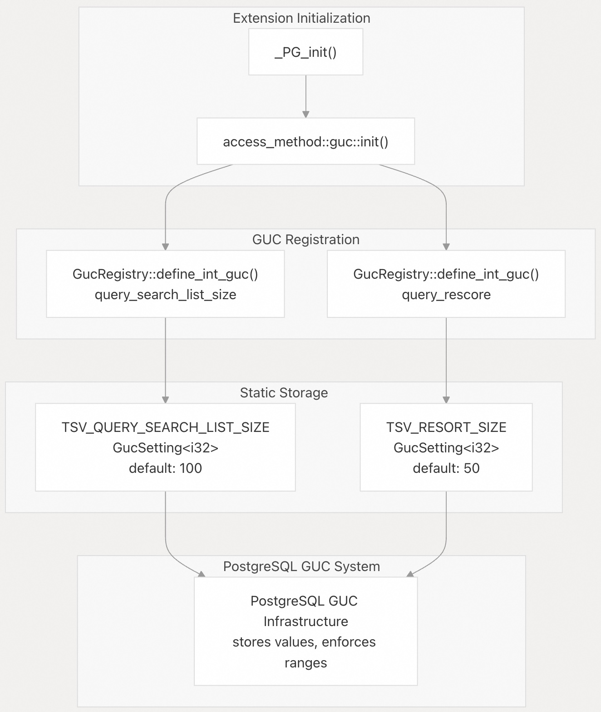
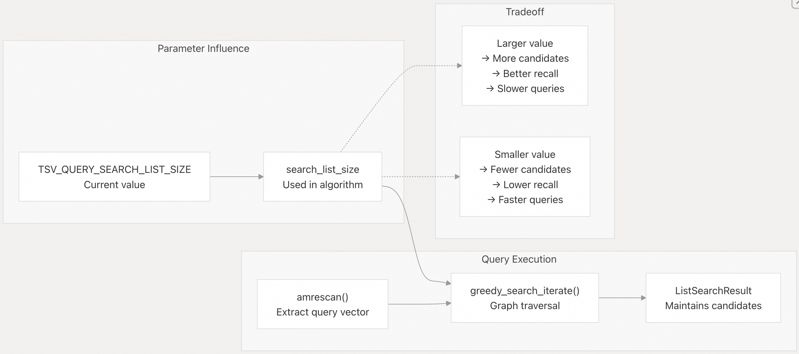
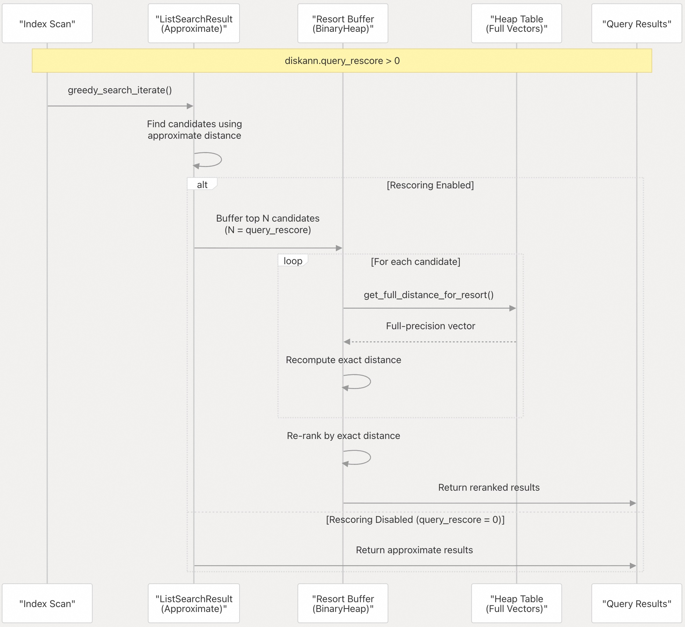
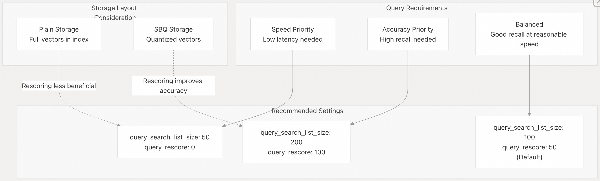
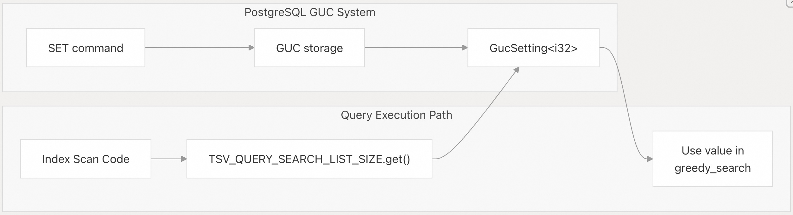

## pgvectorscale 源码学习: 8.2 Query-Time Parameters (查询时参数)  
                                            
### 作者                                            
digoal                                            
                                            
### 日期                                            
2025-11-12                                           
                                            
### 标签                                            
pgvectorscale , 向量数据库 , DiskANN , StreamingDiskANN , 源码学习                                            
                                            
----                                            
                                            
## 背景                               
本文介绍了运行时 **GUC** (Grand Unified Configuration，统一配置系统) 参数，这些参数用于控制针对 **StreamingDiskANN indexes** (StreamingDiskANN 索引) 的查询的**accuracy versus speed tradeoff** (准确性与速度的权衡)。这些参数可以动态调整，无需重建索引，允许进行**per-query** (按查询) 或 **per-session tuning** (按会话调优)。  
  
## Overview (概述)  
  
`pgvectorscale` 提供了两个影响**index scan** (索引扫描) 行为的**query-time GUC parameters** (查询时 GUC 参数)：  
  
| Parameter (参数) | Description (描述) | Default (默认值) | Range (范围) |  
| :--- | :--- | :--- | :--- |  
| `diskann.query_search_list_size` | **Number of additional candidates** (图搜索期间考虑的额外候选者数量) considered during **graph search** (图搜索) | 100 | 1-10000 |  
| `diskann.query_rescore` | **Number of elements to rescore** (使用精确距离**重新评分**的元素数量) with **exact distances** (精确距离) (**0 to disable**) (0 表示禁用) | 50 | 0-1000 |  
  
这两个参数都被注册为 `Userset` 上下文的 GUC，这意味着任何用户都可以随时更改它们，无需**special privileges** (特殊权限)。  
  
**Sources (来源):** [`pgvectorscale/src/access_method/guc.rs` 1-40](https://github.com/timescale/pgvectorscale/blob/36271fa5/pgvectorscale/src/access_method/guc.rs#L1-L40) [`README.md` 348-372](https://github.com/timescale/pgvectorscale/blob/36271fa5/README.md#L348-L372)  
  
## Parameter Registration and Initialization (参数注册与初始化)  
  
查询时参数在**extension initialization** (扩展初始化) 期间通过一个明确定义的流程在 PostgreSQL 中注册：  
  
  
  
**Figure: GUC Parameter Registration Flow (GUC 参数注册流程图)**  
  
两个静态变量 `TSV_QUERY_SEARCH_LIST_SIZE` 和 `TSV_RESORT_SIZE` 被定义为 `GucSetting<i32>` 实例，用于保存当前值。它们在 `_PG_init()` **callback** (回调函数) 期间注册到 PostgreSQL 的 GUC 系统中。  
  
**Sources (来源):** [`pgvectorscale/src/lib.rs` 10-15](https://github.com/timescale/pgvectorscale/blob/36271fa5/pgvectorscale/src/lib.rs#L10-L15) [`pgvectorscale/src/access_method/guc.rs` 3-4](https://github.com/timescale/pgvectorscale/blob/36271fa5/pgvectorscale/src/access_method/guc.rs#L3-L4) [`pgvectorscale/src/access_method/guc.rs` 6-40](https://github.com/timescale/pgvectorscale/blob/36271fa5/pgvectorscale/src/access_method/guc.rs#L6-L40)  
  
## diskann.query\_search\_list\_size  
  
### Purpose (目的)  
  
`diskann.query_search_list_size` 参数控制在**query execution** (查询执行) 的**greedy graph search** (贪婪图搜索) 阶段维护的**candidates** (候选者) 数量。更大的搜索列表允许算法探索更多的图，可能找到更好的结果，但代价是查询时间增加。  
  
### Implementation Details (实现细节)  
  
该参数以以下**characteristics** (特征) 进行注册：  
  
```rust  
GucRegistry::define_int_guc(  
    "diskann.query_search_list_size",  
    "The size of the search list used in queries",  
    "Higher value increases recall at the cost of speed.",  
    &TSV_QUERY_SEARCH_LIST_SIZE,  
    1,      // minimum value  
    10000,  // maximum value  
    GucContext::Userset,  
    GucFlags::default(),  
);  
```  
  
**Key properties (关键属性):**  
  
  * **Name (名称):** `diskann.query_search_list_size`  
  * **Short description (简短描述):** "The size of the search list used in queries" (查询中使用的搜索列表大小)  
  * **Long description (详细描述):** "Higher value increases **recall** (召回率) at the cost of speed." (值越高，以速度为代价提高召回率。)  
  * **Valid range (有效范围):** 1 to 10,000  
  * **Default value (默认值):** 100  
  * **Context (上下文):** `Userset` (can be changed by any user) (可由任何用户更改)  
  
### Effect on Query Performance (对查询性能的影响)  
  
  
  
**Figure: query\_search\_list\_size Impact on Search (query\_search\_list\_size 对搜索的影响图)**  
  
搜索列表大小直接影响**graph traversal** (图遍历) 期间使用的 `ListSearchResult` 结构。在贪婪搜索算法期间，系统维护一个**priority queue** (优先队列) 的**candidate nodes** (候选节点)。`query_search_list_size` 参数决定了在这个队列中可以保留多少候选者，然后**least promising ones are discarded** (丢弃最不具有前景的候选者)。  
  
**Sources (来源):** [`pgvectorscale/src/access_method/guc.rs` 7-22](https://github.com/timescale/pgvectorscale/blob/36271fa5/pgvectorscale/src/access_method/guc.rs#L7-L22) [`README.md` 354-355](https://github.com/timescale/pgvectorscale/blob/36271fa5/README.md#L354-L355)  
  
## diskann.query\_rescore  
  
### Purpose (目的)  
  
`diskann.query_rescore` 参数启用了一种**reranking mechanism** (重新排序机制)，以提高结果准确性。启用时，**index scan** (索引扫描) 会返回基于**approximate distances** (近似距离) 的靠前**candidates** (候选者)（可能使用**quantized vectors**，量化向量），然后使用从**heap table** (堆表) 中存储的**full-precision vectors** (全精度向量) 计算出的**exact distances** (精确距离) 对它们进行**rescores** (重新评分)。  
  
当使用 **SBQ compression** (SBQ 压缩，即 `storage_layout=memory_optimized`) 时，此参数特别有价值，因为索引存储**quantized vectors** (量化向量) 以进行**fast approximate search** (快速近似搜索)，但可以检索**exact vectors** (精确向量) 以进行**final ranking** (最终排名)。  
  
### Implementation Details (实现细节)  
  
该参数以以下特征进行注册：  
  
```rust  
GucRegistry::define_int_guc(  
    "diskann.query_rescore",  
    "The number of elements rescored (0 to disable rescoring)",  
    "Rescoring takes the query_rescore number of elements that have the smallest approximate distance, rescores them with the exact distance, returning the closest ones with the exact distance.",  
    &TSV_RESORT_SIZE,  
    0,      // minimum value (0 disables rescoring)  
    1000,   // maximum value  
    GucContext::Userset,  
    GucFlags::default(),  
);  
```  
  
**Key properties (关键属性):**  
  
  * **Name:** `diskann.query_rescore`  
  * **Short description:** "The number of elements rescored (0 to disable rescoring)" (重新评分的元素数量，0 表示禁用重新评分)  
  * **Long description:** Explains the **rescoring process** (解释重新评分过程)  
  * **Valid range:** 0 to 1,000  
  * **Default value:** 50  
  * **Special value:** 0 **disables rescoring entirely** (完全禁用重新评分)  
  * **Context:** `Userset` (can be changed by any user)  
  
### Rescoring Mechanism (重新评分机制)  
  
  
  
**Figure: Rescoring Flow During Query Execution (查询执行期间的重新评分流程图)**  
  
当**rescoring is enabled** (启用重新评分) 时：  
  
1.  **Index scan** (索引扫描) 使用**approximate distances** (近似距离)（快速）执行**greedy graph search** (贪婪图搜索)  
2.  最靠前的 `query_rescore` 个**candidates** (候选者) 被缓冲到**binary heap** (二叉堆) 中  
3.  对于每个候选者，从**heap table** (堆表) 中检索**full vector** (完整向量)  
4.  计算查询向量与完整向量之间的**exact distances** (精确距离)  
5.  结果基于**exact distances** (精确距离) 进行**reranked** (重新排名)  
6.  **reranked results** (重新排名后的结果) 返回给用户  
  
**Sources (来源):** [`pgvectorscale/src/access_method/guc.rs` 24-39](https://github.com/timescale/pgvectorscale/blob/36271fa5/pgvectorscale/src/access_method/guc.rs#L24-L39) [`README.md` 355-356](https://github.com/timescale/pgvectorscale/blob/36271fa5/README.md#L355-L356)  
  
## Setting Parameter Values (设置参数值)  
  
### Session-Level Settings (会话级别设置)  
  
使用标准的 PostgreSQL `SET` 命令来更改**entire database session** (整个数据库会话) 的参数：  
  
```sql  
-- Set search list size for the session  
SET diskann.query_search_list_size = 200;  
  
-- Set rescore count for the session  
SET diskann.query_rescore = 100;  
  
-- Execute queries with these settings  
SELECT * FROM documents   
ORDER BY embedding <=> query_vector   
LIMIT 10;  
```  
  
这些设置在**connection** (连接) 持续期间保持不变。  
  
### Transaction-Local Settings (事务局部设置)  
  
在**transaction** (事务) 内部使用 `SET LOCAL` 将参数更改限制为**current transaction only** (仅限于当前事务)：  
  
```sql  
BEGIN;  
  
-- These settings only apply within this transaction  
SET LOCAL diskann.query_search_list_size = 10;  
SET LOCAL diskann.query_rescore = 0;  
  
SELECT * FROM documents   
ORDER BY embedding <=> query_vector   
LIMIT 10;  
  
COMMIT; -- Settings are reset after transaction ends  
```  
  
这对于调整**specific queries** (特定查询) 而不影响同一会话中的其他查询非常有用。  
  
### Disabling Rescoring (禁用重新评分)  
  
将 `diskann.query_rescore` 设置为 0 以**entirely disable rescoring** (完全禁用重新评分)：  
  
```sql  
-- Disable rescoring for maximum query speed  
SET diskann.query_rescore = 0;  
  
-- This query uses only approximate distances  
SELECT * FROM documents   
ORDER BY embedding <=> query_vector   
LIMIT 10;  
```  
  
**Sources (来源):** [`README.md` 358-372](https://github.com/timescale/pgvectorscale/blob/36271fa5/README.md#L358-L372)  
  
## Parameter Interaction and Tuning Guidelines (参数交互和调优指南)  
  
  
  
**Figure: Tuning Strategy Based on Requirements (基于需求的调优策略图)**  
  
### General Guidelines (一般指南)  
  
1.  **Start with defaults (从默认值开始):** 默认值 (`search_list_size=100`, `rescore=50`) 为大多数**workloads** (工作负载) 提供了**good balance** (良好的平衡)。  
2.  **Increase both for higher accuracy (提高两者以获得更高的准确性):** 当**recall** (召回率) 至关重要时，**proportionally** (成比例地) 增加这两个参数。  
3.  **Disable rescoring for speed (为提高速度而禁用重新评分):** 如果使用**plain storage** (普通存储) 或当**approximate results** (近似结果) 可以接受时，设置 `query_rescore=0`。  
4.  **Storage-dependent optimization (依赖于存储的优化):**  
      * 使用 **SBQ compression** (SBQ 压缩)：**Rescoring** (重新评分) 提供了**significant accuracy improvement** (显著的准确性提升)  
      * 使用 **plain storage** (普通存储)：由于距离已经是**exact** (精确的)，**Rescoring** (重新评分) 的**minimal effect** (影响最小)  
5.  **Query pattern consideration (查询模式考虑):**  
      * **Large result sets** (大结果集，即 `high LIMIT`)：可能受益于更高的 `query_search_list_size`  
      * **Small result sets** (小结果集，即 `low LIMIT`)：可能不需要很高的搜索列表大小  
      * 使用**label filtering** (标签过滤)：可能需要更高的值才能找到足够的匹配结果  
  
**Sources (来源):** [`README.md` 348-356](https://github.com/timescale/pgvectorscale/blob/36271fa5/README.md#L348-L356)  
  
## Code Entity Reference (代码实体参考)  
  
本节将自然语言概念映射到特定的**code entities** (代码实体)，供使用**codebase** (代码库) 的开发人员参考。  
  
### Primary Source Files (主要源文件)  
  
| Concept (概念) | File (文件) | Key Entities (关键实体) |  
| :--- | :--- | :--- |  
| GUC Definition (GUC 定义) | [`pgvectorscale/src/access_method/guc.rs` 1-41](https://github.com/timescale/pgvectorscale/blob/36271fa5/pgvectorscale/src/access_method/guc.rs#L1-L41) | `TSV_QUERY_SEARCH_LIST_SIZE`, `TSV_RESORT_SIZE`, `init()` |  
| Extension Init (扩展初始化) | [`pgvectorscale/src/lib.rs` 10-15](https://github.com/timescale/pgvectorscale/blob/36271fa5/pgvectorscale/src/lib.rs#L10-L15) | `_PG_init()`, `access_method::guc::init()` |  
| Build-time Options (构建时选项) | [`pgvectorscale/src/access_method/options.rs` 1-390](https://github.com/timescale/pgvectorscale/blob/36271fa5/pgvectorscale/src/access_method/options.rs#L1-L390) | `TSVIndexOptions` (contrast with query-time) (与查询时参数的对比) |  
  
### GUC Access Pattern (GUC 访问模式)  
  
  
  
**Figure: Runtime GUC Value Access Pattern (运行时 GUC 值访问模式图)**  
  
在**runtime** (运行时)，查询执行代码通过静态的 `GucSetting<i32>` 实例访问当前参数值。这些实例上的 `get()` 方法从 PostgreSQL 的 GUC 存储中检索当前值，该值可能已被 `SET` 命令修改。  
  
**Sources (来源):** [`pgvectorscale/src/access_method/guc.rs` 3-4](https://github.com/timescale/pgvectorscale/blob/36271fa5/pgvectorscale/src/access_method/guc.rs#L3-L4)  
  
## Comparison with Build-Time Parameters (与构建时参数的比较)  
  
| Aspect (方面) | Query-Time Parameters (查询时参数) | Build-Time Parameters (构建时参数) |  
| :--- | :--- | :--- |  
| Set when (设置时机) | At **query execution time** (在查询执行时) | During `CREATE INDEX` (在 `CREATE INDEX` 期间) |  
| Modified via (修改方式) | `SET` command (`SET` 命令) | **Index must be rebuilt** (必须重建索引) |  
| Scope (范围) | **Per-session** or **per-transaction** (按会话或按事务) | **Per-index** (按索引) |  
| Storage (存储) | PostgreSQL **GUC system** (PostgreSQL GUC 系统) | Index metadata (`TSVIndexOptions`, `MetaPage`) (索引元数据) |  
| Examples (示例) | `query_search_list_size`, `query_rescore` | `num_neighbors`, `storage_layout`, `search_list_size` |  
| Context (上下文) | `GucContext::Userset` | N/A (stored in index relation options) (不适用，存储在索引关系选项中) |  
  
**Note (注意):** **build-time** (构建时) 的 `search_list_size` 参数与 **query-time** (查询时) 的 `query_search_list_size` 参数是**distinct** (不同) 的：  
  
  * `search_list_size`: Controls search list during index **construction** (在索引**构建**期间控制搜索列表)  
  * `query_search_list_size`: Controls search list during **query execution** (在**查询执行**期间控制搜索列表)  
  
**Sources (来源):** [`pgvectorscale/src/access_method/options.rs` 1-390](https://github.com/timescale/pgvectorscale/blob/36271fa5/pgvectorscale/src/access_method/options.rs#L1-L390) [`pgvectorscale/src/access_method/guc.rs` 1-41](https://github.com/timescale/pgvectorscale/blob/36271fa5/pgvectorscale/src/access_method/guc.rs#L1-L41)  
      
#### [PolarDB 学习图谱](https://www.aliyun.com/database/openpolardb/activity "8642f60e04ed0c814bf9cb9677976bd4")
  
  
#### [PostgreSQL 解决方案集合](../201706/20170601_02.md "40cff096e9ed7122c512b35d8561d9c8")
  
  
#### [德哥 / digoal's Github - 公益是一辈子的事.](https://github.com/digoal/blog/blob/master/README.md "22709685feb7cab07d30f30387f0a9ae")
  
  
#### [About 德哥](https://github.com/digoal/blog/blob/master/me/readme.md "a37735981e7704886ffd590565582dd0")
  
  

  
