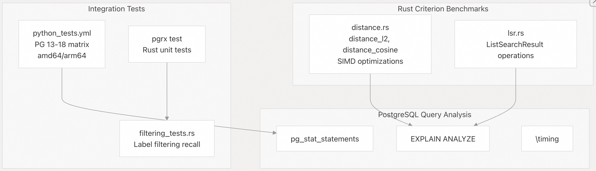
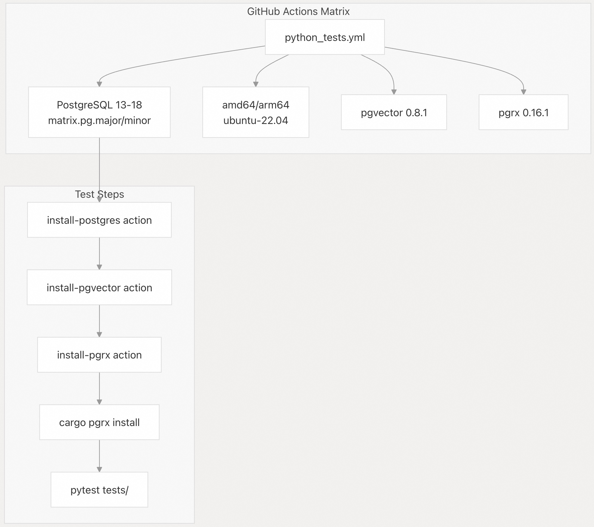
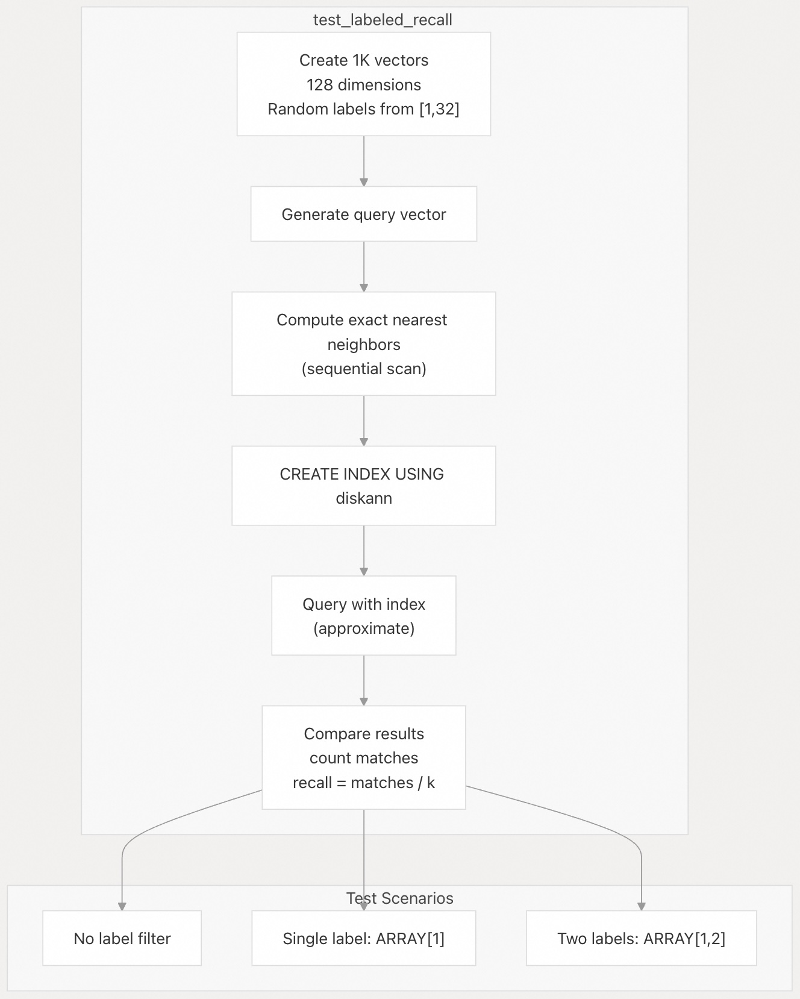
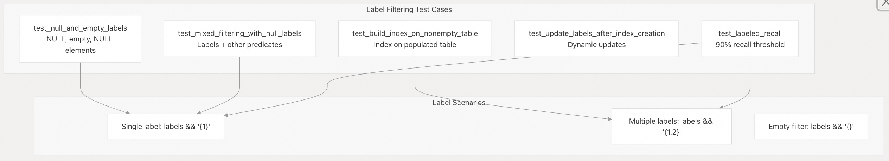
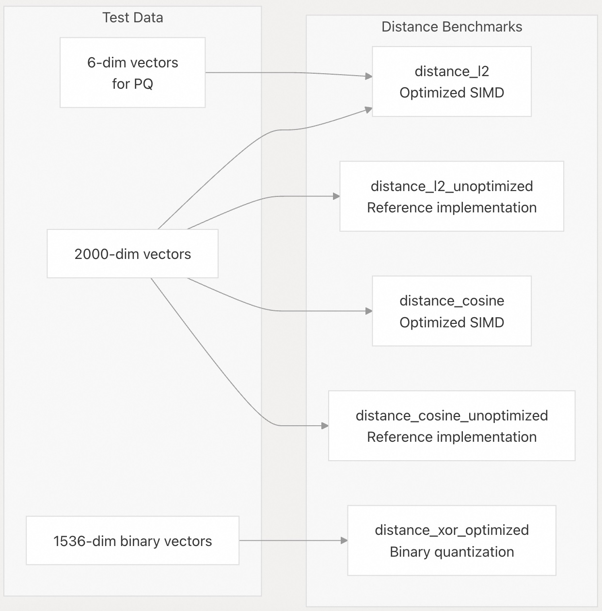
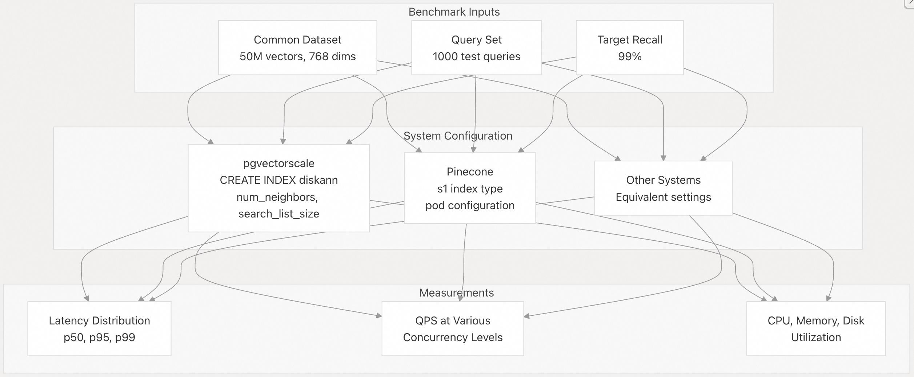

## pgvectorscale 源码学习: 8.3 基准测试（Benchmarking）  
                                              
### 作者                                              
digoal                                              
                                              
### 日期                                              
2025-11-12                                             
                                              
### 标签                                              
pgvectorscale , 向量数据库 , DiskANN , StreamingDiskANN , 源码学习                                              
                                              
----                                              
                                              
## 背景                                 
本文介绍 **pgvectorscale** 的基准测试方法（benchmarking methodology）和基础设施（infrastructure），包括内置的 **Rust** 基准测试、测试框架，以及进行自定义性能评估的指南。  
  
## 基准测试基础设施概览（Benchmark Infrastructure Overview）  
  
**pgvectorscale** 包含多个基准测试系统：  
  
  
  
来源:  
[`pgvectorscale/benches/distance.rs` 1-358](https://github.com/timescale/pgvectorscale/blob/36271fa5/pgvectorscale/benches/distance.rs#L1-L358)  
[`github/workflows/python_tests.yml` 1-126](https://github.com/timescale/pgvectorscale/blob/36271fa5/.github/workflows/python_tests.yml#L1-L126)  
[`pgvectorscale/src/access_method/labels/filtering_tests.rs` 1-1027](https://github.com/timescale/pgvectorscale/blob/36271fa5/pgvectorscale/src/access_method/labels/filtering_tests.rs#L1-L1027)  
  
## 已发布的基准测试结果（Published Benchmark Results）  
  
**pgvectorscale** 的 `README` 文件报告了与 **Pinecone** 进行的基准测试结果，该测试使用了 5000 万个 **Cohere 嵌入（embeddings）**，维度为 768：  
  
| 指标（Metric） | pgvectorscale + PostgreSQL | Pinecone s1 索引（Index） | 提升（Improvement） |  
| :--- | :--- | :--- | :--- |  
| p95 延迟（Latency） | 更低 | 基线（Baseline） | 快 28 倍 |  
| 查询吞吐量（Query Throughput） | 更高 | 基线 | 高 16 倍 |  
| 成本（Cost, 自托管 AWS EC2） | 更低 | 基线 | 降低 75% |  
  
这些测量是在近似最近邻查询（approximate nearest neighbor queries）达到 **99% 召回率（recall）** 时获得的。  
  
来源:  
[`README.md` 17-29](https://github.com/timescale/pgvectorscale/blob/36271fa5/README.md#L17-L29)  
  
## 关键基准测试指标（Key Benchmark Metrics）  
  
**pgvectorscale** 的性能评估侧重于以下指标：  
  
| 指标（Metric） | 描述（Description） | 测量方法（Measurement Method） |  
| :--- | :--- | :--- |  
| 查询延迟（Query Latency） | 响应时间分布（p50、p95、p99） | `EXPLAIN ANALYZE`，查询计时 |  
| 吞吐量（Throughput） | 并发负载下的每秒查询次数 | 使用自定义脚本的 **pgbench** |  
| 召回率（Recall） | 找到真实最近邻居的比例 | 真值（Ground truth）比较（参见 [`filtering_tests.rs` 882-1025](https://github.com/timescale/pgvectorscale/blob/36271fa5/filtering_tests.rs#L882-L1025)) |  
| 索引构建时间（Index Build Time） | `CREATE INDEX` 操作的持续时间 | `\timing` 或 `EXPLAIN ANALYZE` |  
| 索引大小（Index Size） | 索引占用的磁盘空间 | `pg_relation_size(indexrelid)` |  
| 内存使用（Memory Usage） | 索引操作所需的 **RAM** | 监控 `work_mem`，`maintenance_work_mem` |  
  
来源:  
[`README.md` 17-29](https://github.com/timescale/pgvectorscale/blob/36271fa5/README.md#L17-L29)  
[`pgvectorscale/src/access_method/labels/filtering_tests.rs` 882-1025](https://github.com/timescale/pgvectorscale/blob/36271fa5/pgvectorscale/src/access_method/labels/filtering_tests.rs#L882-L1025)  
  
## 基准测试环境设置（Benchmark Environment Setup）  
  
### 持续集成/持续部署（CI/CD）测试矩阵（Test Matrix）  
  
**pgvectorscale** 项目使用 **GitHub Actions** 在多个 **PostgreSQL** 版本和架构上运行自动化基准测试。测试矩阵配置涵盖：  
  
  
  
来源:  
[`github/workflows/python_tests.yml` 8-116](https://github.com/timescale/pgvectorscale/blob/36271fa5/.github/workflows/python_tests.yml#L8-L116)  
  
### 本地环境配置（Local Environment Configuration）  
  
对于自定义基准测试，请使用适当的内存设置来配置 **PostgreSQL**：  
  
```sql  
-- Increase memory for index builds  
SET maintenance_work_mem = '2GB';  
  
-- Disable sequential scans to force index usage  
SET enable_seqscan = OFF;  
  
-- Adjust query-time parameters  
SET diskann.query_search_list_size = 100;  
SET diskann.query_rescore = 50;  
```  
  
来源:  
[`README.md` 315-362](https://github.com/timescale/pgvectorscale/blob/36271fa5/README.md#L315-L362)  
  
## 准备基准测试数据（Preparing Benchmark Data）  
  
有意义的基准测试需要有代表性的数据。以下是如何准备基准测试数据集：  
  
1.  **生成或获取向量数据集（vector datasets）**：  
      * 如果可行，使用来自您的应用领域的真实嵌入（embeddings）  
      * 或者，生成具有适当分布的合成嵌入（synthetic embeddings）  
      * 考虑使用标准基准测试数据集，如 **SIFT**、**GIST** 或 **DEEP**  
2.  **组织您的测试数据**：  
      * 创建具有适当向量维度（vector dimensions）的表  
      * 如果测试带过滤的搜索，则包含元数据列（metadata columns）  
      * 生成足够的数量（数百万个向量），以进行真实的测试  
3.  **采样查询向量（query vectors）**：  
      * 创建一组用于搜索基准测试的查询向量  
      * 对于准确性测试，准备真值结果（exact nearest neighbors，精确最近邻）  
  
类似于测试设置的示例表创建和数据加载：  
  
```sql  
CREATE TABLE benchmark_embeddings (  
    id BIGINT PRIMARY KEY GENERATED BY DEFAULT AS IDENTITY,  
    metadata JSONB,  
    labels SMALLINT[],  
    embedding VECTOR(768)  
);  
  
-- Insert data (example using random vectors)  
INSERT INTO benchmark_embeddings (embedding, labels)  
SELECT   
    (SELECT array_agg(random())::vector(768) FROM generate_series(1, 768)),  
    ARRAY[1, 3, 5]::smallint[]  
FROM generate_series(1, 1000000);  
```  
  
来源:  
[`pgvectorscale/src/access_method/upgrade_test.rs` 148-173](https://github.com/timescale/pgvectorscale/blob/36271fa5/pgvectorscale/src/access_method/upgrade_test.rs#L148-L173)  
  
## 索引配置基准测试（Index Configuration Benchmarking）  
  
比较不同的索引配置对于优化性能至关重要。创建具有不同参数的多个索引以评估其影响：  
  
```sql  
-- 不要同时创建, 除非你有pg_hint_plan插件可以指定使用那个索引  
  
-- Test different storage layouts  
CREATE INDEX bench_plain_idx ON benchmark_embeddings  
USING diskann (embedding vector_cosine_ops) WITH (storage_layout='plain');  
  
CREATE INDEX bench_sbq_idx ON benchmark_embeddings  
USING diskann (embedding vector_cosine_ops) WITH (storage_layout='memory_optimized');  
  
-- Test different numbers of neighbors  
CREATE INDEX bench_neighbors_50 ON benchmark_embeddings  
USING diskann (embedding vector_cosine_ops) WITH (num_neighbors=50);  
  
CREATE INDEX bench_neighbors_100 ON benchmark_embeddings  
USING diskann (embedding vector_cosine_ops) WITH (num_neighbors=100);  
  
-- Test different search list sizes  
CREATE INDEX bench_sls_100 ON benchmark_embeddings  
USING diskann (embedding vector_cosine_ops) WITH (search_list_size=100);  
  
CREATE INDEX bench_sls_200 ON benchmark_embeddings  
USING diskann (embedding vector_cosine_ops) WITH (search_list_size=200);  
  
-- Test with different label configurations  
CREATE INDEX bench_with_labels ON benchmark_embeddings  
USING diskann (embedding vector_cosine_ops, labels);  
```  
  
来源:  
[`README.md` 315-338](https://github.com/timescale/pgvectorscale/blob/36271fa5/README.md#L315-L338)  
  
## 性能基准测试（Performance Benchmarking）  
  
### 单查询性能（Single-Query Performance）  
  
测量单个查询的性能以了解基线性能：  
  
```sql  
-- Enable timing  
\timing on  
  
-- Disable sequential scan to force index usage  
SET enable_seqscan = off;  
  
-- Test basic vector search  
EXPLAIN ANALYZE   
SELECT id, metadata   
FROM benchmark_embeddings  
ORDER BY embedding <=> '[query vector here]'  
LIMIT 10;  
  
-- Test with different query parameters  
SET diskann.query_search_list_size = 200;  
SET diskann.query_rescore = 100;  
EXPLAIN ANALYZE   
SELECT id, metadata   
FROM benchmark_embeddings  
ORDER BY embedding <=> '[query vector here]'  
LIMIT 10;  
```  
  
来源:  
[`README.md` 345-364](https://github.com/timescale/pgvectorscale/blob/36271fa5/README.md#L345-L364)  
  
### 使用 **pgbench** 进行吞吐量测试（Throughput Testing）  
  
为了测量负载下的查询吞吐量，请创建 **pgbench** 脚本：  
  
1.  创建一个 **pgbench** 脚本文件 `vector_search.sql`：  
  
    ```sql  
    SELECT id FROM benchmark_embeddings ORDER BY embedding <=> :vector LIMIT 10;  
    ```  
  
2.  使用此脚本运行 **pgbench**：  
  
    ```  
    pgbench -c 8 -j 4 -T 60 -f vector_search.sql -P 5 -n  
    ```  
  
来源:  
[`README.md` 17-21](https://github.com/timescale/pgvectorscale/blob/36271fa5/README.md#L17-L21)  
  
## 召回率准确性测试（Recall Accuracy Testing）  
  
**pgvectorscale** 在测试套件中包含了自动召回率测试。[`filtering_tests.rs` 882-1025](https://github.com/timescale/pgvectorscale/blob/36271fa5/filtering_tests.rs#L882-L1025) 中的实现展示了召回率测量方法（recall measurement methodology）。  
  
### 召回率测试实现（Recall Test Implementation）  
  
  
  
该测试验证了在各种过滤场景下，召回率（recall）**\>= 0.9 (90%)**。[`filtering_tests.rs` 882-1025](https://github.com/timescale/pgvectorscale/blob/36271fa5/filtering_tests.rs#L882-L1025) 的关键实现细节：  
  
  * **数据集（Dataset）**：1000 个向量（vectors），128 维度（dimensions）  
  * **标签（Labels）**：从 32 个可能的标签中随机分配  
  * **真值（Ground truth）**：使用精确距离计算（exact distance calculation）的顺序扫描（Sequential scan）  
  * **索引查询（Index query）**：使用 `SET enable_seqscan = 0` 来强制使用索引  
  * **召回率计算（Recall calculation）**：  
    ```rust  
    let matches = indexed_results  
        .iter()  
        .filter(|id| ground_truth_set.contains(id))  
        .count();  
    matches as f64 / ground_truth.len() as f64  
    ```  
  
来源:  
[`pgvectorscale/src/access_method/labels/filtering_tests.rs` 882-1025](https://github.com/timescale/pgvectorscale/blob/36271fa5/pgvectorscale/src/access_method/labels/filtering_tests.rs#L882-L1025)  
  
### 自定义召回率测量（Custom Recall Measurement）  
  
对于自定义数据集，使用 **PostgreSQL** 查询来计算召回率：  
  
```sql  
-- Generate ground truth (exact search, no index)  
CREATE TABLE ground_truth AS  
WITH ranked AS (  
    SELECT   
        e.id,  
        e.embedding <=> '[query vector]' AS distance,  
        ROW_NUMBER() OVER (ORDER BY e.embedding <=> '[query vector]') AS rn  
    FROM benchmark_embeddings e  
)  
SELECT id FROM ranked WHERE rn <= 100;  
  
-- Get approximate results from index  
CREATE TABLE approximate_results AS  
SELECT id FROM benchmark_embeddings  
ORDER BY embedding <=> '[query vector]'  
LIMIT 100;  
  
-- Calculate recall  
SELECT   
    COUNT(DISTINCT a.id) FILTER (WHERE EXISTS (  
        SELECT 1 FROM ground_truth g WHERE g.id = a.id  
    ))::float / 100 AS recall  
FROM approximate_results a;  
```  
  
来源:  
[`pgvectorscale/src/access_method/labels/filtering_tests.rs` 913-1004](https://github.com/timescale/pgvectorscale/blob/36271fa5/pgvectorscale/src/access_method/labels/filtering_tests.rs#L913-L1004)  
  
## 速度 vs. 准确性权衡（Speed vs. Accuracy Trade-offs）  
  
近似最近邻搜索（approximate nearest neighbor search）中的关键权衡（trade-off）在于速度和准确性之间。通过运行不同配置参数的基准测试来可视化这种关系：  
  
| 参数（Parameter） | 低值（Low Value） | 高值（High Value） | 影响（Effect） |  
| :--- | :--- | :--- | :--- |  
| `num_neighbors` | 20-50 | 100-200 | 值越高，准确性越高，但查询速度越慢 |  
| `search_list_size` | 50-100 | 200-400 | 值越高，图质量（graph quality）越好，但索引构建速度越慢 |  
| `diskann.query_search_list_size` | 50 | 200+ | 值越高，准确性越高，但吞吐量（throughput）越低 |  
| `diskann.query_rescore` | 0（禁用） | 100+ | 值越高，准确性越高，但会增加查询开销（query overhead） |  
  
创建一个改变这些参数并绘制结果的基准测试：  
  
  
  
来源:  
[`README.md` 315-364](https://github.com/timescale/pgvectorscale/blob/36271fa5/README.md#L315-L364)  
  
## 标签过滤性能（Label Filtering Performance）  
  
测试套件（test suite）包含全面的标签过滤基准测试（label filtering benchmarks），演示了预期的查询模式和性能特征。  
  
### 标签过滤的测试覆盖率（Test Coverage）  
  
过滤测试套件（[`filtering_tests.rs` 1-1027](https://github.com/timescale/pgvectorscale/blob/36271fa5/filtering_tests.rs#L1-L1027)) 包含这些与基准测试相关的场景：  
  
  
  
### 基准测试查询模式（Benchmark Query Patterns）  
  
测试套件中的示例展示了高效的查询模式：  
  
  * **基本标签过滤器（Basic Label Filter）**（[`filtering_tests.rs` 46-57](https://github.com/timescale/pgvectorscale/blob/36271fa5/filtering_tests.rs#L46-L57)）：  
    ```sql  
    SET enable_seqscan = 0;  
    WITH cte AS (  
        SELECT * FROM test_null_labels  
        WHERE labels && '{1}'  
        ORDER BY embedding <=> '[0,0,0]'  
    )  
    SELECT COUNT(*) FROM cte;  
    ```  
  * **多标签过滤器（Multiple Label Filter）**（[`filtering_tests.rs` 151-161](https://github.com/timescale/pgvectorscale/blob/36271fa5/filtering_tests.rs#L151-L161)）：  
    ```sql  
    SET enable_seqscan = 0;  
    WITH cte AS (  
        SELECT * FROM test_nonempty  
        WHERE labels && '{2,3}'  
        ORDER BY embedding <=> '[0,0,0]'  
    )  
    SELECT COUNT(*) FROM cte;  
    ```  
  * **组合谓词（Combined Predicates）**（[`filtering_tests.rs` 196-206](https://github.com/timescale/pgvectorscale/blob/36271fa5/filtering_tests.rs#L196-L206)）：  
    ```sql  
    SET enable_seqscan = 0;  
    WITH cte AS (  
        SELECT * FROM test_mixed_labels  
        WHERE labels && '{1}' AND category = 'blog'  
        ORDER BY embedding <=> '[0,0,0]'  
    )  
    SELECT COUNT(*) FROM cte;  
    ```  
  
来源:  
[`pgvectorscale/src/access_method/labels/filtering_tests.rs` 1-1027](https://github.com/timescale/pgvectorscale/blob/36271fa5/pgvectorscale/src/access_method/labels/filtering_tests.rs#L1-L1027)  
  
### 标签大小边界验证（Label Size Bounds Validation）  
  
测试套件验证了标签值必须在 **PostgreSQL** 类型系统强制要求的 **smallint** 范围（-32768 到 32767）内。[`filtering_tests.rs` 718-793](https://github.com/timescale/pgvectorscale/blob/36271fa5/filtering_tests.rs#L718-L793) 的测试验证了边界条件（boundary conditions）和超出范围的错误处理。  
  
来源:  
[`pgvectorscale/src/access_method/labels/filtering_tests.rs` 718-793](https://github.com/timescale/pgvectorscale/blob/36271fa5/pgvectorscale/src/access_method/labels/filtering_tests.rs#L718-L793)  
  
## 内存和存储基准测试（Memory and Storage Benchmarking）  
  
比较不同索引配置之间的内存和存储需求：  
  
```sql  
-- View index sizes  
SELECT   
    pg_size_pretty(pg_relation_size(i.indexrelid)) AS index_size,  
    i.indexrelname AS index_name,  
    i.indexrelid::regclass  
FROM pg_index i  
JOIN pg_class c ON i.indexrelid = c.oid  
WHERE c.relname LIKE 'bench_%'  
ORDER BY pg_relation_size(i.indexrelid) DESC;  
  
-- Compare storage_layout impact  
SELECT   
    am.amname,  
    i.indexrelname,  
    pg_size_pretty(pg_relation_size(i.indexrelid)) AS index_size,  
    (SELECT s.stxoptions::text[] FROM pg_statistic_ext s WHERE s.stxrelid = i.indexrelid LIMIT 1) AS options  
FROM pg_index i  
JOIN pg_class c ON i.indexrelid = c.oid  
JOIN pg_am am ON c.relam = am.oid  
WHERE c.relname LIKE 'bench_%' AND am.amname = 'diskann'  
ORDER BY pg_relation_size(i.indexrelid) DESC;  
```  
  
来源:  
[`README.md` 315-325](https://github.com/timescale/pgvectorscale/blob/36271fa5/README.md#L315-L325)  
  
## 内置 **Rust** 基准测试（Built-in Rust Benchmarks）  
  
**pgvectorscale** 包含基于 **Criterion** 的基准测试，用于核心性能关键函数。这些基准测试位于 [`pgvectorscale/benches/`](https://github.com/timescale/pgvectorscale/blob/36271fa5/pgvectorscale/benches/) 中，可以使用 **Cargo** 执行。  
  
### 距离函数基准测试（Distance Function Benchmarks）  
  
距离基准测试套件（[`distance.rs` 1-358](https://github.com/timescale/pgvectorscale/blob/36271fa5/distance.rs#L1-L358)) 比较了优化和未优化的距离计算：  
  
  
  
关键 benchmark 基准测试函数来自 [`distance.rs`](https://github.com/timescale/pgvectorscale/blob/36271fa5/distance.rs)  
  
| 基准测试函数（Benchmark Function） | 目的（Purpose） | 行数（Lines） |  
| :--- | :--- | :--- |  
| `benchmark_distance` | 比较 L2 和余弦距离（cosine distance）的实现 | 144-161 |  
| `benchmark_distance_few_dimensions` | 测试 PQ 距离计算（6 维度） | 177-196 |  
| `benchmark_distance_xor` | 二进制量化距离（Binary quantization distance，SBQ） | 299-338 |  
| `benchmark_distance_x86_aligned_vectors` | 具有对齐内存的 **SIMD** | 110-131 |  
| `benchmark_distance_x86_unaligned_vectors` | 具有未对齐内存的 **SIMD** | 135-142 |  
  
如何运行这些基准测试：  
  
```bash  
# Run all distance benchmarks  
cargo bench --bench distance  
  
# Run specific benchmark  
cargo bench --bench distance -- "distance l2"  
  
# Save baseline for comparison  
cargo bench --bench distance -- --save-baseline before  
  
# Compare against baseline  
cargo bench --bench distance -- --baseline before  
```  
  
来源:  
[`pgvectorscale/benches/distance.rs` 1-358](https://github.com/timescale/pgvectorscale/blob/36271fa5/pgvectorscale/benches/distance.rs#L1-L358)  
  
### SIMD 优化基准测试（SIMD Optimization Benchmarks）  
  
距离基准测试包括 **SIMD** 实现与参考代码的比较：  
  
  * **x86\_64 AVX/FMA**：使用 `__m256` 内在函数（intrinsics）一次处理 8 个浮点数（[`distance.rs` 13-99](https://github.com/timescale/pgvectorscale/blob/36271fa5/distance.rs#L13-L99))  
  * **自动向量化（Auto-vectorization）**：依赖编译器对简单循环的优化（[`distance.rs` 163-174](https://github.com/timescale/pgvectorscale/blob/36271fa5/distance.rs#L163-L174))  
  * **比较目标**：包括 **Qdrant** 的点积（dot product）实现（[`distance.rs` 25-67](https://github.com/timescale/pgvectorscale/blob/36271fa5/distance.rs#L25-L67)) 和 **DiskANN** 的 L2 距离（[`distance.rs` 73-99](https://github.com/timescale/pgvectorscale/blob/36271fa5/distance.rs#L73-L99))  
  
这些基准测试仅在 **x86/x86\_64** 架构上运行（通过 `#[cfg(any(target_arch = "x86", target_arch = "x86_64"))]` 配置）。  
  
来源:  
[`pgvectorscale/benches/distance.rs` 9-143](https://github.com/timescale/pgvectorscale/blob/36271fa5/pgvectorscale/benches/distance.rs#L9-L143)  
  
## 性能比较方法论（Performance Comparison Methodology）  
  
将 **pgvectorscale** 与其他向量搜索系统进行比较时，基准测试方法应确保：  
  
1.  **数据集一致性（Dataset consistency）**：在所有系统中使用相同的向量数据集（vector datasets）  
2.  **召回率对等（Recall parity）**：将所有系统配置为达到相同的召回率水平（例如，99%）  
3.  **硬件对等（Hardware parity）**：在相同的**基础设施**（infrastructure）上运行  
4.  **工作负载模式（Workload patterns）**：执行可比较的查询模式和并发级别  
  
### 已发布的比较结果（Published Comparison Results）  
  
[`README.md` 17-29](https://github.com/timescale/pgvectorscale/blob/36271fa5/README.md#L17-L29) 中记录的 **Pinecone** 比较使用了以下方法论：  
  
  * **数据集规格（Dataset Specifications）**：  
      * 5000 万个 **Cohere 嵌入（embeddings）**  
      * 每个向量 768 个维度  
      * 余弦距离指标（Cosine distance metric）  
  * **目标召回率（Target Recall）**：近似最近邻查询（approximate nearest neighbor queries）达到 99%  
  
| 系统（System） | p95 延迟（Latency） | 吞吐量（Throughput） | 基础设施成本（Infrastructure Cost） |  
| :--- | :--- | :--- | :--- |  
| pgvectorscale + PostgreSQL | 基线（Baseline） | 基线 | 基线 |  
| Pinecone s1 索引 | 高 28 倍 | 低 16 倍 | 高 75% (AWS EC2) |  
  
来源:  
[`README.md` 17-29](https://github.com/timescale/pgvectorscale/blob/36271fa5/README.md#L17-L29)  
  
### 跨系统基准测试框架（Cross-System Benchmark Framework）  
  
  
  
来源:  
[`README.md` 17-29](https://github.com/timescale/pgvectorscale/blob/36271fa5/README.md#L17-L29)  
  
## 结论（Conclusion）  
  
对 **pgvectorscale** 进行适当的基准测试需要关注以下几个因素：  
  
1.  **设置一致性（Setup consistency）**：确保硬件、配置和数据在所有测试中保持一致  
2.  **多个指标（Multiple metrics）**：跟踪延迟（latency）、吞吐量（throughput）、准确性（accuracy）和资源使用情况  
3.  **参数探索（Parameter exploration）**：测试不同的索引和查询参数以找到最佳配置  
4.  **真实工作负载（Realistic workloads）**：使用与您实际应用程序匹配的数据和查询模式  
  
遵循这些基准测试指南，您可以准确测量 **pgvectorscale** 的性能特征，并针对您的特定用例进行优化。  
  
来源:  
[`README.md` 305-364](https://github.com/timescale/pgvectorscale/blob/36271fa5/README.md#L305-L364)  
  
      
#### [PolarDB 学习图谱](https://www.aliyun.com/database/openpolardb/activity "8642f60e04ed0c814bf9cb9677976bd4")
  
  
#### [PostgreSQL 解决方案集合](../201706/20170601_02.md "40cff096e9ed7122c512b35d8561d9c8")
  
  
#### [德哥 / digoal's Github - 公益是一辈子的事.](https://github.com/digoal/blog/blob/master/README.md "22709685feb7cab07d30f30387f0a9ae")
  
  
#### [About 德哥](https://github.com/digoal/blog/blob/master/me/readme.md "a37735981e7704886ffd590565582dd0")
  
  

  
