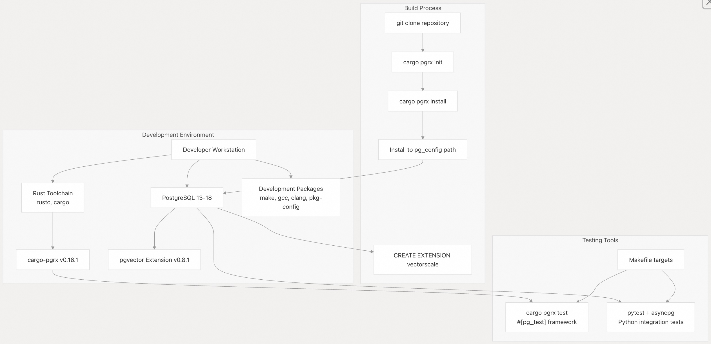
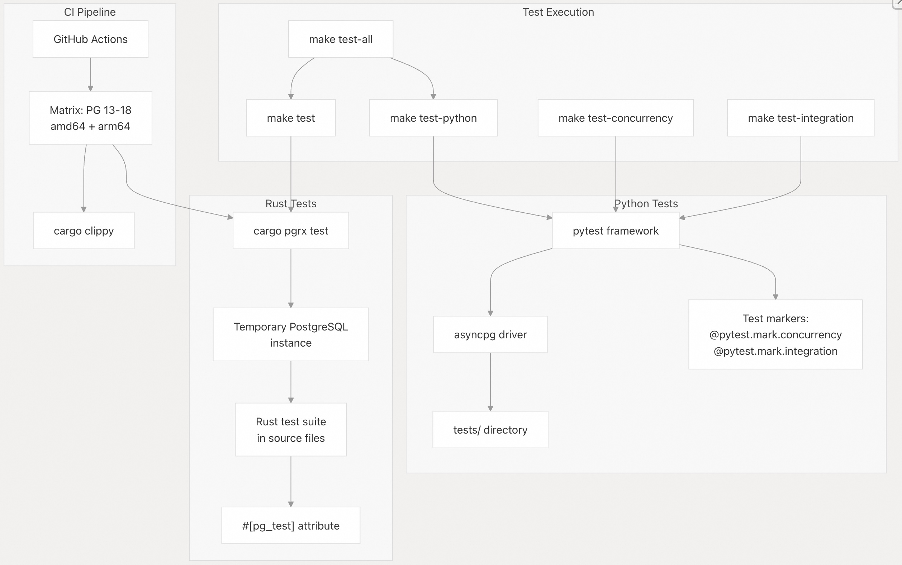
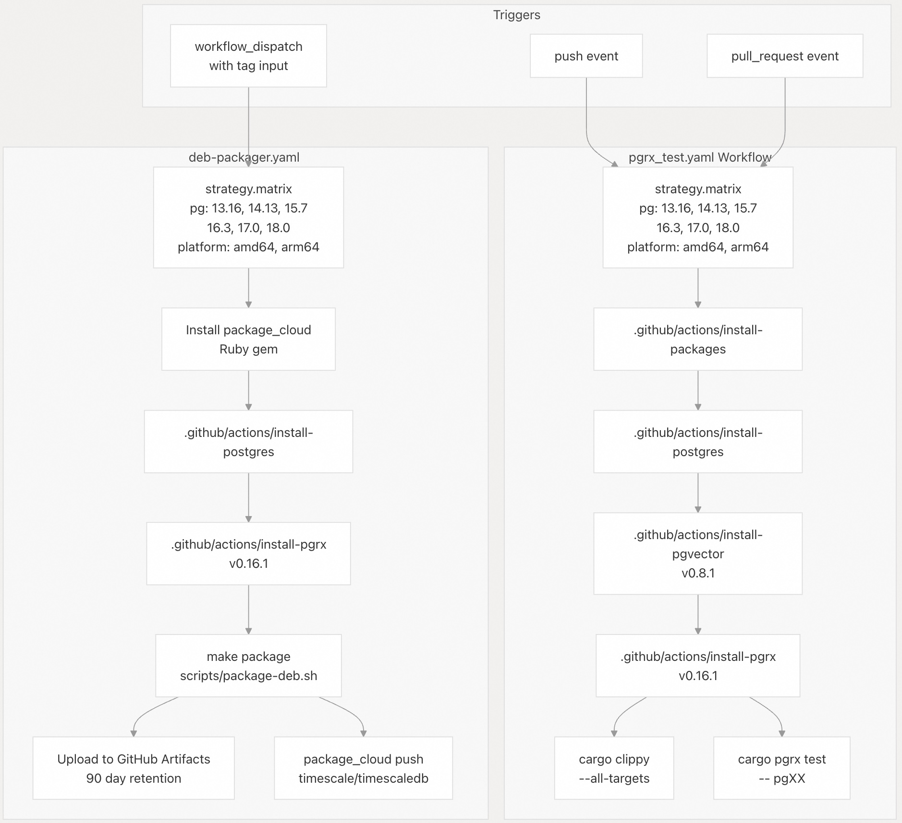

## pgvectorscale 源码学习: 9 开发指南 (Development Guide)  
                                                
### 作者                                                
digoal                                                
                                                
### 日期                                                
2025-11-12                                               
                                                
### 标签                                                
pgvectorscale , 向量数据库 , DiskANN , StreamingDiskANN , 源码学习                                                
                                                
----                                                
                                                
## 背景                                   
本文为希望对 **pgvectorscale** 做出贡献的**开发人员 (developers)** 提供了全面的指导。涵盖了**开发环境设置 (Development environment setup)**、**从源代码构建 (building from source)**、**测试程序 (testing procedures)**、**CI/CD 流水线 (CI/CD pipeline)** 细节以及**贡献指南 (contribution guidelines)**。  
  
## 开发环境设置 (Development Environment Setup)  
  
**pgvectorscale** 使用 **pgrx 框架 (pgrx framework)** (v0.16.1) 以 **Rust** 语言编写，用于 **PostgreSQL 扩展 (PostgreSQL extension)** 的开发。下图说明了开发环境的组成部分：  
  
  
  
来源: [`.github/workflows/pgrx_test.yaml` 13-67](https://github.com/timescale/pgvectorscale/blob/36271fa5/.github/workflows/pgrx_test.yaml#L13-L67) [`Makefile` 1-118](https://github.com/timescale/pgvectorscale/blob/36271fa5/Makefile#L1-L118)  
  
### 先决条件 (Prerequisites)  
  
要开发 **pgvectorscale**，您需要：  
  
  * **PostgreSQL**: 支持 13-18 版本。它是托管该**扩展 (extension)** 的数据库引擎 (database engine)。  
  
  * **pgvector**: 0.8.1 或兼容版本。它是 **pgvectorscale** 所增强的必需**扩展 (extension)**。  
  
  * **开发软件包 (Development packages)**：  
  
    ```bash  
    make gcc pkg-config clang postgresql-server-dev-XX libssl-dev  
    ```  
  
    将 `XX` 替换为您的 **PostgreSQL** 主版本号。  
  
  * **Rust**: 带有 **`cargo`** 的最新稳定版 **Rust 工具链 (toolchain)**。  
  
  * **cargo-pgrx**: 版本 0.16.1。用于在 **Rust** 中构建 **PostgreSQL 扩展 (PostgreSQL extensions)** 的**框架 (Framework)**。每当您更新 **Rust 编译器 (compiler)** 时，必须重新安装它。  
  
  * **Python 3** (可选): 用于运行**集成测试 (integration tests)** 和**并发测试 (concurrency tests)**。  
  
来源: [`.github/workflows/pgrx_test.yaml` 13-67](https://github.com/timescale/pgvectorscale/blob/36271fa5/.github/workflows/pgrx_test.yaml#L13-L67) [`.github/actions/install-packages`](https://github.com/timescale/pgvectorscale/blob/36271fa5/.github/actions/install-packages) [`TESTING.md` 40-45](https://github.com/timescale/pgvectorscale/blob/36271fa5/TESTING.md#L40-L45)  
  
## 从源代码构建 (Building from Source)  
  
### 使用 Makefile 快速构建 (Quick Build Using Makefile)  
  
该**存储库 (repository)** 包含一个 **Makefile**，其中带有用于常见**开发任务 (development tasks)** 的便捷**目标 (targets)**：  
  
```bash  
# Clone the repository  
git clone https://github.com/timescale/pgvectorscale && cd pgvectorscale  
  
# Install cargo-pgrx (version 0.16.1)  
make install-pgrx  
  
# Initialize pgrx development environment for your PostgreSQL version  
make init-pgrx  
  
# Build and install debug version  
make install-debug  
  
# Build and install release version (optimized)  
make install-release  
  
# Create a distributable package  
make package  
```  
  
该 **Makefile** 使用 `pg_config` 自动检测您的 **PostgreSQL** 版本，并设置相应的**功能标志 (feature flags)**（`pg13`、`pg14` 等）。  
  
来源: [`Makefile` 54-76](https://github.com/timescale/pgvectorscale/blob/36271fa5/Makefile#L54-L76)  
  
### 使用 Cargo 手动构建 (Manual Build Using Cargo)  
  
要对**构建过程 (build process)** 进行更多控制：  
  
1.  **克隆存储库 (Clone the repository)**：  
  
    ```  
    git clone https://github.com/timescale/pgvectorscale && \  
    cd pgvectorscale/pgvectorscale  
    ```  
  
2.  **安装 cargo-pgrx**：  
  
    ```  
    cargo install --locked cargo-pgrx --version 0.16.1  
    ```  
  
    注意：每当您更新 **Rust** 时，必须重新安装 **cargo-pgrx**，因为它必须使用与 **pgvectorscale** 相同的**编译器 (compiler)** 来构建。  
  
3.  **初始化 pgrx 开发环境 (Initialize the pgrx development environment)**：  
  
    ```  
    cargo pgrx init --pg16 pg_config  
    ```  
  
    将 `--pg16` 替换为您的 **PostgreSQL** 主版本号（例如，`--pg13`、`--pg14`、`--pg15`、`--pg17`、`--pg18`）。  
  
4.  **构建并安装 pgvectorscale (Build and install pgvectorscale)**：  
  
    ```  
    # For development (with debug symbols)  
    cargo pgrx install --features pg16  
      
    # For production (optimized)  
    cargo pgrx install --release --features pg16  
    ```  
  
    如果目标文件夹需要**提升权限 (elevated permissions)**：  
  
    ```  
    cargo pgrx install --sudo --release --features pg16  
    ```  
  
5.  **将扩展添加到您的数据库 (Add the extension to your database)**：  
  
    ```sql  
    CREATE EXTENSION IF NOT EXISTS vector;  -- pgvector is required  
    CREATE EXTENSION IF NOT EXISTS vectorscale CASCADE;  
    ```  
  
来源: [`Makefile` 50-76](https://github.com/timescale/pgvectorscale/blob/36271fa5/Makefile#L50-L76) [`.github/workflows/pgrx_test.yaml` 63-67](https://github.com/timescale/pgvectorscale/blob/36271fa5/.github/workflows/pgrx_test.yaml#L63-L67)  
  
### 代码格式化 (Code Formatting)  
  
使用 **rustfmt** 格式化 **Rust** 代码：  
  
```  
make format  
```  
  
这会在 `pgvectorscale/src/` 中的所有**源代码文件 (source files)** 上运行 `rustfmt --edition 2021`。  
  
来源: [`Makefile` 46-48](https://github.com/timescale/pgvectorscale/blob/36271fa5/Makefile#L46-L48)  
  
## 测试 (Testing)  
  
**pgvectorscale** 有两个互补的**测试套件 (test suites)**：使用 **pgrx 框架 (pgrx framework)** 的 **Rust 测试 (Rust tests)**，以及用于**集成 (integration)** 和**并发场景 (concurrency scenarios)** 的 **Python 测试 (Python tests)**。下图显示了**测试架构 (testing architecture)**：  
  
  
  
来源: [`TESTING.md` 1-46](https://github.com/timescale/pgvectorscale/blob/36271fa5/TESTING.md#L1-L46) [`Makefile` 86-117](https://github.com/timescale/pgvectorscale/blob/36271fa5/Makefile#L86-L117) [`.github/workflows/pgrx_test.yaml` 1-80](https://github.com/timescale/pgvectorscale/blob/36271fa5/.github/workflows/pgrx_test.yaml#L1-L80)  
  
### 使用 PGRX 进行 Rust 测试 (Rust Tests with PGRX)  
  
**Rust 测试 (Rust tests)** 使用 **pgrx 框架 (pgrx framework)** 的 `#[pg_test]` **属性宏 (attribute macro)**，它可以放置在任何**源代码文件 (source file)** 中。这些测试针对**临时 PostgreSQL 实例 (temporary PostgreSQL instance)** 运行：  
  
```  
# Run all Rust tests for PostgreSQL 17  
cd pgvectorscale && cargo pgrx test pg17  
  
# Run a specific test  
cd pgvectorscale && cargo pgrx test pg17 test_name  
  
# Run tests via Makefile (auto-detects PG version)  
make test  
```  
  
`cargo pgrx test` 命令会：  
  
1.  启动一个**临时 PostgreSQL 实例 (temporary PostgreSQL instance)**  
2.  编译并安装 **pgvectorscale 扩展 (extension)**  
3.  运行所有用 `#[pg_test]` **注解 (annotated)** 的函数  
4.  关闭该**临时实例 (temporary instance)**  
  
来源: [`TESTING.md` 8-16](https://github.com/timescale/pgvectorscale/blob/36271fa5/TESTING.md#L8-L16) [`.github/workflows/pgrx_test.yaml` 75-79](https://github.com/timescale/pgvectorscale/blob/36271fa5/.github/workflows/pgrx_test.yaml#L75-L79)  
  
### Python 集成和并发测试 (Python Integration and Concurrency Tests)  
  
**Python 测试 (Python tests)** 使用 **pytest** 和 **asyncpg** 来测试**多进程并发场景 (multi-process concurrency scenarios)** 以及与真实 **PostgreSQL 实例 (PostgreSQL instances)** 的**集成 (integration)**：  
  
```  
# Setup Python virtual environment and dependencies  
make test-python-setup  
  
# Run all Python tests  
make test-python  
  
# Run only concurrency tests (multi-process scenarios)  
make test-concurrency  
  
# Run only integration tests  
make test-integration  
  
# Run all tests (Rust + Python)  
make test-all  
```  
  
对于使用 **pgrx 的测试实例 (test instance)** (非标准端口) 的开发：  
  
```  
cd pgvectorscale && cargo pgrx start pg17  
cargo pgrx install --features pg17  
DB_PORT=28817 ./scripts/run-python-tests.sh  
```  
  
来源: [`TESTING.md` 18-46](https://github.com/timescale/pgvectorscale/blob/36271fa5/TESTING.md#L18-L46) [`Makefile` 86-117](https://github.com/timescale/pgvectorscale/blob/36271fa5/Makefile#L86-L117) [`scripts/run-python-tests.sh` 1-113](https://github.com/timescale/pgvectorscale/blob/36271fa5/scripts/run-python-tests.sh#L1-L113)  
  
### 测试标记和类别 (Test Markers and Categories)  
  
**Python 测试 (Python tests)** 是使用 **pytest 标记 (pytest markers)** 进行组织的：  
  
| 标记 (Marker) | 目的 (Purpose) |  
| :--- | :--- |  
| `@pytest.mark.concurrency` | **多进程并发测试 (Multi-process concurrency tests)**，用于验证**线程安全 (thread-safety)** 和**锁定行为 (locking behavior)** |  
| `@pytest.mark.integration` | 基本的**集成测试 (integration tests)**，用于验证**扩展功能 (extension functionality)** |  
  
运行特定类别：  
  
```  
pytest tests/ -m concurrency -v  
pytest tests/ -m integration -v  
```  
  
来源: [`TESTING.md` 35-38](https://github.com/timescale/pgvectorscale/blob/36271fa5/TESTING.md#L35-L38)  
  
### Python 测试依赖项 (Python Test Dependencies)  
  
**Python 测试套件 (Python test suite)** 需要：  
  
  * `sqlalchemy>=2.0.0`: **数据库 ORM (Database ORM)**  
  * `asyncpg>=0.28.0`: **异步 PostgreSQL 驱动程序 (Asynchronous PostgreSQL driver)**  
  * `pgvector>=0.2.0`: **pgvector** 的 **Python 客户端 (Python client)**  
  * `numpy>=1.24.0`: **数值计算 (Numerical computing)**  
  * `greenlet>=3.0.0`: **异步/等待支持 (Async/await support)**  
  
这些会通过 `make test-python-setup` 自动安装到一个 `.venv` **虚拟环境 (virtual environment)** 中。  
  
来源: [`tests/requirements.txt` 1-5](https://github.com/timescale/pgvectorscale/blob/36271fa5/tests/requirements.txt#L1-L5) (注意: 在 [`scripts/run-python-tests.sh` 35-66](https://github.com/timescale/pgvectorscale/blob/36271fa5/scripts/run-python-tests.sh#L35-L66) 中被引用)  
  
### 代码检查和代码质量 (Linting and Code Quality)  
  
运行 **clippy** 来检查 **Rust 代码问题 (Rust code issues)**：  
  
```  
cd pgvectorscale  
cargo clippy --all-targets --no-default-features --features 'pg_test pg17'  
```  
  
检查 **shell 脚本 (shell scripts)**：  
  
```  
make shellcheck  
```  
  
格式化 **shell 脚本 (shell scripts)**：  
  
```  
make shfmt  
```  
  
来源: [`.github/workflows/pgrx_test.yaml` 69-73](https://github.com/timescale/pgvectorscale/blob/36271fa5/.github/workflows/pgrx_test.yaml#L69-L73) [`Makefile` 78-84](https://github.com/timescale/pgvectorscale/blob/36271fa5/Makefile#L78-L84)  
  
## CI/CD 流水线 (CI/CD Pipeline)  
  
**pgvectorscale** 使用 **GitHub Actions** 进行**持续集成 (CI - continuous integration)** 和**持续交付 (CD - delivery)**。下图说明了完整的 **CI/CD 流水线 (CI/CD pipeline)**：  
  
  
  
来源: [`.github/workflows/pgrx_test.yaml` 1-80](https://github.com/timescale/pgvectorscale/blob/36271fa5/.github/workflows/pgrx_test.yaml#L1-L80) [`.github/workflows/deb-packager.yaml` 1-109](https://github.com/timescale/pgvectorscale/blob/36271fa5/.github/workflows/deb-packager.yaml#L1-L109)  
  
### 测试工作流 (pgrx\_test.yaml) (Test Workflow)  
  
**测试工作流 (test workflow)** 会在每次**推送 (push)** 和**拉取请求 (pull request - PR)** 时自动运行，以验证**代码质量 (code quality)**：  
  
**触发事件 (Trigger Events)**：  
  
  * 推送 (`push`) 到任何分支  
  * 拉取请求 (`pull_request`) 到任何分支  
  * `workflow_dispatch` 用于**手动执行 (manual execution)**  
  
**构建矩阵 (Build Matrix)**：  
  
  * **PostgreSQL** 版本: 13.16, 14.13, 15.7, 16.3, 17.0, 18.0  
  * **平台 (Platforms)**: `amd64` (ubuntu-22.04), `arm64` (cloud-image-runner-arm64)  
  * 总计: 12 种作业组合 (6 个 **PostgreSQL** 版本 × 2 个**平台**)  
  
**工作流步骤 (Workflow Steps)**：  
  
1.  检出 **pgvectorscale 存储库 (repository)**  
2.  通过**复合操作 (composite action)** 安装 Linux **开发软件包 (development packages)**  
3.  使用 `.github/actions/install-postgres` 从源代码安装 **PostgreSQL**  
4.  使用 `.github/actions/install-pgvector` 安装 **pgvector** v0.8.1  
5.  使用 `.github/actions/install-pgrx` 安装 **cargo-pgrx** v0.16.1  
6.  运行 `cargo clippy --all-targets --no-default-features --features 'pg_test pgXX'`  
7.  使用 `cargo pgrx test -- pgXX` 执行**测试套件 (test suite)**  
  
`fail-fast: false` 设置确保所有**矩阵组合 (matrix combinations)** 即使其中一个失败也会继续运行。  
  
来源: [`.github/workflows/pgrx_test.yaml` 1-80](https://github.com/timescale/pgvectorscale/blob/36271fa5/.github/workflows/pgrx_test.yaml#L1-L80)  
  
### 打包工作流 (deb-packager.yaml) (Package Workflow)  
  
**打包工作流 (package workflow)** 是手动触发的，用于为特定的**发布标签 (release tag)** 创建可分发的 **Debian 软件包 (Debian packages)**：  
  
**触发事件 (Trigger Events)**：  
  
  * `workflow_dispatch` 带有必需的输入：  
      + `tag`: 要构建的**发布标签 (release tag)**（例如 "0.2.0"）  
      + `TAG_GIT_REF`: 可选的 **git 引用 (git ref)**（如果未指定，则默认为标签）  
  
**构建矩阵 (Build Matrix)**：  
  
  * **PostgreSQL** 版本: 13.16, 14.13, 15.7, 16.3, 17.0, 18.0  
  * **平台 (Platforms)**: `amd64` (ubuntu-latest), `arm64` (cloud-image-runner-arm64)  
  * 总计: 12 种**软件包变体 (package variants)**  
  
**工作流步骤 (Workflow Steps)**：  
  
1.  安装用于**软件包分发 (package distribution)** 的 **package\_cloud Ruby gem**  
2.  在指定的**标签 (tag)** 处检出 **pgvectorscale 存储库 (repository)**  
3.  安装 Linux **开发软件包 (development packages)**  
4.  安装 **Debian 构建工具 (Debian build tools)** (`dpkg-dev`、`debhelper`、`build-essential`)  
5.  从源代码安装 **PostgreSQL**  
6.  安装 **cargo-pgrx** v0.16.1  
7.  构建 **Debian 软件包 (Debian package)**：  
      * 运行 `make package` 创建**软件包结构 (package structure)**  
      * 执行 `scripts/package-deb.sh` 构建 `.deb` 文件  
8.  将**软件包 (package)** 上传到 **GitHub Artifacts (GitHub 制品)**（保留 90 天）  
9.  将**软件包**推送到 **packagecloud.io 存储库 (repository)**（`timescale/timescaledb`）  
  
**软件包命名 (Package Naming)**：  
软件包命名为：`pgvectorscale-{TAG}-pg{PG_MAJOR}-{PLATFORM}.deb`  
  
**分发渠道 (Distribution Channels)**：  
  
  * **GitHub Artifacts (GitHub 制品)**: 用于**测试 (testing)** 和**验证 (verification)** 的**短期存储 (Short-term storage)**  
  * **packagecloud.io**: 用于**公共分发 (public distribution)** 的**持久化 APT 存储库 (Persistent APT repository)**  
  
来源: [`.github/workflows/deb-packager.yaml` 1-109](https://github.com/timescale/pgvectorscale/blob/36271fa5/.github/workflows/deb-packager.yaml#L1-L109) [`Makefile` 74-76](https://github.com/timescale/pgvectorscale/blob/36271fa5/Makefile#L74-L76)  
  
### CI 配置详情 (CI Configuration Details)  
  
两个**工作流 (workflows)** 共享共同的**基础设施 (infrastructure)**：  
  
**环境变量 (Environment Variables)**：  
  
  * `PG_SRC_DIR=pgbuild`: **PostgreSQL 源代码目录 (source directory)**  
  * `PG_INSTALL_DIR=postgresql`: **PostgreSQL 安装目录 (installation directory)**  
  * `MAKE_JOBS=6`: **并行编译作业 (Parallel compilation jobs)**  
  * `PG_CONFIG_PATH=postgresql/bin/pg_config`: `pg_config` **二进制文件 (binary)** 的路径  
  
**可复用操作 (Reusable Actions)**：  
**CI** 使用**复合 GitHub Actions (composite GitHub Actions)** 来确保**工作流 (workflows)** 之间**设置 (setup)** 的**一致性 (consistency)**：  
  
  * `.github/actions/install-packages`: 安装**系统依赖项 (system dependencies)**  
  * `.github/actions/install-postgres`: 从源代码构建 **PostgreSQL**  
  * `.github/actions/install-pgvector`: 安装 **pgvector 扩展 (extension)**  
  * `.github/actions/install-pgrx`: 安装 **cargo-pgrx** 并初始化 **pgrx**  
  
这些**操作 (actions)** 确保了**本地开发 (local development)** 和 **CI 环境 (CI environments)** 之间的**一致性 (consistency)**。  
  
来源: [`.github/workflows/pgrx_test.yaml` 34-48](https://github.com/timescale/pgvectorscale/blob/36271fa5/.github/workflows/pgrx_test.yaml#L34-L48) [`.github/workflows/deb-packager.yaml` 40-48](https://github.com/timescale/pgvectorscale/blob/36271fa5/.github/workflows/deb-packager.yaml#L40-L48)  
  
## 贡献指南 (Contributing Guidelines)  
  
### 入门 (Getting Started)  
  
1.  针对**错误 (bugs)**、**功能请求 (feature requests)** 或**建议 (suggestions)** 开启一个 **issue (问题)**  
2.  **Fork (派生)** **存储库 (repository)** 并创建一个**功能分支 (feature branch)**  
3.  **开发 (Develop)** 并**测试 (test)** 您的更改  
4.  提交一个**拉取请求 (pull request)**  
  
来源: [`CONTRIBUTING.md` 5-21](https://github.com/timescale/pgvectorscale/blob/36271fa5/CONTRIBUTING.md#L5-L21)  
  
### 代码审查工作流 (Code Review Workflow)  
  
1.  签署[贡献者许可协议 (CLA - Contributor License Agreement)](https://cla-assistant.io/timescale/pgvectorscale)  
2.  在您的**本地分支 (local branch)** 上**开发 (Develop)**：  
      * 为**非简单更改 (non-trivial changes)** 添加**测试 (tests)**  
      * 运行**测试套件 (test suite)**  
      * 编写**良好的提交信息 (good commit messages)**  
      * 使用语法 "Fixes \#123" 或 "Closes \#321" 链接您的**提交 (commits)** 修复的 **GitHub issue (问题)**  
3.  将您的更改**推送 (Push)** 到您的**派生 (fork)**  
4.  创建一个**拉取请求 (pull request)**  
  
来源: [`CONTRIBUTING.md` 26-97](https://github.com/timescale/pgvectorscale/blob/36271fa5/CONTRIBUTING.md#L26-L97)  
  
### 提交信息和拉取请求 (Commit Messages and Pull Requests)  
  
  * 在**提交标题 (commit titles)** 中使用**祈使语气 (imperative tense)**（例如："Add feature X"）  
  * 用一个**空行 (blank line)** 将**标题 (title)** 和**正文 (body)** 分开  
  * 为**非简单更改 (non-trivial changes)** 包含**详细描述 (detailed descriptions)**  
  * 每个**提交 (commit)** 应代表一个**逻辑更改 (logical change)** 并**通过测试 (pass tests)**  
  * 在提交之前，将您的**分支 (branch)** **变基 (Rebase)** 到 `main`  
  * 将 "**修复 (fix up)**" **提交 (commits)** **合并 (Squash)** 到其**相关的原始提交 (relevant main commits)** 中  
  
来源: [`CONTRIBUTING.md` 40-82](https://github.com/timescale/pgvectorscale/blob/36271fa5/CONTRIBUTING.md#L40-L82)  
  
### 测试要求 (Testing Requirements)  
  
每个**非简单更改 (non-trivial change)** 都应包含**相关的测试添加或修改 (relevant test additions or modifications)**。在开启**拉取请求 (pull request)** 之前，**完整的测试套件 (full test suite)** 必须**成功通过 (pass successfully)**。  
  
来源: [`CONTRIBUTING.md` 99-109](https://github.com/timescale/pgvectorscale/blob/36271fa5/CONTRIBUTING.md#L99-L109)  
  
## 故障排除 (Troubleshooting)  
  
### MacOS: 致命错误: 'stdio.h' 文件未找到  
  
安装**命令行工具 (command line tools)**：  
  
```  
xcode-select --install  
```  
  
如果**错误持续存在 (error persists)**，设置 `SDKROOT` **环境变量 (environment variable)**：  
  
```  
export SDKROOT=$(xcrun --sdk macosx --show-sdk-path)  
```  
  
### 安装扩展时权限被拒绝  
  
如果 **PostgreSQL 目录 (PostgreSQL directory)** 需要**提升权限 (elevated permissions)**：  
  
```  
cargo pgrx install --sudo --release  
```  
  
来源: [`DEVELOPMENT.md` 69-103](https://github.com/timescale/pgvectorscale/blob/36271fa5/DEVELOPMENT.md#L69-L103)  
  
## 许可 (Licensing)  
  
**pgvectorscale** 是在 **PostgreSQL 许可 (PostgreSQL License)** 下发布的。通过对该**项目 (project)** 的**贡献 (contributing)**，您同意您的**贡献 (contributions)** 也将以相同的**许可 (license)** 发布。  
  
来源: [`LICENSE` 1-17](https://github.com/timescale/pgvectorscale/blob/36271fa5/LICENSE#L1-L17) [`NOTICE` 1-15](https://github.com/timescale/pgvectorscale/blob/36271fa5/NOTICE#L1-L15)  
  
    
#### [PolarDB 学习图谱](https://www.aliyun.com/database/openpolardb/activity "8642f60e04ed0c814bf9cb9677976bd4")
  
  
#### [PostgreSQL 解决方案集合](../201706/20170601_02.md "40cff096e9ed7122c512b35d8561d9c8")
  
  
#### [德哥 / digoal's Github - 公益是一辈子的事.](https://github.com/digoal/blog/blob/master/README.md "22709685feb7cab07d30f30387f0a9ae")
  
  
#### [About 德哥](https://github.com/digoal/blog/blob/master/me/readme.md "a37735981e7704886ffd590565582dd0")
  
  

  
