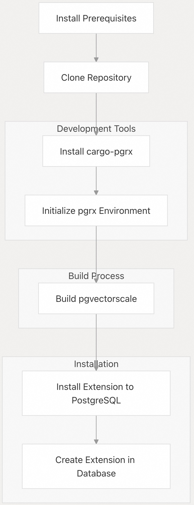
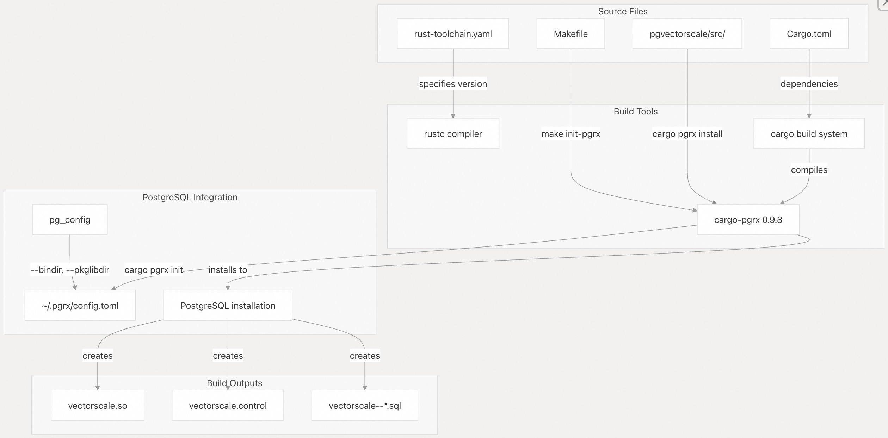

## pgvectorscale 源码学习: 9.1 从源代码构建（Building from Source）  
                                                  
### 作者                                                  
digoal                                                  
                                                  
### 日期                                                  
2025-11-12                                                 
                                                  
### 标签                                                  
pgvectorscale , 向量数据库 , DiskANN , StreamingDiskANN , 源码学习                                                  
                                                  
----                                                  
                                                  
## 背景                                     
本文提供了从源代码（source code）构建和安装 pgvectorscale 的分步说明。涵盖了先决条件（prerequisites）、构建过程（build process）、安装步骤以及常见问题的故障排除（troubleshooting）。  
  
## 先决条件（Prerequisites）  
  
在构建 pgvectorscale 之前，请确保您的系统上安装了以下组件（components）：  
  
| 要求（Requirement） | 版本/详情（Version/Details） | 描述（Description） |  
| :--- | :--- | :--- |  
| PostgreSQL | 13、14、15、16、17 或 18 | pgvectorscale 扩展（extends）的数据库系统（database system） |  
| pgvector | 最新的稳定版本（Latest stable version） | pgvectorscale 增强（enhances）的基础向量扩展（base vector extension） |  
| Rust | 在 `rust-toolchain.yaml` 中指定 | 编写 pgvectorscale 的编程语言（programming language） |  
| cargo-pgrx | 0.9.8 | 用于 PostgreSQL 扩展（extensions）的 PGRX 框架（framework） |  
| LLVM/Clang | 18 | 编译（compilation）时支持即时编译（JIT support）所需 |  
| 系统库（System libraries） | 各种 | 构建依赖项（Build dependencies）和数学库（mathematical libraries） |  
  
### 详细要求（Detailed Requirements）  
  
#### 1\. PostgreSQL  
  
pgvectorscale 支持 PostgreSQL 13 到 18 版本。请安装数据库服务器（database server）、客户端包（client packages）和开发头文件（development headers）：  
  
```bash  
# Debian/Ubuntu example for PostgreSQL 16  
sudo apt-get install postgresql-16 postgresql-server-dev-16  
```  
  
构建系统（build system）通过 `pg_config` 自动检测您的 PostgreSQL 版本。  
  
来源: [`Makefile` 8-13](https://github.com/timescale/pgvectorscale/blob/36271fa5/Makefile#L8-L13) [`.github/actions/install-postgres/action.yml` 1-45](https://github.com/timescale/pgvectorscale/blob/36271fa5/.github/actions/install-postgres/action.yml#L1-L45)  
  
#### 2\. pgvector  
  
pgvectorscale 依赖于 pgvector 扩展（extension）。在构建 pgvectorscale 之前请安装它：  
  
```bash  
-- 或更高版本  
git clone --branch v0.7.0 https://github.com/pgvector/pgvector.git  
cd pgvector  
make  
sudo make install  
```  
  
来源: [`.github/actions/install-pgvector/action.yml` 1-37](https://github.com/timescale/pgvectorscale/blob/36271fa5/.github/actions/install-pgvector/action.yml#L1-L37)  
  
#### 3\. 系统依赖项（System Dependencies）  
  
安装所需的构建工具（build tools）和库（libraries）：  
  
```bash  
# Install LLVM 18  
sudo bash -c "$(wget -O - https://apt.llvm.org/llvm.sh)" -- 18  
  
# Install build dependencies  
sudo apt-get update  
sudo apt-get install -y \
    flex bison lcov systemd-coredump gdb \
    libblas-dev libipc-run-perl libtest-most-perl \
    clang-18 llvm-18 llvm-18-dev llvm-18-runtime llvm-18-tools \
    libopenblas-dev  
```  
  
来源: [`.github/actions/install-packages/action.yml` 1-12](https://github.com/timescale/pgvectorscale/blob/36271fa5/.github/actions/install-packages/action.yml#L1-L12)  
  
#### 4\. Rust 工具链（Rust Toolchain）  
  
该项目使用 `pgvectorscale/rust-toolchain.yaml` 中定义的特定 Rust 版本。使用 `rustup` 安装 Rust：  
  
```bash  
curl --proto '=https' --tlsv1.2 -sSf https://sh.rustup.rs | sh  
```  
  
安装后，当您进入 `pgvectorscale` 目录时，将自动选择正确的 Rust 版本。  
  
来源: [`.github/actions/install-pgrx/action.yml` 34-38](https://github.com/timescale/pgvectorscale/blob/36271fa5/.github/actions/install-pgrx/action.yml#L34-L38)  
  
#### 5\. cargo-pgrx  
  
需要 PGRX 框架（framework）版本 0.9.8。安装步骤将在下面的构建过程（build process）中介绍。  
  
来源: [`Makefile` 11](https://github.com/timescale/pgvectorscale/blob/36271fa5/Makefile#L11-L11) [`.github/actions/install-pgrx/action.yml` 47-51](https://github.com/timescale/pgvectorscale/blob/36271fa5/.github/actions/install-pgrx/action.yml#L47-L51)  
  
## 构建过程概览（Build Process Overview）  
  
   
  
来源: [`DEVELOPMENT.md` 22-67](https://github.com/timescale/pgvectorscale/blob/36271fa5/DEVELOPMENT.md#L22-L67)  
  
## 分步构建说明（Step-by-Step Build Instructions）  
  
### 1\. 克隆仓库（Clone the Repository）  
  
```  
git clone https://github.com/timescale/pgvectorscale && \
cd pgvectorscale/pgvectorscale  
```  
  
来源: [`DEVELOPMENT.md` 23-28](https://github.com/timescale/pgvectorscale/blob/36271fa5/DEVELOPMENT.md#L23-L28)  
  
### 2\. 安装 cargo-pgrx  
  
`cargo-pgrx` 工具对于使用 Rust 构建 PostgreSQL 扩展（extensions）至关重要。安装 0.9.8 版本：  
  
```  
-- 注意匹配当前分支以来的版本, 看toml配置文件  
cargo install cargo-pgrx --version 0.9.8  
```  
  
或者使用 Makefile 目标（target）：  
  
```  
make install-pgrx  
```  
  
**重要提示（Important Notes）**:  
  
  * 每当您更新 Rust 时，必须重新安装 `cargo-pgrx`，因为它需要使用与 pgvectorscale 相同的编译器（compiler）进行构建。  
  * PGRX 版本被固定在 `Makefile` 中，并且必须与扩展的 `Cargo.toml` 依赖项（dependencies）中使用的版本匹配。  
  * 持续集成/持续部署（CI/CD）会根据以下元组（tuple）缓存 `cargo-pgrx` 二进制文件（binaries）：`(architecture, OS, PGRX version, PostgreSQL version, Rust version)`（架构、操作系统、PGRX 版本、PostgreSQL 版本、Rust 版本）。  
  
来源: [`Makefile` 11](https://github.com/timescale/pgvectorscale/blob/36271fa5/Makefile#L11-L11) [`Makefile` 54-56](https://github.com/timescale/pgvectorscale/blob/36271fa5/Makefile#L54-L56) [`.github/actions/install-pgrx/action.yml` 40-51](https://github.com/timescale/pgvectorscale/blob/36271fa5/.github/actions/install-pgrx/action.yml#L40-L51)  
  
### 3\. 初始化 pgrx 环境（Initialize the pgrx Environment）  
  
设置 pgrx 开发环境（development environment），以便与您的 PostgreSQL 安装协同工作：  
  
```  
cargo pgrx init --pg16 pg_config  
```  
  
对于其他 PostgreSQL 版本，请用相应的版本标志替换 `--pg16`（例如，`--pg13`、`--pg17` 等）。  
  
此命令会：  
  
1.  通过 `pg_config` 定位（Locates）您的 PostgreSQL 安装  
2.  在 `$HOME/.pgrx/config.toml` 创建一个配置文件（configuration file）  
3.  设置用于构建扩展的开发环境（development environment）  
  
您可以验证配置：  
  
```  
cat $HOME/.pgrx/config.toml  
```  
  
或者，使用会自动检测您的 PostgreSQL 版本的 Makefile 目标（target）：  
  
```  
make init-pgrx  
```  
  
来源: [`Makefile` 58-62](https://github.com/timescale/pgvectorscale/blob/36271fa5/Makefile#L58-L62) [`.github/actions/install-pgrx/action.yml` 53-59](https://github.com/timescale/pgvectorscale/blob/36271fa5/.github/actions/install-pgrx/action.yml#L53-L59)  
  
### 3\. 初始化 pgrx 环境（Initialize the pgrx Environment）  
  
设置 pgrx 开发环境（development environment），以便与您的 PostgreSQL 安装协同工作：  
  
```  
cargo pgrx init --pg16 pg_config  
```  
  
此命令配置 `cargo-pgrx` 以使用您的 PostgreSQL 安装（通过 `pg_config` 返回的路径）。  
  
来源: [`DEVELOPMENT.md` 38-42](https://github.com/timescale/pgvectorscale/blob/36271fa5/DEVELOPMENT.md#L38-L42) [`Makefile` 58-62](https://github.com/timescale/pgvectorscale/blob/36271fa5/Makefile#L58-L62)  
  
### 4\. 构建并安装 pgvectorscale（Build and Install pgvectorscale）  
  
#### 开发版本构建（Development Build）  
  
对于开发和调试（debugging），构建并安装**不带**优化（optimizations）的版本：  
  
```  
cd pgvectorscale  
cargo pgrx install --features pg16  
```  
  
或者使用 Makefile：  
  
```  
make install-debug  
```  
  
这会创建一个带有用于故障排除（troubleshooting）的符号（symbols）的调试版本（debug build）。  
  
#### 发布版本构建（Release Build）  
  
对于生产环境使用（production use），构建**带有**优化（optimizations）的版本：  
  
```  
cd pgvectorscale  
cargo pgrx install --release --features pg16  
```  
  
或者使用 Makefile：  
  
```  
make install-release  
```  
  
#### 特性标志（Feature Flags）  
  
构建需要将 PostgreSQL 版本指定为特性标志（feature flag）：  
  
  * `--features pg13` for PostgreSQL 13  
  * `--features pg14` for PostgreSQL 14  
  * `--features pg15` for PostgreSQL 15  
  * `--features pg16` for PostgreSQL 16  
  * `--features pg17` for PostgreSQL 17  
  * `--features pg18` for PostgreSQL 18  
  
`Makefile` 会自动检测您的 PostgreSQL 版本并应用正确的特性标志（feature flag）。  
  
#### 提升权限（Elevated Permissions）  
  
如果目标文件夹需要提升权限（elevated permissions）（系统范围的 PostgreSQL 安装常见），请使用 `--sudo` 标志：  
  
```  
cargo pgrx install --sudo --release --features pg16  
```  
  
来源: [`Makefile` 64-71](https://github.com/timescale/pgvectorscale/blob/36271fa5/Makefile#L64-L71) [`.github/actions/install-pgrx/action.yml` 24-28](https://github.com/timescale/pgvectorscale/blob/36271fa5/.github/actions/install-pgrx/action.yml#L24-L28)  
  
## 开发环境架构（Development Environment Architecture）  
  
  
  
**构建过程组件（Build Process Components）**:  
  
| 组件（Component） | 用途（Purpose） | 配置（Configuration） |  
| :--- | :--- | :--- |  
| `rust-toolchain.yaml` | 指定 Rust 版本 | 由 `rustup` 自动选择 |  
| `Cargo.toml` | 定义依赖项（dependencies）和元数据（metadata） | 包含 pgrx 版本 |  
| `cargo-pgrx` | PGRX 框架（framework）命令行接口（CLI） | 版本 0.9.8 |  
| `pg_config` | PostgreSQL 配置工具（configuration tool） | 提供安装路径（installation paths） |  
| `~/.pgrx/config.toml` | PGRX 配置 | 将 PostgreSQL 版本映射到安装位置 |  
  
来源: [`Makefile` 5-22](https://github.com/timescale/pgvectorscale/blob/36271fa5/Makefile#L5-L22) [`.github/actions/install-pgrx/action.yml` 20-59](https://github.com/timescale/pgvectorscale/blob/36271fa5/.github/actions/install-pgrx/action.yml#L20-L59)  
  
## 在数据库中安装（Installing in a Database）  
  
构建并安装扩展文件后，您需要将该扩展加载到您希望使用的每个数据库中：  
  
1.  连接到您的数据库：  
  
```  
psql -d "postgres://<username>@<password>:<port>/<database-name>"  
```  
  
2.  创建扩展：  
  
```sql  
CREATE EXTENSION IF NOT EXISTS vectorscale CASCADE;  
```  
  
`CASCADE` 选项确保任何依赖项（dependencies）（例如 pgvector）也会自动安装。  
  
来源: [`DEVELOPMENT.md` 57-67](https://github.com/timescale/pgvectorscale/blob/36271fa5/DEVELOPMENT.md#L57-L67)  
  
## 验证安装（Verifying the Installation）  
  
构建和安装后，验证扩展文件是否就位：  
  
```  
# Check the shared library  
ls -la $(pg_config --pkglibdir)/vectorscale.so  
  
# Check the control file  
ls -la $(pg_config --sharedir)/extension/vectorscale.control  
  
# Check SQL migration files  
ls -la $(pg_config --sharedir)/extension/vectorscale--*.sql  
```  
  
在测试数据库中加载扩展：  
  
```  
CREATE EXTENSION IF NOT EXISTS vector;  
CREATE EXTENSION IF NOT EXISTS vectorscale CASCADE;  
  
-- Verify extension is loaded  
\dx vectorscale  
```  
  
来源: [`Makefile` 15-16](https://github.com/timescale/pgvectorscale/blob/36271fa5/Makefile#L15-L16)  
  
## 测试您的构建（Testing Your Build）  
  
pgvectorscale 包含全面的测试套件（test suites）来验证您的构建。  
  
### 运行 Rust 测试（Running Rust Tests）  
  
该扩展包含使用 PGRX 的 `#[pg_test]` 框架（framework）的内联测试（inline tests）：  
  
```  
cd pgvectorscale  
cargo pgrx test pg16  
```  
  
此命令会：  
  
1.  启动一个临时（temporary）PostgreSQL 实例（instance）  
2.  安装扩展  
3.  运行所有带有 `#[pg_test]` 标记的 Rust 测试  
4.  清理临时实例  
  
### 运行 Python 测试（Running Python Tests）  
  
该项目包含基于 Python 的集成测试（integration tests）和并发测试（concurrency tests）：  
  
```  
# Setup Python test environment  
make test-python-setup  
  
# Run all Python tests  
make test-python  
  
# Run specific test categories  
make test-concurrency    # Multi-process concurrency tests  
make test-integration    # Basic integration tests  
```  
  
对于使用自定义 PostgreSQL 端口（例如 PGRX 开发实例）的开发：  
  
```  
# Start PGRX PostgreSQL instance  
cd pgvectorscale && cargo pgrx start pg17  
  
# Run tests against that instance  
DB_PORT=28817 ./scripts/run-python-tests.sh  
```  
  
### 测试要求（Test Requirements）  
  
Python 测试要求：  
  
  * PostgreSQL 正在运行且可访问  
  * `vector` 和 `vectorscale` 两个扩展都已安装  
  * 来自 `tests/requirements.txt` 的 Python 依赖项（dependencies）  
  
测试运行脚本（test runner script）（`scripts/run-python-tests.sh`）会自动：  
  
1.  检查 PostgreSQL 连接性（connectivity）  
2.  安装 Python 依赖项（dependencies）  
3.  创建必要的扩展（extensions）  
4.  运行测试套件（test suite）  
  
来源: [`TESTING.md` 1-46](https://github.com/timescale/pgvectorscale/blob/36271fa5/TESTING.md#L1-L46) [`scripts/run-python-tests.sh` 1-113](https://github.com/timescale/pgvectorscale/blob/36271fa5/scripts/run-python-tests.sh#L1-L113) [`Makefile` 86-117](https://github.com/timescale/pgvectorscale/blob/36271fa5/Makefile#L86-L117)  
  
## 构建分发包（Building Distribution Packages）  
  
### 创建 PGRX 包（Creating PGRX Package）  
  
对于分发（distribution），创建一个可重定位（relocatable）的包：  
  
```  
cd pgvectorscale  
cargo pgrx package --features pg16  
```  
  
或者使用 Makefile：  
  
```  
make package  
```  
  
这会创建一个适合打包的目录结构（directory structure），包括：  
  
  * 编译后的共享库（Compiled shared library）  
  * SQL 迁移脚本（migration scripts）  
  * 控制文件（Control files）  
  * 文档（Documentation）  
  
输出可以打包成系统特定的格式（例如，`.deb`、`.rpm`）或作为 `tarball`（压缩包）分发。  
  
来源: [`Makefile` 74-76](https://github.com/timescale/pgvectorscale/blob/36271fa5/Makefile#L74-L76)  
  
## 故障排除（Troubleshooting）  
  
### 问题：`cargo-pgrx` 安装失败（Installation Fails）  
  
**症状（Symptom）**: `cargo install cargo-pgrx` 因编译错误（compilation errors）而失败。  
  
**解决方案（Solution）**: 确保您拥有正确的 Rust 版本和所有系统依赖项（system dependencies）：  
  
```  
# Verify Rust version  
rustup show active-toolchain  
  
# Reinstall with locked dependencies  
cargo install cargo-pgrx --version 0.9.8 --locked  
  
# Ensure LLVM is available  
llvm-config-18 --version  
```  
  
来源: [`.github/actions/install-pgrx/action.yml` 47-51](https://github.com/timescale/pgvectorscale/blob/36271fa5/.github/actions/install-pgrx/action.yml#L47-L51)  
  
### 问题：MacOS 缺少头文件（Missing Header Files）  
  
**症状（Symptom）**: 在 MacOS 上出现 "fatal error: 'stdio.h' file not found"（致命错误：找不到文件 'stdio.h'）。  
  
**解决方案（Solution）**: 安装 Xcode 命令行工具（command line tools）并设置 `SDKROOT`：  
  
```  
# Install command line tools  
xcode-select --install  
  
# Set SDK root  
export SDKROOT=$(xcrun --sdk macosx --show-sdk-path)  
  
# Verify  
env | grep SDKROOT  
```  
  
### 问题：安装期间权限被拒绝（Permission Denied）  
  
**症状（Symptom）**: 运行 `cargo pgrx install` 时出现 "Permission denied"（权限被拒绝）错误。  
  
**解决方案（Solution）**: 使用 `--sudo` 标志：  
  
```  
cargo pgrx install --sudo --release --features pg16  
```  
  
或者通过修改 PostgreSQL 的安装路径（installation paths）来安装到用户可写入的位置。  
  
### 问题：特性标志不匹配（Feature Flag Mismatch）  
  
**症状（Symptom）**: 构建失败，提示 "no PostgreSQL version feature flag specified"（未指定 PostgreSQL 版本特性标志）。  
  
**解决方案（Solution）**: 始终指定 PostgreSQL 版本特性：  
  
```  
# For PostgreSQL 16  
cargo pgrx install --features pg16  
  
# Or use Makefile which auto-detects  
make install-release  
```  
  
来源: [`Makefile` 51-52](https://github.com/timescale/pgvectorscale/blob/36271fa5/Makefile#L51-L52) [`.github/actions/install-pgrx/action.yml` 24-28](https://github.com/timescale/pgvectorscale/blob/36271fa5/.github/actions/install-pgrx/action.yml#L24-L28)  
  
### 问题：找不到 PGRX 配置（Configuration Not Found）  
  
**症状（Symptom）**: 提示 "pgrx configuration not found"（找不到 pgrx 配置）或 "no PostgreSQL installation configured"（未配置 PostgreSQL 安装）。  
  
**解决方案（Solution）**: 在构建之前初始化 PGRX：  
  
```  
# Initialize for your PostgreSQL version  
cargo pgrx init --pg16 pg_config  
  
# Verify configuration  
cat ~/.pgrx/config.toml  
```  
  
来源: [`.github/actions/install-pgrx/action.yml` 53-59](https://github.com/timescale/pgvectorscale/blob/36271fa5/.github/actions/install-pgrx/action.yml#L53-L59)  
  
### 问题：扩展无法加载（Extension Not Loading）  
  
**症状（Symptom）**: `CREATE EXTENSION vectorscale` 失败，提示 "could not open extension control file"（无法打开扩展控制文件）。  
  
**解决方案（Solution）**: 验证安装路径：  
  
```  
# Check if files are installed  
ls -la $(pg_config --pkglibdir)/vectorscale.so  
ls -la $(pg_config --sharedir)/extension/vectorscale*  
  
# Reinstall if missing  
cargo pgrx install --sudo --release --features pg16  
```  
  
### 问题：Python 测试连接失败（Tests Fail to Connect）  
  
**症状（Symptom）**: Python 测试运行器报告 "PostgreSQL is not running or not accessible"（PostgreSQL 未运行或无法访问）。  
  
**解决方案（Solution）**: 确保 PostgreSQL 正在运行且可访问：  
  
```  
# Check if PostgreSQL is running  
pg_isready -h localhost -p 5432  
  
# For PGRX development instance  
cd pgvectorscale && cargo pgrx start pg17  
DB_PORT=28817 ./scripts/run-python-tests.sh  
```  
  
来源: [`scripts/run-python-tests.sh` 19-32](https://github.com/timescale/pgvectorscale/blob/36271fa5/scripts/run-python-tests.sh#L19-L32)  
  
### 问题：缺少测试依赖项（Test Dependencies Missing）  
  
**症状（Symptom）**: Python 测试因导入错误（import errors）而失败。  
  
**解决方案（Solution）**: 安装测试依赖项（test dependencies）：  
  
```  
# Create virtual environment  
python3 -m venv .venv  
.venv/bin/pip install -r tests/requirements.txt  
  
# Or use Makefile  
make test-python-setup  
```  
  
来源: [`scripts/requirements.txt` 1-5](https://github.com/timescale/pgvectorscale/blob/36271fa5/scripts/requirements.txt#L1-L5) [`Makefile` 90-93](https://github.com/timescale/pgvectorscale/blob/36271fa5/Makefile#L90-L93)  
  
## 为不同 PostgreSQL 版本构建（Building for Different PostgreSQL Versions）  
  
### 版本检测（Version Detection）  
  
`Makefile` 会自动检测您的 PostgreSQL 版本：  
  
```  
make build  
```  
  
这会从 `pg_config --version` 中提取主版本号（major version），并应用相应的特性标志（feature flag）。  
  
### 显式版本指定（Explicit Version Specification）  
  
当安装了多个 PostgreSQL 版本时，要为特定版本构建：  
  
```  
# Specify pg_config path  
PG_CONFIG=/usr/lib/postgresql/17/bin/pg_config make build  
  
# Or set the version explicitly  
make build PG_VERSION=17  
```  
  
### 构建自定义（Build Customization）  
  
使用额外的 Rust 参数（arguments）自定义构建：  
  
```  
# Enable additional features  
EXTRA_RUST_ARGS="--features custom_feature" make build  
  
# Build in verbose mode  
EXTRA_RUST_ARGS="-vv" make build  
```  
  
### 多版本开发（Multi-Version Development）  
  
可以设置 PGRX 配置文件（`~/.pgrx/config.toml`）以同时支持多个 PostgreSQL 版本：  
  
```  
# Initialize for PostgreSQL 16  
cargo pgrx init --pg16=/usr/lib/postgresql/16/bin/pg_config  
  
# Add PostgreSQL 17  
cargo pgrx init --pg17=/usr/lib/postgresql/17/bin/pg_config  
```  
  
然后针对特定版本进行测试：  
  
```  
cargo pgrx test pg16  
cargo pgrx test pg17  
```  
  
来源: [`Makefile` 8-20](https://github.com/timescale/pgvectorscale/blob/36271fa5/Makefile#L8-L20) [`Makefile` 51-52](https://github.com/timescale/pgvectorscale/blob/36271fa5/Makefile#L51-L52) [`.github/actions/install-pgrx/action.yml` 24-28](https://github.com/timescale/pgvectorscale/blob/36271fa5/.github/actions/install-pgrx/action.yml#L24-L28)  
  
## 持续集成/持续部署（CI/CD）集成参考（Integration Reference）  
  
该项目的持续集成/持续部署（CI/CD）流水线（pipeline）展示了跨多个 PostgreSQL 版本和架构的完整构建设置。请查阅这些工作流（workflows）以获取高级构建配置：  
  
**构建矩阵组件（Build Matrix Components）**:  
  
| 工作流（Workflow） | 用途（Purpose） | 矩阵（Matrix） |  
| :--- | :--- | :--- |  
| `install-postgres` | 从源代码构建 PostgreSQL | 版本 13-18 |  
| `install-pgvector` | pgvector 依赖项（dependency） | 最新稳定版本 |  
| `install-pgrx` | PGRX 框架（framework）设置 | 版本 0.9.8 |  
| `install-packages` | 系统依赖项（System dependencies） | LLVM 18，构建工具（build tools） |  
  
**关键构建特性（Key Build Characteristics）**:  
  
  * **缓存策略（Caching Strategy）**: 根据版本元组（version tuples）缓存 PostgreSQL 构建、`cargo-pgrx` 二进制文件和 `grcov` 安装  
  * **PostgreSQL 构建标志（Build Flags）**: `--enable-debug --enable-cassert --with-llvm LLVM_CONFIG=llvm-config-18`  
  * **支持的架构（Supported Architectures）**: amd64 (x86\_64) 和 arm64 (aarch64)  
  * **测试覆盖率（Test Coverage）**: 包含 Rust 单元测试（unit tests）和 Python 集成/并发测试（integration/concurrency tests）  
  
有关完整的 CI/CD 流水线（pipeline）的详细信息，请参阅第 9.3 章。  
  
来源: [`.github/actions/install-postgres/action.yml` 1-45](https://github.com/timescale/pgvectorscale/blob/36271fa5/.github/actions/install-postgres/action.yml#L1-L45) [`.github/actions/install-pgrx/action.yml` 1-73](https://github.com/timescale/pgvectorscale/blob/36271fa5/.github/actions/install-pgrx/action.yml#L1-L73) [`.github/actions/install-packages/action.yml` 1-12](https://github.com/timescale/pgvectorscale/blob/36271fa5/.github/actions/install-packages/action.yml#L1-L12) [`.github/actions/install-pgvector/action.yml` 1-37](https://github.com/timescale/pgvectorscale/blob/36271fa5/.github/actions/install-pgvector/action.yml#L1-L37)  
  
## 许可（Licensing）  
  
pgvectorscale 根据 PostgreSQL 许可（License）获得许可。当从源代码构建时，您接受此许可的条款（terms）。  
  
来源: [`LICENSE` 1-17](https://github.com/timescale/pgvectorscale/blob/36271fa5/LICENSE#L1-L17) [`NOTICE` 1-16](https://github.com/timescale/pgvectorscale/blob/36271fa5/NOTICE#L1-L16)  
  
    
#### [PolarDB 学习图谱](https://www.aliyun.com/database/openpolardb/activity "8642f60e04ed0c814bf9cb9677976bd4")
  
  
#### [PostgreSQL 解决方案集合](../201706/20170601_02.md "40cff096e9ed7122c512b35d8561d9c8")
  
  
#### [德哥 / digoal's Github - 公益是一辈子的事.](https://github.com/digoal/blog/blob/master/README.md "22709685feb7cab07d30f30387f0a9ae")
  
  
#### [About 德哥](https://github.com/digoal/blog/blob/master/me/readme.md "a37735981e7704886ffd590565582dd0")
  
  

  
