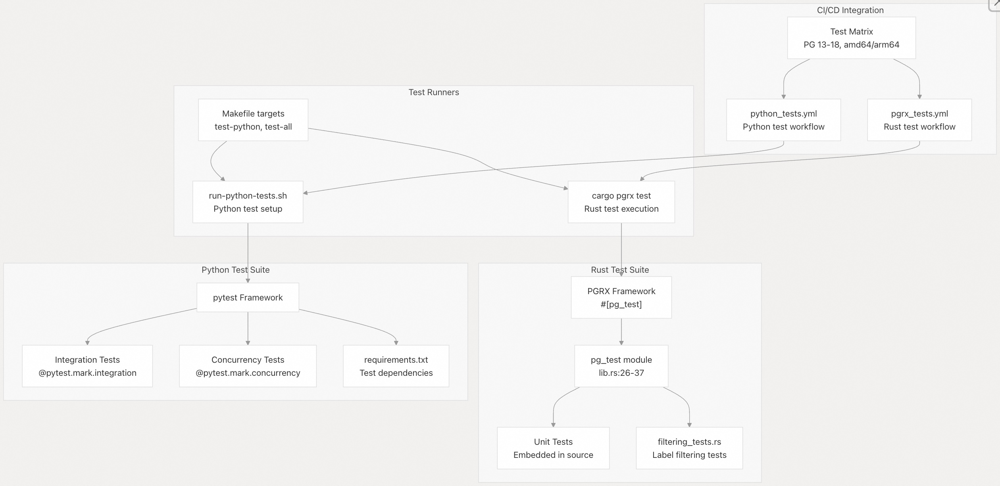
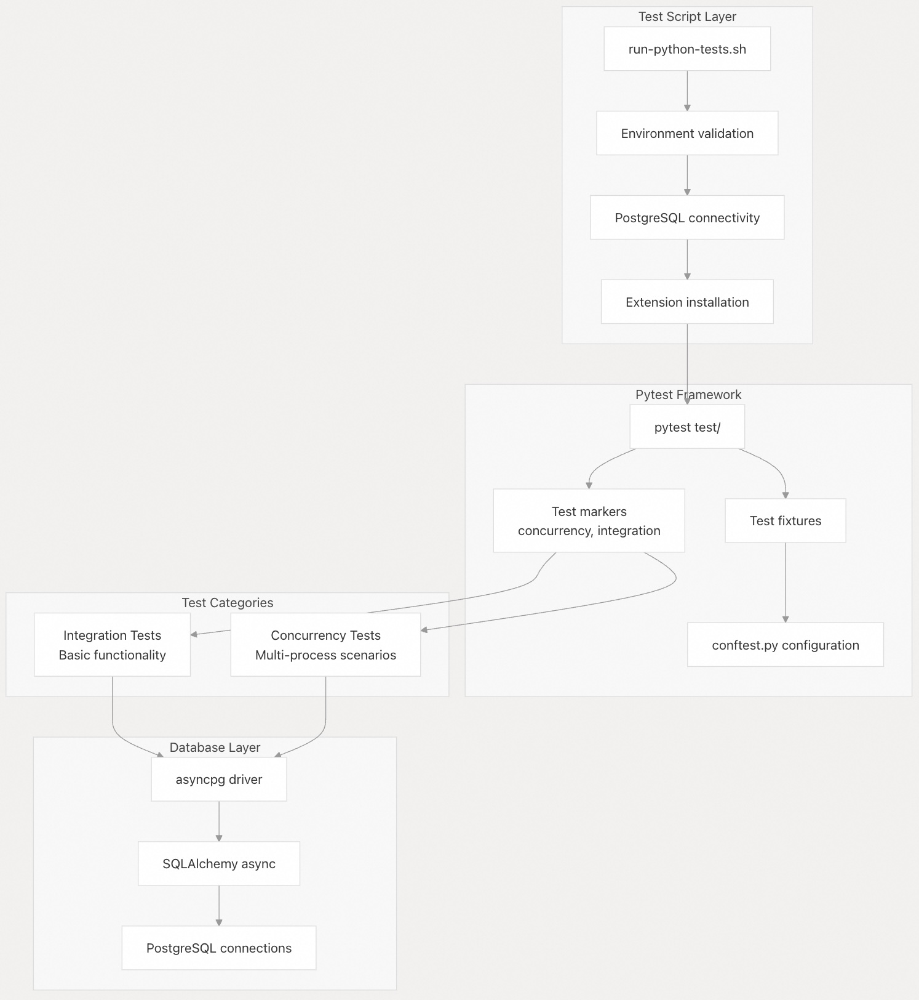
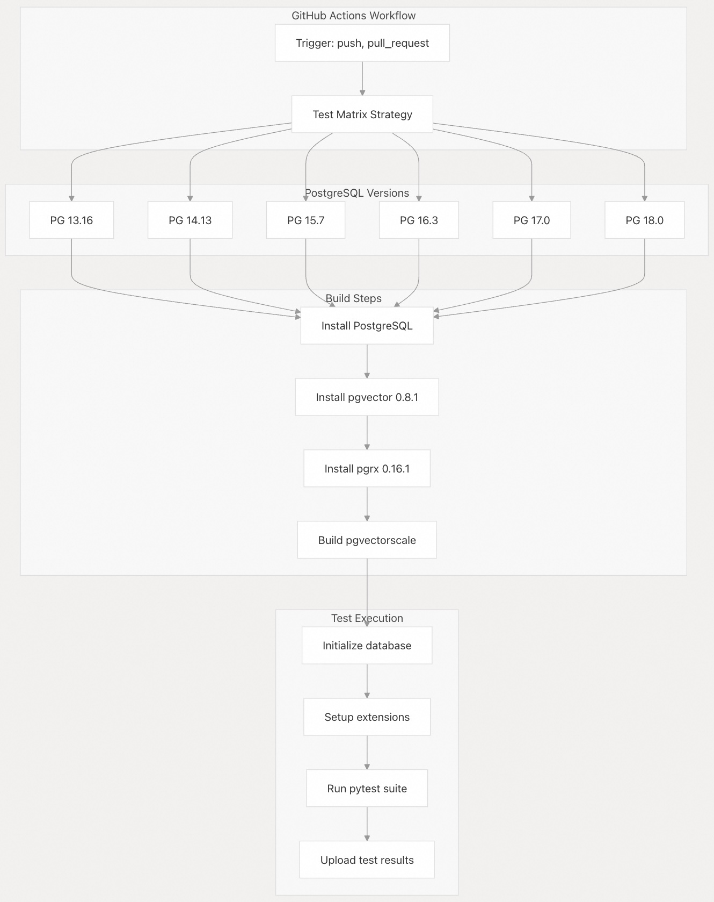
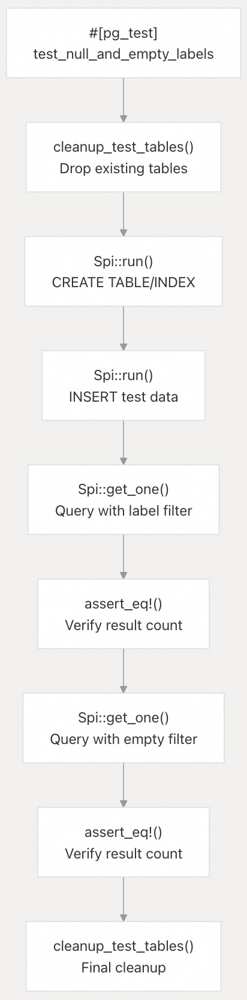

## pgvectorscale 源码学习: 9.2 测试框架 (Testing Framework)  
                                                    
### 作者                                                    
digoal                                                    
                                                    
### 日期                                                    
2025-11-12                                                   
                                                    
### 标签                                                    
pgvectorscale , 向量数据库 , DiskANN , StreamingDiskANN , 源码学习                                                    
                                                    
----                                                    
                                                    
## 背景                                       
本文介绍了 `pgvectorscale` 的测试基础设施，包括使用 **PGRX** 的 `#[pg_test]` 框架 (Framework) 的 **Rust 测试套件** (Rust test suite)、使用 **pytest** 的 **Python 集成测试套件** (Python integration test suite)，以及用于在 **PostgreSQL 版本** (PostgreSQL versions) 和**架构** (architectures) 之间执行测试的 **CI/CD 工作流** (CI/CD workflows)。  
  
## 测试架构概览 (Test Architecture Overview)  
  
`pgvectorscale` 采用**两层测试策略** (two-tier testing strategy)：用于**单元测试** (unit testing) 和**功能测试** (functional testing) 的**进程内 Rust 测试** (in-process Rust tests)，以及用于**集成测试** (integration testing) 和**并发测试** (concurrency testing) 的 **Python 测试** (Python tests)。这种架构能够实现全面的覆盖范围，同时保持不同测试关注点之间的清晰分离。  
  
### 测试组织结构 (Test Organization)  
  
  
  
**来源 (Sources):**  
[`pgvectorscale/src/lib.rs` 23-37](https://github.com/timescale/pgvectorscale/blob/36271fa5/pgvectorscale/src/lib.rs#L23-L37)  
[`TESTING.md` 1-46](https://github.com/timescale/pgvectorscale/blob/36271fa5/TESTING.md#L1-L46)  
[`Makefile` 86-117](https://github.com/timescale/pgvectorscale/blob/36271fa5/Makefile#L86-L117)  
[`.github/workflows/python_tests.yml` 1-126](https://github.com/timescale/pgvectorscale/blob/36271fa5/.github/workflows/python_tests.yml#L1-L126)  
  
## Rust 测试框架 (Rust Test Framework)  
  
### PGRX 测试基础设施 (PGRX Test Infrastructure)  
  
**Rust 测试套件** (Rust test suite) 使用 **PGRX** 的 `#[pg_test]` **属性宏** (attribute macro) 在运行中的 **PostgreSQL 实例** (PostgreSQL instance) 中执行测试。该框架会自动处理**数据库初始化** (database initialization)、**扩展加载** (extension loading) 和**清理** (cleanup)。  
  
#### 测试模块配置 (Test Module Configuration)  
  
该扩展在 [`pgvectorscale/src/lib.rs` 26-37](https://github.com/timescale/pgvectorscale/blob/36271fa5/pgvectorscale/src/lib.rs#L26-L37) 中定义了一个 `pg_test` 模块，用于配置测试环境：  
  
```rust  
#[cfg(test)]  
pub mod pg_test {  
    pub fn setup(_options: Vec<&str>) {  
        // perform one-off initialization when the pg_test framework starts  
    }  
  
    pub fn postgresql_conf_options() -> Vec<&'static str> {  
        // return any postgresql.conf settings that are required for your tests  
        vec![]  
    }  
}  
```  
  
`setup` 函数在任何测试运行之前执行一次，而 `postgresql_conf_options` 允许为测试实例**自定义 PostgreSQL 配置参数** (PostgreSQL configuration parameters)。  
  
**来源 (Sources):**  
[`pgvectorscale/src/lib.rs` 23-37](https://github.com/timescale/pgvectorscale/blob/36271fa5/pgvectorscale/src/lib.rs#L23-L37)  
  
### 测试组织模式 (Test Organization Pattern)  
  
测试遵循 **Rust 约定** (Rust conventions)，与其测试的代码内联组织。[`pgvectorscale/src/access_method/labels/filtering_tests.rs` 1-1027](https://github.com/timescale/pgvectorscale/blob/36271fa5/pgvectorscale/src/access_method/labels/filtering_tests.rs#L1-L1027) 中的**标签过滤测试** (label filtering tests) 展示了典型的结构：  
  
```rust  
#[cfg(any(test, feature = "pg_test"))]  
#[pgrx::pg_schema]  
pub mod tests {  
    use pgrx::prelude::*;  
    use pgrx::spi;  
  
    #[pg_test]  
    pub unsafe fn test_null_and_empty_labels() -> spi::Result<()> {  
        // Test implementation using SPI  
    }  
}  
```  
  
测试使用 `#[pg_test]` **属性** (attribute) 并返回 `spi::Result<()>`。由于测试通过 **PGRX** 与 **PostgreSQL 的 C API** (PostgreSQL's C API) 交互，因此需要使用 `unsafe` 关键字。  
  
**来源 (Sources):**  
[`pgvectorscale/src/access_method/labels/filtering_tests.rs` 1-27](https://github.com/timescale/pgvectorscale/blob/36271fa5/pgvectorscale/src/access_method/labels/filtering_tests.rs#L1-L27)  
  
### 测试执行流程 (Test Execution Flow)  
  
  
  
**来源 (Sources):**  
[`TESTING.md` 8-16](https://github.com/timescale/pgvectorscale/blob/36271fa5/TESTING.md#L8-L16)  
  
### 常见测试模式 (Common Test Patterns)  
  
过滤测试展示了几种常见模式 (Pattern)：  
  
| 模式 (Pattern) | 描述 (Description) | 示例位置 (Example Location) |  
| :--- | :--- | :--- |  
| **清理辅助函数** (Cleanup Helper) | 用于在测试前删除测试表的函数 | [`filtering_tests.rs` 8-20](https://github.com/timescale/pgvectorscale/blob/36271fa5/filtering_tests.rs#L8-L20) |  
| **SPI 执行** (SPI Execution) | 使用 `Spi::run()` 进行 **DDL/DML 操作** (DDL/DML operations) | [`filtering_tests.rs` 28-44](https://github.com/timescale/pgvectorscale/blob/36271fa5/filtering_tests.rs#L28-L44) |  
| **查询结果** (Query Results) | 使用 `Spi::get_one()` 检索**标量结果** (scalar results) | [`filtering_tests.rs` 47-57](https://github.com/timescale/pgvectorscale/blob/36271fa5/filtering_tests.rs#L47-L57) |  
| **断言** (Assertions) | 标准 Rust `assert_eq!` 和 `assert!` **宏** (macros) | [`filtering_tests.rs` 57](https://github.com/timescale/pgvectorscale/blob/36271fa5/filtering_tests.rs#L57-L57) |  
| **版本守卫** (Version Guards) | 针对 **PG 版本特定功能** (PG version-specific features) 的**条件编译** (Conditional compilation) | [`filtering_tests.rs` 413-423](https://github.com/timescale/pgvectorscale/blob/36271fa5/filtering_tests.rs#L413-L423) |  
  
**来源 (Sources):**  
[`pgvectorscale/src/access_method/labels/filtering_tests.rs` 8-510](https://github.com/timescale/pgvectorscale/blob/36271fa5/pgvectorscale/src/access_method/labels/filtering_tests.rs#L8-L510)  
  
### 运行 Rust 测试 (Running Rust Tests)  
  
可以使用特定的 **PostgreSQL 版本** (PostgreSQL versions) 执行测试：  
  
```bash  
# Run all tests for PostgreSQL 17  
cd pgvectorscale && cargo pgrx test pg17  
  
# Run specific test by name  
cd pgvectorscale && cargo pgrx test pg17 test_null_and_empty_labels  
  
# Run tests matching a pattern  
cd pgvectorscale && cargo pgrx test pg17 test_labeled  
```  
  
`cargo pgrx test` 命令会自动初始化一个测试 **PostgreSQL 实例** (PostgreSQL instance)，编译并安装**扩展** (extension)，运行测试，并在事后进行**清理** (cleanup)。  
  
**来源 (Sources):**  
[`TESTING.md` 8-16](https://github.com/timescale/pgvectorscale/blob/36271fa5/TESTING.md#L8-L16)  
  
## Python 测试框架 (Python Test Framework)  
  
### 架构与目的 (Architecture and Purpose)  
  
  
  
**Python 测试套件** (Python test suite) 通过提供**集成测试** (integration testing) 和**多进程并发测试** (multi-process concurrency testing) 能力来补充 Rust 测试。这种架构能够测试难以在**进程内测试** (in-process tests) 中重现的场景，例如来自**多个数据库连接** (multiple database connections) 的**并发索引修改** (concurrent index modifications)。  
  
**来源 (Sources):**  
[`scripts/run-python-tests.sh` 1-113](https://github.com/timescale/pgvectorscale/blob/36271fa5/scripts/run-python-tests.sh#L1-L113)  
[`TESTING.md` 18-34](https://github.com/timescale/pgvectorscale/blob/36271fa5/TESTING.md#L18-L34)  
[`.github/workflows/python_tests.yml` 111-116](https://github.com/timescale/pgvectorscale/blob/36271fa5/.github/workflows/python_tests.yml#L111-L116)  
  
### 测试依赖项 (Test Dependencies)  
  
**Python 测试套件** (Python test suite) 需要 [`tests/requirements.txt`](https://github.com/timescale/pgvectorscale/blob/36271fa5/tests/requirements.txt) 中定义的特定包 (Package)。关键依赖项如下：  
  
| 包 (Package) | 目的 (Purpose) |  
| :--- | :--- |  
| `sqlalchemy>=2.0.0` | 异步 **ORM** 和**查询构建** (query building) |  
| `asyncpg>=0.28.0` | **PostgreSQL 异步驱动** (PostgreSQL async driver) |  
| `pgvector>=0.2.0` | **pgvector 类型** (pgvector types) 的 Python 客户端 |  
| `numpy>=1.24.0` | **向量数据** (vector data) 的**数组操作** (Array operations) |  
| `greenlet>=3.0.0` | **Async/await 兼容层** (Async/await compatibility layer) |  
  
**来源 (Sources):**  
[`scripts/requirements.txt` 1-5](https://github.com/timescale/pgvectorscale/blob/36271fa5/scripts/requirements.txt#L1-L5)  
  
### 测试标记 (Test Markers)  
  
**Python 测试套件** (Python test suite) 使用 **pytest 标记** (pytest markers) 对测试进行分类。两个主要的标记 (Marker) 在测试文件中定义：  
  
  * `@pytest.mark.integration`：基本**集成测试** (integration tests)，用于针对**实时 PostgreSQL 实例** (live PostgreSQL instance) 验证扩展功能 (Extension functionality)。  
  * `@pytest.mark.concurrency`：**多进程并发测试** (Multi-process concurrency tests)，用于验证**线程安全操作** (thread-safe operations) 和**隔离** (isolation)。  
  
可以使用这些标记**选择性地运行测试** (run selectively)：  
  
```bash  
# Run only concurrency tests  
pytest tests/ -m concurrency -v  
  
# Run only integration tests  
pytest tests/ -m integration -v  
```  
  
**来源 (Sources):**  
[`TESTING.md` 35-38](https://github.com/timescale/pgvectorscale/blob/36271fa5/TESTING.md#L35-L38)  
[`Makefile` 101-107](https://github.com/timescale/pgvectorscale/blob/36271fa5/Makefile#L101-L107)  
  
### 测试环境设置 (Test Environment Setup)  
  
[`scripts/run-python-tests.sh` 1-113](https://github.com/timescale/pgvectorscale/blob/36271fa5/scripts/run-python-tests.sh#L1-L113) 脚本处理完整的**测试环境设置** (test environment setup)：  
  
1.  使用 `pg_isready` 进行 **PostgreSQL 连接性检查** (PostgreSQL connectivity check) [`run-python-tests.sh` 19-32](https://github.com/timescale/pgvectorscale/blob/36271fa5/run-python-tests.sh#L19-L32)  
2.  支持**虚拟环境** (virtual environments) 的 **Python 依赖项安装** (Python dependency installation) [`run-python-tests.sh` 41-66](https://github.com/timescale/pgvectorscale/blob/36271fa5/run-python-tests.sh#L41-L66)  
3.  使用 `asyncpg` 进行**扩展安装验证** (Extension installation verification) [`run-python-tests.sh` 68-98](https://github.com/timescale/pgvectorscale/blob/36271fa5/run-python-tests.sh#L68-L98)  
4.  使用适当的**环境变量** (environment variables) 进行**测试执行** (Test execution) [`run-python-tests.sh` 100-111](https://github.com/timescale/pgvectorscale/blob/36271fa5/run-python-tests.sh#L100-L111)  
  
该脚本支持通过**环境变量** (environment variables) 进行自定义：  
  
| 变量 (Variable) | 默认值 (Default) | 目的 (Purpose) |  
| :--- | :--- | :--- |  
| `DB_HOST` | `localhost` | **PostgreSQL 服务器主机名** (PostgreSQL server hostname) |  
| `DB_PORT` | `5432` | **PostgreSQL 服务器端口** (PostgreSQL server port) |  
| `DB_USER` | `$USER` | **用于连接的数据库用户** (Database user for connections) |  
| `DB_NAME` | `postgres` | **目标数据库名** (Target database name) |  
| `PYTEST_ARGS` | `-v` | **额外的 pytest 参数** (Additional pytest arguments) |  
  
**来源 (Sources):**  
[`scripts/run-python-tests.sh` 4-9](https://github.com/timescale/pgvectorscale/blob/36271fa5/scripts/run-python-tests.sh#L4-L9)  
  
### 运行 Python 测试 (Running Python Tests)  
  
有多种方法可用于运行 **Python 测试** (Python tests)：  
  
```bash  
# Using Makefile targets (recommended)  
make test-python-setup  # One-time setup  
make test-python        # Run all Python tests  
make test-concurrency   # Run only concurrency tests  
make test-integration   # Run only integration tests  
  
# Direct script execution  
./scripts/run-python-tests.sh  
  
# For PGRX development (custom port)  
DB_PORT=28817 ./scripts/run-python-tests.sh  
  
# Direct pytest invocation  
export DATABASE_URL="postgresql+asyncpg://user@localhost/dbname"  
pytest tests/ -v  
```  
  
**来源 (Sources):**  
[`Makefile` 86-116](https://github.com/timescale/pgvectorscale/blob/36271fa5/Makefile#L86-L116)  
[`TESTING.md` 20-33](https://github.com/timescale/pgvectorscale/blob/36271fa5/TESTING.md#L20-L33)  
[`scripts/run-python-tests.sh` 1-113](https://github.com/timescale/pgvectorscale/blob/36271fa5/scripts/run-python-tests.sh#L1-L113)  
  
## 测试执行环境 (Test Execution Environments)  
  
### 本地开发 (Local Development)  
  
对于**本地开发** (Local development)，开发人员可以针对**系统 PostgreSQL 安装** (system PostgreSQL installation) 或 **PGRX 管理的测试实例** (PGRX-managed test instance) 运行测试：  
  
```bash  
# Using system PostgreSQL  
cd pgvectorscale && cargo pgrx test pg17  
  
# For Python tests with PGRX instance  
cd pgvectorscale && cargo pgrx start pg17  
cargo pgrx install --features pg17  
DB_PORT=28817 ./scripts/run-python-tests.sh  
```  
  
**来源 (Sources):**  
[`TESTING.md` 40-46](https://github.com/timescale/pgvectorscale/blob/36271fa5/TESTING.md#L40-L46)  
  
### CI/CD 测试矩阵 (CI/CD Test Matrix)  
  
  
  
[`.github/workflows/python_tests.yml` 1-126](https://github.com/timescale/pgvectorscale/blob/36271fa5/.github/workflows/python_tests.yml#L1-L126) 中的 **Python 测试工作流** (Python test workflow) 定义了一个**矩阵策略** (matrix strategy)，该策略在 `ubuntu-22.04` **运行器** (runners) 上跨六个 **PostgreSQL 主要版本** (PostgreSQL major versions) (13-18) 进行测试。每个作业 (Job) 执行以下步骤：  
  
1.  从**仓库** (repository) **检出代码** (Checkout code) [`python_tests.yml` 37-38](https://github.com/timescale/pgvectorscale/blob/36271fa5/python_tests.yml#L37-L38)  
2.  从**源代码安装** (Install from source) 特定版本的 **PostgreSQL** [`python_tests.yml` 56-61](https://github.com/timescale/pgvectorscale/blob/36271fa5/python_tests.yml#L56-L61)  
3.  安装 `pgvector` **0.8.1 作为依赖项** (dependency) [`python_tests.yml` 63-67](https://github.com/timescale/pgvectorscale/blob/36271fa5/python_tests.yml#L63-L67)  
4.  安装 `pgrx` **0.16.1 用于构建扩展** (building the extension) [`python_tests.yml` 69-73](https://github.com/timescale/pgvectorscale/blob/36271fa5/python_tests.yml#L69-L73)  
5.  **构建并安装** `pgvectorscale` (Build and install pgvectorscale)，并带有**版本特定的功能** (version-specific features) [`python_tests.yml` 75-85](https://github.com/timescale/pgvectorscale/blob/36271fa5/python_tests.yml#L75-L85)  
6.  使用 `trust` **认证初始化** (Initialize) **PostgreSQL** [`python_tests.yml` 91-102](https://github.com/timescale/pgvectorscale/blob/36271fa5/python_tests.yml#L91-L102)  
7.  在**测试数据库** (test database) 中**设置扩展** (Setup extensions) [`python_tests.yml` 104-109](https://github.com/timescale/pgvectorscale/blob/36271fa5/python_tests.yml#L104-L109)  
8.  使用适当的 `DATABASE_URL` **运行 pytest** (Run pytest) [`python_tests.yml` 111-116](https://github.com/timescale/pgvectorscale/blob/36271fa5/python_tests.yml#L111-L116)  
9.  **上传测试结果** (Upload test results) 作为**工件** (artifacts)，保留 7 天 [`python_tests.yml` 118-126](https://github.com/timescale/pgvectorscale/blob/36271fa5/python_tests.yml#L118-L126)  
  
**来源 (Sources):**  
[`.github/workflows/python_tests.yml` 1-126](https://github.com/timescale/pgvectorscale/blob/36271fa5/.github/workflows/python_tests.yml#L1-L126)  
  
### 测试矩阵配置 (Test Matrix Configuration)  
  
**CI 流水线** (CI pipeline) 使用**矩阵配置** (matrix configuration) 来确保跨 **PostgreSQL 版本** (PostgreSQL versions) 的兼容性：  
  
| PostgreSQL 版本 (PostgreSQL Version) | 次要版本 (Minor Version) | pgvector 版本 (pgvector Version) | pgrx 版本 (pgrx Version) |  
| :--- | :--- | :--- | :--- |  
| 13 | 16 | 0.8.1 | 0.16.1 |  
| 14 | 13 | 0.8.1 | 0.16.1 |  
| 15 | 7 | 0.8.1 | 0.16.1 |  
| 16 | 3 | 0.8.1 | 0.16.1 |  
| 17 | 0 | 0.8.1 | 0.16.1 |  
| 18 | 0 | 0.8.1 | 0.16.1 |  
  
**来源 (Sources):**  
[`.github/workflows/python_tests.yml` 10-27](https://github.com/timescale/pgvectorscale/blob/36271fa5/.github/workflows/python_tests.yml#L10-L27)  
  
## Makefile 测试目标 (Makefile Test Targets)  
  
[`Makefile` 1-119](https://github.com/timescale/pgvectorscale/blob/36271fa5/Makefile#L1-L119) 提供了方便的**测试执行目标** (test execution targets)：  
  
| 目标 (Target) | 目的 (Purpose) | 命令 (Command) |  
| :--- | :--- | :--- |  
| `test-python-setup` | **创建虚拟环境** (Create virtual environment) 并**安装依赖项** (install dependencies) | 创建 `.venv` 目录 [`Makefile` 90-93](https://github.com/timescale/pgvectorscale/blob/36271fa5/Makefile#L90-L93) |  
| `test-python` | **运行所有 Python 测试** (Run all Python tests) | 调用 `run-python-tests.sh` [`Makefile` 96-98](https://github.com/timescale/pgvectorscale/blob/36271fa5/Makefile#L96-L98) |  
| `test-concurrency` | **仅运行并发测试** (Run concurrency tests only) | 向 `pytest` 传递 `-m concurrency` [`Makefile` 101-103](https://github.com/timescale/pgvectorscale/blob/36271fa5/Makefile#L101-L103) |  
| `test-integration` | **仅运行集成测试** (Run integration tests only) | 向 `pytest` 传递 `-m integration` [`Makefile` 105-107](https://github.com/timescale/pgvectorscale/blob/36271fa5/Makefile#L105-L107) |  
| `test-all` | **同时运行 Rust 和 Python 测试** (Run both Rust and Python tests) | 结合 Rust 和 Python 测试执行 [`Makefile` 110-111](https://github.com/timescale/pgvectorscale/blob/36271fa5/Makefile#L110-L111) |  
| `test-python-dev` | **开发测试模式** (Development test mode) | 使用 `-x` **运行** (在第一次失败时停止) [`Makefile` 114-116](https://github.com/timescale/pgvectorscale/blob/36271fa5/Makefile#L114-L116) |  
  
**来源 (Sources):**  
[`Makefile` 86-117](https://github.com/timescale/pgvectorscale/blob/36271fa5/Makefile#L86-L117)  
  
## 测试代码结构 (Test Code Structure)  
  
### Rust 测试示例 (Rust Test Example)  
  
以下展示了 [`pgvectorscale/src/access_method/labels/filtering_tests.rs` 22-109](https://github.com/timescale/pgvectorscale/blob/36271fa5/pgvectorscale/src/access_method/labels/filtering_tests.rs#L22-L109) 中典型的 **Rust 测试结构** (Rust test structure)：  
  
  
  
测试遵循以下模式 (Pattern)：  
  
1.  **清理**任何现有的**测试表** (Clean up any existing test tables)  
2.  **创建模式** (Create schema) 和**索引** (index)  
3.  **插入测试数据** (Insert test data)  
4.  使用**索引执行查询** (Execute queries using the index)  
5.  **断言预期的结果** (Assert expected results)  
6.  **清理测试表** (Clean up test tables)  
  
**来源 (Sources):**  
[`pgvectorscale/src/access_method/labels/filtering_tests.rs` 8-109](https://github.com/timescale/pgvectorscale/blob/36271fa5/pgvectorscale/src/access_method/labels/filtering_tests.rs#L8-L109)  
  
### 测试中的 SPI 使用 (SPI Usage in Tests)  
  
测试使用 **PGRX 的** **服务器编程接口** **(SPI) 绑定** (PGRX's Server Programming Interface (SPI) bindings) 与 **PostgreSQL** 交互。常见模式包括：  
  
**DDL 和 DML 操作** (DDL and DML operations) 使用 `Spi::run()`：  
  
```rust  
Spi::run("CREATE TABLE test (id SERIAL, embedding vector(3))")?;  
Spi::run("INSERT INTO test VALUES ('[1,2,3]')")?;  
```  
  
**标量查询结果** (Scalar query results) 使用 `Spi::get_one()`：  
  
```rust  
let count: Option<i64> = Spi::get_one("SELECT COUNT(*) FROM test")?;  
assert_eq!(3, count.unwrap());  
```  
  
**参数化查询** (Parameterized queries) 使用 `Spi::get_one_with_args()`：  
  
```rust  
let result = Spi::get_one_with_args(  
    "SELECT * FROM test WHERE embedding <=> $1::vector",  
    &[datum_with_oid],  
)?;  
```  
  
**查询计划** (Query plans) 使用 `Spi::explain()` 进行**索引使用验证** (index usage verification)：  
  
```rust  
let plan = Spi::explain("SELECT * FROM test WHERE labels && '{1}'")?;  
assert!(format!("{:?}", plan).contains("idx_name"));  
```  
  
**来源 (Sources):**  
[`pgvectorscale/src/access_method/labels/filtering_tests.rs` 28-510](https://github.com/timescale/pgvectorscale/blob/36271fa5/pgvectorscale/src/access_method/labels/filtering_tests.rs#L28-L510)  
  
### 测试配置守卫 (Test Configuration Guards)  
  
**版本特定功能** (Version-specific features) 使用**条件编译** (conditional compilation)：  
  
```rust  
#[cfg(any(feature = "pg16", feature = "pg17", feature = "pg18"))]  
#[pg_test]  
pub unsafe fn test_labeled_recall() -> spi::Result<()> {  
    // Test that only runs on PostgreSQL 16+  
}  
```  
  
这确保了依赖于**版本特定的 PostgreSQL 行为** (version-specific PostgreSQL behavior) 的测试仅在适当的版本上执行。  
  
**来源 (Sources):**  
[`pgvectorscale/src/access_method/labels/filtering_tests.rs` 880-882](https://github.com/timescale/pgvectorscale/blob/36271fa5/pgvectorscale/src/access_method/labels/filtering_tests.rs#L880-L882)  
  
## 环境配置 (Environment Configuration)  
  
### PostgreSQL 配置 (PostgreSQL Configuration)  
  
测试环境接受标准的 **PostgreSQL 连接参数** (PostgreSQL connection parameters)。对于 **PGRX 管理的实例** (PGRX-managed instances)，**默认端口** (default port) 是 `28817`：  
  
```bash  
# PGRX test instance  
DB_PORT=28817 DB_USER=$USER DB_NAME=postgres ./scripts/run-python-tests.sh  
```  
  
**来源 (Sources):**  
[`scripts/run-python-tests.sh` 4-8](https://github.com/timescale/pgvectorscale/blob/36271fa5/scripts/run-python-tests.sh#L4-L8)  
[`TESTING.md` 32-33](https://github.com/timescale/pgvectorscale/blob/36271fa5/TESTING.md#L32-L33)  
  
### Python 环境变量 (Python Environment Variables)  
  
**Python 测试框架** (Python test framework) 使用 `DATABASE_URL` **环境变量** (environment variable) 进行连接配置：  
  
```bash  
export DATABASE_URL="postgresql+asyncpg://user@host:port/dbname"  
pytest tests/ -v  
```  
  
这遵循 **SQLAlchemy 的数据库 URL 格式** (SQLAlchemy's database URL format)，并带有 `asyncpg` **驱动规范** (driver specification)。  
  
**来源 (Sources):**  
[`scripts/run-python-tests.sh` 70-71](https://github.com/timescale/pgvectorscale/blob/36271fa5/scripts/run-python-tests.sh#L70-L71)  
[`.github/workflows/python_tests.yml` 113](https://github.com/timescale/pgvectorscale/blob/36271fa5/.github/workflows/python_tests.yml#L113-L113)  
  
## 测试开发指南 (Test Development Guidelines)  
  
### 添加 Rust 测试 (Adding Rust Tests)  
  
1.  将测试放在**条件模块** (conditional module) 中：`#[cfg(any(test, feature = "pg_test"))]`  
2.  在测试函数上使用 `#[pg_test]` **属性** (attribute)  
3.  在使用 **PostgreSQL C API** 时，将函数标记为 `unsafe`  
4.  测试函数返回 `spi::Result<()>`  
5.  使用 `Spi` **方法** (methods) 进行**数据库操作** (database operations)  
6.  在测试之前和之后**清理测试表** (Clean up test tables)  
7.  对 **PostgreSQL 特定的功能** (PostgreSQL-specific features) 使用**版本守卫** (version guards)  
  
**来源 (Sources):**  
[`pgvectorscale/src/access_method/labels/filtering_tests.rs` 1-27](https://github.com/timescale/pgvectorscale/blob/36271fa5/pgvectorscale/src/access_method/labels/filtering_tests.rs#L1-L27)  
  
### 添加 Python 测试 (Adding Python Tests)  
  
1.  将测试文件放在 `tests/` **目录** (directory) 中  
2.  使用 `@pytest.mark.integration` 或 `@pytest.mark.concurrency` **标记** (markers)  
3.  使用带有 `asyncpg` 或 `SQLAlchemy` 的**异步函数** (async functions)  
4.  确保在**测试夹具** (test fixtures) 中进行适当的**数据库清理** (database cleanup)  
5.  在 `tests/requirements.txt` 中**记录测试依赖项** (Document test dependencies)  
  
**来源 (Sources):**  
[`TESTING.md` 35-38](https://github.com/timescale/pgvectorscale/blob/36271fa5/TESTING.md#L35-L38)  
  
    
#### [PolarDB 学习图谱](https://www.aliyun.com/database/openpolardb/activity "8642f60e04ed0c814bf9cb9677976bd4")
  
  
#### [PostgreSQL 解决方案集合](../201706/20170601_02.md "40cff096e9ed7122c512b35d8561d9c8")
  
  
#### [德哥 / digoal's Github - 公益是一辈子的事.](https://github.com/digoal/blog/blob/master/README.md "22709685feb7cab07d30f30387f0a9ae")
  
  
#### [About 德哥](https://github.com/digoal/blog/blob/master/me/readme.md "a37735981e7704886ffd590565582dd0")
  
  

  
