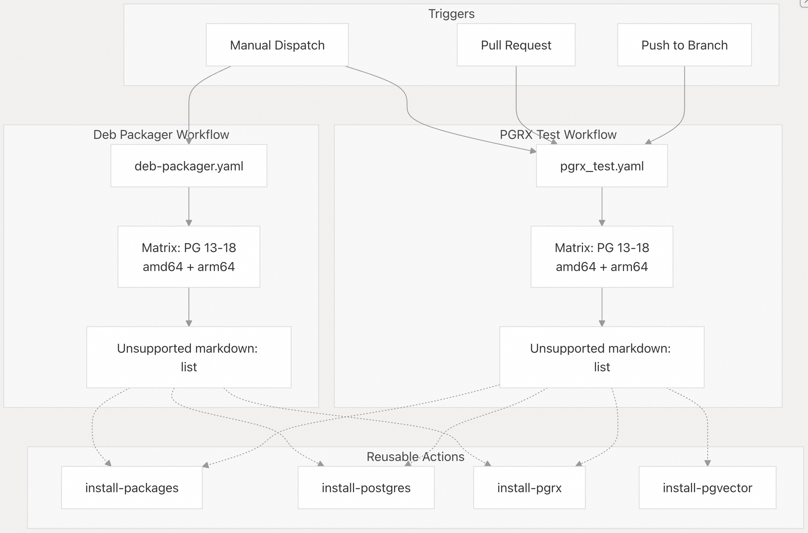
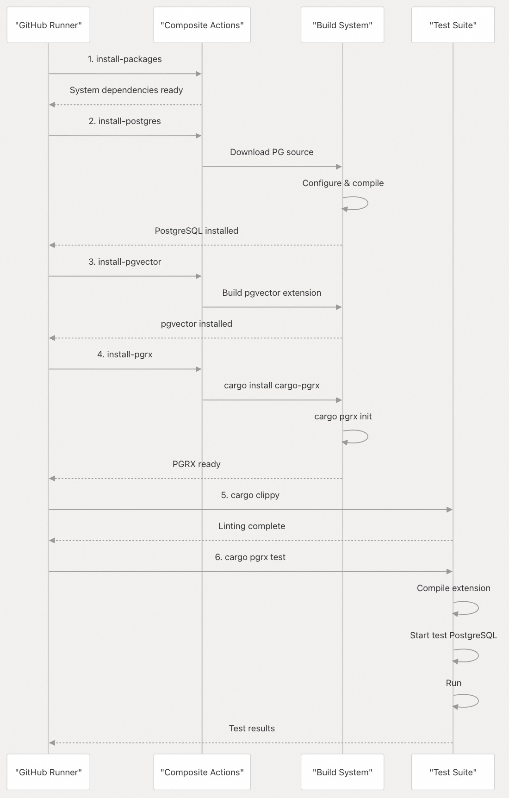
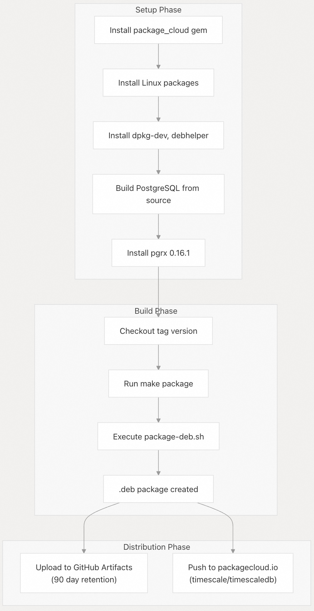
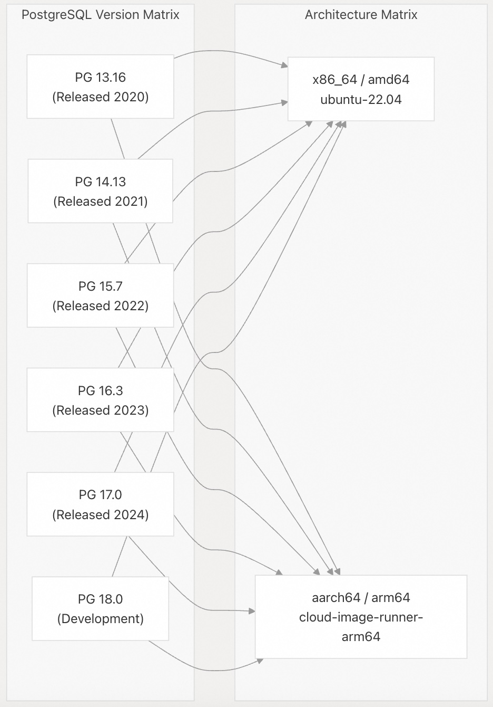
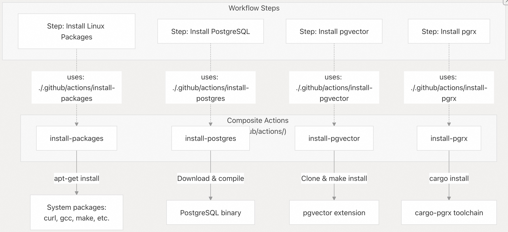
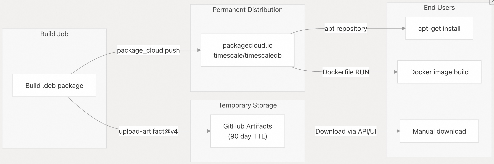

## pgvectorscale 源码学习: 9.3 CI/CD Pipeline（持续集成/持续部署管线）  
                                                      
### 作者                                                      
digoal                                                      
                                                      
### 日期                                                      
2025-11-12                                                     
                                                      
### 标签                                                      
pgvectorscale , 向量数据库 , DiskANN , StreamingDiskANN , 源码学习                                                      
                                                      
----                                                      
                                                      
## 背景                                         
本文介绍了 **pgvectorscale** 的 **Continuous Integration and Continuous Deployment**（持续集成和持续部署，简称 **CI/CD**）基础设施。该 **CI/CD** 系统基于 **GitHub Actions** 构建，提供跨多个 **PostgreSQL** 版本（13-18）和 **CPU architectures**（CPU 架构，如 **amd64**、**arm64**）的自动化测试，以及自动化的 **Debian package**（Debian 包）创建和分发。  
  
## Workflow Overview（工作流概述）  
  
**pgvectorscale** 项目维护着两个主要的 **GitHub Actions workflows**（工作流）：  
  
| Workflow（工作流） | File（文件） | Trigger（触发器） | Purpose（目的） |  
| :--- | :--- | :--- | :--- |  
| **PGRX Test**（PGRX 测试） | `.github/workflows/pgrx_test.yaml` | Push（推送）, PR（拉取请求）, Manual（手动） | 通过 **PGRX framework**（PGRX 框架）在配置矩阵上运行 **Rust tests**（Rust 测试） |  
| **Deb Packager**（Debian 打包器） | `.github/workflows/deb-packager.yaml` | Manual (`workflow_dispatch` - 手动触发) | 构建用于发布的 **Debian packages**（Debian 包）并上传到分发渠道 |  
  
这两个工作流都使用 **matrix strategy**（矩阵策略）来针对多个 **PostgreSQL** 版本和 **CPU architectures**（CPU 架构）进行测试，确保对支持的 **environment matrix**（环境矩阵）具有兼容性。  
  
  
  
**来源:** [`.github/workflows/pgrx_test.yaml`](https://github.com/timescale/pgvectorscale/blob/36271fa5/.github/workflows/pgrx_test.yaml) [`.github/workflows/deb-packager.yaml`](https://github.com/timescale/pgvectorscale/blob/36271fa5/.github/workflows/deb-packager.yaml)  
  
## PGRX Test Workflow（PGRX 测试工作流）  
  
### Workflow Configuration（工作流配置）  
  
**PGRX test workflow**（PGRX 测试工作流）定义在 [`.github/workflows/pgrx_test.yaml`](https://github.com/timescale/pgvectorscale/blob/36271fa5/.github/workflows/pgrx_test.yaml) 中，并在每次 **push**（推送）和 **pull request**（PR，拉取请求）时自动运行，为代码更改提供快速反馈。它也可以通过 `workflow_dispatch` 手动触发。  
  
**Trigger Configuration（触发器配置）:**  
  
[`.github/workflows/pgrx_test.yaml` 2](https://github.com/timescale/pgvectorscale/blob/36271fa5/.github/workflows/pgrx_test.yaml#L2-L2) - 在 `push`（推送）、`pull_request`（拉取请求）和 `workflow_dispatch`（手动触发）事件上运行  
  
### Matrix Strategy（矩阵策略）  
  
该工作流使用全面的 **matrix strategy**（矩阵策略）来确保对支持环境空间的兼容性：  
  
```  
matrix:  
  pgvector:  
    - version: 0.8.1  
  pg:  
    - major: 13, minor: 16  
    - major: 14, minor: 13  
    - major: 15, minor: 7  
    - major: 16, minor: 3  
    - major: 17, minor: 0  
    - major: 18, minor: 0  
  platform:  
    - type: amd64, runs_on: ubuntu-22.04  
    - type: arm64, runs_on: cloud-image-runner-arm64  
```  
  
| PostgreSQL Version（版本） | Architecture（架构） |  
| :--- | :--- |  
| 13.16, 14.13, 15.7, 16.3, 17.0, 18.0 | **amd64**, **arm64** |  
  
这总共产生 **12 total jobs**（总作业数）（6 个 **PostgreSQL** 版本 × 2 种架构）。[`.github/workflows/pgrx_test.yaml` 11](https://github.com/timescale/pgvectorscale/blob/36271fa5/.github/workflows/pgrx_test.yaml#L11-L11) 中的 `fail-fast: false`（快速失败：否）设置确保即使其中一个矩阵组合失败，所有组合也会运行，提供完整的 **test coverage information**（测试覆盖率信息）。  
  
**来源:** [`.github/workflows/pgrx_test.yaml` 10-32](https://github.com/timescale/pgvectorscale/blob/36271fa5/.github/workflows/pgrx_test.yaml#L10-L32)  
  
### Job Execution Steps（作业执行步骤）  
  
该工作流为每个矩阵组合执行以下步骤：  
  
  
  
| Step（步骤） | Description（描述） |  
| :--- | :--- |  
| **Install Linux Packages**（安装 Linux 包） | 安装 **system dependencies**（系统依赖项） |  
| **Install PostgreSQL**（安装 PostgreSQL） | 从 **source**（源码）编译并安装 PostgreSQL |  
| **Install pgvector**（安装 pgvector） | 构建并安装 **pgvector** 0.8.1 |  
| **Install PGRX**（安装 PGRX） | 安装 **PGRX** 版本 0.16.1 并初始化 |  
| **Run Clippy**（运行 Clippy） | 执行 **Rust linting**（Rust 代码检查） |  
| **Run Tests**（运行测试） | 执行 **Rust tests**（Rust 测试） |  
  
**Detailed Step Breakdown（详细步骤分解）:**  
  
1.  **Install Linux Packages** [`.github/workflows/pgrx_test.yaml` 47-48](https://github.com/timescale/pgvectorscale/blob/36271fa5/.github/workflows/pgrx_test.yaml#L47-L48)  
      * 使用 **composite action**（复合操作） `.github/actions/install-packages`  
      * 安装 **compilation**（编译）所需的 **system dependencies**（系统依赖项）  
2.  **Install PostgreSQL** [`.github/workflows/pgrx_test.yaml` 50-55](https://github.com/timescale/pgvectorscale/blob/36271fa5/.github/workflows/pgrx_test.yaml#L50-L55)  
      * 使用 **composite action** `.github/actions/install-postgres`  
      * 为指定版本 **compiles PostgreSQL from source**（从源码编译 PostgreSQL）  
      * 安装到 `~/postgresql`，`pg_config` 位于 `~/postgresql/bin/pg_config`  
3.  **Install pgvector** [`.github/workflows/pgrx_test.yaml` 57-61](https://github.com/timescale/pgvectorscale/blob/36271fa5/.github/workflows/pgrx_test.yaml#L57-L61)  
      * 使用 **composite action** `.github/actions/install-pgvector`  
      * 构建并安装 **pgvector** 0.8.1  
      * 是 **pgvectorscale** 的 **required dependency**（必需依赖项）  
4.  **Install PGRX** [`.github/workflows/pgrx_test.yaml` 63-67](https://github.com/timescale/pgvectorscale/blob/36271fa5/.github/workflows/pgrx_test.yaml#L63-L67)  
      * 使用 **composite action** `.github/actions/install-pgrx`  
      * 安装 **PGRX** version 0.16.1  
      * 使用 **custom-built PostgreSQL**（自定义构建的 PostgreSQL）初始化 **PGRX**  
5.  **Run Clippy** [`.github/workflows/pgrx_test.yaml` 69-73](https://github.com/timescale/pgvectorscale/blob/36271fa5/.github/workflows/pgrx_test.yaml#L69-L73)  
      * 执行 `cargo clippy --all-targets --no-default-features --features 'pg_test pg${{ matrix.pg.major }}'`  
      * 执行 **Rust linting**（Rust 代码检查）和 **static analysis**（静态分析）  
      * 使用 **PostgreSQL-specific feature flags**（PostgreSQL 特定的功能标志）检查所有目标  
6.  **Run Tests** [`.github/workflows/pgrx_test.yaml` 75-79](https://github.com/timescale/pgvectorscale/blob/36271fa5/.github/workflows/pgrx_test.yaml#L75-L79)  
      * 执行 `cargo pgrx test -- pg${{ matrix.pg.major }}`  
      * 为目标 **PostgreSQL** 版本 **compiles the extension**（编译扩展）  
      * 运行所有标记有 `#[pg_test]` **attribute**（属性）的 **Rust tests**（Rust 测试）  
      * 测试针对 **temporary PostgreSQL instance**（临时 PostgreSQL 实例）执行  
  
**来源:** [`.github/workflows/pgrx_test.yaml` 43-79](https://github.com/timescale/pgvectorscale/blob/36271fa5/.github/workflows/pgrx_test.yaml#L43-L79)  
  
### Environment Variables（环境变量）  
  
该工作流配置了跨步骤使用的几个 **environment variables**（环境变量）：  
  
| Variable（变量） | Value（值） | Purpose（目的） |  
| :--- | :--- | :--- |  
| `PG_SRC_DIR` | `pgbuild` | **PostgreSQL source**（PostgreSQL 源码）的目录 |  
| `PG_INSTALL_DIR` | `postgresql` | **PostgreSQL** 的安装目录 |  
| `MAKE_JOBS` | `6` | 用于 **compilation**（编译）的并行 `make` 作业数 |  
| `PG_CONFIG_PATH` | `postgresql/bin/pg_config` | **pg\_config binary**（pg\_config 二进制文件）的路径 |  
  
**来源:** [`.github/workflows/pgrx_test.yaml` 34-41](https://github.com/timescale/pgvectorscale/blob/36271fa5/.github/workflows/pgrx_test.yaml#L34-L41)  
  
## Debian Packaging Workflow（Debian 打包工作流）  
  
### Workflow Configuration（工作流配置）  
  
**Debian packaging workflow**（Debian 打包工作流）定义在 [`.github/workflows/deb-packager.yaml`](https://github.com/timescale/pgvectorscale/blob/36271fa5/.github/workflows/deb-packager.yaml) 中，必须通过 `workflow_dispatch` **手动触发**。此工作流构建 **`.deb` packages**（.deb 包）并将其上传到 **distribution channels**（分发渠道）。  
  
**Manual Trigger Inputs（手动触发输入）:**  
  
  * `tag` （**required** - 必需）：要构建的 **version tag**（版本标签）（例如 "0.3.0"）  
  * `TAG_GIT_REF` （**optional** - 可选）：要 **checkout**（检出）的 **Git reference**（Git 引用）；如果未指定，则默认为 **tag**（标签）值  
  
[`.github/workflows/deb-packager.yaml` 3-12](https://github.com/timescale/pgvectorscale/blob/36271fa5/.github/workflows/deb-packager.yaml#L3-L12)  
  
### Matrix Configuration（矩阵配置）  
  
**deb-packager** 使用与测试工作流相同的 **PostgreSQL** 版本和 **architecture matrix**（架构矩阵）：  
  
**6 PostgreSQL Versions（版本）:**  
  
  * PostgreSQL 13.16  
  * PostgreSQL 14.13  
  * PostgreSQL 15.7  
  * PostgreSQL 16.3  
  * PostgreSQL 17.0  
  * PostgreSQL 18.0  
  
**2 CPU Architectures（CPU 架构）:**  
  
  * **`amd64`** 在 `ubuntu-latest` 上  
  * **`arm64`** 在 `cloud-image-runner-arm64` （**custom ARM runner** - 自定义 ARM 运行器）上  
  
这为每个版本产生 **12 .deb packages**（.deb 包）（6 个版本 × 2 种架构）。  
  
**来源:** [`.github/workflows/deb-packager.yaml` 16-38](https://github.com/timescale/pgvectorscale/blob/36271fa5/.github/workflows/deb-packager.yaml#L16-L38)  
  
### Packaging Job Steps（打包作业步骤）  
  
  
  
| Step（步骤） | Description（描述） |  
| :--- | :--- |  
| **Install package\_cloud**（安装 package\_cloud） | 安装 **Ruby gem dependencies**（Ruby gem 依赖项） |  
| **Install Deb builder packages**（安装 Deb 构建器包） | 安装 **Debian-specific packaging tools**（Debian 特定的打包工具） |  
| **Checkout version tag**（检出版本标签） | 检出指定的标签或引用 |  
| **Build Deb**（构建 Deb） | 执行 `make package` 以创建 **`.deb` package**（.deb 包） |  
| **Upload as Artifact**（上传为制品） | 将 **`.deb` package** 上传到 **GitHub Artifacts**（GitHub 制品） |  
| **Upload to packagecloud**（上传到 packagecloud） | 将软件包推送到 **packagecloud.io distribution service**（packagecloud.io 分发服务） |  
  
**Step Details（步骤详情）:**  
  
1.  **Install package\_cloud** [`.github/workflows/deb-packager.yaml` 50-56](https://github.com/timescale/pgvectorscale/blob/36271fa5/.github/workflows/deb-packager.yaml#L50-L56)  
      * 安装 **Ruby gem dependencies**（Ruby gem 依赖项）：`rake`、`rainbow`、`package_cloud`  
      * 上传到 **packagecloud.io distribution service**（packagecloud.io 分发服务）所需  
2.  **Install Deb builder packages** [`.github/workflows/deb-packager.yaml` 64-66](https://github.com/timescale/pgvectorscale/blob/36271fa5/.github/workflows/deb-packager.yaml#L64-L66)  
      * 安装 `dpkg-dev`、`debhelper`、`build-essential`  
      * **Debian-specific packaging tools**（Debian 特定的打包工具）  
3.  **Checkout version tag** [`.github/workflows/deb-packager.yaml` 75-80](https://github.com/timescale/pgvectorscale/blob/36271fa5/.github/workflows/deb-packager.yaml#L75-L80)  
      * 从仓库中 **checks out the specified tag**（检出指定的标签）  
      * 使用 `TAG_GIT_REF` 输入，或回退到 `tag` 输入  
4.  **Build Deb** [`.github/workflows/deb-packager.yaml` 88-93](https://github.com/timescale/pgvectorscale/blob/36271fa5/.github/workflows/deb-packager.yaml#L88-L93)  
      * 在 **tag directory**（标签目录）中执行 `make package`  
      * 运行 `scripts/package-deb.sh`，包含 **tag**（标签）、**path**（路径）、**OS**（操作系统）和 **PG major version**（PostgreSQL 主版本号）  
      * 在 `pkgdump/` 目录中创建 **`.deb` package**（.deb 包）  
5.  **Upload as Artifact** [`.github/workflows/deb-packager.yaml` 97-101](https://github.com/timescale/pgvectorscale/blob/36271fa5/.github/workflows/deb-packager.yaml#L97-L101)  
      * 将 **`.deb` package** 上传到 **GitHub Artifacts**（GitHub 制品）  
      * **Artifact name**（制品名称）：`pgvectorscale-{tag}-pg{major}-{arch}`  
      * **90-day retention period**（90 天保留期） (**GitHub Artifacts limitation** - GitHub 制品限制)  
6.  **Upload to packagecloud** [`.github/workflows/deb-packager.yaml` 103-108](https://github.com/timescale/pgvectorscale/blob/36271fa5/.github/workflows/deb-packager.yaml#L103-L108)  
      * 将软件包推送到 **packagecloud.io** 上的 `timescale/timescaledb` 仓库  
      * 使用 `PACKAGECLOUD_TOKEN` **secret**（密钥）进行 **authentication**（认证）  
      * 从 **host OS**（主机操作系统）的 `/etc/os-release` 文件动态确定 **distribution**（分发版本）  
  
**来源:** [`.github/workflows/deb-packager.yaml` 49-108](https://github.com/timescale/pgvectorscale/blob/36271fa5/.github/workflows/deb-packager.yaml#L49-L108)  
  
## Matrix Build Strategy（矩阵构建策略）  
  
### PostgreSQL Version Coverage（PostgreSQL 版本覆盖范围）  
  
**CI/CD** 系统针对六个 **PostgreSQL major versions**（PostgreSQL 主版本）进行测试和构建，以确保 **broad compatibility**（广泛兼容性）：  
  
  
  
| Version（版本） | Minor Version（次版本） |  
| :--- | :--- |  
| PG 13 | 13.16 |  
| PG 14 | 14.13 |  
| PG 15 | 15.7 |  
| PG 16 | 16.3 |  
| PG 17 | 17.0 |  
| PG 18 | 18.0 |  
  
**Version Selection Rationale（版本选择原理）:**  
  
  * **PG 13-16**：接收 **security updates**（安全更新）的活跃 **PostgreSQL** 版本  
  * **PG 17**：最新的 **stable release**（稳定版本）  
  * **PG 18**：用于 **forward compatibility testing**（向前兼容性测试）的 **development version**（开发版本）  
  
**explicitly**（明确地）指定每个 **minor version**（次版本）[`.github/workflows/pgrx_test.yaml` 16-27](https://github.com/timescale/pgvectorscale/blob/36271fa5/.github/workflows/pgrx_test.yaml#L16-L27)，以确保 **reproducible builds**（可重现构建）和 **consistent testing**（一致性测试）。  
  
### Architecture Coverage（架构覆盖范围）  
  
该矩阵包括两个主要的 **CPU architectures**（CPU 架构）：  
  
| Architecture（架构） | Runner（运行器） | Use Case（用例） |  
| :--- | :--- | :--- |  
| **amd64** (x86\_64) | `ubuntu-22.04` / `ubuntu-latest` | **Server deployments**（服务器部署）, **cloud instances**（云实例） |  
| **arm64** (aarch64) | `cloud-image-runner-arm64` | **ARM servers**（ARM 服务器）, **Apple Silicon compatibility**（Apple Silicon 兼容性） |  
  
`cloud-image-runner-arm64` 是一个 **custom GitHub Actions runner**（自定义 GitHub Actions 运行器），提供 **ARM64 build capability**（ARM64 构建能力）。两种架构使用 **identical build steps**（相同的构建步骤），确保跨平台的 **binary compatibility**（二进制兼容性）。  
  
**来源:** [`.github/workflows/pgrx_test.yaml` 28-32](https://github.com/timescale/pgvectorscale/blob/36271fa5/.github/workflows/pgrx_test.yaml#L28-L32) [`.github/workflows/deb-packager.yaml` 34-38](https://github.com/timescale/pgvectorscale/blob/36271fa5/.github/workflows/deb-packager.yaml#L34-L38)  
  
### Matrix Job Isolation（矩阵作业隔离）  
  
每个 **matrix combination**（矩阵组合）都作为 **independent job**（独立作业）运行，具有：  
  
  * **Isolated environment**（隔离环境）：全新的 **runner instance**（运行器实例）  
  * **Independent failure**（独立故障）：`fail-fast: false` 允许其他作业继续  
  * **Parallel execution**（并行执行）：所有作业并发运行（取决于运行器可用性）  
  * **Individual artifacts**（独立制品）：每个作业生成自己的 **test results**（测试结果）或 **packages**（软件包）  
  
这种设计提供了：  
  
1.  **Complete coverage**（完整覆盖）：每个组合都经过测试  
2.  **Fault isolation**（故障隔离）：一次故障不会阻止其他配置  
3.  **Fast feedback**（快速反馈）：**Parallel execution**（并行执行）减少了总运行时间  
4.  **Reproducibility**（可重现性）：每个环境都是 **built from scratch**（从零开始构建）  
  
## Composite Actions（复合操作）  
  
工作流使用 **reusable composite actions**（可重用复合操作）来消除 **code duplication**（代码重复）并确保作业之间的 **consistency**（一致性）。这些操作定义在 `.github/actions/` 中，并被两个工作流引用。  
  
### Available Composite Actions（可用复合操作）  
  
  
  
| Action（操作） | Purpose（目的） |  
| :--- | :--- |  
| `install-packages` | 安装 **compilation**（编译）所需的系统依赖项 |  
| `install-postgres` | **Compiles**（编译）并 **installs PostgreSQL from source**（从源码安装 PostgreSQL） |  
| `install-pgvector` | 作为 **dependency**（依赖项）构建并安装 **pgvector** |  
| `install-pgrx` | 安装 **pgrx** 并使用目标 **PostgreSQL** 版本进行初始化 |  
  
### Action Usage Examples（操作使用示例）  
  
**install-packages Action:**  
  
```yaml  
- name: Install Linux Packages  
  uses: ./.github/actions/install-packages  
```  
  
**install-postgres Action:**  
  
```yaml  
- name: Install PostgreSQL ${{ matrix.pg.major }}  
  uses: ./.github/actions/install-postgres  
  with:  
    pg-version: ${{ matrix.pg.major }}.${{ matrix.pg.minor }}  
    pg-src-dir: ~/pgbuild  
    pg-install-dir: ~/postgresql  
```  
  
**install-pgvector Action:**  
  
```yaml  
- name: Install pgvector ${{ matrix.pgvector.version }}  
  uses: ./.github/actions/install-pgvector  
  with:  
    pgvector-version: ${{ matrix.pgvector.version }}  
    pg-install-dir: ~/postgresql  
```  
  
**install-pgrx Action:**  
  
```yaml  
- name: Install pgrx  
  uses: ./.github/actions/install-pgrx  
  with:  
    pg-install-dir: ~/postgresql  
    pgrx-version: 0.16.1  
```  
  
**Benefits of Composite Actions（复合操作的优势）:**  
  
  * **Consistency**（一致性）：测试和打包工作流中设置相同  
  * **Maintainability**（可维护性）：**build steps**（构建步骤）的单一更新位置  
  * **Clarity**（清晰度）：高层级工作流 YAML 保持可读  
  * **Reusability**（可重用性）：未来可被更多工作流使用  
  
**来源:** [`.github/workflows/pgrx_test.yaml` 47-67](https://github.com/timescale/pgvectorscale/blob/36271fa5/.github/workflows/pgrx_test.yaml#L47-L67) [`.github/workflows/deb-packager.yaml` 61-86](https://github.com/timescale/pgvectorscale/blob/36271fa5/.github/workflows/deb-packager.yaml#L61-L86)  
  
## Artifact Management and Distribution（制品管理和分发）  
  
### GitHub Artifacts（GitHub 制品）  
  
**deb-packager workflow**（Debian 打包工作流）将软件包上传到 **GitHub Artifacts**（GitHub 制品）以进行 **temporary storage**（临时存储）：  
  
**Artifact Configuration（制品配置）:**  
  
  * **Name pattern**（名称模式）：`pgvectorscale-{tag}-pg{major}-{arch}`  
  * **Example**（示例）：`pgvectorscale-0.3.0-pg16-amd64`  
  * **Retention**（保留期）：90 天 (**GitHub limitation** - GitHub 限制)  
  * **Path**（路径）：`pkgdump/pgvectorscale-*{tag}*.deb`  
  
**Usage（用途）:**  
  
```yaml  
- name: Upload deb as Artifact  
  uses: actions/upload-artifact@v4  
  with:  
    name: pgvectorscale-${{ env.TAG }}-pg${{ matrix.pg.major }}-${{ matrix.platform.type }}  
    path: pkgdump/pgvectorscale-*${{ env.TAG }}*.deb  
```  
  
**GitHub Artifacts**（GitHub 制品）为软件包推送到 **packagecloud** 之前提供了一个 **staging area**（暂存区）。它们可通过以下方式访问：  
  
  * **GitHub Actions UI**（GitHub Actions 用户界面）  
  * **GitHub REST API**（GitHub REST API） ([documented at docs.github.com/en/rest/actions/artifacts](https://github.com/timescale/pgvectorscale/blob/36271fa5/documented%20at%20docs.github.com/en/rest/actions/artifacts))  
  
**来源:** [`.github/workflows/deb-packager.yaml` 95-101](https://github.com/timescale/pgvectorscale/blob/36271fa5/.github/workflows/deb-packager.yaml#L95-L101)  
  
### Packagecloud Distribution（Packagecloud 分发）  
  
构建后，软件包会自动推送到公共的 **packagecloud.io repository**（packagecloud.io 仓库）：  
  
**Repository Details（仓库详情）:**  
  
  * **Organization**（组织）：`timescale`  
  * **Repository**（仓库）：`timescaledb`  
  * **Full path**（完整路径）：`timescale/timescaledb/$ID/$VERSION_CODENAME`  
  
**Distribution Logic（分发逻辑）:**  
  
```yaml  
source /etc/os-release  
package_cloud push timescale/timescaledb/$ID/$VERSION_CODENAME pkgdump/pgvectorscale-*.deb  
```  
  
**distribution codename**（分发代号）是根据运行器的 `/etc/os-release` 文件动态确定的，确保软件包被推送到正确的 **Ubuntu/Debian repository**（Ubuntu/Debian 仓库）。  
  
**Authentication（认证）:**  
使用在 **GitHub repository settings**（GitHub 仓库设置）中配置的 `PACKAGECLOUD_TOKEN` **secret**（密钥）[`.github/workflows/deb-packager.yaml` 105](https://github.com/timescale/pgvectorscale/blob/36271fa5/.github/workflows/deb-packager.yaml#L105-L105)。  
  
**来源:** [`.github/workflows/deb-packager.yaml` 103-108](https://github.com/timescale/pgvectorscale/blob/36271fa5/.github/workflows/deb-packager.yaml#L103-L108)  
  
### Distribution Flow Diagram（分发流程图）  
  
  
  
**Key Distribution Points（关键分发点）:**  
  
1.  **GitHub Artifacts**（GitHub 制品）：用于测试和手动下载的 **temporary access**（临时访问）  
2.  **packagecloud.io**：通过 **apt repositories**（apt 仓库）进行 **permanent public distribution**（永久公共分发）  
3.  **End users**（终端用户）：通过 `apt-get` 安装或 **download packages directly**（直接下载软件包）  
  
有关使用这些 **distribution channels**（分发渠道）的更多详细信息，请参阅Packaging and Distribution。  
  
**来源:** [`.github/workflows/deb-packager.yaml` 95-108](https://github.com/timescale/pgvectorscale/blob/36271fa5/.github/workflows/deb-packager.yaml#L95-L108)  
  
      
#### [PolarDB 学习图谱](https://www.aliyun.com/database/openpolardb/activity "8642f60e04ed0c814bf9cb9677976bd4")
  
  
#### [PostgreSQL 解决方案集合](../201706/20170601_02.md "40cff096e9ed7122c512b35d8561d9c8")
  
  
#### [德哥 / digoal's Github - 公益是一辈子的事.](https://github.com/digoal/blog/blob/master/README.md "22709685feb7cab07d30f30387f0a9ae")
  
  
#### [About 德哥](https://github.com/digoal/blog/blob/master/me/readme.md "a37735981e7704886ffd590565582dd0")
  
  

  
