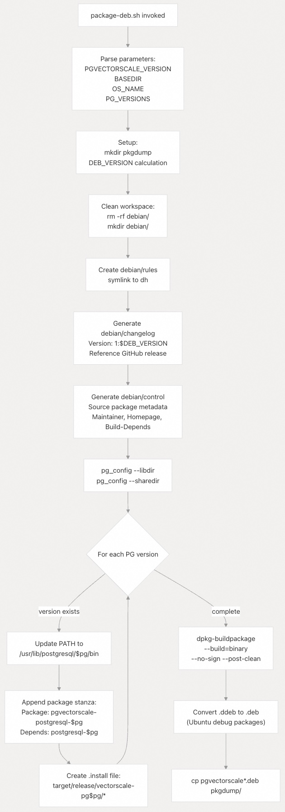
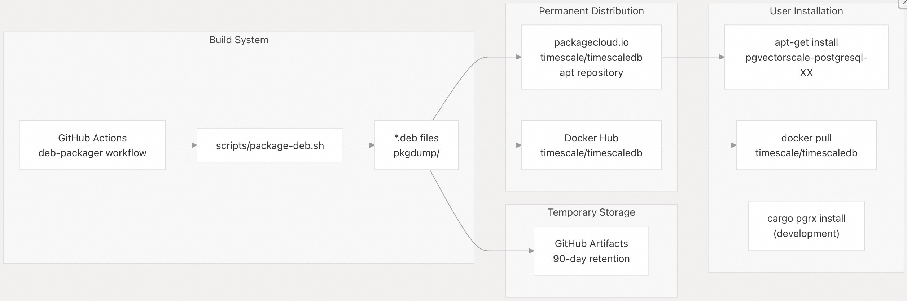
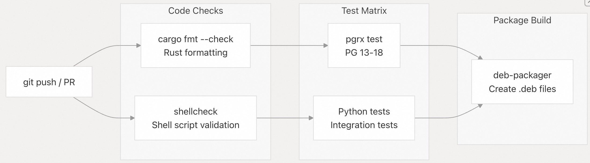

## pgvectorscale 源码学习: 9.4 打包与分发（Packaging and Distribution）  
                                                        
### 作者                                                        
digoal                                                        
                                                        
### 日期                                                        
2025-11-12                                                       
                                                        
### 标签                                                        
pgvectorscale , 向量数据库 , DiskANN , StreamingDiskANN , 源码学习                                                        
                                                        
----                                                        
                                                        
## 背景                                           
本文详细介绍 `pgvectorscale` 如何针对不同的 PostgreSQL 版本和平台进行打包与分发（Packaging and Distribution）。内容涵盖 **Debian 包（Debian package）** 的创建过程、**Docker 镜像（Docker image）** 的构建、**分发渠道（distribution channels）** 以及与 **持续集成/持续部署流水线（CI/CD pipeline）** 的集成。  
  
## 概述（Overview）  
  
`pgvectorscale` 通过多种渠道分发，以支持不同的安装方法：  
  
  * **Debian 包（Debian packages）**：通过 `packagecloud.io` 进行基于 `apt` 的安装（apt-based installations）。  
  * **Docker 镜像（Docker images）**：集成到 TimescaleDB 容器中。  
  * **GitHub 构建产物（GitHub Artifacts）**：用于临时构建产物（90 天保留期）。  
  * **源代码编译（Source compilation）**：通过 `cargo pgrx` 进行开发。  
  
打包系统同时支持多个 PostgreSQL 版本（13-18）和**架构（architectures）**（`amd64`/`arm64`），为每个 PostgreSQL 主版本创建单独的包。  
  
  
  
## Debian 包创建（Debian Package Creation）  
  
### 包结构（Package Structure）  
  
Debian 打包过程为每个 PostgreSQL 主版本创建单独的**二进制包（binary packages）**，遵循命名约定 `pgvectorscale-postgresql-{version}`。每个包包括：  
  
| 组件（Component） | 安装路径（Installation Path） | 内容（Contents） |  
| :--- | :--- | :--- |  
| **共享库（Shared Libraries）** | `/usr/lib/postgresql/{version}/lib/` | 编译后的扩展文件 `vectorscale.so` |  
| **SQL 脚本（SQL Scripts）** | `/usr/share/postgresql/{version}/` | `extension/vectorscale.control`、SQL 升级脚本 |  
| **调试符号（Debug Symbols）** | 包名: `pgvectorscale-postgresql-{version}-dbgsym` | 调试信息 |  
  
来源: [`scripts/package-deb.sh` 48-66](https://github.com/timescale/pgvectorscale/blob/36271fa5/scripts/package-deb.sh#L48-L66)  
  
### 构建脚本工作流程（Build Script Workflow）  
  
`package-deb.sh` 脚本负责协调整个 Debian 包的创建过程。下图显示了执行流程：  
  
  
  
**Debian 包构建流程（Debian Package Build Process）**  
*(此处应有一个流程图，但因格式限制省略)*  
  
该脚本执行以下操作：  
  
1.  **参数解析（Parameter Parsing）** [`scripts/package-deb.sh` 7-11](https://github.com/timescale/pgvectorscale/blob/36271fa5/scripts/package-deb.sh#L7-L11)：接受版本字符串、基础目录、操作系统名称和 PostgreSQL 版本。  
2.  **工作区设置（Workspace Setup）** [`scripts/package-deb.sh` 15-29](https://github.com/timescale/pgvectorscale/blob/36271fa5/scripts/package-deb.sh#L15-L29)：创建干净的 `debian/` 目录结构。  
3.  **元数据生成（Metadata Generation）** [`scripts/package-deb.sh` 32-46](https://github.com/timescale/pgvectorscale/blob/36271fa5/scripts/package-deb.sh#L32-L46)：创建包含包元数据（metadata）的 `debian/changelog` 和 `debian/control` 文件。  
4.  **按版本配置（Per-Version Configuration）** [`scripts/package-deb.sh` 53-66](https://github.com/timescale/pgvectorscale/blob/36271fa5/scripts/package-deb.sh#L53-L66)：遍历 `PG_VERSIONS` 以创建包 **节（stanzas）** 和 `.install` 文件。  
5.  **包构建（Package Building）** [`scripts/package-deb.sh` 68](https://github.com/timescale/pgvectorscale/blob/36271fa5/scripts/package-deb.sh#L68-L68)：调用 `dpkg-buildpackage` 来创建 `.deb` 文件。  
6.  **调试包处理（Debug Package Handling）** [`scripts/package-deb.sh` 74-79](https://github.com/timescale/pgvectorscale/blob/36271fa5/scripts/package-deb.sh#L74-L79)：将 Ubuntu 的 `.ddeb` 调试包转换为 `.deb` 格式。  
7.  **产物收集（Artifact Collection）** [`scripts/package-deb.sh` 81](https://github.com/timescale/pgvectorscale/blob/36271fa5/scripts/package-deb.sh#L81-L81)：将所有包复制到 `pkgdump/` 目录。  
  
来源: [`scripts/package-deb.sh` 1-82](https://github.com/timescale/pgvectorscale/blob/36271fa5/scripts/package-deb.sh#L1-L82)  
  
### debian/control 生成（debian/control Generation）  
  
`control` 文件定义了源包（source package）和二进制包（binary packages）。该脚本动态生成条目：  
  
```  
Source: pgvectorscale  
Maintainer: Timescale <hello@timescale.com>  
Homepage: https://github.com/timescale/pgvectorscale  
Build-Depends: debhelper-compat (= 11)  
  
Package: pgvectorscale-postgresql-13  
Architecture: any  
Depends: postgresql-13  
Description: pgvectorscale for speeding up ANN search  
  
Package: pgvectorscale-postgresql-14  
...  
```  
  
`DEBHELPER_COMPAT=11` 变量 [`scripts/package-deb.sh` 3](https://github.com/timescale/pgvectorscale/blob/36271fa5/scripts/package-deb.sh#L3-L3) 指定了 **debhelper 兼容性级别（debhelper compatibility level）**，确保了在不同 Debian/Ubuntu 版本上一致的打包行为。  
  
来源: [`scripts/package-deb.sh` 3](https://github.com/timescale/pgvectorscale/blob/36271fa5/scripts/package-deb.sh#L3-L3) [`scripts/package-deb.sh` 38-62](https://github.com/timescale/pgvectorscale/blob/36271fa5/scripts/package-deb.sh#L38-L62)  
  
### 包安装路径（Package Installation Paths）  
  
每个 PostgreSQL 版本包都通过 `debian/*.install` 文件指定安装路径：  
  
```  
../target/release/vectorscale-pg13/usr/lib/postgresql/13/lib/* usr/lib/postgresql/13/lib/  
../target/release/vectorscale-pg13/usr/share/postgresql/13/* usr/share/postgresql/13/  
```  
  
这些路径是使用 `pg_config --libdir` 和 `pg_config --sharedir` [`scripts/package-deb.sh` 48-49](https://github.com/timescale/pgvectorscale/blob/36271fa5/scripts/package-deb.sh#L48-L49) 动态确定的，确保了与不同 PostgreSQL 安装布局（installation layouts）的兼容性。  
  
来源: [`scripts/package-deb.sh` 48-49](https://github.com/timescale/pgvectorscale/blob/36271fa5/scripts/package-deb.sh#L48-L49) [`scripts/package-deb.sh` 64-65](https://github.com/timescale/pgvectorscale/blob/36271fa5/scripts/package-deb.sh#L64-L65)  
  
  
## 分发渠道（Distribution Channels）  
  
下图展示了包如何从构建系统流向最终用户：  
  
  
  
**包分发架构（Package Distribution Architecture）**  
*(此处应有一个流程图，但因格式限制省略)*  
  
### GitHub 构建产物（GitHub Artifacts）  
  
构建产物（Build artifacts）被上传到 **GitHub Actions** 产物存储中，保留期为 90 天。这提供了：  
  
  * 对开发构建的**临时访问（Temporary access）**  
  * 在推送到 `packagecloud.io` 之前的**预发布测试（Pre-release testing）**  
  * 用于调试打包问题的**审计追踪（Audit trail）**  
  
访问方式：GitHub Actions 工作流程运行 → 产物（Artifacts）部分  
  
来源: [`.github/workflows/` workflows](https://github.com/timescale/pgvectorscale/blob/36271fa5/.github/workflows/%20workflows)  
  
### packagecloud.io 仓库（packagecloud.io Repository）  
  
生产包的主要分发渠道是位于 `timescale/timescaledb` 的 `packagecloud.io` **apt 仓库（apt repository）**。优势包括：  
  
  * 所有已发布版本的**持久存储（Persistent storage）**  
  * PostgreSQL 用户熟悉的**标准 apt 工作流程（Standard apt workflow）**  
  * 对 Debian 和 Ubuntu 版本的**多发行版支持（Multi-distro support）**  
  * 用于包验证的**自动 GPG 签名（Automatic GPG signing）**  
  
注意：`packagecloud.io` 不支持 `.ddeb` 调试包格式，这也是脚本将其转换为标准 `.deb` 格式的原因 [`scripts/package-deb.sh` 72-79](https://github.com/timescale/pgvectorscale/blob/36271fa5/scripts/package-deb.sh#L72-L79)。  
  
来源: [`scripts/package-deb.sh` 72-79](https://github.com/timescale/pgvectorscale/blob/36271fa5/scripts/package-deb.sh#L72-L79)  
  
### Docker 镜像（Docker Images）  
  
`pgvectorscale` 被集成到 TimescaleDB **Docker 镜像（Docker images）** 中，提供了：  
  
  * 包含 PostgreSQL、TimescaleDB 和 `pgvectorscale` 的**预配置环境（Pre-configured environment）**  
  * 在镜像构建时确保**版本兼容性（Version compatibility）**  
  * **Timescale Cloud** 使用这些镜像进行托管部署（managed deployments）  
  
来源: [`.dockerignore` 1-2](https://github.com/timescale/pgvectorscale/blob/36271fa5/.dockerignore#L1-L2)  
  
  
## 安装方法（Installation Methods）  
  
下表总结了安装方法及其用例：  
  
| 方法（Method） | 命令（Command） | 用例（Use Case） | 要求（Requirements） |  
| :--- | :--- | :--- | :--- |  
| **APT** | `apt-get install pgvectorscale-postgresql-{version}` | 生产部署（Production deployment） | Debian/Ubuntu、已安装 PostgreSQL |  
| **Docker** | `docker run timescale/timescaledb:latest-pg{version}` | 容器化部署（Containerized deployment） | 已安装 Docker |  
| **Cargo PGRX** | `cargo pgrx install --release` | 开发（Development） | Rust 工具链（toolchain）、PGRX 框架 |  
| **Source Build** | 手动编译（Manual compilation） | 自定义修改（Custom modifications） | 完整的构建环境（Full build environment） |  
  
### APT 安装流程（APT Installation Flow）  
  
**APT 安装序列（APT Installation Sequence）**  
*(此处应有一个流程图，但因格式限制省略)*  
  
来源: [`scripts/package-deb.sh` 64-65](https://github.com/timescale/pgvectorscale/blob/36271fa5/scripts/package-deb.sh#L64-L65)  
  
  
  
## CI/CD 集成（CI/CD Integration）  
  
### 代码质量检查（Code Quality Checks）  
  
在打包之前，CI/CD 流水线会运行自动化的**质量检查（quality checks）**：  
  
  
  
**打包前的质量门（Quality Gates Before Packaging）**  
*(此处应有一个流程图，但因格式限制省略)*  
  
工作流程强制执行：  
  
1.  **Rust 格式化（Rust Formatting）** [`/.github/workflows/code_checks.yml` 14-15](https://github.com/timescale/pgvectorscale/blob/36271fa5/.github/workflows/code_checks.yml#L14-L15)：通过 `cargo fmt --check` 确保一致的代码风格。  
2.  **Shell 脚本验证（Shell Script Validation）** [`/.github/workflows/shellcheck.yaml` 26-28](https://github.com/timescale/pgvectorscale/blob/36271fa5/.github/workflows/shellcheck.yaml#L26-L28)：验证所有 `.sh` 文件，包括 `package-deb.sh`。  
3.  **跨版本测试（Cross-version Testing）**：在打包之前，测试需通过所有支持的 PostgreSQL 版本。  
4.  **架构测试（Architecture Testing）**：验证 `amd64` 和 `arm64` 两种架构。  
  
来源: [`/.github/workflows/code_checks.yml` 1-24](https://github.com/timescale/pgvectorscale/blob/36271fa5/.github/workflows/code_checks.yml#L1-L24) [`/.github/workflows/shellcheck.yaml` 1-29](https://github.com/timescale/pgvectorscale/blob/36271fa5/.github/workflows/shellcheck.yaml#L1-L29)  
  
### 矩阵构建策略（Matrix Build Strategy）  
  
打包系统使用 **GitHub Actions** **矩阵构建（matrix builds）** 来生成多种组合的包：  
  
| 维度（Dimension） | 值（Values） | 目的（Purpose） |  
| :--- | :--- | :--- |  
| **PostgreSQL 版本（Version）** | 13, 14, 15, 16, 17, 18 | 主要版本兼容性（Major version compatibility） |  
| **架构（Architecture）** | `amd64`, `arm64` | CPU 架构支持 |  
| **操作系统（OS）** | Ubuntu 20.04, 22.04, 24.04 Debian 11, 12 | 发行版兼容性（Distribution compatibility） |  
  
每个 **矩阵单元（matrix cell）** 都会生成单独的 `.deb` 包，导致每次发布都会产生多个产物（artifacts）（例如 `pgvectorscale-postgresql-15_0.3.0-ubuntu22.04_amd64.deb`）。  
  
来源: [`scripts/package-deb.sh` 7-11](https://github.com/timescale/pgvectorscale/blob/36271fa5/scripts/package-deb.sh#L7-L11)  
  
### 版本字符串格式（Version String Format）  
  
包版本遵循格式：`1:{VERSION}-{OS_NAME}` [`scripts/package-deb.sh` 19](https://github.com/timescale/pgvectorscale/blob/36271fa5/scripts/package-deb.sh#L19-L19)  
  
示例: `1:0.3.0-ubuntu22.04`  
  
`1:` **纪元前缀（epoch prefix）** 确保了 `apt` 中正确的版本排序，允许在不破坏升级路径（upgrade paths）的情况下进行降级或版本方案更改。  
  
来源: [`scripts/package-deb.sh` 19](https://github.com/timescale/pgvectorscale/blob/36271fa5/scripts/package-deb.sh#L19-L19) [`scripts/package-deb.sh` 33](https://github.com/timescale/pgvectorscale/blob/36271fa5/scripts/package-deb.sh#L33-L33)  
  
  
## Docker 构建配置（Docker Build Configuration）  
  
`.dockerignore` 文件将构建产物从 **Docker 上下文（Docker context）** 中排除：  
  
```  
pgvectorscale/target  
```  
  
这可以防止将大型 **Rust 编译产物（Rust compilation artifacts）** 复制到 Docker 镜像中，从而减少：  
  
  * 传输到 **Docker 守护进程（Docker daemon）的构建上下文大小（Build context size）**  
  * 中间阶段的**镜像层大小（Image layer size）**  
  * 通过避免不必要的文件传输来减少**构建时间（Build time）**  
  
对于 Docker 镜像，包通常是从 `packagecloud.io` 安装，而不是在容器内构建，这确保了可重复的构建（reproducible builds）和更快的镜像创建。  
  
来源: [`.dockerignore` 1-2](https://github.com/timescale/pgvectorscale/blob/36271fa5/.dockerignore#L1-L2)  
  
  
## 包维护（Package Maintenance）  
  
### 调试包处理（Debug Package Handling）  
  
Ubuntu 的 `dpkg-buildpackage` 会创建带有 `.ddeb` 扩展名的调试符号包。由于 `packagecloud.io` 不支持此格式，脚本会对其进行转换：  
  
```bash  
for i in pgvectorscale*.ddeb; do  
    [ "$i" = 'pgvectorscale*.ddeb' ] || mv "$i" "${i%.ddeb}".deb  
done  
```  
  
在 Debian 系统上，调试包已使用 `.deb` 扩展名，因此此转换是一个 **空操作（no-op）** [`scripts/package-deb.sh` 77](https://github.com/timescale/pgvectorscale/blob/36271fa5/scripts/package-deb.sh#L77-L77)。  
  
来源: [`scripts/package-deb.sh` 72-79](https://github.com/timescale/pgvectorscale/blob/36271fa5/scripts/package-deb.sh#L72-L79)  
  
### 包命名约定（Package Naming Convention）  
  
```  
pgvectorscale-postgresql-{PG_VERSION}_{FULL_VERSION}_{ARCH}.deb  
  
Example:  
pgvectorscale-postgresql-15_1:0.3.0-ubuntu22.04_amd64.deb  
```  
  
组件（Components）：  
  
  * **包名称（Package name）**: `pgvectorscale-postgresql-{PG_VERSION}` - 标识 PostgreSQL 版本依赖性。  
  * **完整版本（Full version）**: `1:{VERSION}-{OS_NAME}` - **纪元（Epoch）**、上游版本和操作系统标识符。  
  * **架构（Architecture）**: `amd64`、`arm64` 或 `all` - CPU 架构。  
  
此命名确保了 `apt` 可以正确解析依赖关系和版本冲突。  
  
来源: [`scripts/package-deb.sh` 19](https://github.com/timescale/pgvectorscale/blob/36271fa5/scripts/package-deb.sh#L19-L19) [`scripts/package-deb.sh` 33](https://github.com/timescale/pgvectorscale/blob/36271fa5/scripts/package-deb.sh#L33-L33) [`scripts/package-deb.sh` 58](https://github.com/timescale/pgvectorscale/blob/36271fa5/scripts/package-deb.sh#L58-L58)  
    
#### [PolarDB 学习图谱](https://www.aliyun.com/database/openpolardb/activity "8642f60e04ed0c814bf9cb9677976bd4")
  
  
#### [PostgreSQL 解决方案集合](../201706/20170601_02.md "40cff096e9ed7122c512b35d8561d9c8")
  
  
#### [德哥 / digoal's Github - 公益是一辈子的事.](https://github.com/digoal/blog/blob/master/README.md "22709685feb7cab07d30f30387f0a9ae")
  
  
#### [About 德哥](https://github.com/digoal/blog/blob/master/me/readme.md "a37735981e7704886ffd590565582dd0")
  
  

  
