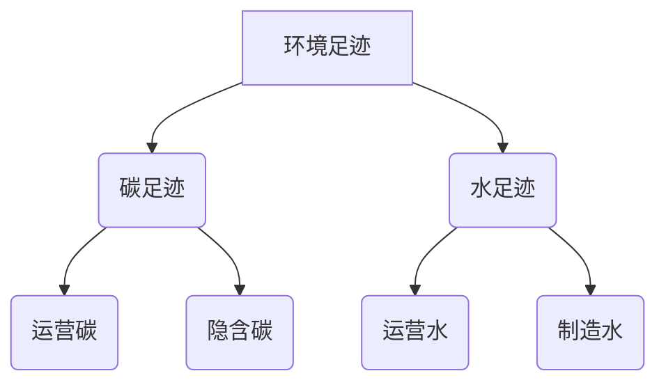
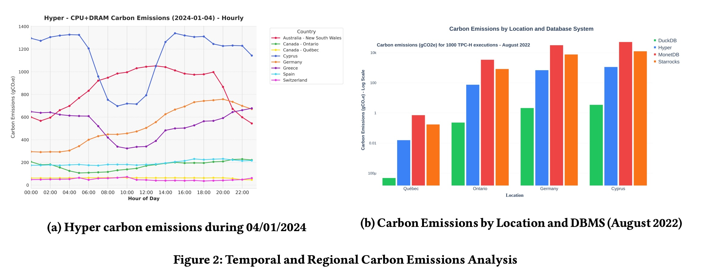
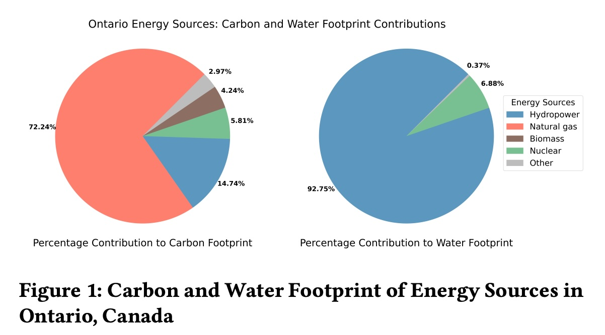
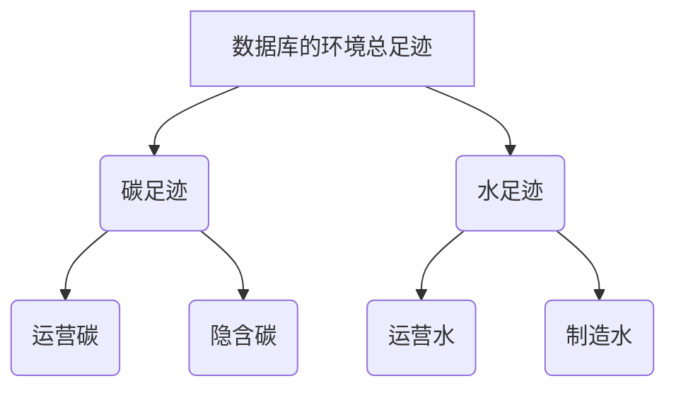
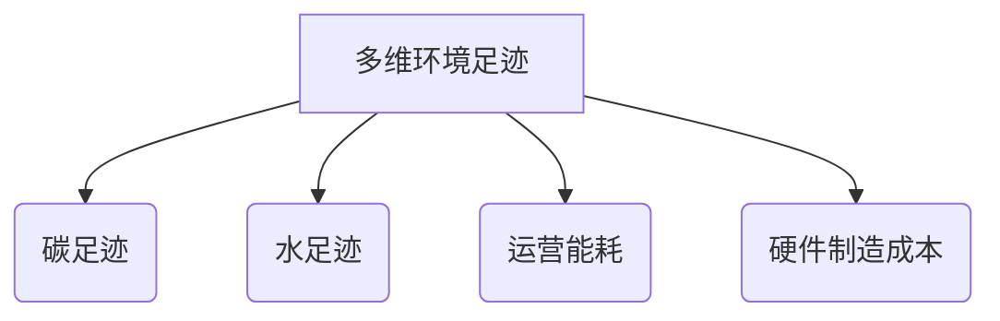
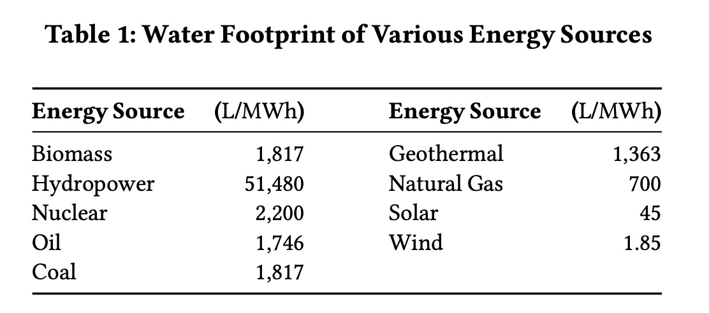

## AI论文解读 | Environmental Footprints of Query Processing: A Vision for Sustainable Database Architectures
        
### 作者        
digoal        
        
### 日期        
2025-11-14        
        
### 标签        
PostgreSQL , PolarDB , DuckDB , AI , 论文解读        
        
----        
        
## 背景  
      
https://www.vldb.org/pvldb/vol18/p4064-bachras.pdf        
  
提示:          
```          
读懂《Environmental Footprints of Query Processing: A Vision for Sustainable Database Architectures》这篇论文需要提前掌握哪些基础知识, 请使用中文通熟易懂的讲解这些基础知识, 可以引用论文中的图、表或使用Markdown支持的图形(text,mermaid等)增加解释性. 
  
使用中文通熟易懂的解读《Environmental Footprints of Query Processing: A Vision for Sustainable Database Architectures》这篇论文, 其中的关键内容请着重讲解, 可以引用论文中的图、表或使用Markdown支持的图形(text,mermaid等)增加解释性. 
  
提取《Environmental Footprints of Query Processing: A Vision for Sustainable Database Architectures》这篇论文中的重要术语, 使用中文对这些术语进行通熟易懂的讲解, 可以引用论文中的图、表或使用Markdown支持的图形(text,mermaid等)增加解释性. 
```     
  
## 1 前置知识 
  
理解这篇《Environmental Footprints of Query Processing: A Vision for Sustainable Database Architectures》论文 ，你需要掌握三大块基础知识：**数据库系统**、**环境可持续性**以及**IT基础设施**。

这篇论文的核心观点是：我们不能只关心数据库跑得多快（性能），还必须开始关心它在运行过程中消耗了多少资源（如电、水）以及产生了多少碳排放 。

下面我将用通俗易懂的语言为你讲解这些必备的基础知识。

-----

### 1\. 数据库系统 (DBMS) 基础

这篇论文探讨的是“查询处理”(Query Processing)  的足迹，所以你首先要懂数据库是怎么工作的。

**A. 什么是“查询处理”？**
简单说，就是你向数据库“提问”，数据库“回答”你的过程。例如，你点开购物网站，网站的数据库就需要执行一个查询：“找出这个用户的所有订单”。这个执行过程会消耗CPU、内存和硬盘资源 。

**B. 两种关键的工作负载：OLTP vs. OLAP**
论文提到了 ，数据库有两种非常不同的工作模式，理解它们的区别是读懂论文的关键：

  * **OLTP (在线事务处理):**

      * **特点:** 涉及大量、微小、频繁的“写入”操作。
      * **例子:** 银行转账、下订单、抢票。
      * **对硬件的影响:** 这类操作对 SSD (固态硬盘) 的“寿命”挑战很大，因为它会产生大量零碎的写入，导致一种叫“**写入放大**”(Write Amplification)  的问题，加速硬盘报废。

  * **OLAP (在线分析处理):**

      * **特点:** 涉及少量、但极其复杂和庞大的“读取”操作。
      * **例子:** 分析“过去五年全国所有门店的销售趋势”。
      * **对硬件的影响:** 这类操作需要从硬盘读取海量数据到内存中进行计算 ，对内存和I/O带宽的压力极大。

**C. 两种主要的存储硬件：HDD vs. SSD**
论文花了很多篇幅对比这两种硬盘 ：

  * **HDD (机械硬盘):** 像老式唱片机，有机械臂和旋转盘片。
      * **优点:** 每TB的“隐含碳”（制造碳排）较低 ，写入寿命几乎无限。
      * **缺点:** 运行中需要马达一直转，**运营能耗高** ，而且速度慢。
  * **SSD (固态硬盘):** 使用闪存芯片，没有机械部件。
      * **优点:** 速度极快，**运营能耗低** 。
      * **缺点:** **“隐含碳”极高**（论文指出其隐含碳是HDD的10倍），且有写入寿命限制（会“写死”）。

**知识点小结：** 数据库的不同工作模式 (OLTP/OLAP) 会对不同硬件 (HDD/SSD) 产生完全不同的压力，因此它们的“环境足迹”也完全不同。

-----

### 2\. 环境足迹 (Environmental Footprint) 核心概念

这篇论文的核心创新在于提出了“多维度”的环境足迹 。你需要理解，评估环境影响不只是看电费。



**A. 碳足迹 (Carbon Footprint)**

  * **运营碳 (Operational Carbon):**
      * **定义:** 数据库服务器**运行时**消耗电力所产生的碳排放 。
      * **关键知识点 (论文核心):** 运营碳**不是恒定的**。它取决于你**在何时** (Time)  和**何地** (Location)  用电。
      * **例子 (见论文图2):** 凌晨用电（风力发电多）可能比下午用电（火力发电多）更“绿色”。在法国（核电多）跑查询  就比在澳大利亚（煤电多） 碳排放低。    
  * **隐含碳 (Embodied Carbon):**
      * **定义:** 在服务器**制造、运输和废弃**过程中产生的碳排放 。
      * **关键知识点:** 这是一笔“隐藏成本”。即使服务器关机，这部分碳排也已经花掉了。
      * **例子:** 论文指出，随着电网变绿，“隐含碳”占总碳排的比例会越来越高 。频繁更换服务器（例如每3-4年） 是一种巨大的环境浪费。

**B. 水足迹 (Water Footprint)**

  * **运营水 (Operational Water):**
      * **定义:** 数据中心**冷却**  以及**发电**  所消耗的水。
      * **关键知识点:** 论文强调了**发电的水耗**。
  * **制造水 (Manufacturing Water):**
      * **定义:** 制造硬件（尤其是半导体芯片） 过程中需要消耗大量的超纯水 。

**C. 核心冲突：权衡 (Tradeoffs)**
这是理解论文的重中之重。**各种足迹之间是相互冲突的，你无法同时优化所有指标。**

  * **例子1 (论文图1):**    

      * 论文以加拿大安大略省为例 。
      * **天然气 (Natural gas):** 碳足迹高（占72%），但水足迹低（占6.8%）。
      * **水电 (Hydropower):** 碳足迹低（占14%），但水足迹极高（占82%）（因为水库蒸发）。
      * **结论:** 追求“低碳”可能会导致“高耗水”。

  * **例子2 (SSD vs. HDD):**

      * **SSD:** 运营能耗低（运营碳低），但隐含碳高 。
      * **HDD:** 运营能耗高（运营碳高），但隐含碳低 。
      * **结论:** 你是选择现在多花电（HDD），还是选择在制造时多排碳（SSD）？

-----

### 3\. IT 基础设施与数据中心

你需要了解现代计算的两个基本背景：

**A. 能源比例 (Energy Proportionality)**

  * **定义:** 这是一个理想状态，即“干10%的活，就只花10%的电” 。
  * **现实 (论文关键问题):** 现实是“**非**能源比例”的。论文指出，一台服务器**即使在空闲时，也会消耗其峰值功耗的50%以上** 。
  * **意义:** 这意味着“节能”的关键不仅是提高满载效率，更是要降低空闲时的能耗。

**B. 可调度工作负载 (Deferrable Workloads)**

  * **定义:** 不是所有的数据库任务都必须“立即”完成 。
  * **例子:** 批量分析、生成报表、数据备份、索引重建 。
  * **意义 (论文核心机遇):** 既然这些任务不紧急，我们就可以“**调度**”它们 。比如，把一个OLAP分析任务推迟到凌晨，或者挪到那个“用风电”的数据中心去执行 ，这样就能极大降低环境足迹。

### 总结

要读懂这篇论文，你需要带着以下三个核心问题：

1.  **数据库如何工作？** (OLTP vs. OLAP, SSD vs. HDD)
2.  **“足迹”如何衡量？** (运营碳/水 vs. 隐含碳/水)
3.  **我们有哪些优化的“抓手”？** (利用能源比例的缺陷、调度非紧急任务)

这篇论文正是在这三个知识的交集上，提出了一个“未来数据库应该同时关心性能与环保”  的新愿景。

希望这份基础知识指南对你有帮助！你希望我深入讲解这篇论文的某个具体部分吗？例如它的“硬件感知”或“软件感知”架构？
  
## 2 解读论文 
  
这是一篇极具前瞻性的“愿景”论文，它呼吁整个数据库行业进行一次思想上的根本转变：**不要只关心数据库跑得多快，还要关心它跑得有多“绿色”** 。

这篇名为《查询处理的环境足迹：可持续数据库架构的愿景》的论文，其核心观点是：随着数据量爆炸式增长，数据库系统对环境（能源、碳排放、水资源）的负面影响正变得日益严峻，而我们（包括学术界和工业界）对此几乎视而不见 。

作者认为，**可持续性（Sustainability）** 必须与性能、可扩展性等传统指标并列，成为数据库设计的“一等公民” 。

以下是这篇论文关键内容的通俗解读：

-----

### 1\. 核心问题：数据库的“多维度”环境账单

论文开宗明义，我们评估数据库的环境影响，绝不能只看“电费”。作者提出了一个“多维度”的足迹模型，这笔账必须算清楚。



  * **碳足迹 (Carbon Footprint)**

      * **运营碳 (Operational Carbon):** 指数据库服务器**运行时**消耗电力所产生的碳排放 。
      * **隐含碳 (Embodied Carbon):** 指制造、运输和废弃这些硬件（CPU、内存、硬盘）所产生的 **“隐藏”碳排放** 。

  * **水足迹 (Water Footprint)**

      * **运营水 (Operational Water):** 指数据中心**冷却**  和**发电**  所消耗的水。
      * **制造水 (Manufacturing Water):** 指制造硬件（尤其是半导体芯片）时消耗的大量淡水 。

-----

### 2\. 关键洞察：你无法“既要又要”的复杂权衡

这篇论文最具价值的观点是：**各种环境指标是相互冲突的，优化一个指标可能会导致另一个指标恶化** 。

#### 案例1：发电的碳与水 (论文图1)

论文以加拿大安大略省的能源结构为例，清晰地展示了这种冲突 。    

> **图1 解读：安大略省的能源足迹**  
>  
> * **左图 (碳足迹):** 天然气 (Natural gas) 是碳排放的主要来源 (占 72.24%) 。  
> * **右图 (水足迹):** 水电 (Hydropower) 却是水消耗的主要来源 (占 82.75%) （主要来自水库蒸发 ）。  
>  
> **结论：** 如果你为了“低碳”而切换到水电，你的“水足迹”就会飙升。  

#### 案例2：硬盘的“现在”与“未来” (SSD vs. HDD)

  * **HDD (机械硬盘):** 制造时的“隐含碳”较低，但运行时需要马达转动， **“运营能耗”高** 。
  * **SSD (固态硬盘):** 运行时非常省电（“运营能耗”低），但论文引用研究指出，SSD 存储机架每 TB 的 **“隐含碳”是 HDD 的 10 倍** 。

**权衡点：** 你是选择现在多花电（HDD），还是选择在制造时多排碳（SSD）？

#### 案例3：硬件的“快”与“省”

  * 使用专门的硬件加速器（如 FPGA）可以减少查询的“运营能耗” 。
  * **但是，** 制造这些“专用”组件会增加系统的“隐含碳” 。

-----

### 3\. 愿景方案（一）：硬件感知的可持续架构

作者提出，数据库必须了解底层硬件的“环境特性”，尤其是存储。

**挑战：SSD 的“写入寿命”**
SSD（固态硬盘）有写入次数限制，容易“写死” 。不同的数据库工作负载会加剧这个问题：

  * **OLTP (交易型负载，如买票、下单):** 产生大量、零碎的随机写入，导致“写入放大”，极大缩短 SSD 寿命 。
  * **OLAP (分析型负载，如生成报表):** 产生大量临时数据，这些数据被写入存储，同样会加速 SSD 磨损 。

**解决方案：存储感知的数据库**
作者设想，未来的数据库查询优化器不应只考虑“I/O 成本”，还应**将“存储老化效应”（aging effect）纳入成本模型** 。

> **通俗地说：**
> 如果一个查询计划会“狂写”SSD 导致其“折寿”，哪怕它快一点点，优化器也应该“惩罚”这个计划，转而选择一个对 SSD 更友好的（磨损更小）执行路径。

-----

### 4\. 愿景方案（二）：软件感知的可持续架构

这是论文提出的另一个核心解决方案：在软件层面（调度和执行）实现“绿色”。

#### A. 解决“能源非比例”问题

  * **理想状态 (能源比例):** 干 10% 的活，只用 10% 的电 。
  * **残酷现实 (能源非比例):** 论文指出，服务器**即使在空闲时，也会消耗其峰值功耗的 50% 以上** 。

**解决方案：** 数据库软件必须能主动与硬件协作，在低负载时动态调整资源（如CPU频率、关闭部分内存），而不是把硬件当成“永远在线”的资源 。

#### B. 利用“可调度”的灵活性

这是最巧妙的设想。作者发现，数据库负载天然具有灵活性。

1.  **环境的波动性：** 电网的“清洁度”（碳强度）每时每刻、每个地区都不同 。例如，风力发电多的夜晚通常比火力发电多的下午更“绿色”。

      * **论文图 2a** 就展示了**同一个数据库任务** (Hyper TPC-H) 在不同时间、不同国家运行的碳排放差异巨大 。    

2.  **负载的灵活性：** 数据库任务**并非都十万火急** 。

      * **必须立即执行：** OLTP 交易（如支付）。
      * **可推迟执行 (Deferrable)：** 大量的批量查询、报表生成、索引重建、数据备份等 。

**解决方案：环境感知的工作负载调度 (Environmentally-Aware Scheduling)**
作者的愿景是，数据库系统应该像谷歌的“碳智能”平台一样 ：

> 建立一个“环境感知调度器”，它能实时“看天”（预测电网的碳强度和水资源压力），然后**智能地将那些“不着急”的数据库任务，推迟到最“绿色”的时间（如深夜）或调度到最“绿色”的数据中心去执行** 。

-----

### 5\. 面临的主要挑战

作者也坦率地指出了实现这一愿景的巨大障碍：

1.  **缺乏透明度：** 硬件制造商（如 Intel、三星） **不公开** 其组件的“隐含碳”和“制造水”数据 。这导致研究“无米之炊”。
2.  **缺乏标准：** 电网碳强度的计算方法在不同国家和地区一团乱麻，标准不统一 。
3.  **缺乏基准：** 数据库界只有 TPC-H 等“性能”基准，**完全没有公认的“环境”基准** 。没有标准，就无法衡量进步。

### 总结

这篇论文描绘了一个数据库行业的未来：系统设计者不仅是性能工程师，还必须是“环境成本会计师”。通过在硬件和软件层面（从存储意识到智能调度）的根本性重构，数据库系统才能在数据爆炸的时代实现真正的可持续发展 。

您希望我进一步详细解释论文中的特定技术（例如 CXL、MotherDuck）是如何与这个愿景相关联的吗？
  
## 3 术语 
  
很高兴为您解读这篇论文中的关键术语。这篇论文的核心是呼吁数据库行业关注并优化其“环境账单”，而这笔账远比“电费”要复杂。

以下是理解这篇论文所需掌握的核心术语：

-----

### 1\. 核心环境概念

这些术语是论文的基石，定义了需要衡量的“环境账单”。

#### ▷ 多维环境足迹 (Multidimensional Environmental Footprint)

**通俗讲解：**
这不是一个单一的指标，而是评估数据库环境影响的“组合拳”。传统上，大家只关心“能耗” ，但这篇论文强调，我们必须**同时**考虑多个维度，才能全面了解其真实影响 。



#### ▷ 运营碳 (Operational Carbon) vs. 隐含碳 (Embodied Carbon)

**通俗讲解：**
这是“碳足迹”的两个关键组成部分 ，区分它们至关重要：

  * **运营碳 (Operational Carbon):**

      * 指数据库服务器在**运行时**因消耗电力而产生的碳排放 。
      * **关键点：** 它的大小取决于你**何时**（白天还是半夜）和**何地**（用火电还是水电）运行查询 。

  * **隐含碳 (Embodied Carbon / Scope 3):**

      * 指硬件在**被制造、运输和废弃**过程中“隐藏”的碳排放 。
      * **关键点：** 论文强调，这是一笔巨大的“前期投入”。即使服务器关机，这部分碳排放也已经花掉了 。随着电网变绿（运营碳下降），“隐含碳”在总碳排中的占比会越来越高 。

#### ▷ 水足迹 (Water Footprint)

**通俗讲解：**
衡量数据库对水资源的影响，同样分为两个维度 ：

  * **运营水 (Operational Water):**

      * 主要来自两个方面：1) 数据中心的**冷却系统** ；2) **发电** 。
      * **关键点：** 论文的 **表1 (Table 1)**  清晰地显示了不同能源的耗水差异。例如，水电 (Hydropower) 看起来很“清洁”（低碳），但它的耗水量（51,480 L/MWh）是风电 (Wind)（1.85 L/MWh）的数万倍 。    

  * **制造水 (Manufacturing Water):**

      * 指制造硬件（尤其是半导体芯片 ）过程中消耗的大量淡水 。

#### ▷ 环境足迹的权衡 (Tradeoffs)

**通俗讲解：**
这是论文的一个核心洞察：**各种环境指标是相互冲突的，你无法同时优化所有指标** 。

  * **例子1 (论文图1):**

      * 论文使用 **图1 (Figure 1)**  展示了安大略省的能源结构：    
      * **天然气 (Natural gas):** 碳足迹高 (占72.24%)，但水足迹低 (占6.87%) 。
      * **水电 (Hydropower):** 碳足迹低 (占14.34%)，但水足迹极高 (占82.75%) 。
      * **结论：** 追求“低碳”可能会导致“高耗水”。

  * **例子2 (SSD vs. HDD):**

      * **SSD (固态硬盘):** 运行时省电（运营能耗低），但其“隐含碳”远高于 HDD（机械硬盘） 。
      * **结论：** 你是选择现在多花电（HDD），还是选择在制造时多排碳（SSD）？。

-----

### 2\. 数据库特定概念

这些术语是数据库领域的老问题，但在“可持续性”的视角下有了新含义。

#### ▷ OLTP vs. OLAP (工作负载)

**通俗讲解：**
两种典型的数据库工作模式，它们对环境的“破坏”方式不同：

  * **OLTP (在线事务处理):**

      * **例子：** 银行转账、下订单、抢票。
      * **特点：** 涉及大量、微小、频繁的**写入**操作 。
      * **环境影响：** 这类操作会严重缩短 SSD 的“写入寿命”，导致“隐含碳”增加（因为需要更频繁地更换硬盘）。

  * **OLAP (在线分析处理):**

      * **例子：** 分析“过去五年的销售报表”。
      * **特点：** 涉及对海量数据的复杂**读取**和计算 。
      * **环境影响：** 这类操作是“计算密集型”和“I/O密集型”，会消耗大量电力，产生高额“运营碳”和“运营水”。

#### ▷ 写入放大 (Write Amplification)

**通俗讲解：**
这是 SSD（固态硬盘）的一个“毛病”，在 OLTP 负载下尤其严重 。

  * **含义：** 当你告诉 SSD 写入 1KB 的数据时，它内部可能需要读取和重写一个 4MB 的大“块” 。
  * **环境影响：** 这会急剧放大实际的写入量，导致 SSD 磨损加快（“折寿”），从而显著增加系统的**隐含碳**（因为硬件更换更频繁）。

-----

### 3\. 解决方案愿景术语

这些术语是论文提出的、实现“可持续数据库”的设想路径。

#### ▷ 能源比例 (Energy Proportionality)

**通俗讲解：**
这是一个理想的“节能”状态，即“干10%的活，只用10%的电” 。

  * **现实：** 论文指出，现实是“**非**能源比例”的。一台服务器**即使在空闲时，也会消耗其峰值功耗的一半以上** 。
  * **目标：** 论文呼吁数据库软件必须能与硬件深度协作，在低负载时有效“降功耗”，而不是白白浪费电 。

#### ▷ 环境感知的工作负载调度 (Environmentally-Aware Workload Scheduling)

**通俗讲解：**
这是论文提出的最核心、最巧妙的解决方案之一：**让数据库学会“看天”和“挑活儿”** 。

  * **“看天”：** 电网的“清洁度”（碳强度 ）和“水资源压力”  是实时波动的。
  * **“挑活儿”：** 数据库任务并非都十万火急。有很多 **“可推迟的” (Deferrable) 操作** （如批量分析、数据备份、索引重建 ）。
  * **调度：** 调度器可以将那些“不着急”的任务，智能地推迟到**电网最“绿色”的时间**（如深夜），或调度到**最“绿色”的数据中心**去执行 。
  * **佐证 (论文图2):** 论文的 **图 2a 和 2b**  清晰地显示了，**同一个查询**，仅仅因为执行的**时间**或**地点**不同，其碳排放量就有天壤之别 。    

#### ▷ 存储感知设计 (Storage-conscious design)

**通俗讲解：**
让数据库“懂”硬盘，尤其是“心疼” SSD 的寿命 。

  * **目标：** 数据库的查询优化器不应只考虑“I/O 速度”，还必须考虑操作对存储介质的“**老化效应**” (aging effect) 。
  * **做法：** 比如，优化器可以选择一个“稍微慢一点，但写入量小很多”的执行计划，以换取 SSD 更长的使用寿命，最终降低系统的总“隐含碳” 。

希望这份术语讲解能帮助您更好地理解这篇论文的核心思想。您是否希望我根据这些术语，帮您总结一下论文的主要贡献？
  
## 参考        
         
https://www.vldb.org/pvldb/vol18/p4064-bachras.pdf    
        
<b> 以上内容基于DeepSeek、Qwen、Gemini及诸多AI生成, 轻微人工调整, 感谢杭州深度求索人工智能、阿里云、Google等公司. </b>        
        
<b> AI 生成的内容请自行辨别正确性, 当然也多了些许踩坑的乐趣, 毕竟冒险是每个男人的天性.  </b>        
    
#### [PolarDB 学习图谱](https://www.aliyun.com/database/openpolardb/activity "8642f60e04ed0c814bf9cb9677976bd4")
  
  
#### [PostgreSQL 解决方案集合](../201706/20170601_02.md "40cff096e9ed7122c512b35d8561d9c8")
  
  
#### [德哥 / digoal's Github - 公益是一辈子的事.](https://github.com/digoal/blog/blob/master/README.md "22709685feb7cab07d30f30387f0a9ae")
  
  
#### [About 德哥](https://github.com/digoal/blog/blob/master/me/readme.md "a37735981e7704886ffd590565582dd0")
  
  

  
