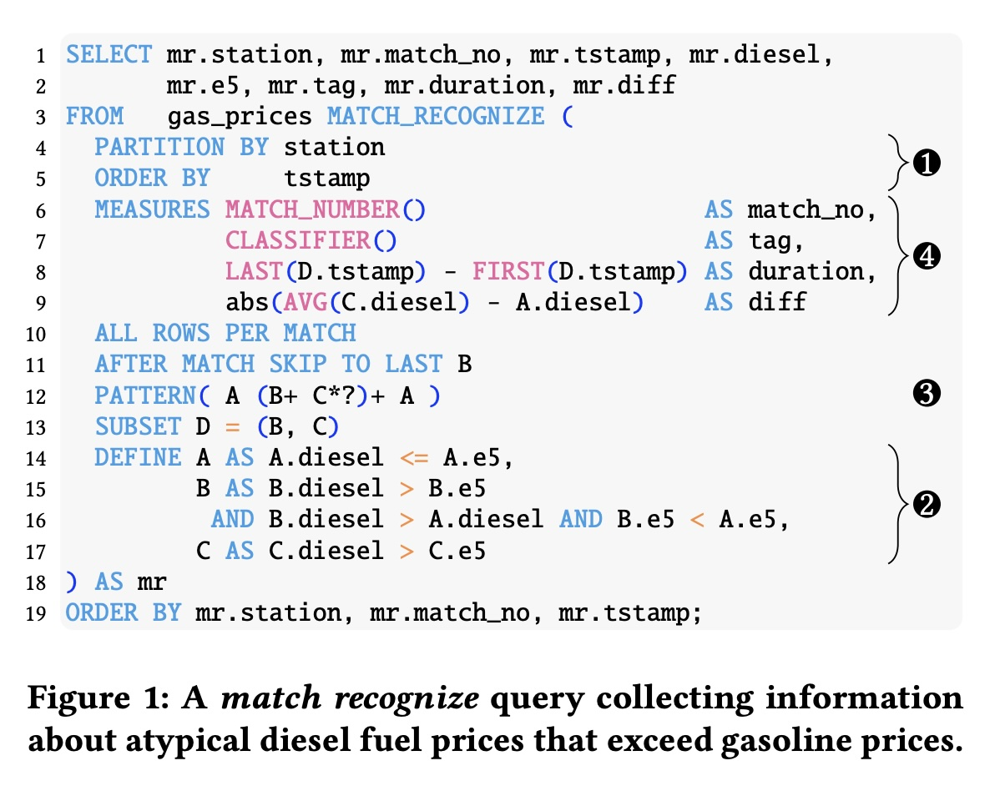
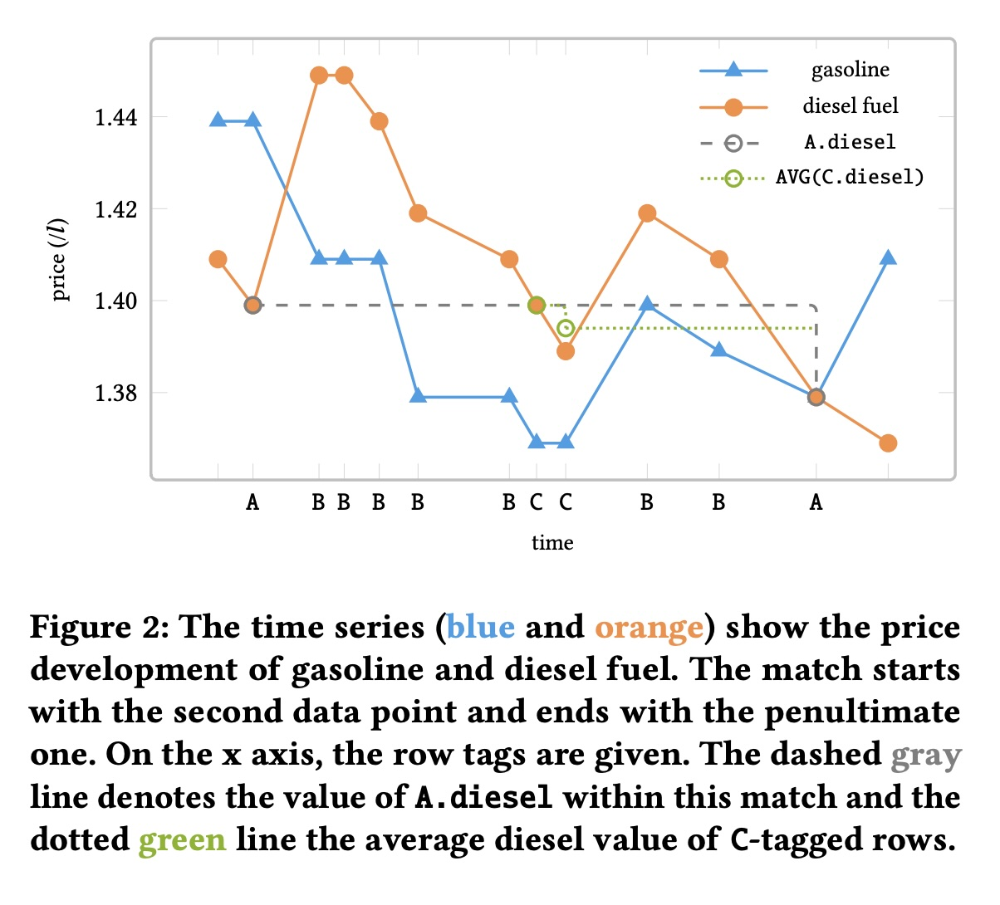
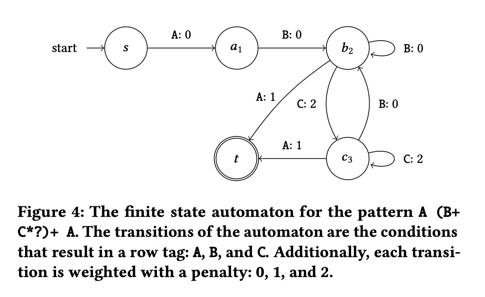
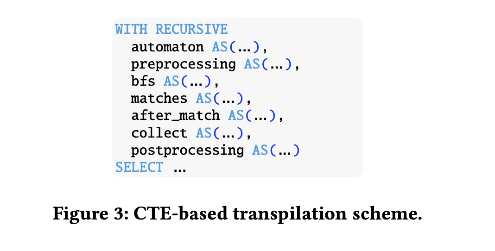
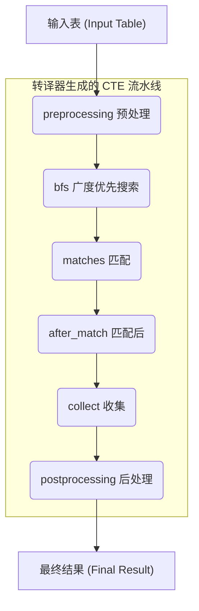
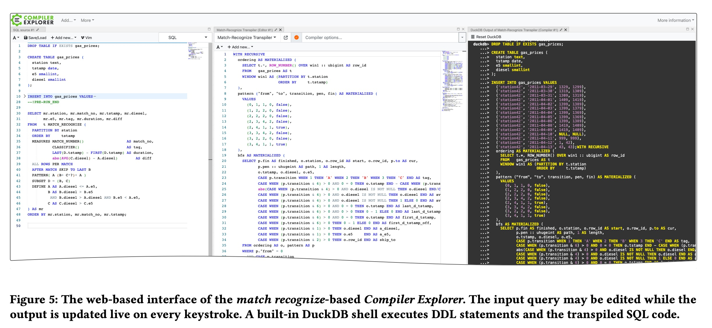

## AI论文解读 | Democratize MATCH_RECOGNIZE
        
### 作者        
digoal        
        
### 日期        
2025-11-14        
        
### 标签        
PostgreSQL , PolarDB , DuckDB , AI , 论文解读        
        
----        
        
## 背景  
      
https://www.vldb.org/pvldb/vol18/p5251-lambrecht.pdf        
  
提示:          
```          
读懂《Democratize MATCH_RECOGNIZE》这篇论文需要提前掌握哪些基础知识, 请使用中文通熟易懂的讲解这些基础知识, 可以引用论文中的图、表或使用Markdown支持的图形(text,mermaid等)增加解释性. 
  
使用中文通熟易懂的解读《Democratize MATCH_RECOGNIZE》这篇论文, 其中的关键内容请着重讲解, 可以引用论文中的图、表或使用Markdown支持的图形(text,mermaid等)增加解释性. 
  
提取《Democratize MATCH_RECOGNIZE》这篇论文中的重要术语, 使用中文对这些术语进行通熟易懂的讲解, 可以引用论文中的图、表或使用Markdown支持的图形(text,mermaid等)增加解释性. 
```     
  
## 1 前置知识 
  
要深入理解《Democratize MATCH\_RECOGNIZE!》这篇论文，你需要对数据库和计算机科学的一些核心概念有基本的了解。这篇论文的核心思想是 **将一个高级但很少被支持的SQL功能（`MATCH_RECOGNIZE`），“翻译”成任何现代数据库都支持的、更基础的SQL功能（主要是递归CTE和窗口函数）** 。

以下是你需要提前掌握的基础知识，我会用通俗的语言来解释：

### 1. 核心SQL特性 (Advanced SQL)

这篇论文的“翻译”结果严重依赖以下两个SQL高级特性：

* **窗口函数 (Window Functions)**
    * **是什么？** 想象一下你有一张全班同学的成绩单。普通函数（如 `AVG()`）只能告诉你全班的平均分。而窗口函数允许你进行更复杂的操作，比如：“计算每个学生的成绩与他/她所在小组平均成绩的差距”，或者“计算每个学生的班级排名”。
    * **为什么重要？** 论文中提到，窗口函数被用于预处理数据 ，例如使用 `ROW_NUMBER()`  来为数据行创建唯一的、有序的ID。这对于后续的模式匹配至关重要。

* **递归通用表表达式 (Recursive Common Table Expressions - CTEs)**
    * **是什么？** CTEs（以 `WITH` 关键字开头）就像是SQL查询中的临时“变量”或“中间步骤” 。而“递归”CTE则是一种特殊的CTE，它可以“自己调用自己”，直到满足某个停止条件。
    * **通俗比喻：** 想象一下你要在公司组织架构中找到一个经理手下的所有员工（包括员工的员工，以此类推）。递归CTE就是干这个的：第一步找到经理的直接下属，第二步找到这些下属的下属……循环往复，直到找到所有最底层的员工。
    * **为什么重要？** **这是本文实现的核心机制**。论文明确指出，他们使用递归CTE来驱动一个“有限状态自动机” ，一步一步地、一行一行地“遍历”数据，以模拟 `MATCH_RECOGNIZE` 的匹配过程 。

### 2. `MATCH_RECOGNIZE` 语法基础

要看懂论文在“翻译”*什么*，你得先了解 `MATCH_RECOGNIZE` 是*什么*。它是SQL中用于“行模式匹配”（Row Pattern Matching）的利器 。

想象一下你在分析时间序列数据（比如股票价格或论文中图1和图2的油价 ），你想找到一个特定的“V”字形反转模式。`MATCH_RECOGNIZE` 就是用来做这个的。      

你需要了解它的几个关键子句（论文的**图1**  就是一个绝佳的例子）：

* `PARTITION BY station`：**分区** 。告诉数据库“请把数据按加油站分开，在每个加油站内部独立寻找模式” 。
* `ORDER BY tstamp`：**排序** 。告诉数据库在每个分区内，按时间戳顺序来分析数据 。模式匹配必须在有序数据上进行。
* `PATTERN (A (B+ C*?)+ A)`：**定义模式** 。这是核心，它使用“正则表达式”来定义你要找的模式 。
    * `A`：代表一个事件A。
    * `B+`：代表**一个或多个**事件B（`+` 是“贪婪”匹配，即尽可能多地匹配B）。
    * `C*?`：代表**零个或多个**事件C（`*` 是零或多个，`?` 代表“懒惰”匹配，即尽可能少地匹配C）。
    * `()+`：代表括号内的模式（B或C）至少出现一次。
    * **整体含义**：寻找一个以A开始，中间经历了一段B或C（B优先），最后又以A结束的序列 。
* `DEFINE A AS ..., B AS ..., C AS ...`：**定义标签** 。这里定义了什么样的行算是A、B或C 。比如在图1中，`DEFINE A AS A.diesel > A.e5`  意思是“当柴油价格(diesel)高于汽油价格(e5)时，这行就被标记为A”。
* `MEASURES ...`：**计算结果** 。当一个模式被成功匹配后，你希望从中计算出什么值 。例如，图1中的 `duration`  就是用来计算这个“价格异常”持续了多久。

### 3. 计算机科学基础 (CS Fundamentals)

这篇论文的“翻译”策略是基于一个经典的CS理论：

* **有限状态自动机 (Finite State Automaton - FSA)**
    * **是什么？** 它是一个数学模型，可以用来“识别”特定的序列或模式。它由一组“状态”（State）和“转换”（Transition）组成。
    * **论文中的应用：** 论文的**图4**  就是一个FSA。    
        * 圆圈（如 `s`, `a1`, `b2`, `t`）代表**状态**（比如 `s` 是“开始”，`t` 是“匹配成功”）。
        * 箭头（如 `A: 0`, `B: 0`）代表**转换** 。
    * **为什么重要？** 论文的“翻译器”会读取用户写的 `PATTERN`（如 `A (B+ C*?)+ A`），并自动构建出图4这样的FSA 。然后，上文提到的“递归CTE”就被用来“驱动”这个FSA：每读入一行新数据，就看它满足A、B还是C的条件，然后让FSA顺着箭头走到下一个状态。当FSA最终到达 `t` 状态时，就意味着一个模式被成功找到了。

* **搜索算法 (BFS vs. DFS) 和 “权重/惩罚”**
    * 论文提到，在匹配模式时（特别是处理 `B+` 和 `C*?` 这样的贪婪/懒惰匹配时），存在多种可能的匹配方式 。
    * SQL的递归CTE天然适合**广度优先搜索 (BFS)** ，即同时探索所有可能的匹配路径。
    * 但 `MATCH_RECOGNIZE` 标准要求的是一种**深度优先搜索 (DFS)** 的结果 。
    * **论文的巧思：** 它们为自动机（图4）的每条转换路径增加了“惩罚值”（Penalty，如图中的 `A: 0`, `A: 1`, `C: 2`）。贪婪的匹配（如`B+`）惩罚值最低（如0），懒惰的匹配（如`C*?`）惩罚值更高 。
    * **最终**：它们用BFS找到了所有可能的匹配 ，然后从中挑选出那条“总惩罚值最低”的路径 ，从而模拟出了标准所要求的DFS结果 。

---

### 总结

要读懂这篇论文，你不需要是每个领域的专家，但你需要具备：

1.  **SQL基础：** 知道什么是窗口函数（用于数据准备）和递归CTE（用于驱动匹配）。
2.  **`MATCH_RECOGNIZE`概念：** 知道它想解决什么问题（模式匹配），并理解 `PATTERN` 和 `DEFINE` 是如何协同工作的。
3.  **CS理论：** 理解“自动机”（FSA）是如何被用来识别模式的（如图4所示）。  

理解了这些，你就能明白论文的作者是如何巧妙地用 **递归CTE** 来“模拟”一个 **FSA** 的运行，从而在任何支持CTE的数据库上实现了强大的 `MATCH_RECOGNIZE` 功能。

希望这个解释对你有帮助！
  
## 2 解读论文 
  
这是一篇非常有趣且具有重大工程意义的论文。简单来说，**这篇论文的核心贡献是创建了一个“翻译器”，能将一种非常强大但很少有数据库支持的高级SQL功能（`MATCH_RECOGNIZE`），自动“翻译”成几乎所有现代数据库都能运行的普通SQL代码。**

这真正实现了论文标题所说的“Democratize”（大众化），让这个强大的功能不再是少数数据库的“专利”。

下面我们来通俗地分解这篇论文的关键内容。

### 🎯 1. 问题：什么是 `MATCH_RECOGNIZE`？为什么它需要“大众化”？

`MATCH_RECOGNIZE` 是 2016 年被加入 SQL 标准的一项功能 。它是一种强大的“行模式匹配” (Row Pattern Matching) 工具 。

**通俗解释：**
想象你有一个数据表，里面是按时间排序的股票价格。你想找到一个“W”形态（价格下跌 -\> 上涨 -\> 下跌 -\> 再次上涨）的模式。或者像论文中的例子一样，你想在燃油价格时间序列数据中，找到“柴油价格（diesel）反常地超过汽油价格（gasoline）”的特定时间段 。

用传统的 SQL（比如 `GROUP BY` 或 `JOIN`）来写这种查询会非常复杂，甚至不可能。但 `MATCH_RECOGNIZE` 允许你像写正则表达式一样，在“行”的序列中定义一个模式 。

**问题在于：**
尽管这个功能非常强大（尤其在金融、安全、时序数据分析领域），但将近十年过去了，**绝大多数的数据库系统（DBMS）都不支持它** 。只有像 Oracle、Snowflake、Trino 等少数系统实现了 。

这就是论文要解决的痛点：**功能虽好，但用不了。**

-----

### 💡 2. 方案：造一个“翻译器” (Transpiler)

作者没有去修改数据库的底层内核（这太难了），而是另辟蹊径：他们开发了一个 **“转译器” (Transpiler)** 。

> **转译器 (Transpiler) **。
> 它是一种特殊的编译器，把一种高级语言（A）的代码，翻译成另一种同级别的高级语言（B）的代码。  
>  
> **在本文中：**  
>  
>   * **输入 (A)：** 包含 `MATCH_RECOGNIZE` 子句的 SQL 查询。  
>   * **输出 (B)：** 不含 `MATCH_RECOGNIZE`，但功能完全等价的“普通 SQL”代码。  

这个“普通 SQL”依赖两个几乎所有现代数据库都支持的成熟功能：

1.  **递归公用表表达式 (Recursive CTEs)**：即 `WITH RECURSIVE` 语句，擅长处理迭代和遍历。
2.  **窗口函数 (Window Functions)**：即 `OVER (...)` 语句，擅长在数据行之间进行计算。

**核心思想：** 既然目标数据库（比如论文中用的 DuckDB ）支持这两者，那么就可以把 `MATCH_RECOGNIZE` 的逻辑“模拟”出来 。

-----

### ⚙️ 3. 关键技术：它是如何“翻译”的？

这是论文最核心的部分。转译器会生成一个由多个 CTE 组成的“流水线” (Pipeline) 。

你可以把这个过程想象成一个工厂流水线，原始数据（`gas_prices` 表） 进来，经过一步步处理，最后输出符合 `MATCH_RECOGNIZE` 要求的结果。

**第一步：将模式(Pattern)转译为“自动机”**

`MATCH_RECOGNIZE` 的核心是 `PATTERN` 子句，比如论文例子中的 `PATTERN(A (B+ C*?)+ A)` 。这本质上是一个正则表达式。

翻译器会把这个正则表达式转换成一个 **“有限状态自动机” (Finite State Automaton)** 。你可以把它理解为一张“寻路地图”。

**参考论文中的图 4 ：** 这张图显示了模式 `A (B+ C*?)+ A` 被转换成的状态机。

  * 从 `s` 状态（起点）开始 。
  * 匹配一个 `A`，进入 `a1` 状态。
  * 接着匹配 `B`，进入 `b2` 状态。
  * ...
  * 最终如果能到达 `t` 状态（终点），就说明找到了一个完整的匹配。

**第二步：构建 CTE 流水线 (参考图 3 )**    

翻译器生成的 SQL 代码是一个长长的 `WITH` 语句，包含多个步骤。我们可以用下面的流程图来简化理解：



1.  **`preprocessing` (预处理):** 使用窗口函数 `ROW_NUMBER()` 给每一行数据一个唯一的ID (`rid`) 和分区号 。这是后续步骤的基础。
2.  **`bfs` (广度优先搜索):** **这是最核心的一步**。使用**递归 CTE** 来驱动上面那个“自动机” 。它会遍历所有可能的路径，找出 *所有* 可能的匹配 。
3.  **`matches` (匹配):** 筛选 `bfs` 的结果。
4.  **`after_match` (匹配后):** 处理 `AFTER MATCH SKIP` 子句的逻辑 （比如找到一个匹配后，是从下一行开始，还是跳到匹配的末尾再开始）。
5.  **`collect` (收集):** 如果用户要的是 `ALL ROWS PER MATCH`（匹配中的所有行），这一步就负责把所有相关的行都捞出来。
6.  **`postprocessing` (后处理):** 清理掉中间步骤的辅助列（比如 `rid`、`path` 等），只保留用户 `SELECT` 的列，伪装成 `MATCH_RECOGNIZE` 的原始输出 。

-----

### 🏅 4. 关键难点与“神来之笔”：BFS vs. DFS

论文解决了一个大难题：`MATCH_RECOGNIZE` 标准要求的匹配逻辑是“贪婪优先”的（类似深度优先搜索 DFS），它需要找到 *特定* 的那一个匹配 。但 SQL 的递归 CTE 天然适合做**广度优先搜索 (BFS)** ，即找出 *所有* 匹配。

**作者的妙招：引入“惩罚” (Penalties)** 

  * 他们修改了自动机（图 4），给每条路径（A, B, C）一个“惩罚值” 。    
  * 例如，贪婪的 `B+` 惩罚为 0，而“懒惰”的 `C*?` 惩罚为 2 。
  * **第 1 步 (BFS)：** 递归 CTE 会找到 *所有* 路径，并计算每条完整路径的“总惩罚” 。
  * **第 2 步 (DFS)：** 在 `matches` 步骤中，他们用一个 `arg_min` 操作（选取最小值），**只选择那条“总惩罚”最低的路径** 。
  * 通过这种方式，他们巧妙地用 SQL (BFS) 实现了 `MATCH_RECOGNIZE` 的 (DFS) 匹配逻辑。

-----

### 🚀 5. 惊人的结果：性能

你可能以为这种“翻译”过来的 SQL 代码会很慢，毕竟它看起来那么复杂。但结果出人意料。

作者做了一个对比测试 ：

  * **数据集：** 约 7100 万行德国加油站价格数据 。
  * **A 组 (原生)：** 在 **Trino** 数据库上运行原生的 `MATCH_RECOGNIZE` 查询。
  * **B 组 (转译)：** 在 **DuckDB** 上运行这篇论文“翻译”后的递归 CTE 代码。

**结果：**

  * Trino (原生) 跑了 **426 秒** 。
  * DuckDB (转译) 只跑了 **40 秒** 。

**转译后的代码竟然比原生实现快了10倍！**  这证明了这种转译方法不仅可行，而且效率高得惊人。

-----

### 🖥️ 6. 演示（图 5）

为了直观展示成果，他们做了一个网页版的“编译器浏览器”（见论文图 5）。    

  * **左边窗口：** 用户输入简单的 `MATCH_RECOGNIZE` 查询 。
  * **右边窗口：** **实时**显示转译器自动生成的、超级复杂的递归 CTE 代码 。
  * 甚至还内置了一个 DuckDB ，让用户可以立即执行转译后的代码，查看结果。

### 总结

这篇论文是一个非常漂亮的工程范例。它没有钻牛角尖去修改数据库内核，而是通过一个聪明的“转译器”，将一个高级、复杂、小众的功能，成功地“降维打击”，用最常见、最基础的 SQL 功能（递归 CTE 和窗口函数）给“拼”了出来。

这不仅让 `MATCH_RECOGNIZE` 真正实现了“大众化” ，而且其性能甚至超越了原生实现 ，为其他高级 SQL 功能的“下放”提供了一条绝佳的思路。
  
## 3 术语 
  
根据《Democratize MATCH\_RECOGNIZE\!》这篇论文，以下是其中关键术语的通俗解读。

-----

### 1\. `MATCH_RECOGNIZE` (行模式匹配)

这是论文的核心主题，一个强大但很少被数据库实现的 SQL 功能 。

  * **通俗讲解：**
    想象你有一张按时间排序的数据表（比如股票价格、加油站油价）。`MATCH_RECOGNIZE` 就像是为这些“行”序列准备的“正则表达式” 。

    你不用复杂的 `JOIN` 或 `GROUP BY`，而是可以直接“画”出一个你想要的模式，然后让数据库帮你找出来。

  * **论文中的例子 (图 1)：**     
    该论文的示例查询就是用 `MATCH_RECOGNIZE` 来查找一个“反常”的价格模式 。这个模式被定义为 `PATTERN(A (B+ C*?)+ A)` 。

      * **A：** 柴油（diesel）价格 \> 汽油（e5）价格的开始点 。
      * **B/C：** 柴油价格持续高于汽油价格的中间时段 。
      * **A：** 柴油价格 \> 汽油价格的结束点 。

    这个功能允许你在数据序列中检测复杂的事件，例如金融欺诈（W型股价）、物联网传感器异常等 。

-----

### 2\. 转译器 (Transpiler)

这是论文作者实现“大众化”的**核心解决方案**。

  * **通俗讲解：**
    转译器就像一个“翻译官” 。但它不是把中文翻译成英文，而是把一种计算机语言（“源语言”）翻译成另一种计算机语言（“目标语言”）。

    在这篇论文中：

      * **源语言：** 含有 `MATCH_RECOGNIZE` 的高级 SQL 查询（很少数据库支持）。
      * **目标语言：** 只使用“普通” SQL 的查询，特别是递归 CTE 和窗口函数（几乎所有数据库都支持）。

    **最终目的：** 让那些“看不懂” `MATCH_RECOGNIZE` 的数据库（如 DuckDB ），也能执行“翻译”后的普通 SQL 代码，实现完全相同的功能。

-----

### 3\. 递归公用表表达式 (Recursive CTEs)

这是“翻译”后的 SQL 代码所依赖的**两大基石之一** 。

  * **通俗讲解：**
    CTE (公用表表达式) 本身就是 `WITH ... AS (...)` 语句。而“递归”(Recursive) CTE 是一种特殊的 `WITH`，它允许你进行迭代或“循环”计算。

      * 它非常适合一步一步地处理序列数据。
      * 在本文中，递归 CTE 就像一个“引擎”，它驱动着“有限状态自动机”（见下文）运行 。它会一行一行地读取数据，并根据规则（`DEFINE`）判断是进入下一个状态（比如从 A 到 B）还是保持当前状态（比如 B 到 B）。

-----

### 4\. 窗口函数 (Window Functions)

这是“翻译”后的 SQL 代码所依赖的**两大基石之二** 。

  * **通俗讲解：**
    窗口函数（标志是 `OVER (...)` 子句）允许你在“当前行”上执行计算，同时还能“看到”它前后的其他行，而不需要改变表的总行数。

      * 在本文中，它主要用于“预处理”(`preprocessing`) 步骤 。
      * 例如，转译器做的第一件事就是使用窗口函数 `ROW_NUMBER()` 给所有行打上一个唯一的行号 `rid` 。这对于后续的序列匹配至关重要。

-----

### 5\. 有限状态自动机 (Finite State Automaton, NFA)

这是转译器内部的**核心匹配逻辑**。

  * **通俗讲解：**
    当你写下 `PATTERN(A (B+ C*?)+ A)` 这样的模式时 ，转译器会把它在内部转换成一张“流程图”或“寻路地图”，这就是“自动机” 。

  * **参考论文中的图 4：**       
    这张图就是 `A (B+ C*?)+ A` 对应的自动机 。

      * `s` 是“起点”状态 。
      * `t` 是“终点”（接受）状态。
      * 箭头（转换）代表“当满足某个条件（A, B, C）时，就从一个状态跳到下一个状态” 。

    翻译后的递归 CTE 代码，实际上就是在 SQL 里模拟这张“地图”的寻路过程 。

-----

### 6\. CTE 流水线 (CTE Pipeline)

这是转译器生成的“普通 SQL”代码的**整体架构** 。

  * **通俗讲解：**
    转译器不会生成一个巨大而混乱的查询，而是生成一系列（多个） `WITH` 语句，它们像工厂流水线一样协同工作 。数据在每一步 CTE 中被加工一次，直到最后输出结果。

  * **论文中的图 3 展示了这条流水线：**      

    ```mermaid
    graph TD
        A[输入表] --> B(preprocessing 预处理);
        B --> C(bfs 广度优先搜索/匹配);
        C --> D(matches 筛选匹配);
        D --> E(after_match 处理匹配后逻辑);
        E --> F(collect 收集所有行);
        F --> G(postprocessing 后处理);
        G --> H[最终 SELECT];
    ```

      * **preprocessing:** 使用窗口函数添加行号 `rid` 。
      * **bfs:** 使用递归 CTE 运行自动机，找出 *所有* 可能的匹配 。
      * **matches & after\_match:** 根据规则（例如“惩罚”，见下文）筛选出正确的匹配，并处理匹配重叠 。
      * **collect:** 如果用户指定了 `ALL ROWS PER MATCH`，则在此收集所有匹配的行 。
      * **postprocessing:** 清理辅助列（如 `rid`），只保留用户想要的列 。

-----

### 7\. 惩罚 (Penalties)

这是转译器如何用“广度优先搜索”(BFS) 模拟 `MATCH_RECOGNIZE` 规范（要求“深度优先搜索”/DFS）的**精妙技巧** 。

  * **通俗讲解：**
    `MATCH_RECOGNIZE` 有复杂的匹配规则，比如“贪婪”匹配 (`B+`) 优先于“懒惰”匹配 (`C*?`) 。

      * **问题：** 递归 CTE 天然适合做 BFS（广度优先），即找出 *所有* 路径；但标准要求的是 DFS（深度优先），即找出 *那条* 最“正确”的路径 。
      * **解决方案：** 论文作者给自动机的每条路径（转换）都分配了一个“惩罚值”（Penalty）。
      * **参考图 4：**      
          * `A: 0` (惩罚为 0)
          * `B: 0` (惩罚为 0)
          * `C: 2` (惩罚为 2)
      * **执行：** `bfs` 步骤会计算出所有可能匹配路径的“总惩罚” 。在 `matches` 步骤中，查询会使用 `arg_min`（取最小值）来选择那条**总惩罚最低的路径** 。
      * **结果：** 因为 `B` 的惩罚 (0) 低于 `C` (2) ，所以查询会优先选择 `B`，完美地用 BFS 模拟了 DFS 的贪婪逻辑 。
  
## 参考        
         
https://www.vldb.org/pvldb/vol18/p5251-lambrecht.pdf    
        
<b> 以上内容基于DeepSeek、Qwen、Gemini及诸多AI生成, 轻微人工调整, 感谢杭州深度求索人工智能、阿里云、Google等公司. </b>        
        
<b> AI 生成的内容请自行辨别正确性, 当然也多了些许踩坑的乐趣, 毕竟冒险是每个男人的天性.  </b>        
    
#### [PolarDB 学习图谱](https://www.aliyun.com/database/openpolardb/activity "8642f60e04ed0c814bf9cb9677976bd4")
  
  
#### [PostgreSQL 解决方案集合](../201706/20170601_02.md "40cff096e9ed7122c512b35d8561d9c8")
  
  
#### [德哥 / digoal's Github - 公益是一辈子的事.](https://github.com/digoal/blog/blob/master/README.md "22709685feb7cab07d30f30387f0a9ae")
  
  
#### [About 德哥](https://github.com/digoal/blog/blob/master/me/readme.md "a37735981e7704886ffd590565582dd0")
  
  

  
