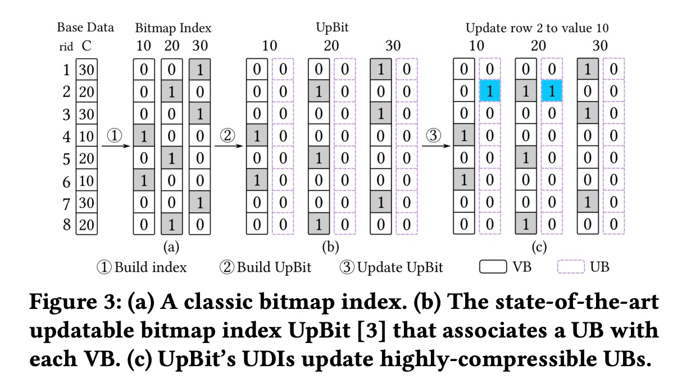
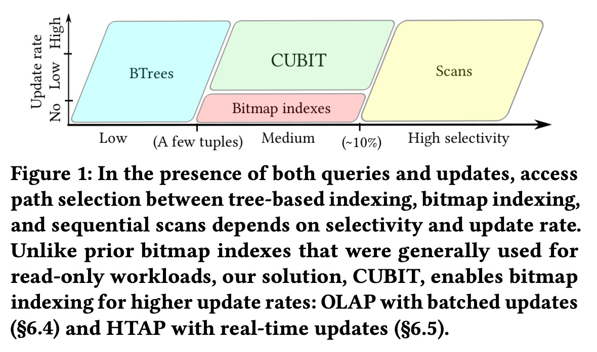
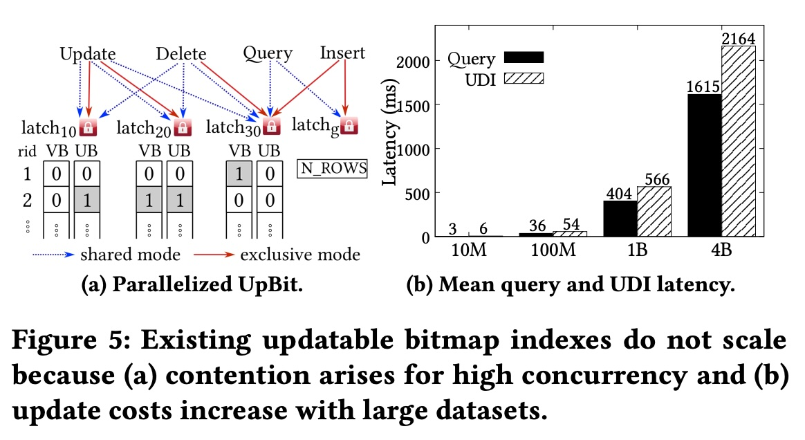
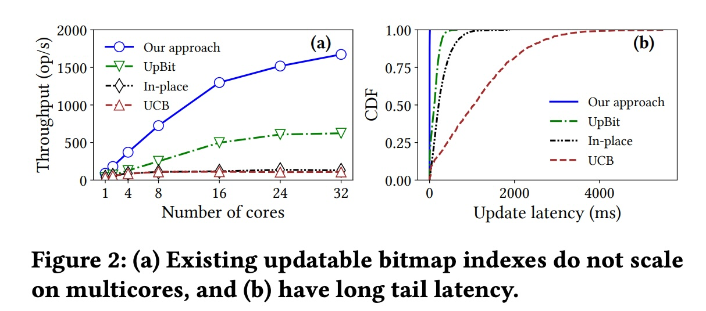
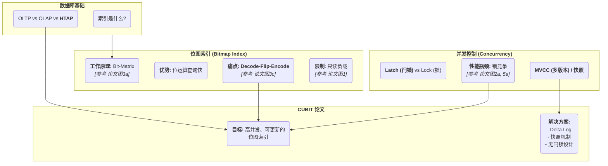
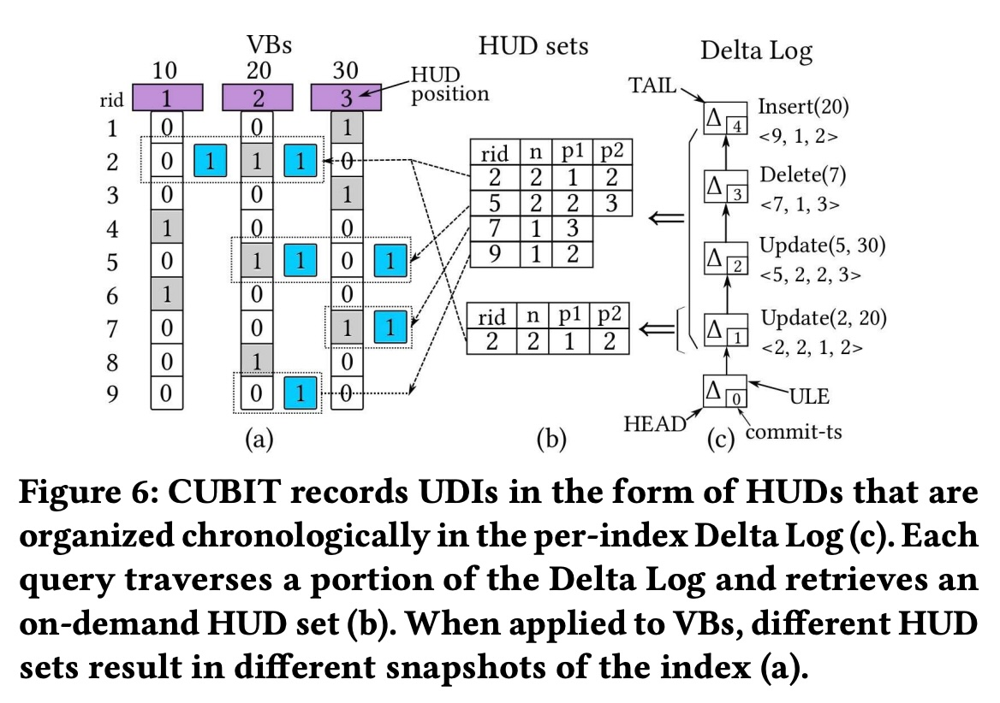
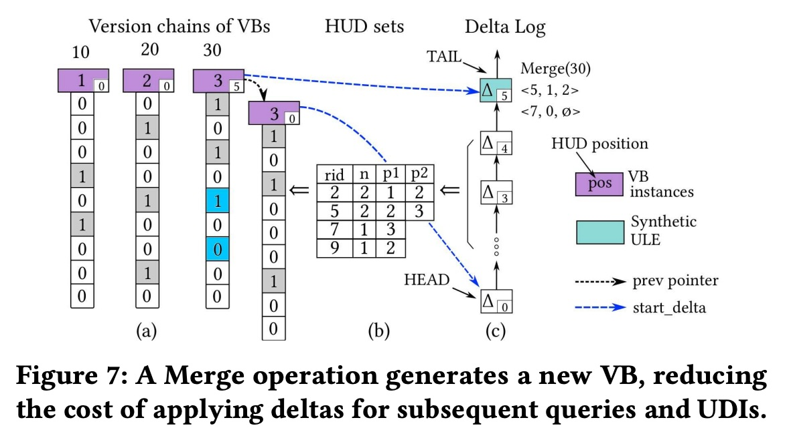
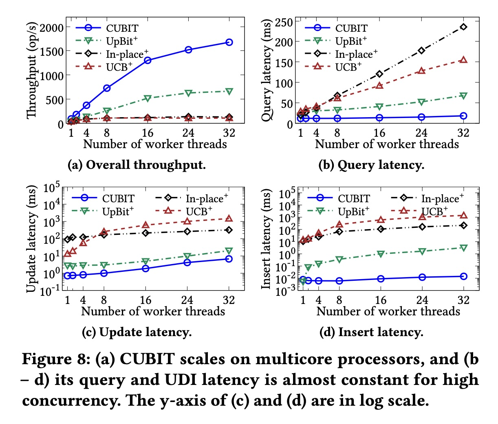
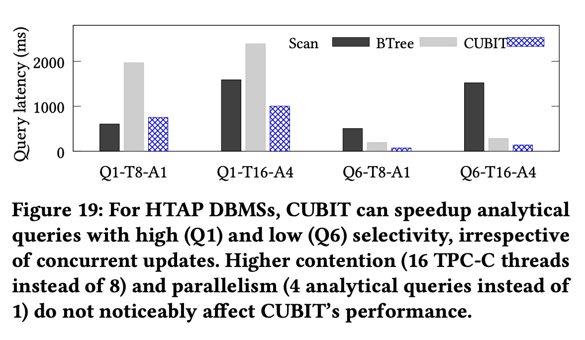
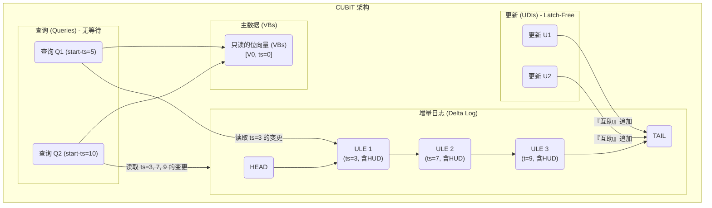

## AI论文解读 | CUBIT: Concurrent Updatable Bitmap Indexing
        
### 作者        
digoal        
        
### 日期        
2025-11-14        
        
### 标签        
PostgreSQL , PolarDB , DuckDB , AI , 论文解读        
        
----        
        
## 背景  
      
https://www.vldb.org/pvldb/vol18/p399-athanassoulis.pdf        
  
提示:          
```          
读懂《CUBIT: Concurrent Updatable Bitmap Indexing》这篇论文需要提前掌握哪些基础知识, 请使用中文通熟易懂的讲解这些基础知识, 可以引用论文中的图、表或使用Markdown支持的图形(text,mermaid等)增加解释性. 
  
使用中文通熟易懂的解读《CUBIT: Concurrent Updatable Bitmap Indexing》这篇论文, 其中的关键内容请着重讲解, 可以引用论文中的图、表或使用Markdown支持的图形(text,mermaid等)增加解释性. 
  
提取《CUBIT: Concurrent Updatable Bitmap Indexing》这篇论文中的重要术语, 使用中文对这些术语进行通熟易懂的讲解, 可以引用论文中的图、表或使用Markdown支持的图形(text,mermaid等)增加解释性. 
```     
  
## 1 前置知识 
这篇论文《CUBIT: Concurrent Updatable Bitmap Indexing》  提出了一种新型的数据库索引技术，旨在解决一个经典难题：**如何让位图索引（Bitmap Index）在支持高并发（Concurrent）和高频率更新（Updatable）的同时，依然保持查询高效？**

要透彻理解 CUBIT 的设计，您需要先掌握以下几个领域的基础知识：

### 1\. 核心概念：什么是位图索引 (Bitmap Index)？

位图索引是数据库中一种特殊的索引结构，它非常适合于数据仓库（Data Warehouse）和分析型（OLAP）负载 。

  * **工作原理：** 它为列（Column）中的 **每一个唯一的键值**（Key）创建一个 **位向量（Bitvector）** 。这个向量的长度等于表中的总行数，每一位（bit）对应一行数据 。

  * **举例说明（参考论文图 3a ）：**     

      * 假设我们有一个8行数据的表，其中一列 `C` 的值有 (30, 20, 30, 10, 20, 10, 30, 20)。
      * 这列有3个唯一值：10, 20, 30。
      * 位图索引会创建3个位向量：
          * **Bitvector for 10:** `00010100` (第4、6行为10)
          * **Bitvector for 20:** `01001001` (第2、5、8行为20)
          * **Bitvector for 30:** `10100010` (第1、3、7行为30)

  * **优势：**

    1.  **查询极快：** 对于复杂的逻辑查询（AND, OR, NOT），可以直接转换成超快的位运算（bitwise operations）。例如，`WHERE C=10 OR C=30`，只需将 `00010100` 和 `10100010` 进行**按位或 (OR)** 运算，得到 `10110110`，一次性找出所有符合条件的行。
    2.  **空间高效（特定情况）：** 当列的唯一值很少（即**低基数 Low Cardinality**，如“性别”、“国家”）时，索引非常小 。

### 2\. 关键痛点：为什么位图索引“不擅长更新”？

这是理解 CUBIT 动机的**最关键**知识点。

  * **问题所在：** 位图索引天生是为“只读”负载设计的 。

  * **昂贵的“解压-翻转-压缩” (Decode-Flip-Encode) 循环：**

    1.  **压缩（Compression）：** 真实的位向量非常长（比如对应10亿行数据）且稀疏（大部分是0），因此它们**必须**被压缩存储（例如使用 WAH 压缩算法 ）才能节省空间。
    2.  **更新（Update）：** 想象一下，我们要执行一次更新，如论文图 3c  所示：`Update row 2 to value 10` (原始值是20)。
    3.  数据库必须执行以下 **“重量级”** 操作 ：
          * 找到 **值20** 的位向量。
          * **解压 (Decode)** 整个（可能非常巨大的）压缩位向量。
          * **翻转 (Flip)** 第2位，从 1 改成 0。
          * **重新压缩 (Encode)** 整个位向量并写回。
          * ...同时，对 **值10** 的位向量执行同样的操作（第2位从 0 改成 1）。
    4.  这个过程非常缓慢，并且在操作期间会“锁住”位向量，导致其他查询无法进行 。

  * **论文图 1** 非常好地总结了这一点：传统的“Bitmap indexes”  只适用于“No”或“Low”的更新率（Update rate）。CUBIT 的目标就是将位图索引扩展到“High”更新率的领域 。    

### 3\. 核心挑战：并发控制 (Concurrency) 与 HTAP

  * **HTAP (混合事务/分析处理)：** 这是现代数据库的趋势，即希望在同一系统上同时运行 OLTP（在线事务处理，如网购下单）和 OLAP（在线分析处理，如生成销售报表）。

      * **OLTP** 意味着大量的实时、高并发**更新**。
      * **OLAP** 意味着复杂的**查询**。
      * HTAP 的需求**完美命中了**传统位图索引的痛点（既要高并发更新，又要复杂查询）。

  * **并发控制 (Concurrency Control)：**

      * 当多个线程（用户）同时读写数据时，如何保证数据的一致性？
      * **闩锁 (Latches)：** 这是理解 CUBIT 并发设计的关键。Latch 是一种轻量级的锁，用于保护内存中的数据结构（比如索引节点或位向量）不被多个线程同时修改而出错。
      * **论文图 5a ** 展示了传统并发设计的**瓶颈**：    
          * 当一个“Update”操作  要修改值10和20的位向量时，它必须获取 `latch10` 和 `latch20` 的**独占模式 (exclusive mode)** 。
          * 此时，一个“Query”操作  想要读取值20和30，它必须等待 Update 释放 `latch20` 。
          * 当线程（CPU核心）变多时，大家都在互相等待 Latch，性能非但不能提升，反而会下降。这就是论文图 2a  中 UpBit、In-place 等方法在多核上性能无法扩展（scale）的原因 。    
      * **CUBIT 的目标：** CUBIT 声称自己是“latch-free” (无闩锁) 的 ，这意味着它使用更高级的技术来避免这种“互相等待”的瓶颈。

### 4\. 关键技术：快照 (Snapshot) 与多版本 (MVCC)

  * **“无锁”/“无等待” (Latch-Free / Wait-Free)  是如何实现的？**
  * **多版本并发控制 (MVCC / Snapshotting)：** 这是理解 CUBIT 设计的最后一块拼图。
      * **核心思想：** “写”操作不会在原地修改（modify-in-place）数据，而是创建数据的**新版本**。
      * **CUBIT 的做法：** 当一个更新（Update）发生时，CUBIT 不会立即去执行昂贵的“解压-翻转-压缩”循环。
    
    1.  它将这个“变更信息”记录在一个**增量日志 (Delta Log)** 中 。论文中称这个变更为“水平更新增量 (Horizontal Update Deltas, HUD)” 。
    2.  **查询（Query）**  和**更新（UDI）**  在**不同的快照 (Snapshot)** 上工作 。
    
      * **举个例子：**
        1.  一个**长查询 (Query)** 在时间点 `T1` 开始，它拿到了一个 `T1` 时刻的“快照”。它读取的是**原始的位向量 (VBs)** 。
        2.  在查询进行时，一个**更新 (Update)** 在 `T2` 时刻发生。它把变更记录写入 `Delta Log` 。
        3.  这个更新**完全不会干扰**正在运行的长查询，因为长查询看的是 `T1` 的旧快照，它根本“看”不到 `T2` 的变更 。
      * 这就是 CUBIT 如何实现“查询不干扰更新”  和“ wait-free 进度保证”  的核心机制。

### 总结

为了帮助您构建知识体系，这里有一个导图：



**一言以蔽之：**
要读懂 CUBIT，您需要先理解**位图索引 (Bitmap Index)** 的原理 ，然后深刻理解为什么它**不擅长更新**（“解压-翻转-压缩”的代价），最后理解**并发控制**中的“闩锁 (Latch)”  瓶颈和“快照 (Snapshot)”  思想。

CUBIT 就是一套利用“快照”和“增量日志”来规避“更新”和“闩锁”瓶颈的创新设计。

希望这份指南对您有所帮助！您想先深入了解哪个概念，例如“并发控制中的 Latch 和 MVCC”吗？
  
## 2 解读论文 
  
好的，这是一份为您准备的《CUBIT: Concurrent Updatable Bitmap Indexing》论文的通俗易懂版中文解读。

这篇论文的核心是解决了一个数据库领域的经典难题：**如何让“位图索引” (Bitmap Index) 这种查询利器，也能在数据被疯狂“增删改” (更新) 的高并发场景下保持高性能？**

-----

### 1\. 故事背景：位图索引，一个“偏科”的天才

首先，我们需要知道什么是“位图索引” (Bitmap Index)。

它是一种特殊的数据库索引，非常擅长处理“分析型”查询 (OLAP)，比如数据仓库里的报表统计。

  * **工作原理 (参考论文图 3a)：**    
    假设你有一个用户表，其中一列是“性别”。这一列只有“男”、“女”两个值（这叫“低基数”）。位图索引会为“男”创建一个位向量 (bitvector)，为“女”也创建一个 。

      * `Bitvector for '男'`: `100101...` (第1、4、6个用户是男性)
      * `Bitvector for '女'`: `011010...` (第2、3、5个用户是女性)

  * **优点：**

    1.  **查询极快：** 如果你想查“所有男性 AND 30岁以上”，数据库只需拿到“男性”的位向量和“30岁以上”的位向量，做一次“按位与” (AND) 运算，速度极快 。
    2.  **空间效率高：** 对于“性别”、“国家”这种值不多的列，它占用的空间很小 。

  * **致命缺点 (核心痛点)：**
    **它极其不擅长更新！** 。
    想象一下，为了节省空间，这些超长的位向量（比如对应10亿行数据）都是被**压缩**存储的 。
    当你执行一个`UPDATE`操作，比如把第100万个用户的性别从“女”改成“男”，数据库必须：

    1.  找到“女”的压缩位向量，**解压**它。
    2.  **翻转** (Flip) 第100万个bit（从1改成0）。
    3.  **重新压缩** (Encode) 整个位向量。
    4.  对“男”的位向量做一遍同样的操作（从0改成1）。

    这个 **“解压-翻转-压缩” (Decode-Flip-Encode) 循环** 的代价极其高昂 。在更新时，它还会“锁住”这个索引，导致其他查询也无法进行。

  * **论文图 1** 非常好地概括了这一点：传统的 Bitmap indexes (位图索引) 只适用于“No” (没有) 或“Low” (低) 更新率的场景 。    

而 CUBIT 的目标，就是让位图索引也能在“High” (高) 更新率的场景下（比如 HTAP）中存活下来 。

-----

### 2\. 传统方案的挣扎：为什么它们都失败了？

为了解决更新问题，前辈们（比如 UpBit）尝试过一个方案： **“打补丁”** 。

  * **UpBit 的思路 (参考论文图 3b, 3c)：**    
    我不直接改“原版”位向量 (VB)，我给每个 VB 配一个“补丁”位向量 (UB) 。
    当你要把第2行从值20改成10时，我不动 VB，我去“补丁” UB 里操作：

      * 在“值20”的 UB 上，把第2位翻转一下 。
      * 在“值10”的 UB 上，也把第2位翻转一下 。

    查询的时候，数据库需要同时看“原版 (VB)”和“补丁 (UB)”，两者做一次“异或 (XOR)”运算才能得到正确结果 。

  * **新的瓶颈：并发！**
    这个方案在单核 CPU 上还行，一旦放到多核服务器上，性能就崩了 。

      * **看论文图 2a：** 这是在多核 CPU 上的性能测试。横轴是 CPU 核心数，纵轴是吞吐量（越高越好）。你会发现，传统的 In-place、UCB 甚至 UpBit，在4-8核之后，性能就上不去了（“plateaus”，平台期）。    
      * **看论文图 5a：** 这解释了*为什么*。传统并发依赖“锁” (Latches)。一个“Update”操作可能要同时锁住“值10”和“值20”的位向量 。这时，一个“Query”操作想读取“值20”和“值30”，它就必须**排队等待**，导致所有线程都在互相“干瞪眼” 。   

    这引出了论文总结的3大挑战 ：

    1.  **(C1) 高锁竞争：** 查询和更新互相抢锁 。
    2.  **(C2) 临界区太长：** 即便只是“读”数据，也可能需要解压，这个过程发生在“持锁”期间，导致锁被占用太久 。
    3.  **(C3) 热点数据：** 如果数据分布不均（比如80%的人都买“热销商品”），所有更新都会去抢那几个“热点”位向量的锁，直接“堵死” 。

-----

### 3\. CUBIT 的三大神招：它是如何做到的？

CUBIT (Concurrent Updatable Bitmap Indexing) 用了一套组合拳，漂亮地解决了上述所有问题 。

#### 神招一：HUD (水平更新增量) —— 不改索引，只写日志

这是 CUBIT 的核心思想： **“更新”操作根本不碰原来的位向量 (VBs)！** 

  * **看论文图 6：**    

      * **(a)** 部分是“原版”位向量 (VBs)，它们是只读的。
      * **(c)** 部分是 CUBIT 的核心：一个 **“增量日志” (Delta Log)** 。
      * 当一个更新 `Update(2, 20)` 发生时（把第2行改成值20），CUBIT 不会去 (a) 里修改，而是**在 (c) 的日志末尾追加一条记录 (ULE)** 。
      * 这条记录里包含一个 **HUD (Horizontal Update Delta)** ，可以通俗理解为：“**第2行**数据被动过了，它涉及到了值10（原值）和值20（新值）” 。

  * **好处：**

    1.  **快！** 向日志末尾追加数据（Append）是计算机里最快的操作之一 。
    2.  **告别“解压-翻转-压缩”：** 彻底绕开了这个噩梦般的循环 。
    3.  **解决锁竞争 (C1, C2)：** 更新操作不再需要锁住 (a) 里的 VBs，它只需要一个极轻的锁来保护 (c) 的日志尾部，这个“临界区”短到几乎可以忽略不计 。

#### 神招二：轻量级快照 (Snapshotting) —— 让查询和更新“活在不同时空”

这是 CUBIT 解决“读写冲突”的法宝，它借鉴了 MVCC（多版本并发控制）的思想 。

  * **原理：**

    1.  每个操作（无论是查询还是更新）在开始时，都会领到一个“时间戳” (start-ts) 。
    2.  一个“查询”操作（比如 `Q`），拿到了时间戳 `T`。它看到的就是数据库在 `T` 时刻的 **“快照”**  (Snapshot) 。
    3.  它如何构建这个快照？
          * 首先，它拿到“只读”的**原版位向量 (VBs)** 。
          * 然后，它去 **“增量日志” (Delta Log)** 里，把所有**早于** `T` 时间戳的 HUD 变更，像“打补丁”一样应用到 VBs 的一份私有拷贝上 。

    

      * **看论文图 6b：** 假如一个查询在 `start-ts=1` 时开始，它只会看到底部那个 HUD set（只有1条变更）。而另一个查询在 `start-ts=5` 开始，它就会看到顶部那个 HUD set（包含了4条变更）。

  * **好处：**
    **查询操作是“无等待” (Wait-Free) 的！** 。
    一个查询 `Q` 在 `T` 时刻运行，它完全**无视**任何在 `T+1`, `T+2` ... 时刻发生的“更新”。因为那些更新在它的“快照”里根本不存在！
    **更新永远不会阻塞查询，查询也永远不会阻塞更新**。它们彼此透明，完美解决了 C1 读写冲突问题。

#### 神招三：可扩展同步 (Scalable Synchronization) —— 化竞争为“互助”

CUBIT 还解决了两个“后遗症”：

1.  **“增量日志” (Delta Log) 会不会无限变长？**

      * **会。** 如果日志太长，查询时要“回放”的补丁就太多了，性能会下降 。
      * **CUBIT 的对策：合并 (Merging)。** (见论文图 7)    
        CUBIT 会有后台线程，定期把“旧的”日志变更 (HUDs) 合并到“原版” VBs 中，并生成一个 **“新版本”的 VB** 。
        比如，它在 `ts=5` 时刻创建了一个 VBs 的新版本 (V2) 。那么 `ts > 5` 之后的新查询，就可以直接从 V2 出发，只需要回放 `ts=5` 之后的那一小段日志就行了，极大减轻了查询负担 。

2.  **如果“更新”操作太频繁，大家抢着“写日志”怎么办？** (C3 热点问题)

      * **CUBIT 的对策：无锁 (Latch-Free) 设计。**
        CUBIT 用了一种“帮助” (Helping) 机制 。
      * **通俗理解：** 线程A 和 线程B 都想写日志。
          * **传统方式 (抢锁)：** A 抢到锁，B 只能“干等”。
          * **CUBIT 方式 (互助)：** A 尝试写入成功。B 尝试写入失败（因为A刚写完），B 不会“干等”，而是 **“帮”A 把收尾工作做完**（比如更新一下日志尾指针），然后再尝试写入自己的日志。
      * **好处：** 这种机制把“竞争关系”变成了“协同工作关系”，极大地提升了高并发更新下的吞吐量，完美解决了 C3 热点瓶颈 。

-----

### 4\. 实验结果：CUBIT 真的“能打”吗？

**非常能打！**

  * **可扩展性 (论文图 8a)：**    
    这是最震撼的对比图。横轴是 CPU 核心数，纵轴是吞吐量（越高越好）。

      * UpBit+ (虚线) 在16核就“躺平”了 。
      * **CUBIT (蓝色实线) 几乎呈线性增长** ，给它越多的 CPU，它就能处理越多的请求。这证明了它的设计是真正“可扩展”的。

  * **延迟 (论文图 8b, c, d)：**
    CUBIT 的查询延迟 (Query latency) 和更新延迟 (Update latency) **几乎是恒定的**，并且比其他方案低了**几个数量级**（注意 8c 和 8d 的纵轴是对数(log)坐标！）。

      * 这意味着 CUBIT 的更新操作（如插入）平均只需要 0.01 毫秒 (ms)，而其他方案则需要几十甚至几千毫秒 。

  * **HTAP 真实场景 (论文图 19)：**    
    在模拟“一边疯狂交易 (TPC-C)，一边复杂查询 (TPC-H)”的 HTAP 混合负载下：

      * CUBIT 的查询响应时间（蓝色柱） **几乎不受** 高并发更新的影响，表现得极其稳定 。
      * 而其他方案 (Scan 或 BTree)，响应时间会因为更新冲突而剧烈恶化 。

### 总结

CUBIT 是一篇开创性的论文，它通过一套精妙的设计，**彻底解决了几十年来位图索引“怕更新、怕并发”的核心痛点**。

它通过：

1.  **HUD + Delta Log** (只写日志)，绕开了昂贵的“解压-翻转-压缩”。
2.  **快照 (MVCC)** (时空隔离)，实现了“读写互不阻塞”。
3.  **合并 + Latch-Free** (后台合并+互助)，解决了日志过长和热点竞争问题。

CUBIT 证明了位图索引**不再是**只读数据仓库的“偏科生”，而是可以成为现代 HTAP 数据库中一个“文武双全”的高性能索引选项 。
  
## 3 术语 
  
好的，我为您从《CUBIT》这篇论文中提取了最重要的术语，并提供了通俗易懂的中文讲解。

-----

### 1\. 基础背景 (The Problem)

#### 🔸 Bitmap Index (位图索引)

  * **通俗讲解：** 这是一种特殊的索引，像一张“考勤表”。假设你有一个“性别”列，它会为“男”建一个位向量（bitvector），为“女”建一个。这个向量的长度等于表的总行数。
  * **论文图例 (参考 图 3a) ：**    
      * 假如表有8行，该列的值为 (30, 20, 30, 10, 20, 10, 30, 20)。
      * 值 `10` 的位向量是: `00010100` (第4、6位为1)
      * 值 `20` 的位向量是: `01001001` (第2、5、8位为1)
      * 值 `30` 的位向量是: `10100010` (第1、3、7位为1)
  * **为什么重要：** 这种索引在执行 `AND`/`OR` 查询时速度极快（只需做位运算），但更新起来非常麻烦。

#### 🔸 HTAP (Hybrid Transactional/Analytical Processing - 混合事务/分析处理)

  * **通俗讲解：** 这是一种数据库的“新时尚”，希望在**同一个系统**上同时跑两种业务 ：
    1.  **Transactional (OLTP):** 像网购下单、银行转账这样的高频“增删改”操作。
    2.  **Analytical (OLAP):** 像生成“本季度销售报表”这样的复杂“查询”操作。
  * **为什么重要：** HTAP 意味着索引**必须**同时擅长“高并发更新”和“快速查询”。这正是 CUBIT 要解决的核心场景 。

#### 🔸 Decode-Flip-Encode (解压-翻转-压缩)

  * **通俗讲解：** 这是传统位图索引“更新慢”的**万恶之源** 。
  * **解释：** 位图索引的位向量（Bitvectors）通常都非常长（比如对应10亿行数据）且稀疏，所以它们必须被**压缩** (Encode) 存储（比如用 WAH 算法）。
      * 当你只想更新**1行**数据时（比如把第5行从 'A' 改成 'B'），你必须：
    <!-- end list -->
    1.  **Decode (解压):** 把 'A' 和 'B' 两个（可能非常大的）压缩位向量整个解压开。
    2.  **Flip (翻转):** 把 'A' 向量的第5位从1改成0，'B' 向量的第5位从0改成1 。
    3.  **Encode (压缩):** 把两个修改后的巨大向量再重新压缩存回去。
  * **为什么重要：** 这个过程极其缓慢，并且会锁住索引，导致其他操作无法进行 。CUBIT 的设计目标就是**彻底避免**这个循环 。

#### 🔸 Latch (闩锁) & Contention (竞争)

  * **通俗讲解：**
      * **Latch (闩锁):** 一种轻量级的“锁”，好比一个“厕所隔间门锁”，用来保护一小块内存数据（比如一个索引节点或位向量）。
      * **Contention (竞争):** 当隔间（Latch）被占用时，外面排起长队，大家都在“等待”，这就是“竞争” 。
  * **为什么重要：Monitor (参考 图 5a) ：**    
    论文指出，传统的并发方案（如 UpBit+）在更新时需要获取多个 Latch（锁）。当 CPU 核心数增多，大量线程（人）去抢夺少数的 Latch（隔间），导致“排队”时间（延迟）急剧增加，系统性能无法扩展（即“堵车”了）。

-----

### 2\. CUBIT 的核心设计 (The Solution)

下面是 CUBIT 用来解决上述问题的“三板斧”。

#### 🔸 HUD (Horizontal Update Deltas - 水平更新增量)

  * **通俗讲解：** 这是 CUBIT 的**第一个核心创新** 。
  * **解释：** 当一个更新发生时，CUBIT **不会**去执行“解压-翻转-压缩”。
      * 传统方式是“垂直”修改：找到“值A”和“值B”对应的**列向量 (Bitvector)** 去修改。
      * CUBIT 是“水平”记录：它只关注被修改的**那一行 (Row)** 。它会创建一个叫 HUD 的小记录，这个记录描述了：“**第 R 行**被更新了，它的原值是 V1，新值是 V2” 。
  * **论文图例 (参考 图 6b, 6c) ：**      
      * 当执行 `Update(2, 20)`（把第2行从值10改成20）时，CUBIT 不会去动 VBs 。
      * 它只生成一个 HUD 记录 `<2, 2, 1, 2>`（代表第2行，涉及2个值，分别是第1个值和第2个值）。
  * **为什么重要：** 这个操作非常快，因为它只创建了一个小对象，完全避免了修改庞大的位向量 。

#### 🔸 Delta Log (增量日志) & ULE (UDI 记录)

  * **通俗讲解：** 这是 CUBIT 的**第二个核心组件**，用来存放上面生成的 HUD。
  * **解释：**
      * **Delta Log (增量日志):** 就像一个“收银小票”卷纸 。
      * **ULE (UDI Log Entry):** 每一笔更新（Update, Delete, Insert）就是一张“小票”，这张小票上写着变更详情（即 HUD）。
      * 当更新发生时，CUBIT 只是把这张新的“小票”(ULE) **追加 (Append)** 到“卷纸”(Delta Log) 的末尾 。
  * **论文图例 (参考 图 6c) ：**
    该图展示了 Delta Log 是一个 ULE 的链表，更新操作 (Update, Delete, Insert) 只是简单地在 `TAIL` (尾部) 追加新的 ULE。
  * **为什么重要：** 追加日志是一个极快的操作，它的“临界区”（需要锁定的时间）非常短，从而解决了 Latch 竞争问题 (C1) 和临界区过长问题 (C2) 。

#### 🔸 Snapshotting (快照) & Wait-Free (无等待)

  * **通俗讲解：** 这是 CUBIT 实现“读写分离”的法宝，也叫多版本（MVCC）。
  * **解释：** CUBIT 如何保证查询和更新互不干扰？
    1.  **“写” (UDIs):** 写入方（更新）只管往 Delta Log 末尾“贴小票” 。
    2.  **“读” (Queries):** 读取方（查询）在开始时，会拿到一个“开始时间戳” (`start-ts`) 。
    3.  这个查询会“看到”一个 **“快照” (Snapshot)** ，这个快照 = **“原始的位向量 (VBs)” + “所有早于 start-ts 的增量日志 (Delta Log)”** 。
  * **为什么重要：**
      * **Wait-Free (无等待):** 运行中的“查询”是在看它开始时那个“旧照片”（快照），它完全**无视**查询开始后新发生的任何“更新” 。
      * 因此，**更新永远不会阻塞查询，查询也永远不会阻塞更新** 。它们“活在”各自的时空里，完美实现了高并发。

#### 🔸 Latch-Free (无闩锁) & Helping Mechanism (互助机制)

  * **通俗讲解：** 这是 CUBIT 的**第三个核心创新**，用于解决“热点”更新问题（C3）。
  * **解释：** 尽管“贴小票”很快，但如果成千上万个线程同时想去“贴小票”（即都想更新 Delta Log 的 `TAIL` 指针），还是会排队。
      * **传统 Latch:** 线程A 抢到锁，线程B、C、D 只能“干等” 。
      * **CUBIT (Latch-Free):** 论文实现了一个“无锁”版本 CUBIT-If 。它使用了一种“互助机制” (Helping Mechanism) 。
      * **互助机制 ：** 线程A 尝试追加 ULE 成功。线程B 尝试追加失败（因为A刚改了 `TAIL`），B 此时**不会**自旋或等待，而是会 **“帮助”A 完成收尾工作**  ，然后再尝试自己的追加。
  * **为什么重要：** 这种“互助”模式将线程间的“竞争关系”转变成了“协同关系” ，使得 CUBIT 即使在数据极度倾斜（热点）和极高并发更新下，依然能保持极高的吞吐量，是其扩展性（Scalability）的最终保障。

-----

### 关系图 (CUBIT 架构)

下面这个图总结了 CUBIT 的工作流：


  
## 参考        
         
https://www.vldb.org/pvldb/vol18/p399-athanassoulis.pdf    
        
<b> 以上内容基于DeepSeek、Qwen、Gemini及诸多AI生成, 轻微人工调整, 感谢杭州深度求索人工智能、阿里云、Google等公司. </b>        
        
<b> AI 生成的内容请自行辨别正确性, 当然也多了些许踩坑的乐趣, 毕竟冒险是每个男人的天性.  </b>        
    
#### [PolarDB 学习图谱](https://www.aliyun.com/database/openpolardb/activity "8642f60e04ed0c814bf9cb9677976bd4")
  
  
#### [PostgreSQL 解决方案集合](../201706/20170601_02.md "40cff096e9ed7122c512b35d8561d9c8")
  
  
#### [德哥 / digoal's Github - 公益是一辈子的事.](https://github.com/digoal/blog/blob/master/README.md "22709685feb7cab07d30f30387f0a9ae")
  
  
#### [About 德哥](https://github.com/digoal/blog/blob/master/me/readme.md "a37735981e7704886ffd590565582dd0")
  
  

  
