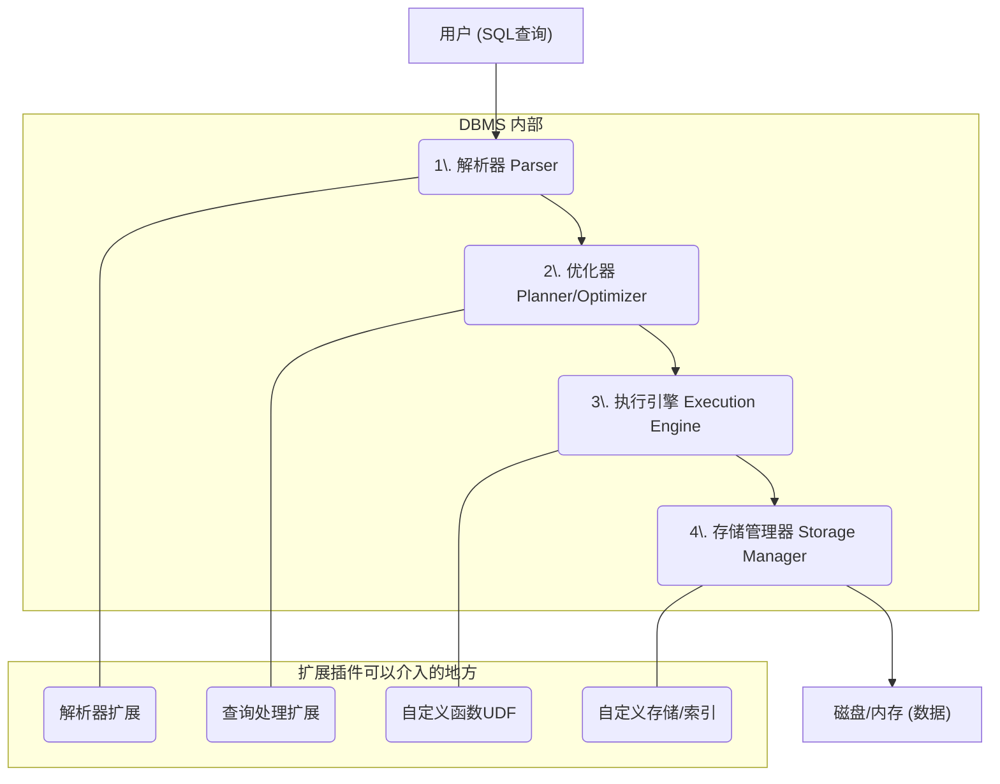
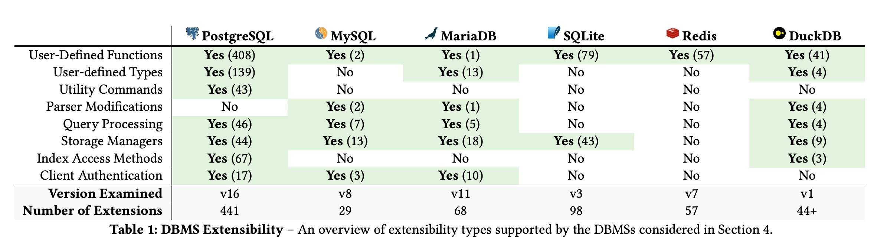
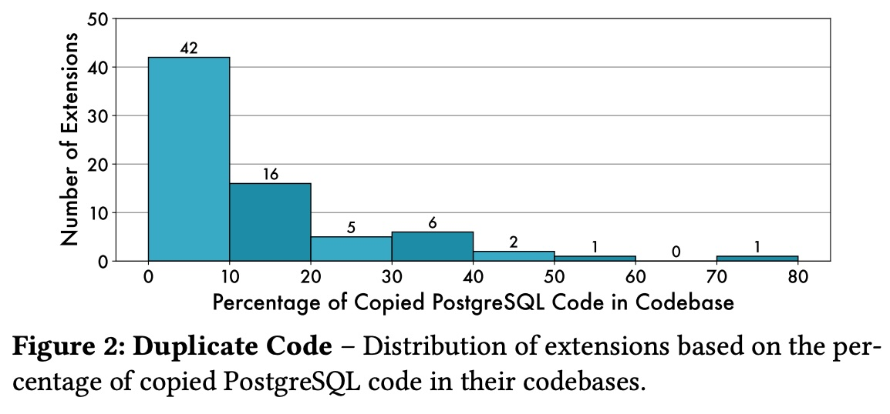
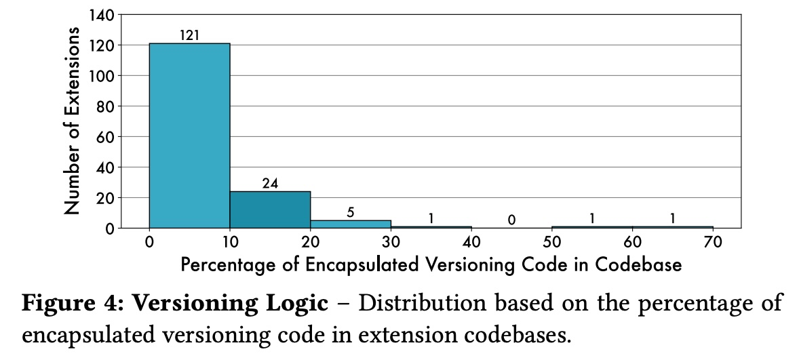
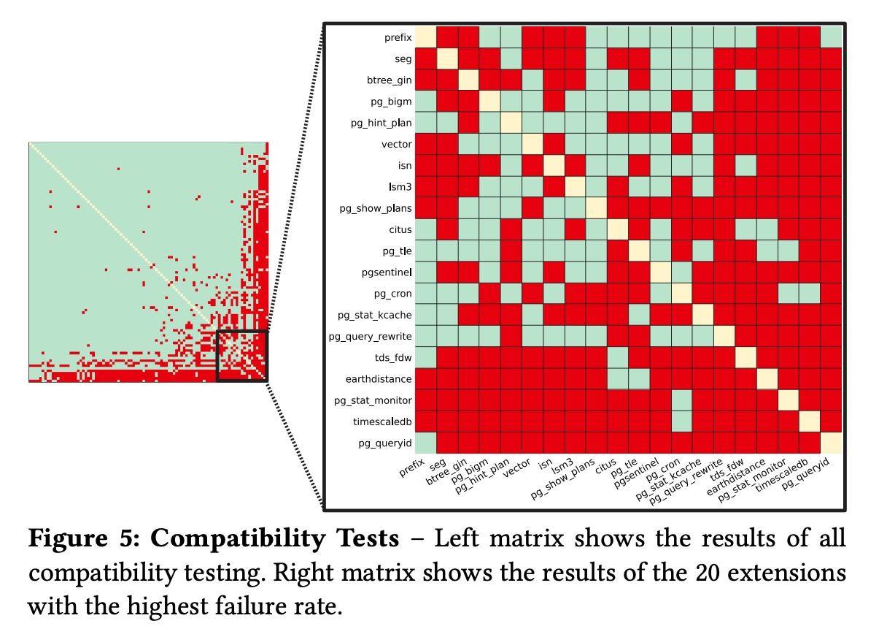
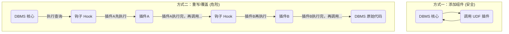
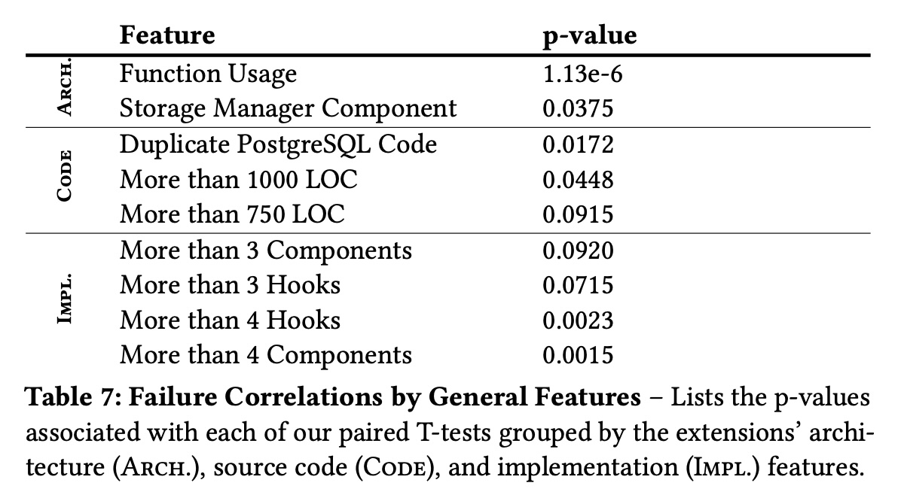
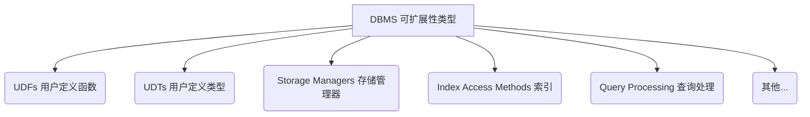

## AI论文解读 | Anarchy in the Database: A Survey and Evaluation of Database Management System Extensibility
        
### 作者        
digoal        
        
### 日期        
2025-11-14        
        
### 标签        
PostgreSQL , PolarDB , DuckDB , AI , 论文解读        
        
----        
        
## 背景  
      
https://www.vldb.org/pvldb/vol18/p1962-kim.pdf        
  
提示:          
```          
读懂《Anarchy in the Database: A Survey and Evaluation of Database Management System Extensibility》这篇论文需要提前掌握哪些基础知识, 请使用中文通熟易懂的讲解这些基础知识, 可以引用论文中的图、表或使用Markdown支持的图形(text,mermaid等)增加解释性. 
  
使用中文通熟易懂的解读《Anarchy in the Database: A Survey and Evaluation of Database Management System Extensibility》这篇论文, 其中的关键内容请着重讲解, 可以引用论文中的图、表或使用Markdown支持的图形(text,mermaid等)增加解释性. 
  
提取《Anarchy in the Database: A Survey and Evaluation of Database Management System Extensibility》这篇论文中的重要术语, 使用中文对这些术语进行通熟易懂的讲解, 可以引用论文中的图、表或使用Markdown支持的图形(text,mermaid等)增加解释性. 
```     
  
## 1 前置知识 
  
好的，这是一篇信息量很大的论文，它深入探讨了数据库管理系统（DBMS）的“可扩展性”问题 。所谓“可扩展性”，通俗点说，就是给数据库“装插件”或“打MOD”的能力，让它能干一些出厂时不会的活儿 。

要透彻理解这篇论文，你最好先掌握以下几个领域的基础知识。我会用尽量通俗的语言为你讲解，并引用论文中的图表来辅助说明。

### 1\. 什么是数据库管理系统 (DBMS)？

你需要对数据库的“本职工作”有一个基本概念。

  * **通俗理解：** 你可以把DBMS想象成一个**功能超强的图书馆**。
  * **它的工作：** 不是简单地存书（数据），而是要高效地管理（增、删、改）和查询（查）这些书。
  * **SQL语言：** 就是你和图书馆管理员（DBMS）沟通的“标准普通话”。

这篇论文研究的就是，我们怎么才能给这个“图书馆”增加新的服务，比如增加一种“矢量数据” （一种新型的书），或者增加一种新的“身份验证方式” （新的门禁卡）。

-----

### 2\. 数据库的“内部构造” (DBMS 核心架构)

这是理解这篇论文**最重要**的基础知识。论文的第3节  和第4节  都在深入讨论扩展程序如何与DBMS的内部组件交互。如果你不知道DBMS里面长什么样，就很难理解为什么有些扩展会引发“无政府状态 (Anarchy)”。

一个简化的DBMS工作流程（或者叫“查询处理流程”）大致如下：



论文中的**表1 (Table 1)**  就是在总结不同数据库（如PostgreSQL, MySQL等）分别允许你在哪些环节上进行扩展。    

我们来逐一解释上图中的组件，以及它们对应的扩展类型：

1.  **解析器 (Parser)：**
      * **本职工作：** 读懂你的SQL语句，检查有没有语法错误 。
      * **对应扩展 (Parser Modifications)：** 增加新的SQL语法 。比如让数据库能听懂一种“方言”。
2.  **优化器 (Planner/Optimizer)：**
      * **本职工作：** 决定如何最高效地执行查询（比如是先查A表还是B表）。
      * **对应扩展 (Query Processing)：** 影响优化器的决策 。比如你写个插件告诉优化器：“嘿，我这个新索引  特别快，你快用它！”
3.  **执行引擎 (Execution Engine)：**
      * **本职工作：** 真正去干活儿，执行优化器给出的“计划”。
      * **对应扩展 (UDFs / Query Processing)：**
          * **UDF (用户定义函数) ：** 这是最常见的扩展。比如数据库本来只会`SUM()`（求和），你教它一个新函数`AVG()`（求平均值）。
          * **Query Processing ：** 更底层的干预，比如提供新的数据连接（Join）算法 。
4.  **存储管理器 (Storage Manager)：**
      * **本职工作：** 负责把数据（表、索引）真正在磁盘或内存中存好、取好 。
      * **对应扩展 (Storage Managers / Index Access Methods)：**
          * **自定义存储 ：** 比如让数据不存本地磁盘，而是存到云端的S3上 。
          * **自定义索引 ：** 比如论文中提到的`pgvector` ，它提供了一种新的索引，专门用来做“向量搜索”（比如“以图搜图”）。
          * **UDT (用户定义类型) ：** 教数据库认识一种新的数据格式，比如“坐标”或“矢量” 。

**小结：** 掌握了DBMS的架构，你就能看懂论文中关于“扩展类型”  和“接口”  的分类和讨论。

-----

### 3\. 编程和软件工程基础

论文不仅是“调查 (Survey)”，更是“评估 (Evaluation)” 。它用工程化的方法去分析这些扩展插件的“代码质量”和“兼容性”。

  * **API (应用程序接口)：**
      * **理解：** 软件之间对话的“插座”和“协议”。DBMS通过API暴露“插座”，让插件“插”进来 。
  * **Hooks (钩子)：**
      * **理解：** 这是实现扩展的核心技术之一。DBMS在执行关键代码时，会先“吼一嗓子”：“我要执行A了，有没有插件想先插个队？” 。
      * **论文中的问题：** PostgreSQL的“钩子”设计很灵活 ，但也导致了“混乱”。如果两个插件都想在同一个“钩子”上插队，它们就可能打架（冲突）。这就是“Anarchy”的来源之一。
  * **静态分析 (Static Analysis) vs. 动态分析 (Dynamic Analysis)：**
      * **静态分析：** **只读代码，不运行。** 就像老师批改你的作文，检查错别字和语法。
          * *论文应用：* 分析插件**复制粘贴了多少数据库源码**（见5.2节  和图2 ），以及有多少**版本兼容逻辑**（见5.3节  和图4 ）。      
      * **动态分析：** **真正运行代码，看跑起来的效果。** 就像把你的程序跑一遍，看它会不会崩溃。
          * *论文应用：* **兼容性测试**（见5.4节 ）。论文的重头戏，它把两个不同的插件装在一起跑，看它们会不会“打架” 。
  * **兼容性 (Compatibility)：**
      * **理解：** 软件A和软件B能否在一起“和平共处”。
      * **论文的发现：** 论文通过动态分析发现，在PostgreSQL中，**16.8%的插件组合存在不兼容问题** ！
      * **论文中的图5 (Figure 5)** 就是一个“冲突矩阵图”，红色方块就代表一对插件“八字不合”，装在一起会出问题 。    

-----

### 4\. 核心权衡：安全 vs. 灵活 (Safety vs. Flexibility)

这是理解论文“灵魂”的关键点。论文第6.1节  专门讨论了这个问题。

  * **灵活 (Flexibility)：** 像 **PostgreSQL**，它提供了非常底层的“钩子” ，允许插件修改DBMS的核心行为 。
      * *好处：* 插件功能极其强大，甚至可以把PostgreSQL改造成一个分布式数据库 (如Citus) 。
      * *坏处：* **“无政府状态”** 。系统很脆弱，一个烂插件就可能搞崩整个数据库，或者插件之间互相冲突 。
  * **安全 (Safety)：** 像 **Redis**，它只允许插件通过非常受限的API（UDF）来操作，不允许插件触碰它的“内脏”（核心API）。
      * *好处：* 非常安全、稳定，插件之间几乎不冲突 。
      * *坏处：* 插件的能力非常受限。

论文的**图6 (Figure 6)**  直观地展示了这篇论文所研究的6种DBMS在这个“安全-灵活”光谱上的位置。    
   
### 总结

要读懂这篇论文，你不需要自己会写数据库扩展，但你必须理解：

1.  **数据库内部长啥样**（架构），这样才知道插件插在哪里。
2.  **插件是怎么插进去的**（API和Hooks），这样才知道为什么会冲突。
3.  **如何评价插件的好坏**（静态/动态分析），这样才能看懂论文的实验。
4.  **为什么这是一个难题**（安全与灵活的权衡）。

掌握了这些，你就能明白为什么作者会用“数据库中的无政府状态 (Anarchy in the Database)”  这么一个引人注目的标题了。

希望这个解释对你有帮助！你希望我为你总结一下这篇论文的核心发现吗？
  
## 2 解读论文 
  
这是一篇非常出色的论文，它就像一篇“数据库插件（扩展）生态”的深度调查报告。标题“数据库中的无政府状态” (Anarchy in the Database) 听起来很吓人，但它精准地指出了一个核心问题：

**核心观点：** 数据库的“可扩展性”（装插件的能力）是一把双刃剑。它带来了极大的灵活性，但也导致了严重的混乱、冲突和不稳定。

通俗地说，这篇论文在回答：“为什么我们给数据库装插件时，常常会把它‘玩坏’？”

以下是这篇论文的通俗解读和关键内容。

-----

### 论文干了什么？（三大贡献）

这篇论文主要做了三件事：

1.  **制定了一套“插件分类法” (Taxonomy)：** 告诉我们插件有多少种（比如自定义函数、新索引、新存储引擎等），以及它们是如何“挂”到数据库上的 。
2.  **调查了六大主流数据库 (Survey)：** 分析了 **PostgreSQL、MySQL、MariaDB、SQLite、Redis 和 DuckDB** 这六个系统，看它们各自是怎么支持插件的 。
3.  **重点“解剖”了PostgreSQL (Evaluation)：** PostgreSQL 是目前扩展生态最丰富的数据库。作者开发了一个叫 **ExtAnalyzer** 的工具 ，自动化地下载和分析了 **441个** PostgreSQL 插件，发现了惊人的问题 。

-----

### 关键发现（一）：插件的“安全”与“灵活”之争

这是理解“无政府状态”来源的第一个关键点。论文指出，数据库支持插件的方式主要有两种：

1.  **添加组件 (Adding Components)：** 这是“安全”的。
      * **比喻：** 就像给你的电脑**插上一个U盘**。
      * **例子：** 添加一个自定义函数 (UDF) 或一个自定义类型 (UDT) 。你只是增加了新功能，并没有碰数据库的核心。
2.  **重写/覆盖组件 (Overriding Components)：** 这是“灵活但危险”的。
      * **比喻：** 就像**拆开电脑机箱，把CPU或主板上的某个零件给换了**。
      * **例子：** 插件通过“**钩子 (Hooks)**”  替换掉数据库的*查询优化器*或*执行引擎*的一部分。

PostgreSQL 为了追求**极度的灵活性**，大量使用了“重写/覆盖”这种危险的方式 。



这种“钩子链”的设计，就是“无政府状态”的根源。如果插件A 和插件B 都挂在同一个钩子上，它们就可能打架 。

#### 核心权衡：安全 vs. 灵活

论文的 **图6 (Figure 6)**  完美总结了这一点。不同的数据库在“安全”和“灵活”之间做了不同的取舍：

  

  * **Redis (最安全)：** 只允许“添加组件”（UDF），完全不允许插件触碰它的核心。因此它最安全，但也最不灵活 。
  * **PostgreSQL (最灵活)：** 提供了大量“钩子”，允许插件重写任何东西。因此它最灵活，但也最危险 。

-----

### 关键发现（二）：PostgreSQL 生态的“无政府状态”

这部分是论文的重头戏，作者用数据揭示了 PostgreSQL 灵活性的代价。

#### 1\. 严重的兼容性问题 (16.8%的冲突率)

作者做了一个“暴力”测试：把数据库里**两两组合**所有的插件，看它们能否一起工作（安装、运行单元测试、跑基准测试） 。

  * **惊人发现：** 在 96 个被测试的插件中，**16.8% 的插件组合是互不兼容的**！
  * **论文的图5 (Figure 5)**  用一个矩阵图展示了这种冲突，红色的方块就代表一对插件“八字不合”，装在一起就会导致数据库崩溃、报错或行为异常。    

**为什么会冲突？**
作者在 **表7 (Table 7)**  中分析了原因：**复杂度是原罪**。    
一个插件的**代码量越大**、**使用的“钩子”越多**、**支持的 PostgreSQL 版本越多**，它就越有可能和别的插件打架 。

#### 2\. 普遍的代码复制 (16.6%的“CV工程师”)

  * **发现：** 论文通过静态分析发现，**16.6% 的插件 (73个) 包含了从 PostgreSQL 数据库源码中复制粘贴的代码** 。
  * **论文的图2 (Figure 2)**  展示了这种分布，有的插件甚至 75% 的代码都是抄来的 。    

**为什么开发者要复制粘贴代码？**
这揭示了 PostgreSQL API 设计的一个**核心悖论** ：

> **PostgreSQL 的 API 一方面“过于灵活”（允许你重写核心功能），另一方面又“能力不足”（不把内部的辅助函数暴露给你）。** 

开发者为了实现某个功能，需要调用一个数据库内部的函数，但那个函数是 `static`（私有）的，插件无法调用。开发者别无选择，只能**把整个函数复制粘贴到自己的代码里** 。

  * **后果：** 这种做法极其脆弱。一旦 PostgreSQL 版本更新，那个内部函数变了，插件的代码就会过时，导致 Bug 或崩溃 。

#### 3\. 脆弱的版本维护 (34.7%的“补丁代码”)

  * **发现：** **34.7% 的插件 (153个) 包含了大量的版本控制逻辑**（比如 `#ifdef PG_VERSION_NUM >= 15000`）。
  * **论文的图4 (Figure 4)**  展示了这种分布。    

**这说明了什么？**
这说明 PostgreSQL 的**内部 API 非常不稳定**，版本之间经常变动 。这给插件开发者带来了巨大的维护噩梦，他们必须为不同的大版本编写不同的实现，代码变得臃肿不堪 。

-----

### 论文的启示（我们该怎么办？）

这篇论文给数据库开发者敲响了警钟，并提出了一些建议：

1.  **重新思考“钩子 (Hooks)”：** PostgreSQL 这种“钩子链”的机制是许多问题的根源 。DBMS 应该提供更细粒度、更安全的 API，而不是把整个“发动机”都暴露给插件。
2.  **避免“灵活但无能”的 API：** DBMS 应该提供足够的辅助函数，避免开发者被迫去复制粘贴核心代码 。
3.  **建立“官方应用商店”：** PostgreSQL 缺乏一个官方的包管理器（Package Manager）。相比之下，**DuckDB** 就做得很好，它有内置的扩展管理器 ，可以统一管理、测试和分发插件，极大地改善了生态 。

### 总结

《数据库中的无政府状态》是一篇开创性的论文。它首次用系统性的、数据驱动的方法，揭示了数据库扩展生态繁荣背后的巨大隐患。

它告诉我们：**灵活性是有代价的。** 如果没有良好的 API 设计、强大的隔离机制和统一的生态治理，所谓的“高度可扩展性”最终只会导致一个谁也无法维护的“无政府”烂摊子。
  
## 3 术语 
  
好的，这篇论文信息量很大，我们来为你提取和讲解其中最关键的术语。

-----

### 核心概念

#### 1\. 数据库管理系统可扩展性 (DBMS Extensibility)

  * **通俗讲解：**
      * 你可以把它理解为给数据库“**装插件**”或“**打MOD**”的能力 。
      * 就像你给浏览器装广告拦截插件，或者给游戏打画质MOD一样，数据库可扩展性允许用户编写自己的代码（称为“扩展”），来增强或改变数据库的原始功能 。
  * **论文中的上下文：**
      * 这篇论文研究的就是这种可扩展性的设计 。
      * 它既能带来好处（比如支持新业务 ），也可能带来灾难（比如系统崩溃、数据损坏或插件间冲突 ），也就是标题所说的“**无政府状态 (Anarchy)**”。

#### 2\. 扩展 (Extension / Plug-in)

  * **通俗讲解：**
      * 就是用户自己编写的，用来给数据库添加新功能的“**功能包**” 。
  * **论文中的上下文：**
      * 论文定义“扩展”为一段自定义代码，它在保留DBMS核心功能的同时为其添加新特性 。
      * 例子包括：用户定义的新数据类型（UDT）、新的密码验证协议或一个全新的存储管理器 。

-----

### 核心分类：插件是如何工作的？

论文的第3节  提出了一个分类法，以下是其中最重要的几个术语。

#### 3\. 可扩展性类型 (Extensibility Types)

  * **通俗讲解：**
      * 指插件可以作用于数据库的哪些“**零件**”上。
  * **论文中的上下文：**
      * 论文在 **表1 (Table 1)**  中总结了不同数据库支持的扩展类型。以下是最常见的几种：    
          * **用户定义函数 (UDFs)：** 教数据库学会新的“函数” 。比如数据库本来只会 `SUM()`（求和），你教它一个 `AVG()`（求平均值）或更复杂的地理空间计算函数。
          * **用户定义类型 (UDTs)：** 教数据库认识新的“数据格式” 。比如让数据库原生支持“矢量 (vector)”  或“IP地址”类型。
          * **存储管理器 (Storage Managers)：** 把数据库的“仓库”（存数据的地方）换掉 。比如让数据库把数据存到云端的 S3 上，而不是本地磁盘 。
          * **索引访问方法 (Index Access Methods)：** 教数据库一种新的“查字典”的方法（索引） 。比如为“矢量”数据添加专门的HNSW索引，以实现快速的相似性搜索 。
          * **查询处理 (Query Processing)：** 介入数据库“思考”（如何执行查询）的过程 。比如插件可以修改查询计划，让查询跑得更快。




#### 4\. 接口：添加 vs. 重写 (Interfaces: Adding vs. Overriding)

  * **通俗讲解：**
      * 这是插件“**安装**”到数据库上的两种不同方式，也是理解“安全vs.灵活”的关键。
      * **添加组件 (Adding Components)：** 像给电脑**插上一个U盘**（UDF就是典型）。你只是增加了新功能，不影响电脑原来的运行 。
      * **重写/覆盖组件 (Overriding Components)：** 像**拆开电脑机箱，替换掉CPU**。插件会覆盖或修改DBMS的内部核心代码 。
  * **论文中的上下文：**
      * “重写”组件通常通过“**钩子 (Hooks)**” 来实现 。这种方式虽然极其灵活，但也是导致冲突和“无政府状态”的罪魁祸首。

#### 5\. 钩子 (Hooks)

  * **通俗讲解：**
      * 这是实现“重写/覆盖”机制的核心技术。
      * 你可以想象成数据库在执行关键代码（比如“准备执行查询”）时，预留的一个“**挂钩**”。插件可以把自己的代码“挂”在这个钩子上 。
  * **论文中的上下文：**
      * PostgreSQL 提供了大量的钩子（在v16中有34个） 。
      * 当一个插件（如插件A）挂上钩子时，它就取代了原始代码。但规范上，插件A在执行完自己的逻辑后，**应该再去调用原始的钩子**（可能是插件B或数据库的原始代码） 。
      * **问题在于：** DBMS 并不强制执行这个规范 。如果插件A忘记调用，或者插件A和插件B都想成为最后一个被调用的 ，就会产生混乱和冲突。

-----

### 核心发现：量化“无政府状态”

论文在第5节  通过工具分析了441个PostgreSQL插件 ，得出了以下几个关键发现，这些也是重要术语。

#### 6\. 兼容性 (Compatibility)

  * **通俗讲解：**
      * 指两个或多个插件能否在同一个数据库里“**和平共处**”。
  * **论文中的上下文：**
      * 这是论文的**核心发现**。通过自动化测试（安装、跑单元测试、跑pgbench） ，论文发现：
      * **16.8% 的 PostgreSQL 插件对 (pairs) 彼此不兼容** 。
      * **图5 (Figure 5)**  是一个触目惊心的“冲突矩阵”，红色方块代表一对不兼容的插件。这直观地展示了“无政府状态”。    

#### 7\. 重复代码 (Duplicate Code)

  * **通俗讲解：**
      * 指插件开发者为了实现功能，**被迫从数据库的源代码中“复制粘贴”代码**到他们自己的插件里 。
  * **论文中的上下文：**
      * 分析发现，**16.6% 的插件 (73个) 存在这种行为** 。
      * **图2 (Figure 2)**  展示了插件中复制粘贴代码的比例分布，有的插件（如pg\_ivm）甚至超过75%的代码是复制的 。    
      * **原因：** 这通常是因为插件需要调用某个数据库内部的辅助函数，但该函数是 `static`（私有）的，插件无法访问 ，开发者只能出此下策。
      * **后果：** 这种做法极其脆弱，一旦数据库版本更新，复制的代码可能就失效了，导致 Bug 。

#### 8\. 版本控制逻辑 (Versioning Logic)

  * **通俗讲解：**
      * 指插件代码中充斥着类似 `if (数据库版本 > 15)` 这样的“**补丁**”代码 。
  * **论文中的上下文：**
      * 分析发现，**34.7% 的插件 (153个) 使用了这种版本控制逻辑** 。
      * **图4 (Figure 4)**  展示了这种分布。    
      * **原因：** 这说明 PostgreSQL 的内部 API（尤其是钩子）在不同版本间**非常不稳定**，经常变动 。这给插件开发者带来了巨大的维护噩梦。

-----

### 核心权衡

#### 9\. 安全 vs. 灵活 (Safety vs. Flexibility)

  * **通俗讲解：**
      * 这是设计插件系统时最大的**两难** 。
      * **安全 (Safety)：** 像 **Redis** ，它只允许“添加组件”（UDF），不允许插件触碰它的核心。好处是插件之间几乎不冲突，非常稳定。坏处是插件能干的事很有限。
      * **灵活 (Flexibility)：** 像 **PostgreSQL** ，它允许插件通过“钩子”重写任何东西。好处是插件功能极其强大（甚至能把PG改造成分布式数据库 ）。坏处就是“无政府状态”——不稳定、易冲突。
  * **论文中的上下文：**
      * 论文的 **图6 (Figure 6)**  直观地展示了这篇论文所研究的6种DBMS在这个“安全-灵活”光谱上的位置。    

  
## 参考        
         
https://www.vldb.org/pvldb/vol18/p1962-kim.pdf    
        
<b> 以上内容基于DeepSeek、Qwen、Gemini及诸多AI生成, 轻微人工调整, 感谢杭州深度求索人工智能、阿里云、Google等公司. </b>        
        
<b> AI 生成的内容请自行辨别正确性, 当然也多了些许踩坑的乐趣, 毕竟冒险是每个男人的天性.  </b>        
    
#### [PolarDB 学习图谱](https://www.aliyun.com/database/openpolardb/activity "8642f60e04ed0c814bf9cb9677976bd4")
  
  
#### [PostgreSQL 解决方案集合](../201706/20170601_02.md "40cff096e9ed7122c512b35d8561d9c8")
  
  
#### [德哥 / digoal's Github - 公益是一辈子的事.](https://github.com/digoal/blog/blob/master/README.md "22709685feb7cab07d30f30387f0a9ae")
  
  
#### [About 德哥](https://github.com/digoal/blog/blob/master/me/readme.md "a37735981e7704886ffd590565582dd0")
  
  

  
