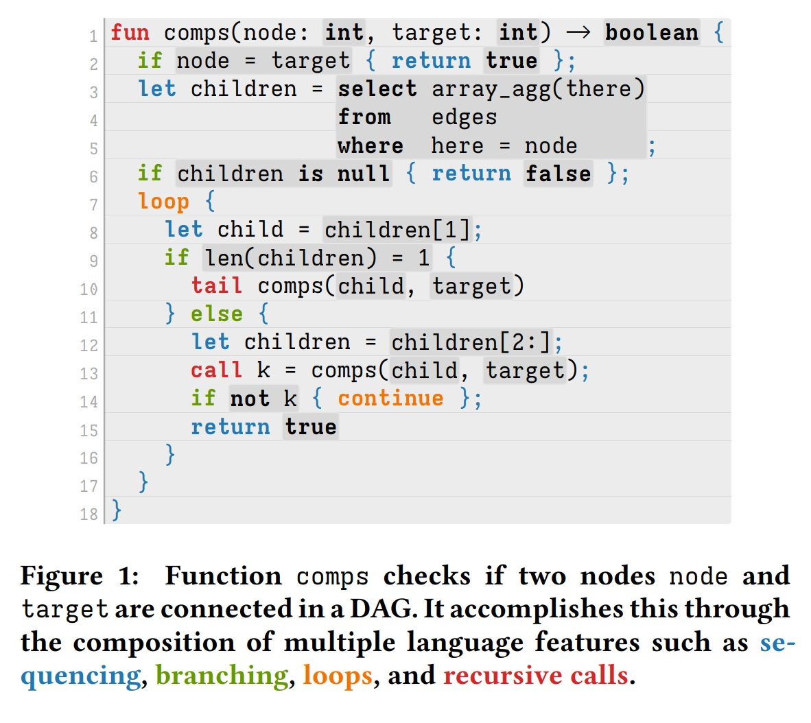
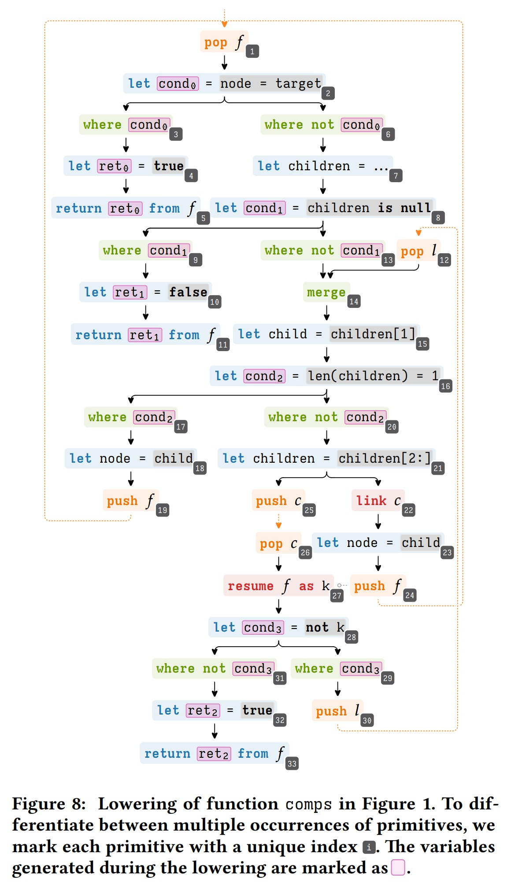
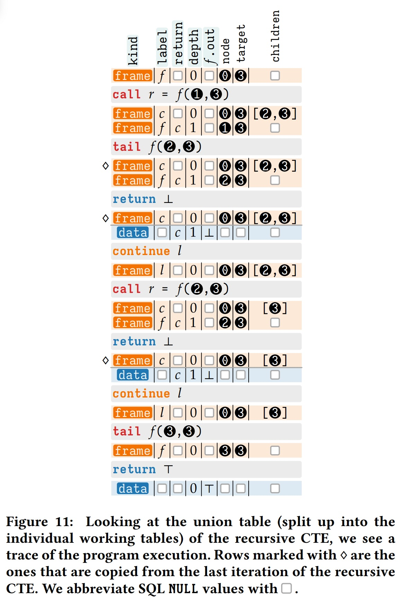
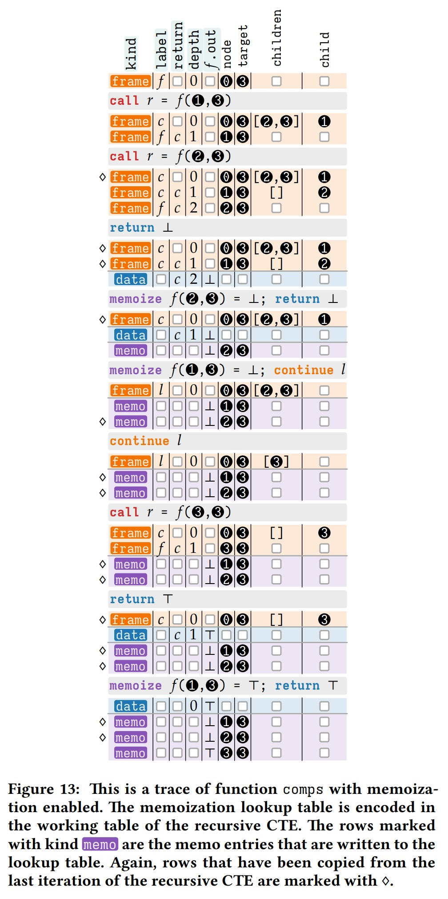
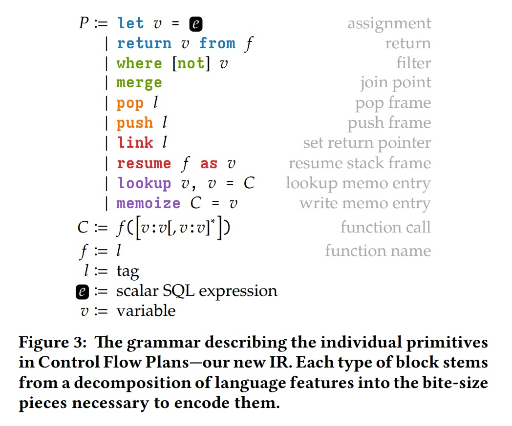
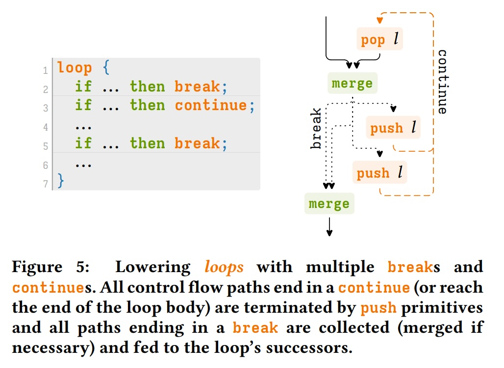
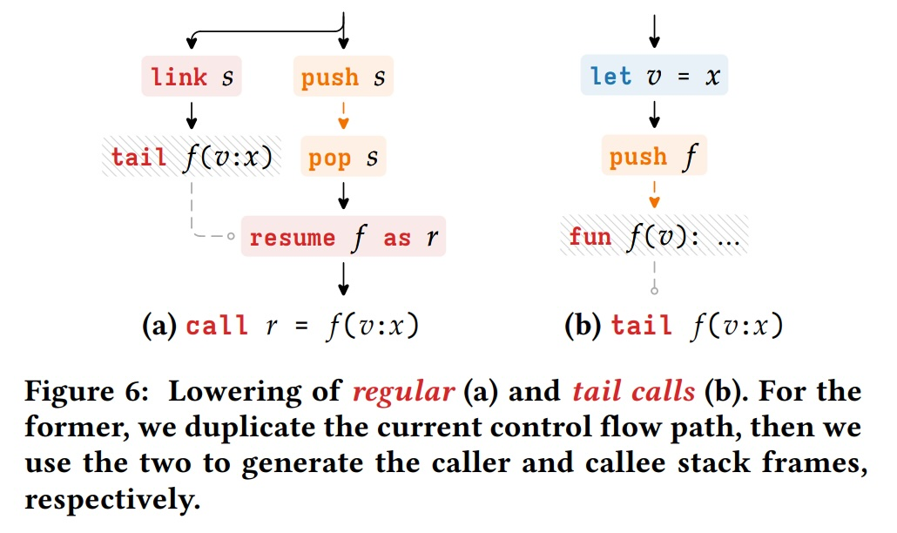
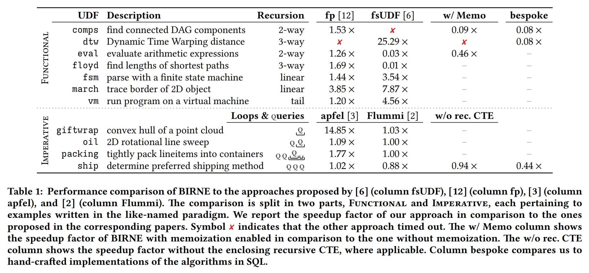
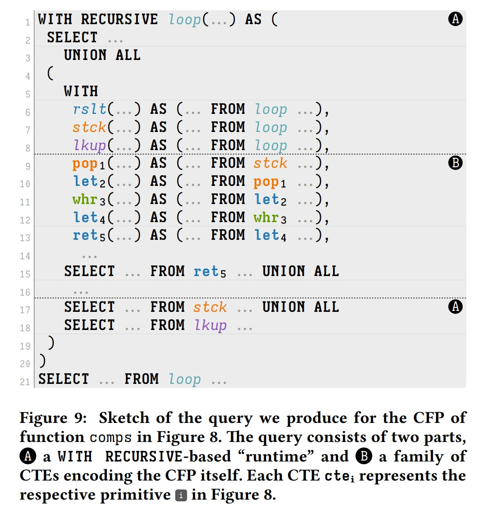
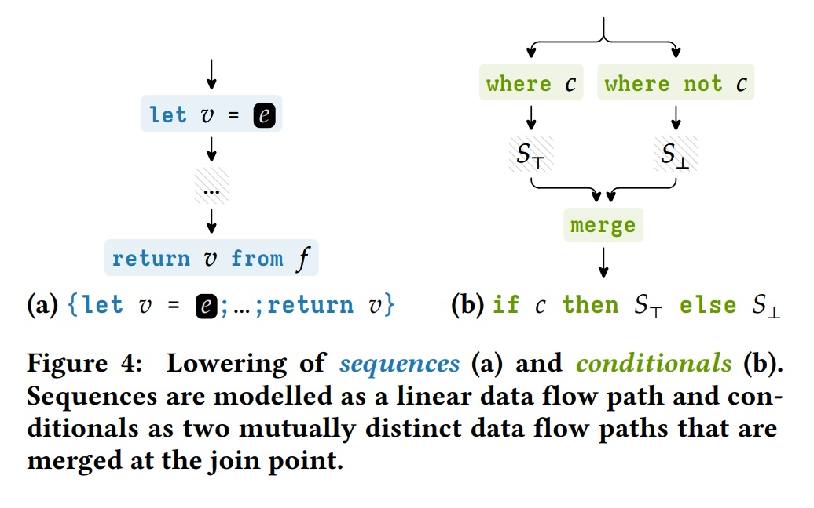

## AI论文解读 | BIRNE: Mixed-paradigm Workload Execution in SQL Engines
        
### 作者        
digoal        
        
### 日期        
2025-11-14        
        
### 标签        
PostgreSQL , PolarDB , DuckDB , AI , 论文解读        
        
----        
        
## 背景  
      
https://dl.acm.org/doi/pdf/10.1145/3735106.3736535        
  
提示:          
```          
读懂《BIRNE: Mixed-paradigm Workload Execution in SQL Engines》这篇论文需要提前掌握哪些基础知识, 请使用中文通熟易懂的讲解这些基础知识, 可以引用论文中的图、表或使用Markdown支持的图形(text,mermaid等)增加解释性. 
  
使用中文通熟易懂的解读《BIRNE: Mixed-paradigm Workload Execution in SQL Engines》这篇论文, 其中的关键内容请着重讲解, 可以引用论文中的图、表或使用Markdown支持的图形(text,mermaid等)增加解释性. 
  
提取《BIRNE: Mixed-paradigm Workload Execution in SQL Engines》这篇论文中的重要术语, 使用中文对这些术语进行通熟易懂的讲解, 可以引用论文中的图、表或使用Markdown支持的图形(text,mermaid等)增加解释性. 
```     
  
## 1 前置知识 
  
要读懂《BIRNE: Mixed-paradigm Workload Execution in SQL Engines》这篇论文，你需要对数据库、编译器和编程语言的基本概念有一些了解。这篇论文的核心思想非常巧妙：**它介绍了一种叫做 BIRNE 的技术，可以将一个混合了两种编程风格（命令式和函数式）的复杂程序，完整地编译成一条单独的 SQL 查询语句来执行** 。

想象一下，你不需要在应用程序和数据库之间来回跑，而是把整个计算任务“塞给”数据库，让数据库自己一次性跑完。

以下是你需要提前掌握的基础知识，我会用尽可能通俗的语言来解释：

### 1. 核心SQL知识：`WITH RECURSIVE` (递归CTE)

这是理解这篇论文的**最最关键**的基础知识。

* **它是什么？**
    `WITH RECURSIVE`（或递归公共表表达式 C-T-E）是 SQL 中一种强大的功能。你不要被“递归”这个词吓到，在 SQL 里，你基本可以把它理解为一种 **“循环”** 。

* **它怎么工作？**
    一个`WITH RECURSIVE`查询通常包含两部分：
    1.  **初始部分 (Anchor):** 循环的“第0次”执行，它建立一个初始的数据集。
    2.  **递归部分 (Recursive):** 循环的“第1, 2, 3...N次”执行。它会不断地读取**上一次**循环产生的结果，进行计算，然后产生**这一次**的新结果。
    3.  **终止条件：** 当“递归部分”不再产生任何新的数据行时，循环自动停止。

* **BIRNE 怎么用它？**
    BIRNE 的绝妙之处在于，它把**一整条 `WITH RECURSIVE` 查询语句当作一个“运行时” (runtime)** 。
    * 程序的**启动**，就是`WITH RECURSIVE`的“初始部分”。
    * 程序的**每一步执行**，就是`WITH RECURSIVE`的“递归部分”的一次迭代 。
    * 程序的**结束**，就是`WITH RECURSIVE`循环的自动终止 。

### 2. 编程范式：命令式 vs. 函数式

论文标题中的“Mixed-paradigm”（混合范式）  指的就是这两种风格。BIRNE 的目标是同时支持它们 。

* **命令式 (Imperative):** 就像一份详细的菜谱，一步一步告诉计算机“先做什么，再做什么”。
    * **特点：** 使用变量（`let x = ...`）、循环（`loop`）、分支（`if-then-else`） 。
    * **例子：** 论文中的 Figure 1  里的 `loop { ... }`  就是命令式风格。    

* **函数式 (Functional):** 像是在定义数学公式。它倾向于描述“是什么”，而不是“怎么做”。
    * **特点：** 核心是**递归**（Recursion），即一个函数调用它自己来解决问题 。
    * **例子：** Figure 1  中的 `call k = comps(child, target)` ，`comps` 函数内部又调用了 `comps` 自己，这就是函数式风格。

### 3. 编译器（Compiler）基础

BIRNE 本质上是一个**编译器** 。编译器就是个“翻译官”，把一种语言（源语言）翻译成另一种语言（目标语言）。

* **源语言：** BIRNE 使用一种混合范式语言（如 Figure 1 所示） 。
* **目标语言：** **纯 SQL** 。

要理解 BIRNE，你需要知道编译器的基本工作流程：

1.  **解析 (Parsing)：** 读取源代码 (Source Code)，理解它的结构。
2.  **转换 (Transformation)：** 把它转换成一种中间形态，即**中间表示 (Intermediate Representation - IR)**。
3.  **代码生成 (Code Generation)：** 把这个 IR 最终“翻译”成目标语言（SQL）。

#### 关键概念：控制流图 (CFG) 与 控制流计划 (CFP)

* **控制流图 (Control Flow Graph - CFG)：** 这是编译器理解一个程序“执行顺序”的标准方式。它由“基本块”（一串连续执行的指令）和“边”（表示跳转，如 `if` 或 `loop`）组成。
* **控制流计划 (Control Flow Plan - CFP)：** 这是 BIRNE **发明的一种新的 IR** 。它是基于 CFG 改造的，专门为了方便翻译成 SQL 。

    * **特点1：** CFP 的每个“块”只做一件最简单的事（称为原语 primitive） ，比如 `let` (赋值), `where` (过滤), `push` (压栈) 等 。
    * **特点2：** CFP 图本身**没有循环** (acyclic) 。
    * **等一下，没有循环？那 `loop` 怎么办？**
        这就是精髓所在：CFP 把“循环”这个动作，转交给了外层的 `WITH RECURSIVE` 。CFP 里的 `push` 和 `pop` 原语  会操作一个“栈”，而这个“栈”的迭代是由 `WITH RECURSIVE` 驱动的。

你可以看看论文中的 Figure 8 ，这就是 Figure 1  代码对应的 CFP。它看起来像一个复杂的流程图，但它本身没有“向上”的箭头（即循环）；所有的循环都通过 `push l` / `pop l` 来实现。    

### 4. 核心技巧：用 SQL 表格“模拟”一台计算机

这是最需要脑洞的地方。程序运行时需要内存，对吧？比如需要**调用栈 (Call Stack)** 来管理函数调用和递归，需要**变量 (Variables)** 来存数据。

BIRNE 的做法是：**用 `WITH RECURSIVE` 迭代的那个“表” (working table) 来充当计算机的内存** 。

这张表里的**每一行 (Row)**，在执行过程中，可能代表以下三种东西之一 ：

1.  `kind = frame`：一个**栈帧 (Stack Frame)** 。
    * **这是什么？** 当一个函数被调用时，它需要一块内存来存放它的局部变量、参数，以及“执行完后该跳回哪里”（返回地址）。这块内存就叫一个“栈帧”。
    * **BIRNE 怎么做？** 创建一个新行，`kind='frame'`，用 `label` 列表示当前执行到哪一步，`return` 列表示返回地址，其他列（如 `node`, `target`）存放局部变量 。
    * 这就是论文中“关系型调用栈” (Relational Call Stack)  的由来。

2.  `kind = data`：一个**返回值 (Result)** 。
    * **这是什么？** 函数执行完毕，返回一个结果。
    * **BIRNE 怎么做？** 创建一个新行，`kind='data'`，并在 `f.out` 这样的列里填上结果值 。

3.  `kind = memo`：一个**记忆化 (Memoization) 条目** 。
    * **这是什么？** 一种优化技巧。把函数 `f(x)` 的计算结果存起来。下次再调用 `f(x)` 时，直接返回存好的结果，不用重新计算 。
    * **BIRNE 怎么做？** 创建一个新行，`kind='memo'`，把参数和结果都存进去 。

#### 执行示例

你可以看一下 Figure 11  和 Figure 13 。这两张表就是程序执行的 **“痕迹” (Trace)** 。       

* 每一大块（以 `◇` 标记的行除外）代表 `WITH RECURSIVE` 的**一次迭代**。
* `kind` 列显示了 `frame` (栈)、`data` (结果)、`memo` (缓存) 是如何变化的。
* 你可以清晰地看到 `call` (调用) 是如何 `push` 两个 `frame`（一个用于返回，一个用于执行新函数），而 `tail` (尾调用) 是如何只 `push` 一个 `frame`（优化，栈大小不变）。

### 总结：你需要懂什么

| 你需要懂的基础知识 | BIRNE 是怎么用它的？ |
| :--- | :--- |
| **SQL `WITH RECURSIVE`** | 作为整个程序的 **“执行引擎”** 和 **“循环”** 机制 。 |
| **编程范式** (命令式/函数式) | 作为 BIRNE 编译器的 **“输入”** ，展示了它能处理复杂混合逻辑的能力 。 |
| **编译器原理** (IR, CFG) | BIRNE 设计了自己特有的 IR，叫 **CFP**（控制流计划），专门用于翻译成 SQL 。 |
| **程序执行模型** (调用栈) | BIRNE **不用 SQL 数组** ，而是巧妙地用数据库 **“行”** 来模拟**调用栈**、**变量**和**缓存** 。 |

掌握了这些，你就能明白这篇论文的作者是如何用纯粹的关系代数（SQL）来“模拟”一个通用的、支持递归和循环的计算过程了。
  
## 2 解读论文 
  
好的，这是一篇非常精巧的数据库和编译器技术结合的论文。我会为你通俗地解读一下它的核心思想和关键技术。

### 论文核心思想：一句话概括

**BIRNE 是一种编译器，它能把一个复杂的、混合了“循环”和“递归”的程序，“翻译”成一条单独的、庞大但高效的 SQL 查询语句，让数据库自己就能把整个程序跑完** 。

想象一下：你不用在你的应用程序（比如 Python 或 Java）和数据库之间“来回倒腾”数据了。你直接把一个复杂的计算任务（比如 Figure 1 里的图路径搜索 ）交给 BIRNE，它会生成一个 `SELECT ...` 语句。你把这个 SQL 扔给数据库（比如 DuckDB ），数据库执行完，直接返回最终结果。    

---

### 关键内容 1：要解决的“混合范式”是什么？

论文标题里的“Mixed-paradigm”（混合范式）是理解本文的第一个关键点 。它指的是两种编程风格：

1.  **命令式 (Imperative)：** 像我们平时写的“一步一步”的代码，使用**循环 (loop)**、**分支 (if/else)** 和**变量** 。
2.  **函数式 (Functional)：** 像数学函数一样，主要通过**函数调用函数**，尤其是**递归 (Recursion)**（函数调用自己）来表达逻辑 。

**论文中的 Figure 1 就是“混合范式”的完美例子** ：
* 它有一个 `loop` 循环（第7行），这是**命令式**的 。
* 它在循环内部又 `call comps(...)` 递归调用了自己（第10行和13行），这是**函数式**的 。

BIRNE 的目标就是，无论你的代码长这样（混合的），还是纯命令式、纯函数式，它都能处理。

---

### 关键内容 2：BIRNE 的“魔法”—— 用 SQL 模拟一台计算机

BIRNE 最绝妙的地方，在于它如何用纯 SQL 来“模拟”一个程序的运行。程序运行需要什么？**调用栈 (Call Stack)**！

当你调用一个函数时，计算机会把这个函数的局部变量、返回地址等信息“推” (push) 到一个栈上。当函数返回时，再“弹” (pop) 出来。

BIRNE 说：**我不需要真正的栈，我可以用数据库的“表”来模拟！** 这就是它的核心贡献之一： **“关系型调用栈” (Relational Call Stack)** 。

它是怎么做的呢？

它生成的 SQL 主体是一个巨大的 `WITH RECURSIVE` 查询（你可以把 `RECURSIVE` 暂时理解为 SQL 里的“循环”）。这个查询会操作一个“工作表”，表里的**每一行**都代表了程序运行时的某个状态。

最关键的是这张表里有一个 `kind` (类型) 列，用来区分这一行数据到底是什么 ：

| `kind` (类型) | 含义 | 通俗解释  |
| :--- | :--- | :--- |
| `frame` | **栈帧** | “程序要执行一步了。” 这一行保存了所有局部变量（比如 `node`, `target`）和程序“指针”（`label`，表示执行到哪了；`return`，表示返回后去哪）。|
| `data` | **数据/结果** | “一个函数算完了！” 这一行保存了函数的返回值（比如 `f.out = true`）。|
| `memo` | **缓存条目** | “这个我算过了，存一下。” 这一行用于“记忆化”(Memoization)，存下了 `f(参数) = 结果`，避免重复计算。|

#### 执行过程就像这样：

你可以看一下论文中的 **Figure 11** ，它就是这个“工作表”在执行 `comps(1, 3)` 时的“快照”：    

1.  **开始（第1次迭代）：** 只有一行 `kind=frame`，表示 `call f(1, 3)`（f 是 comps 的内部标签）。
2.  **第2次迭代：** 程序发现 `1 != 3`，并且有子节点 `[2, 3]`。它需要递归调用 `call r = f(2, 3)`。于是它向工作表“推” (push) 了**两个**新的 `frame` ：
    * 一个 `frame` 是“暂停”的调用者（标签 `c`），它在等待 `f(2, 3)` 的结果。
    * 一个 `frame` 是“新的”被调用者（标签 `f`），它准备执行 `f(2, 3)`。
3.  **第3次迭代：** 程序执行 `f(2, 3)`，又发现 `2 != 3`，又 `call r = f(3, 3)`... 栈继续变深。
4.  **第N次迭代：** 终于，`f(3, 3)` 被执行。这次 `3 == 3`，满足 `if node = target { return true }`。
5.  **第N+1次迭代：** `f(3, 3)` 不再产生 `frame`，而是产生了一行 `kind=data`，代表 `return T` (True)。
6.  **第N+2次迭代：** 之前“暂停”的 `frame`（`c`）看到了这个 `data` 结果，于是它被“唤醒” (`resume`)，拿到了 `T`，然后自己也 `return T`。
7.  ...这个过程不断持续，直到最初的 `call f(1, 3)` 也拿到了 `T` 并返回。
8.  **结束：** 当工作表里不再有 `frame`（栈空了），`WITH RECURSIVE` 循环停止，最终的 `data` 行就是查询结果 。

---

### 关键内容 3：“控制流计划” (CFP) - 翻译的“中间语言”

BIRNE 并不是直接把 Figure 1 的代码翻译成 SQL。它需要一个中间步骤，这就是 **Control Flow Plans (CFP)** 。    

CFP 是一种特殊的流程图，它基于传统的“控制流图”(CFG) ，但有几个关键区别：

1.  **极简“积木块”：** CFP 的每个“块”只做一件最简单的事（称为“原语” Primitive）。比如：
    * `let v = ...` (赋值)
    * `where c` (过滤，相当于 `if`)
    * `push l` (压栈，用于循环/调用)
    * `pop l` (弹栈)
    * `resume` (唤醒一个暂停的栈帧)
    * `lookup` / `memoize` (读/写缓存)
    * 论文的 **Figure 3**  列出了所有这些“积木块”。     

2.  **CFP 图本身“无环”：** 这是最反直觉的一点。一个代表了 `loop` 循环的 CFP 图，它**本身是没有环的** 。

**那循环和递归是怎么实现的？**
答案是：CFP 把“循环”这个动作，转换成了对“关系型调用栈”的操作 。

* **`loop` 怎么实现 (Figure 5)：**    
    * 循环体末尾的 `continue`（或自然的循环返回）被翻译成一个 `push` 原语 。
    * `break` 则不 `push`，直接跳到循环后面的 `merge` 块 。
* **`call` 怎么实现 (Figure 6a)：**    
    * 一个普通调用 `r = f(x)` 被翻译成两部分 ：
        1.  **调用者 (Caller)：** `push` 一个“暂停”帧（用于 `resume`），等待结果 。
        2.  **被调用者 (Callee)：** `push` 一个“执行”帧，真正去运行函数 `f` 。
* **`tail call` (尾调用) 优化 (Figure 6b)：**
    * 尾调用（函数的最后一步是调用另一个函数）被优化了 。它**不需要** `push` “暂停”帧，因为它永远不会返回 。这极大地节省了栈空间。

**Figure 8**  就展示了 Figure 1 的代码被“降低”(Lowering) 成了由33个“积木块”组成的 CFP。     

---

### 关键内容 4：实验结果 (Table 1) 告诉我们什么

BIRNE 真的好用吗？论文的 **Table 1**  给出了答案：    

1.  **BIRNE vs. 其他学术方案 (fp, apfel, Flummi)：** BIRNE 在大部分情况下都**更快** 。这证明它的 CFP 和“关系型调用栈”设计是高效的。
2.  **记忆化 (Memoization) 是双刃剑：** `w/ Memo` 列显示，`dtw` 这个 UDF（用户自定义函数）用了记忆化后快了 **25倍** (`25.29 x`) ！但 `comps` 和 `eval` 反而慢了 (`0.09 x`, `0.03 x`) 。
    * **为什么会变慢？** 因为 BIRNE 的缓存是存在工作表里的 `kind=memo` 行 。在 `WITH RECURSIVE` 的**每一步**迭代中，这些 `memo` 行都**需要被复制**到下一次迭代 。如果缓存条目太多，这个复制的开销（论文中 Figure 13 标注 `◇` 的行）就比重新计算还大了！   
3.  **BIRNE vs. 人工手写SQL (bespoke)：** `bespoke` 列显示，人类专家手写的“定制版” SQL 查询，性能比 BIRNE 生成的通用查询要快 **10倍以上** (`0.08 x`) 。
    * 这不丢人。它说明 BIRNE 作为一个**通用编译器**，已经非常接近理论极限了，但它无法像人类一样利用特定问题的“捷径”（比如用并行的聚合操作）。

### 总结

BIRNE 是一项非常出色的工作。它搭建了一座桥梁，连接了“高级编程语言”（带循环和递归）和“关系型数据库”（SQL）。

它通过**控制流计划 (CFP)** 这一巧妙的中间表示，将复杂的程序逻辑“拍平”，并使用 **`WITH RECURSIVE`** 作为“执行引擎”，用 **“关系型调用栈”** （即 `kind=frame` 的行）在纯 SQL 环境下模拟了程序的执行、调用和返回。

这使得开发者可以用更自然、更强大的方式在数据库内部处理数据，而无需将数据来回搬运。
  
## 3 术语 
  
根据您提供的论文《BIRNE: Mixed-paradigm Workload Execution in SQL Engines》，我为您提取了其中几个关键术语，并提供了通俗易懂的中文讲解。

-----

### 1\. BIRNE

**BIRNE** 是这篇论文提出的系统的名称，它是 "Braiding Iteration and Recursion in SQL Engines"（在SQL引擎中编织迭代与递归）的缩写 。

  * **通俗讲解：**
    你可以把 BIRNE 想象成一个高级“翻译官”（编译器）。它的工作是把你写的复杂程序（特别是那些既包含循环又包含递归的程序），完整地“翻译”成一个单一、高效的 SQL 查询语句 。这样一来，你就可以让数据库自己去执行这些复杂的计算任务，而不需要在数据库和应用程序之间来回折腾 。

### 2\. Mixed-paradigm Workload (混合范式工作负载)

这是 BIRNE 旨在解决的核心问题，即同时包含不同编程风格（范式）的程序 。

  * **通俗讲解：**
    编程范式就像是解决问题的不同“流派”。

      * **命令式 (Imperative)：** 像写菜谱一样，一步步告诉计算机“先做什么，再做什么”。它依赖循环（loops）和变量修改来控制流程 。
      * **函数式 (Functional)：** 像解数学题一样，通过定义函数来解决问题。它依赖函数的自我调用（即递归）来表达控制流 。

    “混合范式”就是把这两种风格“混搭”在一起。论文中的 **图1 `comps` 函数** 就是一个绝佳的例子 ：    

      * 它使用了 `loop { ... }` 循环（命令式）。
      * 它在循环内部又通过 `call k = comps(...)` 递归调用了自己（函数式）。
        BIRNE 的目标就是高效处理这种“混搭”风格的程序。

### 3\. Control Flow Plans (CFPs, 控制流计划)

这是 BIRNE 实现编译的核心数据结构，是论文的主要贡献之一 。

  * **通俗讲解：**
    CFP 是一种“程序蓝图”，它源于传统的控制流图（CFG），但为了能翻译成 SQL 做了专门的改造 。

    它有两大特点：

    1.  **极简指令 (Primitives)：** CFP 的每个“块”只包含一条最基础的指令，称为“原语”（Primitive），比如 `let`（赋值）、`where`（过滤）等 。这就像把复杂的乐高模型拆解成一堆最小的积木块。
    2.  **无循环 (Acyclic)：** 这张“蓝图”本身是**不允许有环路**的 。所有的循环和递归，都会被转换成一种特殊的“状态机” ，然后在 SQL 的递归查询（见下文）中“跑起来” 。

    整个编译过程可以概括为：

    ```mermaid
    graph TD
        A["高级代码 (如图1的comps)"] --"1\. Lowering (降级)"--> B(CFP 控制流计划);
        B --"2\. Code Generation (代码生成)"--> C["单一的SQL查询 (如图9)"];
    ```

  

### 4\. Primitives (原语)

构成 CFP 的基础指令，类似于计算机的汇编指令 。论文在 **图3**  中定义了它们。    

  * **通俗讲解：**
    这些是构建 CFP 的“积木块”，每一种只做一件最简单的事。例如：
      * `let v = ...`: 计算一个新变量 。
      * `where c`: 根据条件 `c` 决定是否“放行”当前的数据流（栈帧）。
      * `merge`: 将两条或多条分开的控制流路径合并回一条 。
      * `push l`: 将一个“任务”（栈帧）推入“待办清单”（栈）。
      * `pop l`: 从“待办清单”（栈）中取出一个“任务”开始执行 。
      * `lookup` / `memoize`: 用于支持“记忆化”（见下文）。

### 5\. Lowering (降级/底化)

这是 BIRNE 编译的第一阶段 ，即把高级程序代码转换为 CFP 的过程 。

  * **通俗讲解：**
    "Lowering" 就是一个翻译过程，把程序员写的 `if`、`loop`、`call` 等高级语法，翻译成由 `push`、`pop`、`where`、`merge` 等基础“原语”组合而成的 CFP 蓝图。

      * **分支 (Branching):** `if/else` 语句会被降级为 `where` 和 `where not` 两条互斥路径，最后用 `merge` 合并 (见 **图4b**) 。    
      * **循环 (Looping):** 循环的“跳回”动作（如 `continue`）被降级为 `push` 操作（把任务放回待办清单）；循环的“入口”被降级为 `pop` 操作（从清单取任务）。(见 **图5**) 。     

### 6\. Recursive CTE (递归公用表表达式)

即 SQL 中的 `WITH RECURSIVE` 语句。这是 BIRNE 生成的 SQL 查询的核心，充当了整个程序的“运行时”（runtime）。

  * **通俗讲解：**
    你可以把 `WITH RECURSIVE` 想象成 SQL 里的一个“循环引擎”。BIRNE 把整个 CFP 蓝图都塞进了这一个“循环引擎”里 。

    这个引擎的每一次“迭代”（iteration），都会从“待办清单”（栈）里 `pop` 一个任务，按照 CFP 蓝图执行一步，然后可能会 `push` 一个或多个新任务到“待办清单”中，供下一次迭代使用 。这个过程会一直持续，直到“待办清单”为空，程序执行完毕 。

### 7\. Relational Call Stack (关系型调用栈)

这是 BIRNE 实现函数调用和递归的一种创新方式 。

  * **通俗讲解：**
    程序执行需要一个“调用栈”（call stack）来管理函数调用（比如 `comps` 调用 `comps`）。传统的做法可能使用 SQL 数组，但性能不好 。

    BIRNE 的方法非常巧妙：**它不用数组，而是用“表中的行（rows）”来充当调用栈** 。
    在 `WITH RECURSIVE` 生成的表中，有一个 `kind` 列 ，用来区分每一行的“身份”：

      * `kind = 'frame'`: 这一行代表一个“待办任务”，即一个栈帧 。
      * `kind = 'data'`: 这一行代表一个函数执行完毕的“返回值” 。
      * `kind = 'memo'`: 这一行代表一个“缓存”结果（用于记忆化）。

    `push` 操作就是向下一次迭代“插入”一个 `kind = 'frame'` 的新行 。`pop` 操作就是读取当前迭代中 `kind = 'frame'` 的行 。

### 8\. Memoization (记忆化)

一种常见的优化技术，BIRNE 将其作为一项特性（通过 `lookup` 和 `memoize` 原语）。

  * **通俗讲解：**
    “记忆化”就是“记仇”，或者说“好记性”。指的是把函数算过的结果（例如 `comps(2, 3)` 的结果是 `true`）存起来 。下次如果再遇到一模一样的调用，就不用重新算了，直接从“小本本”（查找表）里读出之前的结果 。

      * **实现：** 在 BIRNE 中，这个“小本本”就是 `kind = 'memo'` 的那些行 。
      * **注意：** 论文在 **表1**  和 4.1 节中也提到 ，这种优化并非总是更快。因为维护这个“小本本”本身也有开销（比如在递归CTE的每次迭代中复制这些 `memo` 行）。如果重复计算很少，或者维护开销太大，反而会导致性能下降 。    
  
## 参考        
         
https://dl.acm.org/doi/pdf/10.1145/3735106.3736535    
        
<b> 以上内容基于DeepSeek、Qwen、Gemini及诸多AI生成, 轻微人工调整, 感谢杭州深度求索人工智能、阿里云、Google等公司. </b>        
        
<b> AI 生成的内容请自行辨别正确性, 当然也多了些许踩坑的乐趣, 毕竟冒险是每个男人的天性.  </b>        
    
#### [PolarDB 学习图谱](https://www.aliyun.com/database/openpolardb/activity "8642f60e04ed0c814bf9cb9677976bd4")
  
  
#### [PostgreSQL 解决方案集合](../201706/20170601_02.md "40cff096e9ed7122c512b35d8561d9c8")
  
  
#### [德哥 / digoal's Github - 公益是一辈子的事.](https://github.com/digoal/blog/blob/master/README.md "22709685feb7cab07d30f30387f0a9ae")
  
  
#### [About 德哥](https://github.com/digoal/blog/blob/master/me/readme.md "a37735981e7704886ffd590565582dd0")
  
  

  
