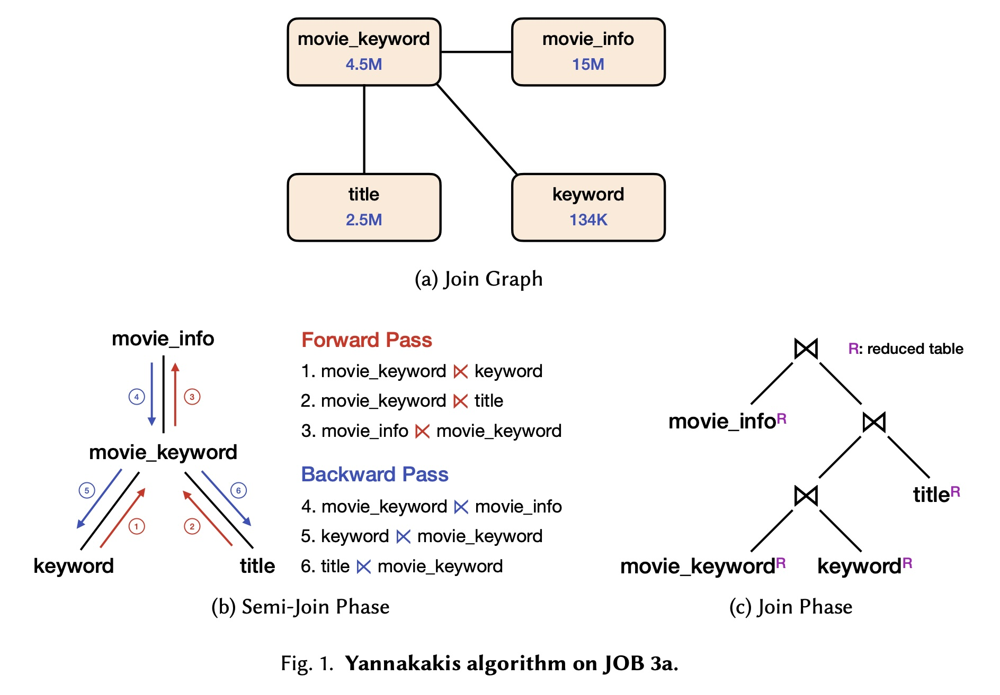
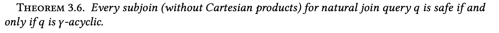
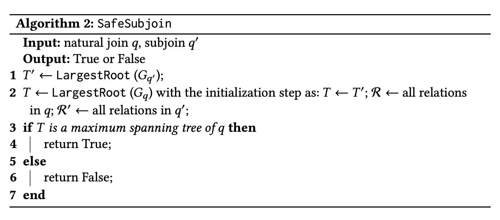
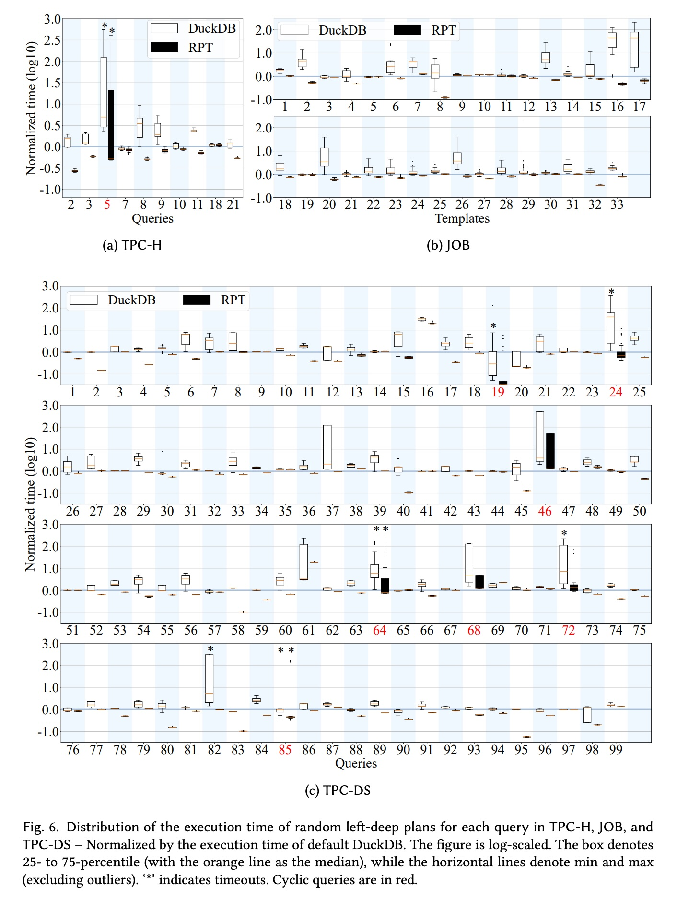
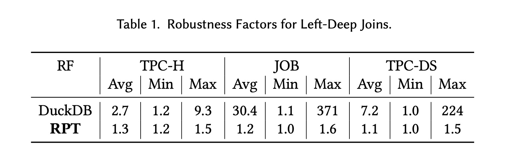
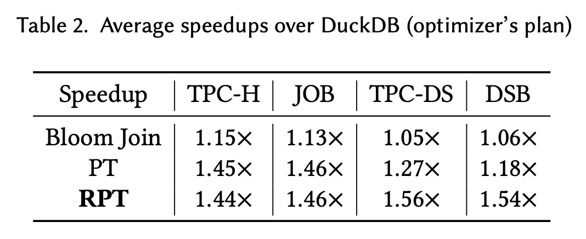
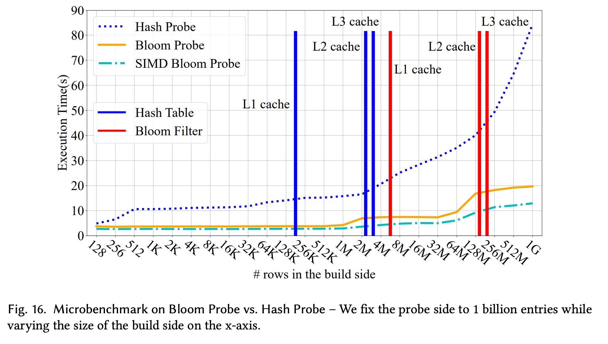
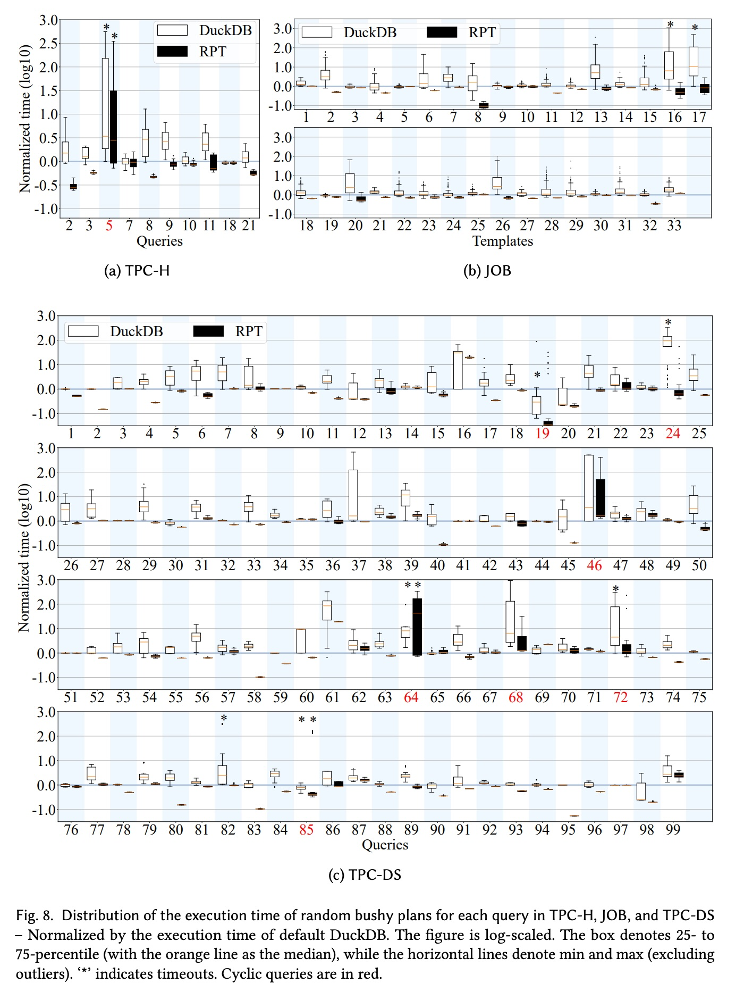
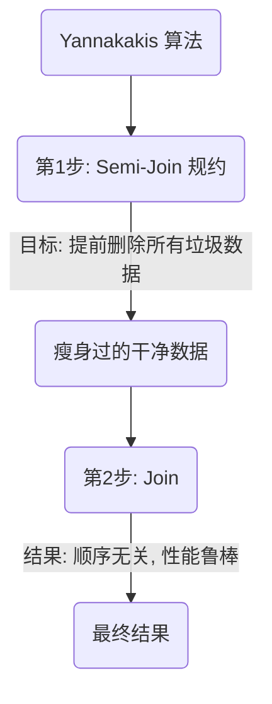
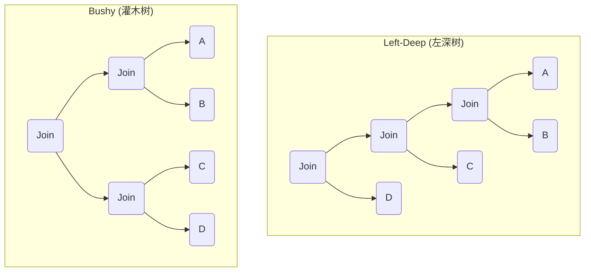

## AI论文解读 | Debunking the Myth of Join Ordering: Toward Robust SQL Analytics
        
### 作者        
digoal        
        
### 日期        
2025-11-14        
        
### 标签        
PostgreSQL , PolarDB , DuckDB , AI , 论文解读        
        
----        
        
## 背景  
      
https://dl.acm.org/doi/pdf/10.1145/3725283        
  
提示:          
```          
读懂《Debunking the Myth of Join Ordering: Toward Robust SQL Analytics》这篇论文需要提前掌握哪些基础知识, 请使用中文通熟易懂的讲解这些基础知识, 可以引用论文中的图、表或使用Markdown支持的图形(text,mermaid等)增加解释性. 
  
使用中文通熟易懂的解读《Debunking the Myth of Join Ordering: Toward Robust SQL Analytics》这篇论文, 其中的关键内容请着重讲解, 可以引用论文中的图、表或使用Markdown支持的图形(text,mermaid等)增加解释性. 
  
提取《Debunking the Myth of Join Ordering: Toward Robust SQL Analytics》这篇论文中的重要术语, 使用中文对这些术语进行通熟易懂的讲解, 可以引用论文中的图、表或使用Markdown支持的图形(text,mermaid等)增加解释性. 
```     
  
## 1 前置知识 
  
好的，这是一篇很有意思的论文。它试图解决一个数据库领域“老大难”的问题：**Join（连接）操作的顺序**。

为了帮助你“无痛”阅读这篇论文，你需要储备一些基础知识。我会用尽可能通俗易懂的语言，结合论文中的图示来为你讲解。

---

### 1. 数据库的“世纪难题”：Join 顺序

这是你首先要理解的核心问题。

* **什么是 Join？**
    想象你有两张表：一张是“学生表”（有 `学生ID`、`姓名`），另一张是“选课表”（有 `学生ID`、`课程名`）。你想知道“每个学生都选了什么课”，你就要用 `学生ID` 这个共同字段把两张表“连接”起来，这就是 **Join**。

* **什么是 Join 顺序问题？**
    如果只有两张表，很简单。但如果一个查询需要连接 5、6 张甚至 10 张表（比如：学生、课程、教师、院系、教室...）呢？

    比如 `A join B join C`，数据库可以有两种执行顺序：
    1.  先 `(A join B)`，得到一个“中途结果”，再用这个结果去 `join C`。
    2.  先 `(B join C)`，得到一个“中途结果”，再用 `A` 去 `join` 这个结果。

* **为什么顺序很重要？**
    **因为“中途结果”的大小可能天差地别！** 

    * **好的顺序：** `(A join B)` 的结果很小（比如只有 10 行），再 `join C` 就很快。
    * **坏的顺序：** `(B join C)` 的结果非常大（比如 10 亿行），再 `join A` 就会慢到怀疑人生。

    论文里提到，现代数据库的“查询优化器” 本该负责找到“好的顺序”，但它常常会“猜错”。因为它依赖一个叫 **“基数估计”（Cardinality Estimation）**  的技术，也就是“猜”中途结果有多大。这个“猜”经常不准 ，导致优化器选出一个“灾难性”的慢计划 。

> 📌 **你需要掌握的：**
> * **SQL Join：** 知道 `SELECT ... FROM A JOIN B ON A.id = B.id` 是什么意思。
> * **查询优化器 (Query Optimizer)：** 知道数据库在执行 SQL 前，会有一个“大脑”（优化器）来制定一个“执行计划”（Plan）。
> * **Join 顺序问题：** 理解 `(A join B) join C` 和 `A join (B join C)` 的性能可能天差地别。
> * **基数估计 (Cardinality Estimation)：** 知道优化器是通过“猜”中间结果大小来做决策的，而且经常猜错。

---

### 2. 理论上的“圣杯”：Yannakakis 算法

这篇论文（RPT）是站在巨人（Yannakakis）的肩膀上的。你必须理解 Yannakakis 算法，才能看懂这篇论文的“初心”。

Yannakakis 算法是一个 1981 年的古老算法 ，它在理论上非常完美，能保证 Join 的执行时间是最优的（ $O(N+OUT)$ ，即只跟输入和输出数据量相关 ），**而且完全不受 Join 顺序的影响！** 

它怎么办到的呢？分两步走（参考论文 **Figure 1**）：    

1.  **Semi-Join Phase (半连接阶段)** 
    这是最关键的一步。在真正执行 Join 之前，它会先执行一个“ **全规约（full semi-join reduction）** ” 。

    * **什么是 Semi-Join (半连接)？**
        `A semi-join B` 的意思就是：“在 A 表中，只保留那些在 B 表里能找到匹配项的行”。它只过滤 A，不会真的把 B 的数据合并进来。

    * **全规约（Full Reduction）** 
        Yannakakis 算法会设计一个流程（如 Figure 1b 所示的“前向”和“后向”传递） ，用所有表去“互相过滤”一遍。
        * **通俗比喻：** 想象你在用几大盒乐高（表）拼一个大模型（最终结果）。在动手拼之前，你先把 A 盒里所有“在 B 盒或 C 盒里没有对应件”的“垃圾”零件全都扔掉；再对 B 盒和 C 盒做同样的事。
        * 这个过程结束后，你手里的所有零件（数据行）都是“**最终肯定用得上的**” 。

2.  **Join Phase (连接阶段)** 
    现在，你再用这些“干净”的（被规约过的）表（如 Figure 1c 所示的 `movie_infoR`, `titleR` 等） 去执行真正的 Join。
    因为所有“垃圾”数据都提前被扔掉了，所以这个阶段：(1) 中间结果**绝对不会**膨胀 ；(2) 无论你怎么排 Join 顺序，都一样快。

* **为什么这么好的算法没人用？**
    因为第 1 步（Semi-Join 阶段）在传统上实现起来**太慢了** 。用哈希表（Hash Table）去做半连接的代价，比直接硬着头皮 Join 可能还要高。

> 📌 **你需要掌握的：**  
> * **Semi-Join (半连接)：** 知道它是一种“只过滤，不合并”的操作。  
> * **Yannakakis 算法：** 理解它“先过滤，再连接”的两阶段思想。  
> * **Full Reduction (全规约)：** 明白它的目标是“提前删除所有最终结果里用不上的数据行”。  

---

### 3. “曲线救国”：Predicate Transfer (PT) 与 Bloom Filter

Yannakakis 的第 1 步太慢了，怎么办？
近期的研究（包括这篇论文的基础 ）提出了 **Predicate Transfer (PT)** ，它的核心思想是：**用一种“近似”的、但“更快”的半连接**。

* **什么是 Bloom Filter (布隆过滤器)？** 
    这是一种神奇的数据结构。你可以用它来“**快速判断一个东西在不在一个集合里**”。
    * 它非常快，非常省空间。
    * 但它不完全准确：
        * 如果它说“**不在**”，那**100% 不在**。
        * 如果它说“**在**”，那它**可能在**，也可能是“**误判**”（False Positive）。

* **PT 怎么用 Bloom Filter？**
    在 Yannakakis 的第 1 步（Semi-Join 阶段）中，当需要 `A semi-join B` 时，它不真的去做半连接，而是：
    1.  为 B 表的连接键（join key）建一个 Bloom Filter ( $\mathcal{B}_S$ ) 。
    2.  用 A 表的每一行去这个 Bloom Filter 里“查一下”。
    3.  如果 Bloom Filter 说“**不在**”，就安全地把这行数据**删除**（因为 100% 匹配不上）。
    4.  如果说“**在**”，就**保留**它（它可能是真匹配，也可能是误判） 。

    这个“用 Bloom Filter 过滤” 的过程，就比传统半连接快多了。虽然会因为“误判”而漏掉一些“垃圾”数据，但没关系，反正第 2 步（Join 阶段）会把它们清除掉 。

* **这篇论文（RPT）要解决的 PT 的问题：**
    原版的 PT 算法虽然快，但它在构建 Bloom Filter 的传递顺序上比较“随意”（比如用一个简单的 Small2Large 启发式）。
    这导致它**丢失了 Yannakakis 算法的理论保证**，它无法保证“全规约”，在某些情况下，它过滤得不够好，导致 Join 顺序问题**依然存在** 。

> 📌 **你需要掌握的：**
> * **Bloom Filter (布隆过滤器)：** 知道它是一个“可能会误判（False Positive），但绝不会漏判（False Negative）”的快速过滤器。
> * **Predicate Transfer (PT)：** 理解它就是“用 Bloom Filter 来加速实现 Yannakakis 的第 1 步”。

---

### 4. 真正看懂论文：图论与“万能钥匙”

这篇论文的核心贡献（RPT），就是 **“修好”PT 算法，让它重新获得 Yannakakis 的鲁棒性（Robustness）保证** 。而它用来“修好”PT 的工具，就是**图论**。

* **Join Graph (连接图)**
    这是理解这篇论文算法的“地图”。
    * **长什么样？** 就像论文的 **Figure 1a** 。
    * **怎么画？** 每个**表**是一个“**节点**”（方框）。如果两个表需要 Join，就在它们之间连一条“**边**”。

* **Acyclic Query (无环查询)**
    Yannakakis 算法只对“无环查询”有理论保证 。
    * **什么是无环？** 就是这个 Join Graph（连接图）长得像一条线、或一棵树， **没有“环”** （比如 A-B-C-A）。
    * 这篇论文也主要关注无环查询 。

* **Join Tree (连接树) 与 Maximum Spanning Tree (最大生成树)**
    这是 RPT 算法 `LargestRoot`  的关键。
    * **问题：** 就算一个查询是“无环”的（Join Graph 是一棵树），我们怎么确定 Bloom Filter 的传递顺序（即 Figure 1b 的箭头方向）才能保证“全规约”呢？
    * **答案：** 答案是把 Join Graph 转换成一个“**Join Tree**” 。
    * **关键洞察（Lemma 3.2）** ：论文指出，对于无环查询，找到这个“Join Tree”的问题，等价于在 Join Graph 上找到一个“**Maximum Spanning Tree (MST，最大生成树)**” 。
        * （这里的“最大”是指边的“权重”最大，权重=两个表之间共享的连接键数量 ）。
    * **RPT 的 `LargestRoot` 算法：** 就是一个用来构建 MST（最大生成树）的算法 ，它以此确定一个 **能保证“全规约”** 的 Bloom Filter 传递顺序 。

> 📌 **你需要掌握的：**
> * **图论基础：** 知道什么是“图”、“节点”、“边”、“环”、“树”。
> * **Join Graph：** 知道如何把一个 SQL 查询画成一张“表-边-表”的图。
> * **Acyclic (无环)：** 理解这是 Yannakakis 和 RPT 算法发挥作用的前提。
> * **Maximum Spanning Tree (MST)：** 至少知道这是一个图论算法，RPT 用它来“导航”，以找出最佳的过滤顺序。

---

### 总结：你的知识储备清单

要读懂这篇论文，你需要按顺序掌握以下知识点：

1.  **数据库基础：**
    * SQL 的 **JOIN** 操作。
    * **Semi-Join (半连接)**。
2.  **查询优化：**
    * **Join 顺序问题**（为什么重要）。
    * **Cardinality Estimation (基数估计)**（为什么优化器会选错）。
3.  **数据结构：**
    * **Bloom Filter (布隆过滤器)**（PT/RPT 的核心工具）。
4.  **核心理论算法：**
    * **Yannakakis 算法**（RPT 的“精神导师”和理论基础）。
5.  **图论：**
    * **Join Graph (连接图)**（RPT 的“地图”）。
    * **Acyclic (无环)**（RPT 的“适用范围”）。
    * **Maximum Spanning Tree (最大生成树)**（RPT `LargestRoot` 算法的“导航仪”）。

希望这份指南能帮你扫清阅读障碍！
  
## 2 解读论文 
  
这是一篇信息量巨大且非常精彩的论文。它试图“破解”数据库领域一个长达几十年的“神话”——  **Join 顺序优化（Join Ordering）** 。

通俗来说，这篇论文的核心观点是：

> 几十年来，所有人都认为“必须为 SQL 找到最佳的 Join 顺序，否则性能会差几千倍”。但这篇论文说：“**不一定！我们找到了一种新方法（RPT），用了它之后，对于绝大多数查询，你随便**用什么 Join 顺序，性能都差不多一样快，而且还比以前更快！**”**

这篇论文因此“揭穿了 Join 顺序的神话” 。下面我为你详细解读这篇论文的关键内容。

-----

### 1\. 核心问题：Join 顺序的“诅咒”

  * **什么是 Join 顺序问题？**
    当你查询需要连接 3 张表（A, B, C）时，数据库可以先 `(A join B)` 再 `join C`，也可以先 `(B join C)` 再 `join A`。
  * **为什么重要？**
    Join 的顺序对性能是**致命的** 。一个“坏”的顺序可能产生一个巨大的“中途结果”（比如 10 亿行），导致查询慢到天荒地老；而一个“好”的顺序可能中途结果只有 100 行，查询瞬间完成 。
  * **现在的麻烦：**
    数据库依靠“查询优化器”（Query Optimizer）来“猜”哪个顺序最好 。但这个“猜测”依赖于“基数估计”（Cardinality Estimation），而这个估计**非常不准** 。
    结果就是：现代数据库（包括商业数据库）的优化器，经常会选出一个比最优计划**慢几百倍甚至几千倍**的“灾难性”计划 。

-----

### 2\. 理论上的“圣杯”：Yannakakis 算法

这篇论文（RPT）的思想，源自一个 1981 年的古老算法：**Yannakakis 算法** 。

这个算法在理论上非常完美：它能保证对于“**无环查询**”（Acyclic Query，后面会解释），Join 的总复杂度只跟你的**输入数据和最终输出数据**有关，**与中间 Join 顺序完全无关** ！

它是如何做到“Join 顺序无关”的呢？它把 Join 拆成两步（如论文 Figure 1 所示）：


1.  **第 1 步：Semi-Join 规约（Figure 1b）**
    这是最关键的一步。它不直接做 Join，而是先做一种叫“半连接”（Semi-Join）的操作，进行“**全规约**”（full semi-join reduction）。

      * **通俗比喻：** 假设你要用 A、B、C 三盒乐高拼一个模型。在动手拼之前，你先把 A 盒里“在 B 盒或 C 盒里找不到对应件”的“垃圾零件” **全部提前扔掉** ；再对 B 盒和 C 盒做同样的事。
      * 这个过程（Figure 1b 的“前向”和“后向”传递）结束后，你手里剩下的所有表（如 Figure 1c 的 `movie_infoR`, `titleR`...）都**被规约到了最小** 。所有“注定”在最终结果里没用的数据行，都提前被删除了 。

2.  **第 2 步：Join 阶段（Figure 1c）**
    现在，你用这些“被瘦身过”的表去执行真正的 Join。因为所有“垃圾”数据都没了，这个阶段的**任何中间结果都不会膨胀** 。因此，你**随便用什么顺序**去 Join，都一样快 。

**Yannakakis 算法的悲剧：** 理论很美，但第 1 步（Semi-Join 规约）如果用传统的哈希表（Hash Table）来实现，**开销巨大，慢得离谱**，所以几乎没有数据库系统真的使用它 。

-----

### 3\. 关键的“前任”：Predicate Transfer (PT) 的“捷径”与“缺陷”

近期的研究（PT）提出：既然第 1 步的 Semi-Join 太慢，我们换个快的东西——**Bloom Filter (布隆过滤器)**——来“**近似**”地实现它 。

  * **Bloom Filter (BF) 是什么？**
    一个神奇的“过滤器”。它非常快，非常省空间，特点是：

      * 如果 BF 说“**不在**”，那**100% 不在**。
      * 如果 BF 说“**在**”，那**可能在**，也可能是“**误判**”（False Positive）。

  * **PT 算法：**
    用 BF 替代 Semi-Join 。比如 `A semi-join B`，它就为 B 建一个 BF，然后用 A 去“探测”。如果 BF 说“不在”，就安全地把 A 的这行数据扔掉 。

  * **PT 的缺陷（论文要解决的关键问题）：**
    PT 为了快，使用了一个简单的启发式（Small2Large）来决定 BF 的传递顺序 。但这导致它**丢失了 Yannakakis 算法的理论保证** 。
    如论文 Figure 2 所示，PT 的方法可能导致过滤信息“传递不全”（比如 S 和 T 的过滤信息无法交换），**导致“规约”不彻底** 。
    **结果就是：** PT 很快，但不“鲁棒”，**Join 顺序问题依然存在** 。

-----

### 4\. 本文的核心贡献：Robust Predicate Transfer (RPT)

这篇论文的作者们“重新发现”了 PT ，并提出了两个新算法，将其“修复”为 **RPT（鲁棒的谓词传递）** ，使其**既有 PT 的速度，又能继承 Yannakakis 的鲁棒性理论保证** 。

#### 贡献一：`LargestRoot` 算法 (保证“过滤”阶段的鲁棒性)

RPT 的第一个核心贡献是 `LargestRoot` 算法（Algorithm 1）。它解决了 PT 算法“规约不彻底”的问题。    

  * **背景：** Yannakakis 算法的理论保证，依赖于一个叫“**Join Tree**”的东西。对于“无环查询”，只要你按照“Join Tree”的结构去传递过滤信息，就能保证“全规约”。
  * **关键洞察 (Lemma 3.2)：** 论文指出，对于无环查询，找到这个“Join Tree”的“神奇钥匙”，就是构建一个“**Maximum Spanning Tree (MST, 最大生成树)**” 。
  * **`LargestRoot` 算法：**
    它就是在 Join Graph（连接图，如 Figure 1a）上构建 MST 的算法 。    
    1.  它以**最大的表**（通常是事实表）作为“根”（Root），这很聪明，因为可以先用小表（维度表）去过滤大表 。
    2.  它构建出的这棵树，**被证明（对于无环查询）就是一个 Join Tree** 。
    3.  **结果：** 只要按照 `LargestRoot` 生成的树（即 Transfer Graph）来传递 Bloom Filter，RPT 就 **能保证“全规约”** ，完美继承了 Yannakakis 算法的第 1 步 。

#### 贡献二：`SafeSubjoin` 算法 (保证“连接”阶段的鲁棒性)

解决了第 1 步的规约，现在我们有了一堆“瘦身”过的表。是不是可以“随便” Join 了？

**答案是：差一点点。**

  * **问题：** 存在一种特殊的“ $\gamma$-cycle ”查询（一种特殊的无环查询），即使数据被“全规约”了，错误的 Join 顺序还是会导致“中途结果”爆炸 。
  * **RPT 的解决方案：**
    1.  **$\gamma$-acyclic ( $\gamma$-无环 ) 查询：** 论文证明 (Theorem 3.6)，如果查询是 $\gamma$ - 无环的（一种“更简单”的无环查询），那么你**真的可以随便 Join**，绝对安全 。   
    2.  **`SafeSubjoin` 算法：** 对于那些“ 不是 $\gamma$-无环 ”的查询，RPT 必须“监督”优化器 。它使用 `SafeSubjoin` 算法（Algorithm 2）来检查优化器给出的每一步 Join 是否是“**安全**”的（即不会导致中途结果爆炸） 。   

**总结 RPT：** RPT 通过 `LargestRoot` 保证了“过滤阶段”的彻底性，再通过 `SafeSubjoin`（或利用 $\gamma$ - acyclic 的特性）保证了“Join 阶段”的安全性。两者结合，它在理论上**保证了对任意无环查询的 Join 顺序鲁棒性** 。

-----

### 5\. 实验结果：RPT 效果如何？(惊人的)

理论说完了，实践效果如何？论文将 RPT 算法集成到了一个非常快的分析型数据库 **DuckDB** 中 。

实验设计：对 TPC-H、JOB、TPC-DS 等基准测试 ，跑**几千个“随机”的 Join 顺序**，然后看性能分布。

#### 关键结果 1：鲁棒性 (Robustness)

**鲁棒性因子 (RF) = 最慢执行时间 / 最快执行时间**。RF 越接近 1，说明 Join 顺序越不重要。

**请看论文的 Figure 6 (执行时间分布) 和 Table 1 (RF 统计)**。       

  * **Baseline (原始 DuckDB)：**

      * 性能分布极其离散，像“灾难现场” 。
      * 最快和最慢的随机计划性能**相差几百倍** (例如 JOB 的 RF 平均 30.4，最大 371) 。
      * 很多“坏”的随机计划直接**超时 (Timeout)** (Figure 6 中的 `*` 号) 。

  * **RPT (集成 RPT 的 DuckDB)：**

      * 性能分布**极其“压缩”** ，所有随机计划的执行时间都挤在一起 。
      * **RF 因子平均接近 1.0** 。
      * 在所有无环查询中，最快和最慢的性能差距**最大也仅仅 1.6 倍** 。

**结论：** 实验无可辩驳地证明，对于占绝大多数的“无环查询”，RPT **真正破解了 Join 顺序的诅咒**。你几乎可以“闭着眼睛”选一个 Join 顺序，性能都一样好 。

#### 关键结果 2：性能 (Performance)

RPT 不仅让性能“变稳定”，还让性能“**变快了**”。

如 Table 2 所示，与 DuckDB 优化器“精心挑选”的最佳计划相比，RPT 的平均性能（几何平均值）还**提升了约 1.5 倍** 。    

  * **为什么更快？**
    1.  Bloom Filter 的过滤效率极高，提前删除了大量“垃圾”数据 。
    2.  Bloom Filter 的探测操作 (Probe) 比 Hash Join 的探测**快 2-7 倍** (如 Figure 16 所示) 。    
    3.  `LargestRoot` 算法本身也很智能（比如大表做根） 。

#### 关键结果 3：Bushy Plans (复杂计划) 已死

传统上，优化器要纠结是用“左深树”（Left-deep, `((A+B)+C)+D`）还是“灌木树”（Bushy, `(A+B) + (C+D)`）。

论文实验证明：**用了 RPT 之后，没必要考虑复杂的 Bushy Plan**。Bushy Plan 带来的性能提升微乎其微 (5%-11%) ，反而还可能牺牲鲁棒性 。
RPT 让简单的 Left-deep 计划已经足够好，这能**极大简化**未来优化器的设计 。

-----

### 6\. 总结与局限性

#### 论文总结

这篇论文提出了 RPT 算法，它通过 `LargestRoot` 和 `SafeSubjoin` 两个新算法，“修复”了 Predicate Transfer，使其在继承 Yannakakis 理论鲁棒性的同时，保持了 Bloom Filter 的高效率。

实验证明，RPT 几乎完美地解决了“无环查询”的 Join 顺序问题，不仅实现了“顺序无关”的鲁棒性，还带来了 1.5 倍的性能提升 。

#### 局限性

这篇论文的“魔法”是有边界的，它**只对“无环查询”（Acyclic Queries）生效** 。

  * **什么是无环查询？** 简单理解，就是 Join Graph (Figure 1a) 中没有“环”。（比如 A-B, B-C, C-A 这样的“三角”连接就是有环）。    
  * **局限：** 对于“有环查询”（Cyclic Queries），**RPT 同样无效**，其鲁棒性保证不成立 。
  * 在 Figure 6 和 8 中，那些用**红色**标记的查询（如 TPC-H Q5）就是有环查询 。你可以清楚地看到，即使是 RPT，它们的性能分布依然非常离散，Join 顺序问题**依然存在** 。      
  
## 3 术语 
  
好的，我从这篇论文中提取了关键的术语，并为你提供通俗易懂的中文讲解。

-----

### 核心问题篇

#### 1\. Join Order Optimization (连接顺序优化)

  * **通俗讲解：** 当你查询需要连接多张表（比如学生、课程、成绩）时，数据库可以有多种连接顺序。例如，可以先连接“学生”和“成绩”，再连“课程”；也可以先连“课程”和“成绩”，再连“学生”。
  * **为什么重要：** **顺序决定生死！**  一个好的顺序可能 1 秒钟出结果，一个坏的顺序可能导致中途产生一个“天文数字”大小的中间结果，跑 10 个小时都跑不完 。数据库的“优化器”就是专门来“猜”一个最好的顺序。
  * **论文的“神话”：** 这篇论文要“揭穿”的神话就是“我们必须拼死找到那个唯一的、最佳的 Join 顺序”。

#### 2\. Cardinality Estimation (CE) (基数估计)

  * **通俗讲解：** “基数”就是指一张表或一个结果集有多少行。CE 就是数据库优化器在“**猜**”一个操作（比如 `A join B`）会产生多少行“中间结果” 。
  * **为什么重要：** 优化器就是根据这个“猜”来的数字去决定 Join 顺序的 。
  * **问题在于：** 这个“猜” **非常不准** 。论文提到，现代数据库的 CE 经常会低估 2-4 个数量级（即猜 100 行，实际 100 万行），这直接导致优化器选出一个“灾难性”的慢计划 。

#### 3\. Robust Query Processing (鲁棒查询处理)

  * **通俗讲解：** “鲁棒”就是“Robust”的音译，意思是“健壮、稳定”。
  * **目标：** 即使你的 CE（基数估计）“猜”得离谱，系统也能保证查询性能**不会太差**，不会比最优计划慢太多 。
  * **这篇论文的目标：** 就是要提供一种**理论上鲁棒**的方法，让查询性能对 Join 顺序“免疫”。

-----

### 理论基础篇

#### 4\. Yannakakis Algorithm (Yannakakis 算法)

  * **通俗讲解：** 这是一个 1981 年的“上古神兽”级算法 。
  * **它的承诺：** 对于“无环查询”（见下文），它能保证查询总时间只跟**输入数据 + 最终输出数据**相关，**无论你用什么 Join 顺序，性能都一样好** 。
  * **实现方式（两阶段）：**
    1.  **Semi-Join 阶段 (过滤)：** 在真正 Join 之前，先用一种叫“半连接”的技术，把所有“最终结果里用不上”的“垃圾数据”全部提前删掉（称为“全规约”） 。
    2.  **Join 阶段 (连接)：** 用这些“瘦身”过的干净数据去 Join。因为没有垃圾数据了，所以怎么 Join 都快 。
  * **为什么没人用：** 那个年代，第 1 步的“半连接”过滤操作本身实现起来太慢了，得不偿失 。




#### 5\. Semi-Join (半连接)

  * **通俗讲解：** `A ⋉ B`（A 半连接 B）。
  * **意思：** 它只是一种**过滤**操作。它会检查 A 表的每一行，看它在 B 表中**是否存在**匹配项。如果存在，就保留 A 的这一行；如果不存在，就扔掉  。
  * **关键点：** 它只返回 A 表的列，不会像普通 Join 那样把 B 表的列也合并进来。

#### 6\. Acyclic Query (无环查询) / a-acyclicity (a-无环性)

  * **通俗讲解：** 你可以把一个多表 Join 查询画成一张“连接图”（Join Graph）。
  * **Join Graph (连接图)：** 每个**表**是一个“点”，如果两个表需要 Join，就在它们之间连一条“线” 。
  * **无环查询：** 就是指这张“连接图”长得像一条链，或者一棵树， **没有形成“环”** 。
  * **举例（见论文 Figure 1a）：** `movie_info`、`movie_keyword`、`title`、`keyword` 四张表连接起来，形成一个“树”状（或星型）结构，没有“环”，这就是“无环查询”。    
  * **为什么重要：** Yannakakis 算法和这篇论文的 RPT 算法的**理论保证**，**只适用于无环查询** 。

-----

### 核心技术篇

#### 7\. Predicate Transfer (PT) (谓词传递)

  * **通俗讲解：** 这是 Yannakakis 算法的“现代复兴版” 。
  * **解决的问题：** Yannakakis 的第 1 步（Semi-Join）太慢。
  * **PT 的方案：** 不用慢的 Semi-Join，而是用一个“**近似**”但“**超快**”的工具——**布隆过滤器 (Bloom Filter)**——来完成第 1 步的过滤 。
  * **PT 的缺陷：** 它为了快，用的过滤顺序（transfer schedule）比较“随意”，导致它**丢失了 Yannakakis 的鲁棒性理论保证** 。

#### 8\. Bloom Filter (布隆过滤器)

  * **通俗讲解：** 一个“**快速的、可能会误判**”的过滤器。
  * **特点：**
      * **快：** 判断一个东西在不在，非常快，且省空间。
      * **无“假阴性”：** 如果它说“**不在**”，那**100% 不在** 。
      * **有“假阳性”：** 如果它说“**在**”，那它**可能在**，但也可能是“**误判**”（看错了）。
  * **PT/RPT 用途：** 在第 1 步过滤阶段，用它快速判断“这行数据在另一张表里有匹配吗？”。如果说“不在”，就**安全地提前删除** 。

#### 9\. Robust Predicate Transfer (RPT) (鲁棒谓词传递)

  * **通俗讲解：** **本文的核心贡献** 。
  * **目标：** “修复” PT 算法，让它在享受 Bloom Filter 高速度的同时，**重新获得 Yannakakis 的理论鲁棒性**  。
  * **RPT = PT + 两个新算法 (`LargestRoot` + `SafeSubjoin`)** 。

#### 10\. `LargestRoot` (LargestRoot 算法)

  * **RPT 的组件一：** 用来保证**过滤阶段（第 1 步）的鲁棒性** 。
  * **解决的问题：** PT 的过滤顺序“随意”，导致规约不彻底。
  * **`LargestRoot` 的做法：**
    1.  **Join Tree (连接树)：** 论文证明，要实现“全规约”，过滤顺序必须遵循一种叫“Join Tree”的结构 。
    2.  **MST (最大生成树)：** 论文的
        关键洞察是（Lemma 3.2），对于无环查询，找到这个“Join Tree”等价于在“Join Graph”上找到“**最大生成树 (MST)**” 。
    3.  `LargestRoot` (Algorithm 1) 就是一个构建 MST 的算法，它能**生成一个保证“全规约”的过滤顺序** 。    
    4.  它还很聪明地把“最大”的表（Largest）作为“根”(Root)，这对星型查询（数仓中很常见）的性能很有好处  。

#### 11\. `Safe Subjoin` (安全子连接)

  * **RPT 的组件二：** 用来保证**Join 阶段（第 2 步）的鲁棒性** 。
  * **解决的问题：** 经过第 1 步“全规约”后，绝大多数查询（ 称为 $\gamma$-acyclic ）可以随便 Join。但存在一种“例外”，错误的 Join 顺序还是会导致中间结果爆炸  。
  * **`Safe Subjoin` 的做法：**
      * **安全 (Safe)：** 一个 Join 步骤，如果它的中间结果**保证不会超过**最终的输出结果，它就是“安全”的  。
      * `SafeSubjoin` (Algorithm 2) 是一个检查算法，RPT 用它来“监督”优化器，**确保优化器在第 2 步选择的每一步 Join 都是“安全”的** 。    

-----

### 评估与概念篇

#### 12\. Left-deep vs. Bushy Plans (左深树 vs. 灌木树)

  * **通俗讲解：** 这是 Join 顺序的两种“形状”。
  * **左深树 (Left-deep)：** 像一条“拉链”，总是一边是（已经 Join 过的）中间结果，另一边是一张新表 。
  * **灌木树 (Bushy)：** 像一棵“圣诞树”，允许两个“中间结果”互相 Join 。




  * **论文的发现：** 传统优化器花很大力气去探索复杂的 Bushy 树。但用了 RPT 之后，**Bushy 树几乎没带来任何好处**，简单的 Left-deep 就足够了 。这意味着未来的优化器可以**大大简化** 。

#### 13\. Robustness Factor (RF) (鲁棒性因子)

  * **通俗讲解：** 论文中用来衡量“鲁棒性”的**核心指标**。
  * **公式：** RF = （一组随机 Join 顺序中） **最慢执行时间** / **最快执行时间** 。
  * **如何解读：**
      * **RF 很大 (如 371)：** 说明 Join 顺序“很重要”，选错了会死人。这就是 baseline（原始 DuckDB）的情况 。
      * **RF 接近 1.0 (如 1.6)：** 说明“最慢”和“最快”几乎一样快，Join 顺序“**无所谓**”。这就是 RPT 带来的效果 。
  
## 参考        
         
https://dl.acm.org/doi/pdf/10.1145/3725283    
        
<b> 以上内容基于DeepSeek、Qwen、Gemini及诸多AI生成, 轻微人工调整, 感谢杭州深度求索人工智能、阿里云、Google等公司. </b>        
        
<b> AI 生成的内容请自行辨别正确性, 当然也多了些许踩坑的乐趣, 毕竟冒险是每个男人的天性.  </b>        
    
#### [PolarDB 学习图谱](https://www.aliyun.com/database/openpolardb/activity "8642f60e04ed0c814bf9cb9677976bd4")
  
  
#### [PostgreSQL 解决方案集合](../201706/20170601_02.md "40cff096e9ed7122c512b35d8561d9c8")
  
  
#### [德哥 / digoal's Github - 公益是一辈子的事.](https://github.com/digoal/blog/blob/master/README.md "22709685feb7cab07d30f30387f0a9ae")
  
  
#### [About 德哥](https://github.com/digoal/blog/blob/master/me/readme.md "a37735981e7704886ffd590565582dd0")
  
  

  
