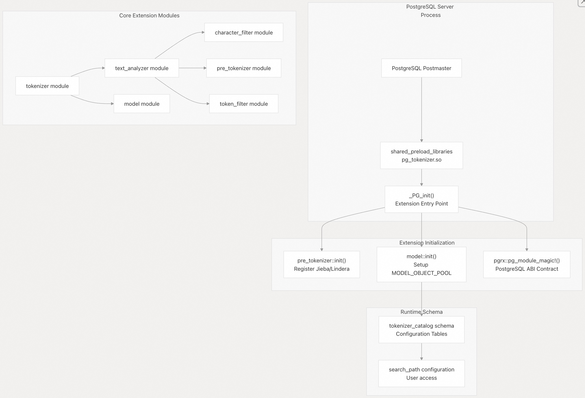
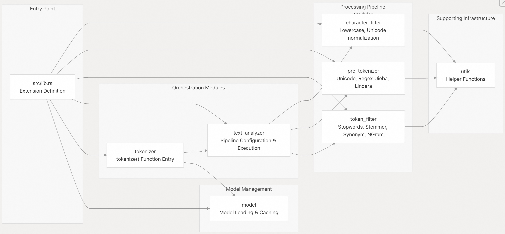
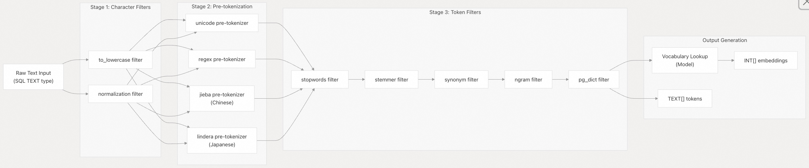
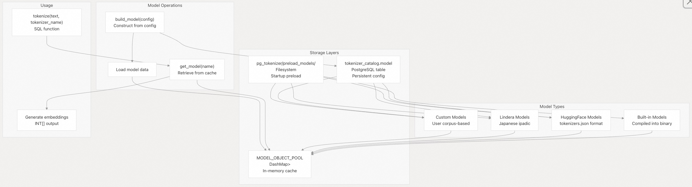
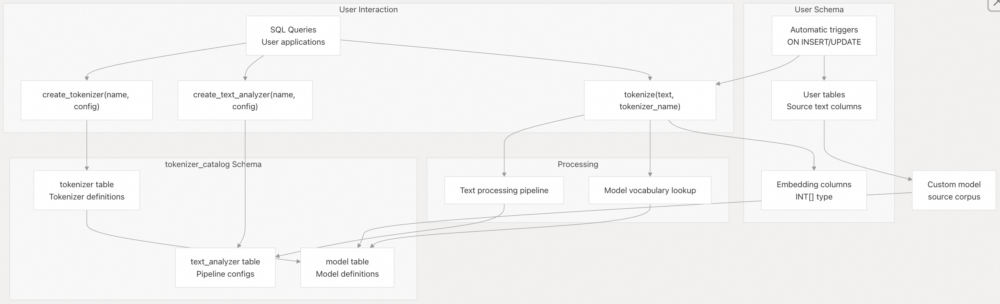

## pg_tokenizer 源码学习: 1 概览 (Overview)    
                                                            
### 作者                                                            
digoal                                                            
                                                            
### 日期                                                            
2025-11-14                                                           
                                                            
### 标签                                                            
pg\_tokenizer , 词化 , bert , 标记化 , Tokenization                                                        
                                                            
----                                                            
                                                            
## 背景       
相关背景可提前参考: [《全文检索的地基: 标记化(Tokenization)原理详解》](../202510/20251017_06.md)          
    
本文提供了对 `pg_tokenizer` 的**高层介绍 (high-level introduction)**，包括其**目的 (purpose)**、**能力 (capabilities)** 和**架构 (architecture)**。解释了该**扩展 (extension)** 的功能以及其**主要组件 (major components)** 如何协同工作。    
    
## 什么是 pg\_tokenizer (What is pg\_tokenizer)    
    
`pg_tokenizer` 是一个 **PostgreSQL 扩展 (PostgreSQL extension)**，它直接在数据库内部提供全面的**文本分词 (text tokenization)** 和**嵌入生成 (embedding generation)** 能力。该扩展使用 `pgrx` 框架构建，无需外部服务或语言即可实现**全文搜索 (full-text search)**、**文档处理 (document processing)** 和**文本分析 (text analysis)** **工作流 (workflows)**。    
    
该扩展通过一个**可配置的处理管道 (configurable processing pipeline)** 将**原始文本 (raw text)** 转换为**结构化表示 (structured representations)**，最终生成可存储并在 PostgreSQL 表中查询的**文本词元数组 (text token arrays, `TEXT[]`)** 或**整数嵌入 (integer embeddings, `INT[]`)**。    
    
**来源:**    
[`README.md` 1-6](https://github.com/tensorchord/pg_tokenizer.rs/blob/d3f7a577/README.md#L1-L6) [`src/lib.rs` 1-9](https://github.com/tensorchord/pg_tokenizer.rs/blob/d3f7a577/src/lib.rs#L1-L9)    
    
## 核心能力 (Core Capabilities)    
    
| 能力 (Capability) | 描述 (Description) | 主要用例 (Primary Use Case) |    
| --- | --- | --- |    
| **文本分词 (Text Tokenization)** | 将文本转换为**词元 (tokens)** 数组或**整数嵌入 (integer embeddings)** | **全文搜索 (Full-text search)**, 文档分析 (document analysis) |    
| **多语言支持 (Multi-Language Support)** | 处理英语、中文 (Jieba) 和日语 (Lindera) | 国际内容处理 (International content processing) |    
| **预训练模型 (Pre-trained Models)** | 内置模型 (BERT, llmlingua2, 等) 和 **HuggingFace 集成 (HuggingFace integration)** | **机器学习就绪嵌入 (ML-ready embeddings)** |    
| **自定义词汇表 (Custom Vocabularies)** | 从您的数据中构建**领域专用模型 (domain-specific models)** | 专业**语料库分词 (corpus tokenization)** |    
| **可配置管道 (Configurable Pipelines)** | 链接**字符过滤器 (character filters)**、**预分词器 (pre-tokenizers)** 和**词元过滤器 (token filters)** | 灵活的文本处理 (Flexible text processing) |    
| **自动处理 (Automatic Processing)** | 用于自动嵌入更新的**数据库触发器 (Database triggers)** | **插入/更新时的实时嵌入 (Real-time embeddings on INSERT/UPDATE)** |    
    
该扩展支持各种文本处理操作，包括**规范化 (normalization)**、**分段 (segmentation)**、**停用词移除 (stopword removal)**、**词干提取 (stemming)**、**同义词替换 (synonym replacement)** 和 **n-gram 生成 (n-gram generation)**。    
    
**来源:** [`README.md` 3-56](https://github.com/tensorchord/pg_tokenizer.rs/blob/d3f7a577/README.md#L3-L56)    
    
## 扩展架构 (Extension Architecture)    
    
### PostgreSQL 集成 (PostgreSQL Integration)    
    
该扩展通过 `pgrx` 框架与 PostgreSQL **集成 (integrates)**，该框架提供了 **Rust 到 PostgreSQL 的绑定 (Rust-to-PostgreSQL bindings)**。该扩展必须在**服务器启动 (server startup)** 期间通过 `shared_preload_libraries` **加载 (loaded)**，因为它会初始化**全局资源 (global resources)** 并注册必要的组件。    
    
    
    
**扩展初始化流程 (Extension Initialization Flow)**    
    
扩展的**生命周期 (lifecycle)** 始于 `_PG_init()` [`src/lib.rs` 24-32](https://github.com/tensorchord/pg_tokenizer.rs/blob/d3f7a577/src/lib.rs#L24-L32)，这强制要求扩展必须在服务器启动时加载，而不是**按需加载 (on-demand)**。存在此约束是因为扩展需要初始化**全局状态 (global state)**，包括：    
    
  * **预分词器注册 (Pre-tokenizer registrations)** (中文使用 Jieba，日语使用 Lindera)    
  * 用于模型实例的 `MODEL_OBJECT_POOL` **缓存 (cache)**    
  * PostgreSQL **字典配置 (dictionary configurations)**    
    
初始化**序列 (sequence)** 如下：    
    
1.  PostgreSQL 从 `shared_preload_libraries` 加载 `pg_tokenizer.so`    
2.  `_PG_init()` 验证它是否在 **postmaster 启动 (postmaster startup)** 期间运行 [`src/lib.rs` 26-28](https://github.com/tensorchord/pg_tokenizer.rs/blob/d3f7a577/src/lib.rs#L26-L28)    
3.  `pre_tokenizer::init()` 注册**特定语言的分词器 (language-specific tokenizers)** [`src/lib.rs` 30](https://github.com/tensorchord/pg_tokenizer.rs/blob/d3f7a577/src/lib.rs#L30-L30)    
4.  `model::init()` 设置**模型缓存基础设施 (model caching infrastructure)** [`src/lib.rs` 31](https://github.com/tensorchord/pg_tokenizer.rs/blob/d3f7a577/src/lib.rs#L31-L31)    
    
**来源:** [`src/lib.rs` 9-32](https://github.com/tensorchord/pg_tokenizer.rs/blob/d3f7a577/src/lib.rs#L9-L32)    
    
### 模块结构 (Module Structure)    
    
该扩展被组织成六个**核心模块 (core modules)**，每个模块处理文本处理的一个**特定方面 (specific aspect)**：    
    
    
    
**模块职责 (Module Responsibilities)**    
    
| 模块 (Module) | 文件路径 (File Path) | 主要职责 (Primary Responsibility) |    
| --- | --- | --- |    
| `character_filter` | `src/character_filter/` | **分词 (tokenization)** 前的文本**预处理 (Pre-processing)** (**大小写折叠 (case folding)**, **规范化 (normalization)**) |    
| `pre_tokenizer` | `src/pre_tokenizer/` | 使用 **Unicode 规则 (Unicode rules)**、**正则表达式 (regex)** 或**特定语言的分段器 (language-specific segmenters)** 将文本拆分为**初始词元候选项 (initial token candidates)** |    
| `token_filter` | `src/token_filter/` | **词元后处理 (Post-processing tokens)** (**过滤 (filtering)**, **词干提取 (stemming)**, **同义词扩展 (synonym expansion)**, **n-gram)**) |    
| `text_analyzer` | `src/text_analyzer/` | 通过链接**过滤器 (filters)** 和**分词器 (tokenizers)** 来**编排 (Orchestrating)** 完整的处理管道 |    
| `model` | `src/model/` | 管理用于**词元到整数转换 (token-to-integer conversion)** 的**词汇表模型 (vocabulary models)** |    
| `tokenizer` | `src/tokenizer/` | 暴露 `tokenize()` **SQL 函数 (SQL function)** 的**公共 API (Public API)** |    
| `utils` | `src/utils/` | **共享工具 (Shared utilities)** 和**辅助函数 (helper functions)** |    
    
**来源:** [`src/lib.rs` 1-7](https://github.com/tensorchord/pg_tokenizer.rs/blob/d3f7a577/src/lib.rs#L1-L7)    
    
## 处理管道 (Processing Pipeline)    
    
文本处理管道由三个**顺序阶段 (sequential stages)** 组成，每个阶段都将输入转换为最终的词元表示：    
    
    
    
**管道阶段 (Pipeline Stages)**    
    
1.  **字符过滤器 (Character Filters)**：在任何分词发生之前，在字符级别上**转换 (Transform)** **原始文本 (raw text)**。这包括**大小写规范化 (case normalization)**、**Unicode 规范化 (Unicode normalization)** (NFC, NFD, NFKC, NFKD) 和**字符映射 (character mapping)**。    
2.  **预分词 (Pre-tokenization)**：将处理后的文本拆分为**初始词元候选项 (initial token candidates)**。有不同的**策略 (strategies)** 可用：    
      * `unicode`：在 **Unicode 词边界 (Unicode word boundaries)** 上拆分    
      * `regex`：自定义**正则表达式模式 (regular expression patterns)**    
      * `jieba`：**中文分词 (Chinese word segmentation)**，具有可配置的模式 (**Full, Precise, Search**)    
      * `lindera`：使用 **ipadic 词典 (ipadic dictionaries)** 进行**日语形态分析 (Japanese morphological analysis)**    
3.  **词元过滤器 (Token Filters)**：通过**过滤 (filtering)** 和**转换 (transformation)** 操作来**优化 (Refine)** **词元流 (token stream)**。可以**链接 (chained)** 多个过滤器，应用的操作包括：    
      * 从预定义列表或自定义集合中移除**停用词 (stopwords)**    
      * **词干提取 (Stemming)**，将词汇简化为词根形式    
      * 基于词典的**同义词扩展 (Expanding synonyms)**    
      * 生成**字符或词 n-grams (character or word n-grams)**    
      * 应用 **PostgreSQL 文本搜索词典 (PostgreSQL text search dictionaries)**    
    
`text_analyzer` 模块 [`src/text_analyzer/`](https://github.com/tensorchord/pg_tokenizer.rs/blob/d3f7a577/src/text_analyzer/) 负责**编排 (orchestrates)** 此管道，而 `tokenizer` 模块 [`src/tokenizer/`](https://github.com/tensorchord/pg_tokenizer.rs/blob/d3f7a577/src/tokenizer/) 提供 `tokenize()` 函数，该函数对输入文本执行配置的管道。    
    
**来源:** [`src/lib.rs` 1-7](https://github.com/tensorchord/pg_tokenizer.rs/blob/d3f7a577/src/lib.rs#L1-L7)    
    
## 模型系统 (Model System)    
    
**模型系统 (Model System)** 管理将**文本词元 (text tokens)** 映射到**整数嵌入 (integer embeddings)** 的**词汇表 (vocabularies)**。支持四种模型类型，每种类型都有不同的**特点 (characteristics)**：    
    
    
    
**模型类型特点 (Model Type Characteristics)**    
    
| 模型类型 (Model Type) | 定义 (Definition) | 存储 (Storage) | 更新行为 (Update Behavior) |    
| --- | --- | --- | --- |    
| **内置 (Built-in)** | 编译到扩展二进制文件中的**预训练模型 (Pre-trained models)** | **二进制资源 (Binary resources)** | **不可变 (Immutable)**，随扩展进行**版本控制 (version-controlled)** |    
| **HuggingFace** | 与 **transformers 库 (transformers library)** 兼容的标准 `tokenizers.json` 格式 | 目录（catalog）中的 PostgreSQL **BYTEA**，用于预加载的文件系统（filesystem） | 通过重新运行 `create_tokenizer()` 进行更新 |    
| **Lindera** | 使用 ipadic 词典的**日语形态分析器 (Japanese morphological analyzer)** | 扩展的内置部分 (Built-in with extension) | **不可变 (Immutable)** |    
| **自定义 (Custom)** | 从用户表**语料库 (corpus)** 动态构建 | 从**源表 (source table)** 生成，缓存在**池 (pool)** 中 | 当源数据更改时，通过**触发器 (triggers)** 自动更新 |    
    
`MODEL_OBJECT_POOL` [`src/model/`](https://github.com/tensorchord/pg_tokenizer.rs/blob/d3f7a577/src/model/) 是一个使用 `DashMap` 实现的**线程安全缓存 (thread-safe cache)**，用于存储已加载的模型实例。这可以防止对常用模型重复进行**反序列化 (deserialization)** 和**初始化开销 (initialization overhead)**。    
    
**自定义模型 (Custom models)** 尤其强大，因为它们会随着**源语料库 (source corpus)** 的变化自动维护其**词汇表 (vocabulary)**。当配置了**触发器 (trigger)** 后，只要在源表中插入、更新或删除了行，模型就会**重建 (rebuilds)**。    
    
**来源:** [`README.md` 38-44](https://github.com/tensorchord/pg_tokenizer.rs/blob/d3f7a577/README.md#L38-L44)    
    
## 数据库集成 (Database Integration)    
    
该扩展通过 **SQL 函数 (SQL functions)** 暴露其功能，并与 PostgreSQL 的**模式系统 (schema system)** 集成：    
    
    
    
**配置存储 (Configuration Storage)**    
    
所有配置都存储在 `tokenizer_catalog` 模式（schema）中，该模式必须包含在 PostgreSQL 的 `search_path` 中，扩展才能正常工作 [`src/lib.rs` 42](https://github.com/tensorchord/pg_tokenizer.rs/blob/d3f7a577/src/lib.rs#L42-L42)。该模式包含：    
    
  * `tokenizer_catalog.tokenizer`：**分词器定义 (Tokenizer definitions)**，它结合了**文本分析器 (text analyzer)** 和**模型 (model)**    
  * `tokenizer_catalog.text_analyzer`：**文本分析器管道配置 (Text analyzer pipeline configurations)** (**TOML 格式**)    
  * `tokenizer_catalog.model`：**模型定义 (Model definitions)** 和**元数据 (metadata)**    
    
用户通过读写这些**目录表 (catalog tables)** 的 SQL 函数与扩展进行交互。配置以 **TOML 格式**指定，提供了一种人类可读的方式来定义复杂的**处理管道 (processing pipelines)**。    
    
**自动处理 (Automatic Processing)**    
    
该扩展通过 PostgreSQL **触发器 (triggers)** 支持**自动嵌入生成 (automatic embedding generation)**。配置后，触发器会在 **INSERT 或 UPDATE (插入或更新)** 操作时调用 `tokenize()` 函数，自动填充**嵌入列 (embedding columns)**，无需应用程序级代码。    
    
**来源:** [`README.md` 32-44](https://github.com/tensorchord/pg_tokenizer.rs/blob/d3f7a577/README.md#L32-L44) [`src/lib.rs` 42](https://github.com/tensorchord/pg_tokenizer.rs/blob/d3f7a577/src/lib.rs#L42-L42)    
    
## 用例 (Use Cases)    
    
`pg_tokenizer` 专为需要在数据库内进行**文本分析 (text analysis)** 的应用程序设计：    
    
| 用例 (Use Case) | 描述 (Description) | 使用的关键功能 (Key Features Used) |    
| --- | --- | --- |    
| **全文搜索 (Full-Text Search)** | 使用**自定义分词 (custom tokenization)** 构建**搜索索引 (search indices)** | **预分词器 (Pre-tokenizers)**, **词元过滤器 (token filters)**, **自定义词汇表 (custom vocabularies)** |    
| **文档分析 (Document Analysis)** | 分析**文档集合 (document collections)** 以发现**模式 (patterns)** 和**主题 (topics)** | **文本分析器 (Text analyzers)**, **停用词移除 (stopword removal)**, **词干提取 (stemming)** |    
| **多语言内容 (Multi-Language Content)** | 使用**特定语言规则 (language-specific rules)** 处理**国际内容 (international content)** | Jieba (中文), Lindera (日语), **Unicode 分段 (Unicode segmentation)** |    
| **机器学习特征工程 (ML Feature Engineering)** | 为**机器学习管道 (machine learning pipelines)** 生成**嵌入 (embeddings)** | **内置模型 (Built-in models)** (BERT, 等), **HuggingFace 集成 (HuggingFace integration)** |    
| **领域专用 NLP (Domain-Specific NLP)** | 为**技术领域 (technical domains)** 创建**专业词汇表 (specialized vocabularies)** | 在**语料表 (corpus tables)** 上训练的**自定义模型 (Custom models)** |    
| **实时处理 (Real-Time Processing)** | 在数据变化时**自动更新嵌入 (Automatically updating embeddings)** | **基于触发器的自动分词 (Trigger-based automatic tokenization)** |    
    
该扩展通过在 PostgreSQL 中提供完整的**文本处理管道 (text processing pipeline)**，消除了对**外部分词服务 (external tokenization services)** 的需求，从而减少了**延迟 (latency)** 并简化了**架构 (architecture)**。    
    
**来源:** [`README.md` 1-6](https://github.com/tensorchord/pg_tokenizer.rs/blob/d3f7a577/README.md#L1-L6)    
      
#### [PolarDB 学习图谱](https://www.aliyun.com/database/openpolardb/activity "8642f60e04ed0c814bf9cb9677976bd4")
  
  
#### [PostgreSQL 解决方案集合](../201706/20170601_02.md "40cff096e9ed7122c512b35d8561d9c8")
  
  
#### [德哥 / digoal's Github - 公益是一辈子的事.](https://github.com/digoal/blog/blob/master/README.md "22709685feb7cab07d30f30387f0a9ae")
  
  
#### [About 德哥](https://github.com/digoal/blog/blob/master/me/readme.md "a37735981e7704886ffd590565582dd0")
  
  

  
