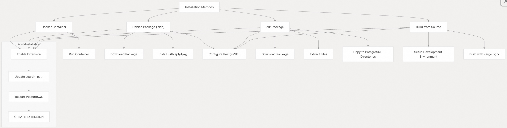
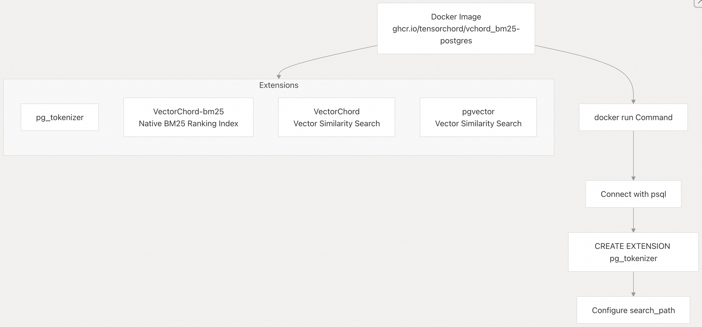
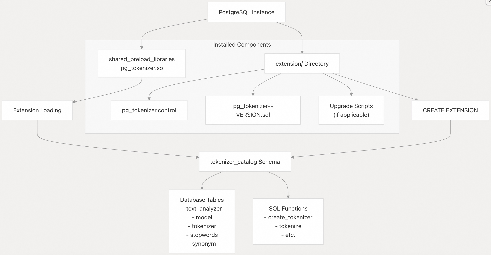

## pg_tokenizer 源码学习: 2 Installation (安装)  
                                                            
### 作者                                                            
digoal                                                            
                                                            
### 日期                                                            
2025-11-14                                                           
                                                            
### 标签                                                            
pg\_tokenizer , 词化 , bert , 标记化 , Tokenization                                                        
                                                            
----                                                            
                                                            
## 背景       
本文介绍了如何在不同**environments** (环境)中为 **PostgreSQL** (数据库系统) 安装 `pg_tokenizer` **extension** (扩展)。`pg_tokenizer` 是一个 **PostgreSQL extension** (PostgreSQL 扩展)，为 **full-text search** (全文搜索) 提供了高级的 **tokenization** (分词) **capabilities** (能力)。  
  
## Prerequisites (先决条件)  
  
在安装 `pg_tokenizer` 之前，请确保您的 **system** (系统) 满足以下 **requirements** (要求)：  
  
  * **PostgreSQL version** (PostgreSQL 版本) 12, 13, 14, 15, 16, or 17  
  * 对于 **Debian** 和 **ZIP packages** (ZIP 软件包)：**GLIBC** \>= 2.35 (例如，**Ubuntu** 22.04+、**Debian** Bullseye+、**RHEL** 9+)  
  * 拥有足够的 **permissions** (权限) 来安装 **PostgreSQL extensions** (PostgreSQL 扩展)  
  
## Installation Methods (安装方法)  
  
`pg_tokenizer` 可以通过以下几种 **methods** (方法) 进行安装：  
  
  
  
来源 (Sources): [`docs/01-installation.md` 1-156](https://github.com/tensorchord/pg_tokenizer.rs/blob/d3f7a577/docs/01-installation.md#L1-L156) [`README.md` 5-39](https://github.com/tensorchord/pg_tokenizer.rs/blob/d3f7a577/README.md#L5-L39)  
  
### Docker Installation (Docker 安装)  
  
开始使用 `pg_tokenizer` 最简单的方法是使用官方 **Docker image** (Docker 镜像)，它预配置 (pre-configured) 了几个 **complementary extensions** (补充扩展)：  
  
  
  
运行 **Docker container** (Docker 容器)：  
  
```bash  
docker run \
  --name vectorchord-demo \
  -e POSTGRES_PASSWORD=mysecretpassword \
  -p 5432:5432 \
  -d ghcr.io/tensorchord/vchord_bm25-postgres:pg17-v0.2.0  
```  
  
连接到 **database** (数据库)：  
  
```bash  
psql -h localhost -p 5432 -U postgres  
```  
  
启用 **extension** (扩展)：  
  
```sql  
CREATE EXTENSION pg_tokenizer;  
```  
  
更新 **search path** (搜索路径)：  
  
```sql  
ALTER SYSTEM SET search_path TO "$user", public, tokenizer_catalog;  
SELECT pg_reload_conf();  
```  
  
来源 (Sources): [`docs/01-installation.md` 3-38](https://github.com/tensorchord/pg_tokenizer.rs/blob/d3f7a577/docs/01-installation.md#L3-L38) [`README.md` 5-39](https://github.com/tensorchord/pg_tokenizer.rs/blob/d3f7a577/README.md#L5-L39)  
  
### Debian Package Installation (Debian 软件包安装)  
  
对于 **Debian-based distributions** (基于 Debian 的发行版) (**Ubuntu**, **Debian**, 等)，`pg_tokenizer` 可作为 `.deb` **package** (软件包) 使用：  
  
1.  从 [the release page](https://github.com/tensorchord/pg_tokenizer.rs/blob/d3f7a577/the%20release%20page) 下载合适的 `.deb` **package** (软件包)。  
  
2.  使用以下命令安装：  
  
```bash  
sudo apt install ./postgresql-17-pg-tokenizer_*.deb  
```  
  
3.  配置 **PostgreSQL** (数据库系统)：  
  
```bash  
psql -U postgres -c 'ALTER SYSTEM SET shared_preload_libraries = "pg_tokenizer.so"'  
psql -U postgres -c 'ALTER SYSTEM SET search_path TO "$user", public, tokenizer_catalog'  
sudo systemctl restart postgresql.service  
```  
  
4.  启用 **extension** (扩展)：  
  
```  
DROP EXTENSION IF EXISTS pg_tokenizer;  
CREATE EXTENSION pg_tokenizer CASCADE;  
```  
  
来源 (Sources): [`docs/01-installation.md` 40-64](https://github.com/tensorchord/pg_tokenizer.rs/blob/d3f7a577/docs/01-installation.md#L40-L64)  
  
### ZIP Package Installation (ZIP 软件包安装)  
  
对于非 Debian **systems** (系统) (**RHEL**, **CentOS**, 等)：  
  
1.  确保已安装所需的 **dependencies** (依赖项)：  
  
```bash  
# Example for RHEL 9  
sudo dnf install -y unzip wget libpq-devel  
sudo dnf module install -y postgresql:15/server  
```  
  
2.  验证 **PostgreSQL directories** (PostgreSQL 目录)：  
  
```bash  
pg_config --pkglibdir  
pg_config --sharedir  
```  
  
3.  下载并解压 **ZIP package** (ZIP 软件包)：  
  
```bash  
wget https://github.com/tensorchord/pg_tokenizer.rs/releases/download/[VERSION]/postgresql-[PG_VERSION]-pg-tokenizer_[VERSION]_[ARCH]-linux-gnu.zip -O pg_tokenizer.zip  
unzip pg_tokenizer.zip -d pg_tokenizer  
```  
  
4.  将文件复制到 **PostgreSQL directories** (PostgreSQL 目录)：  
  
```bash  
sudo cp pg_tokenizer/pg_tokenizer.so $(pg_config --pkglibdir)/  
sudo cp pg_tokenizer/pg_tokenizer--*.sql $(pg_config --sharedir)/extension/  
sudo cp pg_tokenizer/pg_tokenizer.control $(pg_config --sharedir)/extension/  
```  
  
5.  配置 **PostgreSQL** (数据库系统) 并启用 **extension** (扩展) (与 Debian 安装相同)。  
  
来源 (Sources): [`docs/01-installation.md` 66-130](https://github.com/tensorchord/pg_tokenizer.rs/blob/d3f7a577/docs/01-installation.md#L66-L130)  
  
### Building from Source (从源代码构建)  
  
用于 **development** (开发) 或需要 **custom build** (自定义构建) 的情况：  
  
1.  按照 [Development](/tensorchord/pg_tokenizer.rs/6-language-support) 中所述设置 **development environment** (开发环境)。  
2.  构建和安装：  
  
```bash  
cargo pgrx install --sudo --release  
```  
  
3.  配置 **PostgreSQL** (数据库系统) 并启用 **extension** (扩展) (与 Debian 安装相同)。  
  
来源 (Sources): [`docs/01-installation.md` 133-156](https://github.com/tensorchord/pg_tokenizer.rs/blob/d3f7a577/docs/01-installation.md#L133-L156)  
  
## Package Structure and Integration (软件包结构和集成)  
  
该 **extension** (扩展) 通过几个 **components** (组件) 与 **PostgreSQL** (数据库系统) 集成：  
  
  
  
来源 (Sources): [`sql/install/pg_tokenizer--0.1.0.sql` 1-359](https://github.com/tensorchord/pg_tokenizer.rs/blob/d3f7a577/sql/install/pg_tokenizer--0.1.0.sql#L1-L359) [`tools/package.sh` 1-46](https://github.com/tensorchord/pg_tokenizer.rs/blob/d3f7a577/tools/package.sh#L1-L46)  
  
## Available Packages (可用软件包)  
  
`pg_tokenizer` **project** (项目) 为不同的 **PostgreSQL versions** (PostgreSQL 版本) 和 **system architectures** (系统架构) 提供了 **packages** (软件包)：  
  
| Package Type (软件包类型) | PostgreSQL Versions (PostgreSQL 版本) | Architectures (架构) | Target Systems (目标系统) |  
| :--- | :--- | :--- | :--- |  
| Docker Image (Docker 镜像) | 14, 15, 16, 17 | amd64, arm64 | Any with Docker (任何带有 Docker 的系统) |  
| .deb Package (.deb 软件包) | 14, 15, 16, 17 | amd64, arm64 | Debian-based distributions (基于 Debian 的发行版) |  
| .zip Package (.zip 软件包) | 14, 15, 16, 17 | x86\_64, aarch64 | Any Linux distribution (任何 Linux 发行版) |  
  
来源 (Sources): [`github/workflows/release.yml` 39-68](https://github.com/tensorchord/pg_tokenizer.rs/blob/d3f7a577/.github/workflows/release.yml#L39-L68) [`docker/binary.Dockerfile` 1-8](https://github.com/tensorchord/pg_tokenizer.rs/blob/d3f7a577/docker/binary.Dockerfile#L1-L8)  
  
## Post-Installation Verification (安装后验证)  
  
**installation** (安装) 完成后，您可以通过运行一个简单的 **test** (测试) 来 **verify** (验证) `pg_tokenizer` 是否正常工作：  
  
```sql  
SELECT create_tokenizer('tokenizer1', $$  
model = "llmlingua2"  
$$);  
  
SELECT tokenize('PostgreSQL is a powerful, open-source object-relational database system.', 'tokenizer1');  
```  
  
如果 **installation** (安装) 成功，您将看到 `tokenize` **function** (函数) 返回的 **token IDs** (分词 ID)。  
  
来源 (Sources): [`README.md` 41-49](https://github.com/tensorchord/pg_tokenizer.rs/blob/d3f7a577/README.md#L41-L49)  
  
      
#### [PolarDB 学习图谱](https://www.aliyun.com/database/openpolardb/activity "8642f60e04ed0c814bf9cb9677976bd4")
  
  
#### [PostgreSQL 解决方案集合](../201706/20170601_02.md "40cff096e9ed7122c512b35d8561d9c8")
  
  
#### [德哥 / digoal's Github - 公益是一辈子的事.](https://github.com/digoal/blog/blob/master/README.md "22709685feb7cab07d30f30387f0a9ae")
  
  
#### [About 德哥](https://github.com/digoal/blog/blob/master/me/readme.md "a37735981e7704886ffd590565582dd0")
  
  

  
