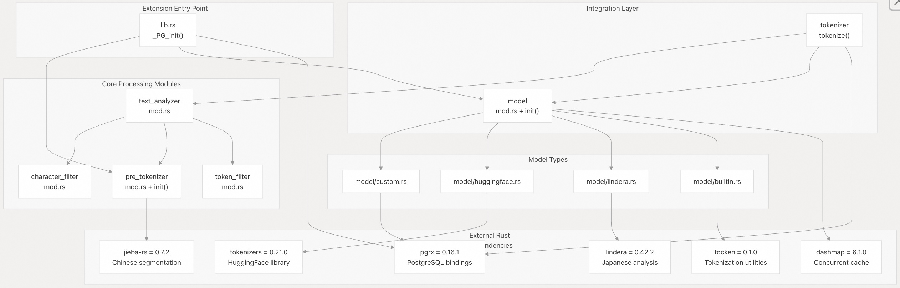
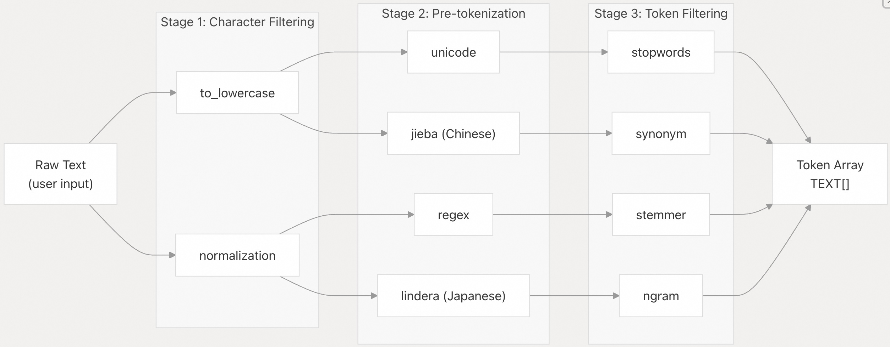
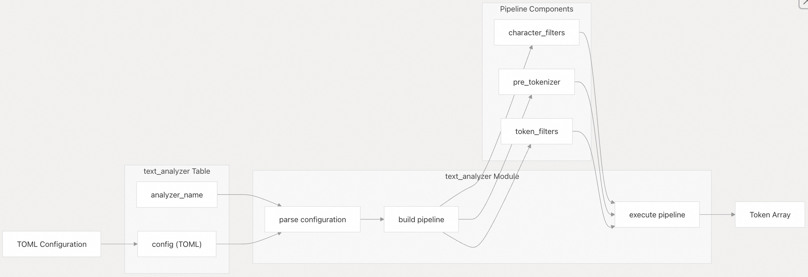
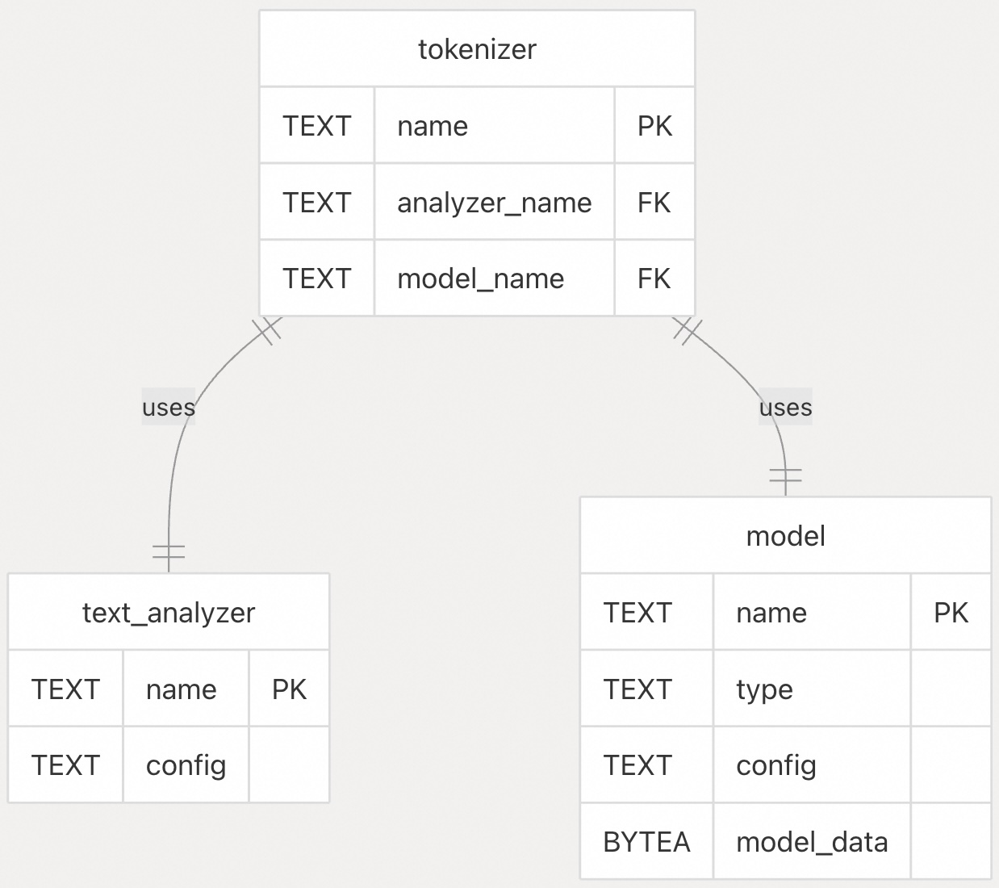
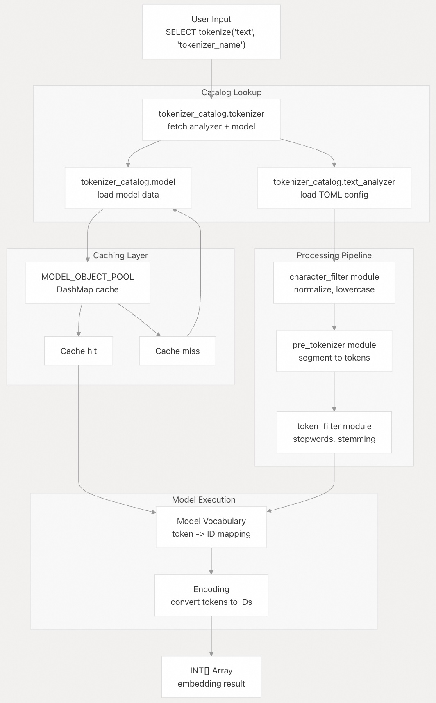
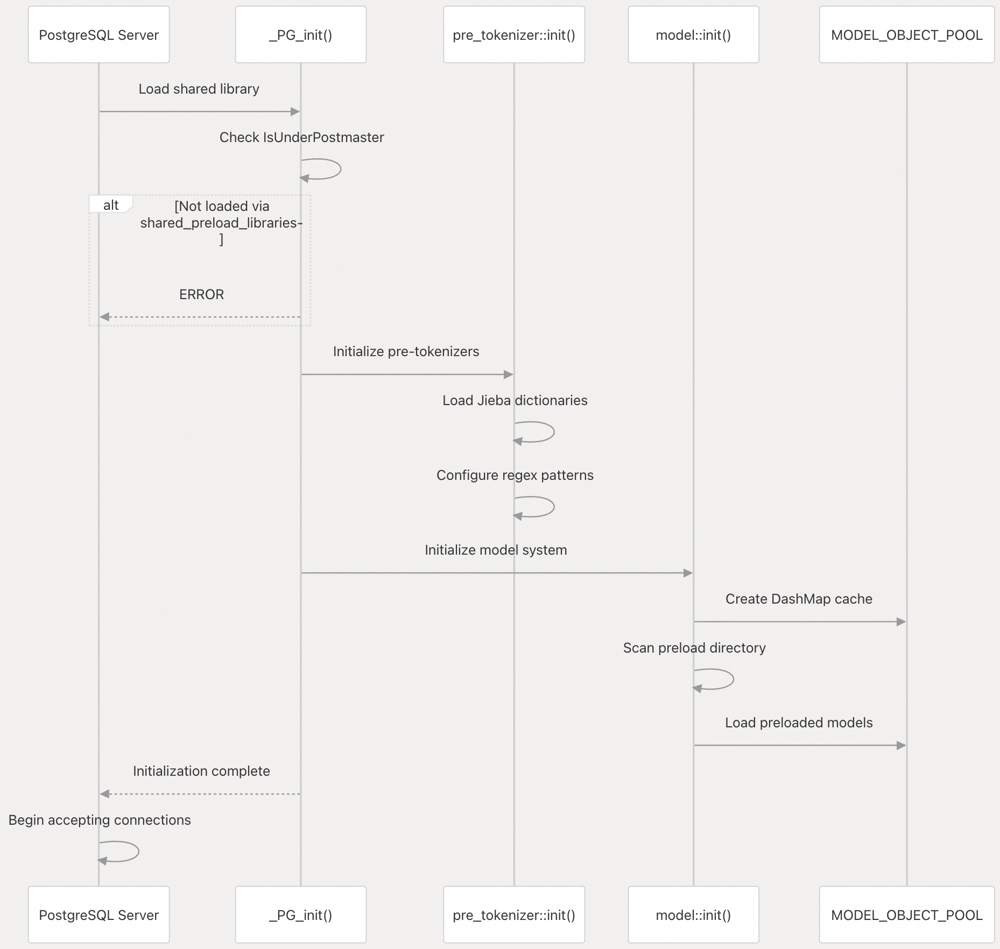

## pg_tokenizer 源码学习: 3 核心概念（Core Concepts）  
                                                              
### 作者                                                              
digoal                                                              
                                                              
### 日期                                                              
2025-11-14                                                             
                                                              
### 标签                                                              
pg\_tokenizer , 词化 , bert , 标记化 , Tokenization                                                          
                                                              
----                                                              
                                                              
## 背景         
本文介绍 `pg_tokenizer` 的基本概念（Core Concepts）和架构（Architecture）。提供了对系统组件（Components）、它们之间的关系以及它们如何在 PostgreSQL 中协同工作以处理文本和生成嵌入（Embeddings）的高级理解。  
  
## 扩展架构（Extension Architecture）  
  
`pg_tokenizer` 是一个 PostgreSQL 扩展（Extension），使用 [pgrx](https://github.com/tensorchord/pg_tokenizer.rs/blob/d3f7a577/pgrx) 框架构建，该框架支持用 Rust 编写 PostgreSQL 扩展。此扩展必须在 PostgreSQL 开始接受连接之前，通过 `shared_preload_libraries` 加载，这在 [`src/lib.rs` 26-28](https://github.com/tensorchord/pg_tokenizer.rs/blob/d3f7a577/src/lib.rs#L26-L28) 中强制执行。  
  
该扩展组织为六个核心模块，定义于 [`src/lib.rs` 1-7](https://github.com/tensorchord/pg_tokenizer.rs/blob/d3f7a577/src/lib.rs#L1-L7)：  
  
| 模块（Module） | 用途（Purpose） |  
| :--- | :--- |  
| `character_filter` (字符过滤器) | 文本预处理（Pre-processing text）（小写、规范化） |  
| `pre_tokenizer` (预分词器) | 将文本分割成初步的词元（tokens） |  
| `token_filter` (词元过滤器) | 词元后处理（Post-processing tokens）（停用词、词干提取、n-grams） |  
| `text_analyzer` (文本分析器) | 协调处理管道（Processing Pipeline） |  
| `model` (模型) | 管理词汇表（Vocabulary）和分词模型（Tokenization Models） |  
| `tokenizer` (分词器) | 文本到嵌入（Text-to-embedding）转换的主接口（Main Interface） |  
  
在初始化（Initialization）期间，该扩展调用 `pre_tokenizer::init()` 和 `model::init()` [`src/lib.rs` 30-31](https://github.com/tensorchord/pg_tokenizer.rs/blob/d3f7a577/src/lib.rs#L30-L31) 来设置所需的组件并加载预加载的模型（Preloaded Models）。  
  
**来源:** [`src/lib.rs` 1-32](https://github.com/tensorchord/pg_tokenizer.rs/blob/d3f7a577/src/lib.rs#L1-L32) [`Cargo.toml` 1-57](https://github.com/tensorchord/pg_tokenizer.rs/blob/d3f7a577/Cargo.toml#L1-L57)  
  
## 模块结构（Module Structure）和依赖关系（Dependencies）  
  
  
  
**模块初始化流程（Module Initialization Flow）：** 扩展通过 `_PG_init()` 初始化（Initializes），它验证加载上下文（Loading Context）并初始化预分词器（Pre-tokenizer）和模型子系统（Model Subsystems）。这确保了在处理任何数据库查询之前，静态资源（Static Resources）（如 Jieba 词典和预加载的模型）是可用的。  
  
**来源:** [`src/lib.rs` 1-32](https://github.com/tensorchord/pg_tokenizer.rs/blob/d3f7a577/src/lib.rs#L1-L32) [`Cargo.toml` 27-42](https://github.com/tensorchord/pg_tokenizer.rs/blob/d3f7a577/Cargo.toml#L27-L42)  
  
## 核心组件（Core Components）  
  
### 文本处理管道（Text Processing Pipeline）  
  
文本处理管道（Text Processing Pipeline）通过三个顺序阶段（Sequential Stages）转换原始文本（Raw Text），每个阶段都可以通过 TOML 规范（Specifications）进行配置：  
  
  
  
  * **字符过滤器（Character Filters）**  
  * **预分词器（Pre-tokenizer）**  
  * **词元过滤器（Token Filters）**  
  
每个阶段都是可选（Optional）和可配置（Configurable）的。可以在每个阶段内链接（Chained）多个过滤器（Filters）。有关每个阶段的详细介绍，请参阅文本处理管道（Text Processing Pipeline）章节。  
  
### 模型（Models）  
  
模型（Models）定义了词汇表（Vocabulary）和分词规则（Tokenization Rules），这些规则将文本词元（Text Tokens）转换为整数嵌入（Integer Embeddings）。`pg_tokenizer` 支持四种模型类型：  
  
| 模型类型（Model Type） | 存储（Storage） | 用例（Use Case） | 配置（Configuration） |  
| :--- | :--- | :--- | :--- |  
| **内置（Built-in）** | 二进制嵌入（Binary-embedded） | 预训练模型（Pre-trained models）（llmlingua2, wiki\_tocken） | 编译时（Compiled at build time） |  
| **自定义（Custom）** | `tokenizer_catalog.model` | 语料库特定词汇表（Corpus-specific vocabulary） | 从用户表构建 |  
| **HuggingFace** | `tokenizer_catalog.model` | 标准 Transformer 模型（Standard Transformer Models） | `tokenizers.json` 格式 |  
| **Lindera** | `tokenizer_catalog.model` | 日语语言模型（Japanese Language Models） | ipadic 词典 |  
  
所有模型都通过一个全局缓存（Global Cache）（`MODEL_OBJECT_POOL`）进行管理，该缓存使用 `DashMap` [`Cargo.toml` 29](https://github.com/tensorchord/pg_tokenizer.rs/blob/d3f7a577/Cargo.toml#L29-L29) 实现并发访问（Concurrent Access）。有关全面的模型文档，请参阅模型（Models）章节。  
  
**来源:**  [`Cargo.toml` 21-25](https://github.com/tensorchord/pg_tokenizer.rs/blob/d3f7a577/Cargo.toml#L21-L25)（特性标志）, [`Cargo.toml` 29-32](https://github.com/tensorchord/pg_tokenizer.rs/blob/d3f7a577/Cargo.toml#L29-L32)（依赖项）  
  
### 文本分析器（Text Analyzers）  
  
文本分析器（Text Analyzer）是一个命名配置（Named Configuration），用于指定完整的处理管道（Processing Pipeline）：字符过滤器（Character Filters）、预分词器（Pre-tokenizer）和词元过滤器（Token Filters）。  
  
  
  
文本分析器存储在 `tokenizer_catalog` 模式（Schema）中，并在对文本进行分词（Tokenizing Text）时通过名称引用。文本分析器可以在多个分词器（Tokenizers）之间重用，并可以在自定义模型（Custom Models）之间共享。有关配置详情，请参阅文本分析器（Text Analyzers）章节。  
  
**来源:** [`src/lib.rs` 4](https://github.com/tensorchord/pg_tokenizer.rs/blob/d3f7a577/src/lib.rs#L4-L4)  
  
### 分词器（Tokenizers）  
  
分词器（Tokenizer）将文本分析器（Text Analyzer）与模型（Model）结合起来以生成嵌入（Embeddings）。主要入口点（Main Entry Point）是 `tokenize()` 函数，它：  
  
1.  应用文本分析器管道（Text Analyzer Pipeline）以生成词元（Tokens）  
2.  使用模型将词元转换为整数嵌入（Integer Embeddings）  
3.  返回一个适合存储在 PostgreSQL 中的 `INT[]` 数组  
  
分词器是用户在将文本转换为嵌入时交互的主要接口（Primary Interface）。  
  
**来源:** [`src/lib.rs` 6](https://github.com/tensorchord/pg_tokenizer.rs/blob/d3f7a577/src/lib.rs#L6-L6)  
  
### 嵌入（Embeddings）  
  
嵌入（Embeddings）是最终的输出（Final Output）：整数数组（`INT[]`），以数字形式表示文本，适用于相似性搜索（Similarity Search）和机器学习（Machine Learning）。整数值对应于模型词汇表（Model's Vocabulary）中的词元 ID（Token IDs）。  
  
```  
输入（Input）:  "machine learning"  
词元（Tokens）: ["machine", "learning"]  
输出（Output）: [4532, 6975]  -- INT[] array (整数数组)  
```  
  
嵌入（Embeddings）可以直接存储在 PostgreSQL 列中，并与像 pgvector 这样的索引扩展（Indexing Extensions）一起用于相似性搜索（Similarity Search）。  
  
## 数据库模式（Database Schema）  
  
`tokenizer_catalog` 模式（Schema）存储所有配置（Configuration）和模型数据（Model Data）。用户必须将此模式包含在其 `search_path` [`src/lib.rs` 42](https://github.com/tensorchord/pg_tokenizer.rs/blob/d3f7a577/src/lib.rs#L42-L42) 中，才能访问扩展的功能（Functions）和表（Tables）。  
  
  
  
关键表（Key tables）：  
  
  * **`text_analyzer`**：以 TOML 格式存储管道配置（Pipeline Configurations）  
  * **`model`**：存储模型数据和配置（自定义、HuggingFace、Lindera）  
  * **`tokenizer`**：链接分析器（Analyzers）和模型（Models）以创建完整的分词工作流（Tokenization Workflows）  
  
**来源:** [`src/lib.rs` 42](https://github.com/tensorchord/pg_tokenizer.rs/blob/d3f7a577/src/lib.rs#L42-L42)  
  
## 数据流（Data Flow）：文本到嵌入（Text to Embeddings）  
  
从原始文本（Raw Text）到存储的嵌入（Stored Embeddings）的完整数据流（Data Flow）：  
  
  
  
**性能考虑（Performance Considerations）：**  
  
  * `MODEL_OBJECT_POOL` 使用 `DashMap` [`Cargo.toml` 29](https://github.com/tensorchord/pg_tokenizer.rs/blob/d3f7a577/Cargo.toml#L29-L29) 提供内存缓存（In-memory Caching），用于无锁并发访问（Lock-free Concurrent Access）  
  * 模型可以在服务器启动时预加载（Preloaded），以消除首次查询延迟（First-query Latency）（请参阅模型预加载（Model Preloading）章节）  
  * 文本分析器配置（Text Analyzer Configurations）解析一次并缓存（Cached）供后续使用  
  
**来源:** [`Cargo.toml` 29](https://github.com/tensorchord/pg_tokenizer.rs/blob/d3f7a577/Cargo.toml#L29-L29) [`src/lib.rs` 30-31](https://github.com/tensorchord/pg_tokenizer.rs/blob/d3f7a577/src/lib.rs#L30-L31)  
  
## 系统初始化（System Initialization）  
  
扩展遵循 PostgreSQL 扩展加载机制（Extension Loading Mechanism）强制执行的特定初始化序列（Initialization Sequence）：  
  
  
  
对 `IsUnderPostmaster` 的检查 [`src/lib.rs` 26](https://github.com/tensorchord/pg_tokenizer.rs/blob/d3f7a577/src/lib.rs#L26-L26) 确保扩展在服务器启动（Server Startup）时加载，而不是在客户端连接（Client Connects）时加载。这是必需的，因为：  
  
1.  静态资源（Static Resources）（如 Jieba 词典）必须在全球范围内（Globally）初始化一次  
2.  模型缓存（Model Cache）必须在所有数据库连接（Database Connections）之间共享  
3.  预加载的模型（Preloaded Models）需要在任何查询（Queries）执行前加载  
  
**来源:** [`src/lib.rs` 24-32](https://github.com/tensorchord/pg_tokenizer.rs/blob/d3f7a577/src/lib.rs#L24-L32)  
  
## 特性标志（Feature Flags）和语言支持（Language Support）  
  
该扩展使用 Cargo 特性标志（Feature Flags）来启用特定的语言处理能力（Language Processing Capabilities）：  
  
| 特性标志（Feature Flag） | 语言（Language） | 词典（Dictionary） | 默认是否启用（Enabled By Default） |  
| :--- | :--- | :--- | :--- |  
| `lindera-ipadic` | 日语（Japanese） | IPA 词典 | 可选（Optional） |  
| `lindera-ipadic-neologd` | 日语（Japanese） | IPA + 新词（neologisms） | 可选（Optional） |  
| `lindera-unidic` | 日语（Japanese） | UniDic | 可选（Optional） |  
| `lindera-ko-dic` | 韩语（Korean） | 韩语词典 | 可选（Optional） |  
| `lindera-cc-cedict` | 中文（Chinese） | CC-CEDICT | 可选（Optional） |  
  
语言特定的处理在语言支持（Language Support）章节中有详细介绍。  
  
**来源:** [`Cargo.toml` 21-25](https://github.com/tensorchord/pg_tokenizer.rs/blob/d3f7a577/Cargo.toml#L21-L25)  
  
## 总结（Summary）  
  
`pg_tokenizer` 在 PostgreSQL 中提供了一个模块化（Modular）、可扩展（Extensible）的文本处理和嵌入生成系统（Embedding Generation System）：  
  
  * **扩展层（Extension Layer）**：使用 pgrx 构建，通过 `shared_preload_libraries` 加载  
  * **处理管道（Processing Pipeline）**：三阶段可配置管道（字符过滤器 → 预分词 → 词元过滤器）  
  * **模型系统（Model System）**：四种模型类型，通过 `MODEL_OBJECT_POOL` 进行内存缓存（In-memory Caching）  
  * **文本分析器（Text Analyzers）**：存储在 `tokenizer_catalog` 中的命名管道配置  
  * **分词器（Tokenizers）**：分析器 + 模型的组合，生成 `INT[]` 嵌入  
  * **数据库模式（Database Schema）**：用于配置和模型存储的 `tokenizer_catalog` 模式  
  
以下子章节提供了每个子系统（Subsystem）的详细介绍：  
  
  * 系统架构（System Architecture）：扩展结构（Extension Structure）和 pgrx 集成（Integration）  
  * 文本处理管道（Text Processing Pipeline）：详细的过滤器（Filter）和分词器（Tokenizer）规范  
  * 模型（Models）：模型类型、管理和缓存（Caching）  
  * 文本分析器（Text Analyzers）：管道组成（Pipeline Composition）和配置  
  
**来源:** 所有图表均根据高级系统架构（High-level System Architecture）和代码结构（Code Structure）[`src/lib.rs` 1-32](https://github.com/tensorchord/pg_tokenizer.rs/blob/d3f7a577/src/lib.rs#L1-L32) [`Cargo.toml` 1-57](https://github.com/tensorchord/pg_tokenizer.rs/blob/d3f7a577/Cargo.toml#L1-L57) 综合而成。  
       
#### [PolarDB 学习图谱](https://www.aliyun.com/database/openpolardb/activity "8642f60e04ed0c814bf9cb9677976bd4")
  
  
#### [PostgreSQL 解决方案集合](../201706/20170601_02.md "40cff096e9ed7122c512b35d8561d9c8")
  
  
#### [德哥 / digoal's Github - 公益是一辈子的事.](https://github.com/digoal/blog/blob/master/README.md "22709685feb7cab07d30f30387f0a9ae")
  
  
#### [About 德哥](https://github.com/digoal/blog/blob/master/me/readme.md "a37735981e7704886ffd590565582dd0")
  
  

  
