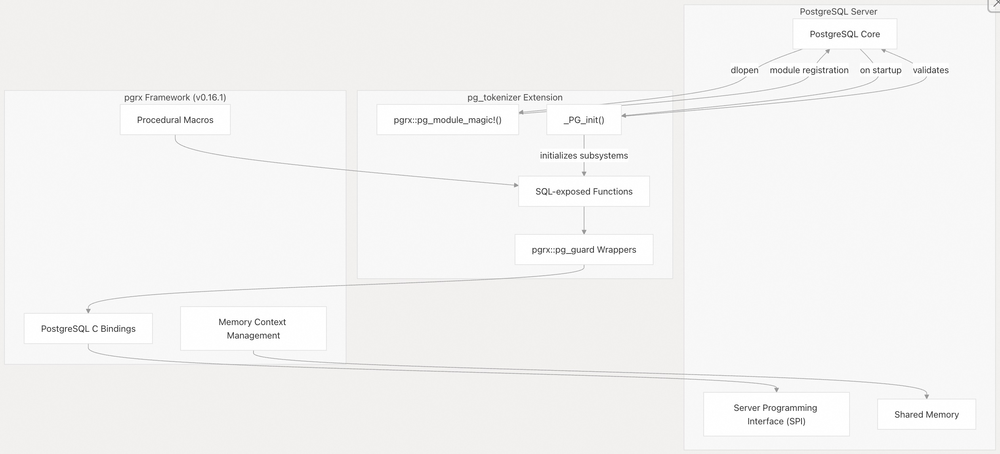
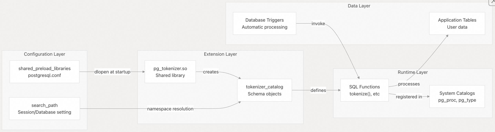
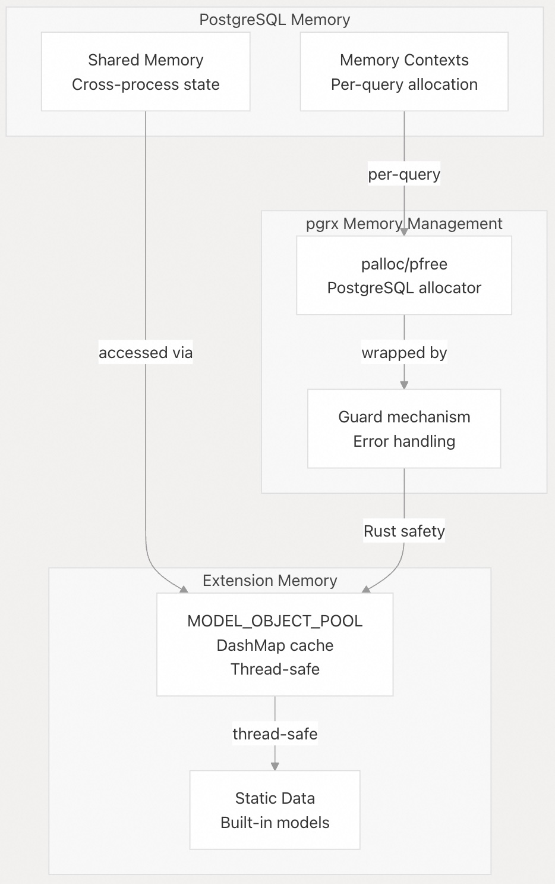

## pg_tokenizer 源码学习: 3.1 系统架构 (System Architecture)  
                                                                
### 作者                                                                
digoal                                                                
                                                                
### 日期                                                                
2025-11-14                                                               
                                                                
### 标签                                                                
pg\_tokenizer , 词化 , bert , 标记化 , Tokenization                                                            
                                                                
----                                                                
                                                                
## 背景         
本文描述了 `pg_tokenizer` 的基本架构 (fundamental architecture)，它是一个基于 **pgrx 框架 (pgrx framework)** 构建的 **PostgreSQL 扩展 (PostgreSQL extension)**。它涵盖了扩展的初始化过程 (initialization process)、模块组织 (module organization) 以及与 PostgreSQL 扩展系统 (PostgreSQL's extension system) 的集成 (integration)。  
  
## 扩展框架概述 (Extension Framework Overview)  
  
`pg_tokenizer` 是作为一个**原生 PostgreSQL 扩展 (native PostgreSQL extension)**，使用 **pgrx 框架 (pgrx framework)** 实现的，该框架提供了 PostgreSQL 扩展 API (PostgreSQL's extension API) 的 Rust 绑定 (Rust bindings)。该扩展被编译成一个 C 兼容的**动态库 (`cdylib`)**，PostgreSQL 在运行时 (runtime) 加载它。  
  
### pgrx 集成 (pgrx Integration)  
  
    
  
**pgrx 框架集成架构 (pgrx Framework Integration Architecture)**  
  
该扩展使用了几个关键的 pgrx 机制 (mechanisms)：  
  
| 机制 (Mechanism) | 代码位置 (Code Location) | 目的 (Purpose) |  
| :--- | :--- | :--- |  
| `pgrx::pg_module_magic!()` | [`src/lib.rs` 9](https://github.com/tensorchord/pg_tokenizer.rs/blob/d3f7a577/src/lib.rs#L9-L9) | 为 PostgreSQL 声明扩展元数据 (extension metadata) |  
| `#[pgrx::pg_guard]` | [`src/lib.rs` 24](https://github.com/tensorchord/pg_tokenizer.rs/blob/d3f7a577/src/lib.rs#L24-L24) | 使用错误处理 (error handling) 包装初始化 (initialization) |  
| `#[pg_extern]` | 整个代码库 (Throughout codebase) | 将 Rust 函数公开为 SQL 函数 (SQL functions) |  
| 版本特性 (Version features) | [`Cargo.toml` 14-19](https://github.com/tensorchord/pg_tokenizer.rs/blob/d3f7a577/Cargo.toml#L14-L19) | 针对 PostgreSQL 13-18 的条件编译 (Conditional compilation) |  
  
来源 (Sources): [`src/lib.rs` 1-45](https://github.com/tensorchord/pg_tokenizer.rs/blob/d3f7a577/src/lib.rs#L1-L45) [`Cargo.toml` 1-57](https://github.com/tensorchord/pg_tokenizer.rs/blob/d3f7a577/Cargo.toml#L1-L57)  
  
## 模块组织 (Module Organization)  
  
代码库组织成六个主要模块 (primary modules)，每个模块负责文本处理的不同方面 (distinct aspect)。模块结构直接映射到**文本处理管道 (text processing pipeline)** 的阶段 (stages)。  
  
   
  
**模块结构和依赖关系 (Module Structure and Dependencies)**  
  
### 模块职责 (Module Responsibilities)  
  
| 模块 (Module) | 主要功能 (Primary Function) | 关键组件 (Key Components) |  
| :--- | :--- | :--- |  
| `character_filter` | 词法分析 (tokenization) 前的文本预处理 (Text preprocessing) | `to_lowercase` (转小写), `normalization` (规范化), mapping (映射) |  
| `pre_tokenizer` | 将文本分割成原始词元 (raw tokens) | `regex` (正则表达式), `unicode_segmentation` (Unicode 分割), `jieba`, `lindera` |  
| `token_filter` | 词元优化 (Token refinement) 和转换 (transformation) | `stopwords` (停用词), `stemmer` (词干提取), `synonym` (同义词), `ngram` |  
| `text_analyzer` | 管道配置 (Pipeline configuration) 和编排 (orchestration) | TOML 解析 (TOML parsing), 阶段组合 (stage composition) |  
| `tokenizer` | 公共 SQL API (Public SQL API) | `tokenize()` 函数 (function), 嵌入生成 (embedding generation) |  
| `model` | 词汇表 (Vocabulary) 和模型管理 (model management) | 内建 (Built-in), 自定义 (custom), HuggingFace, Lindera 模型 (models) |  
| `utils` | 共享工具 (Shared utilities) | 辅助函数 (Helper functions), 常见操作 (common operations) |  
  
来源 (Sources): [`src/lib.rs` 1-7](https://github.com/tensorchord/pg_tokenizer.rs/blob/d3f7a577/src/lib.rs#L1-L7)  
  
## 初始化过程 (Initialization Process)  
  
扩展初始化 (extension initialization) 发生在两个阶段 (two phases)：PostgreSQL 加载 (PostgreSQL loading) 和子系统初始化 (subsystem initialization)。此过程受到严格控制 (tightly controlled)，以确保在执行任何用户查询之前进行正确的设置 (proper setup)。  
  
### 扩展加载顺序 (Extension Loading Sequence)  
  
   
  
**扩展初始化顺序 (Extension Initialization Sequence)**  
  
### 初始化代码流 (Initialization Code Flow)  
  
`_PG_init()` 函数强制执行关键的初始化约束 (critical initialization constraints)：  
  
```rust  
// Simplified view of initialization logic  
#[pgrx::pg_guard]  
extern "C-unwind" fn _PG_init() {  
    // Safety check: must be loaded at server startup  
    if unsafe { pgrx::pg_sys::IsUnderPostmaster } {  
        pgrx::error!("pg_tokenizer must be loaded via shared_preload_libraries.");  
    }  
  
    // Initialize subsystems  
    pre_tokenizer::init();  // Register tokenizer backends  
    model::init();          // Setup model cache and preload  
}  
```  
  
**初始化要求 (Initialization Requirements):**  
  
| 要求 (Requirement) | 检查位置 (Check Location) | 失败行为 (Failure Behavior) |  
| :--- | :--- | :--- |  
| 通过 `shared_preload_libraries` 加载 (Load via `shared_preload_libraries`) | [`src/lib.rs` 26-28](https://github.com/tensorchord/pg_tokenizer.rs/blob/d3f7a577/src/lib.rs#L26-L28) | 致命错误 (Fatal error) 并附带消息 |  
| 小端架构 (Little-endian architecture) | [`src/lib.rs` 11-12](https://github.com/tensorchord/pg_tokenizer.rs/blob/d3f7a577/src/lib.rs#L11-L12) | 编译时错误 (Compile-time error) |  
| 64 位指针宽度 (64-bit pointer width) | [`src/lib.rs` 11-12](https://github.com/tensorchord/pg_tokenizer.rs/blob/d3f7a577/src/lib.rs#L11-L12) | 编译时错误 (Compile-time error) |  
| PostgreSQL 版本已选择 (PostgreSQL version selected) | [`src/lib.rs` 14-22](https://github.com/tensorchord/pg_tokenizer.rs/blob/d3f7a577/src/lib.rs#L14-L22) | 编译时错误 (Compile-time error) |  
  
来源 (Sources): [`src/lib.rs` 24-32](https://github.com/tensorchord/pg_tokenizer.rs/blob/d3f7a577/src/lib.rs#L24-L32) [`src/lib.rs` 11-22](https://github.com/tensorchord/pg_tokenizer.rs/blob/d3f7a577/src/lib.rs#L11-L22)  
  
## PostgreSQL 集成点 (PostgreSQL Integration Points)  
  
`pg_tokenizer` 通过几种机制 (mechanisms) 与 PostgreSQL 集成，每种机制都在扩展生命周期 (extension lifecycle) 中服务于特定目的。  
  
### 集成机制 (Integration Mechanisms)  
  
   
  
**PostgreSQL 集成架构 (PostgreSQL Integration Architecture)**  
  
### 配置要求 (Configuration Requirements)  
  
该扩展需要特定的 PostgreSQL 配置才能正常工作 (function correctly)：  
  
**postgresql.conf 设置 (Settings):**  
  
```  
# Required: Load extension at server startup  
shared_preload_libraries = 'pg_tokenizer'  
  
# Recommended: Include tokenizer_catalog in search path  
# Can be set globally or per-database  
search_path = '"$user", public, tokenizer_catalog'  
```  
  
**配置原理 (Configuration Rationale):**  
  
| 设置 (Setting) | 要求级别 (Requirement Level) | 原因 (Reason) |  
| :--- | :--- | :--- |  
| `shared_preload_libraries` | **必需 (Required)** | 扩展初始化必须在任何数据库连接 (database connections) 之前发生。模型和词法分析器 (tokenizers) 需要全局状态初始化 (global state initialization)。 |  
| `search_path` | 推荐 (Recommended) | 通过使 `tokenizer_catalog` 模式 (schema) 对象无需限定 (without qualification) 即可访问，从而简化 SQL 查询。 |  
  
来源 (Sources): [`src/lib.rs` 26-28](https://github.com/tensorchord/pg_tokenizer.rs/blob/d3f7a577/src/lib.rs#L26-L28) [`src/lib.rs` 42](https://github.com/tensorchord/pg_tokenizer.rs/blob/d3f7a577/src/lib.rs#L42-L42)  
  
## 编译架构 (Compilation Architecture)  
  
`pg_tokenizer` 使用 **Rust 的特性系统 (feature system)** 来支持多个 PostgreSQL 版本 (versions) 和可选的语言支持 (optional language support)。编译过程 (compilation process) 生成特定于版本 (version-specific) 的二进制文件 (binaries)。  
  
### 构建配置 (Build Configuration)  
  
   
  
**编译依赖图 (Compilation Dependency Graph)**  
  
### 特性标志 (Feature Flags)  
  
构建系统支持**排他性的 (exclusive)** PostgreSQL 版本选择和可选的语言字典 (language dictionaries)：  
  
**PostgreSQL 版本特性 (互斥): (PostgreSQL Version Features - mutually exclusive)**  
  
| 特性 (Feature) | 目标版本 (Target Version) | pgrx 绑定 (Binding) |  
| :--- | :--- | :--- |  
| `pg13` | PostgreSQL 13 | `pgrx/pg13` |  
| `pg14` | PostgreSQL 14 | `pgrx/pg14` |  
| `pg15` | PostgreSQL 15 | `pgrx/pg15` |  
| `pg16` | PostgreSQL 16 | `pgrx/pg16` |  
| `pg17` | PostgreSQL 17 | `pgrx/pg17` |  
| `pg18` | PostgreSQL 18 | `pgrx/pg18` |  
  
**语言字典特性 (可选，可组合): (Language Dictionary Features - optional, combinable)**  
  
| 特性 (Feature) | 字典 (Dictionary) | 语言支持 (Language Support) |  
| :--- | :--- | :--- |  
| `lindera-ipadic` | IPAdic | 日语 (标准) (Japanese - standard) |  
| `lindera-ipadic-neologd` | IPAdic NEologd | 日语 (现代术语) (Japanese - modern terms) |  
| `lindera-unidic` | UniDic | 日语 (研究) (Japanese - research) |  
| `lindera-ko-dic` | KO-DIC | 韩语 (Korean) |  
| `lindera-cc-cedict` | CC-CEDICT | 中文 (Chinese) |  
  
**编译时验证 (Compile-Time Validation):**  
  
该扩展在编译时强制执行平台要求 (platform requirements)：  
  
```rust  
// Platform constraints enforced at compile time  
#[cfg(not(all(target_endian = "little", target_pointer_width = "64")))]  
compile_error!("Target is not supported.");  
  
#[cfg(not(any(feature = "pg13", feature = "pg14", /* ... */)))]  
compile_error!("PostgreSQL version must be selected.");  
```  
  
来源 (Sources): [`Cargo.toml` 1-57](https://github.com/tensorchord/pg_tokenizer.rs/blob/d3f7a577/Cargo.toml#L1-L57) [`src/lib.rs` 11-22](https://github.com/tensorchord/pg_tokenizer.rs/blob/d3f7a577/src/lib.rs#L11-L22)  
  
## 库类型和二进制目标 (Library Types and Binary Targets)  
  
该项目生成多个**工件 (artifacts)**，用于不同的部署 (deployment) 和测试场景 (testing scenarios)：  
  
### 构建工件 (Build Artifacts)  
  
| 工件类型 (Artifact Type) | 输出 (Output) | 目的 (Purpose) |  
| :--- | :--- | :--- |  
| `cdylib` | `pg_tokenizer.so` (Linux) / `pg_tokenizer.dylib` (macOS) / `pg_tokenizer.dll` (Windows) | PostgreSQL 扩展**共享库 (shared library)** |  
| `lib` | Rust 库 (library) | 用于测试和嵌入场景 (embedding scenarios) |  
| 二进制文件: `pgrx_embed_pg_tokenizer` | 可执行文件 (Executable) | `pgrx` 测试框架支持 (`pgrx` testing framework support) |  
  
**构建配置优化 (Build Profile Optimization):**  
  
```  
[profile.release]  
opt-level = 3          # Maximum optimization  
lto = "fat"            # Full link-time optimization  
codegen-units = 1      # Single compilation unit for best optimization  
  
[profile.dev-opt]  
inherits = "dev"       # Based on dev profile  
opt-level = 3          # Optimized for development testing  
lto = "thin"           # Faster compilation than "fat"  
codegen-units = 8      # Parallel compilation  
```  
  
**发布配置文件 (release profile)** 优先考虑**运行时性能 (runtime performance)** 而非编译速度 (compilation speed)，使用激进的**链接时优化 (aggressive link-time optimization)**。`dev-opt` 配置文件平衡了开发迭代速度 (development iteration speed) 和合理的运行时性能 (reasonable runtime performance)。  
  
来源 (Sources): [`Cargo.toml` 6-11](https://github.com/tensorchord/pg_tokenizer.rs/blob/d3f7a577/Cargo.toml#L6-L11) [`Cargo.toml` 47-56](https://github.com/tensorchord/pg_tokenizer.rs/blob/d3f7a577/Cargo.toml#L47-L56)  
  
## 内存和并发模型 (Memory and Concurrency Model)  
  
`pg_tokenizer` 在 **PostgreSQL 的内存管理系统 (memory management system)** 内运行，同时维护自己的**缓存层 (caching layer)** 以提高性能。  
  
### 内存架构 (Memory Architecture)  
  
**内存管理架构 (Memory Management Architecture)**  
  
   
  
**关键特性 (Key Characteristics):**  
  
  * **线程安全缓存 (Thread-safe caching)**: 使用 `DashMap` 进行模型对象 (model objects) 的并发访问 (concurrent access)  
  * **PostgreSQL 内存上下文 (memory contexts)**: 查询分配 (Query allocations) 使用 PostgreSQL 的 `palloc`  
  * **启动初始化 (Startup initialization)**: 在 `_PG_init()` 期间加载的模型在服务器生命周期内持续存在 (persist for server lifetime)  
  * **错误处理 (Error handling)**: `pgrx::pg_guard` 确保在发生 **Panic (异常)** 时进行适当的清理 (proper cleanup)  
  
来源 (Sources): [`Cargo.toml` 29](https://github.com/tensorchord/pg_tokenizer.rs/blob/d3f7a577/Cargo.toml#L29-L29) (`DashMap` 依赖 (dependency)), [`src/lib.rs` 24](https://github.com/tensorchord/pg_tokenizer.rs/blob/d3f7a577/src/lib.rs#L24-L24) (`pg_guard` 使用 (usage))  
  
## 测试基础设施 (Testing Infrastructure)  
```  
#[cfg(test)]  
pub mod pg_test {  
    pub fn setup(_options: Vec<&str>) {  
        // One-time initialization for test framework  
    }  
  
    pub fn postgresql_conf_options() -> Vec<&'static str> {  
        // Test environment configuration  
        vec![r#"search_path = '"$user", public, tokenizer_catalog'"#]  
    }  
}  
```  
  
该扩展通过 `pgrx` 的测试框架 (test framework) 和 SQL 逻辑测试 (SQL logic tests) 包含测试支持。  
  
### 测试配置 (Test Configuration)  
  
测试模块确保测试 PostgreSQL 实例配置了正确的 `search_path`，从而允许测试无需模式限定 (schema qualification) 即可引用 `tokenizer_catalog` 对象。  
  
来源 (Sources): [`src/lib.rs` 34-44](https://github.com/tensorchord/pg_tokenizer.rs/blob/d3f7a577/src/lib.rs#L34-L44)  
      
#### [PolarDB 学习图谱](https://www.aliyun.com/database/openpolardb/activity "8642f60e04ed0c814bf9cb9677976bd4")
  
  
#### [PostgreSQL 解决方案集合](../201706/20170601_02.md "40cff096e9ed7122c512b35d8561d9c8")
  
  
#### [德哥 / digoal's Github - 公益是一辈子的事.](https://github.com/digoal/blog/blob/master/README.md "22709685feb7cab07d30f30387f0a9ae")
  
  
#### [About 德哥](https://github.com/digoal/blog/blob/master/me/readme.md "a37735981e7704886ffd590565582dd0")
  
  

  
