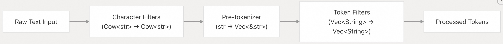
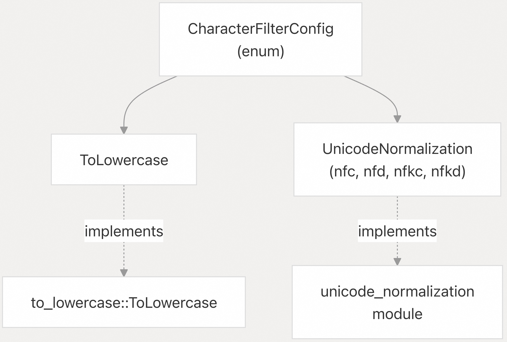
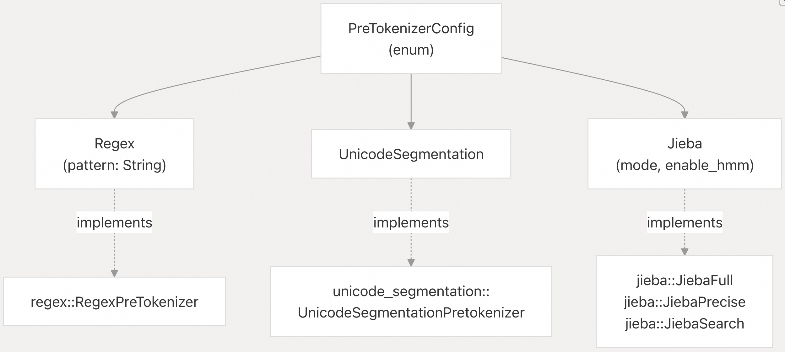
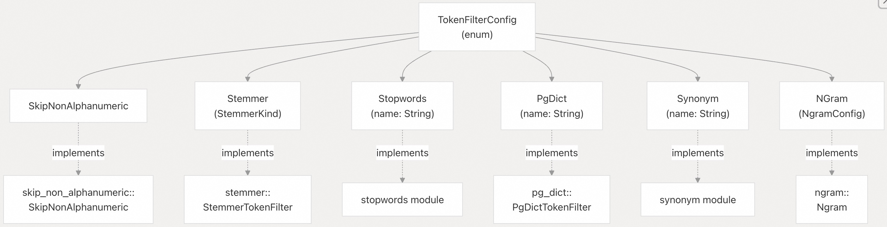
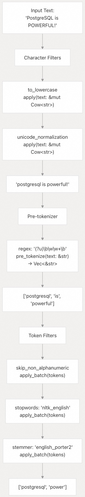
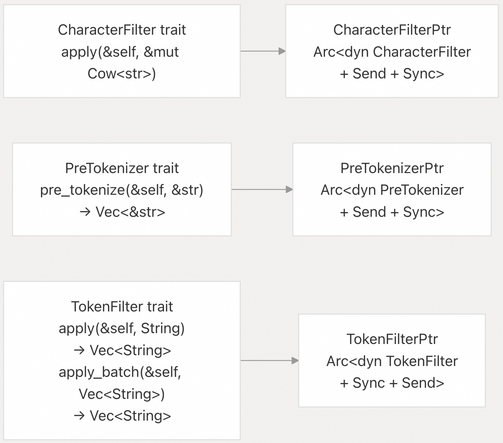

## pg_tokenizer 源码学习: 3.2 文本处理流程 (Text Processing Pipeline)  
                                                                  
### 作者                                                                  
digoal                                                                  
                                                                  
### 日期                                                                  
2025-11-14                                                                 
                                                                  
### 标签                                                                  
pg\_tokenizer , 词化 , bert , 标记化 , Tokenization                                                              
                                                                  
----                                                                  
                                                                  
## 背景           
本文介绍了 `pg_tokenizer` 中将**原始文本 (raw text)** 转换为已处理**词元 (processed tokens)** 的多阶段**文本处理流程 (Text Processing Pipeline)**。该流程包含三个顺序阶段：**字符过滤器 (character filters)**、**预分词器 (pre-tokenizers)** 和**词元过滤器 (token filters)**。每个阶段对文本或词元 (`tokens`) 执行特定的转换。  
  
## 流程架构 (Pipeline Architecture)  
  
**文本处理流程 (Text Processing Pipeline)** 实现了一个三阶段架构，**原始文本 (raw text)** 依次经过顺序转换：  
  
  
  
来源:  
[`README.md` 1-58](https://github.com/tensorchord/pg_tokenizer.rs/blob/d3f7a577/README.md#L1-L58) [`src/character_filter/mod.rs` 1-31](https://github.com/tensorchord/pg_tokenizer.rs/blob/d3f7a577/src/character_filter/mod.rs#L1-L31) [`src/pre_tokenizer/mod.rs` 1-37](https://github.com/tensorchord/pg_tokenizer.rs/blob/d3f7a577/src/pre_tokenizer/mod.rs#L1-L37) [`src/token_filter/mod.rs` 1-51](https://github.com/tensorchord/pg_tokenizer.rs/blob/d3f7a577/src/token_filter/mod.rs#L1-L51)  
  
| 阶段 (Stage) | 输入类型 (Input Type) | 输出类型 (Output Type) | 目的 (Purpose) |  
| :--- | :--- | :--- | :--- |  
| **字符过滤器 (Character Filters)** | `Cow<str>` | `Cow<str>` | 规范化 (`Normalize`) 和清理**原始文本 (raw text)** |  
| **预分词器 (Pre-tokenizer)** | `&str` | `Vec<&str>` | 将文本拆分为初始**词元边界 (token boundaries)** |  
| **词元过滤器 (Token Filters)** | `Vec<String>` | `Vec<String>` | 精炼 (`Refine`)、过滤 (`filter`) 和转换**词元 (tokens)** |  
  
该流程在**字符过滤器 (Character Filters)** 中使用 Rust 的 `Cow<str>` (**写时复制字符串类型 (Copy-on-Write string type)**)，以实现高效的字符串处理，避免在无需修改时进行不必要的内存分配 (`allocations`)。  
  
## 字符过滤器 (Character Filters)  
  
**字符过滤器 (Character Filters)** 在**分词 (tokenization)** 之前对**原始文本 (raw text)** 进行操作，执行字符级别的转换。它们实现了在 [`src/character_filter/mod.rs` 10-12](https://github.com/tensorchord/pg_tokenizer.rs/blob/d3f7a577/src/character_filter/mod.rs#L10-L12) 中定义的 `CharacterFilter` **特性 (trait)**：  
  
```  
pub trait CharacterFilter {  
    fn apply(&self, text: &mut Cow<str>);  
}  
```  
  
### 可用字符过滤器 (Available Character Filters)  
  
在 [`src/character_filter/mod.rs` 15-21](https://github.com/tensorchord/pg_tokenizer.rs/blob/d3f7a577/src/character_filter/mod.rs#L15-L21) 中的 `CharacterFilterConfig` **枚举 (enum)** 定义了两种类型：  
  
  
  
来源: [`src/character_filter/mod.rs` 1-31](https://github.com/tensorchord/pg_tokenizer.rs/blob/d3f7a577/src/character_filter/mod.rs#L1-L31)  
  
| 过滤器类型 (Filter Type) | 配置 (Configuration) | 目的 (Purpose) |  
| :--- | :--- | :--- |  
| `ToLowercase` (**转小写**) | `to_lowercase = {}` | 将所有字符转换为**小写 (lowercase)** |  
| `UnicodeNormalization` (**Unicode规范化**) | `unicode_normalization = "nfkd"` | 使用 NFC、NFD、NFKC 或 NFKD **形式 (forms)** 对 **Unicode** 进行**规范化 (Normalizes)** |  
  
**字符过滤器 (Character Filters)** 按照配置的顺序依次应用。多个**字符过滤器 (Character Filters)** 可以链式组合在一起，如 [`tests/sqllogictest/text_analyzer.slt` 7-10](https://github.com/tensorchord/pg_tokenizer.rs/blob/d3f7a577/tests/sqllogictest/text_analyzer.slt#L7-L10) 所示：  
  
```  
[[character_filters]]  
to_lowercase = {}  
[[character_filters]]  
unicode_normalization = "nfkd"  
```  
  
### 工厂函数 (Factory Function)  
  
在 [`src/character_filter/mod.rs` 23-30](https://github.com/tensorchord/pg_tokenizer.rs/blob/d3f7a577/src/character_filter/mod.rs#L23-L30) 中的 `get_character_filter()` 函数从配置中**实例化 (instantiates)** **字符过滤器 (Character filters)**，并返回 `CharacterFilterPtr` (一个 `Arc<dyn CharacterFilter + Send + Sync>`)。  
  
## 预分词器 (Pre-tokenizers)  
  
**预分词器 (Pre-tokenizers)** 将过滤后的文本拆分为初始**词元边界 (token boundaries)**。它们实现了在 [`src/pre_tokenizer/mod.rs` 12-14](https://github.com/tensorchord/pg_tokenizer.rs/blob/d3f7a577/src/pre_tokenizer/mod.rs#L12-L14) 中定义的 `PreTokenizer` **特性 (trait)**：  
  
```  
pub trait PreTokenizer {  
    fn pre_tokenize<'a>(&self, text: &'a str) -> Vec<&'a str>;  
}  
```  
  
**预分词器 (Pre-tokenizer)** 返回从输入文本**借用 (borrowing)** 的**字符串切片 (string slices)**，以提高效率，并尽可能避免内存分配 (`allocations`)。  
  
### 可用预分词器 (Available Pre-tokenizers)  
  
在 [`src/pre_tokenizer/mod.rs` 17-24](https://github.com/tensorchord/pg_tokenizer.rs/blob/d3f7a577/src/pre_tokenizer/mod.rs#L17-L24) 中的 `PreTokenizerConfig` **枚举 (enum)** 定义了三种类型：  
  
  
  
来源: [`src/pre_tokenizer/mod.rs` 1-37](https://github.com/tensorchord/pg_tokenizer.rs/blob/d3f7a577/src/pre_tokenizer/mod.rs#L1-L37) [`src/pre_tokenizer/jieba.rs` 1-78](https://github.com/tensorchord/pg_tokenizer.rs/blob/d3f7a577/src/pre_tokenizer/jieba.rs#L1-L78)  
  
| **预分词器 (Pre-tokenizer)** | 配置 (Configuration) | 目的 (Purpose) |  
| :--- | :--- | :--- |  
| `Regex` (**正则表达式**) | `regex = '(?u)\b\w\w+\b'` | 使用 **正则表达式模式匹配 (regex pattern matching)** 拆分文本 |  
| `UnicodeSegmentation` (**Unicode分段**) | `pre_tokenizer = "unicode_segmentation"` | 基于 **Unicode 词边界 (Unicode word boundaries)** 进行拆分 |  
| `Jieba` (**结巴分词**) | `jieba = { mode = "search" }` | 带有 **HMM** 支持的中文**文本分词 (text segmentation)** |  
  
### Jieba 配置 (Jieba Configuration)  
  
用于中文文本的 **Jieba 预分词器 (Jieba pre-tokenizer)** 提供了三种**模式 (modes)**，定义在 [`src/pre_tokenizer/jieba.rs` 10-16](https://github.com/tensorchord/pg_tokenizer.rs/blob/d3f7a577/src/pre_tokenizer/jieba.rs#L10-L16) 中：  
  
  * **全模式 (Full)** (`JiebaMode::Full`): 使用 `Jieba.cut()`，可选支持 **HMM (隐马尔可夫模型)**  
  * **精确模式 (Precise)** (`JiebaMode::Precise`): 使用 `Jieba.cut_all()` 进行**穷尽分词 (exhaustive segmentation)**  
  * **搜索模式 (Search)** (`JiebaMode::Search`): 使用 `Jieba.cut_for_search()`，为**搜索引擎 (search engines)** 优化  
  
在 [`src/pre_tokenizer/jieba.rs` 18-33](https://github.com/tensorchord/pg_tokenizer.rs/blob/d3f7a577/src/pre_tokenizer/jieba.rs#L18-L33) 中的 `JiebaConfig` **结构体 (structure)** 允许配置：  
  
```  
[pre_tokenizer.jieba]  
mode = "search"  
enable_hmm = true  
```  
  
**Jieba** 实例在 [`src/pre_tokenizer/jieba.rs` 8](https://github.com/tensorchord/pg_tokenizer.rs/blob/d3f7a577/src/pre_tokenizer/jieba.rs#L8-L8) 中使用 `LazyLock` **惰性初始化 (lazily initialized)**，并被所有请求**共享 (shared)**。  
  
### 工厂函数 (Factory Function)  
  
在 [`src/pre_tokenizer/mod.rs` 26-32](https://github.com/tensorchord/pg_tokenizer.rs/blob/d3f7a577/src/pre_tokenizer/mod.rs#L26-L32) 中的 `get_pre_tokenizer()` 函数从配置中**实例化 (instantiates)** **预分词器 (pre-tokenizers)**，并返回 `PreTokenizerPtr` (一个 `Arc<dyn PreTokenizer + Send + Sync>`)。  
  
## 词元过滤器 (Token Filters)  
  
**词元过滤器 (Token Filters)** 精炼由**预分词器 (pre-tokenizer)** 产生的**词元流 (token stream)**。它们实现了在 [`src/token_filter/mod.rs` 16-25](https://github.com/tensorchord/pg_tokenizer.rs/blob/d3f7a577/src/token_filter/mod.rs#L16-L25) 中定义的 `TokenFilter` **特性 (trait)**：  
  
```  
pub trait TokenFilter {  
    fn apply(&self, token: String) -> Vec<String>;  
  
    fn apply_batch(&self, tokens: Vec<String>) -> Vec<String> {  
        tokens  
            .into_iter()  
            .flat_map(|token| self.apply(token))  
            .collect()  
    }  
}  
```  
  
**词元过滤器 (Token filters)** 可以将单个词元 (`token`) 转换为零个、一个或多个词元（例如，**N-gram 过滤器 (n-gram filters)** 会生成多个词元）。  
  
### 可用词元过滤器 (Available Token Filters)  
  
在 [`src/token_filter/mod.rs` 28-39](https://github.com/tensorchord/pg_tokenizer.rs/blob/d3f7a577/src/token_filter/mod.rs#L28-L39) 中的 `TokenFilterConfig` **枚举 (enum)** 定义了六种类型：  
  
  
  
来源: [`src/token_filter/mod.rs` 1-51](https://github.com/tensorchord/pg_tokenizer.rs/blob/d3f7a577/src/token_filter/mod.rs#L1-L51)  
  
| **词元过滤器 (Token Filter)** | 配置 (Configuration) | 目的 (Purpose) |  
| :--- | :--- | :--- |  
| `SkipNonAlphanumeric` (**跳过非字母数字**) | `skip_non_alphanumeric = {}` | 移除包含**非字母数字字符 (non-alphanumeric characters)** 的词元 (`tokens`) |  
| `Stemmer` (**词干提取器**) | `stemmer = "english_porter2"` | 将词语还原为它们的**词根形式 (root form)** |  
| `Stopwords` (**停用词**) | `stopwords = "nltk_english"` | 从指定的**停用词列表 (stopword list)** 中移除常用词 |  
| `PgDict` (**PostgreSQL字典**) | `pg_dict = "english_stem"` | 使用 **PostgreSQL 文本搜索字典 (text search dictionaries)** |  
| `Synonym` (**同义词**) | `synonym = "synonym_list"` | 用**同义词 (synonyms)** 替换词元 (`tokens`) |  
| `NGram` (**N-gram**) | `ngram = { min = 2, max = 3 }` | 生成 **N-gram 字符序列 (character sequences)** |  
  
有关每种**词元过滤器 (token filter)** 类型的详细信息，包括配置选项和用例，请参阅**词元过滤器 (Token Filters)**章节。  
  
### 工厂函数 (Factory Function)  
  
在 [`src/token_filter/mod.rs` 41-50](https://github.com/tensorchord/pg_tokenizer.rs/blob/d3f7a577/src/token_filter/mod.rs#L41-L50) 中的 `get_token_filter()` 函数从配置中**实例化 (instantiates)** **词元过滤器 (token filters)**，并返回 `TokenFilterPtr` (一个 `Arc<dyn TokenFilter + Sync + Send>`)。  
  
## 流程数据流 (Pipeline Data Flow)  
  
以下图表说明了数据如何通过每个流程阶段进行转换，并附有具体示例：  
  
  
  
来源: [`tests/sqllogictest/text_analyzer.slt` 1-26](https://github.com/tensorchord/pg_tokenizer.rs/blob/d3f7a577/tests/sqllogictest/text_analyzer.slt#L1-L26) [`tests/sqllogictest/tokenizer.slt` 1-20](https://github.com/tensorchord/pg_tokenizer.rs/blob/d3f7a577/tests/sqllogictest/tokenizer.slt#L1-L20)  
  
### 逐阶段转换 (Stage-by-Stage Transformation)  
  
1.  **字符过滤阶段 (Character Filter Stage)**：**原始文本 (Raw text)** 依次通过每个**字符过滤器 (character filter)**。过滤器会**就地 (in place)** 修改 `Cow<str>`，可能会避免内存分配 (`allocations`)。在示例中，**转小写 (lowercase conversion)** 和 **Unicode 规范化 (Unicode normalization)** 清理了输入。  
2.  **预分词阶段 (Pre-tokenization Stage)**：过滤后的文本被拆分为**词元边界 (token boundaries)**。**预分词器 (pre-tokenizer)** 返回从输入文本**借用 (borrowed)** 的**字符串切片 (string slices)** (`Vec<&str>`)。在示例中，**正则表达式 (regex pattern)** `(?u)\b\w\w+\b` 匹配**词边界 (word boundaries)**。  
3.  **词元过滤阶段 (Token Filter Stage)**：**拥有的 (Owned)** `String` **词元 (tokens)** 依次通过每个**词元过滤器 (token filter)**，使用 [`src/token_filter/mod.rs` 19-24](https://github.com/tensorchord/pg_tokenizer.rs/blob/d3f7a577/src/token_filter/mod.rs#L19-L24) 中的 `apply_batch()`。每个过滤器可以：  
      * 移除词元（**停用词 (stopwords)** 移除了 "is"）  
      * 转换词元（**词干提取器 (stemmer)** 将 "powerful" 转换为 "power"）  
      * 生成多个词元（**N-gram** 拆分词元）  
  
## 流程配置示例 (Pipeline Configuration Example)  
  
**文本分析器 (Text analyzers)** 通过定义过滤器序列来**协调 (orchestrate)** 整个流程。配置使用 **TOML (Tom's Obvious, Minimal Language)** 格式，如 [`tests/sqllogictest/text_analyzer.slt` 5-17](https://github.com/tensorchord/pg_tokenizer.rs/blob/d3f7a577/tests/sqllogictest/text_analyzer.slt#L5-L17) 所示：  
  
```  
pre_tokenizer = "unicode_segmentation"  
[[character_filters]]  
to_lowercase = {}  
[[character_filters]]  
unicode_normalization = "nfkd"  
[[token_filters]]  
skip_non_alphanumeric = {}  
[[token_filters]]  
stopwords = "nltk_english"  
[[token_filters]]  
stemmer = "english_porter2"  
```  
  
双括号 `[[character_filters]]` 和 `[[token_filters]]` **语法 (syntax)** 表示按顺序应用的过滤器**数组 (arrays)**。  
  
有关完整的配置参考和创建**文本分析器 (text analyzers)** 的示例，请参阅**创建文本分析器 (Creating Text Analyzers)** 和**配置参考 (Configuration Reference)**章节。  
  
## 实现细节 (Implementation Details)  
  
### 基于特性的架构 (Trait-Based Architecture)  
  
每个流程阶段都定义了一个具有特定转换**语义 (semantics)** 的**特性 (trait)**：  
  
  
  
来源: [`src/character_filter/mod.rs` 10-13](https://github.com/tensorchord/pg_tokenizer.rs/blob/d3f7a577/src/character_filter/mod.rs#L10-L13) [`src/pre_tokenizer/mod.rs` 12-15](https://github.com/tensorchord/pg_tokenizer.rs/blob/d3f7a577/src/pre_tokenizer/mod.rs#L12-L15) [`src/token_filter/mod.rs` 16-26](https://github.com/tensorchord/pg_tokenizer.rs/blob/d3f7a577/src/token_filter/mod.rs#L16-L26)  
  
所有**特性 (traits)** 都实现为封装在 `Arc` 中的**特性对象 (trait objects)**，用于**线程安全引用计数 (thread-safe reference counting)**。这使得流程组件可以：  
  
  * **共享 (Shared)**：多个**文本分析器 (text analyzers)** 可以引用相同的过滤器实例。  
  * **线程安全 (Thread-safe)**：过滤器是 `Send + Sync`，可供**并发访问 (concurrent access)**。  
  * **多态 (Polymorphic)**：不同的过滤器实现位于相同的**特性接口 (trait interface)** 之后。  
  
### 配置枚举 (Configuration Enums)  
  
每个阶段都定义了一个从 **TOML** **反序列化 (deserialized)** 的**配置枚举 (configuration enum)**：  
  
  * `CharacterFilterConfig` 在 [`src/character_filter/mod.rs` 15-21](https://github.com/tensorchord/pg_tokenizer.rs/blob/d3f7a577/src/character_filter/mod.rs#L15-L21) 中  
  * `PreTokenizerConfig` 在 [`src/pre_tokenizer/mod.rs` 17-24](https://github.com/tensorchord/pg_tokenizer.rs/blob/d3f7a577/src/pre_tokenizer/mod.rs#L17-L24) 中  
  * `TokenFilterConfig` 在 [`src/token_filter/mod.rs` 28-39](https://github.com/tensorchord/pg_tokenizer.rs/blob/d3f7a577/src/token_filter/mod.rs#L28-L39) 中  
  
这些**枚举 (enums)** 使用 **serde** 的 `#[serde(rename_all = "snake_case")]` **属性 (attribute)** 进行对 **TOML** 友好的命名，并使用 `#[serde(deny_unknown_fields)]` 来及早捕获**配置错误 (configuration errors)**。  
  
### 工厂函数 (Factory Functions)  
  
**工厂函数 (Factory functions)** 将**配置枚举 (configuration enums)** 转换为**特性对象 (trait objects)**：  
  
  * `get_character_filter(config: CharacterFilterConfig) -> CharacterFilterPtr` 在 [`src/character_filter/mod.rs` 23-30](https://github.com/tensorchord/pg_tokenizer.rs/blob/d3f7a577/src/character_filter/mod.rs#L23-L30) 中  
  * `get_pre_tokenizer(config: PreTokenizerConfig) -> PreTokenizerPtr` 在 [`src/pre_tokenizer/mod.rs` 26-32](https://github.com/tensorchord/pg_tokenizer.rs/blob/d3f7a577/src/pre_tokenizer/mod.rs#L26-L32) 中  
  * `get_token_filter(config: TokenFilterConfig) -> TokenFilterPtr` 在 [`src/token_filter/mod.rs` 41-50](https://github.com/tensorchord/pg_tokenizer.rs/blob/d3f7a577/src/token_filter/mod.rs#L41-L50) 中  
  
这些函数在创建**文本分析器 (text analyzer)** 期间被调用，以**实例化 (instantiate)** 流程组件。有关组件如何被组装成可执行流程的详细信息，请参阅**文本分析器 (Text Analyzers)**章节。  
  
来源: [`src/character_filter/mod.rs` 1-31](https://github.com/tensorchord/pg_tokenizer.rs/blob/d3f7a577/src/character_filter/mod.rs#L1-L31) [`src/pre_tokenizer/mod.rs` 1-37](https://github.com/tensorchord/pg_tokenizer.rs/blob/d3f7a577/src/pre_tokenizer/mod.rs#L1-L37) [`src/token_filter/mod.rs` 1-51](https://github.com/tensorchord/pg_tokenizer.rs/blob/d3f7a577/src/token_filter/mod.rs#L1-L51)  
      
#### [PolarDB 学习图谱](https://www.aliyun.com/database/openpolardb/activity "8642f60e04ed0c814bf9cb9677976bd4")
  
  
#### [PostgreSQL 解决方案集合](../201706/20170601_02.md "40cff096e9ed7122c512b35d8561d9c8")
  
  
#### [德哥 / digoal's Github - 公益是一辈子的事.](https://github.com/digoal/blog/blob/master/README.md "22709685feb7cab07d30f30387f0a9ae")
  
  
#### [About 德哥](https://github.com/digoal/blog/blob/master/me/readme.md "a37735981e7704886ffd590565582dd0")
  
  

  
