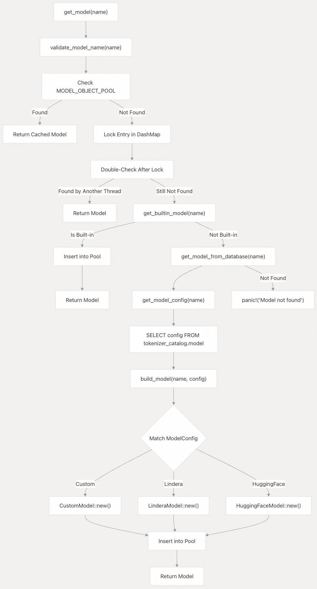
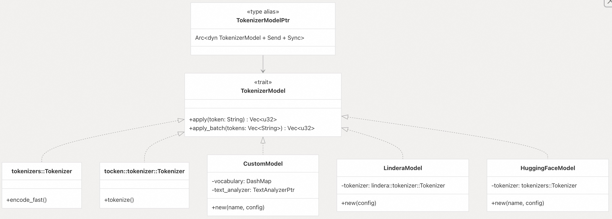
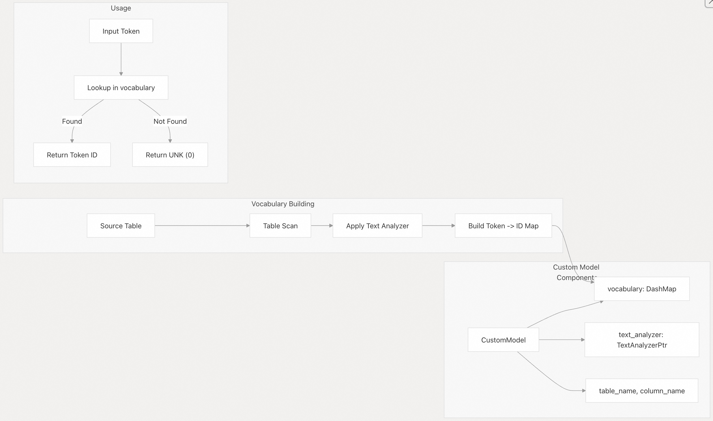
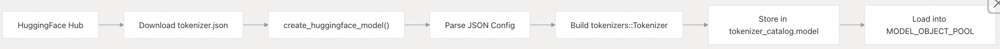
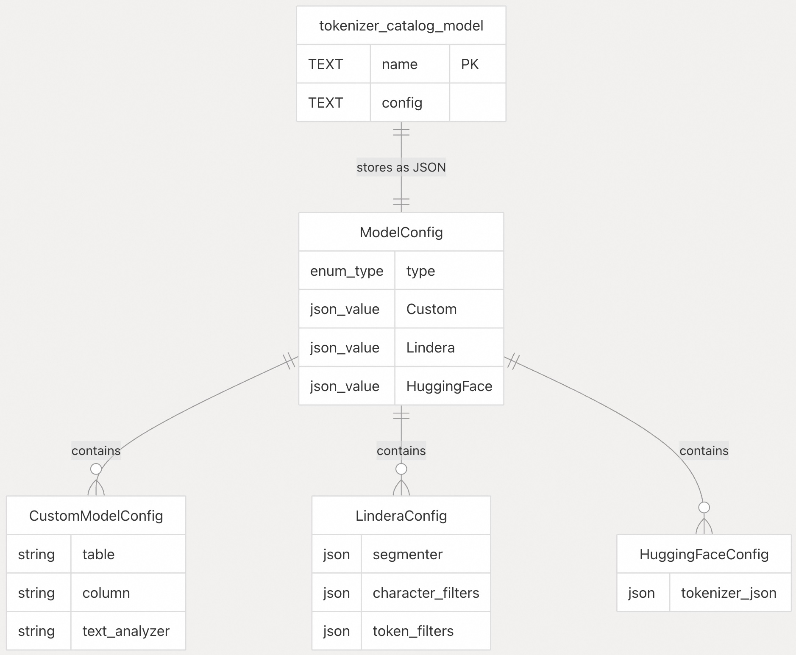
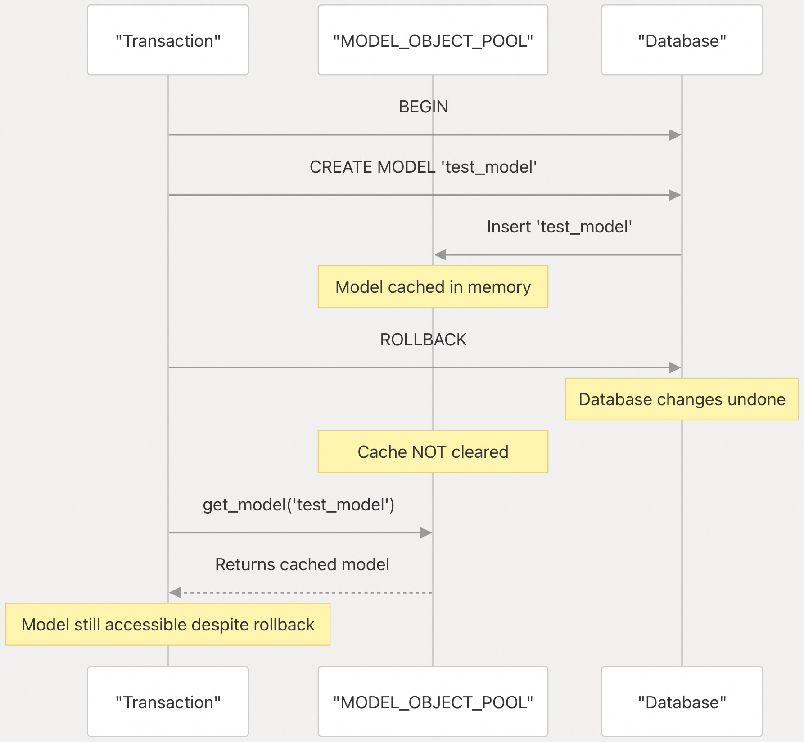
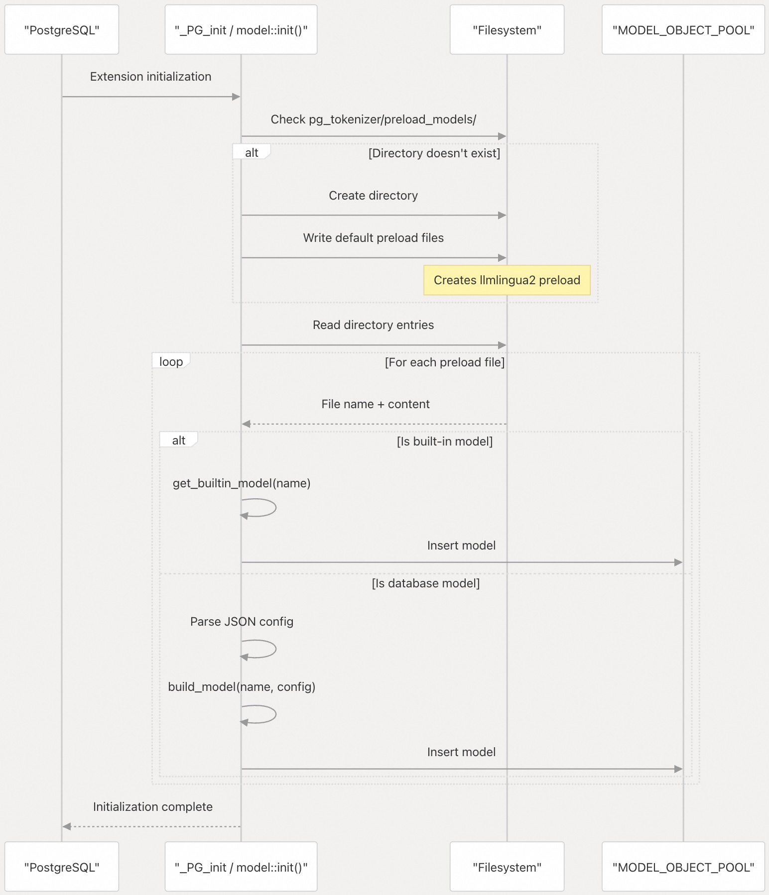

## pg_tokenizer 源码学习: 3.3 模型 (Models)  
                                                                    
### 作者                                                                    
digoal                                                                    
                                                                    
### 日期                                                                    
2025-11-14                                                                   
                                                                    
### 标签                                                                    
pg\_tokenizer , 词化 , bert , 标记化 , Tokenization                                                                
                                                                    
----                                                                    
                                                                    
## 背景             
`pg_tokenizer` 中的**模型** (Models) 负责将**文本词元** (text tokens) 转换为**数字词元 ID** (numerical token IDs)，即**嵌入** (embeddings)。模型系统管理四种不同的模型类型，通过 `TokenizerModel` **特征** (trait) 提供统一的接口，并通过**内存缓存** (in-memory caching) 和**预加载** (preloading) 机制实现性能优化。  
  
### 概览 (Overview)  
  
模型通过 `get_model()` 函数访问，该函数实现了三层查找策略：**内存缓存** (`MODEL_OBJECT_POOL`)、**内置模型** (built-in models) 和**数据库存储模型** (database-stored models)。所有模型都存储在 `tokenizer_catalog.model` 表中，但**内置模型**除外，它们被嵌入在**扩展二进制文件** (extension binary) 中。  
  
**模型查找流程 (Model Lookup Flow)**  
  
  
  
来源:  
[`src/model/mod.rs` 64-86](https://github.com/tensorchord/pg_tokenizer.rs/blob/d3f7a577/src/model/mod.rs#L64-L86)  
[`src/model/mod.rs` 88-108](https://github.com/tensorchord/pg_tokenizer.rs/blob/d3f7a577/src/model/mod.rs#L88-L108)  
  
### TokenizerModel 特征 (Trait)  
  
`TokenizerModel` **特征** (trait) 定义了将**文本词元** (text tokens) 转换为**词元 ID** (token IDs) 的接口。所有模型都实现了此**特征**，无论底层**词元化** (tokenization) 算法如何，都提供统一的 **API**。  
  
**TokenizerModel 特征与实现 (Trait and Implementations)**  
  
  
  
该**特征**定义了两个方法：  
  
  * `apply(token: String) -> Vec<u32>`: 将单个词元转换为**词元 ID**。  
  * `apply_batch(tokens: Vec<String>) -> Vec<u32>`: 将多个词元转换为**词元 ID**（默认实现会展平单个 `apply()` 的结果）。  
  
来源:  
[`src/model/mod.rs` 17-39](https://github.com/tensorchord/pg_tokenizer.rs/blob/d3f7a577/src/model/mod.rs#L17-L39)  
  
### 模型类型 (Model Types)  
  
支持四种**模型类型**，每种都针对不同的用例和**词元化**方法。  
  
| 模型类型 (Model Type) | 模块 (Module) | 配置 (Configuration) | 存储 (Storage) | 主要用例 (Primary Use Case) |  
| :--- | :--- | :--- | :--- | :--- |  
| 内置 (Built-in) | [`src/model/builtin.rs`](https://github.com/tensorchord/pg_tokenizer.rs/blob/d3f7a577/src/model/builtin.rs) | 编译进二进制文件 (Compiled into binary) | 扩展二进制文件 (Extension binary) | 快速启动流行模型 |  
| 自定义 (Custom) | [`src/model/custom.rs`](https://github.com/tensorchord/pg_tokenizer.rs/blob/d3f7a577/src/model/custom.rs) | `CustomModelConfig` | `tokenizer_catalog.model` | **语料库专用词汇表** (Corpus-specific vocabularies) |  
| Lindera | [`src/model/lindera.rs`](https://github.com/tensorchord/pg_tokenizer.rs/blob/d3f7a577/src/model/lindera.rs) | `LinderaConfig` | `tokenizer_catalog.model` | 日语文本处理 |  
| HuggingFace | [`src/model/huggingface.rs`](https://github.com/tensorchord/pg_tokenizer.rs/blob/d3f7a577/src/model/huggingface.rs) | `HuggingFaceConfig` | `tokenizer_catalog.model` | 标准 **HF** 词元分析器 (tokenizers) |  
  
#### 内置模型 (Built-in Models)  
  
**内置模型**嵌入在**扩展二进制文件**中，安装后立即可用。它们不需要配置或数据库存储。  
  
**可用的内置模型 (Available Built-in Models)**  
  
| 模型名称 (Model Name) | 基础库 (Underlying Library) | 描述 (Description) | 内存使用 (Memory Usage) |  
| :--- | :--- | :--- | :--- |  
| `bert_base_uncased` | `tocken` | BERT base uncased **词元分析器** | \~50MB |  
| `wiki_tocken` | `tocken` | Wiki 数据集 **词元分析器** | \~50MB |  
| `gemma2b` | `tocken` | Gemma 2B **词元分析器** | \~100MB |  
| `llmlingua2` | `tocken` | LLM-Lingua 2 **词元分析器** | \~200MB |  
  
`llmlingua2` 模型在服务器启动时默认**预加载** (preloaded)。要检查模型名称是否引用了**内置模型**，请使用 `is_builtin_model(name)`。  
  
来源:  
[`src/model/builtin.rs` 34-42](https://github.com/tensorchord/pg_tokenizer.rs/blob/d3f7a577/src/model/builtin.rs#L34-L42)  
  
来源:  
[`src/model/builtin.rs` 1-42](https://github.com/tensorchord/pg_tokenizer.rs/blob/d3f7a577/src/model/builtin.rs#L1-L42)  
[`docs/06-model.md` 7-15](https://github.com/tensorchord/pg_tokenizer.rs/blob/d3f7a577/docs/06-model.md#L7-L15)  
  
#### 自定义模型 (Custom Models)  
  
**自定义模型**从指定的语料库中**动态**构建词汇表。它们是通过使用**文本分析器** (text analyzer) 分析源表列，生成从**词元**到**整数 ID** 的词汇映射来创建的。  
  
**自定义模型结构 (Custom Model Structure)**  
  
  
  
**自定义模型**通过数据库**触发器** (triggers) 支持**词汇表**的自动更新。当使用 `create_custom_model_tokenizer_and_trigger()` 配置时，**词汇表**会在数据插入或更新时自动纳入新的**词元**。  
  
来源:  
[`src/model/custom.rs`](https://github.com/tensorchord/pg_tokenizer.rs/blob/d3f7a577/src/model/custom.rs)  
[`docs/06-model.md` 105-216](https://github.com/tensorchord/pg_tokenizer.rs/blob/d3f7a577/docs/06-model.md#L105-L216)  
  
#### Lindera 模型 (Lindera Models)  
  
**Lindera 模型**使用 **Lindera 库**提供日语**词元化** (tokenization)，支持各种**词典** (ipadic, unidic 等)。这些模型集成了日语特有的处理，包括**字符过滤器** (character filters)、**分段** (segmentation) 和**词元过滤器** (token filters)。  
  
**Lindera 模型配置 (Lindera Model Configuration)**  
  
**Lindera 模型**通过 **TOML** 进行配置，指定：  
  
  * **分段器 (Segmenter)**: 字典类型 (`ipadic`、`unidic`、`ko-dic`、`cc-cedict`) 和分段模式。  
  * **字符过滤器 (Character Filters)**: **Unicode** 规范化、迭代标记处理、字符映射。  
  * **词元过滤器 (Token Filters)**: 复合词、停用标签 (stop tags)、片假名词干提取、数字处理。  
  
**Lindera 库**必须使用适当的**功能标志** (feature flags) 编译，以启用特定的**词典**。默认情况下，不包含任何 **Lindera 词典**，以最小化**二进制文件**大小。  
  
来源:  
[`src/model/lindera.rs`](https://github.com/tensorchord/pg_tokenizer.rs/blob/d3f7a577/src/model/lindera.rs)  
[`docs/06-model.md` 25-103](https://github.com/tensorchord/pg_tokenizer.rs/blob/d3f7a577/docs/06-model.md#L25-L103)  
  
#### HuggingFace 模型 (HuggingFace Models)  
  
**HuggingFace 模型**使用标准的 **HuggingFace** `tokenizers.json` 格式导入**词元分析器**。这使得它们能够兼容来自 **HuggingFace 模型中心**的数千个**预训练模型** (pre-trained models)。  
  
**HuggingFace 模型加载 (HuggingFace Model Loading)**  
  
  
  
**HuggingFace 模型**使用 `tokenizers` **crate** (包)，它提供了**词元化**算法的**原生 Rust 实现**。模型配置以 **JSON** 形式存储在数据库中，并按需重建。  
  
来源:  
[`src/model/huggingface.rs`](https://github.com/tensorchord/pg_tokenizer.rs/blob/d3f7a577/src/model/huggingface.rs)  
[`docs/06-model.md` 16-23](https://github.com/tensorchord/pg_tokenizer.rs/blob/d3f7a577/docs/06-model.md#L16-L23)  
  
### 模型配置与存储 (Model Configuration and Storage)  
  
**模型**（**内置模型**除外）存储在 `tokenizer_catalog.model` 表中，其配置以 **JSON** 形式**序列化** (serialized)。`ModelConfig` **枚举** (enum) 提供了不同配置格式的**类型安全表示** (type-safe representation)。  
  
**数据库 Schema 和配置映射 (Database Schema and Configuration Mapping)**  
  
   
  
`ModelConfig` **枚举**使用 **Serde** 的 `#[serde(rename_all = "snake_case")]` 和 `#[serde(deny_unknown_fields)]` 属性，以确保**反序列化** (deserialization) 期间的严格**验证** (validation)。  
  
来源:  
[`src/model/mod.rs` 41-62](https://github.com/tensorchord/pg_tokenizer.rs/blob/d3f7a577/src/model/mod.rs#L41-L62)  
  
### 对象池和模型缓存 (Object Pool and Model Caching)  
  
`MODEL_OBJECT_POOL` 是一个全局的、**线程安全** (thread-safe) 的**缓存** (cache)，使用 `DashMap<String, TokenizerModelPtr>` 实现。它存储已加载的模型，以避免在后续请求中进行昂贵的**重建** (reconstruction)。  
  
**缓存行为 (Caching Behavior)**  
  
| 操作 (Operation) | 缓存行为 (Cache Behavior) | 性能影响 (Performance Impact) |  
| :--- | :--- | :--- |  
| 第一次 `get_model()` 调用 | **缓存未命中** (Cache miss)，从源加载 | 高 (模型加载) |  
| 随后的 `get_model()` 调用 | **缓存命中** (Cache hit) | 低 (指针克隆) |  
| **内置模型** (Built-in model) | 加载一次，永久缓存 | 每个模型约 100-200MB 内存 |  
| **自定义模型** (Custom model) | 加载一次，永久缓存 | 取决于词汇表大小 |  
  
**缓存生命周期和事务隔离 (Cache Lifecycle and Transaction Isolation)**  
  
**缓存**不遵循 **PostgreSQL** 的**事务隔离** (transaction isolation) 语义。在**事务** (transaction) 中创建的模型会立即**缓存**，即使**事务回滚** (transaction rolled back)，它们仍保持**缓存**状态。要在**回滚**后清除**缓存模型**，需要显式调用相应的 `drop_*` 函数或重新连接到数据库。  
  
  
  
来源:  
[`src/model/mod.rs` 50-52](https://github.com/tensorchord/pg_tokenizer.rs/blob/d3f7a577/src/model/mod.rs#L50-L52)  
[`src/model/mod.rs` 64-86](https://github.com/tensorchord/pg_tokenizer.rs/blob/d3f7a577/src/model/mod.rs#L64-L86)  
[`docs/07-limitation.md` 1-20](https://github.com/tensorchord/pg_tokenizer.rs/blob/d3f7a577/docs/07-limitation.md#L1-L20)  
  
### 模型名称验证 (Model Name Validation)  
  
模型名称必须满足以下约束，由 `validate_model_name()` 和 `validate_new_model_name()` 函数强制执行：  
  
**验证规则 (Validation Rules)**  
  
| 规则 (Rule) | 约束 (Constraint) | 函数 (Function) |  
| :--- | :--- | :--- |  
| **字符集** (Character set) | 仅 **ASCII** 字母、数字、下划线 | `validate_model_name()` |  
| **首字符** (First character) | 必须是 **ASCII** 字母 | `validate_model_name()` |  
| **长度** (Length) | 1-20 个字符 | `validate_model_name()` |  
| **保留名称** (Reserved names) | 不能与**内置模型**名称冲突 | `validate_new_model_name()` |  
  
**验证函数**返回 `Result<(), String>` 并附带描述性错误消息。**内置模型**名称 (`bert_base_uncased`、`wiki_tocken`、`gemma2b`、`llmlingua2`) 是**保留的**，不能用于**自定义**、**Lindera** 或 **HuggingFace 模型**。  
  
来源:  
[`src/model/mod.rs` 110-137](https://github.com/tensorchord/pg_tokenizer.rs/blob/d3f7a577/src/model/mod.rs#L110-L137)  
  
### 模型预加载 (Model Preloading)  
  
**模型预加载** (Model Preloading) 在 **PostgreSQL 启动**时将模型加载到 `MODEL_OBJECT_POOL` 中，避免**首次使用延迟** (first-use latency)。**预加载系统**使用文件系统目录 `pg_tokenizer/preload_models/` 来持久化要**预加载**的模型列表。  
  
**预加载目录结构 (Preload Directory Structure)**  
  
```  
$PGDATA/pg_tokenizer/preload_models/  
├── llmlingua2          # 内置模型 (空文件)  
├── bert_custom         # 自定义模型 (包含 JSON 配置)  
└── my_lindera          # Lindera 模型 (包含 JSON 配置)  
```  
  
对于**内置模型**，**预加载文件**是空的。对于**数据库存储模型**，文件包含模型的 **JSON 配置**。  
  
**预加载管理函数 (Preload Management Functions)**  
  
| 函数 (Function) | 描述 (Description) | 效果 (Effect) | 是否需要重启 (Requires Restart) |  
| :--- | :--- | :--- | :--- |  
| `add_preload_model(name)` | 将模型添加到**预加载**列表 | 将文件写入**预加载目录** | 是 (Yes) |  
| `remove_preload_model(name)` | 从**预加载**列表中删除模型 | 从**预加载目录**中删除文件 | 是 (Yes) |  
| `list_preload_models()` | 列出所有**预加载模型** | 读取**预加载目录** | 否 (No) |  
  
**初始化顺序 (Initialization Sequence)**  
  
  
  
默认情况下，`llmlingua2` 是**预加载**的。要更改**预加载**的模型，请使用 `add_preload_model()` 或 `remove_preload_model()`，然后重新启动 **PostgreSQL**。  
  
来源:  
[`src/model/mod.rs` 139-212](https://github.com/tensorchord/pg_tokenizer.rs/blob/d3f7a577/src/model/mod.rs#L139-L212)  
[`docs/06-model.md` 218-231](https://github.com/tensorchord/pg_tokenizer.rs/blob/d3f7a577/docs/06-model.md#L218-L231)  
  
### 如何使用 (How to Use)  
  
在 **PostgreSQL** 应用程序中，**模型系统**通常通过更高级别的 **SQL 函数**间接使用，这些函数创建和管理**词元分析器** (tokenizers)。过程通常包括：  
  
1.  创建一个**模型**（使用 `create_custom_model`、`create_huggingface_model` 等）。  
2.  创建一个使用该**模型**的**词元分析器**。  
3.  将**词元分析器**应用于文本数据。  
  
对于频繁使用的模型，建议使用**预加载**功能以获得更好的性能。  
  
来源:  
[`docs/06-model.md` 8-229](https://github.com/tensorchord/pg_tokenizer.rs/blob/d3f7a577/docs/06-model.md#L8-L229)  
  
# 附录1: jieba 模型存储在哪里  
jieba 模型存储在内存中, 通过静态变量 `JIEBA` 进行管理。   
  
具体来说:   
  
1. **内存存储**: jieba 模型使用 `LazyLock` 包装,在首次访问时初始化并保存在静态变量中。   
  
2. **初始化方式**: 模型通过 `Jieba::new()` 创建,这会加载 jieba-rs 库内置的词典数据。    
  
3. **预加载**: 可以通过 `init()` 函数强制预加载模型,避免首次使用时的延迟。   
  
4. **依赖库**: jieba 模型的实际数据来自 `jieba-rs` crate (版本 0.7.2)。   
  
jieba 不像 HuggingFace 或 Lindera 模型那样存储在数据库的 `tokenizer_catalog.model` 表中, 也不需要通过 `create_lindera_model` 或 `create_huggingface_model` 函数创建。它是作为预分词器(pre-tokenizer)的一部分直接使用的。   
  
## Notes  
  
jieba 在 pg_tokenizer 中被用作预分词器(pre-tokenizer), 而不是完整的模型(model)。 您可以在创建文本分析器时配置 jieba, 例如在测试文件中可以看到使用 `[pre_tokenizer.jieba]` 配置。  jieba 支持三种模式:`full`、`precise` 和 `search`, 以及 HMM 开关。    
  
  
# 附录2:  
text可以通过哪些步骤和装置转换为若干个token? 模型的作用是不是将处理好的token映射为高维向量? token的向量表示是稀疏向量还是稠密向量? text由若干个token组成, 那么text的高维向量又是如何生成的? text的向量是稀疏向量还是稠密向量?  
  
您的问题是关于 `pg_tokenizer` 扩展中文本(text)如何转换为 token, 以及模型在这个过程中的作用。让我详细解释这个处理流程。   
  
## Text 转换为 Token 的步骤和装置  
  
文本转换为 token 经过以下三个阶段的处理管道:   
  
1. **Character Filters(字符过滤器)**: 在分词之前修改文本,例如转换为小写或进行 Unicode 标准化    
  
2. **Pre-tokenizer(预分词器)**: 将文本分割成初始的 token,例如使用 Unicode 分词或正则表达式    
  
3. **Token Filters(token 过滤器)**: 对 token 进行转换或过滤,例如移除停用词、词干提取等    
  
这个处理流程在 `TextAnalyzer::apply` 方法中实现,最终返回 `Vec<String>` 类型的 token 数组。    
  
## 模型的作用  
  
**模型的作用不是将 token 映射为高维向量,而是将 token 映射为整数 ID(token embeddings)**。   
  
在 `Tokenizer::tokenize` 方法中可以看到完整流程:首先通过 `text_analyzer.apply(text)` 获得 token 字符串数组,然后通过 `model.apply_batch(tokens)` 将这些 token 转换为整数 ID 数组(`Vec<u32>`)。    
  
模型实现了 `TokenizerModel` trait, 其核心方法 `apply` 将单个 token 字符串转换为整数 ID 数组。    
  
## Token 的向量表示  
  
**Token 的表示是整数 ID,不是稀疏向量也不是稠密向量**。   
  
从代码可以看到,`tokenize` 函数返回的是 `Vec<i32>`, 这是一个整数数组, 每个整数代表词汇表中的一个 token ID。    
  
例如, 在自定义模型的测试中, 文档被转换为整数数组存储在 `embedding INT[]` 列中。   
  
## Text 的向量表示  
  
**Text 的向量表示就是其所有 token 的 ID 序列, 也是整数数组, 不是传统意义上的稀疏或稠密向量**。   
  
整个文本通过 tokenizer 处理后, 得到的是一个整数序列, 这个序列可以被转换为 `bm25vector` 类型用于相似度搜索。   
  
例如,在日语模型的测试中,每个文本段落被转换为一个整数数组:    
  
## Notes  
  
需要注意的是, `pg_tokenizer` 扩展的主要功能是**分词和 token ID 映射**, 而不是生成传统的词向量(word embeddings)。 这些整数 ID 可以配合 `VectorChord-bm25` 扩展用于 BM25 排序,或者作为其他向量化模型的输入。 如果您需要真正的高维稠密向量表示(如 BERT embeddings),需要使用其他工具或扩展来处理这些 token ID。   
  
# 附录3:  
所以这里提到的embedding不是语义层面的向量对吗?  
  
是的, 您理解得完全正确。   
  
在 `pg_tokenizer` 中,`embedding` 这个术语**不是指语义层面的向量表示**,而是指 **token ID 的整数数组**。   
  
## 具体说明  
  
从代码实现可以看到,`embedding` 列的类型是 `INT[]`,存储的是整数数组:   
  
这些整数是通过 `tokenize()` 函数生成的,该函数返回 `Vec<i32>`, 即整数向量:    
  
在 `Tokenizer::tokenize` 的实现中,可以看到它只是将 token 字符串映射为 `u32` 类型的 ID:    
  
对于自定义模型,这些 ID 来自词汇表中的自增主键,每个 token 对应一个唯一的整数 ID:   
  
## 与语义向量的区别  
  
这里的 `embedding` 只是 **词汇表索引**,不包含任何语义信息:   
  
- **不是语义向量**: 没有捕捉词语之间的语义关系  
- **不是稠密向量**: 不是浮点数向量,而是整数 ID  
- **不是稀疏向量**: 不是 one-hot 编码或 TF-IDF 向量  
  
这些整数 ID 主要用于 BM25 排序算法,而不是语义相似度计算。   
  
## Notes  
  
如果您需要真正的语义向量(如 Word2Vec、BERT embeddings 等), 需要使用其他工具或扩展来处理这些 token ID。 `pg_tokenizer` 的设计目标是为 BM25 等基于词频的检索算法提供 token 化支持, 而不是生成语义嵌入。    
  
      
#### [PolarDB 学习图谱](https://www.aliyun.com/database/openpolardb/activity "8642f60e04ed0c814bf9cb9677976bd4")
  
  
#### [PostgreSQL 解决方案集合](../201706/20170601_02.md "40cff096e9ed7122c512b35d8561d9c8")
  
  
#### [德哥 / digoal's Github - 公益是一辈子的事.](https://github.com/digoal/blog/blob/master/README.md "22709685feb7cab07d30f30387f0a9ae")
  
  
#### [About 德哥](https://github.com/digoal/blog/blob/master/me/readme.md "a37735981e7704886ffd590565582dd0")
  
  

  
