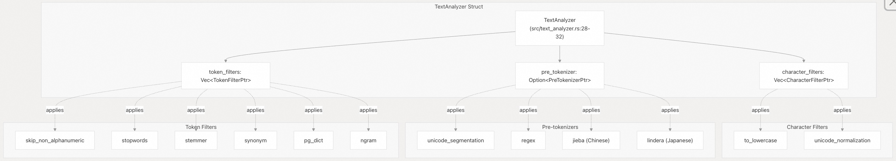
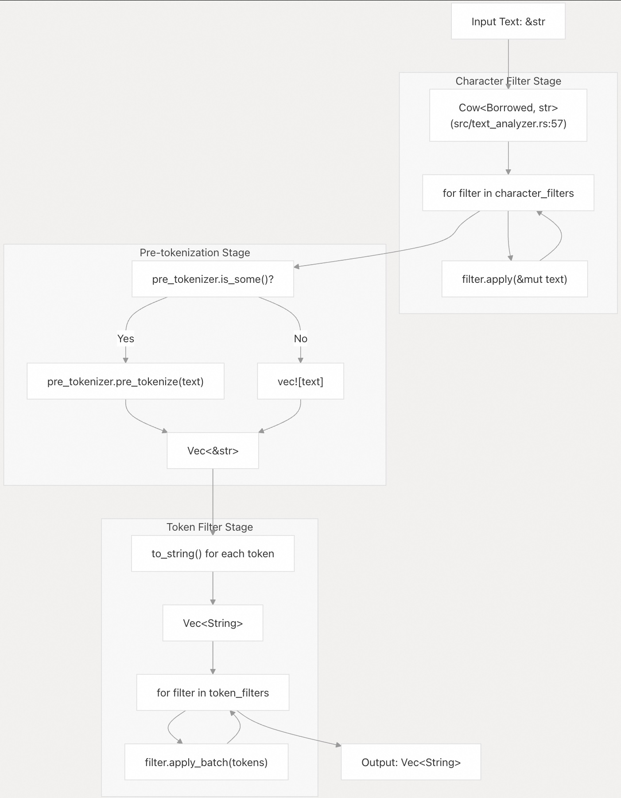
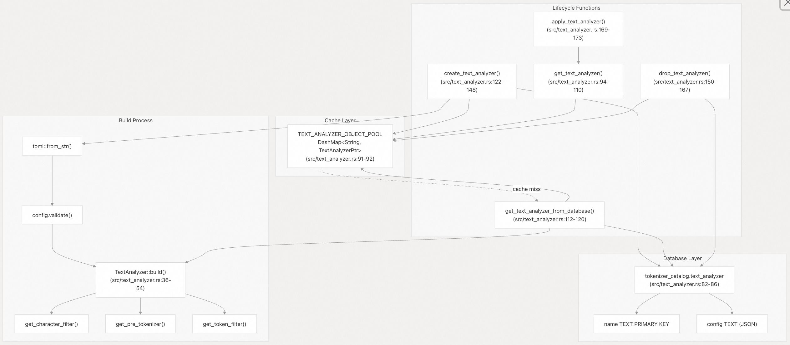

## pg_tokenizer 源码学习: 3.4 文本分析器 (Text Analyzers)  
                                                                      
### 作者                                                                      
digoal                                                                      
                                                                      
### 日期                                                                      
2025-11-14                                                                     
                                                                      
### 标签                                                                      
pg\_tokenizer , 词化 , bert , 标记化 , Tokenization                                                                  
                                                                      
----                                                                      
                                                                      
## 背景               
**文本分析器 (Text Analyzers)** 是可配置的**管线 (pipelines)**，用于协调 **pg\_tokenizer** 中的文本处理。它们定义了原始文本如何通过一系列**字符过滤器 (character filters)**、**预分词器 (pre-tokenizers)** 和**分词过滤器 (token filters)** 转换为**规范化分词 (normalized tokens)**。文本分析器充当**处理层 (processing layer)**，用于在**模型 (models)** 进行**词汇编码 (vocabulary encoding)** 之前准备文本。  
  
## 概述 (Overview)  
  
**文本分析器 (text analyzer)** 是一个由三个有序阶段组成的**可组合管线 (composable pipeline)**：  
  
1.  **字符过滤器 (Character Filters)**：在**字符级别 (character level)** 转换输入文本（例如，**转小写 (lowercasing)**、**规范化 (normalization)**）  
2.  **预分词器 (Pre-tokenizer)**：将转换后的文本拆分为初始的**分词边界 (token boundaries)**  
3.  **分词过滤器 (Token Filters)**：处理和改进**分词流 (token stream)**（例如，删除**停用词 (stopwords)**、**词干提取 (stemming)**）  
  
文本分析器可以独立地通过 `apply_text_analyzer()` 函数使用，也可以集成到分词器中以在模型编码之前提供文本预处理。  
  
来源: [`src/text_analyzer.rs` 1-78](https://github.com/tensorchord/pg_tokenizer.rs/blob/d3f7a577/src/text_analyzer.rs#L1-L78) [`docs/05-text-analyzer.md` 1-8](https://github.com/tensorchord/pg_tokenizer.rs/blob/d3f7a577/docs/05-text-analyzer.md#L1-L8)  
  
## 架构 (Architecture)  
  
### 文本分析器组件 (Text Analyzer Components)  
  
  
  
`TextAnalyzer` **结构体 (struct)** [`src/text_analyzer.rs` 28-32](https://github.com/tensorchord/pg_tokenizer.rs/blob/d3f7a577/src/text_analyzer.rs#L28-L32) 包含**过滤器指针 (filter pointers)** 的向量，允许多个相同类型的过滤器按顺序应用。**预分词器 (pre-tokenizer)** 是**可选的 (optional)**，因为某些**模型 (models)** 包含**内置分词 (built-in tokenization)** 功能。  
  
来源: [`src/text_analyzer.rs` 28-32](https://github.com/tensorchord/pg_tokenizer.rs/blob/d3f7a577/src/text_analyzer.rs#L28-L32) [`docs/05-text-analyzer.md` 9-32](https://github.com/tensorchord/pg_tokenizer.rs/blob/d3f7a577/docs/05-text-analyzer.md#L9-L32)  
  
### 配置结构 (Configuration Structure)  
  
文本分析器使用 **TOML** 配置定义，并作为 **JSON** 存储在**数据库 (database)** 中。该配置被**反序列化 (deserialized)** 为一个 `TextAnalyzerConfig` **结构体 (struct)**：  
  
| 字段 (Field) | 类型 (Type) | 描述 (Description) | 必需 (Required) |  
| :--- | :--- | :--- | :--- |  
| `character_filters` | `Vec<CharacterFilterConfig>` | **字符级别转换 (character-level transformations)** 的有序列表 | 否（**默认值 (default)**：空） |  
| `pre_tokenizer` | `Option<PreTokenizerConfig>` | **分词边界检测策略 (Token boundary detection strategy)** | 否（**默认值 (default)**：无） |  
| `token_filters` | `Vec<TokenFilterConfig>` | **分词级别转换 (token-level transformations)** 的有序列表 | 否（**默认值 (default)**：空） |  
  
来源: [`src/text_analyzer.rs` 17-26](https://github.com/tensorchord/pg_tokenizer.rs/blob/d3f7a577/src/text_analyzer.rs#L17-L26)  
  
## 处理管线 (Processing Pipeline)  
  
### 经过 apply() 的数据流 (Data Flow Through apply())  
  
  
  
`TextAnalyzer::apply()` **方法 (method)** [`src/text_analyzer.rs` 56-77](https://github.com/tensorchord/pg_tokenizer.rs/blob/d3f7a577/src/text_analyzer.rs#L56-L77) 实现了**顺序管线 (sequential pipeline)**：  
  
1.  **字符过滤 (Character filtering)**：迭代 `character_filters`，将每个过滤器应用于 **写时复制 (copy-on-write)** `Cow` **包装器 (wrapper)** 中的文本，以在未发生修改时最大限度地减少**分配 (allocations)**  
2.  **预分词 (Pre-tokenization)**：如果存在，则**有条件地 (Conditionally)** 应用**预分词器 (pre-tokenizer)**，否则将整个文本视为**单个分词 (single token)**  
3.  **分词过滤 (Token filtering)**：将**分词 (tokens)** 转换为**拥有的字符串 (owned strings)**，并使用 `apply_batch()` 按顺序应用每个**分词过滤器 (token filter)**  
  
来源: [`src/text_analyzer.rs` 56-77](https://github.com/tensorchord/pg_tokenizer.rs/blob/d3f7a577/src/text_analyzer.rs#L56-L77)  
  
### 示例处理流程 (Example Processing Flow)  
  
给定此配置：  
  
```  
pre_tokenizer = "unicode_segmentation"  
[[character_filters]]  
to_lowercase = {}  
[[token_filters]]  
stopwords = "nltk_english"  
[[token_filters]]  
stemmer = "english_porter2"  
```  
  
文本 "PostgreSQL is POWERFUL" 流经管线：  
  
| 阶段 (Stage) | 输入 (Input) | 输出 (Output) |  
| :--- | :--- | :--- |  
| 字符过滤器 (**转小写 (lowercase)**) | `"PostgreSQL is POWERFUL"` | `"postgresql is powerful"` |  
| 预分词器 (**unicode\_segmentation**) | `"postgresql is powerful"` | `["postgresql", "is", "powerful"]` |  
| 分词过滤器 (**停用词 (stopwords)**) | `["postgresql", "is", "powerful"]` | `["postgresql", "powerful"]` |  
| 分词过滤器 (**词干提取器 (stemmer)**) | `["postgresql", "powerful"]` | `["postgresql", "power"]` |  
  
来源: [`docs/04-usage.md` 28-41](https://github.com/tensorchord/pg_tokenizer.rs/blob/d3f7a577/docs/04-usage.md#L28-L41) [`docs/03-examples.md` 50-63](https://github.com/tensorchord/pg_tokenizer.rs/blob/d3f7a577/docs/03-examples.md#L50-L63)  
  
## 存储和生命周期 (Storage and Lifecycle)  
  
### 数据库和缓存架构 (Database and Cache Architecture)  
  
  
  
### 存储机制 (Storage Mechanism)  
  
文本分析器使用**两层存储系统 (two-tier storage system)**：  
  
1.  **持久化存储 (Persistent storage)**：`tokenizer_catalog.text_analyzer` **表 (table)** [`src/text_analyzer.rs` 82-86](https://github.com/tensorchord/pg_tokenizer.rs/blob/d3f7a577/src/text_analyzer.rs#L82-L86) 将配置存储为 **JSON**，从而实现**跨会话持久性 (cross-session persistence)**  
2.  **内存缓存 (In-memory cache)**：`TEXT_ANALYZER_OBJECT_POOL` [`src/text_analyzer.rs` 91-92](https://github.com/tensorchord/pg_tokenizer.rs/blob/d3f7a577/src/text_analyzer.rs#L91-L92) 是一个**线程安全 (thread-safe)** 的 `DashMap`，用于**缓存 (caches)** **已构建 (built)** 的 `TextAnalyzer` **实例 (instances)** 以实现**快速检索 (fast retrieval)**  
  
来源: [`src/text_analyzer.rs` 80-92](https://github.com/tensorchord/pg_tokenizer.rs/blob/d3f7a577/src/text_analyzer.rs#L80-L92)  
  
### 创建过程 (Creation Process)  
  
`create_text_analyzer()` **函数 (function)** [`src/text_analyzer.rs` 122-148](https://github.com/tensorchord/pg_tokenizer.rs/blob/d3f7a577/src/text_analyzer.rs#L122-L148) 执行以下步骤：  
  
1.  将 **TOML 配置 (TOML configuration)** **解析 (Parse)** 为 `TextAnalyzerConfig`  
2.  使用 `validator` **包 (crate)** **验证 (Validate)** 配置  
3.  通过**解析过滤器引用 (resolving filter references)** 来**构建 (Build)** `TextAnalyzer` **实例 (instance)**  
4.  将配置**序列化 (Serialize configuration)** 为 **JSON** 以进行**数据库存储 (database storage)**  
5.  **插入 (Insert)** 到 `tokenizer_catalog.text_analyzer` **表 (table)** 中，并进行**冲突检测 (conflict detection)**  
6.  将**已构建实例 (built instance)** **缓存 (Cache)** 到 `TEXT_ANALYZER_OBJECT_POOL` 中  
  
该**函数 (function)** 在 **pgrx** 中被标记为 `volatile` 和 `parallel_safe`，允许**并发创建 (concurrent creation)**，同时确保正确的**事务语义 (transaction semantics)**。  
  
来源: [`src/text_analyzer.rs` 122-148](https://github.com/tensorchord/pg_tokenizer.rs/blob/d3f7a577/src/text_analyzer.rs#L122-L148)  
  
### 检索过程 (Retrieval Process)  
  
`get_text_analyzer()` **函数 (function)** [`src/text_analyzer.rs` 94-110](https://github.com/tensorchord/pg_tokenizer.rs/blob/d3f7a577/src/text_analyzer.rs#L94-L110) 实现了**缓存优先查找 (cache-first lookup)**：  
  
1.  **快速路径 (Fast path)**：检查 `TEXT_ANALYZER_OBJECT_POOL` 中是否存在**缓存实例 (cached instance)**  
2.  **慢速路径 (Slow path)**：如果**缓存未命中 (cache miss)**，则获取一个**空闲条目 (vacant entry)** 并调用 `get_text_analyzer_from_database()`  
3.  **数据库查找 (Database lookup)**：**查询 (Query)** `tokenizer_catalog.text_analyzer` 以获取**配置 (configuration)** [`src/text_analyzer.rs` 112-120](https://github.com/tensorchord/pg_tokenizer.rs/blob/d3f7a577/src/text_analyzer.rs#L112-L120)  
4.  **构建和缓存 (Build and cache)**：**反序列化 (Deserialize)** **JSON**，**构建 (build)** **分析器 (analyzer)**，**插入 (insert)** 到**缓存 (cache)** 中，并**返回 (return)**  
  
如果未找到**分析器名称 (analyzer name)**，该**函数 (function)** 会**宕机 (panics)**，因为这表明存在应在**开发 (development)** 过程中捕获的**配置错误 (configuration error)**。  
  
来源: [`src/text_analyzer.rs` 94-120](https://github.com/tensorchord/pg_tokenizer.rs/blob/d3f7a577/src/text_analyzer.rs#L94-L120)  
  
## 配置示例 (Configuration Examples)  
  
### 基本配置 (Basic Configuration)  
  
仅包含**预分词 (pre-tokenization)** 的最小**文本分析器 (text analyzer)**：  
  
```toml  
pre_tokenizer = "unicode_segmentation"  
```  
  
### 多阶段管线 (Multi-stage Pipeline)  
  
用于**英语文本处理 (English text processing)** 的完整**管线 (pipeline)**：  
  
```toml  
pre_tokenizer = "unicode_segmentation"  
  
[[character_filters]]  
to_lowercase = {}  
  
[[character_filters]]  
unicode_normalization = "nfkd"  
  
[[token_filters]]  
skip_non_alphanumeric = {}  
  
[[token_filters]]  
stopwords = "nltk_english"  
  
[[token_filters]]  
stemmer = "english_porter2"  
```  
  
### 语言特定配置 (Language-specific Configurations)  
  
**中文 (Jieba)**：  
  
```toml  
[pre_tokenizer.jieba]  
mode = "search"  
hmm = true  
```  
  
**日语 (Lindera)**：**文本分析器 (text analyzers)** 不直接支持；**Lindera 模型 (Lindera models)** 将**预分词 (pre-tokenization)** 和**过滤 (filtering)** 组合在**单个模型配置 (single model configuration)** 中。  
  
来源: [`docs/04-usage.md` 28-41](https://github.com/tensorchord/pg_tokenizer.rs/blob/d3f7a577/docs/04-usage.md#L28-L41) [`docs/03-examples.md` 98-102](https://github.com/tensorchord/pg_tokenizer.rs/blob/d3f7a577/docs/03-examples.md#L98-L102)  
  
## 使用模式 (Usage Patterns)  
  
### 独立使用 (Standalone Usage)  
  
**文本分析器 (Text analyzers)** 可以**独立地 (independently)** 用于**分词文本 (tokenize text)**，无需**模型编码 (model encoding)**：  
  
```sql  
-- Create analyzer  
SELECT create_text_analyzer('my_analyzer', $$  
pre_tokenizer = "unicode_segmentation"  
[[character_filters]]  
to_lowercase = {}  
$$);  
  
-- Apply analyzer  
SELECT apply_text_analyzer('PostgreSQL is POWERFUL', 'my_analyzer');  
-- Returns: {postgresql,is,powerful}  
```  
  
来源: [`src/text_analyzer.rs` 169-173](https://github.com/tensorchord/pg_tokenizer.rs/blob/d3f7a577/src/text_analyzer.rs#L169-L173) [`docs/05-text-analyzer.md` 58-60](https://github.com/tensorchord/pg_tokenizer.rs/blob/d3f7a577/docs/05-text-analyzer.md#L58-L60)  
  
### 与分词器的集成 (Integration with Tokenizers)  
  
**文本分析器 (Text analyzers)** 通常在**分词器配置 (tokenizer configurations)** 中被**引用 (referenced)**：  
  
```sql  
-- Create analyzer first  
SELECT create_text_analyzer('text_analyzer1', $$  
pre_tokenizer = "unicode_segmentation"  
[[token_filters]]  
stopwords = "nltk_english"  
$$);  
  
-- Reference in tokenizer  
SELECT create_tokenizer('tokenizer1', $$  
text_analyzer = "text_analyzer1"  
model = "llmlingua2"  
$$);  
```  
  
或者，**文本分析器配置 (text analyzer configuration)** 可以直接**内联 (inlined)** 在**分词器定义 (tokenizer definitions)** 中：  
  
```sql  
SELECT create_tokenizer('tokenizer1', $$  
-- Inline text analyzer config  
pre_tokenizer = "unicode_segmentation"  
[[character_filters]]
to_lowercase = {}  
-- Model config  
model = "model1"  
$$);  
```  
  
来源: [`docs/04-usage.md` 98-135](https://github.com/tensorchord/pg_tokenizer.rs/blob/d3f7a577/docs/04-usage.md#L98-L135)  
  
### 自定义词典 (Custom Dictionaries)  
  
**文本分析器 (Text analyzers)** 支持**自定义停用词 (custom stopword)** 和**同义词词典 (synonym dictionaries)**：  
  
```sql  
-- Create custom stopword list  
SELECT create_stopwords('my_stops', $$  
the  
is  
and  
$$);  
  
-- Use in analyzer  
SELECT create_text_analyzer('custom_analyzer', $$  
pre_tokenizer = "unicode_segmentation"  
[[token_filters]]  
stopwords = "my_stops"  
$$);  
```  
  
来源: [`docs/05-text-analyzer.md` 38-79](https://github.com/tensorchord/pg_tokenizer.rs/blob/d3f7a577/docs/05-text-analyzer.md#L38-L79)  
  
## 集成点 (Integration Points)  
  
| 组件 (Component) | 集成方法 (Integration Method) | 描述 (Description) |  
| :--- | :--- | :--- |  
| **分词器 (Tokenizers)** | 按名称引用或**内联 (inlined)** | 在**模型编码 (model encoding)** 之前**预处理文本 (Preprocesses text)** |  
| **自定义模型 (Custom Models)** | 在**词汇构建 (vocabulary building)** 期间使用 | 为**语料库分析 (corpus analysis)** 生成**分词 (tokens)** |  
| `apply_text_analyzer()` | **直接函数调用 (Direct function call)** | 没有**模型 (model)** 的**独立分词 (Standalone tokenization)** |  
| **字符过滤器 (Character Filters)** | **在初始化期间构建 (Built during initialization)** | 通过 `get_character_filter()` **解析 (Resolved)** |  
| **预分词器 (Pre-tokenizers)** | **在初始化期间构建 (Built during initialization)** | 通过 `get_pre_tokenizer()` **解析 (Resolved)** |  
| **分词过滤器 (Token Filters)** | **在初始化期间构建 (Built during initialization)** | 通过 `get_token_filter()` **解析 (Resolved)** |  
  
`TextAnalyzer::build()` **方法 (method)** [`src/text_analyzer.rs` 36-54](https://github.com/tensorchord/pg_tokenizer.rs/blob/d3f7a577/src/text_analyzer.rs#L36-L54) 在**构建 (construction)** 过程中**解析 (resolves)** 所有**组件引用 (component references)**，创建了一个无需进一步**配置查找 (configuration lookups)** 即可使用的**即用型管线 (ready-to-use pipeline)**。  
  
来源: [`src/text_analyzer.rs` 36-54](https://github.com/tensorchord/pg_tokenizer.rs/blob/d3f7a577/src/text_analyzer.rs#L36-L54) [`docs/04-usage.md` 68-90](https://github.com/tensorchord/pg_tokenizer.rs/blob/d3f7a577/docs/04-usage.md#L68-L90)  
      
#### [PolarDB 学习图谱](https://www.aliyun.com/database/openpolardb/activity "8642f60e04ed0c814bf9cb9677976bd4")
  
  
#### [PostgreSQL 解决方案集合](../201706/20170601_02.md "40cff096e9ed7122c512b35d8561d9c8")
  
  
#### [德哥 / digoal's Github - 公益是一辈子的事.](https://github.com/digoal/blog/blob/master/README.md "22709685feb7cab07d30f30387f0a9ae")
  
  
#### [About 德哥](https://github.com/digoal/blog/blob/master/me/readme.md "a37735981e7704886ffd590565582dd0")
  
  

  
