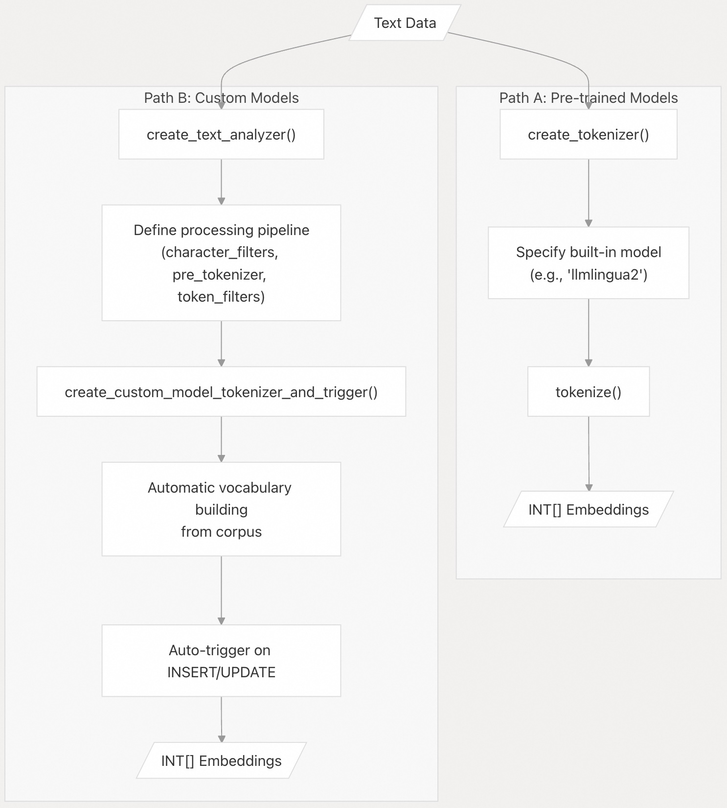
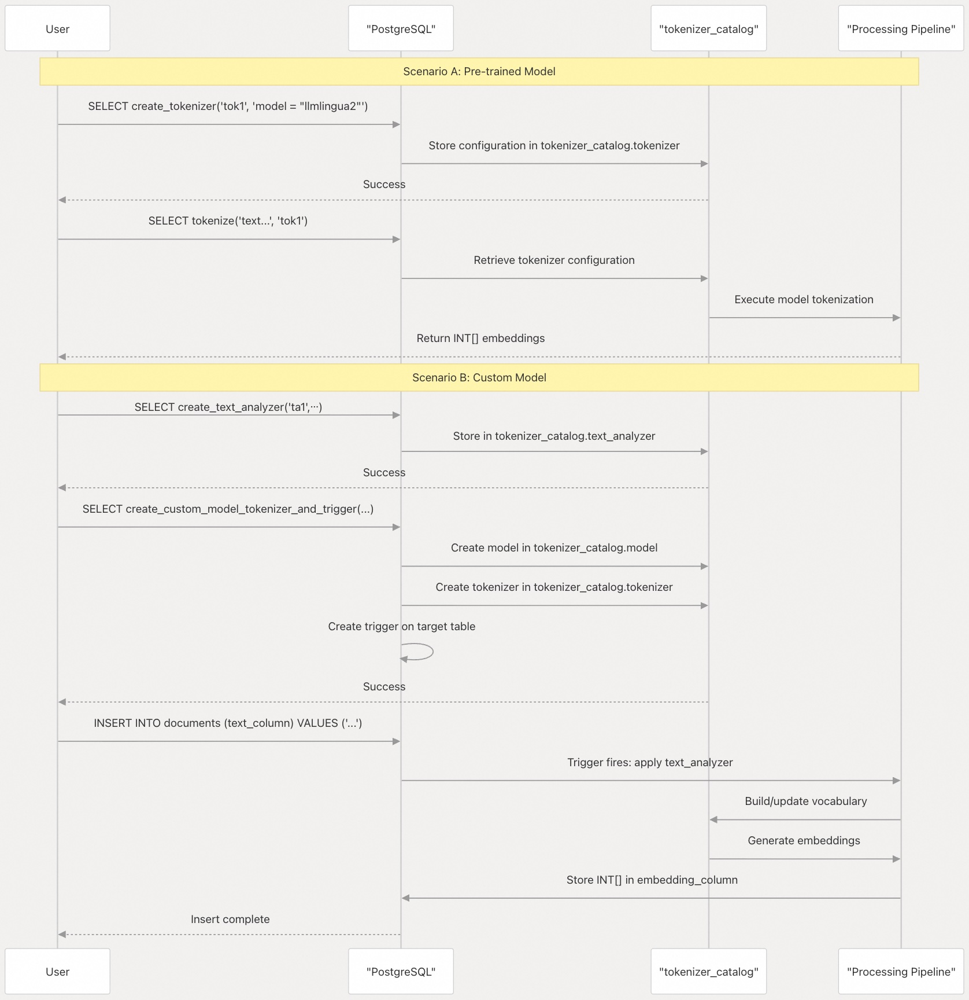

## pg_tokenizer 源码学习: 4 入门指南 (Getting Started)  
                                                                        
### 作者                                                                        
digoal                                                                        
                                                                        
### 日期                                                                        
2025-11-17                                                                       
                                                                        
### 标签                                                                        
pg\_tokenizer , 词化 , bert , 标记化 , Tokenization                                                                    
                                                                        
----                                                                        
                                                                        
## 背景                 
本节提供了在 **PostgreSQL** 中使用 **pg\_tokenizer** 进行文本处理和**词元化 (Tokenization)** 的实用指南。涵盖基本的工作流程、核心概念以及分步示例，以帮助您创建**词元化器 (Tokenizers)** 并从文本数据中生成**嵌入 (Embeddings)**。  
  
本指南假设您已安装 **pg\_tokenizer** 并启用了该扩展。  
  
## 先决条件 (Prerequisites)  
  
在继续之前，请确保您已满足以下条件：  
  
1.  正在运行且已安装 **pg\_tokenizer** 扩展的 **PostgreSQL** 服务器  
  
2.  在您的数据库中启用了扩展：  
  
    ```sql  
    CREATE EXTENSION pg_tokenizer;  
    ```  
  
3.  `tokenizer_catalog` 模式 (Schema) 可用（由扩展自动创建）  
  
4.  具有足够权限创建对象的数据库连接  
  
来源: [`README.md` 30-34](https://github.com/tensorchord/pg_tokenizer.rs/blob/d3f7a577/README.md#L30-L34) [`docs/04-usage.md` 1-16](https://github.com/tensorchord/pg_tokenizer.rs/blob/d3f7a577/docs/04-usage.md#L1-L16)  
  
## 核心工作流程概览 (Core Workflow Overview)  
  
**pg\_tokenizer** 根据您的要求提供两种主要的工作流程：  
  
  
  
| 路径 (Path) | 描述 (Description) |  
| :--- | :--- |  
| **路径 A (Path A)** | **Tokenizer** 内部使用**预训练模型 (Pre-trained Model)**，直接调用 `tokenize()` **SQL** 函数。 |  
| **路径 B (Path B)** | 使用 **Text Analyzer** **流水线 (Pipeline)** 自定义**词元化 (Tokenization)** 规则，并可以选择通过**触发器 (Triggers)** 自动更新**嵌入 (Embeddings)**。 |  
  
**路径 A** 是以下情况的理想选择：  
  
  * 您需要标准的**词元化 (Tokenization)** 模式（**BERT**、**Wiki Token** 等）  
  * 您希望立即获得结果，无需训练  
  * 您的文本领域与**预训练模型 (Pre-trained Models)** 相匹配  
  
**路径 B** 是以下情况的理想选择：  
  
  * 您拥有特定领域的词汇表  
  * 您需要自定义的文本处理规则  
  * 您希望通过**触发器 (Triggers)** 自动更新**嵌入 (Embedding)**  
  
来源: [`docs/04-usage.md` 1-66](https://github.com/tensorchord/pg_tokenizer.rs/blob/d3f7a577/docs/04-usage.md#L1-L66) [`docs/03-examples.md` 1-87](https://github.com/tensorchord/pg_tokenizer.rs/blob/d3f7a577/docs/03-examples.md#L1-L87)  
  
## 您的第一个词元化器 (Your First Tokenizer)  
  
### 示例 1：使用预训练模型 (Using a Pre-trained Model)  
  
最简单的入门方法是使用内置模型：  
  
```sql  
-- Create tokenizer using llmlingua2 model  
SELECT create_tokenizer('my_tokenizer', $$  
model = "llmlingua2"  
$$);  
  
-- Tokenize text  
SELECT tokenize(  
    'PostgreSQL is a powerful, open-source object-relational database system.',  
    'my_tokenizer'  
);  
```  
  
这将返回一个 `INT[]` 数组，表示来自 `llmlingua2` 词汇表的**词元 ID (token IDs)**。  
  
### 示例 2：使用 UPDATE 进行批量处理 (Batch Processing with UPDATE)  
  
```sql  
-- Create a table  
CREATE TABLE documents (  
    id SERIAL PRIMARY KEY,  
    text_content TEXT,  
    embeddings INT[]  
);  
  
-- Insert data  
INSERT INTO documents (text_content) VALUES   
    ('Full-text search in PostgreSQL'),  
    ('BM25 ranking algorithm');  
  
-- Generate embeddings for all rows  
UPDATE documents   
SET embeddings = tokenize(text_content, 'my_tokenizer');  
```  
  
来源: [`README.md` 36-44](https://github.com/tensorchord/pg_tokenizer.rs/blob/d3f7a577/README.md#L36-L44) [`docs/03-examples.md` 3-39](https://github.com/tensorchord/pg_tokenizer.rs/blob/d3f7a577/docs/03-examples.md#L3-L39) [`docs/04-usage.md` 3-16](https://github.com/tensorchord/pg_tokenizer.rs/blob/d3f7a577/docs/04-usage.md#L3-L16)  
  
## 理解词元化器组件 (Understanding Tokenizer Components)  
  
下图将 **pg\_tokenizer** 概念映射到其对应的 **SQL** 函数：  
  
  
  
该图显示了面向用户的 **SQL** 函数如何与 `tokenizer_catalog` 模式交互，以存储配置并通过**文本分析器 (Text Analyzer)** 流水线处理文本，从而生成**嵌入 (Embeddings)**。  
  
来源: [`docs/04-usage.md` 68-136](https://github.com/tensorchord/pg_tokenizer.rs/blob/d3f7a577/docs/04-usage.md#L68-L136) [`docs/05-text-analyzer.md` 1-80](https://github.com/tensorchord/pg_tokenizer.rs/blob/d3f7a577/docs/05-text-analyzer.md#L1-L80)  
  
## 常见工作流程 (Common Workflows)  
  
下表总结了常见模式及其对应的函数调用：  
  
| 用例 (Use Case) | 主要函数 (Primary Functions) | 关键配置 (Key Configuration) |  
| :--- | :--- | :--- |  
| 使用内置模型进行快速**词元化 (Tokenization)** | `create_tokenizer()` `tokenize()` | `model = "llmlingua2"` |  
| 从语料库中提取自定义词汇表 | `create_text_analyzer()` `create_custom_model_tokenizer_and_trigger()` | **Text analyzer** 配置 **Source** 表/列 |  
| 中文文本处理 | `create_text_analyzer()` `create_tokenizer()` | `pre_tokenizer = "jieba"` 或 `[pre_tokenizer.jieba]` |  
| 日文文本处理 | `create_lindera_model()` `create_tokenizer()` | **Lindera** 分词器配置 |  
| **HuggingFace** 模型集成 | `create_huggingface_model()` `create_tokenizer()` | `tokenizers.json` 格式 |  
| 自定义**停用词 (stopwords)**/同义词 | `create_stopwords()` `create_synonym()` `create_text_analyzer()` | 字典定义 |  
| 自动**嵌入 (Embedding)** 更新 | `create_custom_model_tokenizer_and_trigger()` | 表名，源/目标列 |  
  
来源: [`docs/04-usage.md` 1-136](https://github.com/tensorchord/pg_tokenizer.rs/blob/d3f7a577/docs/04-usage.md#L1-L136) [`docs/03-examples.md` 1-229](https://github.com/tensorchord/pg_tokenizer.rs/blob/d3f7a577/docs/03-examples.md#L1-L229)  
  
## 函数调用顺序 (Function Call Sequence)  
  
下图说明了不同场景下典型的函数调用顺序：  
  
  
  
来源: [`docs/04-usage.md` 20-66](https://github.com/tensorchord/pg_tokenizer.rs/blob/d3f7a577/docs/04-usage.md#L20-L66) [`docs/03-examples.md` 42-87](https://github.com/tensorchord/pg_tokenizer.rs/blob/d3f7a577/docs/03-examples.md#L42-L87)  
  
## 配置格式 (Configuration Format)  
  
**pg\_tokenizer** 对所有配置使用 **TOML** 格式。以下是每个组件的最小示例：  
  
**文本分析器配置 (Text Analyzer Configuration):**  
  
```toml  
pre_tokenizer = "unicode_segmentation"  
  
[[character_filters]]  
to_lowercase = {}  
  
[[token_filters]]  
stopwords = "nltk_english"  
```  
  
**词元化器配置（预训练模型）(Tokenizer Configuration (Pre-trained)):**  
  
```toml  
model = "llmlingua2"  
```  
  
**词元化器配置（自定义）(Tokenizer Configuration (Custom)):**  
  
```toml  
text_analyzer = "text_analyzer1"  
model = "model1"  
```  
  
**内联配置 (Inline Configuration):**  
  
```sql  
# Combine text analyzer and model in one config  
pre_tokenizer = "unicode_segmentation"  
[[character_filters]]  
to_lowercase = {}  
model = "llmlingua2"  
```  
  
来源: [`docs/04-usage.md` 92-136](https://github.com/tensorchord/pg_tokenizer.rs/blob/d3f7a577/docs/04-usage.md#L92-L136) [`docs/05-text-analyzer.md` 1-80](https://github.com/tensorchord/pg_tokenizer.rs/blob/d3f7a577/docs/05-text-analyzer.md#L1-L80)  
  
## 模型和分析器存储 (Model and Analyzer Storage)  
  
所有配置都持久化在 `tokenizer_catalog` 模式中：  
  
| 表 (Table) | 用途 (Purpose) | 创建函数 (Created By) |  
| :--- | :--- | :--- |  
| `tokenizer_catalog.tokenizer` | 存储**词元化器 (Tokenizer)** 配置 | `create_tokenizer()` |  
| `tokenizer_catalog.model` | 存储模型定义 | `create_*_model()` 函数 |  
| `tokenizer_catalog.text_analyzer` | 存储**文本分析器 (Text Analyzer)** 流水线 | `create_text_analyzer()` |  
| `tokenizer_catalog.dictionary` | 存储自定义词典 | `create_stopwords()`、`create_synonym()` |  
  
您可以直接查询这些表来检查配置：  
  
```sql  
-- List all tokenizers  
SELECT name, config FROM tokenizer_catalog.tokenizer;  
  
-- List all models  
SELECT name, model_type FROM tokenizer_catalog.model;  
  
-- List all text analyzers  
SELECT name FROM tokenizer_catalog.text_analyzer;  
```  
  
来源: [`docs/04-usage.md` 68-90](https://github.com/tensorchord/pg_tokenizer.rs/blob/d3f7a577/docs/04-usage.md#L68-L90)  
  
## 下一步 (Next Steps)  
  
现在您已了解基本概念和工作流程，可继续查看后面的章节：  
  
  * **快速入门 (Quick Start)** ：即时开始**词元化 (Tokenization)** 的最小工作示例  
  * **创建文本分析器 (Creating Text Analyzers)** ：关于配置**字符过滤器 (character filters)**、**预词元化器 (pre-tokenizers)** 和**词元过滤器 (token filters)** 的详细指南  
  * **使用内置模型 (Working with Built-in Models)** ：使用 **BERT**、`llmlingua2` 和 `wiki_tocken` 等**预训练模型 (pre-trained models)**  
  * **基本词元化 (Basic Tokenization)** ：关于 `tokenize()` 函数和**批量处理 (batch processing)** 的完整参考  
  
来源: [`README.md` 48-57](https://github.com/tensorchord/pg_tokenizer.rs/blob/d3f7a577/README.md#L48-L57) [`docs/04-usage.md` 1-136](https://github.com/tensorchord/pg_tokenizer.rs/blob/d3f7a577/docs/04-usage.md#L1-L136)  
    
#### [PolarDB 学习图谱](https://www.aliyun.com/database/openpolardb/activity "8642f60e04ed0c814bf9cb9677976bd4")
  
  
#### [PostgreSQL 解决方案集合](../201706/20170601_02.md "40cff096e9ed7122c512b35d8561d9c8")
  
  
#### [德哥 / digoal's Github - 公益是一辈子的事.](https://github.com/digoal/blog/blob/master/README.md "22709685feb7cab07d30f30387f0a9ae")
  
  
#### [About 德哥](https://github.com/digoal/blog/blob/master/me/readme.md "a37735981e7704886ffd590565582dd0")
  
  

  
