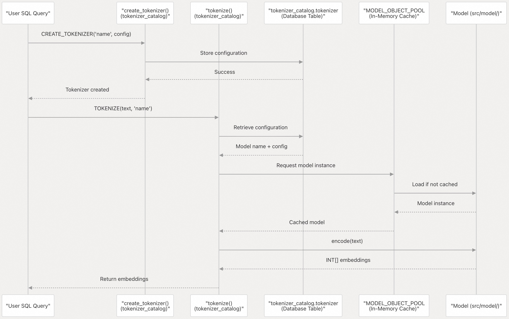
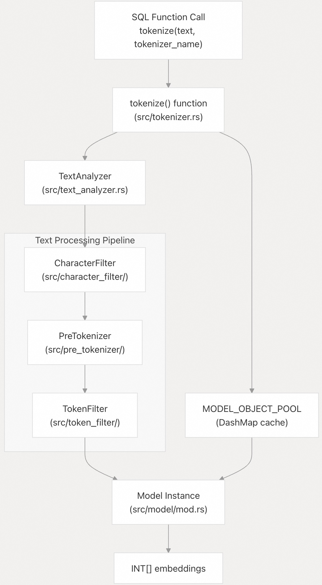

## pg_tokenizer 源码学习: 4.1 快速入门 (Quick Start)  
                                                                          
### 作者                                                                          
digoal                                                                          
                                                                          
### 日期                                                                          
2025-11-17                                                                         
                                                                          
### 标签                                                                          
pg\_tokenizer , 词化 , bert , 标记化 , Tokenization                                                                      
                                                                          
----                                                                          
                                                                          
## 背景                   
本文提供了**最小工作示例 (minimal working examples)**，帮助您立即开始使用 `pg_tokenizer`。您将学习如何启用**扩展 (extension)**、创建您的第一个**分词器 (tokenizer)**，并通过几条 **SQL 命令 (SQL commands)** 将文本转换为**嵌入 (embeddings)**。  
  
## 目的和范围 (Purpose and Scope)  
  
本指南假定您已经通过 Docker、包管理器或从源代码安装了 `pg_tokenizer`。我们专注于使用**内置模型 (built-in models)** 进行文本**分词 (tokenizing text)** 的最快路径。**自定义模型 (custom models)**、**文本分析器 (text analyzers)** 和**自动触发器 (automatic triggers)** 等高级功能将在高级功能 (Advanced Features)中介绍。  
  
## 先决条件 (Prerequisites)  
  
开始之前，请确保：  
  
  * 已安装 `pg_tokenizer` 的 PostgreSQL 服务器正在运行。  
  * 您拥有数据库连接凭据 (credentials)。  
  * `pg_tokenizer` **共享库 (shared library)** 已加载（在 Docker 部署中自动处理）。  
  
## 启用扩展 (Enabling the Extension)  
  
连接到您的 PostgreSQL 数据库并执行：  
  
```sql  
CREATE EXTENSION pg_tokenizer;  
```  
  
此命令会注册**扩展 (extension)**，并创建包含所有配置表和函数的 `tokenizer_catalog` **模式 (schema)**。该模式在首次连接时会自动添加到您的**搜索路径 (search\_path)** 中。  
  
**来源:** [`README.md` 32-34](https://github.com/tensorchord/pg_tokenizer.rs/blob/d3f7a577/README.md#L32-L34)  
  
## 最小工作示例 (Minimal Working Example)  
  
最简单的**分词工作流程 (tokenization workflow)** 需要调用两个 **SQL 函数 (SQL function calls)**：  
  
### 步骤 1: 创建分词器 (Create a Tokenizer)  
  
**分词器 (tokenizer)** 结合了**模型 (model)** 和可选的**文本处理规则 (text processing rules)**。以下是使用**内置模型 (built-in model)** 的最小配置：  
  
```sql  
SELECT tokenizer_catalog.create_tokenizer('my_first_tokenizer', $$  
model = "llmlingua2"  
$$);  
```  
  
这将创建一个名为 `my_first_tokenizer` 的**分词器 (tokenizer)**，使用 `llmlingua2` **内置模型 (built-in model)**。配置以 **TOML 格式 (TOML format)** 指定。  
  
### 步骤 2: 文本分词 (Tokenize Text)  
  
现在将文本转换为**整数嵌入 (integer embeddings)**：  
  
```sql  
SELECT tokenizer_catalog.tokenize(  
    'PostgreSQL is a powerful, open-source object-relational database system.',  
    'my_first_tokenizer'  
);  
```  
  
**预期输出 (Expected Output):**  
  
```  
                                tokenize  
------------------------------------------------------------------------  
 {2695,17603,2015,4160,2140,2373,2330,14768,2278,4874,2128,20051,2291}  
```  
  
输出是一个 PostgreSQL **整数数组 (integer array)**（`INT[]`），表示来自**模型词汇表 (model's vocabulary)** 的**标记 ID (token IDs)**。每个整数对应于模型识别的一个**标记 (token)**（单词或子词单元）。  
  
**来源:** [`README.md` 38-44](https://github.com/tensorchord/pg_tokenizer.rs/blob/d3f7a577/README.md#L38-L44) [`tests/sqllogictest/tokenizer.slt` 5-19](https://github.com/tensorchord/pg_tokenizer.rs/blob/d3f7a577/tests/sqllogictest/tokenizer.slt#L5-L19)  
  
## 函数调用流程 (Function Call Flow)  
  
  
  
**图表: 分词请求流程 (Tokenization Request Flow)**  
  
此图表显示了 **SQL 函数调用 (SQL function calls)** 如何与底层的 **Rust 实现 (underlying Rust implementation)** 交互。`create_tokenizer()` 函数将配置存储在 `tokenizer_catalog.tokenizer` 表中。当调用 `tokenize()` 时，它会检索配置，从**缓存 (cache)** 中获取一个**模型实例 (model instance)**（首次使用时加载），并返回**整数嵌入 (integer embeddings)**。  
  
**来源:** [`src/model/mod.rs`](https://github.com/tensorchord/pg_tokenizer.rs/blob/d3f7a577/src/model/mod.rs) [`README.md` 38-44](https://github.com/tensorchord/pg_tokenizer.rs/blob/d3f7a577/README.md#L38-L44)  
  
## 完整工作示例 (Complete Working Example)  
  
这是一个配置更复杂的完整示例：  
  
```sql  
-- Create a tokenizer with text preprocessing  
SELECT tokenizer_catalog.create_tokenizer('advanced_tokenizer', $$  
model = "bert_base_uncased"  
pre_tokenizer.regex = '(?u)\b\w\w+\b'  
[[character_filters]]  
to_lowercase = {}  
[[token_filters]]  
stopwords = "nltk_english"  
[[token_filters]]  
stemmer = "english_porter2"  
$$);  
  
-- Tokenize with preprocessing pipeline  
SELECT tokenizer_catalog.tokenize(  
    'PostgreSQL is a powerful, open-source object-relational database system. It has over 15 years of active development.',  
    'advanced_tokenizer'  
);  
```  
  
**预期输出 (Expected Output):**  
  
```  
                                              tokenize  
----------------------------------------------------------------------------------------------------  
 {2695,17603,2015,4160,2140,2373,2330,14768,2278,4874,2128,20051,2951,22083,2291,2321,2095,2552,12848,4503}  
```  
  
此配置演示了：  
  
  * **模型 (Model)**：使用 `bert_base_uncased` **词汇表 (vocabulary)**  
  * **预分词器 (Pre-tokenizer)**：**正则表达式模式 (Regex pattern)** 将文本拆分为单词边界  
  * **字符过滤器 (Character Filter)**：在**分词 (tokenization)** 之前将文本转换为**小写 (lowercase)**  
  * **标记过滤器 (Token Filters)**：移除英语**停用词 (stopwords)**，应用 **Porter2 词干提取 (stemming)** 算法  
  
**文本处理管道 (text processing pipeline)** 按顺序执行：**字符过滤器 (character filters)** → **预分词器 (pre-tokenizer)** → **标记过滤器 (token filters)** → **模型编码 (model encoding)**。  
  
**来源:** [`tests/sqllogictest/tokenizer.slt` 5-19](https://github.com/tensorchord/pg_tokenizer.rs/blob/d3f7a577/tests/sqllogictest/tokenizer.slt#L5-L19)  
  
## 组件交互映射 (Component Interaction Map)  
  
  
  
**图表: 分词的代码实体映射 (Code Entity Mapping for Tokenization)**  
  
此图表将 **SQL 接口 (SQL interface)** 映射到特定的 **Rust 模块 (Rust modules)** 和**类型 (types)**。当您调用 `tokenize()` 时，该函数会检索一个 `TextAnalyzer` **实例 (instance)**，该实例通过 `CharacterFilter`、`PreTokenizer` 和 `TokenFilter` **实现 (implementations)** 来协调**管道 (pipeline)**。最终的**标记 (tokens)** 由从 `MODEL_OBJECT_POOL` 检索到的 `Model` **实例 (instance)** 进行**编码 (encoded)**。  
  
**来源:** [`src/tokenizer.rs`](https://github.com/tensorchord/pg_tokenizer.rs/blob/d3f7a577/src/tokenizer.rs) [`src/text_analyzer.rs`](https://github.com/tensorchord/pg_tokenizer.rs/blob/d3f7a577/src/text_analyzer.rs) [`src/model/mod.rs`](https://github.com/tensorchord/pg_tokenizer.rs/blob/d3f7a577/src/model/mod.rs) [`src/character_filter/`](https://github.com/tensorchord/pg_tokenizer.rs/blob/d3f7a577/src/character_filter/) [`src/pre_tokenizer/mod.rs`](https://github.com/tensorchord/pg_tokenizer.rs/blob/d3f7a577/src/pre_tokenizer/mod.rs) [`src/token_filter/`](https://github.com/tensorchord/pg_tokenizer.rs/blob/d3f7a577/src/token_filter/)  
  
## 可用内置模型 (Built-in Models Available)  
  
该**扩展 (extension)** 包含多个可立即使用的**预训练模型 (pre-trained models)**：  
  
| 模型名称 (Model Name) | 描述 (Description) | 用例 (Use Case) |  
| :--- | :--- | :--- |  
| `llmlingua2` | 针对压缩优化的**分词器 (tokenizer)** | **通用文本处理 (General text processing)** |  
| `bert_base_uncased` | BERT **基础词汇表 (base vocabulary)**，小写 | 英语文本，**不区分大小写 (case-insensitive)** |  
| `gemma2b` | Gemma 2B **词汇表 (vocabulary)** | **现代 LLM 应用 (Modern LLM applications)** |  
| `wiki_tocken` | 经过 **Wikipedia 训练 (Wikipedia-trained)** 的**分词器 (tokenizer)** | **通用知识文本 (General knowledge text)** |  
  
要使用任何**内置模型 (built-in model)**，只需在您的**分词器配置 (tokenizer configuration)** 的 `model` 字段中指定即可。无需额外的设置或下载。  
  
**来源:** [`src/model/builtin.rs`](https://github.com/tensorchord/pg_tokenizer.rs/blob/d3f7a577/src/model/builtin.rs)  
  
## 理解输出 (Understanding the Output)  
  
`tokenize()` 函数返回一个 PostgreSQL `INT[]` **数组 (array)**，其中：  
  
  * 每个整数代表来自**模型词汇表 (model's vocabulary)** 的一个**标记 ID (token ID)**  
  * 对于相同的输入，**标记 ID (Token IDs)** 是**顺序且确定性 (sequential and deterministic)** 的  
  * **数组长度 (The array length)** 对应于处理后的**标记 (tokens)** 数量  
  * **标记 ID (Token IDs)** 可以直接存储在 PostgreSQL **列 (columns)** 中以实现高效检索  
  
### 存储示例 (Storage Example)  
  
```sql  
-- Create table with embedding column  
CREATE TABLE documents (  
    id SERIAL PRIMARY KEY,  
    content TEXT,  
    embeddings INT[]  
);  
  
-- Store tokenized embeddings  
INSERT INTO documents (content, embeddings)  
VALUES (  
    'PostgreSQL is a powerful database system.',  
    tokenizer_catalog.tokenize('PostgreSQL is a powerful database system.', 'my_first_tokenizer')  
);  
```  
  
对于 `INSERT`/`UPDATE` 上的**自动嵌入生成 (automatic embedding generation)**，请参阅使用触发器自动嵌入 (Automatic Embeddings with Triggers)章节。  
  
**来源:** [`tests/sqllogictest/tokenizer.slt` 17-19](https://github.com/tensorchord/pg_tokenizer.rs/blob/d3f7a577/tests/sqllogictest/tokenizer.slt#L17-L19)  
  
## 预分词器选项 (Pre-tokenizer Options)  
  
虽然最小示例使用了**默认预分词器 (default pre-tokenizer)**，但您可以指定不同的**策略 (strategies)**：  
  
| 预分词器 (Pre-tokenizer) | 配置 (Configuration) | 用例 (Use Case) |  
| :--- | :--- | :--- |  
| **Unicode 分段 (Unicode Segmentation)** | `pre_tokenizer = "unicode_segmentation"` | 西方语言 (Western languages) |  
| **正则表达式模式 (Regex Pattern)** | `pre_tokenizer.regex = '(?u)\b\w\w+\b'` | **自定义词边界 (Custom word boundaries)** |  
| **结巴分词 (Jieba)** | `pre_tokenizer.jieba = { mode = "search" }` | **中文文本分段 (Chinese text segmentation)** |  
  
有关**预分词器 (pre-tokenizers)** 和其他**管道组件 (pipeline components)** 的详细配置，请参阅创建文本分析器 (Creating Text Analyzers)章节。  
  
**来源:** [`src/pre_tokenizer/mod.rs` 17-31](https://github.com/tensorchord/pg_tokenizer.rs/blob/d3f7a577/src/pre_tokenizer/mod.rs#L17-L31) [`src/pre_tokenizer/jieba.rs` 10-33](https://github.com/tensorchord/pg_tokenizer.rs/blob/d3f7a577/src/pre_tokenizer/jieba.rs#L10-L33) [`tests/sqllogictest/text_analyzer.slt` 5-17](https://github.com/tensorchord/pg_tokenizer.rs/blob/d3f7a577/tests/sqllogictest/text_analyzer.slt#L5-L17)  
  
## 验证 (Verification)  
  
要验证您的**分词器 (tokenizer)** 是否正常工作：  
  
```sql  
-- List all tokenizers  
SELECT name FROM tokenizer_catalog.tokenizer;  
  
-- View tokenizer configuration  
SELECT name, config FROM tokenizer_catalog.tokenizer WHERE name = 'my_first_tokenizer';  
  
-- Test with sample text  
SELECT tokenizer_catalog.tokenize('test', 'my_first_tokenizer');  
```  
  
如果任何命令失败，请确保**扩展 (extension)** 已正确安装和加载。检查 PostgreSQL **日志 (logs)** 以获取错误消息。  
  
## 后续步骤 (Next Steps)  
  
既然您已经创建并使用了您的第一个**分词器 (tokenizer)**，接下来可以探索后面的章节：  
  
  * **创建文本分析器 (Creating Text Analyzers)** ：使用**字符过滤器 (character filters)**、**预分词器 (pre-tokenizers)** 和**标记过滤器 (token filters)** 构建**自定义文本处理管道 (custom text processing pipelines)**  
  * **使用内置模型 (Working with Built-in Models)** ：所有**预训练模型 (pre-trained models)** 及其特征的详细文档  
  * **自定义模型 (Custom Models)** ：创建在您自己的**语料库数据 (corpus data)** 上训练的**分词器 (tokenizers)**  
  * **使用触发器自动嵌入 (Automatic Embeddings with Triggers)** ：设置**数据库触发器 (database triggers)** 以**自动维护嵌入 (automatically maintain embeddings)**  
  * **语言特定处理 (Language-Specific Processing)** ：优化英语、中文或日文文本的**分词 (tokenization)**  
  
**来源:** [`README.md` 46-57](https://github.com/tensorchord/pg_tokenizer.rs/blob/d3f7a577/README.md#L46-L57)  
    
#### [PolarDB 学习图谱](https://www.aliyun.com/database/openpolardb/activity "8642f60e04ed0c814bf9cb9677976bd4")
  
  
#### [PostgreSQL 解决方案集合](../201706/20170601_02.md "40cff096e9ed7122c512b35d8561d9c8")
  
  
#### [德哥 / digoal's Github - 公益是一辈子的事.](https://github.com/digoal/blog/blob/master/README.md "22709685feb7cab07d30f30387f0a9ae")
  
  
#### [About 德哥](https://github.com/digoal/blog/blob/master/me/readme.md "a37735981e7704886ffd590565582dd0")
  
  

  
